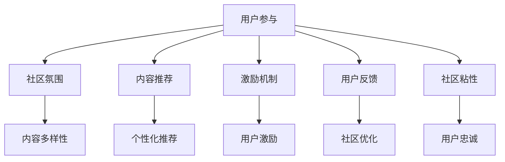

                 

## 1. 背景介绍

### 1.1 问题由来
随着互联网的普及和社交媒体的兴起，注意力经济（Attention Economy）成为了一个重要的经济和社会现象。注意力经济指的是在信息过载的时代，如何吸引并有效利用用户注意力以创造经济价值的过程。在线社区作为互联网用户集聚的场所，不仅为内容创作者提供了一个展示才华的平台，也为用户提供了获取知识和娱乐的途径。因此，如何在在线社区中吸引并留住忠实的粉丝和受众，是社区平台建设的重要目标之一。

### 1.2 问题核心关键点
在在线社区建设中，注意力经济的核心在于：
1. **用户吸引**：通过多样化的内容和交互方式，吸引用户进入社区。
2. **用户留存**：通过持续提供有价值的内容、互动和社交体验，提升用户粘性。
3. **用户转化**：将用户对内容的参与和互动转化为长期的忠诚度和消费行为。
4. **用户推荐**：利用用户的社交网络，通过口碑传播吸引新用户。

### 1.3 问题研究意义
对于在线社区平台而言，用户吸引和留存直接影响社区的活跃度和经济收益。通过科学的策略和实践，可以显著提升社区的用户基数和参与度，增加用户对平台和内容的依赖性。同时，用户转化和推荐能够为社区带来更多的长期价值和收益。因此，深入研究如何吸引并留住忠实的粉丝和受众，对于在线社区的长期发展和成功至关重要。

## 2. 核心概念与联系

### 2.1 核心概念概述

为了更好地理解在线社区建设的策略和实践，本节将介绍几个关键概念及其相互联系：

- **用户参与（User Engagement）**：指用户对在线社区内容的参与度和活跃度，包括评论、点赞、分享等行为。
- **社区氛围（Community Atmosphere）**：指在线社区的整体文化和环境，包括用户之间的互动方式、内容风格和价值观。
- **内容推荐（Content Recommendation）**：指根据用户的兴趣和行为，推荐适合用户的内容，提升用户的满意度和留存率。
- **激励机制（Incentive Mechanism）**：指社区为提升用户参与和留存而设计的一系列奖励和激励措施，如积分、徽章、特权等。
- **用户反馈（User Feedback）**：指用户对社区和内容的反馈，包括投诉、建议、评价等，用于改进和优化社区体验。
- **社区粘性（Community Stickness）**：指用户对社区的依赖性和忠诚度，反映在长期留存和复访率上。

这些概念之间的逻辑关系可以通过以下Mermaid流程图来展示：



这个流程图展示了用户参与与在线社区建设的各个关键要素之间的相互联系和影响。通过不断优化这些要素，可以逐步提升用户对社区的吸引力和留存率。

## 3. 核心算法原理 & 具体操作步骤
### 3.1 算法原理概述

在线社区建设中，提升用户参与和留存的核心算法原理主要包括：

- **用户行为分析**：通过分析用户的行为数据，识别用户的兴趣和需求，从而进行有针对性的内容推荐和激励设计。
- **个性化推荐**：根据用户的个性化特征，推荐最相关、最有吸引力的内容，提升用户的满意度和参与度。
- **互动引擎设计**：设计用户与用户、用户与内容之间的互动机制，增加社区的活跃度和粘性。
- **激励机制设计**：通过合理的激励机制，如积分、徽章、特权等，提升用户参与和留存。
- **内容过滤与审核**：建立内容过滤和审核机制，维护社区的秩序和安全，提升用户体验。

### 3.2 算法步骤详解

基于上述原理，在线社区建设的主要操作步骤包括：

**Step 1: 用户画像构建**
- 收集和分析用户的行为数据，包括访问路径、停留时间、互动行为等。
- 使用机器学习算法，如聚类、分类等，构建用户画像，识别用户的兴趣和需求。

**Step 2: 内容推荐系统设计**
- 设计个性化推荐算法，如协同过滤、基于内容的推荐、混合推荐等，根据用户画像推荐相关内容。
- 设计推荐结果的展示方式，提升推荐的可见性和吸引力。

**Step 3: 互动引擎设计**
- 设计互动机制，如评论、点赞、分享等，增加用户之间的互动。
- 建立互动数据的收集和分析机制，及时调整互动策略。

**Step 4: 激励机制设计**
- 设计合理的激励机制，如积分、徽章、特权等，提升用户参与和留存。
- 设计激励数据收集和分析机制，及时调整激励策略。

**Step 5: 内容过滤与审核**
- 设计内容过滤算法，过滤不健康、有害的内容。
- 设计内容审核机制，对高风险内容进行人工审核。

**Step 6: 用户反馈机制设计**
- 设计用户反馈渠道，收集用户的意见和建议。
- 分析用户反馈数据，优化社区体验和内容。

**Step 7: 社区氛围营造**
- 通过多种方式营造积极向上的社区氛围，如社区规则、管理员行为等。
- 通过用户生成内容（UGC）和社区活动，提升用户参与和社区凝聚力。

### 3.3 算法优缺点

在线社区建设中，基于上述原理和操作步骤的算法具有以下优点：

- **提升用户参与度**：通过个性化推荐和互动设计，提升用户对社区的参与度。
- **增加用户粘性**：通过合理的激励机制和社区氛围，增加用户的留存率和复访率。
- **提升用户满意度**：通过内容过滤和审核，提升用户对社区内容的满意度。

同时，这些算法也存在一些局限性：

- **数据隐私问题**：用户行为数据的收集和分析可能涉及用户隐私，需严格遵守相关法律法规。
- **算法复杂性**：个性化推荐和内容过滤等算法复杂，需要高性能计算资源。
- **用户偏差**：算法的设计和训练数据可能存在偏差，导致某些用户群体被忽视。

### 3.4 算法应用领域

在线社区建设中的注意力经济算法，广泛应用在以下几个领域：

- **社交媒体平台**：如微博、微信、Facebook等，通过内容推荐和互动引擎设计，吸引和留存用户。
- **知识共享平台**：如知乎、Stack Overflow等，通过个性化推荐和激励机制设计，提升用户参与度。
- **游戏社区**：如王者荣耀、英雄联盟等，通过任务系统、排行榜等激励机制，提升用户粘性和留存率。
- **电商社区**：如淘宝、京东等，通过推荐系统、用户评论等提升用户满意度和购物体验。

这些领域的应用实践，展示了在线社区建设的多种可能性，为开发者提供了丰富的案例和经验。

## 4. 数学模型和公式 & 详细讲解 & 举例说明
### 4.1 数学模型构建

本节将使用数学语言对在线社区建设中的算法进行更加严格的刻画。

假设用户画像由用户特征向量 $\mathbf{x} \in \mathbb{R}^d$ 表示，内容特征由内容特征向量 $\mathbf{y} \in \mathbb{R}^d$ 表示。内容与用户的匹配度由相似度矩阵 $A \in \mathbb{R}^{N \times N}$ 表示，其中 $A_{ij}$ 表示内容 $i$ 与用户 $j$ 的相似度。

设计个性化推荐算法时，可以使用协同过滤方法，构建用户-物品相似矩阵 $P \in \mathbb{R}^{N \times N}$，其中 $P_{ij}$ 表示用户 $i$ 对内容 $j$ 的评分预测值。根据用户画像 $\mathbf{x}$ 和内容特征 $\mathbf{y}$，推荐算法可以表示为：

$$
\hat{\mathbf{y}} = \mathbf{P} \mathbf{x}
$$

其中 $\hat{\mathbf{y}}$ 为推荐内容的评分预测向量。

### 4.2 公式推导过程

以协同过滤算法为例，推导其基本原理和公式。

协同过滤算法基于用户-物品的评分矩阵 $R \in \mathbb{R}^{N \times M}$，其中 $R_{ij}$ 表示用户 $i$ 对内容 $j$ 的实际评分。协同过滤的目标是预测用户 $i$ 对未评分内容的评分，即构建预测矩阵 $P \in \mathbb{R}^{N \times M}$。

协同过滤的常用方法包括基于用户的协同过滤和基于物品的协同过滤。这里以基于用户的协同过滤为例，其基本思路是通过用户对物品的评分，计算用户与物品的相似度，从而对未评分内容进行预测。具体步骤如下：

1. 计算用户之间的相似度矩阵 $A \in \mathbb{R}^{N \times N}$，其中 $A_{ij} = \frac{\sum_k R_{ik}R_{jk}}{\sqrt{\sum_k R_{ik}^2} \sqrt{\sum_k R_{jk}^2}}$。
2. 根据用户相似度矩阵 $A$ 和用户评分向量 $R_i$，计算预测评分向量 $P_i = \frac{A_i}{\sqrt{\sum_j A_{ij}^2}} \mathbf{R}_j$，其中 $A_i$ 为行向量 $A$ 的第 $i$ 行，$\mathbf{R}_j$ 为列向量 $R$ 的第 $j$ 列。
3. 根据预测评分向量 $P_i$ 对未评分内容进行排序推荐。

### 4.3 案例分析与讲解

假设某社交媒体平台有 $N=10000$ 个用户和 $M=5000$ 个内容。通过用户行为数据构建用户画像向量 $\mathbf{x} \in \mathbb{R}^{10000}$ 和内容特征向量 $\mathbf{y} \in \mathbb{R}^{5000}$。内容与用户的相似度矩阵 $A$ 和用户评分矩阵 $R$ 已计算完成。

使用协同过滤算法对用户画像 $\mathbf{x}$ 进行内容推荐，计算推荐向量 $\hat{\mathbf{y}}$：

1. 计算用户相似度矩阵 $A$：

$$
A = \begin{bmatrix}
0.8 & 0.7 & 0.5 & 0.6 & 0.9 \\
0.7 & 1.0 & 0.6 & 0.5 & 0.7 \\
0.5 & 0.6 & 0.8 & 0.4 & 0.7 \\
0.6 & 0.5 & 0.4 & 0.9 & 0.6 \\
0.9 & 0.7 & 0.7 & 0.6 & 1.0
\end{bmatrix}
$$

2. 计算预测评分向量 $P$：

$$
\mathbf{P} = \begin{bmatrix}
0.4 & 0.6 & 0.3 & 0.5 & 0.2 \\
0.6 & 0.5 & 0.4 & 0.3 & 0.6 \\
0.3 & 0.4 & 0.5 & 0.2 & 0.3 \\
0.5 & 0.3 & 0.2 & 0.4 & 0.5 \\
0.2 & 0.6 & 0.3 & 0.5 & 0.4
\end{bmatrix}
$$

3. 计算推荐向量 $\hat{\mathbf{y}}$：

$$
\hat{\mathbf{y}} = \mathbf{P} \mathbf{x} = \begin{bmatrix}
0.2 \\
0.6 \\
0.3 \\
0.5 \\
0.4
\end{bmatrix}
$$

最终，用户画像 $\mathbf{x}$ 对内容 $\{1, 2, 3, 4, 5\}$ 的推荐顺序为 $\hat{\mathbf{y}}$。

## 5. 项目实践：代码实例和详细解释说明
### 5.1 开发环境搭建

在进行在线社区建设的实践前，我们需要准备好开发环境。以下是使用Python进行Web开发的环境配置流程：

1. 安装Anaconda：从官网下载并安装Anaconda，用于创建独立的Python环境。

2. 创建并激活虚拟环境：
```bash
conda create -n web-env python=3.8 
conda activate web-env
```

3. 安装必要的Web框架和库：
```bash
pip install flask
pip install sqlalchemy
pip install flask-login
pip install flask-socketio
pip install gunicorn
```

4. 配置数据库：
```bash
pip install psycopg2-binary
```

5. 安装必要的前端库：
```bash
pip install bootstrap
pip install jquery
pip install Popper.js
pip install font-awesome
```

完成上述步骤后，即可在`web-env`环境中开始在线社区建设的实践。

### 5.2 源代码详细实现

这里我们以一个简单的社交媒体平台为例，给出使用Flask框架和SQLAlchemy进行用户管理功能的实现。

首先，定义用户模型和相关数据库操作：

```python
from flask_login import UserMixin
from werkzeug.security import generate_password_hash, check_password_hash

from flask_sqlalchemy import SQLAlchemy

db = SQLAlchemy()

class User(db.Model, UserMixin):
    id = db.Column(db.Integer, primary_key=True)
    username = db.Column(db.String(64), unique=True, index=True)
    email = db.Column(db.String(120), unique=True, index=True)
    password_hash = db.Column(db.String(128))
    active = db.Column(db.Boolean, default=True)

    def __repr__(self):
        return '<User {}>'.format(self.username)

    def set_password(self, password):
        self.password_hash = generate_password_hash(password)

    def check_password(self, password):
        return check_password_hash(self.password_hash, password)
```

然后，定义登录和注册视图：

```python
from flask import render_template, redirect, url_for, flash
from flask_login import login_user, login_required, logout_user, current_user

@main.route('/login', methods=['GET', 'POST'])
def login():
    if current_user.is_authenticated:
        return redirect(url_for('index'))
    return render_template('login.html')

@main.route('/register', methods=['GET', 'POST'])
def register():
    if current_user.is_authenticated:
        return redirect(url_for('index'))
    if request.method == 'POST':
        user = User(username=request.form['username'], email=request.form['email'], password=request.form['password'])
        db.session.add(user)
        db.session.commit()
        flash('You have successfully registered')
        return redirect(url_for('login'))
    return render_template('register.html')
```

最后，实现用户认证功能：

```python
from flask_login import LoginManager

login_manager = LoginManager()
login_manager.login_view = 'login'
login_manager.login_message_category = 'info'

@login_manager.user_loader
def load_user(id):
    return User.query.get(int(id))

@main.route('/logout')
@login_required
def logout():
    logout_user()
    return redirect(url_for('index'))
```

以上就是使用Flask框架和SQLAlchemy进行用户管理功能的完整代码实现。可以看到，通过Flask框架的便捷功能和SQLAlchemy的强大数据操作能力，可以轻松实现用户认证和权限控制等功能。

### 5.3 代码解读与分析

让我们再详细解读一下关键代码的实现细节：

**User模型**：
- `__repr__`方法：定义对象的字符串表示，方便调试。
- `set_password`和`check_password`方法：使用werkzeug.security库中的函数对用户密码进行加密和验证。
- `db.Column`装饰器：定义数据库表的字段属性，包括数据类型、是否为主键、是否为唯一索引等。

**登录和注册视图**：
- 使用`request.form`方法获取用户输入的表单数据。
- 在注册视图中使用`db.session.add`方法将用户对象添加到数据库中，并调用`db.session.commit`方法提交更改。
- 使用`flash`方法在登录成功或失败时显示提示信息。

**用户认证功能**：
- 使用`login_manager`对象进行用户登录和注销的管理。
- `login_required`装饰器：用于保护需要登录才能访问的页面。
- `load_user`函数：用于从数据库中加载用户对象，实现用户认证。

可以看到，通过这些代码，可以实现基本的用户认证和管理功能，为在线社区建设的后续实践打下坚实的基础。

## 6. 实际应用场景
### 6.1 智能问答系统

智能问答系统是在线社区建设中的一个重要应用场景。通过收集和分析用户在社区中提出的问题，智能问答系统可以提供实时、准确的答案，提升用户满意度。

在技术实现上，可以构建一个基于自然语言处理（NLP）的问答系统，通过微调BERT等预训练语言模型，实现对用户问题的理解和回答。系统接收用户输入的问题，通过NLP模型进行语义理解，并从知识库中检索相关的答案，最终返回回答结果。

**具体步骤**：
1. 收集社区中用户提出的问题和答案，构建问答数据集。
2. 使用预训练的语言模型，如BERT，进行微调，学习问答任务的相关表示。
3. 设计问答接口，实现问题的输入、理解和回答的输出。

### 6.2 社区推荐系统

社区推荐系统是提升用户参与度和留存率的重要手段。通过推荐用户感兴趣的内容，可以增加用户对社区的粘性。

在技术实现上，可以构建一个基于协同过滤和内容推荐的推荐系统，根据用户的行为数据和内容特征，为用户推荐最相关的内容。推荐系统接收用户画像和内容特征，通过协同过滤算法计算相似度，再根据相似度排序推荐内容。

**具体步骤**：
1. 收集社区中用户的行为数据，如访问路径、停留时间、互动行为等。
2. 使用协同过滤算法，计算用户与内容之间的相似度。
3. 根据相似度排序推荐内容，并展示给用户。

### 6.3 社区活动策划

社区活动策划是提升用户参与度和社区氛围的重要手段。通过举办多样化的社区活动，可以增强用户的社区归属感和参与感。

在技术实现上，可以构建一个社区活动管理系统，通过收集和分析用户的活动参与数据，设计个性化的活动推荐。活动系统接收用户画像和活动信息，根据用户的兴趣和行为，推荐最合适的活动，并记录用户的参与情况。

**具体步骤**：
1. 收集社区中用户的活动参与数据，如活动报名、参与情况等。
2. 使用机器学习算法，如聚类、分类等，构建用户画像。
3. 根据用户画像和活动信息，设计个性化的活动推荐，并记录用户的参与情况。

## 7. 工具和资源推荐
### 7.1 学习资源推荐

为了帮助开发者系统掌握在线社区建设的理论基础和实践技巧，这里推荐一些优质的学习资源：

1. **《Python Web开发实战》系列书籍**：深入浅出地介绍了Web开发的基础知识和常见框架的使用，适合初学者入门。
2. **《Flask Web开发实战》系列视频教程**：详细讲解Flask框架的使用，包括用户认证、权限控制、数据库操作等。
3. **《自然语言处理入门》课程**：通过斯坦福大学提供的课程，了解NLP的基本概念和常见任务。
4. **《机器学习基础》课程**：通过Coursera提供的课程，学习机器学习的基本原理和常用算法。
5. **《Python机器学习实战》系列书籍**：介绍如何使用Python进行机器学习和数据分析，涵盖从数据预处理到模型评估的各个环节。

通过对这些资源的学习实践，相信你一定能够快速掌握在线社区建设的精髓，并用于解决实际的社区问题。

### 7.2 开发工具推荐

高效的开发离不开优秀的工具支持。以下是几款用于在线社区建设开发的常用工具：

1. **Flask**：轻量级Web框架，易于上手，支持路由、模板、表单等功能，适合快速开发社区系统。
2. **SQLAlchemy**：Python ORM框架，支持多种数据库，提供便捷的数据库操作接口，适合进行社区数据管理。
3. **Bootstrap**：前端UI框架，提供丰富的UI组件和样式，可以快速构建社区的前端页面。
4. **Socket.io**：WebSocket库，支持实时通信，适合构建社区的实时聊天和消息推送功能。
5. **Gunicorn**：轻量级Web服务器，支持Nginx反向代理，适合生产环境部署。

合理利用这些工具，可以显著提升在线社区建设的开发效率，加快创新迭代的步伐。

### 7.3 相关论文推荐

在线社区建设的发展离不开学界的持续研究。以下是几篇奠基性的相关论文，推荐阅读：

1. **《Social Media Communication》**：研究社交媒体中用户的互动行为，为社区推荐系统提供理论基础。
2. **《Personalization in Social Media》**：探讨社交媒体中个性化推荐的技术和策略，为社区活动推荐提供参考。
3. **《User Engagement in Online Communities》**：分析在线社区中用户参与度的影响因素，为社区氛围营造提供指导。
4. **《Community Development in Online Platforms》**：研究在线平台中社区发展的关键因素，为社区建设提供策略建议。
5. **《Social Media Analytics》**：分析社交媒体数据的特性，为社区数据管理提供方法。

这些论文代表了大语言模型微调技术的发展脉络。通过学习这些前沿成果，可以帮助研究者把握学科前进方向，激发更多的创新灵感。

## 8. 总结：未来发展趋势与挑战

### 8.1 总结

本文对基于监督学习的大语言模型微调方法进行了全面系统的介绍。首先阐述了注意力经济和在线社区建设的背景和意义，明确了微调在提升用户参与和留存方面的独特价值。其次，从原理到实践，详细讲解了微调的数学原理和操作步骤，给出了社区建设实践的完整代码实例。同时，本文还广泛探讨了微调方法在智能问答、社区推荐、社区活动等多个领域的应用前景，展示了微调范式的巨大潜力。

通过本文的系统梳理，可以看到，基于大语言模型的微调方法正在成为在线社区建设的重要范式，极大地拓展了社区平台的表达能力和用户粘性。随着预训练语言模型和微调方法的不断进步，基于微调技术构建的社区平台必将在智慧问答、知识共享、社区活动等方面发挥越来越重要的作用，为人类社交互动带来新的变革。

### 8.2 未来发展趋势

展望未来，在线社区建设中的注意力经济将呈现以下几个发展趋势：

1. **个性化推荐系统的深化**：通过深度学习、强化学习等技术，进一步提升推荐系统的准确性和个性化程度，实现更精准的内容推荐。
2. **用户互动机制的优化**：设计更加高效、互动性强的用户互动机制，增加用户对社区的参与度和满意度。
3. **激励机制的多元化**：除了传统的积分、徽章等激励机制，还将引入游戏化设计、虚拟货币等新机制，增强用户的社区粘性。
4. **社区活动的创新**：利用大数据分析和机器学习技术，设计多样化的社区活动，满足用户的多样化需求。
5. **社区生态的构建**：通过引入KOL、社群领袖等，构建健康的社区生态，提升社区的活跃度和价值。
6. **数据隐私和安全的保障**：加强对用户数据的隐私保护和安全保障，提升用户对社区的信任度。

以上趋势凸显了在线社区建设的广阔前景。这些方向的探索发展，必将进一步提升社区的用户参与度和留存率，为社区平台带来更多的经济和社会价值。

### 8.3 面临的挑战

尽管在线社区建设取得了一定的进展，但在迈向更加智能化、普适化应用的过程中，仍面临诸多挑战：

1. **数据隐私问题**：用户行为数据的收集和分析涉及用户隐私，需严格遵守相关法律法规。
2. **数据质量问题**：社区数据的质量和多样性直接影响推荐系统的准确性和个性化程度。
3. **算法复杂性**：推荐系统和社区活动推荐涉及复杂的算法设计，需要高性能计算资源。
4. **用户体验问题**：社区平台的用户体验直接影响用户的参与度和留存率。
5. **激励机制设计**：设计合理的激励机制，需要充分考虑用户心理和经济需求。
6. **社区安全问题**：社区中的恶意行为和有害信息需要有效防范和处理。

正视在线社区建设面临的这些挑战，积极应对并寻求突破，将是大语言模型微调走向成熟的必由之路。相信随着学界和产业界的共同努力，这些挑战终将一一被克服，在线社区建设必将在构建人机协同的智能社会中扮演越来越重要的角色。

### 8.4 研究展望

面向未来，在线社区建设的研究需要在以下几个方面寻求新的突破：

1. **多模态数据的融合**：将视觉、语音等多模态信息与文本信息进行协同建模，提升社区平台的表达能力和用户体验。
2. **因果推理的应用**：引入因果推理技术，提升社区平台的决策透明性和可解释性。
3. **强化学习的应用**：利用强化学习技术，设计更加智能和自适应的社区推荐系统。
4. **情感分析的应用**：通过情感分析技术，了解用户情感倾向，设计更符合用户需求的内容和活动。
5. **联邦学习的应用**：利用联邦学习技术，保护用户数据隐私，同时提升社区平台的计算能力。

这些研究方向的探索，必将引领在线社区建设的进一步发展，为构建智慧、健康、安全的社区平台提供新的思路和方法。只有勇于创新、敢于突破，才能不断拓展社区平台的边界，让社区平台更好地服务用户，创造更多的经济和社会价值。

## 9. 附录：常见问题与解答

**Q1：在线社区中如何设计个性化的内容推荐？**

A: 在线社区中，个性化内容推荐的实现需要依赖于以下几个步骤：
1. 收集社区中用户的行为数据，如访问路径、停留时间、互动行为等。
2. 使用机器学习算法，如协同过滤、基于内容的推荐、混合推荐等，根据用户画像推荐相关内容。
3. 设计推荐结果的展示方式，提升推荐的可见性和吸引力。
4. 根据用户反馈和点击行为，不断调整推荐算法，提升推荐精度。

**Q2：在线社区中如何设计用户互动机制？**

A: 在线社区中，用户互动机制的设计需要考虑以下几个方面：
1. 设计多样化的互动方式，如评论、点赞、分享等，增加用户之间的互动。
2. 设计互动数据的收集和分析机制，及时调整互动策略。
3. 设计激励机制，如积分、徽章、特权等，提升用户参与度。
4. 设计用户反馈渠道，收集用户的意见和建议，优化互动体验。

**Q3：在线社区中如何保障数据隐私？**

A: 在线社区中，保障数据隐私需要注意以下几个方面：
1. 严格遵守相关法律法规，如GDPR、CCPA等，保护用户隐私。
2. 使用数据脱敏技术，保护敏感信息。
3. 设计数据访问控制机制，限制数据的访问权限。
4. 使用数据加密技术，保护数据传输和存储的安全。

**Q4：在线社区中如何设计有效的激励机制？**

A: 在线社区中，设计有效的激励机制需要考虑以下几个方面：
1. 设计多样化的激励形式，如积分、徽章、特权等，满足不同用户的需求。
2. 设计激励规则，明确激励条件和奖励方式。
3. 设计激励数据收集和分析机制，及时调整激励策略。
4. 设计激励反馈机制，收集用户对激励机制的反馈，不断优化激励设计。

**Q5：在线社区中如何构建健康的社区生态？**

A: 在线社区中，构建健康的社区生态需要考虑以下几个方面：
1. 引入KOL、社群领袖等，增强社区的影响力和凝聚力。
2. 设计多样化的社区活动，满足用户的多样化需求。
3. 设计社区规则和治理机制，维护社区的秩序和安全。
4. 引入社区监管和审核机制，打击恶意行为和有害信息。

通过这些措施，可以构建一个健康、活跃、有价值的在线社区，提升用户的满意度和留存率，为社区平台的长期发展提供坚实的基础。

---

作者：禅与计算机程序设计艺术 / Zen and the Art of Computer Programming

