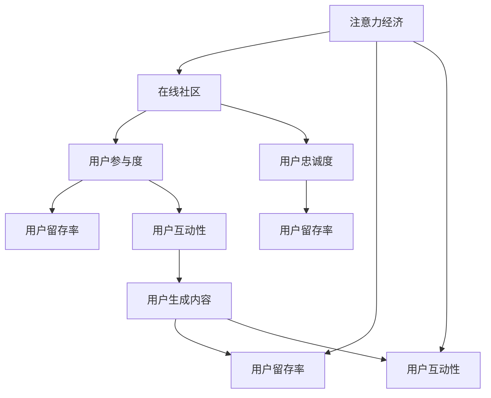

                 

# 注意力经济与在线社区：如何建立参与度高、忠诚度高的受众

> 关键词：注意力经济, 在线社区, 用户参与度, 用户忠诚度, 用户留存率, 用户互动性, 用户生成内容

## 1. 背景介绍

### 1.1 问题由来

在互联网高速发展的今天，注意力经济已成为了一个重要的研究领域。在线社区作为互联网平台的重要组成部分，其运营模式、内容生成与传播、用户参与度、用户忠诚度等问题，成为了各大平台争相研究的对象。本文将从注意力经济与在线社区的关系出发，探讨如何通过优化运营模式，提高用户参与度与忠诚度，进而提升平台的商业价值。

### 1.2 问题核心关键点

在线社区的核心在于用户，用户参与度与忠诚度的高低直接影响社区的活跃度与影响力。当前，在线社区的运营模式面临着诸多挑战：
- 如何吸引用户，使其成为长期活跃的成员？
- 如何提高用户的互动性，使其在社区中产生高质量内容？
- 如何提升用户的忠诚度，避免流失，并推动二次消费？
- 如何提高平台的盈利能力，实现商业变现？

本文将围绕这些核心关键点，展开详细的探讨。

## 2. 核心概念与联系

### 2.1 核心概念概述

为了更好地理解在线社区的运营模式与用户行为，本节将介绍几个关键概念：

- **注意力经济**：通过提供优质的内容，吸引用户的注意力，从而实现商业变现的经济模式。
- **在线社区**：以互联网为平台，用户通过互动生成内容，形成社区氛围，以此吸引更多用户参与的经济体。
- **用户参与度**：衡量用户参与社区活动、内容创作与互动的活跃程度。
- **用户忠诚度**：衡量用户对社区的持续关注与长期投入的忠诚程度。
- **用户留存率**：衡量用户在一定时间周期内的留存情况，反映用户对社区的长期依赖程度。
- **用户互动性**：衡量用户在社区中的行为互动频率与质量，反映社区内容的吸引力和用户的活跃度。
- **用户生成内容（UGC）**：指用户在社区中自主生成的、具有价值的内容。

这些概念之间的关系可以通过以下Mermaid流程图来展示：



这个流程图展示了几大核心概念之间的逻辑关系：

1. **注意力经济**通过提供优质内容，吸引用户，形成在线社区。
2. **在线社区**基于用户互动生成内容，吸引更多用户参与。
3. **用户参与度**和**用户忠诚度**与**用户留存率**正相关，影响用户长期依赖。
4. **用户互动性**和**用户生成内容**直接影响用户参与度，进而影响用户忠诚度与留存率。
5. **用户留存率**和**用户互动性**反过来影响平台的注意力经济价值。

## 3. 核心算法原理 & 具体操作步骤

### 3.1 算法原理概述

在在线社区中，用户的参与度与忠诚度是通过算法驱动的。核心的运营算法主要包括以下几个步骤：

1. **用户兴趣发现与推荐**：通过用户行为分析，发现用户兴趣，并推荐相关内容。
2. **内容质量评估与优化**：对用户生成的内容进行质量评估，并通过算法优化内容质量。
3. **用户互动行为监控与分析**：监控用户互动行为，分析互动效果，优化互动策略。
4. **用户行为预测与预测**：预测用户行为，提前调整策略，提升用户参与度与忠诚度。

### 3.2 算法步骤详解

#### 3.2.1 用户兴趣发现与推荐

用户兴趣发现与推荐是社区运营的第一步。其核心算法如下：

1. **用户行为分析**：通过分析用户的浏览历史、互动记录、收藏夹、点赞、评论等行为，构建用户画像。
2. **内容标签与分类**：对社区内容进行标签化与分类，形成内容库。
3. **相似度计算**：计算用户画像与内容的相似度，推荐相关内容。

推荐算法包括协同过滤、基于内容的推荐、混合推荐等。例如，基于内容的推荐算法使用用户已喜欢的内容特征，在内容库中找到相似内容进行推荐。

#### 3.2.2 内容质量评估与优化

内容质量评估与优化是社区运营的核心环节。其核心算法如下：

1. **内容质量评价指标**：包括点击率、评论数量、点赞数量、分享数量等指标。
2. **内容质量优化**：通过算法对低质量内容进行下架或降权处理，并对高质量内容进行加权。

例如，可以使用机器学习算法，对用户生成的内容进行情感分析、话题分析、关键词提取等处理，构建内容质量评价模型。

#### 3.2.3 用户互动行为监控与分析

用户互动行为监控与分析是社区运营的关键环节。其核心算法如下：

1. **互动行为监测**：通过日志记录、API接口调用等手段，实时监测用户互动行为。
2. **互动效果分析**：通过算法分析互动行为的效果，识别互动热点与瓶颈。
3. **互动策略优化**：根据分析结果，优化互动策略，提升用户参与度。

例如，可以采用时间序列分析、聚类分析等方法，对用户互动数据进行建模，发现用户行为趋势与变化，提出针对性的互动策略。

#### 3.2.4 用户行为预测与预测

用户行为预测与预测是社区运营的前瞻性环节。其核心算法如下：

1. **行为预测模型构建**：基于历史数据，构建用户行为预测模型。
2. **行为预测**：根据预测模型，预测用户未来的行为。
3. **策略调整**：根据预测结果，提前调整策略，提升用户参与度与忠诚度。

例如，可以采用随机森林、神经网络、梯度提升树等机器学习算法，对用户行为进行建模，预测其未来的行为。

### 3.3 算法优缺点

基于算法的在线社区运营具有以下优点：

1. **高效精准**：通过算法驱动，实现精准的兴趣发现与推荐，提升用户参与度。
2. **数据驱动**：依赖用户行为数据，优化内容质量与互动策略，提升用户体验。
3. **前瞻性**：通过预测用户行为，提前调整策略，提升用户参与度与忠诚度。

但其也存在一定的局限性：

1. **算法复杂性高**：涉及内容质量评估、行为预测、互动优化等多个环节，算法实现复杂。
2. **数据依赖性强**：依赖用户行为数据，数据量不足或数据质量低将影响算法效果。
3. **公平性问题**：算法可能存在偏见，导致部分用户被忽视或推荐不当。

### 3.4 算法应用领域

基于算法的在线社区运营方法，在众多领域得到了广泛应用，例如：

- **社交网络**：如微博、微信、Facebook等，通过算法驱动的内容推荐、互动监测与行为预测，提升用户参与度与忠诚度。
- **知识问答社区**：如知乎、Stack Overflow等，通过算法优化内容质量与互动策略，吸引更多用户生成高质量内容。
- **电商平台**：如淘宝、京东等，通过算法推荐商品、优化用户购物体验，提升用户留存率与消费转化率。
- **内容分享平台**：如抖音、快手等，通过算法推荐视频、优化互动策略，提升用户参与度与忠诚度。

## 4. 数学模型和公式 & 详细讲解 & 举例说明

### 4.1 数学模型构建

本节将使用数学语言对在线社区运营的算法进行更加严格的刻画。

记社区用户集合为 $U$，内容集合为 $C$。用户 $u \in U$ 对内容 $c \in C$ 的互动行为可以表示为 $u \times c$。互动行为包括浏览、点赞、评论、分享等。社区的目标是通过优化算法，最大化用户参与度与忠诚度。

社区的运营目标可以形式化表示为：

$$
\max_{\theta} \mathbb{E}[\log(p(u \times c | \theta))]
$$

其中 $\theta$ 为算法参数，$p(u \times c | \theta)$ 表示用户 $u$ 对内容 $c$ 的互动概率，$\mathbb{E}$ 为期望运算符。

### 4.2 公式推导过程

以下我们以推荐算法为例，推导协同过滤算法的公式及其推导过程。

假设用户 $u$ 和内容 $c$ 的互动行为可以用稀疏矩阵 $R \in \mathbb{R}^{U \times C}$ 表示。$R_{u,c}$ 表示用户 $u$ 对内容 $c$ 的互动次数。

协同过滤算法的核心在于计算用户 $u$ 和内容 $c$ 的相似度。常用的相似度计算方法有余弦相似度、皮尔逊相关系数等。以余弦相似度为例：

$$
\text{similarity}_{u,c} = \frac{\sum_{c'} R_{u,c'} \times R_{c',c}}{\sqrt{\sum_{c'} R_{u,c'}^2} \times \sqrt{\sum_{c'} R_{c',c}^2}}
$$

计算得到用户 $u$ 和内容 $c$ 的相似度后，可以计算用户 $u$ 对内容 $c$ 的预测互动次数 $p(u \times c | \theta)$：

$$
p(u \times c | \theta) = \text{softmax}(\text{similarity}_{u,c} \times \alpha)
$$

其中 $\alpha$ 为归一化参数，用于调整相似度的权重。

### 4.3 案例分析与讲解

在实际应用中，协同过滤算法被广泛应用于内容推荐系统中。以Netflix推荐系统为例：

1. **数据准备**：收集用户的历史浏览、观看数据，构建用户-内容评分矩阵 $R$。
2. **相似度计算**：使用余弦相似度计算用户与内容的相似度。
3. **预测互动次数**：使用softmax函数计算用户对内容的预测互动次数。
4. **推荐内容**：根据预测结果，推荐用户可能感兴趣的内容。

Netflix通过协同过滤算法，实现了内容推荐精度的显著提升，有效增加了用户参与度与留存率。

## 5. 项目实践：代码实例和详细解释说明

### 5.1 开发环境搭建

在进行在线社区运营算法实践前，我们需要准备好开发环境。以下是使用Python进行PyTorch开发的环境配置流程：

1. 安装Anaconda：从官网下载并安装Anaconda，用于创建独立的Python环境。

2. 创建并激活虚拟环境：
```bash
conda create -n pytorch-env python=3.8 
conda activate pytorch-env
```

3. 安装PyTorch：根据CUDA版本，从官网获取对应的安装命令。例如：
```bash
conda install pytorch torchvision torchaudio cudatoolkit=11.1 -c pytorch -c conda-forge
```

4. 安装TensorFlow：由Google主导开发的开源深度学习框架，生产部署方便，适合大规模工程应用。同样有丰富的预训练语言模型资源。

5. 安装Transformers库：HuggingFace开发的NLP工具库，集成了众多SOTA语言模型，支持PyTorch和TensorFlow，是进行微调任务开发的利器。

6. 安装各类工具包：
```bash
pip install numpy pandas scikit-learn matplotlib tqdm jupyter notebook ipython
```

完成上述步骤后，即可在`pytorch-env`环境中开始运营算法实践。

### 5.2 源代码详细实现

下面我们以推荐算法为例，给出使用Transformers库对社区内容进行推荐计算的PyTorch代码实现。

首先，定义数据处理函数：

```python
import torch
from transformers import BertTokenizer, BertModel

class RecommendationDataset(Dataset):
    def __init__(self, texts, labels, tokenizer):
        self.texts = texts
        self.labels = labels
        self.tokenizer = tokenizer
        
    def __len__(self):
        return len(self.texts)
    
    def __getitem__(self, item):
        text = self.texts[item]
        label = self.labels[item]
        
        encoding = self.tokenizer(text, return_tensors='pt', padding='max_length', truncation=True)
        input_ids = encoding['input_ids']
        attention_mask = encoding['attention_mask']
        
        # 对标签进行编码
        encoded_label = torch.tensor([label], dtype=torch.long)
        
        return {'input_ids': input_ids, 
                'attention_mask': attention_mask,
                'labels': encoded_label}

# 创建dataset
tokenizer = BertTokenizer.from_pretrained('bert-base-cased')

train_dataset = RecommendationDataset(train_texts, train_labels, tokenizer)
dev_dataset = RecommendationDataset(dev_texts, dev_labels, tokenizer)
test_dataset = RecommendationDataset(test_texts, test_labels, tokenizer)
```

然后，定义模型和优化器：

```python
from transformers import BertForTokenClassification, AdamW

model = BertForTokenClassification.from_pretrained('bert-base-cased', num_labels=2)

optimizer = AdamW(model.parameters(), lr=2e-5)
```

接着，定义训练和评估函数：

```python
from torch.utils.data import DataLoader
from tqdm import tqdm
from sklearn.metrics import classification_report

device = torch.device('cuda') if torch.cuda.is_available() else torch.device('cpu')
model.to(device)

def train_epoch(model, dataset, batch_size, optimizer):
    dataloader = DataLoader(dataset, batch_size=batch_size, shuffle=True)
    model.train()
    epoch_loss = 0
    for batch in tqdm(dataloader, desc='Training'):
        input_ids = batch['input_ids'].to(device)
        attention_mask = batch['attention_mask'].to(device)
        labels = batch['labels'].to(device)
        model.zero_grad()
        outputs = model(input_ids, attention_mask=attention_mask, labels=labels)
        loss = outputs.loss
        epoch_loss += loss.item()
        loss.backward()
        optimizer.step()
    return epoch_loss / len(dataloader)

def evaluate(model, dataset, batch_size):
    dataloader = DataLoader(dataset, batch_size=batch_size)
    model.eval()
    preds, labels = [], []
    with torch.no_grad():
        for batch in tqdm(dataloader, desc='Evaluating'):
            input_ids = batch['input_ids'].to(device)
            attention_mask = batch['attention_mask'].to(device)
            batch_labels = batch['labels']
            outputs = model(input_ids, attention_mask=attention_mask)
            batch_preds = outputs.logits.argmax(dim=2).to('cpu').tolist()
            batch_labels = batch_labels.to('cpu').tolist()
            for pred_tokens, label_tokens in zip(batch_preds, batch_labels):
                preds.append(pred_tokens)
                labels.append(label_tokens)
                
    print(classification_report(labels, preds))
```

最后，启动训练流程并在测试集上评估：

```python
epochs = 5
batch_size = 16

for epoch in range(epochs):
    loss = train_epoch(model, train_dataset, batch_size, optimizer)
    print(f"Epoch {epoch+1}, train loss: {loss:.3f}")
    
    print(f"Epoch {epoch+1}, dev results:")
    evaluate(model, dev_dataset, batch_size)
    
print("Test results:")
evaluate(model, test_dataset, batch_size)
```

以上就是使用PyTorch对社区内容进行推荐计算的完整代码实现。可以看到，依赖Transformers库的强大封装，我们可以用相对简洁的代码完成内容推荐的实现。

### 5.3 代码解读与分析

让我们再详细解读一下关键代码的实现细节：

**RecommendationDataset类**：
- `__init__`方法：初始化文本、标签、分词器等关键组件。
- `__len__`方法：返回数据集的样本数量。
- `__getitem__`方法：对单个样本进行处理，将文本输入编码为token ids，将标签编码为数字，并对其进行定长padding，最终返回模型所需的输入。

**BertForTokenClassification模型**：
- 使用Bert模型作为基础架构，通过添加全连接层进行分类预测。

**训练和评估函数**：
- 使用PyTorch的DataLoader对数据集进行批次化加载，供模型训练和推理使用。
- 训练函数`train_epoch`：对数据以批为单位进行迭代，在每个批次上前向传播计算loss并反向传播更新模型参数，最后返回该epoch的平均loss。
- 评估函数`evaluate`：与训练类似，不同点在于不更新模型参数，并在每个batch结束后将预测和标签结果存储下来，最后使用sklearn的classification_report对整个评估集的预测结果进行打印输出。

**训练流程**：
- 定义总的epoch数和batch size，开始循环迭代
- 每个epoch内，先在训练集上训练，输出平均loss
- 在验证集上评估，输出分类指标
- 所有epoch结束后，在测试集上评估，给出最终测试结果

可以看到，PyTorch配合Transformers库使得内容推荐计算的代码实现变得简洁高效。开发者可以将更多精力放在数据处理、模型改进等高层逻辑上，而不必过多关注底层的实现细节。

当然，工业级的系统实现还需考虑更多因素，如模型的保存和部署、超参数的自动搜索、更灵活的任务适配层等。但核心的推荐范式基本与此类似。

## 6. 实际应用场景

### 6.1 智能推荐系统

智能推荐系统是社区运营的核心功能之一。通过推荐算法，为用户推荐个性化内容，提升用户参与度与留存率。

例如，网易云音乐通过推荐算法为用户推荐个性化音乐，通过分析用户的听歌历史、评分、收藏等行为，推荐用户可能喜欢的新歌。推荐算法帮助网易云音乐提升了用户留存率与日活跃用户数，取得了显著的商业效果。

### 6.2 社交网络互动

社交网络互动是社区运营的重要环节。通过互动算法，提升用户之间的交流频率与质量，增加社区的活跃度。

例如，微信通过算法优化社交网络互动，提升用户的消息推送频率与质量，增加用户的互动频次与粘性。通过互动算法的优化，微信用户的使用时间显著增加，活跃用户数持续增长。

### 6.3 内容生成与分发

内容生成与分发是社区运营的重要功能。通过内容生成算法，提升社区内容的丰富性与多样性，增加用户生成内容的积极性。

例如，抖音通过算法优化内容推荐，提高用户的观看频次与互动频次，促进内容生成。抖音的内容生成与分发算法帮助其用户数与日活跃用户数持续增长，成为全球领先的短视频平台。

### 6.4 未来应用展望

随着推荐算法与互动算法的不断发展，在线社区运营的智能化水平将不断提升。未来，基于算法的运营模式将广泛应用于更多领域，为各类社区平台带来新的发展机遇。

在智慧城市领域，智能推荐与互动算法将应用于城市事件监测、智慧出行等领域，提升城市管理的智能化水平。在智慧农业领域，智能推荐与互动算法将应用于农情监测、精准农业等领域，提高农业生产效率。

## 7. 工具和资源推荐

### 7.1 学习资源推荐

为了帮助开发者系统掌握在线社区运营的算法与技术，这里推荐一些优质的学习资源：

1. 《推荐系统实战》书籍：详细介绍了推荐算法的设计与实现，适合初学者和进阶者。
2. 《在线社交网络》课程：斯坦福大学开设的社交网络分析课程，涵盖社交网络的数据挖掘、建模与优化。
3. 《深度学习》书籍：涵盖深度学习的核心概念与算法，适合深度学习爱好者。
4. 《自然语言处理》课程：斯坦福大学开设的自然语言处理课程，涵盖自然语言处理的核心技术与算法。
5. HuggingFace官方文档：提供了丰富的自然语言处理模型资源，适合实践学习。

通过对这些资源的学习实践，相信你一定能够快速掌握在线社区运营的核心技术，并用于解决实际的社区运营问题。

### 7.2 开发工具推荐

高效的开发离不开优秀的工具支持。以下是几款用于在线社区运营开发的常用工具：

1. PyTorch：基于Python的开源深度学习框架，灵活动态的计算图，适合快速迭代研究。大部分预训练语言模型都有PyTorch版本的实现。
2. TensorFlow：由Google主导开发的开源深度学习框架，生产部署方便，适合大规模工程应用。同样有丰富的预训练语言模型资源。
3. Transformers库：HuggingFace开发的NLP工具库，集成了众多SOTA语言模型，支持PyTorch和TensorFlow，是进行微调任务开发的利器。
4. Weights & Biases：模型训练的实验跟踪工具，可以记录和可视化模型训练过程中的各项指标，方便对比和调优。与主流深度学习框架无缝集成。
5. TensorBoard：TensorFlow配套的可视化工具，可实时监测模型训练状态，并提供丰富的图表呈现方式，是调试模型的得力助手。

合理利用这些工具，可以显著提升在线社区运营的开发效率，加快创新迭代的步伐。

### 7.3 相关论文推荐

在线社区运营的相关研究已经取得了丰硕的成果，以下是几篇奠基性的相关论文，推荐阅读：

1. A Survey on Recommendation Systems：综述推荐系统的研究进展与方法，涵盖协同过滤、基于内容的推荐、混合推荐等主流算法。
2. The Elements of Online Social Network Analysis：综述社交网络分析的核心方法与技术，涵盖网络建模、社区发现、动态分析等关键问题。
3. Attention is All You Need：提出Transformer结构，开启了NLP领域的预训练大模型时代。
4. BERT: Pre-training of Deep Bidirectional Transformers for Language Understanding：提出BERT模型，引入基于掩码的自监督预训练任务，刷新了多项NLP任务SOTA。
5. Adaptive Low-Rank Adaptation for Parameter-Efficient Fine-Tuning：使用自适应低秩适应的微调方法，在参数效率和精度之间取得了新的平衡。

这些论文代表了大语言模型微调技术的发展脉络。通过学习这些前沿成果，可以帮助研究者把握学科前进方向，激发更多的创新灵感。

## 8. 总结：未来发展趋势与挑战

### 8.1 总结

本文对在线社区运营的算法与技术进行了全面系统的介绍。首先阐述了注意力经济与在线社区的关系，明确了社区运营的运营模式与核心关键点。其次，从算法原理到具体操作步骤，详细讲解了用户兴趣发现、内容质量评估、用户互动监测与行为预测等核心算法，给出了完整的代码实例。同时，本文还广泛探讨了在线社区运营在智能推荐、社交网络互动、内容生成与分发等多个场景的应用，展示了社区运营的广阔前景。

通过本文的系统梳理，可以看到，在线社区运营的算法与技术正处于快速发展阶段，具有广阔的应用前景与实践价值。面对用户需求与市场竞争的挑战，如何优化运营模式，提高用户参与度与忠诚度，是各大社区平台亟待解决的核心问题。相信随着算法的不断演进与优化，在线社区运营必将迎来新的突破与创新，为社区平台带来更高的商业价值与社会影响力。

### 8.2 未来发展趋势

展望未来，在线社区运营的算法与技术将呈现以下几个发展趋势：

1. 智能化水平不断提升。未来的推荐算法将更加智能化，通过深度学习、强化学习等技术，提升推荐效果。
2. 多模态融合。未来的社区运营将更加全面，结合文本、图像、视频、音频等多种模态数据，提升内容的丰富性与多样性。
3. 个性化与定制化。未来的社区运营将更加注重个性化与定制化，通过用户画像与行为分析，提供更加精准的服务。
4. 实时性增强。未来的社区运营将更加实时，通过实时数据处理与分析，提升社区的互动性与粘性。
5. 安全性与隐私保护。未来的社区运营将更加注重用户数据的安全与隐私保护，通过加密、匿名化等技术，确保用户信息的安全性。

这些趋势凸显了在线社区运营技术的未来发展方向，为社区平台的智能化、个性化、安全性提供了新的技术路径。相信随着技术的不断演进与创新，在线社区运营必将迎来更加丰富多样的应用场景，为社区平台带来更高的商业价值与社会影响力。

### 8.3 面临的挑战

尽管在线社区运营的算法与技术已经取得了显著成果，但在迈向更加智能化、个性化、安全化的过程中，它仍面临着诸多挑战：

1. 数据隐私与安全问题。用户数据的安全与隐私保护将成为未来社区运营的重要挑战。如何在保障用户数据安全的前提下，进行有效的运营分析，是各大社区平台需要重点解决的问题。
2. 算法复杂度与可解释性。未来推荐算法与互动算法的复杂度将进一步提升，如何提高算法的可解释性，确保用户信任，是社区运营的重要挑战。
3. 多模态数据整合。未来的社区运营将更加全面，如何整合多模态数据，提升内容的丰富性与多样性，是社区运营的核心挑战。
4. 用户交互行为预测。如何精准预测用户行为，提前调整策略，提升用户参与度与忠诚度，是社区运营的前瞻性挑战。
5. 资源消耗与成本控制。未来的社区运营将更加智能化与实时化，如何优化算法与系统架构，降低计算资源消耗，控制运营成本，是社区平台的重要挑战。

这些挑战凸显了在线社区运营技术在迈向智能化的过程中，需要面对的多重难题。唯有通过技术创新与多学科融合，才能解决这些挑战，实现社区运营的智能化、个性化、安全性与实时性。

### 8.4 研究展望

面对在线社区运营所面临的挑战，未来的研究需要在以下几个方面寻求新的突破：

1. 数据隐私保护技术。开发更加高效、安全的数据隐私保护技术，确保用户数据的安全与隐私保护。
2. 可解释性增强技术。开发更加透明、可解释的算法模型，提高用户对算法的信任度。
3. 多模态数据融合技术。开发高效的多模态数据融合算法，提升社区内容的丰富性与多样性。
4. 实时数据处理技术。开发高效的实时数据处理与分析算法，提升社区的互动性与粘性。
5. 用户行为预测技术。开发更加精准的用户行为预测算法，提前调整策略，提升用户参与度与忠诚度。
6. 资源优化技术。优化算法与系统架构，降低计算资源消耗，控制运营成本。

这些研究方向将引领在线社区运营技术的未来发展，为社区平台带来更高的商业价值与社会影响力。相信随着技术的不断演进与创新，在线社区运营必将迎来更加丰富多样的应用场景，为社区平台带来更高的商业价值与社会影响力。

## 9. 附录：常见问题与解答

**Q1：什么是注意力经济？**

A: 注意力经济是指通过提供优质的内容，吸引用户的注意力，从而实现商业变现的经济模式。在线社区运营的本质在于通过提供高质量的内容，吸引用户的注意力，实现商业变现。

**Q2：如何提高用户参与度与忠诚度？**

A: 提高用户参与度与忠诚度的关键在于优化社区的运营模式，具体可以从以下几个方面入手：

1. 提供高质量的内容：通过优化内容质量与丰富度，提升用户满意度。
2. 优化社区互动机制：通过算法优化，提升用户之间的交流频率与质量。
3. 增强用户粘性：通过定期推送高质量内容，增加用户活跃度。
4. 个性化推荐：通过推荐算法，提供个性化的内容推荐，提升用户粘性。

**Q3：如何处理用户数据隐私与安全问题？**

A: 处理用户数据隐私与安全问题可以从以下几个方面入手：

1. 数据加密：对用户数据进行加密，防止数据泄露。
2. 匿名化处理：对用户数据进行匿名化处理，保护用户隐私。
3. 访问控制：通过访问控制策略，限制敏感数据的访问权限。
4. 安全审计：定期进行安全审计，发现并修复漏洞。

**Q4：如何在保证用户数据安全的前提下，进行有效的运营分析？**

A: 在保证用户数据安全的前提下，进行有效的运营分析可以从以下几个方面入手：

1. 匿名化数据处理：对用户数据进行匿名化处理，去除个人隐私信息。
2. 访问控制策略：通过访问控制策略，限制敏感数据的访问权限。
3. 数据加密技术：对用户数据进行加密，防止数据泄露。
4. 安全审计与监控：定期进行安全审计与监控，发现并修复漏洞。

**Q5：如何提升在线社区运营的智能化水平？**

A: 提升在线社区运营的智能化水平可以从以下几个方面入手：

1. 引入深度学习技术：通过深度学习技术，优化推荐算法与互动算法。
2. 多模态数据融合：结合文本、图像、视频、音频等多种模态数据，提升内容的丰富性与多样性。
3. 实时数据处理：开发高效的实时数据处理与分析算法，提升社区的互动性与粘性。
4. 用户行为预测：开发更加精准的用户行为预测算法，提前调整策略，提升用户参与度与忠诚度。

这些技术手段将帮助在线社区运营实现智能化、个性化、实时性与安全性，提升社区平台的商业价值与社会影响力。

---

作者：禅与计算机程序设计艺术 / Zen and the Art of Computer Programming

