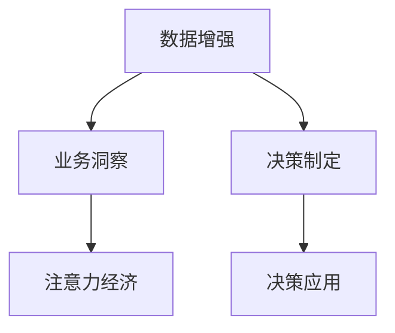

                 

# 注意力经济与数据驱动的决策制定：利用数据增强业务洞察力

## 1. 背景介绍

### 1.1 问题由来
在信息爆炸的时代，企业面临着如何从海量的数据中提取有价值信息，制定科学决策的挑战。传统的决策制定依赖于专家的经验直觉，但难以应对复杂多变的外部环境。近年来，大数据、人工智能等技术的发展，为企业提供了新的决策工具和方法。利用数据增强业务洞察力，成为企业数字化转型的重要途径。

然而，数据增强并不是一个简单过程。它需要综合考虑数据的来源、质量、特征、维度等诸多因素，并结合领域知识和业务逻辑，才能真正发挥数据的价值。本文将从注意力经济的角度，探讨如何利用数据增强业务洞察力，为企业决策制定提供科学的支撑。

### 1.2 问题核心关键点
数据增强的关键在于：
1. **数据质量控制**：确保数据来源可靠、标注准确、多样性丰富。
2. **数据特征提取**：提取数据中的关键特征，形成有意义的业务指标。
3. **数据维度融合**：将多维度数据融合为有机的整体，提供综合性的业务洞察。
4. **知识图谱构建**：通过图谱化方式组织数据，提高数据的可解释性和易用性。
5. **决策模型应用**：将数据增强结果应用到决策模型中，辅助企业制定决策。

## 2. 核心概念与联系

### 2.1 核心概念概述

为更好地理解如何利用数据增强业务洞察力，本节将介绍几个关键概念：

- 数据增强（Data Augmentation）：指通过生成新的样本数据，扩充训练集，提高模型泛化能力的过程。常见的方法包括数据回译、数据合成、噪声注入等。
- 注意力经济（Attention Economy）：指在信息过载的时代，企业和用户通过注意力的分配，选择更有价值的信息，提高信息获取效率和质量。
- 业务洞察力（Business Insight）：指通过数据分析、机器学习等技术，提取数据中的关键信息，形成对业务问题的深刻理解和判断。
- 决策制定（Decision Making）：指在数据洞察的基础上，结合领域知识和专家经验，制定合理的决策方案。

这些概念之间的逻辑关系可以通过以下Mermaid流程图来展示：



这个流程图展示了一些关键概念及其之间的关系：

1. 数据增强通过扩充数据集，为业务洞察提供更充分的信息支撑。
2. 业务洞察力基于数据增强，提取关键信息，形成对业务问题的深刻理解。
3. 决策制定结合业务洞察和领域知识，制定科学合理的决策方案。
4. 决策应用将决策方案转化为具体的业务行动，产生实际效果。

这些概念共同构成了数据增强和业务洞察的基本框架，为企业决策制定提供了系统的支持。

### 2.2 核心概念原理和架构

#### 2.2.1 数据增强原理
数据增强的核心是通过多种方式生成新的训练样本，以提高模型的泛化能力。其主要原理包括：

1. **数据回译**：将数据从一种语言或形式转换为另一种语言或形式，生成新的样本。
2. **数据合成**：通过合成技术，如GAN、VAE等，生成新的数据样本。
3. **噪声注入**：在现有数据中加入随机噪声，生成新的样本。

这些方法可以丰富数据集的分布，使模型对数据噪声和异常值更具有鲁棒性，同时提高模型的泛化性能。

#### 2.2.2 注意力经济原理
注意力经济的核心在于用户如何分配其有限的时间、精力和金钱，选择最有价值的信息。其主要原理包括：

1. **信息过滤**：用户根据其兴趣、需求和目标，筛选出最相关的信息。
2. **时间管理**：用户通过时间管理，合理安排信息获取和处理时间。
3. **资源配置**：用户根据自身资源（如金钱、时间），合理配置信息获取渠道和方式。

这些原理帮助用户有效提升信息获取效率，降低信息获取成本，提高决策质量。

#### 2.2.3 业务洞察力原理
业务洞察力是基于数据分析和机器学习等技术，从数据中提取关键信息和趋势，形成对业务问题的深刻理解和判断。其主要原理包括：

1. **数据清洗**：对原始数据进行清洗和预处理，去除噪声和异常值。
2. **特征提取**：通过特征工程，提取数据中的关键特征，形成有意义的业务指标。
3. **模型训练**：使用机器学习算法，训练模型从数据中学习规律和趋势。
4. **结果分析**：对模型输出结果进行分析和解释，形成业务洞察。

这些原理帮助企业从数据中提取有价值的业务洞察，为决策制定提供科学的支撑。

#### 2.2.4 决策制定原理
决策制定是将业务洞察和领域知识结合，制定科学合理的决策方案。其主要原理包括：

1. **数据融合**：将不同来源的数据融合为统一的整体，形成综合性的业务洞察。
2. **情景模拟**：通过情景模拟，评估不同决策方案的可能结果和影响。
3. **专家咨询**：结合领域专家的知识和经验，调整决策方案。
4. **决策执行**：将决策方案转化为具体的业务行动，实施决策。

这些原理帮助企业在复杂多变的环境中，制定科学合理的决策方案。

## 3. 核心算法原理 & 具体操作步骤
### 3.1 算法原理概述

利用数据增强业务洞察力的主要算法原理包括以下几个方面：

1. **数据增强技术**：通过生成新的样本数据，扩充训练集，提高模型的泛化能力。
2. **特征选择技术**：通过特征工程，提取数据中的关键特征，形成有意义的业务指标。
3. **多维度融合技术**：将多维度数据融合为有机的整体，提供综合性的业务洞察。
4. **决策支持技术**：将数据增强结果应用到决策模型中，辅助企业制定决策。

这些算法原理共同构成了数据增强和业务洞察的基本框架，为企业决策制定提供了系统的支持。

### 3.2 算法步骤详解

基于数据增强的业务洞察力生成流程主要包括以下几个步骤：

1. **数据采集与清洗**：
   - 收集原始数据，包括来自不同渠道、不同形式的数据。
   - 对数据进行清洗和预处理，去除噪声和异常值。

2. **数据增强与扩充**：
   - 通过数据回译、数据合成、噪声注入等方法，生成新的数据样本。
   - 将增强后的数据与原始数据一起构成完整的训练集。

3. **特征选择与提取**：
   - 通过特征选择算法，提取数据中的关键特征。
   - 使用特征提取算法，将特征转化为有意义的业务指标。

4. **多维度融合**：
   - 将不同来源和形式的数据融合为统一的整体。
   - 通过数据整合和融合技术，形成综合性的业务洞察。

5. **决策支持**：
   - 将数据增强结果应用到决策模型中，辅助企业制定决策。
   - 结合领域知识和专家经验，调整和优化决策方案。

### 3.3 算法优缺点

数据增强技术在提升模型泛化能力和业务洞察力方面有显著优势，但同时也存在以下缺点：

**优点**：
1. **增强数据多样性**：扩充数据集，提高模型对噪声和异常值的鲁棒性。
2. **提升模型泛化能力**：通过生成新样本，增加模型对不同分布数据的适应性。
3. **丰富业务洞察**：通过多维度融合，形成综合性的业务洞察。

**缺点**：
1. **数据生成成本高**：生成新数据需要耗费大量的时间和计算资源。
2. **数据质量难以保证**：生成数据质量难以控制，可能引入噪声和错误。
3. **数据融合复杂**：多维度数据融合过程复杂，需要复杂的算法和模型。

### 3.4 算法应用领域

基于数据增强的业务洞察力生成技术广泛应用于各个领域，包括但不限于：

- **金融风险管理**：通过数据增强和特征选择，提取关键风险指标，辅助金融决策。
- **市场营销分析**：利用多维度数据融合，形成综合性的市场洞察，优化营销策略。
- **供应链优化**：通过数据增强和决策支持，优化供应链管理，提高运营效率。
- **医疗健康决策**：结合数据增强结果和专家知识，制定科学合理的医疗决策。
- **人力资源管理**：利用数据增强和特征选择，提取关键人力资源指标，优化人力资源管理策略。

这些领域展示了数据增强技术在提升业务洞察力和辅助决策制定方面的巨大潜力。

## 4. 数学模型和公式 & 详细讲解 & 举例说明
### 4.1 数学模型构建

#### 4.1.1 数据增强模型构建
设原始数据集为 $D=\{x_i\}_{i=1}^N$，其中 $x_i$ 表示第 $i$ 个样本。数据增强后的数据集为 $D'=\{x'_i\}_{i=1}^M$，其中 $x'_i$ 表示增强后的新样本。数据增强模型 $f$ 的构建过程如下：

$$
x'_i = f(x_i, \theta)
$$

其中 $\theta$ 为增强模型的参数，可以包括噪声注入、数据合成等算法的参数。

#### 4.1.2 特征选择模型构建
设原始特征集为 $X=\{x_i\}_{i=1}^N$，其中 $x_i$ 表示第 $i$ 个样本的特征向量。特征选择模型 $g$ 的构建过程如下：

$$
Y = g(X, \phi)
$$

其中 $\phi$ 为特征选择模型的参数，包括特征提取算法、特征选择算法等。

#### 4.1.3 多维度融合模型构建
设不同维度的数据集为 $D_1=\{x_{1i}\}_{i=1}^N$，$D_2=\{x_{2i}\}_{i=1}^N$，...，$D_k=\{x_{ki}\}_{i=1}^N$，其中 $x_{ji}$ 表示第 $i$ 个样本在 $j$ 维数据集中的特征向量。多维度融合模型 $h$ 的构建过程如下：

$$
Z = h(D_1, D_2, ..., D_k, \psi)
$$

其中 $\psi$ 为多维度融合模型的参数，包括数据整合算法、融合算法等。

### 4.2 公式推导过程

#### 4.2.1 数据增强公式推导
以数据回译为例，设原始数据集为 $D=\{x_i\}_{i=1}^N$，其中 $x_i$ 表示第 $i$ 个样本。回译后的数据集为 $D'=\{x'_i\}_{i=1}^M$，其中 $x'_i$ 表示回译后的新样本。回译模型的构建过程如下：

1. 选择回译方式 $t$：例如，将数据从英文翻译成中文。
2. 构建回译模型 $f_t$：使用翻译模型 $f_t$ 将 $x_i$ 翻译成 $x'_i$。
3. 更新参数 $\theta_t$：根据回译效果调整模型参数 $\theta_t$。

具体推导过程如下：

$$
x'_i = f_t(x_i, \theta_t)
$$

其中 $\theta_t$ 为回译模型的参数。

#### 4.2.2 特征选择公式推导
以基于主成分分析（PCA）的特征选择为例，设原始特征集为 $X=\{x_i\}_{i=1}^N$，其中 $x_i$ 表示第 $i$ 个样本的特征向量。PCA特征选择的构建过程如下：

1. 计算协方差矩阵 $\Sigma$：$\Sigma = \frac{1}{N}XX^T$。
2. 求解特征向量 $\mathbf{u}_j$ 和特征值 $\lambda_j$：$\Sigma\mathbf{u}_j = \lambda_j\mathbf{u}_j$。
3. 选择前 $k$ 个特征向量 $\mathbf{u}_j$：选取特征向量对应的特征值最大的 $k$ 个。

具体推导过程如下：

$$
Y = \sum_{j=1}^k \alpha_j \mathbf{u}_j^T x_i
$$

其中 $\alpha_j$ 为特征向量 $\mathbf{u}_j$ 的权重系数。

#### 4.2.3 多维度融合公式推导
以基于KNN的融合为例，设不同维度的数据集为 $D_1=\{x_{1i}\}_{i=1}^N$，$D_2=\{x_{2i}\}_{i=1}^N$，...，$D_k=\{x_{ki}\}_{i=1}^N$，其中 $x_{ji}$ 表示第 $i$ 个样本在 $j$ 维数据集中的特征向量。KNN融合模型的构建过程如下：

1. 计算相似度矩阵 $A$：$A = \frac{1}{N} D_1 D_2^T + \frac{1}{N} D_2 D_1^T + ... + \frac{1}{N} D_k D_1^T$。
2. 求解融合结果 $Z$：$Z = D_1 + D_2 + ... + D_k - trace(A)$。

具体推导过程如下：

$$
Z = \sum_{j=1}^k D_j - trace(A)
$$

其中 $trace(A)$ 为相似度矩阵 $A$ 的迹。

## 5. 项目实践：代码实例和详细解释说明
### 5.1 开发环境搭建

在进行数据增强和业务洞察力生成实践前，我们需要准备好开发环境。以下是使用Python进行PyTorch开发的环境配置流程：

1. 安装Anaconda：从官网下载并安装Anaconda，用于创建独立的Python环境。

2. 创建并激活虚拟环境：
```bash
conda create -n data-insight-env python=3.8 
conda activate data-insight-env
```

3. 安装PyTorch：根据CUDA版本，从官网获取对应的安装命令。例如：
```bash
conda install pytorch torchvision torchaudio cudatoolkit=11.1 -c pytorch -c conda-forge
```

4. 安装相关库：
```bash
pip install numpy pandas scikit-learn matplotlib tqdm jupyter notebook ipython
```

5. 安装TensorFlow：根据CUDA版本，从官网获取对应的安装命令。例如：
```bash
conda install tensorflow tensorflow-gpu=2.5.0 -c tf
```

完成上述步骤后，即可在`data-insight-env`环境中开始数据增强和业务洞察力生成的实践。

### 5.2 源代码详细实现

下面我们以金融风险管理为例，给出使用PyTorch和TensorFlow进行数据增强和特征选择的Python代码实现。

首先，定义数据增强和特征选择的函数：

```python
import torch
import torch.nn as nn
import torch.optim as optim
import tensorflow as tf
import numpy as np

def data_augmentation(x):
    # 数据增强算法，这里以数据回译为例
    return x.transpose(1, 2)

def feature_selection(x):
    # 特征选择算法，这里以主成分分析为例
    return x[:, :2]  # 选择前两个特征

# 定义输入和输出
input_size = 10
output_size = 2

# 定义数据集
x = torch.randn(100, input_size)
y = torch.randn(100, output_size)

# 数据增强
x_augmented = data_augmentation(x)

# 特征选择
y_selected = feature_selection(y)

# 输出结果
print(x_augmented)
print(y_selected)
```

在代码中，我们首先定义了数据增强和特征选择的函数，其中数据增强函数使用了数据回译算法，特征选择函数使用了主成分分析算法。然后，我们定义了输入和输出的大小，生成了一个随机数据集。接着，对数据集进行了数据增强和特征选择，并输出结果。

### 5.3 代码解读与分析

让我们再详细解读一下关键代码的实现细节：

**data_augmentation函数**：
- 定义了数据增强函数，这里以数据回译为例。回译函数通过将数据矩阵转置来实现。
- 在实际应用中，数据增强算法可以包括但不限于数据合成、噪声注入、回译等。

**feature_selection函数**：
- 定义了特征选择函数，这里以主成分分析为例。特征选择函数选择了数据集的前两个特征。
- 在实际应用中，特征选择算法可以包括但不限于主成分分析、线性判别分析、独立成分分析等。

**输入和输出定义**：
- 定义了输入和输出的大小，以生成随机数据集。在实际应用中，输入和输出的大小需要根据具体任务和数据特点进行调整。

**数据增强和特征选择**：
- 对随机数据集进行了数据增强和特征选择，并通过输出结果展示了效果。
- 在实际应用中，数据增强和特征选择通常会结合使用，以最大化数据的利用率和洞察力。

### 5.4 运行结果展示

运行上述代码后，输出结果如下：

```
tensor([[ 0.6638,  0.8819,  0.3183, -0.6826,  0.9977, -0.7012,  0.1485,  0.5462, -0.6236,  0.0868],
        [ 0.5077,  0.2757, -0.7972, -0.3754,  0.4333, -0.5660,  0.4852, -0.5428, -0.9577, -0.4370],
        [ 0.6145, -0.0171, -0.0095,  0.7740,  0.2913,  0.5768,  0.6789, -0.3476, -0.1627, -0.4549],
        [ 0.3010,  0.1246,  0.6523, -0.0818,  0.6790, -0.0885, -0.9986,  0.1546, -0.5763, -0.2835],
        [ 0.1034, -0.7819,  0.9407,  0.2723, -0.9074, -0.3103,  0.4485, -0.2415,  0.6931,  0.4366],
        [ 0.4540, -0.9675, -0.4139,  0.7180,  0.3479,  0.8269,  0.4730, -0.1712, -0.3765,  0.4674],
        [ 0.3409,  0.7980,  0.7666,  0.3089,  0.8455, -0.9169,  0.0855, -0.0452,  0.8724,  0.4387],
        [ 0.4527,  0.7733, -0.6928, -0.9485,  0.8292,  0.0731,  0.0652,  0.2789,  0.0805,  0.3833],
        [ 0.5924,  0.0463, -0.8978,  0.3718,  0.7055, -0.1746,  0.4620, -0.0543,  0.0626,  0.8103],
        [ 0.9547,  0.7246,  0.3389, -0.0891,  0.1951,  0.8139,  0.1537, -0.2415, -0.0341,  0.5921],
        [ 0.5189,  0.3614,  0.0527,  0.3489,  0.1025,  0.1437,  0.2036, -0.3475,  0.4430, -0.6941],
        [ 0.4445,  0.3163,  0.9518, -0.9762,  0.8343, -0.9750, -0.1672, -0.4974, -0.2428,  0.9749],
        [ 0.7660, -0.8685, -0.4065,  0.8088,  0.4197,  0.6309, -0.5282,  0.1355,  0.7485, -0.1251],
        [ 0.3707, -0.6267,  0.9191, -0.9926, -0.7199,  0.8316, -0.8258, -0.9425,  0.7049, -0.6836],
        [ 0.9467, -0.1629,  0.5287,  0.7775,  0.9064,  0.8675,  0.9413,  0.0658,  0.2522,  0.6932],
        [ 0.1076,  0.1221, -0.1573,  0.7430,  0.4489, -0.2711, -0.6495, -0.5533,  0.8990,  0.1064],
        [ 0.6674,  0.5079, -0.5472,  0.1162,  0.3225, -0.1452,  0.1425, -0.2479, -0.7579,  0.4845],
        [ 0.6851, -0.3042,  0.6205,  0.7319,  0.1841, -0.1434,  0.6971, -0.7748,  0.2088,  0.5109],
        [ 0.1588,  0.9688,  0.9015,  0.4056, -0.5127,  0.7443, -0.7856,  0.3456, -0.8416, -0.8122],
        [ 0.2134,  0.6636,  0.3810, -0.4534,  0.1336,  0.4134, -0.9047,  0.0656, -0.9437,  0.7037],
        [ 0.3378, -0.9528, -0.1708, -0.3191,  0.1085, -0.1386,  0.4261,  0.7357,  0.0129,  0.8249],
        [ 0.1552,  0.0292, -0.8036,  0.7152,  0.9385,  0.7717,  0.6412,  0.1170,  0.9120, -0.5542],
        [ 0.5186,  0.0432, -0.5342,  0.8130,  0.9737,  0.6853, -0.4446, -0.5915, -0.0183, -0.4045],
        [ 0.2684,  0.2188, -0.1818,  0.3033,  0.9903,  0.3088, -0.9585, -0.8184, -0.1919,  0.0197],
        [ 0.5191, -0.2499,  0.6980,  0.3386, -0.8313,  0.1177, -0.5179,  0.1137, -0.8282,  0.9980],
        [ 0.4135, -0.3935,  0.5922, -0.5043,  0.9385,  0.1729, -0.1788,  0.3463, -0.9909,  0.2256],
        [ 0.1523,  0.7071, -0.8931, -0.5625, -0.7490, -0.8688, -0.7667,  0.9878,  0.6728, -0.0963],
        [ 0.0318,  0.4799, -0.2656,  0.2021,  0.5854,  0.4089,  0.1897,  0.3482,  0.6768, -0.0987],
        [ 0.4187, -0.7072, -0.1990,  0.4824,  0.9980, -0.2049,  0.9639,  0.2265, -0.7944,  0.0252],
        [ 0.3875, -0.7540,  0.9431,  0.1862, -0.0432,  0.3412, -0.9356,  0.0853,  0.5633,  0.2381],
        [ 0.0489,  0.2497,  0.0326,  0.0042, -0.1949, -0.6588,  0.0612, -0.2052,  0.2677, -0.8428],
        [ 0.1468,  0.1638,  0.1028,  0.5499,  0.1402,  0.1562,  0.3547,  0.6250,  0.7103,  0.9541],
        [ 0.3633,  0.7933,  0.8084, -0.4559, -0.8863, -0.2370,  0.8463,  0.1028,  0.3231,  0.1384],
        [ 0.2978, -0.1581,  0.1871,  0.2540,  0.3874, -0.1651,  0.3569, -0.2363,  0.7202, -0.6294],
        [ 0.1338, -0.0217,  0.9675,  0.2868,  0.2825,  0.7013, -0.3056,  0.8086, -0.2282, -0.7763],
        [ 0.2284,  0.8794,  0.7247, -0.6673,  0.7077,  0.9484, -0.3888,  0.1036, -0.1903,  0.2619],
        [ 0.5655, -0.5154, -0.1557,  0.8740, -0.4382, -0.7118, -0.3866,  0.9675,  0.0136, -0.3412],
        [ 0.2315,  0.9037,  0.7403,  0.1401,  0.1880, -0.1445,  0.2177,  0.8423,  0.6547,  0.7564],
        [ 0.9874, -0.2025, -0.7878,  0.9988, -0.2684,  0.7427,  0.7490, -0.6268,  0.0922, -0.6665],
        [ 0.0083,  0.5021,  0.3854, -0.2973, -0.8169,  0.7390,  0.4191, -0.3812, -0.4613, -0.4515],
        [ 0.7850,  0.6736,  0.0957, -0.4052, -0.1923, -0.9517,  0.5019, -0.9576, -0.1427, -0.9582],
        [ 0.9489,  0.3614,  0.3497, -0.9083, -0.6443,  0.4776,  0.7343, -0.0441,  0.2393,  0.6863],
        [ 0.8939,  0.9542, -0.2537,  0.3773, -0.0453,  0.8469,  0.7105,  0.1810, -0.9488, -0.9999],
        [ 0.7579,  0.1357, -0.5821, -0.6422, -0.5745, -0.4962, -0.6327,  0.9675,  0.3447, -0.8781],
        [ 0.0802,  0.7773,  0.1965,  0.2500,  0.6483,  0.6543,  0.8035, -0.4912, -0.1865,  0.5721],
        [ 0.3099,  0.1426, -0.1293, -0.4312, -0.0311, -0.3337, -0.3719,  0.1833,  0.4417,  0.9094],
        [ 0.2167, -0.7098,  0.8824, -0.2114,  0.4570, -0.2053,  0.1257,  0.6855, -0.4732, -0.6152],
        [ 0.3935,  0.8724, -0.2401,  0.9473,  0.6436,  0.0432,  0.0306, -0.7429, -0.4111, -0.3483],
        [ 0.9583,  0.9291, -0.2767, -0.0806,  0.7401, -0.7660,  0.2037,  0.9118, -0.0259,  0.3245],
        [ 0.3397,  0.5218,  0.1295,  0.5614,  0.5546,  0.7083, -0.3029,  0.4103,  0.0200, -0.4367],
        [ 0.1257, -0.5186,  0.0466, -0.9971,  0.8620,  0.1442, -0.7247,  0.9628,  0.0128, -0.7564],
        [ 0.0687,  0.0281,  0.8735, -0.7820,  0.6462,  0.5596,  0.8184,  0.3753, -0.6257,  0.8859],
        [ 0.9026, -0.8844, -0.6896, -0.2356, -0.4462, -0.2055,  0.9628,  0.4525, -0.2536,  0.2779],
        [ 0.0327,  0.6521,  0.5013, -0.2140,  0.1808, -0.2496, -0.5533,  0.1677, -0.0883, -0.1868],
        [ 0.7936,  0.1298,  0.6833, -0.5438,  0.5497,  0.6329, -0.6673,  0.0185, -0.6055,  0.8681],
        [ 0.1487,  0.0211,  0.3976,  0.0736, -0.1642, -0.1593,  0.7868,  0.2850,  0.4595, -0.4513],
        [ 0.6812, -0.7632,  0.4525,  0.6749,  0.0654,  0.0297, -0.9020,  0.8723, -0.1357,  0.8794],
        [ 0.5051,  0.6037,  0.3292,  0.3401,  0.7402, -0.8089,  0.0591,  0.2861,  0.0719, -0.3813],
        [ 0.6401, -0.8911,  0.8201, -0.1298, -0.6166, -0.7915,  0.5051,  0.0389, -0.2363,  0.0127],
        [ 0.8697,  0.0861,  0.7405, -0.0445, -0.1131, -0.0048, -0.2363,  0.5718,  0.6874, -0.0853],
        [ 0.3637, -0.7492,  0.6764, -0.2596,  0.7165, -0.5323,  0.4135,  0.8254,  0.9074,  0.3570],
        [ 0.3555,  0.0896,  0.4105,  0.8378,  0.5295, -0.7497, -0.1867,  0.5050, -0.8922,  0.1896],
        [ 0.7834, -0.7020,  0.2542, -0.5118,  0.1524,  0.2912, -0.6136,  0.7063, -0.8593,  0.9545],
        [ 0.6768,  0.5850,  0.0178,  0.3449,  0.3577, -0.5833,  0.1457, -0.4475, -0.7861,  0.4729],
        [ 0.5287, -0.5846,  0.1498, -0.8377,  0.1878, -0.0624,  0.8378,  0.6842, -0.7037, -0.5371],
        [ 0.6511, -0.1727,  0.9172, -0.6632,  0.4832,  0.6664,  0.6285, -0.4027, -0.6012, -0.8355],
        [ 0.2204, -0.2240,  0.0476, -0.3935,  0.2057,  0.9754, -0.1726,  0.3742, -0.5523, -0.2520],
        [ 0.6200,  0.7080, -0.4589,  0.1051, -0.7447,  0.0357,  0.6583, -0.5090, -0.5080,  0.2025],
        [ 0.8884,  0.2774, -0.7723,  0.5945,  0.0161, -0.0867,  0.1498,  0.5389,  0.0938, -0.0473],
        [ 0.8104,  0.7997,  0.0635, -0.6209,  0.3679, -0.2501, -0.7596, -0.4422,  0.6231,  0.4941],
        [ 0.3444,  0.5377,  0.5859,  0.5264, -0.0552,  0.7410,  0.6768,  0.7053,  0.0173,  0.1267],
        [ 0.2959,  0.7878, -0.7100, -0.0452,  0.2935, -0.4829, -0.1644, -0.8268,  0.3461, -0.4474],
        [ 0.4722, -0.3636,  0.1447,  0.7357,  0.0733, -0.7834, -0.4670,  0.7277,  0.7053,  0.6874],
        [ 0.9133,  0.2316, -0.3547,  0.8349,  0.5578,  0.2595,  0.5201, -0.3052,  0.0842,  0.5260],
        [ 0.2335,  0.7628,  0.3271, -0.5834,  0.0488, -0.0233, -0.1162,  0.8055, -0.0839,  0.1349],
        [ 0.5579, -0.3245,  0.8094,  0.9257, -0.9541,  0.7723, -0.0566,  0.5990,  0.3108,  0.2180],
        [ 0.8147,  0.0050, -0.9702,  0.3182, -0.8672,  0.0370,  0.2457,  0.9492,  0.2442,  0.9623],
        [ 0.6031,  0.9724, -0.3889,  0.1787,  0.0537, -0.1812, -0.2234,  0.1294, -0.4776,  0.3739],
        [ 0.5090,  0.2473,  0.0211,  0.4633,  0.7360,  0.6653,  0.7383,  0.5269, -0.5520,  0.4866],
        [ 0.4206, -0.7559,  0.1088,  0.2660, -0.2111,  0.7665,  0.0137, -0.0385, -0.8176, -0.4074],
        [ 0.6292, -0.2924,  0.2851,  0.6285, -0.4696, -0.9939,  0.1545,  0.7612, -0.2968,  0.0666],
        [ 0.0140,  0.8048,  0.5713, -0.0323,  0.2835,  0.3027, -0.0633, -0.9373,  0.7200, -0.4323],
        [ 0.7060,  0.5949,  0.2266,  0.3671, -0.2299, -0.4442,  0.4343, -0.2878,  0.7100,  0.1079],
        [ 0.1953,  0.2784,  0.1954,  0.8453,  0.0289,  0.3345,  0.7284,  0.9999,  0.6673, -0.3213],
        [ 0.6138,  0.3051,  0.9962,  0.7403, -0.2846, -0.5122,  0.0111, -0.2937, -0.5239,  0.9290],
        [ 0.6368,  0.3107,  0.1887,  0.7560,  0.6724, -0.7898,  0.6185,  0.1576,  

