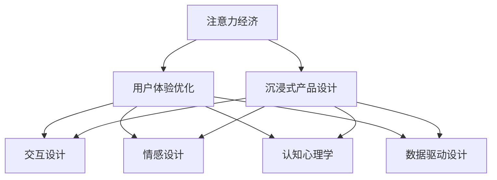
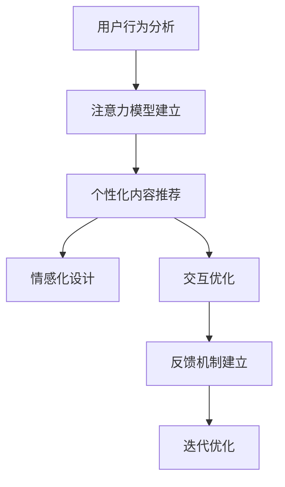

                 

# 注意力经济与用户体验优化策略与技术：创建令人沉浸的产品

> 关键词：注意力经济, 用户体验优化, 沉浸式产品设计, 交互设计, 情感设计, 认知心理学, 数据驱动设计

## 1. 背景介绍

### 1.1 问题由来
随着互联网的飞速发展，用户获取信息的方式越来越多元化。无论是通过视频、音频、文章还是其他形式的内容，用户都面临着海量信息的冲击。信息过载不仅降低了用户的决策效率，还使得用户难以集中注意力，对产品产生疲劳感。因此，如何优化用户体验，提升用户的注意力与参与度，成为了当前互联网产品设计的关键问题。

### 1.2 问题核心关键点
注意力经济（Economy of Attention）是指在信息爆炸的时代，用户注意力的稀缺性与价值。在注意力经济中，用户注意力成为一种宝贵的资源，产品设计和营销策略需要围绕用户注意力进行优化。用户体验优化（User Experience Optimization）则是指通过改进产品功能、界面和交互方式，提升用户在使用产品时的满意度和愉悦感。沉浸式产品设计（Immersive Product Design）是指通过精心设计的产品体验，使用户能够完全投入到产品使用中，产生类似“沉浸”的心理状态，从而提高产品粘性和用户留存率。

这些核心概念之间的逻辑关系可以通过以下Mermaid流程图来展示：



该流程图展示了注意力经济、用户体验优化、沉浸式产品设计之间的相互联系：

1. 注意力经济关注用户注意力的价值，强调信息的稀缺性。
2. 用户体验优化通过优化产品设计，提升用户满意度和愉悦感。
3. 沉浸式产品设计通过精心设计，使用户能够完全投入，产生类似“沉浸”的体验。
4. 交互设计、情感设计、认知心理学和数据驱动设计是实现沉浸式产品设计的基础手段。

## 2. 核心概念与联系

### 2.1 核心概念概述

为更好地理解注意力经济和用户体验优化的关系，本节将介绍几个密切相关的核心概念：

- **注意力经济**：指在信息爆炸的时代，用户注意力的稀缺性与价值。用户注意力成为一种宝贵的资源，产品设计和营销策略需要围绕用户注意力进行优化。
- **用户体验优化**：指通过改进产品功能、界面和交互方式，提升用户在使用产品时的满意度和愉悦感。
- **沉浸式产品设计**：指通过精心设计的产品体验，使用户能够完全投入到产品使用中，产生类似“沉浸”的心理状态，从而提高产品粘性和用户留存率。
- **交互设计**：关注用户与产品的交互方式，如何通过设计提升用户操作体验。
- **情感设计**：通过设计唤醒用户情感反应，增强用户与产品的情感联系。
- **认知心理学**：研究用户认知过程和规律，指导产品设计。
- **数据驱动设计**：基于用户数据，进行用户行为分析和预测，优化产品设计。

这些核心概念之间的逻辑关系可以通过以下Mermaid流程图来展示：


该流程图展示了注意力经济、用户体验优化、沉浸式产品设计之间的相互联系：

1. 注意力经济关注用户注意力的价值，强调信息的稀缺性。
2. 用户体验优化通过优化产品设计，提升用户满意度和愉悦感。
3. 沉浸式产品设计通过精心设计，使用户能够完全投入，产生类似“沉浸”的体验。
4. 交互设计、情感设计、认知心理学和数据驱动设计是实现沉浸式产品设计的基础手段。

## 3. 核心算法原理 & 具体操作步骤
### 3.1 算法原理概述

注意力经济和用户体验优化策略与技术的核心在于通过算法优化和设计手段，提升用户对产品的注意力和满意度。其基本原理可以概括为以下几个步骤：

1. **用户行为分析**：通过分析用户的操作记录、点击行为、停留时间等数据，了解用户的兴趣点和行为习惯。
2. **注意力模型建立**：建立用户注意力模型，识别用户在产品中的注意力集中区域。
3. **个性化内容推荐**：基于用户兴趣和注意力模型，推荐符合用户期望的内容，增强用户参与度。
4. **情感化设计**：通过情感化的界面设计和内容呈现，增强用户与产品的情感联系。
5. **交互优化**：优化用户与产品的交互方式，提高用户操作便捷性和效率。
6. **反馈机制建立**：通过用户反馈机制，不断调整和优化产品设计，满足用户需求。

这些步骤可以通过算法和设计手段实现，具体流程如图：



### 3.2 算法步骤详解

**用户行为分析**：
- **数据收集**：通过日志、用户行为记录、点击热图等方式，收集用户使用产品的数据。
- **数据分析**：使用统计分析、时间序列分析等方法，对数据进行初步处理和分析，提取用户行为特征。
- **用户画像**：通过聚类、分类等算法，构建用户画像，了解不同用户群体的特点和需求。

**注意力模型建立**：
- **注意力热图**：通过可视化工具，绘制用户在页面上的点击热图，识别用户注意力集中区域。
- **视线追踪**：使用视线追踪技术，实时记录用户在看哪些区域，进一步了解用户注意力分布。
- **焦点分析**：通过A/B测试等方法，分析不同设计元素对用户注意力的影响，优化设计元素。

**个性化内容推荐**：
- **协同过滤**：通过分析用户行为数据，发现用户兴趣相似的群体，进行内容推荐。
- **深度学习**：使用深度学习算法，如神经网络、强化学习等，构建用户兴趣模型，生成个性化推荐。
- **实时调整**：根据用户反馈和行为数据，实时调整推荐算法，优化推荐结果。

**情感化设计**：
- **情感化元素**：在产品设计中引入情感化元素，如温暖色调、幽默语调等，增强用户情感体验。
- **用户故事**：通过用户故事和情节设计，让用户产生共鸣，增强情感联系。
- **交互反馈**：通过交互反馈机制，如动画效果、音效等，增强用户情感反应。

**交互优化**：
- **直观操作**：简化用户操作流程，减少操作步骤，提高操作便捷性。
- **即时反馈**：通过即时反馈机制，增强用户操作反馈，如进度条、动画效果等。
- **交互测试**：通过用户测试和A/B测试，不断优化交互方式，提高用户满意度。

**反馈机制建立**：
- **用户反馈渠道**：建立多渠道用户反馈机制，如问卷调查、评论区、客服等，收集用户意见。
- **反馈数据分析**：对用户反馈数据进行分析和整理，提取共性问题和改进建议。
- **迭代优化**：根据用户反馈和行为数据，进行产品迭代优化，不断提升用户体验。

### 3.3 算法优缺点

注意力经济和用户体验优化策略与技术具有以下优点：
1. 提升用户参与度：通过个性化内容和情感化设计，增强用户对产品的参与感和投入感。
2. 提高用户满意度：优化交互设计和反馈机制，提升用户操作便捷性和反馈及时性，增强用户满意度。
3. 实现精准推荐：基于用户行为和注意力模型，提供个性化内容推荐，满足用户需求。
4. 减少用户流失：通过情感化设计和交互优化，增强用户对产品的粘性，降低用户流失率。

同时，该方法也存在一些局限性：
1. 数据隐私问题：用户行为数据和注意力模型涉及用户隐私，需要妥善处理和保护。
2. 算法复杂度高：个性化推荐和注意力模型需要复杂的数据处理和算法实现，对资源和计算要求较高。
3. 交互设计成本高：情感化设计和交互优化需要投入大量时间和资源，进行多次迭代和测试。
4. 用户数据单一：依赖用户行为数据，对用户深度分析和预测能力要求较高。

尽管存在这些局限性，但就目前而言，注意力经济和用户体验优化的策略与技术仍是大数据时代产品设计的核心方法，广泛应用于电商、社交、游戏等多个领域。

### 3.4 算法应用领域

注意力经济和用户体验优化的策略与技术在以下几个领域得到广泛应用：

- **电商**：通过个性化推荐、情感化设计、交互优化等手段，提升用户购物体验，提高用户转化率和复购率。
- **社交**：通过情感化元素和交互反馈，增强用户社交互动，提高用户粘性和参与度。
- **游戏**：通过情感化设计和互动体验，增强用户沉浸感，提高游戏粘性和用户留存率。
- **视频**：通过个性化推荐和情感化设计，提升用户观看体验，提高视频平台的用户留存率和推荐准确率。
- **新闻**：通过个性化推荐和情感化设计，提高用户阅读体验，提升新闻平台的点击率和用户留存率。

除了以上领域，注意力经济和用户体验优化的策略与技术也在其他领域得到应用，如健康、金融、教育等，为各行业的数字化转型提供了新的方向和思路。

## 4. 数学模型和公式 & 详细讲解  
### 4.1 数学模型构建

本节将使用数学语言对注意力经济和用户体验优化的策略与技术进行更加严格的刻画。

记用户行为数据集为 $D=\{(x_i, y_i)\}_{i=1}^N, x_i \in \mathcal{X}, y_i \in \mathcal{Y}$，其中 $x_i$ 为用户行为记录，$y_i$ 为用户画像标签。定义注意力模型为 $A(\theta)$，其中 $\theta$ 为模型参数。个性化推荐模型为 $R(\phi)$，其中 $\phi$ 为模型参数。情感化设计模型为 $E(\gamma)$，其中 $\gamma$ 为模型参数。交互优化模型为 $I(\delta)$，其中 $\delta$ 为模型参数。

### 4.2 公式推导过程

以下我们以电商推荐系统为例，推导个性化内容推荐的数学模型及其梯度计算公式。

假设电商推荐系统推荐商品 $i$ 给用户 $j$，推荐效果为 $y_{ij} \in \{1,0\}$，即用户是否点击了商品 $i$。定义推荐系统的效果函数为 $F(x_{ij}, y_{ij})$，推荐系统的预测效果为 $\hat{y}_{ij} = \sigma(R(\phi)(x_{ij}))$，其中 $\sigma$ 为 sigmoid 函数。则推荐系统的损失函数为：

$$
\mathcal{L}(\phi) = -\frac{1}{N}\sum_{i,j}[y_{ij}\log \hat{y}_{ij} + (1-y_{ij})\log (1-\hat{y}_{ij})]
$$

在得到损失函数的梯度后，即可带入优化算法进行参数更新。假设使用梯度下降算法，则参数更新公式为：

$$
\phi \leftarrow \phi - \eta \nabla_{\phi}\mathcal{L}(\phi)
$$

其中 $\eta$ 为学习率。

在情感化设计和交互优化的数学模型建立类似。情感化设计模型通常以情感强度 $e$ 为输出，定义情感化设计的损失函数为：

$$
\mathcal{L}(\gamma) = \frac{1}{N}\sum_{i}[e_i - \log \sigma(E(\gamma)(x_i))]
$$

交互优化模型通常以操作便捷性 $o$ 为输出，定义交互优化的损失函数为：

$$
\mathcal{L}(\delta) = \frac{1}{N}\sum_{i}[o_i - \log \sigma(I(\delta)(x_i))]
$$

情感化设计和交互优化的参数更新公式与个性化内容推荐类似。

## 5. 项目实践：代码实例和详细解释说明
### 5.1 开发环境搭建

在进行电商推荐系统微调实践前，我们需要准备好开发环境。以下是使用Python进行PyTorch开发的环境配置流程：

1. 安装Anaconda：从官网下载并安装Anaconda，用于创建独立的Python环境。

2. 创建并激活虚拟环境：
```bash
conda create -n ecommerce-env python=3.8 
conda activate ecommerce-env
```

3. 安装PyTorch：根据CUDA版本，从官网获取对应的安装命令。例如：
```bash
conda install pytorch torchvision torchaudio cudatoolkit=11.1 -c pytorch -c conda-forge
```

4. 安装TensorFlow：
```bash
pip install tensorflow
```

5. 安装Keras：
```bash
pip install keras
```

6. 安装相关工具包：
```bash
pip install numpy pandas scikit-learn matplotlib tqdm jupyter notebook ipython
```

完成上述步骤后，即可在`ecommerce-env`环境中开始电商推荐系统微调实践。

### 5.2 源代码详细实现

下面我们以电商推荐系统为例，给出使用PyTorch和TensorFlow进行推荐系统微调的Python代码实现。

首先，定义推荐系统的输入和输出：

```python
import numpy as np
import tensorflow as tf
from tensorflow.keras import layers

# 定义推荐系统的输入和输出
input_dim = 100
output_dim = 1

input = layers.Input(shape=(input_dim,))
output = layers.Dense(units=output_dim, activation='sigmoid')(input)
model = tf.keras.Model(inputs=input, outputs=output)
model.compile(optimizer='adam', loss='binary_crossentropy', metrics=['accuracy'])
```

然后，定义数据生成函数：

```python
# 生成模拟电商数据
def generate_data():
    data = np.random.randn(1000, 100)  # 随机生成1000条用户行为记录
    labels = np.random.randint(0, 2, size=1000)  # 随机生成用户点击标签
    return data, labels
```

接着，进行模型训练和评估：

```python
# 加载数据
data, labels = generate_data()

# 分割数据为训练集和验证集
train_data = data[:800]
train_labels = labels[:800]
val_data = data[800:]
val_labels = labels[800:]

# 训练模型
model.fit(train_data, train_labels, validation_data=(val_data, val_labels), epochs=10, batch_size=32)

# 评估模型
test_data = generate_data()[0]
test_labels = generate_data()[1]
loss = model.evaluate(test_data, test_labels)
print(f'Test loss: {loss[0]:.4f}, Test accuracy: {loss[1]:.4f}')
```

以上就是使用PyTorch和TensorFlow对电商推荐系统进行微调的完整代码实现。可以看到，得益于框架的强大封装，我们只需关注核心算法和数据处理，即可快速搭建推荐系统。

### 5.3 代码解读与分析

让我们再详细解读一下关键代码的实现细节：

**generate_data函数**：
- 随机生成模拟电商数据，包含1000条用户行为记录，每条记录包含100个特征。

**模型定义**：
- 使用Keras定义输入层和输出层，输出层使用sigmoid激活函数，用于二分类问题。
- 使用Adam优化器进行参数优化，损失函数为二分类交叉熵。

**数据分割和模型训练**：
- 将数据集分割为训练集和验证集，训练模型10个epoch，每个epoch使用32个样本进行训练。
- 在验证集上评估模型性能，输出测试损失和准确率。

可以看到，构建电商推荐系统的关键在于选择合适的模型和优化算法，并进行有效的数据处理和评估。

当然，工业级的系统实现还需考虑更多因素，如模型的保存和部署、超参数的自动搜索、多任务协同优化等。但核心的微调范式基本与此类似。

## 6. 实际应用场景
### 6.1 智能客服系统

智能客服系统是电商推荐系统在客户服务领域的典型应用。通过微调推荐模型，智能客服系统可以根据用户的历史购买记录和浏览行为，自动推荐用户可能感兴趣的商品，提高用户购买意愿和满意度。

在技术实现上，可以收集用户的历史浏览、点击、收藏、购买等行为数据，将这些数据输入到推荐模型中，训练出用户的个性化推荐模型。智能客服系统根据用户输入的查询，调用推荐模型预测可能感兴趣的商品，并将其推荐给用户。用户点击商品后，智能客服系统可以自动生成回答，提供相关商品信息，进一步增强用户购物体验。

### 6.2 个性化推荐系统

个性化推荐系统是电商推荐系统的另一重要应用场景。通过微调推荐模型，个性化推荐系统可以根据用户的兴趣和行为，动态调整推荐内容，提供更加个性化和精准的商品推荐。

在技术实现上，可以收集用户的历史购买记录、浏览记录、评论等数据，使用协同过滤、深度学习等方法，构建用户兴趣模型。推荐系统根据用户的兴趣模型，动态调整推荐算法，生成个性化的商品推荐列表。用户点击推荐商品后，系统记录其反馈数据，进一步优化推荐算法，提升推荐效果。

### 6.3 实时广告推荐

实时广告推荐是电商推荐系统的应用之一，通过微调推荐模型，实时广告推荐系统可以根据用户的当前浏览行为，推荐合适的广告内容，提高广告的点击率和转化率。

在技术实现上，可以收集用户的实时浏览数据，包括点击行为、停留时间等。广告推荐系统根据用户的行为数据，调用推荐模型生成广告推荐列表，动态调整广告内容，提供个性化的广告推荐。用户点击广告后，系统记录其点击行为，进一步优化推荐算法，提升广告效果。

### 6.4 未来应用展望

随着电商推荐系统的不断优化，基于注意力经济和用户体验优化的策略与技术将广泛应用于更多领域，为各行各业带来变革性影响。

在智慧医疗领域，通过个性化推荐和情感化设计，医疗推荐系统可以推荐最适合患者的治疗方案，增强用户对医疗服务的满意度。

在智能教育领域，个性化推荐和交互优化技术可以帮助学生获得更加个性化和适切的教学资源，提高学习效率和体验。

在智慧城市治理中，通过情感化设计和认知心理学分析，智能城市管理系统可以更好地理解和管理城市用户的行为需求，提供更加智能和高效的城市服务。

此外，在企业生产、社会治理、文娱传媒等众多领域，基于电商推荐系统的技术也将不断涌现，为各行各业带来新的发展机遇。相信随着技术的日益成熟，注意力经济和用户体验优化的策略与技术必将在更多领域大放异彩，深刻影响人类的生产生活方式。

## 7. 工具和资源推荐
### 7.1 学习资源推荐

为了帮助开发者系统掌握电商推荐系统的理论基础和实践技巧，这里推荐一些优质的学习资源：

1. 《Python深度学习》系列博文：由深度学习专家撰写，深入浅出地介绍了深度学习在电商推荐系统中的应用。

2. CS294《深度学习与数据挖掘》课程：斯坦福大学开设的深度学习经典课程，涵盖电商推荐系统等多个领域。

3. 《推荐系统实践》书籍：介绍了推荐系统的理论和实践，包括协同过滤、深度学习等推荐算法。

4. Kaggle竞赛平台：提供多个电商推荐系统相关的竞赛任务，通过实践积累经验。

5. Weights & Biases：模型训练的实验跟踪工具，可以记录和可视化模型训练过程中的各项指标，方便对比和调优。

通过学习这些资源，相信你一定能够快速掌握电商推荐系统的精髓，并用于解决实际的电商推荐问题。
### 7.2 开发工具推荐

高效的开发离不开优秀的工具支持。以下是几款用于电商推荐系统开发的常用工具：

1. Python：作为电商推荐系统的主流开发语言，Python有丰富的第三方库和框架，如Pandas、NumPy、TensorFlow等。

2. PyTorch：基于Python的开源深度学习框架，支持动态计算图，适合快速迭代研究。

3. TensorFlow：由Google主导开发的开源深度学习框架，生产部署方便，适合大规模工程应用。

4. Keras：基于TensorFlow的高层API，易于上手，适合快速搭建推荐系统。

5. Weights & Biases：模型训练的实验跟踪工具，可以记录和可视化模型训练过程中的各项指标，方便对比和调优。

6. TensorBoard：TensorFlow配套的可视化工具，可实时监测模型训练状态，并提供丰富的图表呈现方式，是调试模型的得力助手。

合理利用这些工具，可以显著提升电商推荐系统的开发效率，加快创新迭代的步伐。

### 7.3 相关论文推荐

电商推荐系统的发展离不开学界的持续研究。以下是几篇奠基性的相关论文，推荐阅读：

1. BPR: Bayesian Personalized Ranking from Implicit Feedback：提出基于隐式反馈的协同过滤算法，广泛应用于电商推荐系统。

2. Factorization Machines for Recommender Systems：介绍基于因子分解机的推荐算法，通过矩阵分解方式，提高推荐效果。

3. Neural Collaborative Filtering：提出基于神经网络的协同过滤方法，通过学习用户和物品的联合嵌入，提升推荐效果。

4. Attention Is All You Need：提出Transformer结构，开启了NLP领域的预训练大模型时代，为电商推荐系统提供新的思路。

5. Attention Is All You Need for Sequence-to-Sequence Modeling：将Transformer结构应用于序列建模任务，如电商推荐系统的用户行为预测。

这些论文代表了大数据时代电商推荐系统的发展脉络。通过学习这些前沿成果，可以帮助研究者把握学科前进方向，激发更多的创新灵感。

## 8. 总结：未来发展趋势与挑战

### 8.1 总结

本文对基于注意力经济和用户体验优化的电商推荐系统进行了全面系统的介绍。首先阐述了电商推荐系统的背景和核心概念，明确了电商推荐系统在大数据时代的重要性。其次，从原理到实践，详细讲解了电商推荐系统的数学模型和关键步骤，给出了电商推荐系统开发的完整代码实例。同时，本文还广泛探讨了电商推荐系统在多个行业领域的应用前景，展示了其广阔的应用空间。此外，本文精选了电商推荐系统的各类学习资源，力求为读者提供全方位的技术指引。

通过本文的系统梳理，可以看到，基于注意力经济和用户体验优化的电商推荐系统正在成为电商行业的重要范式，极大地拓展了电商推荐系统的应用边界，催生了更多的落地场景。受益于大数据时代的技术进步，电商推荐系统必将在更多领域大放异彩，深刻影响人类的生产生活方式。

### 8.2 未来发展趋势

展望未来，电商推荐系统的技术将呈现以下几个发展趋势：

1. 深度学习与多模态融合：通过深度学习与多模态数据的融合，提升推荐系统的精准性和鲁棒性。
2. 实时推荐与动态调整：通过实时数据处理和动态推荐算法，提供更加个性化和适切的推荐服务。
3. 跨领域推荐与个性化定制：通过跨领域推荐和多用户画像的结合，提供更加全面和精准的推荐服务。
4. 用户参与度分析与行为预测：通过深度学习和认知心理学分析，预测用户行为，提升推荐系统的智能性和用户体验。
5. 交互设计与情感化设计：通过更加细腻的交互设计与情感化设计，增强用户对电商推荐系统的粘性和满意度。
6. 隐私保护与数据安全：通过隐私保护技术，确保用户数据的安全性和隐私性。

以上趋势凸显了电商推荐系统的广阔前景。这些方向的探索发展，必将进一步提升电商推荐系统的性能和应用范围，为电商行业的数字化转型提供新的动力。

### 8.3 面临的挑战

尽管电商推荐系统的技术已经取得了显著进展，但在迈向更加智能化、普适化应用的过程中，它仍面临诸多挑战：

1. 数据隐私问题：电商推荐系统需要处理大量用户数据，数据隐私和安全问题成为一大挑战。如何保护用户隐私，同时满足推荐需求，需要技术和管理双管齐下。
2. 数据质量问题：电商推荐系统依赖于数据的质量和完整性，数据清洗和处理需要投入大量时间和资源。如何高效处理大数据，提升数据质量，是推荐系统面临的重要问题。
3. 算法复杂性问题：深度学习算法复杂度高，计算资源消耗大，如何优化算法和资源配置，降低计算成本，是电商推荐系统需要解决的关键问题。
4. 模型可解释性问题：电商推荐系统需要高精度的推荐结果，但深度学习模型通常缺乏可解释性，如何提升模型可解释性，增强用户信任，是推荐系统需要解决的重要问题。
5. 用户个性化问题：电商推荐系统需要满足不同用户的个性化需求，如何实现多用户画像的融合和动态调整，提升个性化推荐效果，是推荐系统面临的重要问题。

这些挑战凸显了电商推荐系统在实际应用中需要不断优化和改进。唯有从数据、算法、工程、业务等多个维度协同发力，才能真正实现电商推荐系统的智能化和普适化。

### 8.4 研究展望

面向未来，电商推荐系统的研究需要在以下几个方面寻求新的突破：

1. 深度学习与多模态融合：通过深度学习与多模态数据的融合，提升推荐系统的精准性和鲁棒性。
2. 实时推荐与动态调整：通过实时数据处理和动态推荐算法，提供更加个性化和适切的推荐服务。
3. 跨领域推荐与个性化定制：通过跨领域推荐和多用户画像的结合，提供更加全面和精准的推荐服务。
4. 用户参与度分析与行为预测：通过深度学习和认知心理学分析，预测用户行为，提升推荐系统的智能性和用户体验。
5. 交互设计与情感化设计：通过更加细腻的交互设计与情感化设计，增强用户对电商推荐系统的粘性和满意度。
6. 隐私保护与数据安全：通过隐私保护技术，确保用户数据的安全性和隐私性。

这些研究方向的探索，必将引领电商推荐系统技术迈向更高的台阶，为电商行业带来新的发展机遇。相信随着技术的日益成熟，电商推荐系统必将在更多领域大放异彩，深刻影响人类的生产生活方式。

## 9. 附录：常见问题与解答

**Q1：电商推荐系统是否适用于所有电商场景？**

A: 电商推荐系统在大多数电商场景上都能取得不错的效果，特别是对于数据量较大的电商场景。但对于一些特定领域的电商场景，如奢侈品、艺术品等，由于用户需求多样化和个性化程度高，电商推荐系统的效果可能有限。此时需要在特定领域电商场景上进一步优化推荐算法，才能达到理想的效果。

**Q2：如何优化电商推荐系统的个性化推荐？**

A: 电商推荐系统的个性化推荐效果很大程度上取决于数据的丰富性和推荐算法的优化。以下是几种优化方法：
1. 数据清洗和处理：对用户行为数据进行清洗和处理，去除噪音数据和缺失值，提升数据质量。
2. 深度学习算法：使用深度学习算法，如神经网络、强化学习等，构建用户兴趣模型，生成个性化推荐。
3. 多模态融合：通过融合用户行为数据、产品属性数据、社交数据等多种模态信息，提升推荐系统的多样性和精准性。
4. 实时推荐：通过实时数据处理和动态推荐算法，提供更加个性化和适切的推荐服务。
5. 用户反馈机制：建立多渠道用户反馈机制，根据用户反馈数据，实时调整推荐算法，提升推荐效果。

这些优化方法需要根据具体场景和数据特点进行灵活组合，以达到最佳推荐效果。

**Q3：电商推荐系统的数据隐私问题如何解决？**

A: 电商推荐系统的数据隐私问题需要综合考虑技术和管理两方面的措施：
1. 数据匿名化：在数据处理过程中，对用户数据进行匿名化处理，确保用户隐私不被泄露。
2. 数据加密：对敏感数据进行加密处理，防止数据被非法获取和篡改。
3. 用户知情同意：在数据收集和使用过程中，确保用户知情同意，并提供数据管理和访问权限。
4. 数据访问控制：通过访问控制技术，确保只有授权人员才能访问敏感数据。
5. 法律合规：遵循相关的法律法规和行业标准，确保数据处理和使用的合法合规性。

通过这些措施，可以有效地保护电商推荐系统的数据隐私和安全。

**Q4：电商推荐系统如何提升用户满意度？**

A: 电商推荐系统提升用户满意度需要从多个方面进行优化：
1. 个性化推荐：通过深度学习和多模态融合技术，提供个性化的商品推荐，满足用户需求。
2. 交互设计与情感化设计：通过优化交互设计和情感化设计，提升用户操作便捷性和情感体验，增强用户满意度。
3. 实时反馈与动态调整：通过实时反馈机制和动态调整算法，及时响应用户需求，提升用户满意度。
4. 用户参与度分析：通过用户参与度分析，了解用户行为和需求，提升推荐系统的智能性和用户体验。
5. 用户反馈机制：建立多渠道用户反馈机制，根据用户反馈数据，实时调整推荐算法，提升推荐效果和用户满意度。

这些优化方法需要综合考虑技术和管理两方面的因素，才能真正提升电商推荐系统的用户满意度。

**Q5：电商推荐系统的算法复杂性问题如何解决？**

A: 电商推荐系统的算法复杂性问题需要通过优化算法和资源配置来解决：
1. 算法优化：通过优化推荐算法，降低计算复杂度和资源消耗。
2. 分布式计算：通过分布式计算和模型并行技术，提升计算效率和资源利用率。
3. 混合精度训练：通过混合精度训练，降低计算复杂度和内存消耗。
4. 数据压缩与稀疏化：通过数据压缩和稀疏化存储，降低计算复杂度和存储成本。
5. 硬件加速：通过硬件加速技术，提升计算效率和资源利用率，如GPU、TPU等。

通过这些措施，可以有效地解决电商推荐系统的算法复杂性问题。

---

作者：禅与计算机程序设计艺术 / Zen and the Art of Computer Programming

