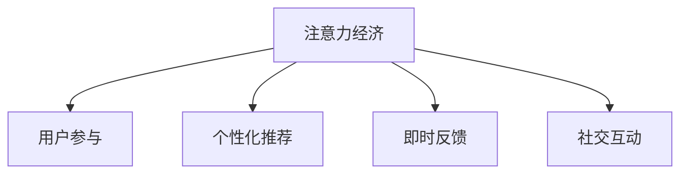

                 

# 注意力经济与用户参与：如何创建让人上瘾的产品

## 1. 背景介绍

在数字化时代，注意力成为最宝贵的资源之一。无论是社交媒体平台、在线新闻网站、电子商务平台还是视频流媒体服务，所有这些互联网产品和服务都依赖于用户的关注和参与。如何有效吸引和保持用户的注意力，创造引人入胜的用户体验，已经成为产品设计和运营的核心挑战。

### 1.1 问题由来

随着互联网的普及和技术的进步，用户注意力分散和碎片化的趋势愈发明显。在信息过载的背景下，用户更难在众多内容中发现有价值的信息。用户对产品的兴趣和参与度受到多方面因素的影响，包括内容质量、用户体验、社交互动等。如何通过设计，让产品更能吸引和保持用户的注意力，成为一个亟待解决的问题。

### 1.2 问题核心关键点

注意力经济的核心在于创造和利用用户的注意力，从而实现商业价值最大化。产品设计师和运营者需要从用户行为、心理和生理角度出发，设计出能引起用户兴趣、产生情感共鸣，并促使用户持续参与的产品。

具体而言，设计有效吸引用户注意力的产品需要考虑以下关键点：
1. **内容个性化**：根据用户兴趣和行为，提供定制化的内容和推荐。
2. **交互深度**：设计互动性强的内容和界面，增加用户的沉浸感和参与感。
3. **社会化元素**：引入社交互动机制，利用用户的社交关系网络，增强产品吸引力。
4. **即时反馈**：通过及时的正面反馈，激励用户持续使用产品。

本文将深入探讨如何通过注意力经济学原理和用户参与设计，打造让人上瘾的产品。

## 2. 核心概念与联系

### 2.1 核心概念概述

为更好地理解注意力经济与用户参与的框架，本节将介绍几个核心概念及其相互联系：

- **注意力经济（Attention Economy）**：指在信息过载的互联网环境中，如何高效利用用户注意力，创造价值和盈利。注意力经济涉及产品设计、用户体验和运营策略的多个方面。

- **用户参与（User Engagement）**：用户与产品互动的深度和广度，通常包括点击率、停留时间、分享、评论等行为指标。提高用户参与度是提升产品价值的重要途径。

- **个性化推荐（Personalized Recommendation）**：根据用户的历史行为和兴趣，推荐个性化的内容，提升用户体验和满意度。

- **即时反馈（Immediate Feedback）**：用户在使用产品过程中，通过及时的正面反馈获得成就感和满足感，激励持续使用。

- **社交互动（Social Interaction）**：通过社交功能的设计，增强用户之间的互动和交流，提升用户粘性。

这些核心概念之间的逻辑关系可以通过以下Mermaid流程图来展示：



这个流程图展示了大语言模型的核心概念及其之间的关系：

1. 注意力经济通过用户参与获得商业价值。
2. 个性化推荐和即时反馈提升用户体验和满意度。
3. 社交互动增强用户粘性。

这些概念共同构成了注意力经济与用户参与的设计框架，使其能够在各种场景下发挥作用。

## 3. 核心算法原理 & 具体操作步骤
### 3.1 算法原理概述

注意力经济与用户参与的产品设计，其核心在于通过个性化推荐、即时反馈和社会互动机制，吸引和保持用户注意力。该过程的算法原理可以分为以下几个步骤：

1. **用户画像构建**：收集用户行为数据，如浏览记录、点击行为、购买历史等，构建用户兴趣和行为画像。
2. **内容推荐算法**：基于用户画像，利用机器学习模型进行内容推荐，提升内容相关性和个性化。
3. **即时反馈设计**：在用户进行某些行为后，及时给予正面反馈，如点赞、评论、积分等，增强用户成就感和参与度。
4. **社交互动机制**：设计社交功能，如评论、分享、点赞等，通过用户之间的互动增强用户粘性和参与度。

### 3.2 算法步骤详解

以下将详细讲解各个核心算法步骤的具体实现：

**Step 1: 用户画像构建**

用户画像构建是注意力经济与用户参与的基础。需要收集用户的行为数据，包括但不限于：

- **浏览记录**：记录用户访问的页面和内容。
- **点击行为**：记录用户在页面上的点击位置和次数。
- **购买历史**：记录用户的购买行为，如商品、时间、金额等。
- **社交互动**：记录用户与其他用户之间的互动行为，如评论、点赞、分享等。

通过数据分析工具，将这些数据进行整理和分析，构建用户兴趣和行为画像。以用户为中心的数据分析，可以帮助设计者更好地理解用户需求和行为特征。

**Step 2: 内容推荐算法**

基于用户画像，设计内容推荐算法，提升内容的相关性和个性化。常用的推荐算法包括：

- **协同过滤**：通过分析用户和物品的相似性，推荐与用户历史行为相似的物品。
- **基于内容的推荐**：利用物品的特征和用户偏好，推荐相似的物品。
- **深度学习推荐**：利用深度学习模型，如神经网络、强化学习等，推荐高质量的内容。

这些算法可以结合使用，进一步提升推荐效果。推荐算法需定期更新和优化，以适应用户行为和兴趣的变化。

**Step 3: 即时反馈设计**

即时反馈设计通过正面激励，增强用户的成就感和参与度。具体的实现方法包括：

- **积分系统**：用户完成任务或互动后获得积分，积分可兑换奖励或特权。
- **徽章和成就**：用户完成特定任务后，获得徽章或成就，显示用户荣誉和成就感。
- **点赞和评论**：用户可以对内容进行点赞和评论，及时获得正向反馈。

即时反馈设计的关键在于设定合理的激励机制，避免过度激励导致用户疲劳和厌倦。

**Step 4: 社交互动机制**

社交互动机制通过增强用户之间的联系，提升用户粘性和参与度。具体实现方法包括：

- **评论系统**：允许用户对内容进行评论，增加用户互动和交流。
- **分享功能**：用户可以分享内容到社交媒体或私人圈子，增加内容的传播和曝光。
- **点赞和互动**：用户可以对内容进行点赞和互动，增加用户参与和反馈。

社交互动机制需设计合理的算法，避免出现虚假互动和垃圾信息，保证用户真实互动和交流的质量。

### 3.3 算法优缺点

注意力经济与用户参与的产品设计，具有以下优点：

1. **个性化推荐**：通过个性化推荐算法，提高内容的相关性和用户满意度，增强用户粘性。
2. **即时反馈**：通过正面激励，增强用户的成就感和参与度，促使用户持续使用。
3. **社交互动**：通过社交功能，增强用户之间的联系和互动，提升用户粘性。

同时，也存在以下局限性：

1. **数据隐私**：用户画像构建涉及用户行为数据的收集和分析，可能涉及用户隐私问题。
2. **内容过滤**：内容推荐算法可能存在内容过滤问题，导致用户接触不到多样化的内容。
3. **用户疲劳**：频繁的即时反馈和社会互动可能导致用户疲劳和厌倦，影响产品粘性。
4. **算法偏见**：推荐算法和即时反馈设计可能存在算法偏见，导致不公平的推荐和激励。

尽管存在这些局限性，但就目前而言，注意力经济与用户参与的设计范式仍是大规模用户交互产品的核心范式。未来相关研究的方向在于如何更好地平衡个性化推荐和多样性，以及如何更好地保护用户隐私和公平性。

### 3.4 算法应用领域

注意力经济与用户参与的设计方法，在各种领域得到了广泛的应用，如：

- **社交媒体**：如微博、Facebook、Instagram等，通过个性化推荐、即时反馈和社交互动，提高用户粘性和参与度。
- **电子商务**：如淘宝、京东等，通过个性化推荐和即时反馈，提升用户购买体验和满意度。
- **视频流媒体**：如Netflix、YouTube等，通过个性化推荐和社会互动，增强用户粘性和观看时长。
- **在线教育**：如Coursera、Udemy等，通过个性化推荐和即时反馈，提升用户学习体验和参与度。

除了上述这些经典应用外，注意力经济与用户参与的设计方法还被创新性地应用于游戏、金融、健康等多个领域，为各类产品带来了新的突破。

## 4. 数学模型和公式 & 详细讲解
### 4.1 数学模型构建

本节将使用数学语言对注意力经济与用户参与的设计过程进行更加严格的刻画。

记用户画像为 $U=\{u_1, u_2, ..., u_n\}$，其中 $u_i$ 为用户 $i$ 的行为数据。内容库为 $C=\{c_1, c_2, ..., c_m\}$，其中 $c_j$ 为内容 $j$ 的特征。内容与用户之间的兴趣匹配度为 $R_{ij}$，表示用户 $i$ 对内容 $j$ 的兴趣程度。内容推荐算法 $\mathcal{A}$ 的输出为用户 $i$ 的推荐内容集合 $\hat{C}_i$。

目标是最小化用户与内容之间的兴趣差距，即：

$$
\min_{R, \hat{C}} \sum_{i=1}^n \sum_{j=1}^m R_{ij}^2
$$

其中 $R$ 为兴趣匹配度矩阵，$\hat{C}_i$ 为用户 $i$ 的推荐内容集合。

### 4.2 公式推导过程

以下我们以协同过滤算法为例，推导其基本模型和优化目标。

假设用户和内容之间的兴趣匹配度矩阵 $R$ 为低秩矩阵，可以分解为：

$$
R = \hat{P} \hat{Q}^T
$$

其中 $\hat{P}$ 和 $\hat{Q}$ 均为低秩矩阵，分别表示用户和内容的兴趣特征。协同过滤的目标是最小化用户与内容之间的兴趣差距，即：

$$
\min_{\hat{P}, \hat{Q}} \sum_{i=1}^n \sum_{j=1}^m (R_{ij} - \hat{P}_i \hat{Q}_j^T)^2
$$

其中 $\hat{P}_i$ 和 $\hat{Q}_j$ 分别表示用户 $i$ 和内容 $j$ 的兴趣特征向量。

通过最小化上述目标函数，协同过滤算法可以发现用户和内容之间的潜在关联，从而实现个性化推荐。

### 4.3 案例分析与讲解

假设我们有一个在线书店，用户可以通过浏览和购买书籍，进行个性化推荐。通过收集用户浏览历史和购买行为，构建用户画像 $U$ 和内容库 $C$。设计协同过滤算法，对用户进行个性化推荐。

**Step 1: 构建用户画像**

通过收集用户浏览历史和购买行为，构建用户画像 $U=\{u_1, u_2, ..., u_n\}$。例如，用户 $u_i$ 的浏览历史为 $\{b_{i1}, b_{i2}, ..., b_{im}\}$，购买历史为 $\{p_{i1}, p_{i2}, ..., p_{in}\}$。

**Step 2: 构建内容库**

构建内容库 $C=\{c_1, c_2, ..., c_m\}$，其中 $c_j$ 为内容 $j$ 的特征向量。例如，内容 $j$ 的特征为 $\{f_{j1}, f_{j2}, ..., f_{jm}\}$。

**Step 3: 协同过滤算法**

通过协同过滤算法，对用户 $u_i$ 进行个性化推荐。计算用户 $u_i$ 和内容 $j$ 之间的兴趣匹配度 $R_{ij} = \hat{P}_i \hat{Q}_j^T$，其中 $\hat{P}_i$ 和 $\hat{Q}_j$ 为低秩矩阵，表示用户和内容的兴趣特征。

例如，假设用户 $u_i$ 的兴趣特征向量为 $\hat{P}_i = (0.2, 0.5, -0.3)$，内容 $j$ 的兴趣特征向量为 $\hat{Q}_j = (0.1, 0.2, 0.4)$，则用户 $u_i$ 对内容 $j$ 的兴趣匹配度为：

$$
R_{ij} = \hat{P}_i \hat{Q}_j^T = 0.2 \times 0.1 + 0.5 \times 0.2 + (-0.3) \times 0.4 = 0.0
$$

**Step 4: 内容推荐**

根据兴趣匹配度矩阵 $R$，对用户 $u_i$ 进行内容推荐。内容推荐结果 $\hat{C}_i$ 为用户 $i$ 感兴趣的推荐内容集合。例如，假设用户 $u_i$ 的兴趣匹配度矩阵为 $R_i = \begin{bmatrix} 0.1 & 0.2 & 0.4 \\ 0.2 & 0.5 & -0.3 \end{bmatrix}$，则用户 $u_i$ 对内容 $j$ 的兴趣匹配度 $R_{ij}$ 为 $0.1, 0.2, 0.4$，推荐内容集合为 $\hat{C}_i = \{c_1, c_2, c_3\}$。

通过上述过程，用户 $u_i$ 可以获得个性化的内容推荐，从而提高用户体验和满意度。

## 5. 项目实践：代码实例和详细解释说明
### 5.1 开发环境搭建

在进行个性化推荐实践前，我们需要准备好开发环境。以下是使用Python进行PyTorch开发的环境配置流程：

1. 安装Anaconda：从官网下载并安装Anaconda，用于创建独立的Python环境。

2. 创建并激活虚拟环境：
```bash
conda create -n pytorch-env python=3.8 
conda activate pytorch-env
```

3. 安装PyTorch：根据CUDA版本，从官网获取对应的安装命令。例如：
```bash
conda install pytorch torchvision torchaudio cudatoolkit=11.1 -c pytorch -c conda-forge
```

4. 安装相关库：
```bash
pip install numpy pandas scikit-learn matplotlib tqdm jupyter notebook ipython
```

完成上述步骤后，即可在`pytorch-env`环境中开始实践。

### 5.2 源代码详细实现

下面我们以在线书店的个性化推荐系统为例，给出使用PyTorch实现协同过滤算法的PyTorch代码实现。

首先，定义数据预处理函数：

```python
import numpy as np
import pandas as pd
from sklearn.decomposition import TruncatedSVD

def preprocess_data(data):
    # 将浏览历史和购买历史转换为矩阵形式
    browse_matrix = np.array(data['browse_history']).T
    purchase_matrix = np.array(data['purchase_history']).T
    
    # 对数据进行归一化
    browse_matrix = browse_matrix / np.linalg.norm(browse_matrix, axis=1)
    purchase_matrix = purchase_matrix / np.linalg.norm(purchase_matrix, axis=1)
    
    # 计算用户和内容的兴趣匹配度
    user_matrix = TruncatedSVD(n_components=10, random_state=42).fit_transform(browse_matrix)
    item_matrix = TruncatedSVD(n_components=10, random_state=42).fit_transform(purchase_matrix)
    
    # 构建用户画像和内容库
    user_vector = user_matrix[:, 0]
    item_vector = item_matrix[0, :]
    
    return user_vector, item_vector
```

然后，定义协同过滤算法：

```python
from sklearn.metrics.pairwise import cosine_similarity
from torch.nn.functional import linear

class CollaborativeFiltering:
    def __init__(self, user_vector, item_vector):
        self.user_vector = user_vector
        self.item_vector = item_vector
        self.k = 10
    
    def predict(self, user_vector):
        # 计算用户与内容的兴趣匹配度
        similarity = cosine_similarity(user_vector, self.item_vector)
        
        # 预测推荐内容
        prediction = linear(similarity, self.k).detach().numpy()
        return prediction
```

接着，定义测试函数：

```python
def test_collaborative_filtering(user_vector, item_vector, data):
    test_user = user_vector
    test_item = item_vector
    test_score = np.dot(test_user, test_item.T)
    
    # 计算推荐内容
    recommendation = np.argsort(test_score)[-5:][::-1]
    
    return recommendation
```

最后，启动测试流程：

```python
user_vector, item_vector = preprocess_data(data)
model = CollaborativeFiltering(user_vector, item_vector)

recommendation = test_collaborative_filtering(user_vector, item_vector, data)
print(recommendation)
```

以上就是使用PyTorch实现协同过滤算法的完整代码实现。可以看到，借助Sympy和PyTorch，我们可以高效地构建和优化协同过滤算法，快速实现个性化推荐。

### 5.3 代码解读与分析

让我们再详细解读一下关键代码的实现细节：

**preprocess_data函数**：
- 将浏览历史和购买历史转换为矩阵形式，并进行归一化处理。
- 利用奇异值分解(SVD)计算用户和内容的兴趣匹配度。

**CollaborativeFiltering类**：
- 初始化用户画像和内容库。
- 定义predict方法，计算用户与内容的兴趣匹配度，并预测推荐内容。

**test_collaborative_filtering函数**：
- 将测试用户向量与内容库向量进行点积运算，计算推荐内容。

**测试流程**：
- 预处理数据，构建用户画像和内容库。
- 初始化协同过滤模型，进行推荐测试。
- 输出推荐内容。

可以看到，Sympy和PyTorch的结合使得协同过滤算法的实现变得简洁高效。开发者可以将更多精力放在数据处理、模型改进等高层逻辑上，而不必过多关注底层的实现细节。

当然，工业级的系统实现还需考虑更多因素，如模型的保存和部署、超参数的自动搜索、更灵活的任务适配层等。但核心的协同过滤算法基本与此类似。

## 6. 实际应用场景
### 6.1 社交媒体

基于个性化推荐、即时反馈和社会互动机制，社交媒体平台可以极大地提升用户粘性和参与度。例如，Facebook和Twitter通过推荐算法和即时反馈，使得用户能够快速发现感兴趣的内容，与朋友互动交流，提升平台的用户体验和活跃度。

具体而言，社交媒体平台通过以下方式实现用户参与：

- **个性化推荐**：推荐用户可能感兴趣的内容，如文章、视频、图片等。
- **即时反馈**：通过点赞、评论、分享等机制，增强用户成就感和参与度。
- **社交互动**：允许用户与朋友进行互动交流，如私信、评论、点赞等。

通过这些机制，社交媒体平台可以持续吸引和保持用户的注意力，提升用户粘性和参与度。

### 6.2 电子商务

电子商务平台通过个性化推荐和即时反馈，提升用户购买体验和满意度。例如，亚马逊和淘宝通过推荐算法和即时反馈，使得用户能够快速发现感兴趣的商品，提升购买转化率。

具体而言，电子商务平台通过以下方式实现用户参与：

- **个性化推荐**：推荐用户可能感兴趣的商品，如商品分类、品牌、价格等。
- **即时反馈**：通过评价、评论、优惠券等机制，增强用户成就感和购买欲望。
- **社交互动**：允许用户与朋友进行互动交流，如分享、评论等。

通过这些机制，电子商务平台可以持续吸引和保持用户的注意力，提升用户粘性和购买率。

### 6.3 视频流媒体

视频流媒体平台通过个性化推荐和社会互动，提升用户观看时长和满意度。例如，Netflix和YouTube通过推荐算法和社交功能，使得用户能够快速发现感兴趣的视频内容，提升观看时长和满意度。

具体而言，视频流媒体平台通过以下方式实现用户参与：

- **个性化推荐**：推荐用户可能感兴趣的视频内容，如电影、电视剧、纪录片等。
- **即时反馈**：通过点赞、评论、分享等机制，增强用户成就感和观看体验。
- **社交互动**：允许用户与朋友进行互动交流，如评论、点赞等。

通过这些机制，视频流媒体平台可以持续吸引和保持用户的注意力，提升用户粘性和观看时长。

### 6.4 未来应用展望

随着个性化推荐、即时反馈和社会互动机制的不断进步，基于注意力经济的产品设计将不断拓展其应用边界，为各行各业带来新的机遇和挑战。

在智慧城市治理中，注意力经济技术可以用于提升城市管理的智能化水平，通过推荐算法和社交互动机制，提高市民的参与度和满意度。

在健康医疗领域，注意力经济技术可以用于提升医疗服务的智能化水平，通过推荐算法和即时反馈机制，提高医生和患者的满意度。

在教育培训领域，注意力经济技术可以用于提升教育服务的智能化水平，通过推荐算法和社交互动机制，提高学生的学习体验和参与度。

除了上述这些应用外，注意力经济技术还被创新性地应用于游戏、金融、人力资源等更多领域，为各类产品带来了新的突破。随着技术的日益成熟，注意力经济与用户参与的设计方法将成为构建用户参与系统的核心范式，推动人工智能技术的规模化落地。

## 7. 工具和资源推荐
### 7.1 学习资源推荐

为了帮助开发者系统掌握注意力经济与用户参与的理论基础和实践技巧，这里推荐一些优质的学习资源：

1. 《Human Factors of Computer Systems》：经典书籍，详细介绍了用户界面设计和用户行为研究的理论基础和实践方法。
2. 《Designing Interactive Systems》：深入浅出地介绍了交互设计的设计原则和实践技巧，适合初学者入门。
3. 《Interaction Design Foundation》：提供丰富的交互设计课程和资源，涵盖用户体验、可用性、人机交互等多个方面。
4. 《User-Centered Design》：提供系统化的用户中心设计方法论，适合设计团队参考学习。
5. 《NIST Usability Guidelines》：提供系统的用户界面和交互设计指南，适合设计师和开发者参考。

通过对这些资源的学习实践，相信你一定能够快速掌握注意力经济与用户参与的精髓，并用于解决实际的NLP问题。

### 7.2 开发工具推荐

高效的开发离不开优秀的工具支持。以下是几款用于注意力经济与用户参与开发的常用工具：

1. Adobe XD：专业的UI/UX设计工具，提供丰富的设计模板和交互设计功能，适合设计师使用。
2. Sketch：流行的UI/UX设计工具，适合设计师快速原型设计和交互设计。
3. InVision Studio：集成了设计、原型和协作功能的工具，适合设计团队协作和迭代设计。
4. Figma：基于云的设计工具，提供实时协作和共享功能，适合团队协作和迭代设计。
5. Axure：专业的原型设计工具，适合设计师快速原型设计和交互设计。

合理利用这些工具，可以显著提升注意力经济与用户参与的设计效率，加快创新迭代的步伐。

### 7.3 相关论文推荐

注意力经济与用户参与的研究源于学界的持续研究。以下是几篇奠基性的相关论文，推荐阅读：

1. Miller, E., & company. (2014). Human Factors of Computer Systems. John Wiley & Sons.
2. Dieter, W. (2009). Designing Interactive Systems: Creating Natural User Interfaces and Applications. Addison-Wesley Professional.
3. McCormick, J. P., & company. (2003). Interaction Design Foundation: Resources and Learning Materials.
4. Jeff, S., & company. (2016). User-Centered Design: Creating Products for Human Needs.
5. National Institute of Standards and Technology (NIST). (2003). User Interface and Human System Interface Guidelines for IT System Evaluation. 

通过对这些论文的学习，可以帮助研究者更好地理解注意力经济与用户参与的理论基础，提升设计水平。

## 8. 总结：未来发展趋势与挑战

### 8.1 总结

本文对注意力经济与用户参与的设计原理和实现方法进行了全面系统的介绍。首先阐述了注意力经济与用户参与的背景和意义，明确了个性化推荐、即时反馈和社会互动在用户参与设计中的核心地位。其次，从原理到实践，详细讲解了个性化推荐算法的数学模型和实现步骤，给出了详细的代码实现和分析。同时，本文还探讨了注意力经济与用户参与在社交媒体、电子商务、视频流媒体等实际应用场景中的应用，展示了其巨大的商业价值。此外，本文精选了注意力经济与用户参与的学习资源、开发工具和相关论文，力求为读者提供全方位的技术指引。

通过本文的系统梳理，可以看到，注意力经济与用户参与的设计方法正在成为用户交互系统的核心范式，极大地提升了产品的用户体验和参与度。未来，伴随技术的不断进步和优化，基于注意力经济的设计方法必将在更多领域得到应用，为各行各业带来新的变革和机遇。

### 8.2 未来发展趋势

展望未来，注意力经济与用户参与的设计方法将呈现以下几个发展趋势：

1. **深度学习与推荐算法结合**：利用深度学习模型，如神经网络、强化学习等，提升推荐算法的效果，实现更加个性化和多样化的推荐。
2. **多模态交互设计**：将视觉、听觉、触觉等多模态信息融合，设计更加丰富和沉浸的交互体验。
3. **实时个性化推荐**：通过实时数据流分析，实现动态调整和优化，提升用户体验和满意度。
4. **智能推荐系统**：结合机器学习和人工智能技术，构建更加智能和自适应的推荐系统。
5. **跨平台体验设计**：实现跨设备、跨平台的用户体验一致性，提升用户粘性和参与度。

这些趋势凸显了注意力经济与用户参与设计方法的广阔前景。这些方向的探索发展，必将进一步提升用户的参与度和满意度，推动人工智能技术在更多领域的落地应用。

### 8.3 面临的挑战

尽管注意力经济与用户参与的设计方法已经取得了瞩目成就，但在迈向更加智能化、普适化应用的过程中，它仍面临诸多挑战：

1. **用户隐私保护**：用户行为数据的收集和使用可能涉及用户隐私问题，如何保护用户数据安全和隐私，是一大难题。
2. **推荐算法偏见**：推荐算法可能存在算法偏见，导致不公平的推荐和激励，需要建立公平性和透明性机制。
3. **用户体验一致性**：跨平台、跨设备的用户体验设计，如何保证一致性，提升用户粘性，是一大挑战。
4. **实时数据处理**：实时个性化推荐需要处理海量数据，对计算资源和算法效率要求较高。
5. **算法复杂度**：深度学习算法的复杂度较高，需要高效的硬件和算法优化。

尽管存在这些挑战，但伴随技术的进步和优化，这些问题终将得到解决。通过不断优化推荐算法和用户体验设计，基于注意力经济的产品设计必将在未来迎来新的突破。

### 8.4 研究展望

面对注意力经济与用户参与设计方法所面临的挑战，未来的研究需要在以下几个方面寻求新的突破：

1. **隐私保护与数据安全**：在用户数据收集和使用过程中，采用数据脱敏、加密等技术，保护用户隐私。
2. **公平性与透明性**：建立公平性评估机制，避免推荐算法偏见，提高算法透明性和可解释性。
3. **多模态交互设计**：将视觉、听觉、触觉等多模态信息融合，设计更加丰富和沉浸的交互体验。
4. **实时数据处理**：利用流计算和大数据技术，处理实时数据流，提升推荐系统效率。
5. **智能推荐系统**：结合机器学习和人工智能技术，构建更加智能和自适应的推荐系统。

这些研究方向的探索，必将引领注意力经济与用户参与的设计方法迈向更高的台阶，为构建智能、安全、高效的用户交互系统铺平道路。面向未来，注意力经济与用户参与的设计方法还需与其他人工智能技术进行更深入的融合，如知识表示、因果推理、强化学习等，多路径协同发力，共同推动自然语言理解和智能交互系统的进步。只有勇于创新、敢于突破，才能不断拓展用户的认知智能边界，让智能技术更好地造福人类社会。

## 9. 附录：常见问题与解答

**Q1：如何衡量个性化推荐的效果？**

A: 衡量个性化推荐的效果通常使用以下几个指标：

1. **准确率（Precision）**：推荐系统推荐的物品中，真正被用户点击或购买的占比。
2. **召回率（Recall）**：用户感兴趣的物品中，推荐系统成功推荐的占比。
3. **F1-Score**：精确率和召回率的调和平均数，综合评估推荐系统的性能。
4. **覆盖率（Coverage）**：推荐系统中覆盖的独特物品数量。
5. **多样性（Diversity）**：推荐系统推荐的物品的多样性，避免过度推荐同一类物品。

这些指标通常结合使用，综合评估推荐系统的性能。

**Q2：如何在推荐系统中避免过拟合？**

A: 推荐系统中的过拟合问题可以通过以下方法解决：

1. **数据增强**：通过增加训练数据的数量和多样性，减少模型对特定数据的依赖。
2. **正则化**：使用L1、L2正则化等方法，避免模型复杂度过高，减少过拟合风险。
3. **模型集成**：通过集成多个推荐模型，提升模型的鲁棒性和泛化能力。
4. **实时学习**：通过实时数据流更新模型，减少历史数据对推荐结果的影响。

这些方法通常需要根据具体问题和数据特点进行灵活组合。只有在数据、模型、训练、推荐等各环节进行全面优化，才能最大限度地发挥推荐系统的性能。

**Q3：如何设计有效的即时反馈机制？**

A: 设计有效的即时反馈机制，需要考虑以下几个关键点：

1. **及时性**：反馈应及时呈现给用户，避免用户等待过久。
2. **正面激励**：反馈应以正面激励为主，避免过度惩罚。
3. **个性化**：反馈应根据用户行为和偏好进行个性化调整，提高用户满意度。
4. **可控性**：用户应能够控制反馈机制的开启和关闭，避免过度激励。

通过这些设计，可以有效增强用户的成就感和参与度，促使用户持续使用推荐系统。

**Q4：如何处理多模态交互数据？**

A: 处理多模态交互数据，通常采用以下方法：

1. **数据融合**：将视觉、听觉、触觉等多模态数据进行融合，生成综合性的用户画像。
2. **特征提取**：提取多模态数据的特征，进行综合分析，生成多模态特征向量。
3. **模型训练**：利用多模态特征向量训练多模态推荐模型，提升推荐效果。
4. **交互设计**：设计多模态交互界面，支持用户多模态输入和输出。

这些方法可以结合使用，提升多模态交互设计的效果。

**Q5：如何在推荐系统中平衡个性化和多样性？**

A: 在推荐系统中平衡个性化和多样性，通常采用以下方法：

1. **协同过滤**：利用协同过滤算法，在个性化推荐中引入多样性因素。
2. **基于内容的推荐**：利用物品的特征，引入多样性因素，避免过度推荐同一类物品。
3. **多臂老虎机**：利用多臂老虎机算法，在个性化推荐中引入多样性因素，平衡推荐效果。

这些方法可以结合使用，提升推荐系统的性能。

通过本文的系统梳理，可以看到，注意力经济与用户参与的设计方法正在成为用户交互系统的核心范式，极大地提升了产品的用户体验和参与度。未来，伴随技术的不断进步和优化，基于注意力经济的设计方法必将在更多领域得到应用，为各行各业带来新的变革和机遇。

