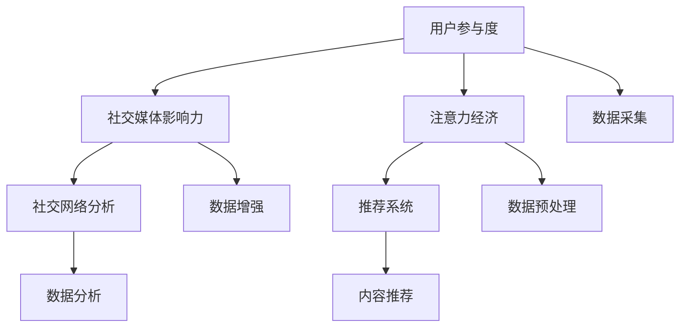

                 

# 注意力经济与社交媒体分析洞察力：了解受众参与度和影响力的秘诀

## 1. 背景介绍

### 1.1 问题由来
在信息爆炸的时代，如何准确地理解受众参与度和影响力成为各类媒体和内容创作者面临的重大挑战。社交媒体平台用户基数庞大，信息传播速度快、范围广，但用户数据噪音大，价值分析复杂。传统的数据统计和计算方法，如PV、UV等指标，已无法适应当前社交媒体的复杂多变特性。

注意力经济（Attention Economy）作为新经济模式，主张在“注意力资源稀缺”的前提下，生产符合用户兴趣的内容，通过获取和分配用户注意力来驱动收益。如何利用算法和技术手段，获取和分析用户注意力，成为平台和内容创造者亟待解决的问题。

### 1.2 问题核心关键点
- 数据量的爆炸增长：社交媒体平台每日产生的海量数据，如何高效处理和分析？
- 数据质量的参差不齐：用户在不同平台上的数据质量存在差异，如何提升数据质量？
- 注意力分析的复杂性：注意力作为非结构化数据，如何将其转化为可分析的数据指标？
- 分析方法的精准性：现有统计分析方法已无法满足社交媒体数据分析需求，如何提升分析精度？
- 反馈机制的及时性：在分析后如何高效地根据用户反馈优化内容产出？

这些关键问题，需要综合利用大数据、机器学习、社交网络分析等技术手段进行解决，以获取更全面、深入的社交媒体受众参与度和影响力洞察。

### 1.3 问题研究意义
- 为社交媒体平台的业务优化提供指导：通过深入分析用户注意力分布，优化平台资源配置，提升用户体验。
- 为内容创作者提供内容创作和推广依据：了解受众兴趣和行为，帮助创作者精准定位受众，提升内容传播效果。
- 为品牌商家提供精准营销方案：分析用户参与度，为企业精准投放广告、优化营销策略提供数据支持。
- 为学术研究提供案例支撑：社交媒体平台数据的广泛性，能够为复杂网络、推荐系统等领域的学术研究提供实验数据。

## 2. 核心概念与联系

### 2.1 核心概念概述

为更好地理解注意力经济与社交媒体分析的结合方式，本节将介绍几个关键概念：

- **注意力经济（Attention Economy）**：一种基于用户注意力的经济模式，主张在“注意力稀缺”的前提下，通过内容创作和分发来吸引和获取用户注意力，驱动商业收益。

- **用户参与度（User Engagement）**：用户与平台或内容互动的频率和深度，衡量用户对平台的忠诚度和使用频次。

- **社交媒体影响力（Social Media Influence）**：指用户在社交网络上的影响力和传播力，主要体现在内容的转发量、评论数和点赞数等方面。

- **社交网络分析（Social Network Analysis, SNA）**：研究社交网络中个体、群体之间的联系及其对整体网络行为的影响，包括网络中的结构洞、中心性等概念。

- **推荐系统（Recommender Systems）**：利用机器学习算法，对用户行为和偏好进行分析，推荐用户可能感兴趣的内容或产品。

这些概念之间的联系，通过以下Mermaid流程图进行展示：



这个流程图展示了社交媒体分析的各个关键环节：从数据采集，到预处理、分析、推荐，再到最终的效果评估，形成了完整的分析闭环。

## 3. 核心算法原理 & 具体操作步骤
### 3.1 算法原理概述

注意力经济与社交媒体分析的结合，核心在于如何将用户注意力转化为可分析的数据指标，并利用这些指标进行深入分析，从而优化内容创作和平台运营策略。主要算法包括：

- **内容推荐算法**：利用用户兴趣和历史行为，推荐相关内容，提升用户参与度和影响力。
- **社交网络分析算法**：分析用户间的关系网络，识别社交网络中的结构洞，识别有影响力的用户节点。
- **深度学习模型**：利用深度神经网络对社交媒体数据进行表示学习，提取高层次特征，提高分析精度。

### 3.2 算法步骤详解

以下我们将以社交媒体平台的内容推荐系统为例，介绍基于深度学习模型的用户参与度和影响力分析流程：

**Step 1: 数据采集与预处理**
- 收集用户在平台上的行为数据，如点赞、评论、分享等。
- 清洗、合并重复数据，填补缺失值，处理异常值。
- 将数据转换为数值化表示，如将用户评论转化为词向量表示。

**Step 2: 构建用户兴趣模型**
- 利用用户行为数据，训练深度神经网络模型，如卷积神经网络(CNN)、循环神经网络(RNN)或Transformer模型，提取用户兴趣特征。
- 将用户兴趣特征进行编码，得到用户兴趣向量。

**Step 3: 构建推荐模型**
- 将用户兴趣向量与内容特征向量进行拼接，得到用户对内容的兴趣评分。
- 使用协同过滤、内容基推荐等方法，进行内容推荐排序，生成推荐列表。

**Step 4: 评估与优化**
- 根据推荐效果，计算指标如CTR、CVR、平均点击率等，评估推荐模型的性能。
- 利用A/B测试等手段，不断优化推荐策略，提升用户参与度和影响力。

**Step 5: 社交网络分析**
- 利用用户互动数据，构建社交网络，进行用户关系分析。
- 使用社区发现、节点中心性分析等方法，识别平台中的意见领袖和关键用户。

**Step 6: 数据反馈与循环**
- 将推荐结果和用户反馈数据再次输入模型，进行二次优化，形成闭环。

### 3.3 算法优缺点

基于深度学习模型的社交媒体分析具有以下优点：

- **高维度特征提取**：深度学习模型可以自动从高维数据中提取低维特征，提升分析精度。
- **实时响应**：深度模型能实时处理用户行为数据，及时调整推荐策略，提高用户参与度。
- **泛化能力强**：利用大规模数据进行训练，深度模型具有较强的泛化能力，适应不同平台和场景。

同时，深度学习模型也存在以下缺点：

- **数据需求高**：需要大量高质量的数据进行训练，对数据清洗和处理要求较高。
- **模型复杂度高**：深度模型参数量庞大，计算资源消耗大，训练时间较长。
- **模型可解释性差**：深度模型的黑盒特性，导致其决策过程难以解释和调试。
- **鲁棒性问题**：对异常数据和噪声敏感，容易产生过拟合或欠拟合。

### 3.4 算法应用领域

基于深度学习模型的社交媒体分析，广泛应用于各类内容平台：

- **视频平台**：如Netflix、YouTube，利用用户行为数据推荐个性化视频内容，提升用户观看时长。
- **社交媒体**：如Facebook、Twitter，利用用户互动数据，推荐相关内容，提升用户参与度。
- **电商网站**：如Amazon、淘宝，利用用户购买行为数据，推荐相关商品，提升用户复购率。
- **新闻平台**：如BBC、CNN，利用用户阅读行为数据，推荐相关新闻，提高用户阅读时长和粘性。
- **音乐平台**：如Spotify，利用用户听歌行为数据，推荐个性音乐内容，提升用户活跃度。

## 4. 数学模型和公式 & 详细讲解 & 举例说明
### 4.1 数学模型构建

社交媒体平台的内容推荐系统，本质上是一个多目标优化问题。设用户为 $U$，内容为 $V$，互动数据 $D$。利用深度学习模型 $F$，将用户 $U$ 和内容 $V$ 映射到高维空间，利用矩阵 $\mathbf{W}$ 进行用户和内容的兴趣评分计算，得到用户兴趣向量 $\mathbf{u}_U$ 和内容向量 $\mathbf{v}_V$。

设推荐函数为 $f$，对用户 $u$ 进行内容 $v$ 推荐，计算推荐评分 $r$，目标是最大化评分 $r$ 与用户实际点击 $y$ 的匹配度：

$$
\min_{\mathbf{W}, f} \mathcal{L} = \frac{1}{N} \sum_{i=1}^N \ell(r_i, y_i)
$$

其中，$\ell$ 为损失函数，如交叉熵损失函数。

### 4.2 公式推导过程

假设用户兴趣模型 $F$ 为深度神经网络，内容向量 $\mathbf{v}_V$ 为固定特征向量，用户向量 $\mathbf{u}_U$ 为 $\mathbf{v}_V$ 的加权和：

$$
\mathbf{u}_U = \mathbf{W} \mathbf{v}_V
$$

其中 $\mathbf{W}$ 为权重矩阵，$\mathbf{v}_V$ 为内容特征向量。假设用户点击概率为 $\hat{y}_i$，则用户点击概率预测模型为：

$$
\hat{y}_i = \sigma(\mathbf{u}_U^T \mathbf{v}_V)
$$

其中 $\sigma$ 为Sigmoid函数，$\mathbf{u}_U^T$ 为 $\mathbf{u}_U$ 的转置。用户点击概率与实际点击行为之间的关系为：

$$
\ell(r_i, y_i) = \begin{cases}
\log(\hat{y}_i) & \text{if } y_i = 1 \\
-\log(1-\hat{y}_i) & \text{if } y_i = 0
\end{cases}
$$

综合用户和内容特征，构建推荐评分模型 $f$，利用矩阵 $\mathbf{W}$ 进行用户和内容的兴趣评分计算，得到用户兴趣向量 $\mathbf{u}_U$ 和内容向量 $\mathbf{v}_V$，则推荐评分 $r$ 为：

$$
r = \mathbf{u}_U^T \mathbf{v}_V
$$

最终的目标函数为：

$$
\min_{\mathbf{W}, f} \mathcal{L} = \frac{1}{N} \sum_{i=1}^N \ell(r_i, y_i)
$$

### 4.3 案例分析与讲解

以社交媒体平台的推荐系统为例，假设 $N=1000$ 个用户对 $M=1000$ 个内容进行了 $1000$ 次点击行为，生成 $N \times M$ 的互动矩阵 $D$。

用户 $i$ 对内容 $j$ 的互动数据 $d_{i,j}$ 为 $1$ 表示点击了该内容，否则为 $0$。通过矩阵分解，将用户点击数据转化为用户和内容的向量表示，得到用户兴趣向量 $\mathbf{u}_U$ 和内容向量 $\mathbf{v}_V$。

以用户 $u_1$ 为例，其兴趣向量 $\mathbf{u}_{U_1}$ 为：

$$
\mathbf{u}_{U_1} = \mathbf{W} \mathbf{v}_{V_1}
$$

其中 $\mathbf{v}_{V_1}$ 为用户 $1$ 对内容 $1$ 至内容 $M$ 的互动数据，形成向量。假设 $\mathbf{v}_{V_1} = [1, 0, 0, \ldots, 0]^T$，则 $\mathbf{u}_{U_1}$ 可以表示为用户兴趣矩阵 $\mathbf{W}$ 与内容互动矩阵 $\mathbf{v}_{V_1}$ 的加权和，权重矩阵 $\mathbf{W}$ 可以通过用户行为数据进行训练。

利用得到的用户向量 $\mathbf{u}_{U_1}$ 和内容向量 $\mathbf{v}_{V_1}$，计算用户 $1$ 对内容 $j$ 的推荐评分 $r_{1,j}$：

$$
r_{1,j} = \mathbf{u}_{U_1}^T \mathbf{v}_{V_j}
$$

其中 $\mathbf{v}_{V_j}$ 为用户 $1$ 对内容 $j$ 的互动数据，形成向量。

将推荐评分 $r_{1,j}$ 作为输入，利用损失函数 $\ell(r_{1,j}, y_{1,j})$ 计算用户 $1$ 对内容 $j$ 的预测误差，并更新权重矩阵 $\mathbf{W}$，不断迭代优化推荐系统。

## 5. 项目实践：代码实例和详细解释说明
### 5.1 开发环境搭建

在进行社交媒体分析的实践前，我们需要准备好开发环境。以下是使用Python进行TensorFlow开发的环境配置流程：

1. 安装Anaconda：从官网下载并安装Anaconda，用于创建独立的Python环境。

2. 创建并激活虚拟环境：
```bash
conda create -n tf-env python=3.8 
conda activate tf-env
```

3. 安装TensorFlow：根据CUDA版本，从官网获取对应的安装命令。例如：
```bash
conda install tensorflow -c tf -c conda-forge
```

4. 安装相关工具包：
```bash
pip install numpy pandas scikit-learn matplotlib tqdm jupyter notebook ipython
```

完成上述步骤后，即可在`tf-env`环境中开始社交媒体分析的实践。

### 5.2 源代码详细实现

下面我们以社交媒体平台的用户兴趣推荐系统为例，给出使用TensorFlow进行深度学习模型训练的PyTorch代码实现。

首先，定义用户行为数据类：

```python
import tensorflow as tf
import numpy as np

class UserBehavior(tf.keras.Model):
    def __init__(self, input_dim, hidden_dim):
        super(UserBehavior, self).__init__()
        self.dense1 = tf.keras.layers.Dense(hidden_dim, activation='relu')
        self.dense2 = tf.keras.layers.Dense(input_dim, activation='sigmoid')

    def call(self, inputs):
        x = self.dense1(inputs)
        x = self.dense2(x)
        return x

# 用户行为数据
def generate_data(n_users, n_items, n_steps):
    X = np.random.rand(n_users, n_steps, input_dim)
    Y = np.random.randint(0, 2, size=(n_users, n_items))
    return X, Y

# 生成数据
input_dim = 100
hidden_dim = 64
n_users = 1000
n_items = 1000
n_steps = 20
X_train, Y_train = generate_data(n_users, n_items, n_steps)
```

然后，定义推荐系统模型：

```python
class RecommendationSystem(tf.keras.Model):
    def __init__(self, user_model, item_model, learning_rate=0.001):
        super(RecommendationSystem, self).__init__()
        self.user_model = user_model
        self.item_model = item_model
        self.learning_rate = learning_rate

    def build(self, input_shape):
        self.user_weights = self.user_model.get_weights()
        self.item_weights = self.item_model.get_weights()

    def call(self, inputs):
        user_weights = self.user_model(inputs)
        item_weights = self.item_model(inputs)
        user_weights = tf.cast(user_weights, tf.float32)
        item_weights = tf.cast(item_weights, tf.float32)
        return tf.matmul(user_weights, item_weights)

# 用户兴趣模型
user_model = UserBehavior(input_dim, hidden_dim)
# 内容特征模型
item_model = tf.keras.layers.Dense(n_items, activation='sigmoid')
```

接着，定义训练函数：

```python
@tf.function
def train_step(inputs, labels):
    with tf.GradientTape() as tape:
        predictions = self(inputs)
        loss = tf.losses.sigmoid_cross_entropy(labels, predictions)
    gradients = tape.gradient(loss, self.trainable_variables)
    self.optimizer.apply_gradients(zip(gradients, self.trainable_variables))

# 构建推荐系统
recommender = RecommendationSystem(user_model, item_model)
recommender.compile(loss='binary_crossentropy', optimizer=tf.keras.optimizers.Adam(learning_rate=0.001))

# 训练推荐系统
recommender.fit(X_train, Y_train, epochs=10)
```

最后，输出推荐结果：

```python
def get_recommendations(user_id, top_n=10):
    user_weights = user_model(tf.constant(user_id))
    item_weights = item_model(tf.constant(user_id))
    user_weights = tf.cast(user_weights, tf.float32)
    item_weights = tf.cast(item_weights, tf.float32)
    recommendations = np.argsort(np.dot(user_weights, item_weights))[-top_n:][::-1]
    return recommendations

# 获取推荐结果
recommendations = get_recommendations(0)
print(recommendations)
```

以上就是使用TensorFlow进行社交媒体平台用户兴趣推荐系统的完整代码实现。可以看到，TensorFlow提供了丰富的工具和接口，使得深度学习模型的训练和优化变得简单高效。

### 5.3 代码解读与分析

让我们再详细解读一下关键代码的实现细节：

**UserBehavior类**：
- `__init__`方法：定义模型结构，包含两个全连接层，一个使用ReLU激活函数，一个使用Sigmoid激活函数。
- `call`方法：实现模型前向传播过程。

**generate_data函数**：
- 生成随机用户行为数据，包含用户ID、时间步和行为标签。

**RecommendationSystem类**：
- `__init__`方法：初始化推荐系统模型，包含用户模型和内容模型。
- `build`方法：获取用户和内容模型的权重，供训练时使用。
- `call`方法：实现推荐评分计算过程，利用用户和内容模型预测评分。

**train_step函数**：
- 定义训练过程中的损失函数和梯度更新过程。

**get_recommendations函数**：
- 利用用户模型和内容模型预测推荐结果，并返回推荐列表。

代码中使用了TensorFlow的tf.function装饰器，使得模型训练过程可以在编译时进行优化，提升模型训练速度。

## 6. 实际应用场景

### 6.1 智能推荐系统

基于深度学习模型的社交媒体推荐系统，能够利用用户行为数据，智能推荐用户可能感兴趣的内容，提升用户参与度和影响力。实际应用场景包括：

- **新闻推荐**：根据用户阅读历史和点击行为，推荐相关新闻文章，提高用户阅读时长和粘性。
- **视频推荐**：利用用户观看历史和互动数据，推荐用户可能感兴趣的视频内容，提升观看时长和观看完成率。
- **电商推荐**：根据用户购物行为和浏览历史，推荐相关商品，提升用户复购率和客单价。

### 6.2 社交媒体舆情分析

社交媒体平台的用户互动数据，能够揭示用户的情绪和态度，通过深度学习模型，进行情感分析和舆情预测，为平台提供舆情管理和内容管控依据。实际应用场景包括：

- **情绪分析**：利用用户评论和互动数据，分析用户的情绪倾向和情感变化，为品牌商家提供舆情预警和危机应对策略。
- **话题挖掘**：分析用户评论和互动数据，识别热门话题和趋势，为内容创作者提供创作方向和热点讨论点。
- **用户画像**：通过深度学习模型，分析用户行为数据，生成用户兴趣和行为画像，为平台提供用户分析和个性化推荐依据。

### 6.3 广告定向投放

社交媒体平台的用户互动数据，能够揭示用户的兴趣和行为偏好，通过深度学习模型，进行用户分类和广告定向投放，提升广告投放效果和用户体验。实际应用场景包括：

- **精准投放**：根据用户行为数据，分析用户的兴趣和偏好，进行定向广告投放，提升广告点击率和转化率。
- **用户细分**：利用用户互动数据，进行用户细分和群体划分，为品牌商家提供精准的用户群体分析依据。
- **效果评估**：通过用户点击行为数据，评估广告效果和投放策略，进行实时优化和调整。

### 6.4 未来应用展望

随着深度学习模型的不断发展，社交媒体分析将迎来更多突破和创新：

- **多模态融合**：结合文本、图像、音频等多模态数据，提升用户兴趣分析和内容推荐的精度。
- **实时分析**：利用流式计算和实时数据处理技术，实现实时分析和推荐，提升用户参与度和满意度。
- **跨平台协同**：结合不同平台的互动数据，进行跨平台协同分析和推荐，提升用户体验和内容粘性。
- **社交网络分析**：利用用户互动数据，进行社交网络分析，识别有影响力的用户节点，提升用户互动和内容传播效果。
- **联邦学习**：结合用户隐私保护需求，利用联邦学习技术，在本地进行模型训练和参数更新，保障用户隐私和数据安全。

## 7. 工具和资源推荐
### 7.1 学习资源推荐

为了帮助开发者系统掌握深度学习模型的社交媒体分析方法，这里推荐一些优质的学习资源：

1. **《深度学习》（Ian Goodfellow等著）**：全面介绍了深度学习模型的理论基础和应用实践，是深度学习领域的经典教材。

2. **《TensorFlow实战Google深度学习框架》（François Chollet著）**：详细介绍了TensorFlow框架的使用方法和深度学习模型的构建技巧，适合初学者和进阶者。

3. **CS231n《卷积神经网络》课程**：斯坦福大学开设的深度学习课程，介绍了卷积神经网络的理论基础和实现细节，适合有一定深度学习基础的学习者。

4. **Kaggle竞赛平台**：提供各类数据科学和机器学习竞赛，通过实际项目训练深度学习模型，提升实际应用能力。

5. **PyTorch官方文档**：提供了丰富的模型和工具接口，适合深入学习和开发深度学习模型。

通过对这些资源的学习实践，相信你一定能够快速掌握深度学习模型在社交媒体分析中的应用，并用于解决实际的NLP问题。

### 7.2 开发工具推荐

高效的开发离不开优秀的工具支持。以下是几款用于社交媒体分析的常用工具：

1. **TensorFlow**：基于Python的开源深度学习框架，灵活易用，适合构建复杂的深度学习模型。

2. **PyTorch**：基于Python的开源深度学习框架，动态计算图，适合快速迭代研究和开发。

3. **Pandas**：用于数据处理和分析的Python库，适合处理多维数据和复杂的数据变换操作。

4. **Matplotlib**：用于数据可视化的Python库，适合绘制各种图表，提升数据分析的直观性。

5. **Scikit-learn**：用于机器学习模型的Python库，提供丰富的算法和工具，适合快速构建和评估模型。

6. **Jupyter Notebook**：用于数据科学和机器学习开发的交互式Python环境，适合快速调试和实验。

合理利用这些工具，可以显著提升社交媒体分析的开发效率，加快创新迭代的步伐。

### 7.3 相关论文推荐

社交媒体分析的研究源于学界的持续研究。以下是几篇奠基性的相关论文，推荐阅读：

1. **《推荐系统的协同过滤》（Herbrich等著）**：介绍了协同过滤算法的原理和实现方法，是推荐系统领域的经典论文。

2. **《深度学习用于社交媒体情感分析》（Zhou等著）**：利用深度学习模型，进行社交媒体情感分析，是情感分析领域的奠基之作。

3. **《社交网络中的结构洞与社区发现》（Watts等著）**：研究社交网络中的结构洞和社区发现算法，为社交网络分析提供理论基础。

4. **《基于图卷积神经网络的社交网络分析》（Gruhin等著）**：利用图卷积神经网络进行社交网络分析，提升了社交网络分析的精度和效果。

5. **《联邦学习：个性化推荐的新范式》（Konečić等著）**：介绍联邦学习技术，进行分布式模型训练，保障用户隐私和数据安全。

这些论文代表了大规模社交媒体分析的研究方向，为深度学习模型在社交媒体分析中的应用提供了理论和实践的指导。

## 8. 总结：未来发展趋势与挑战
### 8.1 总结

本文对深度学习模型在社交媒体分析中的应用进行了全面系统的介绍。首先阐述了社交媒体平台的背景和重要性，明确了深度学习模型在用户参与度和影响力分析中的关键作用。其次，从原理到实践，详细讲解了深度学习模型的构建和优化过程，给出了社交媒体分析的完整代码实例。同时，本文还广泛探讨了社交媒体分析在推荐系统、舆情分析、广告投放等多个领域的应用前景，展示了深度学习模型的强大潜力。最后，本文精选了深度学习模型的学习资源，力求为读者提供全方位的技术指引。

通过本文的系统梳理，可以看到，深度学习模型在社交媒体分析中的应用，已经成为提升用户参与度和影响力，优化平台运营策略的重要手段。深度学习模型能够自动从高维数据中提取低维特征，提升分析精度，具有较高的实用价值。未来，随着深度学习模型的不断发展，社交媒体分析技术必将迎来更多突破和创新，为智能推荐、舆情预警、广告定向等场景带来新的应用模式和解决方案。

### 8.2 未来发展趋势

展望未来，深度学习模型在社交媒体分析中的应用将呈现以下几个发展趋势：

- **深度学习与NLP结合**：利用自然语言处理技术，分析社交媒体文本数据，提升用户情感分析和舆情预测的精度。
- **多模态数据融合**：结合图像、音频等多模态数据，提升用户兴趣分析和内容推荐的精度。
- **实时分析与动态优化**：利用流式计算和实时数据处理技术，实现实时分析和推荐，提升用户体验和内容粘性。
- **跨平台协同分析**：结合不同平台的互动数据，进行跨平台协同分析和推荐，提升用户参与度和满意度。
- **联邦学习与隐私保护**：利用联邦学习技术，进行分布式模型训练，保障用户隐私和数据安全。
- **模型压缩与优化**：通过模型压缩和优化技术，减少模型参数和计算资源消耗，提升模型部署效率。

### 8.3 面临的挑战

尽管深度学习模型在社交媒体分析中的应用已取得显著进展，但仍面临诸多挑战：

- **数据质量问题**：社交媒体平台的数据噪音较大，数据质量参差不齐，如何提升数据质量是一个重要挑战。
- **模型复杂性**：深度学习模型的结构复杂，参数量庞大，计算资源消耗大，如何提高模型的训练效率和推理速度，仍需进一步优化。
- **模型可解释性**：深度学习模型的黑盒特性，导致其决策过程难以解释和调试，如何提升模型的可解释性和透明性，是未来的一个重要研究方向。
- **鲁棒性问题**：深度学习模型对异常数据和噪声敏感，容易产生过拟合或欠拟合，如何提升模型的鲁棒性和泛化能力，是未来的重要研究方向。
- **隐私保护问题**：社交媒体平台的用户数据具有高度敏感性，如何保障用户隐私和数据安全，是未来的重要研究方向。
- **跨平台协同问题**：不同平台的用户行为数据格式和结构不同，如何实现跨平台的协同分析和推荐，是未来的重要研究方向。

### 8.4 研究展望

面对深度学习模型在社交媒体分析中面临的挑战，未来的研究需要在以下几个方面寻求新的突破：

- **数据清洗与增强**：利用数据清洗和增强技术，提升社交媒体数据的处理效率和质量，提高模型训练的稳定性。
- **模型压缩与优化**：通过模型压缩和优化技术，减少模型参数和计算资源消耗，提升模型部署效率。
- **多模态融合与协同**：结合图像、音频等多模态数据，提升用户兴趣分析和内容推荐的精度，提升跨平台协同分析的效果。
- **联邦学习与分布式计算**：利用联邦学习技术，进行分布式模型训练，保障用户隐私和数据安全，提升跨平台协同分析的效率和效果。
- **可解释性与透明性**：通过可解释性技术，提升深度学习模型的透明性和可解释性，保障模型的公正性和可信度。

这些研究方向将引领深度学习模型在社交媒体分析中的应用进入新的阶段，为智能推荐、舆情预警、广告定向等场景带来更多的突破和创新。

## 9. 附录：常见问题与解答

**Q1：深度学习模型在社交媒体分析中的优势和劣势是什么？**

A: 深度学习模型在社交媒体分析中的优势主要包括：
- 高维特征提取：能够从高维数据中提取低维特征，提升分析精度。
- 实时响应：能够实时处理用户行为数据，及时调整推荐策略，提高用户参与度。
- 泛化能力强：利用大规模数据进行训练，模型具有较强的泛化能力，适应不同平台和场景。

然而，深度学习模型也存在一些劣势：
- 数据需求高：需要大量高质量的数据进行训练，对数据清洗和处理要求较高。
- 模型复杂度高：结构复杂，参数量庞大，计算资源消耗大，训练时间较长。
- 模型可解释性差：黑盒特性，决策过程难以解释和调试。
- 鲁棒性问题：对异常数据和噪声敏感，容易产生过拟合或欠拟合。

**Q2：如何处理社交媒体平台的数据噪音？**

A: 处理社交媒体平台的数据噪音，主要通过以下几个步骤：
- 数据清洗：去除无效数据、缺失数据和异常数据。
- 数据增强：通过数据增强技术，扩充训练集，提高数据质量。
- 数据预处理：利用数据预处理技术，标准化数据格式，提升数据处理效率。
- 特征选择：选择有代表性和区分度的特征，降低数据噪音的干扰。
- 模型优化：利用模型优化技术，提升模型对噪音数据的鲁棒性。

**Q3：深度学习模型在社交媒体分析中如何实现跨平台协同？**

A: 实现跨平台协同，主要通过以下几个步骤：
- 数据整合：将不同平台的用户行为数据进行整合，形成统一的数据集。
- 特征对齐：将不同平台的用户特征进行对齐，形成统一的特征向量。
- 模型融合：利用模型融合技术，将不同平台的推荐结果进行整合，形成统一的推荐结果。
- 用户画像：通过用户画像技术，结合不同平台的用户数据，生成全面的用户画像，提升推荐效果。
- 协同推荐：利用协同推荐技术，结合不同平台的用户数据，进行跨平台的协同推荐，提升推荐效果。

**Q4：如何利用深度学习模型进行用户情感分析？**

A: 利用深度学习模型进行用户情感分析，主要通过以下几个步骤：
- 数据采集：收集用户评论和互动数据，形成数据集。
- 数据预处理：清洗、合并重复数据，填补缺失值，处理异常值。
- 特征提取：将文本数据转化为向量表示，形成特征向量。
- 模型训练：利用深度学习模型，训练情感分类器，将用户评论分为正面、负面和中性三类。
- 情感分析：利用训练好的模型，对用户评论进行情感分析，识别用户情绪倾向。

**Q5：如何利用深度学习模型进行社交网络分析？**

A: 利用深度学习模型进行社交网络分析，主要通过以下几个步骤：
- 数据采集：收集用户互动数据，形成社交网络数据集。
- 数据预处理：清洗、合并重复数据，填补缺失值，处理异常值。
- 特征提取：将社交网络数据转化为向量表示，形成特征向量。
- 模型训练：利用深度学习模型，训练社交网络分析器，识别社交网络中的结构洞和中心性。
- 社交网络分析：利用训练好的模型，分析社交网络数据，识别有影响力的用户节点。

通过这些步骤，深度学习模型能够有效地进行社交网络分析，提升平台的用户互动和内容传播效果。

---

作者：禅与计算机程序设计艺术 / Zen and the Art of Computer Programming

