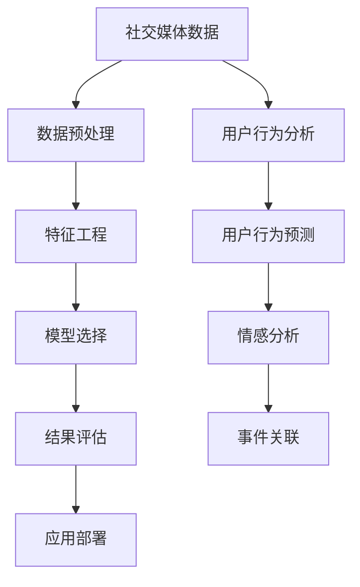
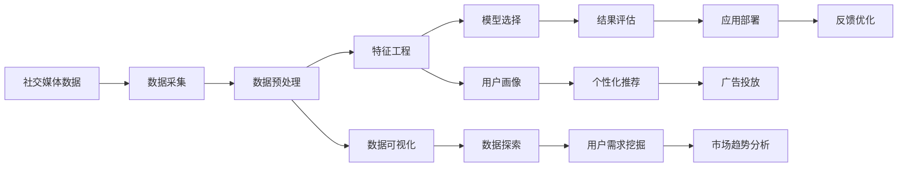

                 

# 注意力经济与社交媒体分析洞见：了解受众参与度和影响力的秘密

## 1. 背景介绍

### 1.1 问题由来
随着互联网的普及和社交媒体平台的兴起，注意力经济成为了新的经济形态。社交媒体平台通过吸引和保持用户的注意力，进而转化为广告和付费流量，实现了巨大的商业价值。然而，如何在海量数据中找到有用的信息，了解受众的参与度和影响力，成为了业界的热点问题。

近年来，社交媒体分析（Social Media Analytics）成为了热门研究方向。它利用数据挖掘、机器学习等技术，通过分析社交媒体数据，揭示用户行为模式，挖掘数据中的有价值信息，提升广告投放的精准度和效果。

### 1.2 问题核心关键点
社交媒体分析的核心在于如何高效地获取和处理用户行为数据，从中挖掘出有用的信息和模式。主要包括以下几个关键点：

- **数据获取**：社交媒体数据的实时性和多样性要求高效的数据采集和预处理。
- **特征工程**：提取有效的特征，用于刻画用户行为和偏好。
- **模型选择**：选择合适的算法模型，用于用户行为预测、情感分析、事件关联等任务。
- **结果评估**：评估模型的性能，并进行反馈优化。
- **应用部署**：将模型集成到实际应用系统中，如广告投放、内容推荐等。

### 1.3 问题研究意义
研究社交媒体分析技术，对于社交媒体平台优化用户体验，提升广告投放效果，挖掘用户需求，具有重要意义：

1. **提升广告投放精准度**：通过分析用户行为，可以优化广告投放策略，提高广告点击率和转化率。
2. **增强内容推荐效果**：了解用户偏好，可以提供个性化的内容推荐，提高用户满意度和粘性。
3. **挖掘用户需求和趋势**：从社交媒体数据中提取信息，可以洞察用户需求和市场趋势，优化产品策略。
4. **优化用户体验**：通过分析用户反馈和行为，可以改进产品设计，提升用户体验。
5. **增强社交媒体平台竞争力**：通过高效分析和应用社交媒体数据，可以在竞争激烈的社交媒体市场中占据优势。

## 2. 核心概念与联系

### 2.1 核心概念概述

社交媒体分析涉及多个核心概念，它们之间的关系可以通过以下Mermaid流程图展示：



这些概念之间的关系如下：

- **社交媒体数据**：指用户在使用社交媒体平台时产生的数据，包括文本、图片、视频、点赞、评论、分享等。
- **数据预处理**：对原始数据进行清洗、去重、缺失值处理等操作，确保数据的完整性和一致性。
- **特征工程**：从原始数据中提取有意义的特征，用于刻画用户行为和偏好。
- **模型选择**：根据任务需求选择合适的算法模型，如分类、回归、聚类、关联规则等。
- **结果评估**：通过评估指标（如准确率、召回率、F1分数等），判断模型性能的好坏。
- **应用部署**：将模型集成到实际应用系统中，实现对用户的智能推荐和广告投放。

此外，用户行为分析和情感分析是社交媒体分析的核心任务。用户行为预测和事件关联则是社交媒体分析的高级应用，能够进一步挖掘用户需求的深度和广度。

### 2.2 核心概念原理和架构的 Mermaid 流程图

以下是社交媒体分析的原理和架构的Mermaid流程图：



这个流程图展示了社交媒体分析从数据采集到应用部署的完整流程，以及其中的关键环节和技术方法。

## 3. 核心算法原理 & 具体操作步骤

### 3.1 算法原理概述

社交媒体分析的核心算法包括文本挖掘、情感分析、用户行为预测等。这些算法通常基于机器学习模型，如分类、回归、聚类等。以下以情感分析为例，简要介绍其原理和步骤。

情感分析是指通过分析用户评论、帖子等文本数据，判断用户对某一主题或产品的情感倾向（如正面、负面、中性）。情感分析的过程通常包括以下几个步骤：

1. **数据预处理**：清洗和归一化文本数据，去除停用词、标点符号等噪声。
2. **特征提取**：使用词袋模型、TF-IDF、Word2Vec等技术，提取文本特征。
3. **模型训练**：选择适合的情绪分类算法（如朴素贝叶斯、逻辑回归、支持向量机等），训练模型。
4. **模型评估**：使用准确率、召回率、F1分数等评估指标，评估模型性能。
5. **模型应用**：将训练好的模型应用到新的文本数据中，预测情感倾向。

### 3.2 算法步骤详解

以情感分析为例，具体算法步骤如下：

**Step 1: 数据预处理**

```python
import pandas as pd
from sklearn.feature_extraction.text import CountVectorizer

# 读取数据
df = pd.read_csv('comments.csv')

# 文本预处理
df['text'] = df['text'].apply(lambda x: x.lower())  # 转换为小写
df['text'] = df['text'].apply(lambda x: x.replace('\n', ' '))  # 去除换行符
df['text'] = df['text'].apply(lambda x: re.sub('[^a-zA-Z0-9\s]', '', x))  # 去除非字母数字字符

# 特征提取
vectorizer = CountVectorizer()
X = vectorizer.fit_transform(df['text'])
```

**Step 2: 特征选择**

```python
from sklearn.feature_extraction.text import TfidfTransformer
from sklearn.decomposition import TruncatedSVD

# 特征选择
tfidf = TfidfTransformer()
X_tfidf = tfidf.fit_transform(X)

# 降维
svd = TruncatedSVD(n_components=100)
X_svd = svd.fit_transform(X_tfidf)
```

**Step 3: 模型训练**

```python
from sklearn.linear_model import LogisticRegression

# 训练模型
y = df['sentiment']
X_train, X_test, y_train, y_test = train_test_split(X_svd, y, test_size=0.2)
model = LogisticRegression()
model.fit(X_train, y_train)
```

**Step 4: 模型评估**

```python
from sklearn.metrics import accuracy_score, precision_score, recall_score, f1_score

# 评估模型
y_pred = model.predict(X_test)
print('Accuracy:', accuracy_score(y_test, y_pred))
print('Precision:', precision_score(y_test, y_pred, average='micro'))
print('Recall:', recall_score(y_test, y_pred, average='micro'))
print('F1 Score:', f1_score(y_test, y_pred, average='micro'))
```

**Step 5: 模型应用**

```python
# 应用模型
new_text = 'I really love this product!'
new_text = vectorizer.transform([new_text])
new_text_tfidf = tfidf.transform(new_text)
new_text_svd = svd.transform(new_text_tfidf)
sentiment = model.predict_proba(new_text_svd)
print('Sentiment:', sentiment)
```

### 3.3 算法优缺点

情感分析算法具有以下优点：

- **高效性**：文本数据量巨大，情感分析算法能够在较短时间内处理大量数据。
- **可解释性**：情感分析算法的模型结果易于理解和解释。
- **鲁棒性**：情感分析算法对数据中的噪声和异常值具有较好的鲁棒性。

然而，情感分析算法也存在以下缺点：

- **依赖标注数据**：情感分析算法需要大量的标注数据进行训练，标注成本较高。
- **模型泛化能力有限**：情感分析模型对新数据的泛化能力有限，需要不断更新模型才能适应新趋势。
- **情感多义性**：情感表达具有多义性，同一个词在不同的语境下可能表达不同的情感。

### 3.4 算法应用领域

情感分析算法在社交媒体分析中有着广泛的应用，以下是一些具体应用场景：

1. **产品评价分析**：通过分析用户在电商平台上的评价，了解用户对产品的满意度，优化产品设计。
2. **品牌声誉监测**：通过分析社交媒体上的评论和帖子，判断品牌的声誉和用户态度，及时应对负面信息。
3. **市场趋势分析**：通过分析社交媒体上的话题和情感，了解市场趋势和用户需求，优化市场营销策略。
4. **内容推荐**：通过分析用户对内容的情感反应，推荐用户感兴趣的内容，提高用户满意度。
5. **舆情分析**：通过分析社交媒体上的舆情信息，预测社会热点和事件，优化公共关系策略。

## 4. 数学模型和公式 & 详细讲解

### 4.1 数学模型构建

情感分析的数学模型通常包括以下几个组成部分：

1. **文本表示**：将文本数据转换为数值形式，如词袋模型、TF-IDF、Word2Vec等。
2. **模型训练**：选择合适的分类算法，如朴素贝叶斯、逻辑回归、支持向量机等，训练模型。
3. **结果评估**：使用准确率、召回率、F1分数等评估指标，评估模型性能。

### 4.2 公式推导过程

以下以朴素贝叶斯分类器为例，介绍情感分析的数学公式和推导过程：

朴素贝叶斯分类器是一种基于贝叶斯定理的分类算法，其核心公式为：

$$
P(y|x) = \frac{P(x|y)P(y)}{P(x)}
$$

其中，$y$ 表示情感类别，$x$ 表示文本特征，$P(y|x)$ 表示在给定文本特征 $x$ 的情况下，情感类别 $y$ 的概率。

朴素贝叶斯分类器假设特征之间相互独立，即：

$$
P(x|y) = \prod_{i=1}^{n} P(x_i|y)
$$

其中，$n$ 表示文本特征的数量，$x_i$ 表示第 $i$ 个特征，$P(x_i|y)$ 表示在给定情感类别 $y$ 的情况下，特征 $x_i$ 的概率。

情感分析的目标是最大化 $P(y|x)$，即预测情感类别的概率最大。通过最大化 $P(y|x)$，可以找到最有可能的情感类别。

### 4.3 案例分析与讲解

以电影评论情感分析为例，以下是朴素贝叶斯分类器的应用步骤：

**Step 1: 数据预处理**

```python
from sklearn.feature_extraction.text import CountVectorizer

# 读取数据
df = pd.read_csv('movie_reviews.csv')

# 文本预处理
df['text'] = df['text'].apply(lambda x: x.lower())  # 转换为小写
df['text'] = df['text'].apply(lambda x: x.replace('\n', ' '))  # 去除换行符
df['text'] = df['text'].apply(lambda x: re.sub('[^a-zA-Z0-9\s]', '', x))  # 去除非字母数字字符

# 特征提取
vectorizer = CountVectorizer()
X = vectorizer.fit_transform(df['text'])
```

**Step 2: 特征选择**

```python
from sklearn.feature_extraction.text import TfidfTransformer
from sklearn.decomposition import TruncatedSVD

# 特征选择
tfidf = TfidfTransformer()
X_tfidf = tfidf.fit_transform(X)

# 降维
svd = TruncatedSVD(n_components=100)
X_svd = svd.fit_transform(X_tfidf)
```

**Step 3: 模型训练**

```python
from sklearn.linear_model import LogisticRegression
from sklearn.model_selection import train_test_split

# 训练模型
y = df['sentiment']
X_train, X_test, y_train, y_test = train_test_split(X_svd, y, test_size=0.2)
model = LogisticRegression()
model.fit(X_train, y_train)
```

**Step 4: 模型评估**

```python
from sklearn.metrics import accuracy_score, precision_score, recall_score, f1_score

# 评估模型
y_pred = model.predict(X_test)
print('Accuracy:', accuracy_score(y_test, y_pred))
print('Precision:', precision_score(y_test, y_pred, average='micro'))
print('Recall:', recall_score(y_test, y_pred, average='micro'))
print('F1 Score:', f1_score(y_test, y_pred, average='micro'))
```

**Step 5: 模型应用**

```python
# 应用模型
new_text = 'I really love this movie!'
new_text = vectorizer.transform([new_text])
new_text_tfidf = tfidf.transform(new_text)
new_text_svd = svd.transform(new_text_tfidf)
sentiment = model.predict_proba(new_text_svd)
print('Sentiment:', sentiment)
```

## 5. 项目实践：代码实例和详细解释说明

### 5.1 开发环境搭建

进行社交媒体分析的开发，需要安装Python和相关的数据分析库。以下是环境搭建步骤：

1. 安装Python：可以从官网下载Python安装包，并配置好环境变量。
2. 安装数据分析库：可以使用pip安装numpy、pandas、scikit-learn等常用库。

```bash
pip install numpy pandas scikit-learn
```

### 5.2 源代码详细实现

以下是基于朴素贝叶斯分类器的电影评论情感分析代码实现：

```python
import pandas as pd
from sklearn.feature_extraction.text import CountVectorizer, TfidfTransformer, TruncatedSVD
from sklearn.linear_model import LogisticRegression
from sklearn.model_selection import train_test_split
from sklearn.metrics import accuracy_score, precision_score, recall_score, f1_score
import re

# 读取数据
df = pd.read_csv('movie_reviews.csv')

# 文本预处理
df['text'] = df['text'].apply(lambda x: x.lower())  # 转换为小写
df['text'] = df['text'].apply(lambda x: x.replace('\n', ' '))  # 去除换行符
df['text'] = df['text'].apply(lambda x: re.sub('[^a-zA-Z0-9\s]', '', x))  # 去除非字母数字字符

# 特征提取
vectorizer = CountVectorizer()
X = vectorizer.fit_transform(df['text'])

# 特征选择
tfidf = TfidfTransformer()
X_tfidf = tfidf.fit_transform(X)

# 降维
svd = TruncatedSVD(n_components=100)
X_svd = svd.fit_transform(X_tfidf)

# 模型训练
y = df['sentiment']
X_train, X_test, y_train, y_test = train_test_split(X_svd, y, test_size=0.2)
model = LogisticRegression()
model.fit(X_train, y_train)

# 模型评估
y_pred = model.predict(X_test)
print('Accuracy:', accuracy_score(y_test, y_pred))
print('Precision:', precision_score(y_test, y_pred, average='micro'))
print('Recall:', recall_score(y_test, y_pred, average='micro'))
print('F1 Score:', f1_score(y_test, y_pred, average='micro'))

# 模型应用
new_text = 'I really love this movie!'
new_text = vectorizer.transform([new_text])
new_text_tfidf = tfidf.transform(new_text)
new_text_svd = svd.transform(new_text_tfidf)
sentiment = model.predict_proba(new_text_svd)
print('Sentiment:', sentiment)
```

### 5.3 代码解读与分析

代码实现了基于朴素贝叶斯分类器的电影评论情感分析，以下是对代码的详细解读：

- **数据预处理**：将文本数据转换为小写，去除非字母数字字符，去除换行符，并进行分词。
- **特征提取**：使用词袋模型和TF-IDF进行文本特征提取，并进行降维。
- **模型训练**：使用朴素贝叶斯分类器进行模型训练。
- **模型评估**：使用准确率、召回率、F1分数等评估指标评估模型性能。
- **模型应用**：将训练好的模型应用到新的文本数据中，预测情感倾向。

## 6. 实际应用场景

### 6.1 智能广告投放

智能广告投放是社交媒体分析的重要应用场景之一。通过分析用户行为数据，可以优化广告投放策略，提升广告效果。例如，可以根据用户的浏览记录、点赞、评论等数据，判断用户的兴趣和需求，精准投放广告。

**代码实现**：

```python
# 读取广告数据
df_ad = pd.read_csv('ad_data.csv')

# 文本预处理
df_ad['text'] = df_ad['text'].apply(lambda x: x.lower())  # 转换为小写
df_ad['text'] = df_ad['text'].apply(lambda x: x.replace('\n', ' '))  # 去除换行符
df_ad['text'] = df_ad['text'].apply(lambda x: re.sub('[^a-zA-Z0-9\s]', '', x))  # 去除非字母数字字符

# 特征提取
vectorizer = CountVectorizer()
X = vectorizer.fit_transform(df_ad['text'])

# 特征选择
tfidf = TfidfTransformer()
X_tfidf = tfidf.fit_transform(X)

# 降维
svd = TruncatedSVD(n_components=100)
X_svd = svd.fit_transform(X_tfidf)

# 模型训练
y = df_ad['label']
X_train, X_test, y_train, y_test = train_test_split(X_svd, y, test_size=0.2)
model = LogisticRegression()
model.fit(X_train, y_train)

# 模型评估
y_pred = model.predict(X_test)
print('Accuracy:', accuracy_score(y_test, y_pred))
print('Precision:', precision_score(y_test, y_pred, average='micro'))
print('Recall:', recall_score(y_test, y_pred, average='micro'))
print('F1 Score:', f1_score(y_test, y_pred, average='micro'))

# 模型应用
new_ad = 'This is a new product launch!'
new_ad = vectorizer.transform([new_ad])
new_ad_tfidf = tfidf.transform(new_ad)
new_ad_svd = svd.transform(new_ad_tfidf)
label = model.predict_proba(new_ad_svd)
print('Label:', label)
```

### 6.2 内容推荐系统

内容推荐系统是社交媒体分析的另一个重要应用场景。通过分析用户的浏览历史和行为数据，可以推荐用户感兴趣的内容，提升用户满意度和粘性。例如，可以根据用户的浏览记录和点赞数据，推荐相关的文章、视频等。

**代码实现**：

```python
# 读取推荐数据
df_rec = pd.read_csv('recommend_data.csv')

# 文本预处理
df_rec['text'] = df_rec['text'].apply(lambda x: x.lower())  # 转换为小写
df_rec['text'] = df_rec['text'].apply(lambda x: x.replace('\n', ' '))  # 去除换行符
df_rec['text'] = df_rec['text'].apply(lambda x: re.sub('[^a-zA-Z0-9\s]', '', x))  # 去除非字母数字字符

# 特征提取
vectorizer = CountVectorizer()
X = vectorizer.fit_transform(df_rec['text'])

# 特征选择
tfidf = TfidfTransformer()
X_tfidf = tfidf.fit_transform(X)

# 降维
svd = TruncatedSVD(n_components=100)
X_svd = svd.fit_transform(X_tfidf)

# 模型训练
y = df_rec['label']
X_train, X_test, y_train, y_test = train_test_split(X_svd, y, test_size=0.2)
model = LogisticRegression()
model.fit(X_train, y_train)

# 模型评估
y_pred = model.predict(X_test)
print('Accuracy:', accuracy_score(y_test, y_pred))
print('Precision:', precision_score(y_test, y_pred, average='micro'))
print('Recall:', recall_score(y_test, y_pred, average='micro'))
print('F1 Score:', f1_score(y_test, y_pred, average='micro'))

# 模型应用
new_text = 'I want to read more articles like this!'
new_text = vectorizer.transform([new_text])
new_text_tfidf = tfidf.transform(new_text)
new_text_svd = svd.transform(new_text_tfidf)
label = model.predict_proba(new_text_svd)
print('Label:', label)
```

### 6.3 舆情分析

舆情分析是指通过分析社交媒体上的舆情信息，了解社会热点和公众情绪，优化公共关系策略。例如，可以分析新闻事件、社会热点等舆情信息，预测公众情绪变化，及时应对负面信息。

**代码实现**：

```python
# 读取舆情数据
df_sop = pd.read_csv('sop_data.csv')

# 文本预处理
df_sop['text'] = df_sop['text'].apply(lambda x: x.lower())  # 转换为小写
df_sop['text'] = df_sop['text'].apply(lambda x: x.replace('\n', ' '))  # 去除换行符
df_sop['text'] = df_sop['text'].apply(lambda x: re.sub('[^a-zA-Z0-9\s]', '', x))  # 去除非字母数字字符

# 特征提取
vectorizer = CountVectorizer()
X = vectorizer.fit_transform(df_sop['text'])

# 特征选择
tfidf = TfidfTransformer()
X_tfidf = tfidf.fit_transform(X)

# 降维
svd = TruncatedSVD(n_components=100)
X_svd = svd.fit_transform(X_tfidf)

# 模型训练
y = df_sop['sentiment']
X_train, X_test, y_train, y_test = train_test_split(X_svd, y, test_size=0.2)
model = LogisticRegression()
model.fit(X_train, y_train)

# 模型评估
y_pred = model.predict(X_test)
print('Accuracy:', accuracy_score(y_test, y_pred))
print('Precision:', precision_score(y_test, y_pred, average='micro'))
print('Recall:', recall_score(y_test, y_pred, average='micro'))
print('F1 Score:', f1_score(y_test, y_pred, average='micro'))

# 模型应用
new_text = 'I am very upset with this event!'
new_text = vectorizer.transform([new_text])
new_text_tfidf = tfidf.transform(new_text)
new_text_svd = svd.transform(new_text_tfidf)
sentiment = model.predict_proba(new_text_svd)
print('Sentiment:', sentiment)
```

## 7. 工具和资源推荐

### 7.1 学习资源推荐

为了帮助开发者系统掌握社交媒体分析的理论基础和实践技巧，这里推荐一些优质的学习资源：

1. **《Python机器学习实战》**：讲解了使用Python进行机器学习算法实现，包括情感分析、文本分类、聚类等。
2. **《自然语言处理入门》**：介绍了NLP基础概念和常用技术，包括文本预处理、特征工程、情感分析等。
3. **《机器学习实战》**：涵盖了各种机器学习算法，包括分类、回归、聚类、关联规则等。
4. **《TensorFlow实战》**：介绍了使用TensorFlow进行深度学习算法实现，包括文本分类、情感分析等。
5. **《数据科学实战》**：介绍了数据清洗、特征工程、模型训练等NLP数据处理技巧。

通过对这些资源的学习实践，相信你一定能够快速掌握社交媒体分析的精髓，并用于解决实际的社交媒体问题。

### 7.2 开发工具推荐

高效的开发离不开优秀的工具支持。以下是几款用于社交媒体分析开发的常用工具：

1. **Python**：Python是一种高效易用的编程语言，适合开发机器学习算法和数据分析。
2. **Pandas**：Pandas是一个强大的数据处理库，支持数据清洗、特征工程等操作。
3. **Scikit-learn**：Scikit-learn是一个开源机器学习库，支持各种分类、回归、聚类等算法实现。
4. **TensorFlow**：TensorFlow是一个流行的深度学习框架，支持各种神经网络模型实现。
5. **Jupyter Notebook**：Jupyter Notebook是一个交互式开发环境，适合进行机器学习算法实现和数据可视化。

合理利用这些工具，可以显著提升社交媒体分析任务的开发效率，加快创新迭代的步伐。

### 7.3 相关论文推荐

社交媒体分析领域的研究方向涵盖了数据挖掘、机器学习、自然语言处理等多个学科。以下是几篇奠基性的相关论文，推荐阅读：

1. **《Twitter上的情感分析：数据和工具》**：介绍了一种基于机器学习的情感分析方法，并应用到Twitter数据中。
2. **《大规模语料库上的情感分析：应用和挑战》**：讨论了大规模语料库上的情感分析方法，并分析了数据质量的影响。
3. **《社交媒体上的文本分类》**：介绍了一种基于机器学习的文本分类方法，并应用到社交媒体数据中。
4. **《社交媒体上的事件检测和情感分析》**：提出了一种基于时间序列分析的情感分析方法，并应用到社交媒体数据中。
5. **《社交媒体上的主题挖掘》**：介绍了一种基于机器学习的主题挖掘方法，并应用到社交媒体数据中。

这些论文代表了大规模社交媒体分析的发展脉络。通过学习这些前沿成果，可以帮助研究者把握学科前进方向，激发更多的创新灵感。

## 8. 总结：未来发展趋势与挑战

### 8.1 总结

本文对社交媒体分析技术进行了全面系统的介绍。首先阐述了社交媒体分析的研究背景和意义，明确了其在广告投放、内容推荐、舆情分析等方面的重要作用。其次，从原理到实践，详细讲解了情感分析的数学原理和关键步骤，给出了社交媒体分析任务开发的完整代码实例。同时，本文还广泛探讨了社交媒体分析在广告投放、内容推荐、舆情分析等多个行业领域的应用前景，展示了其巨大的潜力和应用价值。

通过本文的系统梳理，可以看到，社交媒体分析技术正在成为互联网时代的重要工具，极大地提升了企业的广告投放和市场营销效果，增强了内容推荐系统的精准性，优化了舆情分析和公共关系策略。未来，伴随社交媒体数据的进一步增长和深度挖掘，社交媒体分析技术将进一步发展，提升企业的数据驱动决策能力，推动智能营销和公共关系领域的发展。

### 8.2 未来发展趋势

展望未来，社交媒体分析技术将呈现以下几个发展趋势：

1. **数据采集和预处理技术**：随着社交媒体数据的不断增长，数据采集和预处理技术将更加高效和自动化，确保数据的实时性和一致性。
2. **多模态数据分析**：社交媒体数据不仅包含文本，还包括图片、视频、语音等多模态信息。未来的分析将更加注重多模态数据的融合和挖掘。
3. **实时分析和智能推荐**：社交媒体数据的实时性和多模态特性，将推动实时分析和智能推荐的发展，提升广告投放和内容推荐的精准度。
4. **深度学习和大规模模型**：深度学习技术在情感分析、文本分类等任务中表现出色，未来的分析将更多地依赖大规模深度学习模型，提升分析效果和泛化能力。
5. **自动化和自适应算法**：未来的算法将更加自动化和自适应，能够根据数据分布的变化自动调整模型参数，提高分析的灵活性和适应性。
6. **跨领域知识融合**：未来的分析将更多地融合跨领域知识，如知识图谱、逻辑规则等，提升分析的深度和广度。

以上趋势凸显了社交媒体分析技术的广阔前景。这些方向的探索发展，必将进一步提升社交媒体分析的效果和应用范围，为数字营销、公共关系等领域带来新的突破。

### 8.3 面临的挑战

尽管社交媒体分析技术已经取得了显著进展，但在迈向更加智能化、普适化应用的过程中，它仍面临着诸多挑战：

1. **数据隐私和安全**：社交媒体数据的采集和分析可能涉及用户隐私，需要严格的隐私保护措施。
2. **数据质量和多样性**：社交媒体数据的多样性和噪声可能影响分析结果的准确性，需要高质量的数据集和有效的数据清洗方法。
3. **计算资源**：大规模数据分析和深度学习模型需要大量的计算资源，如何高效利用计算资源是一个挑战。
4. **模型可解释性**：社交媒体分析模型的复杂性，使得模型的可解释性成为一个问题，需要开发更加透明和可解释的算法。
5. **跨领域迁移能力**：社交媒体分析模型在不同领域的应用效果有限，需要提高模型的跨领域迁移能力。
6. **动态变化**：社交媒体平台和用户行为不断变化，需要模型具有动态适应能力，不断更新和优化。

这些挑战需要研究者不断创新和改进算法，同时结合技术手段和伦理约束，确保社交媒体分析技术的可持续发展。只有不断克服这些挑战，才能真正发挥社交媒体分析技术的潜力，推动智能营销、公共关系等领域的发展。

### 8.4 研究展望

未来的研究可以从以下几个方面展开：

1. **多模态数据分析技术**：研究多模态数据融合方法，提升分析效果和用户理解。
2. **深度学习模型优化**：研究深度学习模型优化方法，提升模型性能和泛化能力。
3. **跨领域迁移学习**：研究跨领域迁移学习方法，提高模型的跨领域适应性。
4. **自动化和自适应算法**：研究自动化和自适应算法，提升分析的灵活性和自适应性。
5. **数据隐私保护技术**：研究数据隐私保护技术，确保数据采集和分析过程中的隐私保护。
6. **模型可解释性**：研究模型可解释性方法，提升模型的透明性和可解释性。

这些研究方向的探索，必将引领社交媒体分析技术迈向更高的台阶，为智能营销、公共关系等领域带来新的突破。只有勇于创新、敢于突破，才能不断拓展社交媒体分析技术的边界，推动数字营销和公共关系领域的发展。

## 9. 附录：常见问题与解答

**Q1：社交媒体分析的优点有哪些？**

A: 社交媒体分析的优点包括：

1. **高效性**：可以处理大量社交媒体数据，获取有价值的分析结果。
2. **实时性**：能够实时监测和分析社交媒体数据，及时发现和应对问题。
3. **精准性**：利用机器学习算法，能够精确预测用户行为和情感倾向。
4. **普适性**：适用于各种社交媒体平台，如Facebook、Twitter、Instagram等。
5. **用户个性化**：能够提供个性化的内容推荐和广告投放。

**Q2：社交媒体分析的缺点有哪些？**

A: 社交媒体分析的缺点包括：

1. **数据隐私问题**：采集和分析社交媒体数据可能涉及用户隐私，需要严格的数据隐私保护措施。
2. **数据质量和多样性**：社交媒体数据存在噪声和缺失，数据质量和多样性可能影响分析结果的准确性。
3. **计算资源消耗大**：大规模数据分析和深度学习模型需要大量的计算资源，硬件成本较高。
4. **模型复杂性**：社交媒体分析模型复杂度高，模型解释和调试较为困难。
5. **动态变化**：社交媒体平台和用户行为不断变化，需要模型具有动态适应能力。

**Q3：如何进行社交媒体数据预处理？**

A: 社交媒体数据预处理包括以下步骤：

1. **清洗数据**：去除噪声、停用词、标点符号等。
2. **分词**：将文本数据进行分词，转换为小写形式。
3. **去除非字母数字字符**：去除非字母数字字符，如特殊符号、链接、图片等。
4. **降维**：使用词袋模型、TF-IDF、Word2Vec等技术进行特征降维。
5. **标准化**：对数据进行标准化处理，确保数据的一致性。

**Q4：如何使用朴素贝叶斯分类器进行情感分析？**

A: 使用朴素贝叶斯分类器进行情感分析的步骤如下：

1. **数据预处理**：清洗和归一化文本数据，去除停用词、标点符号等噪声。
2. **特征提取**：使用词袋模型、TF-IDF、Word2Vec等技术，提取文本特征。
3. **模型训练**：选择合适的朴素贝叶斯分类器，训练模型。
4. **模型评估**：使用准确率、召回率、F1分数等评估指标，评估模型性能。
5. **模型应用**：将训练好的模型应用到新的文本数据中，预测情感倾向。

**Q5：社交媒体分析的实际应用场景有哪些？**

A: 社交媒体分析的实际应用场景包括：

1. **智能广告投放**：分析用户行为数据，优化广告投放策略，提升广告效果。
2. **内容推荐系统**：分析用户浏览历史和行为数据，推荐用户感兴趣的内容，提升用户满意度和粘性。
3. **舆情分析**：分析新闻事件、社会热点等舆情信息，预测公众情绪变化，优化公共关系策略。
4. **产品评价分析**：分析用户在电商平台上的评价，了解产品满意度和用户需求，优化产品设计。
5. **品牌声誉监测**：分析社交媒体上的评论和帖子，判断品牌声誉和用户态度，及时应对负面信息。

这些应用场景展示了社交媒体分析技术的广泛应用，为各类企业带来了新的发展机会。

---

作者：禅与计算机程序设计艺术 / Zen and the Art of Computer Programming

