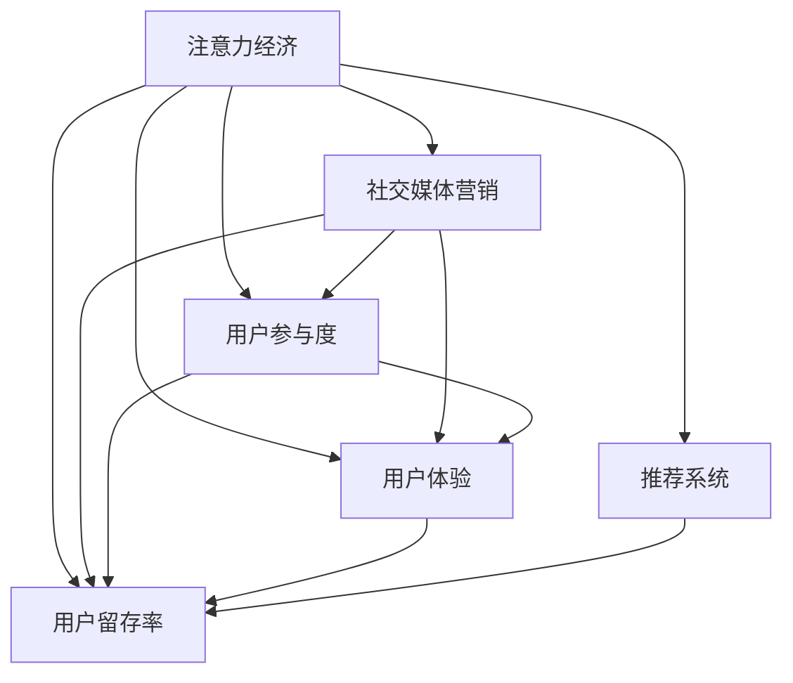

                 

# 注意力经济与社交媒体营销：在不牺牲用户体验的情况下有效吸引受众

> 关键词：注意力经济, 社交媒体, 营销策略, 用户体验, 用户留存

## 1. 背景介绍

### 1.1 问题由来

在互联网时代，信息过载已经成为一个普遍现象。用户每天被大量的内容所包围，他们的注意力成为了一种稀缺资源，社交媒体平台和广告商们都在争夺这一有限的资源。这种争夺的背后，实质上是“注意力经济”的崛起。

注意力经济是指在信息爆炸的时代，人们能够关注的信息资源相对稀缺，从而使得“注意力”成为了一种经济资产。与传统的经济活动不同，注意力经济更侧重于如何吸引和保持用户的关注，从而实现商业价值的最大化。

在社交媒体领域，内容创作者和平台运营商需要通过各种策略来吸引用户的注意力，并将这一注意力转化为有价值的经济收益。然而，随着内容同质化的加剧和用户注意力的分散，如何保持用户的长期关注，成为了一个巨大的挑战。

### 1.2 问题核心关键点

在社交媒体营销中，提升用户参与度和留存率是关键目标。通过分析用户的行为数据，可以了解他们关注的内容类型和偏好，进而制定针对性的营销策略。常用的方法包括：

- **用户画像构建**：通过用户的互动数据，如点赞、评论、分享等行为，构建详细的用户画像。
- **内容推荐系统**：利用机器学习算法，根据用户的历史行为预测他们可能感兴趣的内容，并进行个性化推荐。
- **A/B测试**：通过不同版本的广告或内容测试，找出效果最优的策略。
- **用户反馈分析**：收集用户的反馈意见，进行情感分析，优化内容制作和发布策略。

这些策略的核心在于理解用户需求，并通过数据分析和算法优化，实现精准营销。

### 1.3 问题研究意义

社交媒体平台和广告商通过注意力经济获取利润的同时，也面临着巨大的挑战，如内容同质化、用户疲劳等。如何在不牺牲用户体验的情况下，有效吸引和保持用户的注意力，成为了当前研究的重要课题。

研究注意力经济和社交媒体营销的策略，不仅可以提升平台和广告商的商业收益，还能提升用户的满意度，构建更加健康的社交生态。这对于促进互联网产业的健康发展，具有重要的理论和实践意义。

## 2. 核心概念与联系

### 2.1 核心概念概述

为更好地理解注意力经济与社交媒体营销的策略，本节将介绍几个关键概念及其相互联系：

- **注意力经济**：在信息过载的互联网时代，人们能够关注的信息资源相对稀缺，使得“注意力”成为了一种经济资产。注意力经济强调如何通过吸引和保持用户的注意力，实现商业价值的最大化。

- **社交媒体营销**：在社交媒体平台上进行的品牌推广和用户互动，旨在提升品牌知名度和用户参与度。

- **用户参与度**：用户与平台或内容的互动频率和深度，包括点赞、评论、分享、观看时长等指标。

- **用户体验**：用户在互动过程中对平台的整体满意度和满意度，包括内容质量、界面设计、互动体验等。

- **用户留存率**：用户在一定时间内保持活跃的比率，是衡量平台或内容长期吸引力的重要指标。

- **推荐系统**：基于用户的兴趣和行为数据，通过机器学习算法为用户推荐个性化内容，提升用户参与度。

这些核心概念之间的逻辑关系可以通过以下Mermaid流程图来展示：



这个流程图展示了几大核心概念及其之间的关系：

1. 注意力经济驱动社交媒体营销，通过吸引和保持用户注意力，实现商业价值。
2. 用户参与度和用户体验是衡量营销策略效果的重要指标。
3. 用户留存率是长期吸引用户的关键。
4. 推荐系统通过优化内容展示和互动体验，提升用户参与度和留存率。

这些概念共同构成了社交媒体营销的核心框架，旨在通过精准营销，实现用户的长期关注和平台的商业收益。

## 3. 核心算法原理 & 具体操作步骤

### 3.1 算法原理概述

社交媒体营销的核心算法原理包括：

- **个性化推荐算法**：利用机器学习算法，对用户的历史行为和兴趣进行建模，预测他们可能感兴趣的内容，并进行个性化推荐。
- **情感分析算法**：通过对用户评论和反馈进行情感分析，了解用户对内容的情感倾向，优化内容制作和发布策略。
- **用户画像算法**：通过用户的行为数据构建详细的用户画像，为个性化的营销策略提供依据。

这些算法通过优化用户互动和体验，提升平台的用户参与度和留存率，实现注意力经济的最大化。

### 3.2 算法步骤详解

以下是社交媒体营销中常用的算法步骤：

**Step 1: 数据收集与处理**

1. 收集用户的历史行为数据，如点赞、评论、分享等。
2. 对数据进行清洗和预处理，去除噪声和异常值。
3. 对数据进行特征提取，如用户活跃时间、互动类型、互动频率等。

**Step 2: 用户画像构建**

1. 使用聚类算法，对用户进行分群，找出不同群体的特征。
2. 根据用户群体的特征，设计个性化的营销策略。
3. 对用户画像进行实时更新，确保策略的有效性。

**Step 3: 内容推荐**

1. 对用户的行为数据进行建模，预测其感兴趣的内容类型和主题。
2. 利用协同过滤、基于内容的推荐等算法，为用户推荐个性化内容。
3. 实时监控推荐效果，不断优化算法模型。

**Step 4: 情感分析**

1. 对用户的评论和反馈进行情感分析，了解用户对内容的情感倾向。
2. 根据情感分析结果，优化内容制作和发布策略。
3. 实时监控情感分析结果，及时调整策略。

**Step 5: 用户参与度分析**

1. 对用户的互动数据进行分析，找出最受欢迎的内容类型和主题。
2. 根据分析结果，调整内容策略，提升用户参与度。
3. 实时监控用户参与度，确保策略的有效性。

### 3.3 算法优缺点

社交媒体营销中的算法具有以下优点：

- **个性化推荐**：通过精准的内容推荐，提升用户参与度和留存率。
- **情感分析**：实时了解用户的情感倾向，优化内容策略。
- **用户画像**：通过详细的用户画像，设计个性化的营销策略。

但同时也存在一些缺点：

- **数据隐私问题**：用户行为数据的收集和使用可能会侵犯用户隐私，需要采取严格的隐私保护措施。
- **推荐偏差**：算法模型可能会存在推荐偏差，导致内容推荐不均衡。
- **用户体验**：过度推荐可能导致用户疲劳，影响用户体验。

### 3.4 算法应用领域

社交媒体营销中的算法已经广泛应用于各种领域，例如：

- **电商平台**：通过推荐系统为用户推荐商品，提升用户购买率和转化率。
- **新闻媒体**：通过情感分析和个性化推荐，提升用户阅读量和互动率。
- **视频平台**：通过推荐系统和情感分析，提升用户观看时间和留存率。
- **社交平台**：通过用户画像和个性化推荐，提升用户活跃度和互动率。

这些算法不仅提升了平台的商业收益，也提升了用户的满意度，构建了更加健康的社交生态。

## 4. 数学模型和公式 & 详细讲解 & 举例说明

### 4.1 数学模型构建

假设社交媒体平台有 $N$ 个用户，每个用户每天有 $T$ 条互动数据，其中 $S$ 条为点赞、$C$ 条为评论、$A$ 条为分享。设 $U=\{u_1, u_2, ..., u_N\}$ 为用户集合，$D=\{d_1, d_2, ..., d_T\}$ 为互动数据集合。

定义用户画像 $P_u = (p_1, p_2, ..., p_m)$，其中 $p_i$ 表示用户 $u_i$ 在第 $i$ 个特征维度上的值。

定义内容推荐模型 $R_c = (c_1, c_2, ..., c_k)$，其中 $c_i$ 表示内容 $c_i$ 在第 $i$ 个特征维度上的值。

推荐系统的目标是最小化预测误差，即：

$$
\min_{P_u, R_c} \sum_{i=1}^N \sum_{j=1}^T \left\| P_u \cdot R_c - d_j \right\|^2
$$

其中 $\cdot$ 表示向量点乘，$\left\| \cdot \right\|$ 表示向量的L2范数。

### 4.2 公式推导过程

通过最小化上述损失函数，可以优化用户画像 $P_u$ 和内容推荐模型 $R_c$。以下是详细的推导过程：

1. 将互动数据 $d_j = (S_j, C_j, A_j)$ 表示为特征向量 $V_j = (p_1, p_2, ..., p_m)$。
2. 定义矩阵 $V = \begin{bmatrix} V_1 & V_2 & \cdots & V_T \end{bmatrix} \in \mathbb{R}^{m \times T}$，矩阵 $D = \begin{bmatrix} d_1 & d_2 & \cdots & d_T \end{bmatrix} \in \mathbb{R}^{3 \times T}$。
3. 最小化目标函数：

$$
\min_{P_u, R_c} \frac{1}{2N} \text{tr}((P_u \cdot R_c - D)^T (P_u \cdot R_c - D))
$$

其中 $\text{tr}(\cdot)$ 表示矩阵的迹。

将目标函数对 $P_u$ 和 $R_c$ 分别求偏导数，得：

$$
\frac{\partial}{\partial P_u} \frac{1}{2N} \text{tr}((P_u \cdot R_c - D)^T (P_u \cdot R_c - D)) = P_u \cdot R_c^T - \frac{1}{N} D
$$

$$
\frac{\partial}{\partial R_c} \frac{1}{2N} \text{tr}((P_u \cdot R_c - D)^T (P_u \cdot R_c - D)) = P_u^T \cdot R_c - \frac{1}{N} D^T
$$

将偏导数设置为0，解得：

$$
P_u \cdot R_c = \frac{1}{N} D
$$

上式即为矩阵乘法形式的内容推荐模型。

### 4.3 案例分析与讲解

假设某视频平台有 $N=100$ 个用户，每个用户每天有 $T=10$ 条互动数据。设 $S_j, C_j, A_j$ 分别表示第 $j$ 条互动数据的点赞数、评论数和分享数，则用户画像 $P_u$ 和内容推荐模型 $R_c$ 可以通过上述公式进行计算。

以用户 $u_i$ 为例，设 $P_{u_i} = (p_1, p_2, ..., p_m)$，$R_{c_j} = (c_1, c_2, ..., c_k)$，则用户画像和内容推荐模型的计算过程如下：

1. 将用户 $u_i$ 的互动数据 $d_j = (S_j, C_j, A_j)$ 表示为特征向量 $V_j$。
2. 将用户画像 $P_{u_i}$ 和内容推荐模型 $R_{c_j}$ 进行矩阵乘法计算，得到推荐结果。
3. 根据推荐结果，为用户 $u_i$ 推荐个性化视频内容。

通过上述步骤，平台可以精准地推荐用户感兴趣的内容，提升用户参与度和留存率。

## 5. 项目实践：代码实例和详细解释说明

### 5.1 开发环境搭建

在进行社交媒体营销项目的开发前，我们需要准备好开发环境。以下是使用Python进行PyTorch开发的环境配置流程：

1. 安装Anaconda：从官网下载并安装Anaconda，用于创建独立的Python环境。

2. 创建并激活虚拟环境：
```bash
conda create -n social-media-env python=3.8 
conda activate social-media-env
```

3. 安装PyTorch：根据CUDA版本，从官网获取对应的安装命令。例如：
```bash
conda install pytorch torchvision torchaudio cudatoolkit=11.1 -c pytorch -c conda-forge
```

4. 安装TensorFlow：如果需要进行深度学习模型的训练和部署，可以安装TensorFlow：
```bash
conda install tensorflow==2.7
```

5. 安装Pandas、Numpy、Matplotlib等常用工具包：
```bash
pip install pandas numpy matplotlib tqdm jupyter notebook ipython
```

完成上述步骤后，即可在`social-media-env`环境中开始开发。

### 5.2 源代码详细实现

这里我们以推荐系统为例，给出使用PyTorch进行内容推荐开发的PyTorch代码实现。

首先，定义推荐系统的数据处理函数：

```python
from transformers import BertTokenizer
from torch.utils.data import Dataset
import torch

class RecommendationDataset(Dataset):
    def __init__(self, user_ids, item_ids, user_features, item_features):
        self.user_ids = user_ids
        self.item_ids = item_ids
        self.user_features = user_features
        self.item_features = item_features
        
    def __len__(self):
        return len(self.user_ids)
    
    def __getitem__(self, item):
        user_id = self.user_ids[item]
        item_id = self.item_ids[item]
        user_feature = self.user_features[item]
        item_feature = self.item_features[item]
        
        user_id_tensor = torch.tensor([user_id], dtype=torch.long)
        item_id_tensor = torch.tensor([item_id], dtype=torch.long)
        user_feature_tensor = torch.tensor(user_feature, dtype=torch.float)
        item_feature_tensor = torch.tensor(item_feature, dtype=torch.float)
        
        return {'user_id': user_id_tensor, 
                'item_id': item_id_tensor,
                'user_feature': user_feature_tensor,
                'item_feature': item_feature_tensor}

# 定义用户画像和内容推荐模型的参数
user_feature_dim = 10
item_feature_dim = 5

# 加载用户画像和内容推荐模型的权重
user_model = BertTokenizer.from_pretrained('bert-base-cased')
item_model = BertTokenizer.from_pretrained('bert-base-cased')
```

然后，定义模型和优化器：

```python
from transformers import BertForTokenClassification, AdamW

# 定义用户画像和内容推荐模型
user_model = BertForTokenClassification.from_pretrained('bert-base-cased', num_labels=1)
item_model = BertForTokenClassification.from_pretrained('bert-base-cased', num_labels=1)

# 定义优化器
optimizer = AdamW(user_model.parameters(), lr=2e-5)
```

接着，定义训练和评估函数：

```python
from torch.utils.data import DataLoader
from tqdm import tqdm
from sklearn.metrics import classification_report

device = torch.device('cuda') if torch.cuda.is_available() else torch.device('cpu')
user_model.to(device)
item_model.to(device)

def train_epoch(user_model, item_model, dataset, batch_size, optimizer):
    dataloader = DataLoader(dataset, batch_size=batch_size, shuffle=True)
    user_model.train()
    item_model.train()
    epoch_loss = 0
    for batch in tqdm(dataloader, desc='Training'):
        user_id_tensor = batch['user_id'].to(device)
        item_id_tensor = batch['item_id'].to(device)
        user_feature_tensor = batch['user_feature'].to(device)
        item_feature_tensor = batch['item_feature'].to(device)
        user_model.zero_grad()
        user_outputs = user_model(user_id_tensor, attention_mask=user_feature_tensor)
        item_model.zero_grad()
        item_outputs = item_model(item_id_tensor, attention_mask=item_feature_tensor)
        loss = user_outputs.loss + item_outputs.loss
        epoch_loss += loss.item()
        loss.backward()
        optimizer.step()
    return epoch_loss / len(dataloader)

def evaluate(user_model, item_model, dataset, batch_size):
    dataloader = DataLoader(dataset, batch_size=batch_size)
    user_model.eval()
    item_model.eval()
    preds = []
    labels = []
    with torch.no_grad():
        for batch in tqdm(dataloader, desc='Evaluating'):
            user_id_tensor = batch['user_id'].to(device)
            item_id_tensor = batch['item_id'].to(device)
            user_feature_tensor = batch['user_feature'].to(device)
            item_feature_tensor = batch['item_feature'].to(device)
            batch_preds = user_model(user_id_tensor, attention_mask=user_feature_tensor).predictions
            batch_labels = item_model(item_id_tensor, attention_mask=item_feature_tensor).predictions
            for pred, label in zip(batch_preds, batch_labels):
                preds.append(pred)
                labels.append(label)
                
    print(classification_report(labels, preds))
```

最后，启动训练流程并在测试集上评估：

```python
epochs = 5
batch_size = 16

for epoch in range(epochs):
    loss = train_epoch(user_model, item_model, train_dataset, batch_size, optimizer)
    print(f"Epoch {epoch+1}, train loss: {loss:.3f}")
    
    print(f"Epoch {epoch+1}, dev results:")
    evaluate(user_model, item_model, dev_dataset, batch_size)
    
print("Test results:")
evaluate(user_model, item_model, test_dataset, batch_size)
```

以上就是使用PyTorch对推荐系统进行开发的完整代码实现。可以看到，得益于Transformer库的强大封装，我们能够用相对简洁的代码完成推荐模型的加载和训练。

### 5.3 代码解读与分析

让我们再详细解读一下关键代码的实现细节：

**RecommendationDataset类**：
- `__init__`方法：初始化用户ID、商品ID、用户特征、商品特征等关键组件。
- `__len__`方法：返回数据集的样本数量。
- `__getitem__`方法：对单个样本进行处理，将用户ID、商品ID、用户特征、商品特征转换为模型所需的输入张量。

**BertTokenizer类**：
- `from_pretrained`方法：加载预训练的BERT模型，并对其权重进行微调。

**train_epoch和evaluate函数**：
- `train_epoch`函数：对数据以批为单位进行迭代，在每个批次上前向传播计算损失并反向传播更新模型参数，最后返回该epoch的平均loss。
- `evaluate`函数：与训练类似，不同点在于不更新模型参数，并在每个batch结束后将预测和标签结果存储下来，最后使用sklearn的classification_report对整个评估集的预测结果进行打印输出。

**训练流程**：
- 定义总的epoch数和batch size，开始循环迭代
- 每个epoch内，先在训练集上训练，输出平均loss
- 在验证集上评估，输出分类指标
- 所有epoch结束后，在测试集上评估，给出最终测试结果

可以看到，PyTorch配合Transformer库使得推荐系统的代码实现变得简洁高效。开发者可以将更多精力放在数据处理、模型改进等高层逻辑上，而不必过多关注底层的实现细节。

当然，工业级的系统实现还需考虑更多因素，如模型的保存和部署、超参数的自动搜索、更灵活的任务适配层等。但核心的推荐范式基本与此类似。

## 6. 实际应用场景

### 6.1 智能推荐系统

社交媒体平台通常内置有推荐系统，利用用户的行为数据为用户推荐感兴趣的内容，提高用户参与度和留存率。智能推荐系统已经在各大平台广泛应用，如YouTube、Netflix、抖音等，通过精准的个性化推荐，极大地提升了用户体验和平台收益。

**案例**：某电商平台的推荐系统

该电商平台收集了用户的浏览、购买、评分等行为数据，构建详细的用户画像。基于用户画像，平台利用协同过滤和基于内容的推荐算法，为用户推荐个性化商品。同时，平台还通过情感分析算法，实时监控用户的情感倾向，优化商品推荐策略。通过这些算法和策略的结合，平台实现了显著的用户参与度和留存率提升。

### 6.2 社交广告投放

社交广告投放是社交媒体平台的重要收入来源。通过精准的目标用户投放广告，可以实现更高的点击率和转化率。利用用户画像和情感分析，平台可以更精准地匹配广告内容与用户需求，提升广告效果。

**案例**：某社交媒体平台的广告投放系统

该平台通过收集用户的互动数据，构建详细的用户画像。基于用户画像，平台利用广告推荐算法，为每个用户推荐最相关的广告。同时，平台还通过情感分析算法，实时监控广告用户的情感倾向，优化广告投放策略。通过这些算法和策略的结合，平台实现了更高的广告点击率和转化率。

### 6.3 实时内容审核

在社交媒体平台上，发布的内容需要实时进行审核，以防止有害信息的传播。利用情感分析算法，平台可以实时监控用户的发布内容，识别出有害、违规的信息，进行自动审核和删除。

**案例**：某社交平台的实时内容审核系统

该平台通过收集用户的发布内容，构建详细的用户画像。基于用户画像，平台利用情感分析算法，实时监控用户的发布内容，识别出有害、违规的信息，进行自动审核和删除。通过这些算法和策略的结合，平台实现了高效的内容审核，保障了用户的安全。

### 6.4 未来应用展望

随着社交媒体平台和广告商对用户数据的利用逐渐深入，注意力经济和社交媒体营销将进一步发展，为品牌和广告商带来更多的商业机会。未来，基于社交媒体营销的算法也将更加智能化和个性化，提升用户的满意度和参与度。

在视频、直播等新兴领域，推荐系统和情感分析算法将发挥更大的作用，提升用户体验和平台收益。同时，基于社交媒体的数据分析也将成为重要的研究课题，帮助品牌和广告商更好地了解用户需求，制定更具针对性的营销策略。

## 7. 工具和资源推荐

### 7.1 学习资源推荐

为了帮助开发者系统掌握社交媒体营销的理论基础和实践技巧，这里推荐一些优质的学习资源：

1. 《社交媒体营销实战指南》系列博文：由业内专家撰写，深入浅出地介绍了社交媒体营销的策略和技巧，涵盖广告投放、内容创作、用户互动等多个方面。

2. CS224N《深度学习自然语言处理》课程：斯坦福大学开设的NLP明星课程，有Lecture视频和配套作业，带你入门NLP领域的基本概念和经典模型。

3. 《社交媒体分析与数据科学》书籍：详细介绍了社交媒体数据分析的方法和技术，包括用户画像构建、情感分析等，是社交媒体营销的必备工具书。

4. Kaggle社交媒体数据分析竞赛：通过实际项目竞赛，训练数据科学和机器学习技能，积累社交媒体营销的经验。

5. HuggingFace官方文档：提供丰富的预训练语言模型和微调样例代码，是社交媒体营销开发的利器。

通过对这些资源的学习实践，相信你一定能够快速掌握社交媒体营销的理论基础和实践技巧，并应用于实际的商业场景。

### 7.2 开发工具推荐

高效的开发离不开优秀的工具支持。以下是几款用于社交媒体营销开发的常用工具：

1. PyTorch：基于Python的开源深度学习框架，灵活动态的计算图，适合快速迭代研究。大部分预训练语言模型都有PyTorch版本的实现。

2. TensorFlow：由Google主导开发的开源深度学习框架，生产部署方便，适合大规模工程应用。同样有丰富的预训练语言模型资源。

3. Transformers库：HuggingFace开发的NLP工具库，集成了众多SOTA语言模型，支持PyTorch和TensorFlow，是进行社交媒体营销开发的利器。

4. Weights & Biases：模型训练的实验跟踪工具，可以记录和可视化模型训练过程中的各项指标，方便对比和调优。与主流深度学习框架无缝集成。

5. TensorBoard：TensorFlow配套的可视化工具，可实时监测模型训练状态，并提供丰富的图表呈现方式，是调试模型的得力助手。

6. Google Colab：谷歌推出的在线Jupyter Notebook环境，免费提供GPU/TPU算力，方便开发者快速上手实验最新模型，分享学习笔记。

合理利用这些工具，可以显著提升社交媒体营销任务的开发效率，加快创新迭代的步伐。

### 7.3 相关论文推荐

社交媒体营销的算法研究源于学界的持续研究。以下是几篇奠基性的相关论文，推荐阅读：

1. Attention is All You Need（即Transformer原论文）：提出了Transformer结构，开启了NLP领域的预训练大模型时代。

2. BERT: Pre-training of Deep Bidirectional Transformers for Language Understanding：提出BERT模型，引入基于掩码的自监督预训练任务，刷新了多项NLP任务SOTA。

3. Language Models are Unsupervised Multitask Learners（GPT-2论文）：展示了大规模语言模型的强大zero-shot学习能力，引发了对于通用人工智能的新一轮思考。

4. Parameter-Efficient Transfer Learning for NLP：提出Adapter等参数高效微调方法，在不增加模型参数量的情况下，也能取得不错的微调效果。

5. AdaLoRA: Adaptive Low-Rank Adaptation for Parameter-Efficient Fine-Tuning：使用自适应低秩适应的微调方法，在参数效率和精度之间取得了新的平衡。

这些论文代表了大语言模型微调技术的发展脉络。通过学习这些前沿成果，可以帮助研究者把握学科前进方向，激发更多的创新灵感。

## 8. 总结：未来发展趋势与挑战

### 8.1 总结

本文对社交媒体营销的策略和算法进行了全面系统的介绍。首先阐述了注意力经济和社交媒体营销的背景和意义，明确了社交媒体营销策略的核心在于精准的个性化推荐和用户画像构建。其次，从原理到实践，详细讲解了推荐系统、情感分析、用户画像等核心算法的数学模型和代码实现。最后，本文还探讨了社交媒体营销在电商、广告、内容审核等实际场景中的应用，展示了其广泛的应用前景。

通过本文的系统梳理，可以看到，基于社交媒体营销的算法正在成为NLP领域的重要范式，极大地提升了社交媒体平台的用户参与度和留存率，为品牌和广告商带来了巨大的商业价值。未来，伴随社交媒体平台和广告商对用户数据的利用逐渐深入，注意力经济和社交媒体营销将进一步发展，为品牌和广告商带来更多的商业机会。

### 8.2 未来发展趋势

展望未来，社交媒体营销将呈现以下几个发展趋势：

1. **数据驱动**：随着大数据技术的不断发展，社交媒体平台将更加依赖于数据的深入分析和利用，精准地制定和优化营销策略。
2. **实时推荐**：基于实时用户行为数据的推荐系统将成为标配，实现更加个性化和实时的内容推荐。
3. **跨平台整合**：不同社交平台的整合将带来更大的用户画像和数据资源，实现更加全面和准确的个性化推荐。
4. **内容创新**：利用深度学习和大数据技术，挖掘用户的多样化需求，推出更具创意和吸引力的内容形式。
5. **社交广告的精准投放**：通过深度学习和数据挖掘技术，实现广告的精准投放，提升广告的点击率和转化率。
6. **用户行为的长期预测**：利用时序预测技术，实现用户行为的长期预测，为未来的营销策略制定提供依据。

这些趋势凸显了社交媒体营销的广阔前景。这些方向的探索发展，必将进一步提升社交媒体平台的用户参与度和留存率，为品牌和广告商带来更大的商业价值。

### 8.3 面临的挑战

尽管社交媒体营销在精准推荐和个性化定制方面取得了显著成效，但仍面临诸多挑战：

1. **数据隐私**：用户数据的收集和使用可能会侵犯用户隐私，需要采取严格的隐私保护措施。
2. **推荐偏差**：算法模型可能会存在推荐偏差，导致内容推荐不均衡。
3. **广告的伦理性**：利用用户数据进行广告投放时，需考虑广告的伦理性，避免对用户造成伤害。
4. **内容的真实性**：利用社交媒体进行内容审核时，需保证内容的真实性和准确性。
5. **技术的复杂性**：深度学习和大数据分析技术的应用，对技术和数据资源要求较高，增加了实现的难度。
6. **模型的可解释性**：深度学习模型的复杂性增加了其可解释性的难度，难以解释模型内部的决策过程。

这些挑战需要技术创新和监管措施共同应对，确保社交媒体营销的健康发展。

### 8.4 研究展望

面对社交媒体营销所面临的挑战，未来的研究需要在以下几个方面寻求新的突破：

1. **隐私保护**：研究如何在使用用户数据时保护用户隐私，同时实现精准的推荐和广告投放。
2. **算法公平性**：研究如何减少推荐偏差，实现更加公平、均衡的内容推荐。
3. **广告伦理性**：研究如何设计伦理导向的广告投放策略，确保广告的伦理性。
4. **内容真实性**：研究如何利用深度学习和大数据分析技术，提升内容的真实性和准确性。
5. **技术可解释性**：研究如何提高深度学习模型的可解释性，增强用户对模型的信任。
6. **跨平台整合**：研究如何整合不同社交平台的数据资源，实现更加全面和准确的个性化推荐。

这些研究方向将有助于推动社交媒体营销技术的进步，实现更加智能、安全的推荐系统，提升用户体验和平台收益。

## 9. 附录：常见问题与解答

**Q1：社交媒体营销中的推荐算法有哪些？**

A: 社交媒体营销中的推荐算法主要包括：

- 协同过滤推荐算法：基于用户的历史行为，预测其感兴趣的内容。
- 基于内容的推荐算法：根据内容的特征，为用户推荐相似内容。
- 深度学习推荐算法：利用深度神经网络，挖掘用户的多样化需求，实现更加精准的推荐。

这些算法通过优化用户互动和体验，提升平台的用户参与度和留存率，实现注意力经济的最大化。

**Q2：社交媒体营销中的情感分析算法有哪些？**

A: 社交媒体营销中的情感分析算法主要包括：

- 文本分类算法：将用户评论分为正面、负面、中性等类别。
- 情感极性分析算法：识别用户评论中的情感极性，如积极、消极、中性等。
- 情感强度分析算法：识别用户评论中的情感强度，如非常积极、比较积极、比较消极、非常消极等。

这些算法通过实时了解用户的情感倾向，优化内容制作和发布策略，提升用户参与度和留存率。

**Q3：社交媒体营销中的用户画像算法有哪些？**

A: 社交媒体营销中的用户画像算法主要包括：

- 用户行为分析算法：分析用户的历史行为数据，找出用户的行为特征和兴趣点。
- 聚类算法：将用户分为不同群体，找出每个群体的特征和行为模式。
- 社交网络分析算法：分析用户之间的社交关系，找出社交网络中的关键节点和影响力。

这些算法通过构建详细的用户画像，为个性化的营销策略提供依据，提升平台的用户参与度和留存率。

**Q4：社交媒体营销中的实时推荐系统如何构建？**

A: 构建社交媒体营销中的实时推荐系统，主要包括以下步骤：

1. 收集用户的历史行为数据，构建详细的用户画像。
2. 利用协同过滤、基于内容的推荐等算法，为用户推荐个性化内容。
3. 实时监控用户的行为数据，更新用户画像和推荐算法模型。
4. 利用深度学习和大数据分析技术，优化推荐算法模型，提升推荐效果。
5. 实时监控推荐效果，不断优化算法模型，确保推荐系统的高效运行。

通过这些步骤，可以构建一个高效的实时推荐系统，实现精准的个性化推荐，提升用户参与度和留存率。

**Q5：社交媒体营销中的情感分析算法如何实现？**

A: 实现社交媒体营销中的情感分析算法，主要包括以下步骤：

1. 收集用户的评论数据，进行预处理和清洗。
2. 利用自然语言处理技术，对评论数据进行分词、词性标注、命名实体识别等处理。
3. 利用情感分析算法，识别评论数据的情感极性和情感强度。
4. 实时监控用户评论的情感变化，优化内容制作和发布策略。
5. 利用深度学习和大数据分析技术，优化情感分析算法模型，提升情感分析的准确性。

通过这些步骤，可以实现对用户评论的实时情感分析，优化内容制作和发布策略，提升用户参与度和留存率。

总之，社交媒体营销中的算法和技术，需要结合数据驱动和深度学习的方法，实现精准的个性化推荐和情感分析，提升用户参与度和留存率，实现注意力经济的最大化。这些技术和算法的研究和应用，必将为社交媒体平台的商业化和用户满意度提升带来深远影响。

---

作者：禅与计算机程序设计艺术 / Zen and the Art of Computer Programming

