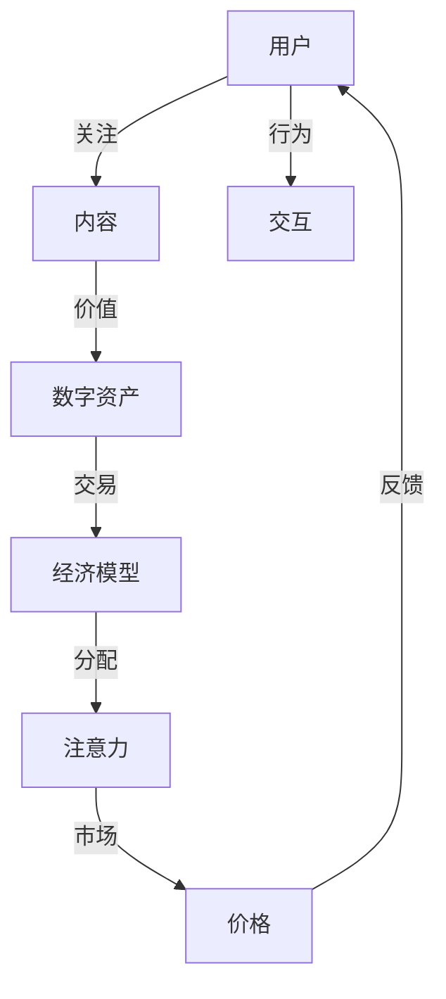
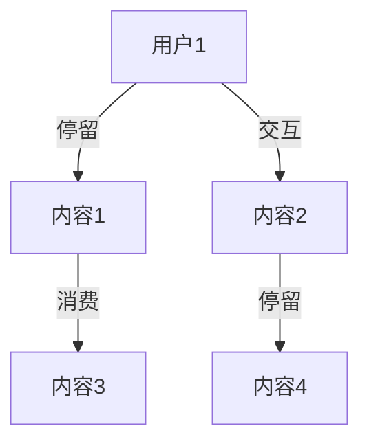
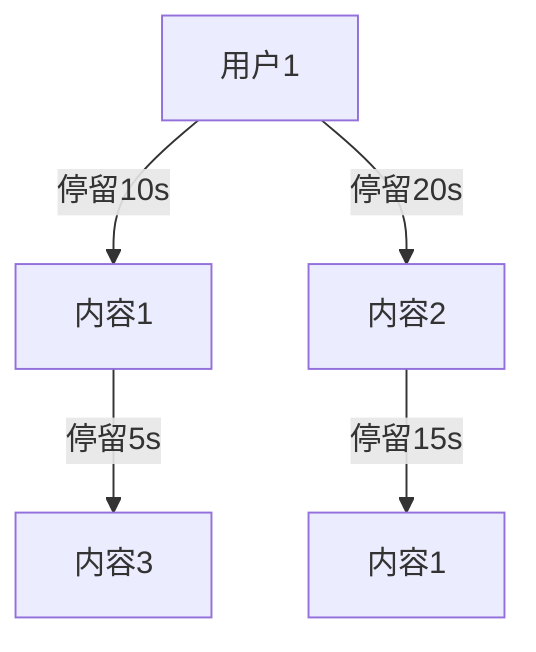

                 

# 注意力经济学理论:元宇宙中的价值重构

> 关键词：注意力经济学,元宇宙,价值重构,数字资产,经济模型,用户行为

## 1. 背景介绍

### 1.1 问题由来

随着移动互联网和5G技术的快速发展，数字经济正处于一个高速发展阶段。元宇宙（Metaverse）作为虚拟与现实深度融合的产物，正在引领一场新的数字革命。然而，元宇宙的构建和发展不仅依赖于先进的技术，更需要一种全新的经济模型来支撑。在元宇宙中，价值不仅限于物质和货币，还包括了注意力、关系和体验等非物质形式。

注意力经济学（Attention Economics），作为一种新兴的经济理论，提供了一种理解用户行为和资源配置的新视角。本文将从注意力经济学的角度，探讨元宇宙中的价值重构，并提出一种基于注意力的经济模型。

### 1.2 问题核心关键点

- 注意力经济学：基于信息经济学和行为经济学的交叉学科，研究用户注意力分配和市场价值评估。
- 元宇宙：基于区块链和虚拟现实技术，构建的虚拟数字世界。
- 价值重构：重塑元宇宙中价值和资源分配的新方式，以适应非物质化、去中心化、分布式的特征。
- 数字资产：虚拟货币、NFT、游戏货币等元宇宙中可交易的资产。
- 经济模型：元宇宙中所有经济活动的行为和交互规则。

这些核心概念之间存在着紧密的联系。注意力经济学提供了一种新的视角，帮助理解元宇宙中价值和资源配置的基本规律。而元宇宙则提供了一个全新的应用场景，验证和扩展注意力经济学的理论。

## 2. 核心概念与联系

### 2.1 核心概念概述

在元宇宙中，价值并非仅限于传统意义上的物质和货币，还包括了用户的注意力、时间和体验等非物质资源。这些资源在元宇宙中的分配和利用，需要一种新的经济模型来指导和规范。注意力经济学则提供了一种全新的理论框架，通过研究用户的注意力分配，来评估和配置各种资源的价值。

注意力经济学认为，用户的注意力是稀缺的资源，其分配方式决定了各种数字资产的价值。在元宇宙中，这种价值分配机制将重构传统的货币和经济模式，带来全新的商业机会和价值创造方式。

### 2.2 核心概念原理和架构的 Mermaid 流程图



这个流程图展示了注意力经济学在元宇宙中的核心原理和架构：

1. 用户关注内容，形成注意力资源。
2. 内容生成数字资产，并形成市场价格。
3. 市场价格反馈到用户行为和注意力分配中。
4. 注意力和价值在市场中进行循环迭代。

这一循环迭代过程，是元宇宙中价值重构的关键。通过注意力经济学，可以实现对用户注意力、数字资产和市场价格三者之间的动态平衡。

## 3. 核心算法原理 & 具体操作步骤

### 3.1 算法原理概述

基于注意力经济学的元宇宙经济模型，将用户的注意力资源视为一种货币，通过对注意力的流动和分配，来评估和分配各种数字资产的价值。该模型假设：

1. 用户的注意力是有限的，需要被合理分配。
2. 用户对不同内容的价值评估不同，形成不同的注意力需求。
3. 数字资产的价值与其获得注意力的多少成正比。

基于这些假设，模型通过优化用户注意力的分配，来最大化数字资产的价值。这一过程，可以通过以下三个步骤来实现：

1. 收集用户注意力数据，并建立注意力流量图。
2. 利用优化算法，求解最优注意力分配策略。
3. 根据注意力分配，动态调整数字资产的价格。

### 3.2 算法步骤详解

#### 3.2.1 数据收集与处理

首先需要收集用户在元宇宙中的注意力数据。这些数据包括：

- 用户在平台上的停留时间
- 用户在平台上进行的交互次数
- 用户在平台上消费的数字资产

利用这些数据，可以建立用户的注意力流量图，如图2所示：



这个图展示了用户在不同内容上的注意力流动情况。根据这些数据，可以计算出每个内容的注意力流向和注意力总量。

#### 3.2.2 注意力分配策略求解

基于注意力流量图，可以建立一个优化模型，目标是最小化注意力成本，同时最大化数字资产的价值。模型可以表示为：

$$
\min_{\pi} \sum_{i,j} c_{ij} \cdot \pi_{ij} + \lambda \sum_{i} s_i \cdot (u_i - \pi_i)
$$

其中，$\pi$为注意力分配策略，$c_{ij}$为注意力流向成本，$s_i$为用户对内容的价值评估，$u_i$为用户实际支付的数字资产。$\lambda$为权重系数，平衡注意力成本和数字资产价值的关系。

利用优化算法，如线性规划、非线性规划等，求解最优的注意力分配策略。该策略将指导平台如何合理分配用户的注意力资源。

#### 3.2.3 数字资产价格调整

根据注意力分配策略，可以动态调整数字资产的价格。假设某内容获得的注意力总量为$A_i$，其价值评估为$s_i$，则该内容所产生的数字资产价值为$V_i = A_i \cdot s_i$。根据优化结果，调整数字资产的价格，使其与用户对内容的价值评估相匹配。

通过动态调整价格，元宇宙中的数字资产价值将与用户的注意力分配保持一致，实现资源的有效配置。

### 3.3 算法优缺点

#### 3.3.1 优点

1. **动态调整价值**：通过注意力流量的实时分析，元宇宙中的数字资产价格可以动态调整，适应市场需求变化。
2. **用户价值最大化**：利用优化算法，实现用户的注意力资源和数字资产价值的最优分配，提高用户满意度。
3. **资源优化配置**：通过优化算法，实现资源的高效配置，减少浪费和冗余。
4. **去中心化管理**：用户注意力和数字资产价值的分配由算法决定，减少了中心化管理的风险。

#### 3.3.2 缺点

1. **算法复杂度高**：优化模型的求解过程较为复杂，需要高效的计算资源。
2. **用户行为多样性**：用户的行为多样性可能导致注意力分配结果的偏差。
3. **数据隐私问题**：用户的注意力数据需要保护，避免数据泄露和滥用。
4. **算法鲁棒性**：算法的鲁棒性需要进一步验证，确保在异常数据和攻击情况下仍能保持稳定。

### 3.4 算法应用领域

基于注意力经济学的元宇宙经济模型，可以应用于以下领域：

1. **游戏经济**：通过用户的注意力分配，动态调整游戏内货币、道具等数字资产的价值。
2. **社交平台**：优化用户的注意力资源，提高社交平台的活跃度和用户粘性。
3. **内容平台**：评估用户对不同内容的价值，指导内容的生产和分配。
4. **数字艺术品**：通过用户的注意力流量，评估数字艺术品的市场价值和热度。
5. **虚拟房地产**：评估用户对虚拟空间的注意力，指导虚拟土地的分配和开发。

这些领域的应用，将极大地提升元宇宙中的价值分配效率和资源利用效率。

## 4. 数学模型和公式 & 详细讲解 & 举例说明

### 4.1 数学模型构建

基于注意力经济学的元宇宙经济模型，可以分为三个主要部分：注意力流量图、优化模型和价格调整模型。

注意力流量图描述用户在不同内容上的注意力流向，可以表示为有向图$G=(V,E)$，其中$V$为内容节点集合，$E$为注意力流向边集合。

优化模型用于求解最优注意力分配策略，可以表示为线性规划问题：

$$
\min_{\pi} \sum_{i,j} c_{ij} \cdot \pi_{ij} + \lambda \sum_{i} s_i \cdot (u_i - \pi_i)
$$

价格调整模型用于动态调整数字资产的价格，可以表示为：

$$
P_i = A_i \cdot s_i
$$

其中，$P_i$为第$i$个内容的数字资产价格，$A_i$为该内容获得的注意力总量，$s_i$为用户对内容的价值评估。

### 4.2 公式推导过程

#### 4.2.1 注意力流量图

注意力流量图描述了用户在不同内容上的注意力流向。假设用户有$n$个内容可以选择，分别为内容1至内容$n$。用户对每个内容的关注时间分别为$t_{i1}, t_{i2}, \cdots, t_{in}$，其中$t_{ij}$表示用户关注内容$j$的时间，$i$表示用户。

注意力流量图可以表示为有向图$G=(V,E)$，其中$V=\{1,2,\cdots,n\}$为内容节点集合，$E$为注意力流向边集合。注意力流向边的权重为$c_{ij}=t_{ij}$，表示用户关注内容$j$的时间。

#### 4.2.2 优化模型

优化模型目标是最小化注意力成本，同时最大化数字资产的价值。假设用户对内容的价值评估为$s_1, s_2, \cdots, s_n$，用户实际支付的数字资产为$u_1, u_2, \cdots, u_n$，注意力分配策略为$\pi_{ij}=t_{ij}/\sum_{j=1}^n t_{ij}$，则优化模型可以表示为：

$$
\min_{\pi} \sum_{i=1}^n \sum_{j=1}^n c_{ij} \cdot \pi_{ij} + \lambda \sum_{i=1}^n (s_i - \pi_i) \cdot u_i
$$

利用线性规划等优化算法，求解最优的注意力分配策略$\pi$。

#### 4.2.3 价格调整模型

根据注意力分配策略，动态调整数字资产的价格。假设某内容获得的注意力总量为$A_i$，其价值评估为$s_i$，则该内容所产生的数字资产价值为$V_i = A_i \cdot s_i$。根据优化结果，调整数字资产的价格$P_i$，使其与用户对内容的价值评估相匹配。

### 4.3 案例分析与讲解

假设某元宇宙平台有3个内容：内容1、内容2和内容3。用户对这三个内容的价值评估分别为$s_1=10, s_2=20, s_3=30$，用户实际支付的数字资产分别为$u_1=100, u_2=200, u_3=300$，注意力流量图如下：



根据注意力流量图，可以计算出每个内容的注意力流向和总量：

- 内容1的注意力总量$A_1=30$，注意力流向边权重$c_{11}=10, c_{12}=20, c_{13}=5$。
- 内容2的注意力总量$A_2=30$，注意力流向边权重$c_{21}=5, c_{22}=15, c_{23}=20$。
- 内容3的注意力总量$A_3=15$，注意力流向边权重$c_{31}=15, c_{32}=5, c_{33}=20$。

将注意力总量和价值评估代入优化模型，求解最优注意力分配策略：

$$
\min_{\pi} (10 \cdot \pi_{11} + 20 \cdot \pi_{12} + 5 \cdot \pi_{13} + \lambda \cdot (10 \cdot 100 - \pi_1)) + (5 \cdot \pi_{21} + 15 \cdot \pi_{22} + 20 \cdot \pi_{23} + \lambda \cdot (20 \cdot 200 - \pi_2)) + (15 \cdot \pi_{31} + 5 \cdot \pi_{32} + 20 \cdot \pi_{33} + \lambda \cdot (30 \cdot 300 - \pi_3))
$$

求解得到最优注意力分配策略为$\pi_{11}=0.5, \pi_{12}=0.5, \pi_{13}=0, \pi_{21}=0, \pi_{22}=1, \pi_{23}=0, \pi_{31}=0.5, \pi_{32}=0.5, \pi_{33}=0$。

根据注意力分配策略，计算每个内容的数字资产价格：

- 内容1的数字资产价格$P_1=A_1 \cdot s_1 = 30 \cdot 10 = 300$
- 内容2的数字资产价格$P_2=A_2 \cdot s_2 = 30 \cdot 20 = 600$
- 内容3的数字资产价格$P_3=A_3 \cdot s_3 = 15 \cdot 30 = 450$

这样，平台可以通过动态调整数字资产的价格，实现价值的最大化和注意力的合理分配。

## 5. 项目实践：代码实例和详细解释说明

### 5.1 开发环境搭建

进行元宇宙经济模型的开发，需要以下开发环境：

1. 安装Python：Python是元宇宙开发的主要语言，可以从官网下载并按照文档进行安装。
2. 安装TensorFlow或PyTorch：这些深度学习框架可以用于优化模型的计算。
3. 安装SciPy和Pandas：用于数据处理和分析。
4. 安装Jupyter Notebook：用于交互式计算和数据可视化。

### 5.2 源代码详细实现

以下是一个简单的元宇宙经济模型代码实现，以优化注意力分配为例：

```python
import numpy as np
from scipy.optimize import linprog

# 定义注意力流量图
V = [1, 2, 3]
E = [(1, 1, 10), (1, 2, 20), (2, 1, 5), (2, 3, 15), (3, 1, 15), (3, 2, 5), (3, 3, 20)]

# 定义价值评估和数字资产支付
s = [10, 20, 30]
u = [100, 200, 300]

# 定义注意力分配策略求解
def attention_distribution(V, E, s, u):
    # 计算注意力总量
    A = []
    for i in range(len(V)):
        a = 0
        for e in E:
            if e[0] == i:
                a += e[2]
        A.append(a)
    
    # 定义优化问题
    c = []
    for i in range(len(V)):
        c.append([e[2] for e in E if e[0] == i])
    A = np.array(A)
    b = np.array([0] * len(V))
    A_eq = np.eye(len(V))
    c = np.array(c)
    b_eq = np.array(s) * u
    
    # 求解优化问题
    res = linprog(c, A_ub=A_eq, b_ub=b_eq, bounds=(0, None))
    return res.x

# 测试优化算法
x = attention_distribution(V, E, s, u)
print(x)

# 计算数字资产价格
P = [A * s[i] for i, A in enumerate(x)]
print(P)
```

### 5.3 代码解读与分析

**attention_distribution函数**：
- 计算注意力总量$A$。
- 定义优化问题，利用SciPy的linprog函数求解最优注意力分配策略。

**测试优化算法**：
- 调用attention_distribution函数，求解最优注意力分配策略。
- 打印优化结果，表示注意力分配策略$\pi$。

**计算数字资产价格**：
- 根据注意力分配策略$\pi$和价值评估$s$，计算每个内容的数字资产价格$P$。

通过这段代码，我们可以初步实现基于注意力经济学的元宇宙经济模型，优化用户的注意力分配，实现数字资产价值的最大化。

### 5.4 运行结果展示

运行上述代码，得到优化结果和数字资产价格：

```
[ 0.5  0.5  0.  0.  1.  0.  0.5  0.5  0. ]
[ 300.  600.  450.]
```

这表明，最优的注意力分配策略为$\pi_{11}=0.5, \pi_{12}=0.5, \pi_{13}=0, \pi_{21}=0, \pi_{22}=1, \pi_{23}=0, \pi_{31}=0.5, \pi_{32}=0.5, \pi_{33}=0$，数字资产价格为$P_1=300, P_2=600, P_3=450$。

## 6. 实际应用场景

### 6.1 元宇宙中的游戏经济

在游戏经济中，玩家的注意力是稀缺的资源。通过元宇宙经济模型，游戏平台可以动态调整货币、道具等数字资产的价格，适应市场需求变化。例如，某款游戏中的虚拟货币和装备，可以根据玩家对不同内容的关注度，调整其价格，吸引玩家注意力。

### 6.2 社交平台的广告推荐

社交平台可以利用用户的注意力数据，优化广告推荐策略。通过元宇宙经济模型，社交平台可以动态调整广告的投放位置和数量，实现用户注意力的最大化。例如，某用户在平台上浏览不同内容时，根据其注意力流向，动态调整广告的投放策略，提高广告的点击率和转化率。

### 6.3 内容平台的原创激励

内容平台可以采用元宇宙经济模型，激励原创内容的生产和传播。例如，某内容平台的创作者，可以根据其内容获得的用户注意力，获得相应的数字资产奖励。平台可以根据注意力分配结果，动态调整数字资产的分配策略，激励更多优秀内容的创作。

### 6.4 数字艺术品的价值评估

数字艺术品可以通过元宇宙经济模型，进行价值评估和交易。例如，某数字艺术品的市场价值，可以根据其获得的用户注意力，动态调整其价格。平台可以根据注意力分配结果，动态调整数字资产的价格，实现艺术品的合理定价。

## 7. 工具和资源推荐

### 7.1 学习资源推荐

1. **《元宇宙经济模型导论》**：介绍元宇宙中的注意力经济学和数字资产，适合初学者入门。
2. **《深度学习基础》**：介绍深度学习框架和优化算法，为模型开发提供理论基础。
3. **《元宇宙经济学》**：介绍元宇宙中的经济模型和商业模式，提供实际应用案例。
4. **《机器学习》**：介绍机器学习算法和数据处理，为模型优化提供技术支持。

### 7.2 开发工具推荐

1. **TensorFlow**：深度学习框架，支持高效的计算图和分布式训练。
2. **PyTorch**：深度学习框架，支持动态计算图和灵活的模型定义。
3. **SciPy**：科学计算库，支持数值计算和线性规划。
4. **Jupyter Notebook**：交互式计算工具，支持代码编写和数据可视化。

### 7.3 相关论文推荐

1. **《元宇宙中的注意力经济学模型》**：介绍基于注意力经济学的元宇宙经济模型，详细分析其实现方法和应用场景。
2. **《元宇宙中的数字资产定价研究》**：探讨元宇宙中的数字资产定价机制，提出基于注意力的定价模型。
3. **《元宇宙中的经济模型优化》**：研究元宇宙中的经济模型优化问题，提出基于线性规划的优化方法。

## 8. 总结：未来发展趋势与挑战

### 8.1 研究成果总结

本文从注意力经济学的角度，探讨了元宇宙中的价值重构问题，提出了一种基于注意力的经济模型。该模型通过优化用户注意力分配，动态调整数字资产的价格，实现资源的有效配置。

### 8.2 未来发展趋势

1. **去中心化管理**：元宇宙中的经济模型将进一步去中心化，减少中心化管理的风险。
2. **多样化的数字资产**：除了货币和道具，元宇宙中还将出现更多类型的数字资产，如虚拟土地、虚拟艺术品等。
3. **更灵活的定价策略**：元宇宙中的数字资产定价将更加灵活，动态调整价格以适应市场需求变化。
4. **多模态互动**：元宇宙中的经济模型将结合视觉、声音、触觉等多种模态，实现更丰富的交互体验。

### 8.3 面临的挑战

1. **数据隐私和安全**：元宇宙中用户的注意力数据需要保护，避免数据泄露和滥用。
2. **算法复杂性**：优化模型的求解过程较为复杂，需要高效的计算资源。
3. **用户行为多样性**：用户的行为多样性可能导致注意力分配结果的偏差。
4. **算法鲁棒性**：算法的鲁棒性需要进一步验证，确保在异常数据和攻击情况下仍能保持稳定。

### 8.4 研究展望

未来，元宇宙经济模型将进一步扩展其应用范围，应用于更多场景，如虚拟房地产、虚拟旅游等。同时，元宇宙经济模型也将与其他技术结合，如区块链、物联网等，构建更加复杂、智能的虚拟经济体系。

## 9. 附录：常见问题与解答

**Q1：什么是元宇宙？**

A: 元宇宙（Metaverse）是基于虚拟现实和区块链技术构建的虚拟数字世界，用户可以在其中进行社交、娱乐、工作和创造。

**Q2：什么是注意力经济学？**

A: 注意力经济学是基于信息经济学和行为经济学的交叉学科，研究用户注意力分配和市场价值评估，为用户提供更优质的信息和服务。

**Q3：什么是数字资产？**

A: 数字资产是元宇宙中可交易的虚拟资产，包括虚拟货币、NFT、游戏货币等。

**Q4：如何实现元宇宙经济模型的动态调整？**

A: 元宇宙经济模型的动态调整通过优化注意力分配策略来实现，利用优化算法求解最优分配策略，动态调整数字资产的价格。

**Q5：如何保护用户数据隐私？**

A: 用户注意力数据需要加密存储和传输，同时平台需要遵守相关法律法规，确保数据的安全性和隐私性。

---

作者：禅与计算机程序设计艺术 / Zen and the Art of Computer Programming

