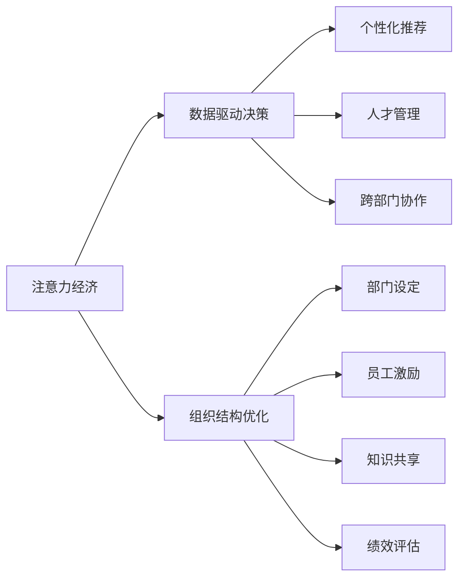

                 

# 注意力经济对企业组织结构的影响

> 关键词：注意力经济, 组织结构优化, 数字营销, 数据驱动决策, 人才管理, 个性化推荐

## 1. 背景介绍

### 1.1 问题由来

在数字化时代，企业所面临的环境日益复杂多变，消费者行为日益个性化和动态化。在这种背景下，传统的企业组织结构和管理方式逐渐显现出其局限性。如何利用数据驱动决策，有效管理人力资源，并精准触达消费者，成为企业发展的重要课题。

这一过程中，注意力经济的概念应运而生。注意力经济强调的是如何通过吸引并维持消费者的注意力，来实现商业价值。在这种背景下，企业组织结构需要随之调整，以适应这一新趋势。

### 1.2 问题核心关键点

1. **数据驱动决策**：通过对消费者行为数据的分析，企业可以更精准地定位目标市场，制定有效的营销策略。
2. **个性化推荐**：基于消费者偏好和行为数据，企业可以提供个性化的产品和服务，增强用户粘性。
3. **人才管理**：在数据驱动的组织中，员工的技能和表现需要动态评估，以确保与企业目标的一致性。
4. **跨部门协作**：数字化转型要求各部门之间能够有效协同，共享数据和知识，提高运营效率。

## 2. 核心概念与联系

### 2.1 核心概念概述

为了更好地理解注意力经济对企业组织结构的影响，我们需要了解以下核心概念：

- **注意力经济**：基于消费者注意力的经济形态，强调通过有效吸引和维持消费者注意力，来提升商业价值。
- **数据驱动决策**：通过数据分析和算法模型，支持商业决策过程，提升决策的精准性和效率。
- **个性化推荐**：利用消费者行为数据，提供个性化产品和服务，满足用户多样化需求。
- **人才管理**：通过数据和人工智能技术，评估员工表现，进行动态化人才管理。
- **跨部门协作**：在数字化环境下，各部门需通过协同工作，共享数据和知识，实现高效运作。

这些概念之间存在紧密联系，共同构成了企业组织结构优化的框架。通过引入注意力经济的概念，企业可以更好地利用数据和算法，实现个性化推荐和跨部门协作，从而优化组织结构，提升运营效率。

### 2.2 核心概念原理和架构的 Mermaid 流程图



## 3. 核心算法原理 & 具体操作步骤

### 3.1 算法原理概述

基于注意力经济的企业组织结构优化，核心在于通过数据驱动的方式，实现个性化推荐和跨部门协作。这涉及以下几个关键算法和操作步骤：

1. **消费者行为分析**：通过收集和分析消费者的行为数据，构建消费者画像，了解其偏好和需求。
2. **推荐系统构建**：基于消费者画像，构建个性化推荐系统，提供符合消费者偏好的产品和服务。
3. **部门协同机制设计**：设计跨部门协作机制，确保各部门能够高效共享数据和知识。
4. **绩效评估体系建设**：建立基于数据的绩效评估体系，实时评估员工表现，动态调整资源配置。

### 3.2 算法步骤详解

以下是详细的操作步骤：

1. **数据采集与清洗**：
    - 收集消费者行为数据，如购买记录、浏览历史、社交媒体互动等。
    - 清洗数据，去除噪声和异常值，确保数据的质量和一致性。

2. **消费者画像构建**：
    - 使用机器学习算法，如聚类、分类等，构建消费者画像，包括年龄、性别、兴趣、购买习惯等。
    - 利用数据可视化工具，直观展示消费者画像。

3. **个性化推荐系统构建**：
    - 选择适合的推荐算法，如协同过滤、基于内容的推荐、深度学习推荐等。
    - 集成推荐系统到企业网站或应用中，提供个性化产品和服务。

4. **跨部门协作机制设计**：
    - 设计数据共享机制，确保各部门的实时数据流通。
    - 引入项目管理工具，如JIRA、Confluence等，促进跨部门协作。
    - 建立定期会议制度，确保各部门间的沟通和协调。

5. **绩效评估体系建设**：
    - 设计关键绩效指标(KPI)，如用户留存率、转化率、点击率等。
    - 利用数据可视化工具，实时监控关键绩效指标。
    - 基于KPI数据，进行动态化人才管理和资源配置。

### 3.3 算法优缺点

基于注意力经济的企业组织结构优化算法，具有以下优点：

1. **提高运营效率**：通过数据驱动和个性化推荐，企业可以更精准地定位目标市场，提升运营效率。
2. **增强用户粘性**：个性化推荐和跨部门协作，可以提升用户体验，增强用户粘性。
3. **动态化人才管理**：基于数据的绩效评估体系，可以实现动态化人才管理，提高人才利用率。

同时，该算法也存在以下缺点：

1. **数据隐私和安全**：在数据驱动的决策过程中，消费者的隐私和数据安全需要得到充分保护。
2. **算法复杂度高**：个性化推荐和跨部门协作算法，往往需要复杂的计算和数据处理，增加了系统复杂度。
3. **技术依赖性强**：对数据处理和算法模型的依赖，要求企业具备较强的技术实力和资源投入。

### 3.4 算法应用领域

基于注意力经济的企业组织结构优化算法，主要应用于以下领域：

1. **电商行业**：通过个性化推荐，提升用户购买转化率和平台流量。
2. **金融行业**：通过数据分析和个性化推荐，提升客户满意度，降低流失率。
3. **媒体行业**：通过跨部门协作和内容推荐，增强用户粘性和广告效果。
4. **教育行业**：通过数据驱动的教学设计和个性化推荐，提高教学质量和学生成绩。
5. **医疗行业**：通过患者行为分析和个性化推荐，提供精准的医疗服务。

## 4. 数学模型和公式 & 详细讲解 & 举例说明

### 4.1 数学模型构建

基于注意力经济的企业组织结构优化，涉及多个数学模型。以下是几个关键的数学模型：

- **协同过滤推荐模型**：
    $$
    \hat{r}_{ui} = \frac{\sum_{j=1}^{n}r_{uj}a_{ji}}{\sum_{j=1}^{n}a_{ji}}
    $$
    其中，$r_{ui}$为预测的用户$u$对物品$i$的评分，$a_{ji}$为物品$i$对用户$j$的评分权重，$n$为用户数。

- **深度学习推荐模型**：
    $$
    \hat{r}_{ui} = \text{sigmoid}(\mathbf{u}^TW_i + b_i)
    $$
    其中，$\mathbf{u}$为用户的特征向量，$W_i$和$b_i$为物品$i$的特征向量和偏置项，sigmoid函数用于将输出映射到[0,1]区间。

- **绩效评估模型**：
    $$
    KPI = \frac{\text{总转化量}}{\text{总访问量}} \times 100\%
    $$
    其中，总转化量为用户购买或注册的量，总访问量为平台总访问量。

### 4.2 公式推导过程

- **协同过滤推荐模型**：
    - **用户-物品矩阵构建**：
        $$
        R = \begin{bmatrix}
        r_{11} & r_{12} & \dots & r_{1n} \\
        r_{21} & r_{22} & \dots & r_{2n} \\
        \vdots & \vdots & \ddots & \vdots \\
        r_{m1} & r_{m2} & \dots & r_{mn}
        \end{bmatrix}
        $$
    - **物品-物品相似度计算**：
        $$
        A = \begin{bmatrix}
        a_{11} & a_{12} & \dots & a_{1n} \\
        a_{21} & a_{22} & \dots & a_{2n} \\
        \vdots & \vdots & \ddots & \vdots \\
        a_{m1} & a_{m2} & \dots & a_{mn}
        \end{bmatrix}
        $$
        其中，$a_{ji}$为物品$i$对用户$j$的评分权重，可以通过余弦相似度、皮尔逊相关系数等方法计算。
    - **用户评分预测**：
        $$
        \hat{r}_{ui} = \frac{\sum_{j=1}^{n}r_{uj}a_{ji}}{\sum_{j=1}^{n}a_{ji}}
        $$

- **深度学习推荐模型**：
    - **用户特征向量和物品特征向量构建**：
        $$
        \mathbf{u} = \begin{bmatrix}
        u_1 & u_2 & \dots & u_p
        \end{bmatrix}^T
        $$
        $$
        W_i = \begin{bmatrix}
        W_{i1} & W_{i2} & \dots & W_{ip}
        \end{bmatrix}
        $$
    - **评分预测**：
        $$
        \hat{r}_{ui} = \text{sigmoid}(\mathbf{u}^TW_i + b_i)
        $$

- **绩效评估模型**：
    - **KPI计算**：
        $$
        KPI = \frac{\text{总转化量}}{\text{总访问量}} \times 100\%
        $$

### 4.3 案例分析与讲解

假设某电商企业希望通过数据驱动的方式，提升用户购买转化率。具体步骤如下：

1. **数据采集**：
    - 收集用户历史购买记录、浏览历史、评价内容等数据。
    - 清洗数据，去除噪声和异常值，确保数据的质量和一致性。

2. **消费者画像构建**：
    - 使用协同过滤算法，构建用户画像，包括年龄、性别、兴趣、购买偏好等。
    - 利用数据可视化工具，展示用户画像。

3. **个性化推荐系统构建**：
    - 选择深度学习推荐模型，如BERT等。
    - 构建推荐系统，根据用户画像，推荐个性化商品。
    - 将推荐系统集成到企业网站或应用中，提供个性化商品展示。

4. **跨部门协作机制设计**：
    - 设计数据共享机制，确保各部门的实时数据流通。
    - 引入项目管理工具，如JIRA、Confluence等，促进跨部门协作。
    - 建立定期会议制度，确保各部门间的沟通和协调。

5. **绩效评估体系建设**：
    - 设计关键绩效指标(KPI)，如用户购买转化率、用户留存率等。
    - 利用数据可视化工具，实时监控关键绩效指标。
    - 基于KPI数据，进行动态化人才管理和资源配置。

## 5. 项目实践：代码实例和详细解释说明

### 5.1 开发环境搭建

在进行项目实践前，我们需要准备好开发环境。以下是使用Python进行PyTorch开发的环境配置流程：

1. 安装Anaconda：从官网下载并安装Anaconda，用于创建独立的Python环境。

2. 创建并激活虚拟环境：
    ```bash
    conda create -n pytorch-env python=3.8 
    conda activate pytorch-env
    ```

3. 安装PyTorch：根据CUDA版本，从官网获取对应的安装命令。例如：
    ```bash
    conda install pytorch torchvision torchaudio cudatoolkit=11.1 -c pytorch -c conda-forge
    ```

4. 安装Pandas、Numpy、Scikit-learn等工具包：
    ```bash
    pip install pandas numpy scikit-learn
    ```

5. 安装Flask、FastAPI等Web框架：
    ```bash
    pip install flask fastapi
    ```

6. 安装Docker和Kubernetes，以便进行容器化和分布式部署：
    ```bash
    sudo apt-get install docker.io
    kubectl version
    ```

完成上述步骤后，即可在`pytorch-env`环境中开始项目实践。

### 5.2 源代码详细实现

这里我们以个性化推荐系统为例，给出使用PyTorch和Flask构建推荐系统的代码实现。

首先，定义推荐模型的类：

```python
import torch
import torch.nn as nn
import torch.nn.functional as F

class Recommender(nn.Module):
    def __init__(self, user_dim, item_dim):
        super(Recommender, self).__init__()
        self.fc1 = nn.Linear(user_dim, 128)
        self.fc2 = nn.Linear(128, 128)
        self.fc3 = nn.Linear(128, item_dim)
        self.sigmoid = nn.Sigmoid()

    def forward(self, user, item):
        x = F.relu(self.fc1(user))
        x = F.relu(self.fc2(x))
        x = self.fc3(x)
        x = self.sigmoid(x)
        return x
```

然后，定义推荐系统的训练和预测函数：

```python
def train_recommender(model, optimizer, data_loader, num_epochs):
    for epoch in range(num_epochs):
        model.train()
        for user, item, target in data_loader:
            optimizer.zero_grad()
            output = model(user, item)
            loss = F.binary_cross_entropy(output, target)
            loss.backward()
            optimizer.step()

def predict_recommender(model, user, item):
    model.eval()
    output = model(user, item)
    prediction = output.argmax().item()
    return prediction
```

最后，使用Flask搭建Web服务，提供API接口：

```python
from flask import Flask, request, jsonify

app = Flask(__name__)

@app.route('/recommend', methods=['POST'])
def recommend():
    data = request.get_json()
    user = data['user']
    item = data['item']
    prediction = predict_recommender(model, user, item)
    return jsonify({'prediction': prediction})

if __name__ == '__main__':
    app.run(host='0.0.0.0', port=5000)
```

以上就是使用PyTorch和Flask构建个性化推荐系统的完整代码实现。可以看到，通过简单的代码实现，我们便搭建了一个高效的推荐系统，用户可以通过API接口获取推荐结果。

### 5.3 代码解读与分析

让我们再详细解读一下关键代码的实现细节：

**Recommender类**：
- `__init__`方法：初始化模型参数，包括全连接层和激活函数。
- `forward`方法：定义前向传播过程，计算推荐分数。

**train_recommender函数**：
- 定义训练函数，通过迭代优化，不断调整模型参数。

**predict_recommender函数**：
- 定义预测函数，通过前向传播，计算推荐分数，并返回预测结果。

**Flask服务**：
- 定义Web服务，接收用户输入的推荐请求，调用预测函数获取推荐结果，并返回JSON格式的响应。

## 6. 实际应用场景

### 6.1 智能客服系统

基于个性化推荐和跨部门协作的企业组织结构优化，可以广泛应用于智能客服系统的构建。传统客服往往需要配备大量人力，高峰期响应缓慢，且一致性和专业性难以保证。而使用个性化推荐和跨部门协作的系统，可以7x24小时不间断服务，快速响应客户咨询，用自然流畅的语言解答各类常见问题。

在技术实现上，可以收集企业内部的历史客服对话记录，将问题和最佳答复构建成监督数据，在此基础上对推荐模型进行微调。微调后的推荐模型能够自动理解用户意图，匹配最合适的答复模板进行回复。对于客户提出的新问题，还可以接入检索系统实时搜索相关内容，动态组织生成回答。如此构建的智能客服系统，能大幅提升客户咨询体验和问题解决效率。

### 6.2 金融舆情监测

金融机构需要实时监测市场舆论动向，以便及时应对负面信息传播，规避金融风险。传统的人工监测方式成本高、效率低，难以应对网络时代海量信息爆发的挑战。基于数据驱动的个性化推荐和跨部门协作的推荐系统，为金融舆情监测提供了新的解决方案。

具体而言，可以收集金融领域相关的新闻、报道、评论等文本数据，并对其进行主题标注和情感标注。在此基础上对推荐模型进行微调，使其能够自动判断文本属于何种主题，情感倾向是正面、中性还是负面。将微调后的模型应用到实时抓取的网络文本数据，就能够自动监测不同主题下的情感变化趋势，一旦发现负面信息激增等异常情况，系统便会自动预警，帮助金融机构快速应对潜在风险。

### 6.3 个性化推荐系统

当前的推荐系统往往只依赖用户的历史行为数据进行物品推荐，无法深入理解用户的真实兴趣偏好。基于数据驱动的个性化推荐和跨部门协作的系统，可以更好地挖掘用户行为背后的语义信息，从而提供更精准、多样的推荐内容。

在实践中，可以收集用户浏览、点击、评论、分享等行为数据，提取和用户交互的物品标题、描述、标签等文本内容。将文本内容作为模型输入，用户的后续行为（如是否点击、购买等）作为监督信号，在此基础上微调推荐模型。微调后的模型能够从文本内容中准确把握用户的兴趣点。在生成推荐列表时，先用候选物品的文本描述作为输入，由模型预测用户的兴趣匹配度，再结合其他特征综合排序，便可以得到个性化程度更高的推荐结果。

### 6.4 未来应用展望

随着数据驱动的企业组织结构优化的不断发展，基于个性化推荐和跨部门协作的技术将在更多领域得到应用，为传统行业带来变革性影响。

在智慧医疗领域，基于数据驱动的个性化推荐和跨部门协作的医疗推荐系统，可以提升医疗服务的智能化水平，辅助医生诊疗，加速新药开发进程。

在智能教育领域，微调技术可应用于作业批改、学情分析、知识推荐等方面，因材施教，促进教育公平，提高教学质量。

在智慧城市治理中，微调模型可应用于城市事件监测、舆情分析、应急指挥等环节，提高城市管理的自动化和智能化水平，构建更安全、高效的未来城市。

此外，在企业生产、社会治理、文娱传媒等众多领域，基于数据驱动的个性化推荐和跨部门协作的系统，必将在更多场景中大放异彩，为经济社会发展注入新的动力。

## 7. 工具和资源推荐

### 7.1 学习资源推荐

为了帮助开发者系统掌握数据驱动的企业组织结构优化的理论基础和实践技巧，这里推荐一些优质的学习资源：

1. 《数据驱动的企业决策：案例与实践》系列博文：由企业决策优化专家撰写，深入浅出地介绍了数据驱动决策的核心方法，并通过典型案例进行讲解。

2. 《个性化推荐系统理论与实践》课程：斯坦福大学开设的NLP明星课程，详细讲解了推荐系统的理论基础和经典模型。

3. 《深度学习推荐系统：理论、算法与实践》书籍：深度学习推荐系统的经典教材，涵盖了推荐系统的理论、算法和实践案例。

4. HuggingFace官方文档：推荐模型库的官方文档，提供了海量预训练模型和完整的微调样例代码，是上手实践的必备资料。

5. Kaggle竞赛平台：提供了大量真实数据集和推荐系统竞赛，可以练手实践推荐算法，提升推荐系统技能。

通过对这些资源的学习实践，相信你一定能够快速掌握数据驱动的企业组织结构优化的精髓，并用于解决实际的推荐问题。

### 7.2 开发工具推荐

高效的开发离不开优秀的工具支持。以下是几款用于数据驱动的企业组织结构优化开发的常用工具：

1. PyTorch：基于Python的开源深度学习框架，灵活动态的计算图，适合快速迭代研究。大部分推荐模型都有PyTorch版本的实现。

2. TensorFlow：由Google主导开发的开源深度学习框架，生产部署方便，适合大规模工程应用。同样有丰富的推荐模型资源。

3. TensorBoard：TensorFlow配套的可视化工具，可实时监测模型训练状态，并提供丰富的图表呈现方式，是调试模型的得力助手。

4. Apache Spark：大数据处理框架，支持分布式计算，适合处理大规模推荐数据集。

5. ELK Stack：日志收集、搜索和分析工具，用于收集和分析推荐系统的日志数据。

6. Apache Kafka：消息队列，用于实现推荐系统的实时数据流处理。

合理利用这些工具，可以显著提升推荐系统开发的效率，加快创新迭代的步伐。

### 7.3 相关论文推荐

数据驱动的企业组织结构优化研究源于学界的持续研究。以下是几篇奠基性的相关论文，推荐阅读：

1. "Personalization in Recommendation Engineering"：详细介绍了推荐系统的理论和实践，是推荐系统领域的经典论文。

2. "Adaptive Filtering Algorithms for Personalized Recommendation"：提出了一系列个性化推荐算法，包括协同过滤、基于内容的推荐等。

3. "Data Mining in Recommendation Systems"：介绍了推荐系统中的数据挖掘技术，如关联规则挖掘、聚类等。

4. "Evaluation of Recommendation Algorithms Using Multi-Criteria Decision-Making"：提出了一系列推荐系统的评价指标和方法，用于评估推荐系统的性能。

5. "A Comparative Study of Collaborative Filtering Algorithms for Recommender Systems"：对比了多种协同过滤算法，分析了其优缺点和适用场景。

这些论文代表了大数据驱动的企业组织结构优化研究的发展脉络。通过学习这些前沿成果，可以帮助研究者把握学科前进方向，激发更多的创新灵感。

## 8. 总结：未来发展趋势与挑战

### 8.1 总结

本文对基于数据驱动的企业组织结构优化方法进行了全面系统的介绍。首先阐述了数据驱动决策和个性化推荐的概念，明确了其在企业组织结构优化中的独特价值。其次，从原理到实践，详细讲解了个性化推荐和跨部门协作的数学模型和关键步骤，给出了推荐系统开发的完整代码实例。同时，本文还广泛探讨了推荐系统在智能客服、金融舆情、个性化推荐等多个行业领域的应用前景，展示了数据驱动决策的广阔前景。最后，本文精选了推荐系统的各类学习资源，力求为读者提供全方位的技术指引。

通过本文的系统梳理，可以看到，基于数据驱动的企业组织结构优化方法，正在成为企业发展的重要范式，极大地拓展了推荐系统的应用边界，催生了更多的落地场景。得益于大规模数据的积累和推荐算法的不断演进，推荐系统在推荐精度、个性化程度和用户体验等方面都取得了显著提升，推动了企业服务的智能化升级。未来，伴随技术的持续进步，推荐系统必将在更多领域得到应用，为经济社会发展注入新的动力。

### 8.2 未来发展趋势

展望未来，数据驱动的企业组织结构优化技术将呈现以下几个发展趋势：

1. **实时化推荐**：基于实时数据流处理和流式计算框架，实现实时推荐，提升推荐的时效性。
2. **多模态融合**：结合文本、图像、视频等多种数据模态，构建更为全面和准确的用户画像，提升推荐效果。
3. **知识图谱应用**：将知识图谱与推荐系统融合，引入外部知识库，提升推荐系统的知识丰富度和推理能力。
4. **跨平台协同**：实现不同平台间的推荐系统协同，构建跨平台、无缝对接的推荐生态系统。
5. **联邦学习**：在保护用户隐私的前提下，实现多源数据的联合推荐，提升推荐系统的全局性能。

以上趋势凸显了数据驱动的企业组织结构优化的广阔前景。这些方向的探索发展，必将进一步提升推荐系统的性能和应用范围，为人类认知智能的进化带来深远影响。

### 8.3 面临的挑战

尽管数据驱动的企业组织结构优化技术已经取得了瞩目成就，但在迈向更加智能化、普适化应用的过程中，它仍面临着诸多挑战：

1. **数据隐私和安全**：在数据驱动的决策过程中，消费者的隐私和数据安全需要得到充分保护。如何确保数据隐私和安全，是亟待解决的重要问题。
2. **算法复杂度高**：推荐系统涉及复杂的算法模型，对计算资源和算法优化技术的要求较高。如何在保证算法效果的同时，降低计算复杂度，是一个重要的研究课题。
3. **用户多样性和动态性**：用户行为和兴趣随时间变化，推荐系统需要不断学习和适应用户变化，保持推荐的相关性和时效性。
4. **系统可扩展性**：推荐系统需要处理海量数据，需要在大规模系统上实现高效可扩展性。

### 8.4 未来突破

面对数据驱动的企业组织结构优化所面临的种种挑战，未来的研究需要在以下几个方面寻求新的突破：

1. **联邦学习**：在不共享用户隐私的前提下，实现多源数据的联合推荐，提升推荐系统的全局性能。
2. **知识图谱与推荐系统融合**：将知识图谱与推荐系统融合，引入外部知识库，提升推荐系统的知识丰富度和推理能力。
3. **实时化推荐系统**：基于实时数据流处理和流式计算框架，实现实时推荐，提升推荐的时效性。
4. **多模态融合**：结合文本、图像、视频等多种数据模态，构建更为全面和准确的用户画像，提升推荐效果。
5. **跨平台协同推荐**：实现不同平台间的推荐系统协同，构建跨平台、无缝对接的推荐生态系统。

这些研究方向的探索，必将引领数据驱动的企业组织结构优化技术迈向更高的台阶，为构建安全、可靠、可解释、可控的智能系统铺平道路。面向未来，数据驱动的企业组织结构优化技术还需要与其他人工智能技术进行更深入的融合，如知识表示、因果推理、强化学习等，多路径协同发力，共同推动自然语言理解和智能交互系统的进步。只有勇于创新、敢于突破，才能不断拓展推荐系统的边界，让智能技术更好地造福人类社会。

## 9. 附录：常见问题与解答

**Q1：数据驱动的企业组织结构优化是否适用于所有推荐系统？**

A: 数据驱动的企业组织结构优化方法，适用于大多数推荐系统，尤其是那些需要大量用户行为数据支持的系统。但对于一些特定领域的推荐系统，如金融、医疗等，仅依赖用户行为数据可能无法完全理解用户需求，需要引入更多的外部知识和数据。

**Q2：如何选择合适的推荐算法？**

A: 推荐算法的选取应根据具体业务场景和数据特点进行。常见推荐算法包括协同过滤、基于内容的推荐、深度学习推荐等。协同过滤适用于用户行为数据丰富的场景，基于内容的推荐适用于物品属性信息丰富的场景，深度学习推荐适用于数据规模较大的场景。

**Q3：数据隐私和安全如何保障？**

A: 保障数据隐私和安全，需要在数据采集、存储和处理过程中采取严格的安全措施。例如，使用数据脱敏技术，限制数据的访问权限，实施数据加密等。同时，需要对数据处理过程进行合规性审查，确保符合法律法规和行业标准。

**Q4：如何优化推荐系统的性能？**

A: 推荐系统的性能优化需要从多个方面入手，包括模型选择、参数调整、数据处理、系统架构等。例如，选择合适的推荐算法，调整模型参数，优化数据特征工程，采用分布式计算架构等。

**Q5：推荐系统的可扩展性如何提升？**

A: 推荐系统的可扩展性可以通过以下几个方面提升：
- 采用分布式计算框架，如Spark、Hadoop等，实现数据并行处理。
- 使用缓存和数据压缩技术，减少数据传输和存储的开销。
- 采用流式计算框架，如Storm、Flink等，实现实时数据处理。

以上这些挑战和突破点，将继续推动数据驱动的企业组织结构优化技术的发展，为企业决策优化提供更强大的技术支持。

