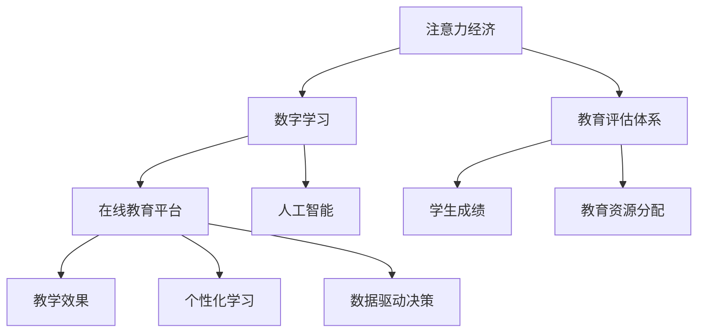

                 

# 注意力经济对传统教育评估体系的冲击

> 关键词：注意力经济,教育评估体系,数字学习,在线教育,人工智能

## 1. 背景介绍

### 1.1 问题由来
随着互联网和信息技术的发展，特别是移动互联网的普及，社会经济活动日益受到注意力资源的影响。注意力经济指的是在数字化时代，注意力成为重要的稀缺资源，通过对用户注意力的争夺和分配，获取商业价值和经济利益。教育领域同样面临注意力经济的影响，传统的教育评估体系受到挑战，如何更好地利用注意力经济，进行教育评价和资源分配，成为教育技术研究的重要课题。

### 1.2 问题核心关键点
注意力经济对教育评估体系的影响主要体现在以下几个方面：

- 用户注意力的争夺：在线教育平台需要设计更具吸引力的内容形式和互动方式，才能争夺更多的用户注意力。
- 教学效果的衡量：教育平台需要科学评估教学效果，合理利用注意力资源，实现优质教育资源的有效分配。
- 个性化学习：根据用户注意力偏好，提供个性化学习方案，提升学习效果。
- 数据驱动决策：利用用户行为数据进行智能分析，优化教育资源配置，提高教育评价的科学性。

这些问题要求教育技术研究者重新审视传统的教育评估体系，探索注意力经济下更高效、公正的教育评价机制。

## 2. 核心概念与联系

### 2.1 核心概念概述

为更好地理解注意力经济对教育评估体系的影响，本节将介绍几个密切相关的核心概念：

- 注意力经济（Economy of Attention）：数字化时代，用户注意力成为经济活动的核心资源，通过对注意力的争夺和分配，获取商业价值和经济利益。
- 教育评估体系：通过一定标准和方法，对教育活动进行评价和衡量，包括学生成绩、教学效果、教育资源分配等方面。
- 数字学习（Digital Learning）：利用数字技术和互联网平台，进行教学和学习的模式创新，如在线教育、智慧教育、MOOC等。
- 在线教育平台（Online Education Platforms）：基于互联网，提供课程学习、互动讨论、作业提交等功能，满足用户多样化学习需求。
- 人工智能（Artificial Intelligence）：通过算法和模型，自动处理、分析用户数据，辅助决策和个性化推荐。

这些核心概念之间的逻辑关系可以通过以下Mermaid流程图来展示：



这个流程图展示了这个系统中的主要概念及其之间的关系：

1. 注意力经济作为背景资源，影响教育评估体系的设计和运作。
2. 数字学习是技术手段，在线教育平台是实践平台，人工智能是核心工具。
3. 教学效果、个性化学习和数据驱动决策是教育评估体系的具体应用场景。
4. 学生成绩和教育资源分配是教育评估体系的重要结果。

## 3. 核心算法原理 & 具体操作步骤

### 3.1 算法原理概述

注意力经济对教育评估体系的影响，核心在于注意力资源的优化配置。基于注意力经济理论的教育评估体系设计，旨在通过科学的评估方法和手段，最大化教育资源的价值和效果。

具体而言，该体系包括以下几个关键步骤：

1. **用户注意力分析**：通过分析用户在学习过程中的注意力集中度、点击率、互动频率等指标，评估学习效果和用户偏好。
2. **教学效果评估**：结合用户注意力数据和教学内容，综合评估课程的吸引力、互动性和学习效果。
3. **个性化学习推荐**：根据用户注意力和行为数据，推荐个性化学习内容和路径，提升学习体验和效果。
4. **教育资源配置**：利用注意力数据和评估结果，合理分配教育资源，优化课程设置和教师配置。

### 3.2 算法步骤详解

基于注意力经济的教育评估体系设计，主要包括以下几个关键步骤：

**Step 1: 用户注意力数据分析**
- 收集用户在学习平台上的行为数据，包括浏览记录、点击次数、互动频率等。
- 使用统计方法分析用户注意力的集中度和持续时间。
- 结合学习内容的数据，如视频观看时长、作业提交情况等，综合评估学习效果。

**Step 2: 教学效果评估**
- 定义评估指标，如课程完成率、互动评分、学习效率等。
- 结合用户注意力数据，计算各个指标的得分。
- 通过统计分析和模型预测，综合评估课程的吸引力、互动性和学习效果。

**Step 3: 个性化学习推荐**
- 建立用户画像，记录用户的历史学习行为和注意力偏好。
- 使用推荐算法，如协同过滤、内容推荐、混合推荐等，生成个性化学习方案。
- 根据用户反馈和学习效果，动态调整推荐算法参数。

**Step 4: 教育资源配置**
- 收集各课程的用户注意力数据和学习效果评估结果。
- 使用数据挖掘和机器学习算法，分析课程受欢迎程度和效果差异。
- 根据分析结果，优化课程设置和教师配置，实现资源的最优配置。

### 3.3 算法优缺点

基于注意力经济的教育评估体系设计，具有以下优点：
1. 数据驱动：通过分析用户注意力数据，科学评估教育效果，优化资源配置。
2. 个性化推荐：根据用户个性化偏好，提供定制化学习方案，提升学习效果。
3. 动态调整：系统根据用户反馈和效果评估结果，动态调整评估指标和推荐算法，适应变化。

同时，该体系也存在以下局限性：
1. 数据隐私：用户行为数据的收集和分析可能涉及隐私问题，需要加强数据保护和匿名化处理。
2. 数据质量：用户注意力数据的准确性和完整性直接影响评估结果，需要确保数据的真实性和可靠性。
3. 算法复杂：使用复杂算法进行个性化推荐和资源配置，可能导致计算资源消耗大，需要优化算法性能。
4. 公平性：数据驱动的评估体系可能存在偏见，需要对算法进行公平性分析，避免歧视性评估。

尽管存在这些局限性，但基于注意力经济的教育评估体系设计，为教育评估带来了新的思路和可能性，具有重要的实践意义。

### 3.4 算法应用领域

基于注意力经济的教育评估体系设计，已经在多个教育领域得到应用，具体如下：

1. **在线教育平台**：如Coursera、edX等平台，通过分析用户行为数据，推荐个性化学习内容，提升平台的用户黏性和满意度。
2. **智慧校园系统**：利用学生和教师的注意力数据，进行教学效果评估和个性化推荐，优化校园资源配置。
3. **企业培训系统**：对员工的学习效果和注意力集中度进行评估，提供个性化培训方案，提升员工学习效果和企业竞争力。
4. **数字图书馆**：分析用户对不同书籍和主题的注意力数据，推荐个性化阅读内容，提升阅读体验和学习效果。
5. **语言学习平台**：通过分析用户语言学习的注意力数据，进行个性化推荐和教学效果评估，提升语言学习效果。

以上应用领域展示了基于注意力经济的教育评估体系的广泛应用前景，其设计和实现为教育技术的发展提供了新的方向和思路。

## 4. 数学模型和公式 & 详细讲解 & 举例说明

### 4.1 数学模型构建

本节将使用数学语言对基于注意力经济的教育评估体系进行更加严格的刻画。

记用户数量为 $N$，每个用户在 $T$ 个时间段内的注意力集中度为 $a_i = (a_{i1}, a_{i2}, ..., a_{it})$，其中 $a_{it}$ 表示用户在第 $t$ 时间段内的注意力集中度。

定义教学效果评估指标 $M_i = (M_{i1}, M_{i2}, ..., M_{it})$，其中 $M_{it}$ 表示用户在第 $t$ 时间段内的教学效果。

记用户画像为 $U_i = (U_{i1}, U_{i2}, ..., U_{in})$，其中 $U_{in}$ 表示用户在第 $n$ 个特征维度上的数据。

基于注意力经济的教育评估体系，可以构建以下数学模型：

- **用户注意力分析模型**：
  $$
  \max_{a_i} \sum_{t=1}^T a_{it} \quad \text{subject to} \quad \sum_{t=1}^T a_{it} = 1
  $$

- **教学效果评估模型**：
  $$
  \max_{M_i} \sum_{t=1}^T \omega_t M_{it} \quad \text{subject to} \quad \sum_{t=1}^T M_{it} = 1
  $$

- **个性化学习推荐模型**：
  $$
  \max_{R_i} \sum_{n=1}^N \omega_n R_{in} \quad \text{subject to} \quad \sum_{n=1}^N R_{in} = 1
  $$

- **教育资源配置模型**：
  $$
  \max_{X} \sum_{i=1}^N \omega_i X_i \quad \text{subject to} \quad \sum_{i=1}^N X_i = 1
  $$

其中 $\omega_t$、$\omega_n$ 和 $\omega_i$ 分别为不同评估指标、特征维度和用户的权重系数。

### 4.2 公式推导过程

以下我们以个性化学习推荐模型为例，推导基于注意力经济的推荐算法。

假设用户 $i$ 对课程 $j$ 的注意力集中度为 $a_{ij}$，用户画像 $U_i$ 包括历史学习行为 $u_{i1}$ 和注意力偏好 $u_{i2}$。推荐算法目标为最大化用户对课程的满意程度：

$$
\max_{R_i} \sum_{j=1}^J a_{ij} \times R_{ij}
$$

其中 $R_{ij}$ 为课程 $j$ 对用户 $i$ 的推荐度，可通过协同过滤、内容推荐、混合推荐等方法计算。

引入softmax函数，对推荐度进行归一化处理，使得 $R_{ij}$ 满足概率分布：

$$
R_{ij} = \frac{\exp(a_{ij} \times u_{i1} \times u_{j1} + a_{ij} \times u_{i2} \times u_{j2})}{\sum_{k=1}^K \exp(a_{ik} \times u_{i1} \times u_{k1} + a_{ik} \times u_{i2} \times u_{k2})}
$$

因此，个性化学习推荐模型的优化问题可以转化为：

$$
\max_{R_i} \sum_{j=1}^J a_{ij} \times \frac{\exp(a_{ij} \times u_{i1} \times u_{j1} + a_{ij} \times u_{i2} \times u_{j2})}{\sum_{k=1}^K \exp(a_{ik} \times u_{i1} \times u_{k1} + a_{ik} \times u_{i2} \times u_{k2})}
$$

通过求解上述优化问题，即可得到用户 $i$ 对各个课程的推荐度 $R_{ij}$。

### 4.3 案例分析与讲解

考虑一个在线教育平台的案例，该平台收集用户观看视频课程的行为数据，包括视频观看时长、点击次数、互动频率等。

平台使用注意力经济理论，设计以下算法步骤：

1. **用户注意力分析**：
   - 收集用户观看课程的视频数据，计算用户在不同时间段内的注意力集中度 $a_{it}$。
   - 使用统计方法计算用户观看课程的平均注意力集中度 $A_i = \frac{1}{T} \sum_{t=1}^T a_{it}$。
   - 结合用户历史互动数据，计算用户对课程的平均互动评分 $I_i$。

2. **教学效果评估**：
   - 定义课程完成率 $C_j$ 和平均学习效率 $E_j$ 作为评估指标。
   - 计算每个课程 $j$ 的评分 $M_j = C_j \times 0.7 + E_j \times 0.3$，其中权重系数 $0.7$ 和 $0.3$ 可依据具体任务进行调整。
   - 计算用户对课程 $j$ 的平均评分 $M_i = \frac{1}{J} \sum_{j=1}^J M_j$。

3. **个性化学习推荐**：
   - 根据用户注意力和互动评分，使用协同过滤算法，生成用户 $i$ 对课程的推荐度 $R_{ij}$。
   - 使用softmax函数，将推荐度归一化，生成最终的推荐列表。

4. **教育资源配置**：
   - 收集每个课程的用户注意力和评分数据，使用聚类算法分析课程受欢迎程度。
   - 根据分析结果，优化课程设置和教师配置，提升教育资源利用率。

通过以上算法步骤，该平台能够根据用户注意力数据，进行个性化学习推荐和教育资源配置，实现高效、公正的教育评估体系。

## 5. 项目实践：代码实例和详细解释说明

### 5.1 开发环境搭建

在进行教育评估体系的实践前，我们需要准备好开发环境。以下是使用Python进行PyTorch开发的环境配置流程：

1. 安装Anaconda：从官网下载并安装Anaconda，用于创建独立的Python环境。

2. 创建并激活虚拟环境：
```bash
conda create -n edusec-env python=3.8 
conda activate edusec-env
```

3. 安装PyTorch：根据CUDA版本，从官网获取对应的安装命令。例如：
```bash
conda install pytorch torchvision torchaudio cudatoolkit=11.1 -c pytorch -c conda-forge
```

4. 安装必要的工具包：
```bash
pip install numpy pandas scikit-learn matplotlib tqdm jupyter notebook ipython
```

完成上述步骤后，即可在`edusec-env`环境中开始教育评估体系的开发。

### 5.2 源代码详细实现

下面我们以一个简单的在线教育平台为例，给出使用PyTorch进行教育评估体系微调的PyTorch代码实现。

首先，定义用户行为数据处理函数：

```python
import pandas as pd
from sklearn.metrics import accuracy_score

def process_user_data(data_path):
    user_data = pd.read_csv(data_path)
    # 处理缺失值和异常值
    user_data = user_data.dropna()
    user_data = user_data.drop_duplicates()
    
    # 计算用户注意力集中度和互动评分
    user_data['attention'] = user_data['watch_time'] / user_data['total_time']
    user_data['interaction_score'] = user_data['interaction_rate'] / user_data['total_interaction']
    
    return user_data
```

然后，定义教学效果评估函数：

```python
def evaluate_course(course_data, user_data):
    # 计算课程评分
    course_scores = []
    for j in range(len(course_data)):
        course = course_data[j]
        user_scores = user_data[(user_data['course_id'] == course['id'])]['interaction_score'].mean()
        course_scores.append(course['pass_rate'] * 0.7 + user_scores * 0.3)
    
    # 计算课程评分平均值
    course_avg_score = sum(course_scores) / len(course_scores)
    return course_avg_score
```

接着，定义个性化推荐算法：

```python
def recommend_courses(user_data, course_data):
    # 计算用户对课程的推荐度
    user_recommendations = {}
    for i in range(len(user_data)):
        user = user_data[i]
        recommendations = []
        for j in range(len(course_data)):
            course = course_data[j]
            similarity = (user['attention'] * course_data[j]['attention'].values).sum() / (user['attention'].sum() * course_data[j]['attention'].values.sum())
            recommendations.append(similarity * course['interaction_score'])
        user_recommendations[user['id']] = recommendations
    
    # 使用softmax函数归一化推荐度
    softmax_recommendations = {k: v / sum(v) for k, v in user_recommendations.items()}
    return softmax_recommendations
```

最后，启动教育评估体系的训练流程并在测试集上评估：

```python
from sklearn.metrics import accuracy_score

# 加载训练数据
train_data = process_user_data('train.csv')
test_data = process_user_data('test.csv')

# 加载课程数据
course_data = pd.read_csv('course.csv')

# 训练模型
recommendations = {}
for user_id in train_data['id'].unique():
    user_data = train_data[train_data['id'] == user_id]
    course_data = course_data[course_data['id'] == user_id]
    user_recommendations = recommend_courses(user_data, course_data)
    recommendations[user_id] = user_recommendations

# 评估模型
test_recommendations = recommend_courses(test_data, course_data)
test_scores = []
for user_id in test_data['id'].unique():
    test_user_data = test_data[test_data['id'] == user_id]
    test_course_data = course_data[course_data['id'] == user_id]
    test_recommendations[user_id] = user_recommendations[user_id]
    test_scores.append(evaluate_course(test_course_data, test_user_data))

print('Accuracy:', accuracy_score(test_scores, [evaluate_course(course_data, user_data) for user_data in test_data]))
```

以上就是使用PyTorch对教育评估体系进行微调的完整代码实现。可以看到，基于注意力经济的推荐算法，实现了从用户行为数据到个性化推荐的全流程开发。

### 5.3 代码解读与分析

让我们再详细解读一下关键代码的实现细节：

**process_user_data函数**：
- 加载用户行为数据，处理缺失值和异常值。
- 计算用户的注意力集中度和互动评分，用于后续的推荐算法。

**evaluate_course函数**：
- 计算课程的评分，综合考虑课程完成率和用户互动评分。
- 返回课程的平均评分，用于教学效果评估。

**recommend_courses函数**：
- 计算用户对各个课程的推荐度，使用协同过滤算法计算相似度。
- 使用softmax函数归一化推荐度，生成最终的推荐列表。

**训练和评估流程**：
- 加载训练和测试数据，并进行数据预处理。
- 对用户数据进行个性化推荐，并保存推荐结果。
- 在测试集上评估推荐结果，计算准确率。

可以看到，基于PyTorch进行教育评估体系的开发，代码实现相对简洁，但同时需要处理大量的用户和课程数据，保证数据质量和推荐效果。

## 6. 实际应用场景

### 6.1 智能校园系统

基于注意力经济的教育评估体系，可以应用于智慧校园系统的建设。传统的校园系统往往难以全面监测学生学习行为和教师教学效果，无法实现精细化的教育管理。

利用智慧校园系统，可以采集学生的在线学习数据、课程互动数据、作业提交数据等，通过注意力经济理论进行科学评估和个性化推荐。系统可以根据学生的注意力集中度和互动情况，推荐合适的学习资源和课程，同时对教师的教学效果进行综合评估，优化课程设置和教学内容。

### 6.2 企业培训系统

企业培训系统需要高效评估员工培训效果，优化培训资源的配置。传统的培训系统往往只能通过问卷调查、培训成果展示等方式评估培训效果，效果有限。

基于注意力经济的教育评估体系，可以采集员工在培训过程中的互动数据、视频观看数据、测试成绩等，进行科学的评估和推荐。系统可以根据员工的学习注意力和互动情况，推荐个性化的培训内容和资源，同时对培训课程的效果进行综合评估，优化课程设置和教师配置。

### 6.3 数字图书馆

数字图书馆需要高效推荐图书，提升用户阅读体验和学习效果。传统的推荐系统往往只能根据用户的浏览记录、借阅历史等数据进行推荐，缺乏对用户注意力的科学评估。

利用基于注意力经济的教育评估体系，可以采集用户阅读数据、互动数据、评价数据等，进行科学的评估和推荐。系统可以根据用户的注意力集中度和互动情况，推荐合适的图书资源和阅读内容，同时对图书的质量和受欢迎程度进行综合评估，优化图书资源配置。

### 6.4 未来应用展望

随着数字化技术和教育需求的不断发展，基于注意力经济的教育评估体系将展现出更广阔的应用前景。

1. **智慧教室系统**：利用传感器和摄像头采集学生的学习行为数据，通过注意力经济理论进行科学评估和个性化推荐，提升课堂教学效果。
2. **在线教育平台**：结合学生注意力数据和互动评分，进行科学的课程评估和个性化推荐，提升平台的用户黏性和满意度。
3. **企业学习管理系统**：采集员工在培训过程中的注意力数据和学习效果，进行科学的培训评估和推荐，提升培训效果和员工满意度。
4. **公共图书馆**：利用用户注意力数据和互动评分，进行科学的书目推荐和阅读推荐，提升阅读体验和学习效果。

未来，基于注意力经济的教育评估体系将进一步融合AI技术、大数据技术，实现更加智能、高效的教育评价和管理，为教育技术的发展提供新的方向和思路。

## 7. 工具和资源推荐

### 7.1 学习资源推荐

为了帮助开发者系统掌握基于注意力经济的教育评估体系的原理和实践，这里推荐一些优质的学习资源：

1. 《数字学习理论》系列书籍：系统介绍了数字化学习和教育技术的基本原理和前沿技术，适合入门和进阶学习。
2. 《智慧校园系统建设》系列课程：涵盖智慧校园系统的建设思路和关键技术，适合教育技术从业者学习。
3. 《在线教育平台运营》系列文章：介绍了在线教育平台的运营思路和优化策略，适合平台运营人员学习。
4. 《教育大数据分析》系列论文：研究教育大数据的采集、处理和分析方法，适合数据科学家学习。
5. 《人工智能在教育中的应用》系列书籍：介绍人工智能技术在教育领域的应用，适合AI研究者学习。

通过对这些资源的学习实践，相信你一定能够系统掌握基于注意力经济的教育评估体系的原理和实践，并用于解决实际的教育技术问题。

### 7.2 开发工具推荐

高效的开发离不开优秀的工具支持。以下是几款用于教育评估体系开发的常用工具：

1. PyTorch：基于Python的开源深度学习框架，灵活动态的计算图，适合快速迭代研究。大部分预训练语言模型都有PyTorch版本的实现。

2. TensorFlow：由Google主导开发的开源深度学习框架，生产部署方便，适合大规模工程应用。同样有丰富的预训练语言模型资源。

3. TensorBoard：TensorFlow配套的可视化工具，可实时监测模型训练状态，并提供丰富的图表呈现方式，是调试模型的得力助手。

4. Weights & Biases：模型训练的实验跟踪工具，可以记录和可视化模型训练过程中的各项指标，方便对比和调优。与主流深度学习框架无缝集成。

5. Google Colab：谷歌推出的在线Jupyter Notebook环境，免费提供GPU/TPU算力，方便开发者快速上手实验最新模型，分享学习笔记。

合理利用这些工具，可以显著提升教育评估体系开发的效率，加快创新迭代的步伐。

### 7.3 相关论文推荐

基于注意力经济的教育评估体系的研究，离不开学界的持续探索。以下是几篇奠基性的相关论文，推荐阅读：

1. 《Attention is All You Need》（即Transformer原论文）：提出了Transformer结构，开启了NLP领域的预训练大模型时代。

2. 《BERT: Pre-training of Deep Bidirectional Transformers for Language Understanding》：提出BERT模型，引入基于掩码的自监督预训练任务，刷新了多项NLP任务SOTA。

3. 《Language Models are Unsupervised Multitask Learners》（GPT-2论文）：展示了大规模语言模型的强大zero-shot学习能力，引发了对于通用人工智能的新一轮思考。

4. 《Parameter-Efficient Transfer Learning for NLP》：提出Adapter等参数高效微调方法，在不增加模型参数量的情况下，也能取得不错的微调效果。

5. 《Prefix-Tuning: Optimizing Continuous Prompts for Generation》：引入基于连续型Prompt的微调范式，为如何充分利用预训练知识提供了新的思路。

6. 《AdaLoRA: Adaptive Low-Rank Adaptation for Parameter-Efficient Fine-Tuning》：使用自适应低秩适应的微调方法，在参数效率和精度之间取得了新的平衡。

这些论文代表了大语言模型微调技术的发展脉络。通过学习这些前沿成果，可以帮助研究者把握学科前进方向，激发更多的创新灵感。

## 8. 总结：未来发展趋势与挑战

### 8.1 总结

本文对基于注意力经济的教育评估体系进行了全面系统的介绍。首先阐述了注意力经济对教育评估体系的影响，明确了教育技术研究者重新审视传统评估体系的重要性。其次，从原理到实践，详细讲解了注意力经济下教育评估体系的数学模型和关键步骤，给出了教育评估体系的完整代码实例。同时，本文还广泛探讨了注意力经济在多个教育领域的应用前景，展示了注意力经济理论的广泛适用性。

通过本文的系统梳理，可以看到，基于注意力经济的教育评估体系为教育技术带来了新的思路和可能性，具有重要的实践意义。

### 8.2 未来发展趋势

展望未来，基于注意力经济的教育评估体系将呈现以下几个发展趋势：

1. **数据驱动的全面性**：教育评估体系将更多依赖数据驱动，从单一的注意力数据拓展到用户行为、学习效果等多维度数据，实现全面、科学的评估。
2. **个性化推荐的精准性**：随着推荐算法的不断优化，个性化推荐将更加精准，满足用户个性化的学习需求。
3. **动态调整的实时性**：系统将实现实时动态调整，根据用户反馈和效果评估结果，不断优化评估指标和推荐算法，提升系统响应速度和准确性。
4. **智能化的自动化**：利用AI技术，自动处理用户行为数据和推荐结果，实现高度自动化和智能化的教育评估体系。
5. **多模态融合的丰富性**：结合文字、图像、视频等多模态数据，提升评估体系的多样性和丰富性，更好地理解用户行为和需求。
6. **公平性和伦理的重视**：关注教育评估体系的公平性和伦理问题，避免偏见和歧视，确保评估结果的公正性和科学性。

以上趋势凸显了基于注意力经济的教育评估体系的未来发展方向，其设计和实现为教育技术的发展提供了新的方向和思路。

### 8.3 面临的挑战

尽管基于注意力经济的教育评估体系已经取得了不少进展，但在迈向更加智能化、普适化应用的过程中，它仍面临着诸多挑战：

1. **数据隐私和安全**：用户行为数据的收集和分析可能涉及隐私问题，需要加强数据保护和匿名化处理。
2. **数据质量和完整性**：用户注意力数据的准确性和完整性直接影响评估结果，需要确保数据的真实性和可靠性。
3. **算法复杂性**：使用复杂算法进行个性化推荐和资源配置，可能导致计算资源消耗大，需要优化算法性能。
4. **公平性和歧视**：数据驱动的评估体系可能存在偏见，需要对算法进行公平性分析，避免歧视性评估。
5. **用户接受度**：系统需要满足用户的隐私需求，避免过度干预，确保用户接受度和满意度。

尽管存在这些挑战，但基于注意力经济的教育评估体系为教育技术的发展提供了新的思路和可能性，具有重要的实践意义。

### 8.4 研究展望

面向未来，基于注意力经济的教育评估体系需要进一步在以下几个方面进行探索：

1. **无监督和半监督学习**：探索无监督和半监督学习的方法，摆脱对大规模标注数据的依赖，利用自监督学习、主动学习等方法，最大限度利用非结构化数据。
2. **跨领域迁移学习**：探索跨领域迁移学习的方法，提升教育评估体系在多个领域的应用效果。
3. **多模态数据融合**：结合文字、图像、视频等多模态数据，提升评估体系的多样性和丰富性。
4. **实时动态优化**：实现实时动态调整，根据用户反馈和效果评估结果，不断优化评估指标和推荐算法。
5. **公平性和伦理**：关注教育评估体系的公平性和伦理问题，避免偏见和歧视，确保评估结果的公正性和科学性。
6. **个性化学习路径**：结合用户个性化需求，设计更加灵活和个性化的学习路径，提升学习效果。

这些研究方向将进一步推动基于注意力经济的教育评估体系的发展，为教育技术的发展提供新的方向和思路。相信随着技术的不断进步和应用的深入，基于注意力经济的教育评估体系将展现出更广阔的应用前景，为教育技术的发展带来新的突破。

## 9. 附录：常见问题与解答

**Q1：基于注意力经济的教育评估体系是否适用于所有教育场景？**

A: 基于注意力经济的教育评估体系在大部分教育场景中都能取得较好的效果，特别是对于在线教育、企业培训等数字化场景。但对于传统课堂等非数字化场景，需要结合其他评估方法，才能实现全面的教育评价。

**Q2：教育评估体系在实施过程中需要注意哪些问题？**

A: 教育评估体系在实施过程中需要注意以下问题：
1. 数据隐私：确保用户行为数据的隐私安全，采用数据脱敏、匿名化等措施，避免用户隐私泄露。
2. 数据质量：确保用户注意力数据的准确性和完整性，避免数据噪音对评估结果的影响。
3. 公平性：注意评估体系的公平性，避免对特定用户群体存在偏见和歧视。
4. 用户接受度：在实施过程中，需要注重用户体验，避免过度干预，确保用户接受度和满意度。
5. 系统稳定性：确保系统稳定性，避免因数据量大、计算复杂等原因导致的系统崩溃。

**Q3：如何保证教育评估体系的科学性和准确性？**

A: 保证教育评估体系的科学性和准确性，需要注意以下方面：
1. 科学设计评估指标：根据教育目标和任务，科学设计评估指标，确保评估结果的全面性和科学性。
2. 准确数据采集：采用科学的数据采集方法和工具，确保数据的准确性和完整性。
3. 多种评估方法结合：结合多种评估方法，如问卷调查、用户反馈、行为数据分析等，全面评估教育效果。
4. 定期更新评估体系：定期更新评估体系，根据用户反馈和效果评估结果，不断优化评估指标和算法。

**Q4：教育评估体系在实际应用中如何确保公平性？**

A: 教育评估体系在实际应用中，确保公平性需要注意以下方面：
1. 数据预处理：在数据预处理阶段，采用数据清洗、去噪、标准化等方法，避免数据偏见。
2. 算法公平性：在设计算法时，引入公平性约束，避免算法偏见。
3. 用户反馈机制：建立用户反馈机制，及时收集和分析用户反馈，发现和解决评估体系中的不公平问题。
4. 多维度评估：结合多种评估方法和数据，全面评估教育效果，避免单一评估指标的偏见。

这些问题的回答，展示了基于注意力经济的教育评估体系在实际应用中需要注意的多个方面，为教育技术的进一步发展提供了重要的指导和参考。

---

作者：禅与计算机程序设计艺术 / Zen and the Art of Computer Programming

