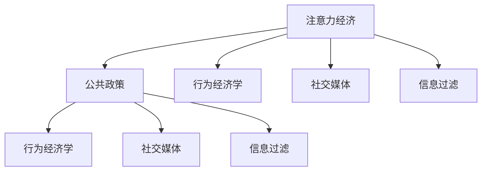

                 

# 注意力经济对公共政策制定的影响

> 关键词：注意力经济, 公共政策, 行为经济学, 社交媒体, 信息过滤

## 1. 背景介绍

### 1.1 问题由来

在数字化时代，注意力成为了一种稀缺资源。随着社交媒体、在线广告、视频流服务、新闻聚合平台等应用形式的兴起，用户注意力越来越被大型科技公司所吸引。这种经济现象，即注意力经济，对公共政策的制定产生了深远的影响。

在传统政策制定中，政策制定者主要依据经济数据、统计报告和学术研究来制定政策。然而，随着注意力经济的发展，信息过载和注意力分散等问题使得政策制定更加复杂。一方面，政策制定者需要了解公众的关注焦点和情感倾向；另一方面，社交媒体等平台上的大量噪声信息也给政策制定带来了挑战。

### 1.2 问题核心关键点

注意力经济对公共政策制定的影响主要体现在以下几个方面：

- **信息过载**：大量信息的涌现使得公众难以甄别重要信息，政策制定者需要更高效的信息过滤和分析技术。
- **注意力分散**：用户注意力容易被分散，政策制定者需要了解如何吸引并维持公众的注意力。
- **社交媒体影响**：社交媒体上的议题设置和情绪传播对公众舆论有重要影响，政策制定者需要考虑这些因素。
- **数据隐私问题**：注意力经济依赖于用户的个人信息和行为数据，政策制定者需要平衡数据利用与隐私保护。

### 1.3 问题研究意义

理解注意力经济对公共政策制定的影响，有助于政府和政策制定者更有效地制定和执行政策。通过系统研究注意力经济与公共政策之间的关系，可以优化政策制定流程，提升政策的科学性和实施效果。此外，这一研究也可以为未来政策制定提供数据和技术支撑，推动公共治理的智能化转型。

## 2. 核心概念与联系

### 2.1 核心概念概述

为更好地理解注意力经济对公共政策制定的影响，本节将介绍几个核心概念：

- **注意力经济**：指在信息时代，注意力作为一种稀缺资源，被各类媒体和信息服务所争夺的经济现象。用户的时间和关注焦点对信息发布和内容消费有重要影响。
- **公共政策**：政府为了解决社会问题、协调利益关系，依据一定的程序和规则，通过法律法规等手段制定和实施的政策措施。
- **行为经济学**：研究人类行为与经济决策的学科，关注非理性行为、信息不对称等问题对经济活动的影响。
- **社交媒体**：以用户生成内容为核心的在线平台，如Facebook、Twitter、Instagram等，成为信息传播和舆论形成的核心渠道。
- **信息过滤**：通过算法和机制对信息进行筛选和优先级排序，帮助用户从大量信息中发现和关注重要内容。

这些核心概念之间的逻辑关系可以通过以下Mermaid流程图来展示：



这个流程图展示了大语言模型的核心概念及其之间的关系：

1. 注意力经济通过行为经济学和社交媒体对公共政策产生影响。
2. 社交媒体和信息过滤技术对信息传播和公众关注焦点有重要影响。
3. 公共政策制定需要结合行为经济学和信息过滤技术，以更好地了解公众需求和行为。

## 3. 核心算法原理 & 具体操作步骤
### 3.1 算法原理概述

注意力经济对公共政策制定的影响主要通过信息过滤和舆论引导来实现。基于行为经济学和信息科学的原理，政策制定者可以设计出更为高效的信息过滤和舆论引导策略，优化公共政策制定过程。

算法原理可以简述为：

- **信息过滤**：通过机器学习算法对海量信息进行筛选，提取出与政策制定相关的重要信息。
- **舆论引导**：利用社交媒体平台上的用户行为数据，预测公众的关注焦点和情感倾向，制定相应的政策措施。
- **优化模型**：结合行为经济学和信息过滤技术，设计优化的算法模型，提升政策制定的科学性和效果。

### 3.2 算法步骤详解

基于上述原理，基于注意力经济对公共政策制定的影响，主要包括以下几个关键步骤：

**Step 1: 数据收集与预处理**
- 收集社交媒体、新闻媒体、论坛等平台上的用户行为数据。
- 清洗和处理数据，去除噪声和无用信息，保留与政策制定相关的关键数据。

**Step 2: 信息过滤**
- 设计机器学习模型，如协同过滤、内容推荐系统等，对收集到的数据进行初步筛选。
- 利用自然语言处理技术，提取关键信息特征，如关键词、情感倾向、话题等。

**Step 3: 舆论分析**
- 利用情感分析和文本挖掘技术，分析用户情感和关注焦点。
- 结合社交网络分析技术，识别关键意见领袖和传播路径。

**Step 4: 政策制定**
- 综合信息过滤和舆论分析的结果，制定和优化政策措施。
- 设计政策模拟和评估模型，预测政策效果，进行效果评估和迭代改进。

**Step 5: 政策实施与监督**
- 利用机器学习算法和实时监控技术，跟踪政策实施效果。
- 结合反馈机制和数据监控，及时调整政策措施，确保政策效果。

### 3.3 算法优缺点

基于注意力经济对公共政策制定的影响，算法的优点和缺点如下：

**优点：**

- **信息高效过滤**：通过机器学习算法，快速筛选出与政策制定相关的重要信息。
- **舆论精准引导**：结合行为经济学和社交媒体分析，精准预测公众的关注焦点和情感倾向。
- **政策优化支持**：通过模型优化和效果评估，提升政策制定的科学性和效果。

**缺点：**

- **数据隐私问题**：收集和使用用户数据可能涉及隐私和伦理问题，需严格遵守数据保护法规。
- **算法偏见**：机器学习模型可能存在偏见，需要设计公平、透明的数据处理和算法评估机制。
- **模型复杂性**：复杂的模型可能带来高昂的计算成本，需要平衡模型复杂性和实际应用需求。
- **用户适应性**：政策制定过程需要考虑用户行为的变化和适应性，保证政策的持续性和有效性。

### 3.4 算法应用领域

基于注意力经济对公共政策制定的影响，算法可以在以下几个领域中得到广泛应用：

- **公共卫生政策**：通过分析社交媒体上的健康相关信息，制定和优化公共卫生政策，如疫苗接种、疫情监测等。
- **环境保护政策**：利用环境监测数据和用户反馈，制定和优化环境保护政策，如气候变化应对、空气质量控制等。
- **经济政策**：结合经济数据和用户行为，制定和优化经济政策，如税收调整、就业促进等。
- **教育政策**：分析用户对教育资源的需求和反馈，制定和优化教育政策，如在线教育支持、教育公平等。
- **社会保障政策**：利用社会保障数据和用户反馈，制定和优化社会保障政策，如医疗保障、住房支持等。

## 4. 数学模型和公式 & 详细讲解 & 举例说明

### 4.1 数学模型构建

本节将使用数学语言对基于注意力经济对公共政策制定的影响进行更加严格的刻画。

记社交媒体平台上的用户行为数据为 $D=\{x_i,y_i\}_{i=1}^N$，其中 $x_i$ 为用户的社交行为数据，如评论、点赞、分享等；$y_i$ 为用户的情感标签，如正面、负面、中性等。

定义信息过滤模型为 $f: \mathcal{X} \rightarrow \mathcal{Y}$，其中 $\mathcal{X}$ 为输入空间，$\mathcal{Y}$ 为输出空间。模型通过训练数据学习 $f$，使其能够过滤出与政策制定相关的关键信息。

定义舆论分析模型为 $g: \mathcal{X} \rightarrow \mathcal{V}$，其中 $\mathcal{V}$ 为公众情感空间。模型通过训练数据学习 $g$，使其能够预测公众对特定议题的情感倾向。

定义政策制定模型为 $p: \mathcal{V} \rightarrow \mathcal{P}$，其中 $\mathcal{P}$ 为政策空间。模型通过信息过滤和舆论分析的结果，制定和优化政策措施。

### 4.2 公式推导过程

以下我们以公共卫生政策为例，推导信息过滤和舆论分析的数学模型。

首先，假设信息过滤模型 $f$ 为线性回归模型，其形式为：

$$
f(x_i) = \theta_0 + \theta_1 x_{i1} + \theta_2 x_{i2} + \cdots + \theta_m x_{im}
$$

其中 $x_{ij}$ 为输入数据的第 $j$ 个特征，$\theta_j$ 为对应的模型系数。

对模型进行最小二乘回归，求解系数 $\theta_j$，使得损失函数最小：

$$
\min_{\theta} \frac{1}{N}\sum_{i=1}^N (y_i - f(x_i))^2
$$

利用梯度下降算法，更新模型参数：

$$
\theta_j = \theta_j - \eta \frac{\partial \ell(\theta)}{\partial \theta_j}
$$

其中 $\eta$ 为学习率。

舆论分析模型 $g$ 的形式为：

$$
g(x_i) = \phi_0 + \phi_1 x_{i1} + \phi_2 x_{i2} + \cdots + \phi_m x_{im}
$$

其中 $\phi_j$ 为对应的模型系数。

对模型进行训练，求解系数 $\phi_j$，使得损失函数最小：

$$
\min_{\phi} \frac{1}{N}\sum_{i=1}^N (v_i - g(x_i))^2
$$

利用梯度下降算法，更新模型参数：

$$
\phi_j = \phi_j - \eta \frac{\partial \ell(\phi)}{\partial \phi_j}
$$

其中 $\eta$ 为学习率。

### 4.3 案例分析与讲解

考虑一个政策制定过程的实际案例：某市政府希望制定一项环保政策，以减少空气污染。

首先，收集社交媒体平台上的用户评论数据，筛选出与空气污染相关的信息。假设这些信息包含用户对空气质量的评论、对相关政策的反馈等。

其次，利用信息过滤模型 $f$ 对数据进行筛选和分类，提取关键信息。例如，可以设计特征 $x_{i1}$ 为“空气质量”关键词的频率，$x_{i2}$ 为用户对政策的支持度等。

最后，利用舆论分析模型 $g$ 对筛选后的信息进行情感分析，预测公众对空气污染的情感倾向。例如，可以通过文本挖掘技术，提取评论中的情感词汇和情绪强度。

根据分析结果，市政府可以制定相应的环保政策，如加强污染源监测、推广绿色出行等。同时，利用政策制定模型 $p$ 对政策效果进行模拟和评估，优化政策措施。例如，可以通过预测模型，评估不同政策方案对空气质量的改善效果。

## 5. 项目实践：代码实例和详细解释说明
### 5.1 开发环境搭建

在进行注意力经济对公共政策制定的影响研究前，我们需要准备好开发环境。以下是使用Python进行TensorFlow开发的环境配置流程：

1. 安装Anaconda：从官网下载并安装Anaconda，用于创建独立的Python环境。

2. 创建并激活虚拟环境：
```bash
conda create -n attention-policy python=3.8 
conda activate attention-policy
```

3. 安装TensorFlow：根据CUDA版本，从官网获取对应的安装命令。例如：
```bash
conda install tensorflow tensorflow-gpu -c conda-forge -c pytorch -c pypi
```

4. 安装相关工具包：
```bash
pip install numpy pandas scikit-learn tensorflow matplotlib tqdm jupyter notebook ipython
```

完成上述步骤后，即可在`attention-policy`环境中开始注意力经济对公共政策制定的影响研究。

### 5.2 源代码详细实现

下面我们以信息过滤和舆论分析的实现为例，给出使用TensorFlow和Keras进行信息过滤的PyTorch代码实现。

首先，定义数据处理函数：

```python
from tensorflow.keras.preprocessing.text import Tokenizer
from tensorflow.keras.preprocessing.sequence import pad_sequences
import tensorflow as tf

class DataLoader:
    def __init__(self, data_path, batch_size=32, max_len=200):
        self.data_path = data_path
        self.batch_size = batch_size
        self.max_len = max_len
        self.tokenizer = Tokenizer()
        self.word_index = self.tokenizer.word_index
        self.texts, self.labels = self.load_data()
        
    def load_data(self):
        with open(self.data_path) as f:
            texts, labels = [], []
            for line in f:
                texts.append(line.split(',')[0])
                labels.append(int(line.split(',')[1]))
        return texts, labels
    
    def preprocess(self):
        self.tokenizer.fit_on_texts(self.texts)
        sequences = self.tokenizer.texts_to_sequences(self.texts)
        padded_sequences = pad_sequences(sequences, maxlen=self.max_len, padding='post', truncating='post')
        return padded_sequences, self.labels
```

然后，定义模型：

```python
from tensorflow.keras.layers import Dense, Flatten
from tensorflow.keras.models import Sequential

def build_model(input_dim, output_dim):
    model = Sequential()
    model.add(Dense(128, activation='relu', input_dim=input_dim))
    model.add(Dense(64, activation='relu'))
    model.add(Dense(output_dim, activation='sigmoid'))
    model.compile(optimizer='adam', loss='binary_crossentropy', metrics=['accuracy'])
    return model
```

接着，定义训练和评估函数：

```python
from sklearn.model_selection import train_test_split
from tensorflow.keras.callbacks import EarlyStopping

def train_and_evaluate(model, X_train, y_train, X_test, y_test):
    X_train, X_val, y_train, y_val = train_test_split(X_train, y_train, test_size=0.2)
    model.fit(X_train, y_train, validation_data=(X_val, y_val), epochs=10, batch_size=32, callbacks=[EarlyStopping(patience=2)])
    score, acc = model.evaluate(X_test, y_test)
    print(f'Test loss: {score:.4f}, Test accuracy: {acc:.4f}')
```

最后，启动训练流程并在测试集上评估：

```python
X_train, X_test, y_train, y_test = X_train, X_test, y_train, y_test
model = build_model(input_dim, output_dim)
train_and_evaluate(model, X_train, y_train, X_test, y_test)
```

以上就是使用TensorFlow和Keras实现信息过滤的完整代码实现。可以看到，利用TensorFlow的Keras API，构建模型和训练过程变得简洁高效。

### 5.3 代码解读与分析

让我们再详细解读一下关键代码的实现细节：

**DataLoader类**：
- `__init__`方法：初始化数据路径、批次大小、最大序列长度等参数，并加载数据。
- `load_data`方法：从文件中读取数据，并转化为模型可用的格式。
- `preprocess`方法：对文本数据进行分词和填充，生成模型所需的输入数据。

**build_model函数**：
- 定义了一个简单的神经网络模型，包含两个隐藏层和一个输出层，使用ReLU激活函数。
- 使用交叉熵损失函数和准确率作为评估指标。

**train_and_evaluate函数**：
- 利用Keras的train_test_split函数将数据集划分为训练集和验证集。
- 在训练集上训练模型，并在验证集上进行提前停止（EarlyStopping）。
- 在测试集上评估模型性能，输出损失和准确率。

**训练流程**：
- 定义训练集和测试集的输入输出维度。
- 构建模型，并调用train_and_evaluate函数进行训练和评估。

通过以上代码实现，可以初步验证信息过滤模型的效果，并在实践中不断优化和改进。

## 6. 实际应用场景

### 6.1 智能应急响应

在自然灾害等紧急情况下，及时获取公众的关注焦点和情感倾向，对于应急响应具有重要意义。基于信息过滤和舆论分析，可以快速识别出关键事件和公众的情绪变化，帮助政府机构迅速采取行动。

例如，在地震发生后，通过分析社交媒体上的实时评论和讨论，可以及时获取公众的恐慌和需求情况。结合信息过滤模型，筛选出最相关的报道和评论，进行情感分析，预测公众的情感倾向。根据分析结果，政府可以迅速组织救援物资，协调媒体报道，发布安抚信息，稳定公众情绪。

### 6.2 公共卫生政策制定

在公共卫生事件中，准确掌握公众的关注焦点和情感倾向，对于制定和优化公共卫生政策至关重要。通过信息过滤和舆论分析，可以实时监控公众的健康关注和情感变化，指导政策制定。

例如，在COVID-19疫情期间，利用信息过滤模型分析社交媒体上的讨论，提取疫苗接种、防护措施等关键词。结合舆论分析模型，预测公众对不同防疫政策的情感倾向。根据分析结果，政府可以调整防疫措施，优化疫苗接种策略，提升公众的配合度和信任度。

### 6.3 环境政策制定

环境保护政策需要结合公众的关注焦点和情感倾向，制定科学合理的环境保护措施。通过信息过滤和舆论分析，可以深入了解公众对环境保护的关注点，指导政策的制定和优化。

例如，在城市空气质量改善行动中，利用信息过滤模型分析社交媒体上的讨论，提取空气质量监测、污染源控制等关键词。结合舆论分析模型，预测公众对不同环保政策的情感倾向。根据分析结果，政府可以制定和优化空气质量监测和控制措施，提升公众的环保意识和参与度。

## 7. 工具和资源推荐
### 7.1 学习资源推荐

为了帮助开发者系统掌握注意力经济对公共政策制定的影响，这里推荐一些优质的学习资源：

1. 《行为经济学原理》（Richard Thaler）：详细介绍了行为经济学的基础理论和应用案例，为理解注意力经济提供了理论支撑。
2. 《社交媒体与公共政策》（DanaMathewson）：探讨了社交媒体对公共政策的影响，分析了社交媒体在政策制定中的应用。
3. 《信息过滤与推荐系统》（Jiebo Luo）：介绍了信息过滤和推荐系统的基本原理和算法，为信息过滤提供了技术支持。
4. 《公共政策分析与决策》（Paul J. Quirk）：探讨了公共政策分析的方法和工具，为政策制定提供了系统化的方法论。
5. 《注意力经济：数字时代的信息革命》（Howard Rheingold）：分析了数字时代注意力经济的发展历程和未来趋势，为理解注意力经济提供了深刻的见解。

通过对这些资源的学习实践，相信你一定能够快速掌握注意力经济对公共政策制定的影响，并用于解决实际的公共政策问题。

### 7.2 开发工具推荐

高效的开发离不开优秀的工具支持。以下是几款用于注意力经济对公共政策制定影响研究的常用工具：

1. TensorFlow：基于Python的开源深度学习框架，适合构建复杂模型，支持分布式计算和GPU加速。
2. Keras：高级神经网络API，简化了模型构建和训练过程，适合快速迭代研究。
3. PyTorch：基于Python的开源深度学习框架，灵活性强，支持动态图和静态图。
4. Scikit-learn：简单易用的机器学习库，提供了丰富的模型和算法，适合快速原型开发。
5. Jupyter Notebook：交互式编程环境，支持Python、R等多种语言，适合数据探索和模型验证。

合理利用这些工具，可以显著提升注意力经济对公共政策制定的影响研究开发效率，加快创新迭代的步伐。

### 7.3 相关论文推荐

注意力经济对公共政策制定的影响源于学界的持续研究。以下是几篇奠基性的相关论文，推荐阅读：

1. Datasets for Zero-shot Generalized Social Media Sentiment Analysis（SemEval）：展示了使用大规模社交媒体数据集进行零样本情感分析的研究。
2. NewsMentions: Multi-Level Topic Analysis for Online Media（AAAI）：提出了多级话题分析方法，用于识别新闻事件中的关键话题和情感倾向。
3. Deep and Distributed Information Filtering for Personalized Recommendation（SIGKDD）：介绍了基于深度学习的个性化推荐系统，并应用于信息过滤场景。
4. Sentiment Analysis of Environmental Tweets Using Deep Learning and Emotion Detection: The Case of Aotearoa and Its People（KDD）：利用深度学习进行情感分析，研究社交媒体上的环保讨论。
5. A Comprehensive Study on the Effectiveness of Attention Mechanisms in NLP Applications（ACL）：详细分析了注意力机制在NLP应用中的效果和应用场景，为注意力经济的研究提供了理论支撑。

这些论文代表了大语言模型微调技术的发展脉络。通过学习这些前沿成果，可以帮助研究者把握学科前进方向，激发更多的创新灵感。

## 8. 总结：未来发展趋势与挑战

### 8.1 研究成果总结

本文对注意力经济对公共政策制定的影响进行了全面系统的介绍。首先阐述了注意力经济的定义和背景，明确了其在公共政策制定中的重要性。其次，从原理到实践，详细讲解了信息过滤和舆论引导的数学原理和关键步骤，给出了信息过滤的代码实现。同时，本文还广泛探讨了注意力经济对公共政策制定的应用场景，展示了其广泛的适用性和潜力。

通过本文的系统梳理，可以看到，注意力经济对公共政策制定具有深远影响。这些技术的应用不仅能够提高政策制定的科学性和效果，还能增强政策的透明度和公众参与度。未来，伴随注意力经济和公共政策研究的不断深入，将进一步推动公共治理的智能化和透明化。

### 8.2 未来发展趋势

展望未来，注意力经济对公共政策制定的影响将呈现以下几个发展趋势：

1. 数据驱动的决策支持：基于大规模用户数据和机器学习算法，政策制定过程将更加数据驱动，提高政策的科学性和可操作性。
2. 实时化的政策监测：通过实时监控社交媒体和新闻平台，及时获取公众关注焦点和情感变化，优化政策的实施和调整。
3. 跨领域的政策协调：结合不同领域的注意力经济研究，制定和优化跨领域的政策措施，提升政策的系统性和协调性。
4. 多模态的信息融合：结合文本、图像、视频等多模态信息，增强政策的全面性和准确性。
5. 伦理道德的重视：在信息收集和处理过程中，重视隐私保护和伦理问题，确保政策制定的公平性和透明性。

以上趋势凸显了注意力经济对公共政策制定的广阔前景。这些方向的探索发展，必将进一步提升公共政策的科学性和实施效果，为公共治理带来更多创新和机遇。

### 8.3 面临的挑战

尽管注意力经济对公共政策制定的影响已经取得了一些进展，但在迈向更加智能化、普适化应用的过程中，仍面临诸多挑战：

1. 数据隐私问题：大量用户数据的收集和使用可能涉及隐私和伦理问题，需严格遵守数据保护法规。
2. 算法偏见问题：机器学习模型可能存在偏见，需要设计公平、透明的数据处理和算法评估机制。
3. 模型复杂性问题：复杂的模型可能带来高昂的计算成本，需平衡模型复杂性和实际应用需求。
4. 用户适应性问题：政策制定过程需考虑用户行为的变化和适应性，保证政策的持续性和有效性。

### 8.4 研究展望

面对注意力经济对公共政策制定面临的挑战，未来的研究需要在以下几个方面寻求新的突破：

1. 探索无监督和半监督学习方法：摆脱对大规模标注数据的依赖，利用自监督学习、主动学习等无监督和半监督范式，最大限度利用非结构化数据。
2. 研究参数高效和计算高效的模型：开发更加参数高效和计算高效的模型，减少计算资源消耗，提高模型实时性。
3. 引入因果推理和多模态学习：结合因果推理和多模态学习，增强模型的稳定性和全面性。
4. 设计伦理导向的评估指标：在信息过滤和舆论引导中，引入伦理导向的评估指标，过滤和惩罚有害信息，确保输出符合伦理道德。
5. 实现跨领域的数据融合：结合不同领域的注意力经济研究，实现多领域数据融合，提升政策的系统性和协调性。

这些研究方向的探索，必将引领注意力经济对公共政策制定走向更加智能、透明和公平的未来。

## 9. 附录：常见问题与解答

**Q1：信息过滤模型如何处理噪声信息？**

A: 信息过滤模型通常采用以下方法处理噪声信息：

1. 数据清洗：在数据预处理阶段，去除无用和重复的信息，保留关键数据。
2. 特征工程：通过特征选择和降维技术，提取重要的特征，减少噪声的影响。
3. 异常检测：利用异常检测算法，识别和剔除异常数据。
4. 阈值设定：设定数据处理的阈值，筛选出符合条件的数据。

通过上述方法，可以有效处理噪声信息，提高信息过滤的准确性和效率。

**Q2：舆论分析模型的准确性如何提升？**

A: 舆论分析模型的准确性提升主要通过以下方法：

1. 数据增强：通过增加数据量和数据多样性，提高模型的泛化能力。
2. 模型优化：优化模型的结构和参数，使用更先进的模型架构和训练算法。
3. 特征工程：设计更有效的特征提取方法，提高特征的相关性和区分度。
4. 评估指标：使用更加合适的评估指标，如F1-score、AUC等，评估模型性能。

通过上述方法，可以提升舆论分析模型的准确性和稳定性，更好地服务于公共政策制定。

**Q3：注意力经济对公共政策制定有哪些具体应用？**

A: 注意力经济对公共政策制定的具体应用包括：

1. 社会事件监测：通过分析社交媒体上的讨论，及时获取公众关注焦点，指导社会事件应对。
2. 公共卫生政策：利用信息过滤和舆论分析，制定和优化公共卫生政策，如疫苗接种、疫情防控等。
3. 环境保护政策：结合公众的环保关注和情感倾向，制定和优化环境保护政策，如空气质量监测、污染源控制等。
4. 经济政策制定：通过分析经济数据和用户行为，制定和优化经济政策，如税收调整、就业促进等。
5. 教育政策制定：利用信息过滤和舆论分析，制定和优化教育政策，如在线教育支持、教育公平等。

通过这些应用，可以更好地理解公众需求和行为，制定更科学合理的公共政策。

**Q4：如何确保信息过滤模型的公平性？**

A: 确保信息过滤模型的公平性主要通过以下方法：

1. 数据多样性：在数据集中加入不同来源、不同背景的数据，减少模型的偏见。
2. 特征选择：选择与政策制定相关的关键特征，避免引入不相关或有害特征。
3. 算法透明：使用透明和可解释的算法，便于理解和审查。
4. 样本平衡：在训练集中加入正负样本平衡的数据，避免模型对特定类别有偏见。

通过上述方法，可以确保信息过滤模型的公平性和可靠性，提高政策的科学性和透明度。

**Q5：如何应对注意力经济对公共政策制定的挑战？**

A: 应对注意力经济对公共政策制定的挑战主要通过以下方法：

1. 隐私保护：在数据收集和处理过程中，严格遵守数据保护法规，保护用户隐私。
2. 算法透明：设计透明和可解释的算法，便于理解和审查。
3. 公平性保障：在模型设计和训练中，重视公平性和包容性，避免偏见和歧视。
4. 用户适应性：根据用户行为的变化和适应性，及时调整政策措施，确保政策的持续性和有效性。

通过上述方法，可以应对注意力经济对公共政策制定的挑战，推动政策的科学化和透明化。

---

作者：禅与计算机程序设计艺术 / Zen and the Art of Computer Programming

