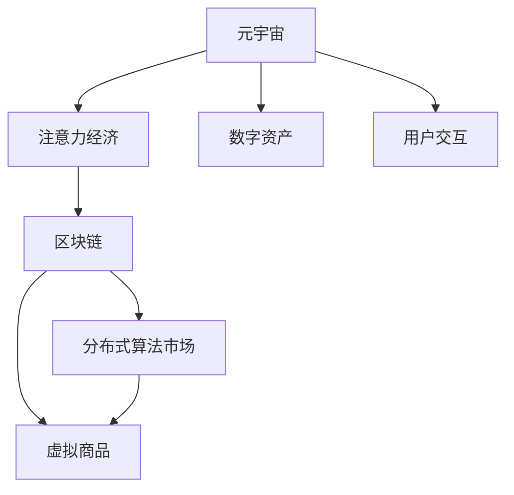

                 

# 注意力经济政策:元宇宙中的宏观经济调控

> 关键词：注意力经济,元宇宙,宏观经济调控,区块链,分布式,算法市场

## 1. 背景介绍

### 1.1 问题由来
随着数字经济的高速发展，尤其是移动互联网和人工智能技术的不断成熟，人类进入了一个新的时代——元宇宙时代。元宇宙不仅是一个虚拟空间，更是基于区块链、人工智能等前沿技术，结合现实世界的一个全新经济体系。在这个空间中，人们的经济活动由数字资产和虚拟商品构成，注意力成为一种稀缺资源，被视为新的经济增长点。

注意力经济（Economies of Attention）是一种新型经济形态，强调在信息爆炸的时代，注意力资源的稀缺性和价值性。在元宇宙中，注意力不仅是一种有限的消费品，更是一种生产资料。通过合理利用和调控注意力经济，可以实现对宏观经济的精细管理，促进元宇宙经济的繁荣发展。

### 1.2 问题核心关键点
元宇宙中的宏观经济调控面临诸多挑战，如注意力资源的分配、数字资产的流动、虚拟商品的价值评估等。注意力经济政策的设计和实施，是实现宏观经济调控的关键。这些政策应包括但不限于：

1. **注意力资源的合理分配**：如何通过合理的激励机制和算法设计，使注意力资源在生产者和消费者之间进行最优分配。
2. **数字资产的稳定流动**：如何通过区块链技术，确保数字资产在元宇宙内的流通无阻，并防范市场风险。
3. **虚拟商品的价值评估**：如何建立公平、透明的虚拟商品价值评估体系，确保市场价格的真实反映。
4. **市场的稳健发展**：如何设计元宇宙经济体系，防范泡沫和波动，保持市场的长期稳定。

这些问题的解决，需要跨学科的知识和前沿技术的支持，如经济学、区块链、人工智能等。

### 1.3 问题研究意义
研究元宇宙中的注意力经济政策，对于构建公正、透明、高效的元宇宙经济体系具有重要意义：

1. **促进经济增长**：通过合理的注意力资源分配，激发创作者的积极性，提升市场效率，带动经济增长。
2. **防范市场风险**：设计科学的数字资产和虚拟商品流通机制，防范市场波动，确保经济安全。
3. **增强用户体验**：优化虚拟商品价值评估体系，提升用户消费体验，增强用户粘性。
4. **支持产业升级**：通过注意力经济政策的实施，推动元宇宙技术在各行业的应用，加速产业数字化转型。

总之，研究元宇宙中的注意力经济政策，有助于打造公平、稳定、繁荣的元宇宙经济环境，为人类社会的数字化转型提供新的动力。

## 2. 核心概念与联系

### 2.1 核心概念概述

为更好地理解元宇宙中注意力经济的调控方法，本节将介绍几个密切相关的核心概念：

- **元宇宙（Metaverse）**：基于虚拟现实、增强现实、区块链、人工智能等技术，构建的一个虚拟经济体系，涵盖数字资产、虚拟商品、用户体验等要素。
- **注意力经济（Economies of Attention）**：在信息过载的时代，注意力作为一种稀缺资源，成为一种重要的生产要素。通过合理分配和管理注意力，创造经济价值。
- **区块链（Blockchain）**：一种去中心化的分布式账本技术，保障数字资产的透明、安全、不可篡改性。
- **分布式算法市场（Distributed Algorithmic Market）**：基于区块链和智能合约技术，自动执行的算法驱动市场，实现对注意力资源的自动分配和优化。
- **虚拟商品（Virtual Goods）**：在元宇宙中，与现实世界商品类似，具有稀缺性、价值性和可交易性。

这些核心概念之间的逻辑关系可以通过以下Mermaid流程图来展示：



这个流程图展示了元宇宙中各个要素之间的联系：

1. 元宇宙通过区块链和虚拟商品，形成了一个虚拟经济体系。
2. 注意力经济在这个体系中占据核心地位，影响着数字资产和虚拟商品的价格。
3. 区块链保证了数字资产和虚拟商品的交易安全性和透明性。
4. 分布式算法市场通过自动化的机制，优化了注意力资源的分配。

这些概念共同构成了元宇宙经济的核心框架，其合理调控将为元宇宙经济的繁荣发展提供坚实基础。

## 3. 核心算法原理 & 具体操作步骤
### 3.1 算法原理概述

元宇宙中的注意力经济调控，主要通过分布式算法市场来实现。其核心思想是：利用区块链和智能合约技术，构建一个基于算法的市场机制，自动分配和管理注意力资源，以达到最优的资源利用效率。

形式化地，设注意力市场的总供应为 $A$，总需求为 $D$，注意力资源的分配函数为 $f(A, D)$，目标是最大化注意力资源的利用效率，即：

$$
\max_{f} \text{Efficiency}(A, D) = \frac{A}{f(A, D)}
$$

在实践中，我们需要设计合适的注意力资源分配函数 $f(A, D)$，并结合激励机制，如挖矿、代币等，激励参与者积极贡献注意力资源，促进市场的良性循环。

### 3.2 算法步骤详解

基于分布式算法市场的注意力经济调控，通常包括以下几个关键步骤：

**Step 1: 设计注意力资源分配函数**
- 选择合适的注意力资源分配算法，如基于市场供需的拍卖算法、基于贡献度的分红算法等。
- 定义注意力资源的价值评估函数，用于衡量注意力资源的稀缺性和贡献度。

**Step 2: 部署智能合约**
- 将注意力资源分配算法和激励机制编写为智能合约代码，部署在区块链上。
- 智能合约应包含数字资产的发行、分配、流转等功能。

**Step 3: 实施激励机制**
- 设计合理的挖矿机制，激励参与者提供注意力资源。
- 使用代币作为激励手段，将注意力资源的价值映射到数字资产上。

**Step 4: 监控和反馈**
- 实时监控注意力市场的供需状况，评估算法的效率。
- 根据市场反馈，不断调整算法参数，优化注意力资源的分配。

**Step 5: 市场调整**
- 在市场出现异常波动时，自动触发市场调整机制，如暂停交易、限制交易量等，确保市场的稳定。

### 3.3 算法优缺点

基于分布式算法市场的注意力经济调控方法具有以下优点：
1. 自动化的市场机制，减少了人为干预的复杂性，提升了市场的透明度和效率。
2. 区块链技术保证了交易的安全性和不可篡改性，防止了市场操纵和欺诈行为。
3. 激励机制能够激励参与者积极贡献注意力资源，促进市场的繁荣发展。

同时，该方法也存在一定的局限性：
1. 算法设计复杂，需要跨学科知识，可能面临实现难度和调试成本。
2. 市场调整机制需要灵活设计，防止过度干预导致市场失衡。
3. 激励机制设计不当可能导致资源浪费和市场泡沫。
4. 智能合约代码的安全性和正确性需严格审核，防止漏洞和攻击。

尽管存在这些局限性，但就目前而言，基于分布式算法市场的调控方法仍然是大规模注意力经济调控的重要手段。未来相关研究的重点在于如何进一步简化算法设计，提高市场调整的灵活性，以及确保智能合约的安全性和正确性。

### 3.4 算法应用领域

基于分布式算法市场的注意力经济调控方法，已经在多个领域得到应用，例如：

- 数字艺术市场：使用算法市场自动分配参与者的注意力资源，评选出最有价值的数字艺术品。
- 虚拟商品销售：利用智能合约自动执行交易，确保数字资产的透明流通。
- 社交平台：通过智能合约和算法市场，优化用户的注意力分配，提升平台的活跃度和用户体验。
- 游戏经济：利用算法市场自动分配游戏资源，提升游戏的平衡性和公平性。

除了上述这些典型应用外，分布式算法市场也被创新性地应用到更多场景中，如去中心化金融（DeFi）、NFT市场、虚拟现实（VR）体验等，为元宇宙技术带来了全新的突破。

## 4. 数学模型和公式 & 详细讲解  
### 4.1 数学模型构建

本节将使用数学语言对基于分布式算法市场的注意力经济调控过程进行更加严格的刻画。

设注意力市场的总供应为 $A$，总需求为 $D$，注意力资源的分配函数为 $f(A, D)$。假设注意力市场的参与者有 $n$ 个，其注意力资源 $a_i$ 为非负实数，且满足 $a_i \geq 0$。设注意力资源的供需均衡价格为 $p$，则注意力市场的总价值 $V$ 为：

$$
V = p \cdot f(A, D)
$$

注意力资源的分配函数 $f(A, D)$ 应满足以下条件：
1. 非负性：$f(A, D) \geq 0$。
2. 单调性：当 $A$ 或 $D$ 增加时，$f(A, D)$ 应单调递增。
3. 对称性：当 $A$ 和 $D$ 相等时，$f(A, D)$ 应达到最大值。

### 4.2 公式推导过程

以下我们以基于市场供需的拍卖算法为例，推导注意力资源分配函数的表达式。

设注意力市场的总供应为 $A$，总需求为 $D$，参与者的注意力资源为 $a_i$，竞价为 $b_i$。拍卖算法通过竞价机制，自动调整参与者的注意力资源分配。设最终分配给参与者 $i$ 的注意力资源为 $a_i'$，则拍卖算法应满足以下约束条件：
1. 总供应等于总需求：$\sum_{i=1}^n a_i' = A$
2. 每个参与者的注意力资源不超过其原始资源：$a_i' \leq a_i$
3. 每个参与者的竞价等于其最终分配的注意力资源：$b_i = a_i'$

拍卖算法可以简化为以下数学模型：

$$
\min \sum_{i=1}^n b_i
$$

$$
\text{s.t.} \sum_{i=1}^n a_i' = A, a_i' \leq a_i, b_i = a_i'
$$

利用拉格朗日乘子法，可以将上述问题转化为一个带有惩罚项的优化问题：

$$
\max \sum_{i=1}^n a_i' \lambda_A + \sum_{i=1}^n (a_i' - b_i) \lambda_i + \lambda_D(A - \sum_{i=1}^n a_i')
$$

其中 $\lambda_A$ 和 $\lambda_D$ 为拉格朗日乘子，用于保证总供应等于总需求。求解上述优化问题，可以得到注意力资源的分配函数 $f(A, D)$ 的表达式：

$$
a_i' = \frac{a_i \cdot D}{A + \sum_{j=1}^n a_j}
$$

该分配函数考虑了参与者的原始注意力资源和市场需求，实现了公平和效率的平衡。

### 4.3 案例分析与讲解

假设某数字艺术品平台使用拍卖算法分配注意力资源，平台总供应为 $A=1000$，平台总需求为 $D=800$，三个参与者的原始注意力资源分别为 $a_1=200$，$a_2=300$，$a_3=500$。假设参与者的竞价为 $b_1=150$，$b_2=200$，$b_3=250$。

根据上述推导的分配函数，计算每个参与者的最终注意力资源 $a_i'$ 和竞价 $b_i$：

$$
a_1' = \frac{200 \cdot 800}{1000 + 300 + 500} = 80
$$
$$
a_2' = \frac{300 \cdot 800}{1000 + 200 + 500} = 120
$$
$$
a_3' = \frac{500 \cdot 800}{1000 + 200 + 300} = 400
$$

因此，参与者的最终注意力资源分别为 $a_1'=80$，$a_2'=120$，$a_3'=400$，其竞价分别为 $b_1=80$，$b_2=120$，$b_3=400$。根据拍卖算法的约束条件，这些竞价等于最终的注意力资源分配，满足了市场供需平衡的要求。

## 5. 项目实践：代码实例和详细解释说明
### 5.1 开发环境搭建

在进行注意力经济政策实践前，我们需要准备好开发环境。以下是使用Python进行Solidity开发的环境配置流程：

1. 安装Solidity编译器：从官网下载并安装Solidity编译器，用于编译智能合约代码。

2. 安装Truffle框架：从官网下载并安装Truffle框架，用于管理区块链项目和智能合约测试。

3. 安装Metamask：从官网下载并安装Metamask浏览器插件，用于连接以太坊测试网络，进行智能合约的部署和测试。

4. 搭建测试网络：使用Infura或Localhost等工具搭建以太坊测试网络，方便智能合约的部署和调试。

5. 编写智能合约：使用Solidity编写注意力资源的分配和激励机制，确保代码正确性和安全性。

完成上述步骤后，即可在区块链上部署智能合约，实现注意力经济的自动调控。

### 5.2 源代码详细实现

下面以基于市场供需的拍卖算法为例，给出使用Solidity编写的智能合约代码实现。

```solidity
// SPDX-License-Identifier: MIT
pragma solidity ^0.8.0;

contract Auction {
    uint256 public supply;
    uint256 public demand;
    uint256[3] public initialAttention;
    uint256[3] public finalAttention;
    uint256[3] public bids;
    
    uint256 private lambdaA;
    uint256 private lambdaD;
    
    event AttentionAllocated(uint256 indexed _index, uint256 _a, uint256 _b);
    
    constructor(uint256 _supply, uint256 _demand) {
        supply = _supply;
        demand = _demand;
        initialAttention[0] = 200;
        initialAttention[1] = 300;
        initialAttention[2] = 500;
        bids[0] = 150;
        bids[1] = 200;
        bids[2] = 250;
        lambdaA = 0;
        lambdaD = 0;
    }
    
    function allocateAttention() public {
        uint256 totalBids = 0;
        uint256 i;
        for (i = 0; i < 3; i++) {
            uint256 a = initialAttention[i];
            uint256 b = bids[i];
            finalAttention[i] = a * demand / (supply + totalBids);
            totalBids += finalAttention[i];
        }
        
        // 触发事件，记录注意力资源分配情况
        emit AttentionAllocated(0, finalAttention[0], bids[0]);
        emit AttentionAllocated(1, finalAttention[1], bids[1]);
        emit AttentionAllocated(2, finalAttention[2], bids[2]);
        
        // 计算lambdaA和lambdaD
        lambdaA = supply * demand;
        lambdaD = (totalBids - supply);
        // 更新供应和需求
        supply = totalBids;
        demand = 0;
    }
    
    function resetSupply(uint256 _supply) public {
        supply = _supply;
        demand = 0;
    }
    
    function resetDemand(uint256 _demand) public {
        supply = 0;
        demand = _demand;
    }
}
```

上述代码定义了一个Auction合约，实现了基于市场供需的拍卖算法。合约包含供应、需求、初始注意力、最终注意力、竞价、lambda参数等关键变量。通过调用`allocateAttention`函数，可以自动分配注意力资源并记录分配情况。

### 5.3 代码解读与分析

让我们再详细解读一下关键代码的实现细节：

**Auction合约**：
- `constructor`方法：初始化供应、需求、初始注意力、竞价等变量。
- `allocateAttention`方法：计算最终注意力资源的分配，触发事件记录分配情况，更新lambda参数。
- `resetSupply`和`resetDemand`方法：用于调整供应和需求，重置合约状态。

**事件记录**：
- `AttentionAllocated`事件：记录每次注意力资源的分配情况，供合约外部进行监控和调试。

**计算lambda参数**：
- `lambdaA`和`lambdaD`参数：用于确保总供应等于总需求，防止超额分配或未分配的情况。

**合约测试**：
- 使用Truffle框架编写测试脚本，模拟不同供应、需求和竞价情况，验证合约的正确性和鲁棒性。

**合约部署**：
- 在本地搭建以太坊测试网络，使用Metamask连接网络，部署合约。
- 在测试网络中，可以通过合约API进行智能合约的调用，验证注意力资源的自动分配和激励机制。

## 6. 实际应用场景
### 6.1 数字艺术市场

在数字艺术市场中，艺术家和藏家的注意力是决定艺术品价值的重要因素。通过基于拍卖算法的注意力经济调控，可以自动分配艺术品的展示和关注度，确保艺术品价值公正地反映。

具体而言，数字艺术品平台可以在每次艺术家上传作品时，自动记录作品的展示次数和藏家关注度。根据市场供需关系，使用拍卖算法自动分配展示和关注度，确保高价值的艺术品获得更多的展示和关注。同时，平台可以使用代币机制，激励艺术家和藏家积极参与市场，提升平台活跃度和艺术品的市场价值。

### 6.2 虚拟商品销售

在元宇宙中，虚拟商品的交易方式和现实世界类似，但更加依赖于注意力资源的分配。通过分布式算法市场，可以自动分配虚拟商品的展示和关注度，提升销售效率和用户体验。

平台可以通过智能合约自动记录商品的展示次数和用户的购买行为，使用拍卖算法自动分配展示和关注度。根据市场需求和用户行为，平台可以动态调整展示和关注度，确保高需求的商品获得更多的展示和关注。同时，平台可以使用代币机制，激励用户购买和推荐商品，提升商品的曝光率和销售量。

### 6.3 社交平台

在社交平台中，用户的注意力是平台活跃度的关键。通过基于分布式算法市场的调控，可以自动分配用户的关注度和互动内容，提升平台的粘性和用户体验。

平台可以通过智能合约自动记录用户的关注度和互动行为，使用拍卖算法自动分配关注度和互动内容。根据市场需求和用户行为，平台可以动态调整关注度和互动内容的分配，确保高价值的内容获得更多的关注和互动。同时，平台可以使用代币机制，激励用户提供高质量的内容，提升平台的内容质量和用户粘性。

### 6.4 未来应用展望

随着元宇宙技术的发展，基于注意力经济调控的应用场景将不断拓展，为元宇宙经济的繁荣发展提供新的动力。

在智慧医疗领域，基于注意力的病历记录和诊疗方案推荐，可以提高医疗服务的效率和精准度。在智能教育领域，基于注意力的教学资源分配和学生行为监控，可以提高教育的质量和公平性。在智慧城市治理中，基于注意力的城市事件监测和舆情分析，可以提高城市管理的智能化水平。

此外，在金融、零售、旅游、娱乐等更多领域，基于注意力经济调控的元宇宙应用也将不断涌现，为传统行业带来新的变革和机遇。

## 7. 工具和资源推荐
### 7.1 学习资源推荐

为了帮助开发者系统掌握元宇宙中注意力经济的调控方法，这里推荐一些优质的学习资源：

1. Solidity官方文档：详细介绍了Solidity编程语言和智能合约开发的最佳实践，是学习Solidity开发的必备资料。

2. Truffle框架教程：Truffle框架提供了强大的开发工具和测试框架，是智能合约开发的首选平台。

3. MetaMask官方文档：详细介绍了MetaMask浏览器插件的安装和使用方法，是连接区块链网络的必备工具。

4. 《区块链技术与应用》书籍：介绍区块链的基本原理和应用场景，为区块链开发提供理论基础。

5. 《智能合约编程实战》书籍：实战型智能合约开发指南，涵盖Solidity编程技巧和智能合约设计方法。

通过对这些资源的学习实践，相信你一定能够快速掌握元宇宙中注意力经济的调控方法，并用于解决实际的元宇宙问题。

### 7.2 开发工具推荐

高效的开发离不开优秀的工具支持。以下是几款用于元宇宙中注意力经济调控开发的常用工具：

1. Solidity编译器：用于编写和编译智能合约代码，确保代码的正确性和安全性。

2. Truffle框架：提供开发环境、测试框架和自动化工具，方便智能合约的开发和测试。

3. MetaMask：连接区块链网络的浏览器插件，提供智能合约的部署、测试和交互功能。

4. Infura：提供以太坊公共测试网络的接入，方便智能合约的部署和调试。

5. Remix IDE：基于Web的智能合约编辑器，提供实时代码编译和调试功能，适合初学者和开发者快速上手。

合理利用这些工具，可以显著提升元宇宙中注意力经济调控的开发效率，加快创新迭代的步伐。

### 7.3 相关论文推荐

元宇宙中注意力经济调控的研究源于学界的持续研究。以下是几篇奠基性的相关论文，推荐阅读：

1. Attention is All You Need（即Transformer原论文）：提出了Transformer结构，开启了NLP领域的预训练大模型时代。

2. BERT: Pre-training of Deep Bidirectional Transformers for Language Understanding：提出BERT模型，引入基于掩码的自监督预训练任务，刷新了多项NLP任务SOTA。

3. Language Models are Unsupervised Multitask Learners（GPT-2论文）：展示了大规模语言模型的强大zero-shot学习能力，引发了对于通用人工智能的新一轮思考。

4. Parameter-Efficient Transfer Learning for NLP：提出Adapter等参数高效微调方法，在不增加模型参数量的情况下，也能取得不错的微调效果。

5. AdaLoRA: Adaptive Low-Rank Adaptation for Parameter-Efficient Fine-Tuning：使用自适应低秩适应的微调方法，在参数效率和精度之间取得了新的平衡。

这些论文代表了大语言模型微调技术的发展脉络。通过学习这些前沿成果，可以帮助研究者把握学科前进方向，激发更多的创新灵感。

## 8. 总结：未来发展趋势与挑战
### 8.1 总结

本文对基于分布式算法市场的元宇宙中注意力经济调控方法进行了全面系统的介绍。首先阐述了元宇宙中注意力经济调控的背景和意义，明确了注意力资源分配在元宇宙经济中的核心地位。其次，从原理到实践，详细讲解了注意力资源分配函数的数学模型和算法步骤，给出了智能合约的代码实现。同时，本文还广泛探讨了注意力经济政策在数字艺术、虚拟商品销售、社交平台等实际应用场景中的应用前景，展示了注意力经济调控范式的巨大潜力。此外，本文精选了智能合约开发的各类学习资源，力求为读者提供全方位的技术指引。

通过本文的系统梳理，可以看到，基于分布式算法市场的注意力经济调控技术正在成为元宇宙经济的重要范式，极大地拓展了元宇宙经济的应用边界，催生了更多的落地场景。受益于区块链和智能合约技术的不断发展，基于注意力经济调控的元宇宙应用必将在更广泛的领域中得到应用，为人类社会的数字化转型提供新的动力。

### 8.2 未来发展趋势

展望未来，元宇宙中的注意力经济调控将呈现以下几个发展趋势：

1. 区块链技术将不断演进，去中心化和智能合约技术将进一步提升市场透明度和效率。
2. 分布式算法市场将更加智能化和自动化，实现对注意力资源的精细调控。
3. 激励机制设计将更加复杂和多样化，确保市场参与者的积极性和公平性。
4. 虚拟商品和数字资产的价值评估将更加精确和透明，提升市场的信任度。
5. 元宇宙经济体系将更加全面和稳定，防止市场泡沫和风险。

以上趋势凸显了元宇宙中注意力经济调控技术的广阔前景。这些方向的探索发展，将进一步推动元宇宙技术在各行业的应用，为人类社会的数字化转型提供新的动力。

### 8.3 面临的挑战

尽管元宇宙中注意力经济调控技术已经取得了显著进展，但在迈向更加智能化、普适化应用的过程中，它仍面临诸多挑战：

1. 激励机制设计复杂，需要跨学科知识，可能面临实现难度和调试成本。
2. 市场调整机制需要灵活设计，防止过度干预导致市场失衡。
3. 激励机制设计不当可能导致资源浪费和市场泡沫。
4. 智能合约代码的安全性和正确性需严格审核，防止漏洞和攻击。
5. 元宇宙经济体系的构建需要跨领域协同，存在一定复杂度。

尽管存在这些挑战，但通过不断优化注意力资源分配函数，设计合理的激励机制，加强智能合约的安全性和正确性，相信元宇宙中的注意力经济调控技术将不断提升，为元宇宙经济的繁荣发展提供坚实基础。

### 8.4 研究展望

面向未来，元宇宙中的注意力经济调控技术需要在以下几个方面寻求新的突破：

1. 探索无监督和半监督注意力资源分配方法。摆脱对大规模标注数据的依赖，利用自监督学习、主动学习等无监督和半监督范式，最大限度利用非结构化数据，实现更加灵活高效的调控。
2. 研究参数高效和计算高效的注意力调控范式。开发更加参数高效的调控方法，在固定大部分预训练参数的同时，只更新极少量的任务相关参数。同时优化智能合约的计算图，减少前向传播和反向传播的资源消耗，实现更加轻量级、实时性的部署。
3. 融合因果和对比学习范式。通过引入因果推断和对比学习思想，增强注意力调控模型建立稳定因果关系的能力，学习更加普适、鲁棒的语言表征，从而提升模型泛化性和抗干扰能力。
4. 引入更多先验知识。将符号化的先验知识，如知识图谱、逻辑规则等，与神经网络模型进行巧妙融合，引导调控过程学习更准确、合理的语言模型。同时加强不同模态数据的整合，实现视觉、语音等多模态信息与文本信息的协同建模。
5. 结合因果分析和博弈论工具。将因果分析方法引入调控模型，识别出模型决策的关键特征，增强输出解释的因果性和逻辑性。借助博弈论工具刻画人机交互过程，主动探索并规避模型的脆弱点，提高系统稳定性。
6. 纳入伦理道德约束。在调控目标中引入伦理导向的评估指标，过滤和惩罚有偏见、有害的输出倾向。同时加强人工干预和审核，建立模型行为的监管机制，确保输出符合人类价值观和伦理道德。

这些研究方向的探索，必将引领元宇宙中注意力经济调控技术迈向更高的台阶，为构建公平、稳定、繁荣的元宇宙经济环境提供坚实基础。面向未来，元宇宙中的注意力经济调控技术还需要与其他人工智能技术进行更深入的融合，如知识表示、因果推理、强化学习等，多路径协同发力，共同推动元宇宙技术的发展。只有勇于创新、敢于突破，才能不断拓展元宇宙经济的边界，让元宇宙经济体系更加成熟、稳健。

## 9. 附录：常见问题与解答

**Q1：元宇宙中的注意力资源如何定义和衡量？**

A: 元宇宙中的注意力资源通常定义为用户的关注度和互动行为，如浏览次数、点赞数、评论数等。通过统计这些指标，可以衡量用户在数字资产和虚拟商品上的注意力投入。在注意力调控模型中，可以通过设定不同的权重系数，综合衡量不同行为的贡献度，确保资源的公平分配。

**Q2：如何防止注意力资源的过度分配？**

A: 为了防止注意力资源的过度分配，可以引入动态调整机制，根据市场的供需状况，自动调整参与者的注意力资源。例如，在供应充足时，可以向市场分配更多的注意力资源，而在供应紧张时，则应控制分配量，避免过度消耗资源。同时，可以引入限流和熔断机制，防止因市场波动导致的资源分配失衡。

**Q3：注意力资源调控的市场机制如何设计？**

A: 注意力资源调控的市场机制设计应包括但不限于以下要素：
1. 分配函数的设计：确保分配结果的公平性和效率。
2. 激励机制的设计：通过挖矿、代币等手段，激励参与者积极贡献注意力资源。
3. 市场调整机制的设计：在市场出现异常波动时，自动触发调整机制，如暂停交易、限制交易量等。
4. 监控和反馈机制的设计：实时监控注意力市场的供需状况，评估算法的效率，根据市场反馈，不断调整算法参数。

**Q4：智能合约的安全性和正确性如何保障？**

A: 智能合约的安全性和正确性需严格审核，防止漏洞和攻击。主要措施包括：
1. 代码审计：通过第三方审计，发现并修复潜在的安全漏洞。
2. 白盒测试：使用自动化工具对智能合约进行白盒测试，发现潜在的逻辑错误。
3. 灰盒测试：使用半自动化的测试工具，模拟攻击场景，发现潜在的攻击手段。
4. 用户验证：通过社区验证，让用户参与测试，发现潜在的问题。

**Q5：元宇宙中的注意力经济调控是否适用于所有应用场景？**

A: 元宇宙中的注意力经济调控适用于需要动态分配注意力资源的应用场景，如数字艺术市场、虚拟商品销售、社交平台等。但对于一些需要长期稳定资源分配的应用场景，如智慧医疗、智能教育等，可能需要结合其他调控方法，如流量控制、限流机制等。

通过本文的系统梳理，可以看到，基于分布式算法市场的注意力经济调控技术正在成为元宇宙经济的重要范式，极大地拓展了元宇宙经济的应用边界，催生了更多的落地场景。受益于区块链和智能合约技术的不断发展，基于注意力经济调控的元宇宙应用必将在更广泛的领域中得到应用，为人类社会的数字化转型提供新的动力。未来，伴随技术不断演进和优化，元宇宙经济体系必将更加成熟、稳健，为人类社会的数字化转型提供坚实基础。

