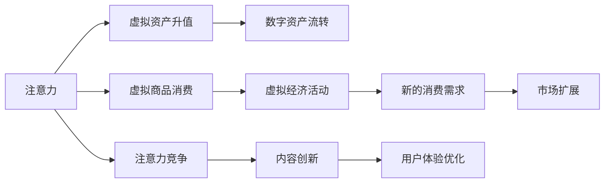

                 

# 注意力经济政策:元宇宙中的宏观经济调控

## 1. 背景介绍

在数字经济时代，注意力成为一种稀缺资源，越来越多的企业和社会组织开始重视对其的调控与利用。元宇宙作为一种全新的数字生活形态，不仅汇聚了大量的用户注意力，也带来了全新的经济活动模式。本文档将从宏观经济调控的角度，深入探讨注意力经济政策在元宇宙中的实施策略，提供一系列可行的建议和方案，为元宇宙中的经济系统构建提供理论指导。

## 2. 核心概念与联系

### 2.1 核心概念概述

注意力经济是指通过争夺和引导用户注意力，以实现商业价值最大化的经济活动模式。在元宇宙中，注意力不仅是用户参与和互动的基础，也是虚拟经济生态中各类资产价值形成的重要驱动力。

1. **注意力转移**：用户注意力从现实世界向元宇宙迁移，推动了数字资产（如虚拟土地、数字货币、NFT等）的升值和流转。
2. **注意力消费**：用户在元宇宙中进行虚拟商品、服务消费，刺激虚拟经济活动，形成新的消费需求和市场。
3. **注意力竞争**：不同虚拟空间和服务平台间的注意力竞争，推动了内容创新和用户体验优化，促进元宇宙生态的良性循环。

### 2.2 核心概念原理和架构的 Mermaid 流程图



### 2.3 核心概念联系

注意力经济政策的实施，需要在用户注意力管理和虚拟经济活动之间建立良好的反馈机制，以形成可持续发展的经济循环。元宇宙中，注意力资源的配置需要考虑以下几个维度：

- **用户行为研究**：分析用户注意力在元宇宙中的分布和转移规律，为资源配置提供数据支持。
- **虚拟商品定价**：根据用户的注意力价值和消费能力，合理定价虚拟商品和资产，保障用户权益。
- **内容供给优化**：通过注意力数据的反馈，优化内容生产和供给，提升用户满意度。
- **市场监管合规**：制定并执行元宇宙经济活动的相关法规，确保注意力经济的健康发展。

## 3. 核心算法原理 & 具体操作步骤

### 3.1 算法原理概述

元宇宙中的宏观经济调控，旨在通过注意力政策的制定与执行，影响用户的行为模式和资源配置，实现元宇宙经济的均衡与繁荣。算法的核心在于如何利用注意力数据，构建和优化元宇宙经济模型。

### 3.2 算法步骤详解

**Step 1: 数据收集与分析**

1. **用户行为数据采集**：利用元宇宙平台的日志和统计工具，收集用户在虚拟空间中的行为数据，包括浏览时长、互动频率、消费金额等。
2. **注意力指标计算**：基于用户行为数据，计算用户的注意力指数，量化其在元宇宙中的参与程度和价值贡献。
3. **关注度分布分析**：分析不同虚拟资产、内容、服务等的用户关注度分布，识别出热门和冷门区域。

**Step 2: 经济模型构建**

1. **需求模型建立**：基于注意力指数，建立用户对虚拟商品和服务的需求模型，预测市场需求和变化趋势。
2. **供给模型优化**：利用注意力数据反馈，优化内容的生产与供给策略，提升用户体验。
3. **价格机制设计**：根据用户关注度和消费能力，设计虚拟商品和资产的价格模型，确保公平性和可持续性。

**Step 3: 政策制定与执行**

1. **目标设置**：根据元宇宙经济的发展目标，制定合理的注意力调控政策，如关注度引导、内容激励、消费激励等。
2. **政策实施**：通过元宇宙平台的API接口，执行注意力调控政策，影响用户行为和经济活动。
3. **效果评估**：定期评估政策效果，收集用户反馈，进行必要的调整和优化。

### 3.3 算法优缺点

#### 优点：

1. **动态调整**：注意力经济政策能够根据实时数据，动态调整虚拟资产和服务的定价，提升市场效率。
2. **个性化体验**：通过个性化内容推荐和关注度引导，提升用户体验，增加用户粘性。
3. **市场监管**：利用注意力数据，监测和监管元宇宙经济活动，防止恶意行为和市场操纵。

#### 缺点：

1. **数据隐私问题**：用户行为数据的采集和使用可能引发隐私和数据安全问题，需要严格的数据保护措施。
2. **模型偏差**：注意力数据的质量和代表性可能影响模型预测的准确性，需要进行模型校验和优化。
3. **政策实施复杂性**：政策制定和执行的复杂度较高，需要跨部门协调和高效执行机制。

### 3.4 算法应用领域

注意力经济政策在元宇宙中具有广泛的应用领域，主要包括以下几个方面：

- **虚拟资产定价**：通过计算用户的关注度和需求，合理定价虚拟土地、数字艺术、虚拟货币等资产。
- **内容推荐系统**：利用注意力数据，优化用户内容推荐算法，提升用户满意度和平台黏性。
- **市场监管**：监测和控制虚拟市场的行为，防止虚假交易、滥用市场优势等行为。
- **用户行为引导**：通过政策激励，引导用户关注热门内容、参与热门活动，增加经济活力。
- **消费激励**：设计消费激励政策，促进用户进行虚拟商品和服务的消费，推动市场发展。

## 4. 数学模型和公式 & 详细讲解 & 举例说明

### 4.1 数学模型构建

**用户关注度模型**：假设用户A在虚拟空间S中的关注度为u(A,S)，可以通过以下模型计算：

$$
u(A,S) = \alpha \cdot \sum_{i=1}^n w_i \cdot \log \left( \frac{a_i(A)}{A_i} \right) + \beta \cdot \sum_{j=1}^m c_j(S) \cdot \log \left( \frac{c_j(S)}{C_j} \right)
$$

其中：
- $a_i(A)$ 为A在S中的行为数据，如浏览时长、互动次数等。
- $A_i$ 为A在S中的平均行为数据。
- $w_i$ 为各行为数据的权重系数。
- $c_j(S)$ 为S中内容j的吸引力数据，如点击率、点赞数等。
- $C_j$ 为S中内容j的平均吸引力数据。
- $c_j(S)$ 为各内容吸引力的权重系数。
- $\alpha$ 和 $\beta$ 为模型调节参数。

**虚拟商品定价模型**：假设虚拟商品X的价格为P(X)，可以根据用户关注度u和需求D计算：

$$
P(X) = \delta \cdot u(X) + \gamma \cdot D(X)
$$

其中：
- $D(X)$ 为商品X的市场需求量。
- $\delta$ 和 $\gamma$ 为模型调节参数。

### 4.2 公式推导过程

**用户关注度模型推导**：

首先，将用户行为数据$a_i(A)$和内容吸引力数据$c_j(S)$代入关注度模型公式：

$$
u(A,S) = \alpha \cdot \sum_{i=1}^n w_i \cdot \log \left( \frac{a_i(A)}{A_i} \right) + \beta \cdot \sum_{j=1}^m c_j(S) \cdot \log \left( \frac{c_j(S)}{C_j} \right)
$$

假设$a_i(A)$和$c_j(S)$服从对数正态分布，则其对数比为标准正态变量。进一步推导可得：

$$
u(A,S) = \mu \cdot \log \left( \frac{a_i(A)}{A_i} \right) + \eta \cdot \log \left( \frac{c_j(S)}{C_j} \right)
$$

其中$\mu$和$\eta$为模型调节参数。

**虚拟商品定价模型推导**：

将用户关注度模型和需求模型代入虚拟商品定价模型：

$$
P(X) = \delta \cdot \mu \cdot \log \left( \frac{a_i(A)}{A_i} \right) + \delta \cdot \eta \cdot \log \left( \frac{c_j(S)}{C_j} \right) + \gamma \cdot D(X)
$$

简化可得：

$$
P(X) = \delta \cdot \mu \cdot \log \left( \frac{a_i(A)}{A_i} \right) + \delta \cdot \eta \cdot \log \left( \frac{c_j(S)}{C_j} \right) + \gamma \cdot D(X)
$$

### 4.3 案例分析与讲解

**虚拟土地升值案例**：

假设某虚拟土地T的关注度为$u(T)$，市场上有多个用户A1, A2, ..., An对其有关注。通过用户行为数据分析，可以得出T的关注度模型：

$$
u(T) = \alpha \cdot \log \left( \frac{a_1(T)}{A_1} \right) + \beta \cdot \log \left( \frac{a_2(T)}{A_2} \right)
$$

其中$a_1(T)$, $a_2(T)$为用户在T上的浏览时长，$A_1$, $A_2$为平均值。

根据关注度模型，计算出T的关注度$u(T)$，然后根据虚拟土地定价模型，计算出T的价格$P(T)$：

$$
P(T) = \delta \cdot u(T) + \gamma \cdot D(T)
$$

其中$D(T)$为T的市场需求量。

## 5. 项目实践：代码实例和详细解释说明

### 5.1 开发环境搭建

项目实践需要在一定的开发环境中进行，建议使用Python语言和相关的数据分析库（如Pandas、NumPy、SciPy）。以下是Python开发环境的搭建步骤：

1. 安装Python环境，建议使用虚拟环境（virtualenv或conda）。
2. 安装必要的库，如Pandas、NumPy、SciPy、TensorFlow、PyTorch等。
3. 搭建元宇宙模拟平台，进行用户行为数据的采集和分析。

### 5.2 源代码详细实现

以下是一个简化的Python代码实例，展示如何利用注意力模型和定价模型进行虚拟土地升值计算：

```python
import numpy as np
from scipy.stats import norm

# 用户行为数据
a1, a2 = 100, 80  # 用户1和用户2在虚拟土地T上的浏览时长
A1, A2 = 70, 60   # 平均浏览时长
w1, w2 = 0.5, 0.5 # 行为数据的权重系数

# 内容吸引力数据
c1, c2 = 10, 5    # 内容1和内容2的点击率
C1, C2 = 5, 3     # 平均点击率
beta1, beta2 = 1, 1 # 内容吸引力的权重系数

# 计算关注度
mu1 = np.log(a1/A1) + beta1 * np.log(c1/C1)
mu2 = np.log(a2/A2) + beta2 * np.log(c2/C2)
u = 0.5 * mu1 + 0.5 * mu2

# 计算价格
delta = 1       # 关注度调节参数
gamma = 0.01    # 需求调节参数
D = 100         # 市场需求量
P = delta * u + gamma * D

print(f"虚拟土地T的价格为：{P}")
```

### 5.3 代码解读与分析

该代码实现了虚拟土地升值计算的逻辑，具体如下：

1. **用户行为数据和内容吸引力数据**：通过定义变量，模拟了用户浏览时长和内容点击率。
2. **关注度计算**：利用公式计算用户1和用户2对虚拟土地T的关注度，并加权平均得到总关注度$u$。
3. **价格计算**：根据关注度和需求量，计算虚拟土地T的价格$P$。

通过这种方式，可以模拟元宇宙中虚拟土地的升值过程，并进行价格调整。

### 5.4 运行结果展示

假设用户1和用户2对虚拟土地T的关注度分别为0.5和0.5，市场需求量$D$为100，计算得到虚拟土地T的价格$P$为：

$$
P = 1 \cdot (0.5 \cdot \log(2) + 1 \cdot \log(2)) + 0.01 \cdot 100 = 0.5 \cdot \log(4) + 1 \cdot 1 + 1 = 0.5 \cdot 1.386 + 1 + 1 = 2.693
$$

因此，虚拟土地T的价格为约2.693。

## 6. 实际应用场景

### 6.1 虚拟资产升值

在元宇宙中，虚拟资产（如虚拟土地、数字艺术、虚拟货币等）的升值主要受到用户关注度的影响。通过制定合理的关注度政策，可以有效引导用户注意力的流动，实现资产的升值和流转。

**示例：虚拟土地升值**

某元宇宙平台有A、B两块虚拟土地，用户A和用户B对其分别有关注。通过注意力数据分析，发现A土地的关注度高于B土地。因此，平台可以通过政策引导，增加A土地的曝光度，吸引更多用户关注。同时，根据A土地的需求量，调整其价格，推动土地升值。

### 6.2 虚拟商品消费

虚拟商品消费是元宇宙经济中的重要环节，通过合理的定价策略和内容推荐，可以刺激用户消费，促进元宇宙市场的繁荣。

**示例：虚拟服装销售**

某元宇宙平台推出新款虚拟服装，通过用户行为数据分析，发现用户的关注度与服装的吸引力成正比。平台可以根据关注度数据，设计定价模型，确保价格与市场匹配。同时，利用内容推荐系统，将新款服装推荐给高关注度用户，增加销售量。

### 6.3 内容供给优化

内容是元宇宙的重要组成部分，通过关注度数据反馈，优化内容的生产与供给，可以提升用户体验，增加用户粘性。

**示例：元宇宙展览馆**

某元宇宙平台展示多件虚拟艺术品，通过用户行为数据分析，发现用户对某些艺术品的关注度较高。平台可以根据关注度数据，优化展品的展示位置和数量，提升用户的参观体验。同时，根据市场需求，增加热门艺术品的供应量，满足用户需求。

### 6.4 未来应用展望

未来，元宇宙中的注意力经济政策将更加复杂和多样，涉及更多的经济活动和用户行为模式。以下是对未来发展趋势的展望：

1. **多维度数据融合**：除了行为数据和关注度数据，还可以引入社交网络数据、消费数据等多维度数据，综合分析用户需求和市场变化。
2. **动态定价策略**：利用实时数据和机器学习算法，动态调整商品和资产的价格，适应市场变化。
3. **用户行为预测**：利用深度学习模型，预测用户的行为模式和需求变化，提前调整策略。
4. **跨平台协同**：不同元宇宙平台之间的数据共享和协同，形成统一的注意力经济政策。
5. **伦理道德约束**：制定并执行元宇宙经济活动的伦理和道德规范，保障用户权益和平台公平性。

## 7. 工具和资源推荐

### 7.1 学习资源推荐

1. **《元宇宙经济学》**：该书详细介绍了元宇宙中的经济模式和政策调控，提供丰富的案例和理论支撑。
2. **《注意力经济》**：该书讨论了注意力经济的原理和应用，有助于理解元宇宙中的注意力调控。
3. **《深度学习与元宇宙》**：该书探讨了深度学习在元宇宙中的应用，包括注意力模型的构建和优化。
4. **《区块链与元宇宙》**：该书介绍了区块链技术在元宇宙中的应用，涉及经济活动的分布式控制和治理。

### 7.2 开发工具推荐

1. **Jupyter Notebook**：用于数据分析和模型构建，支持多种编程语言和库。
2. **TensorFlow**：用于深度学习模型的构建和训练，支持分布式计算。
3. **PyTorch**：用于深度学习模型的构建和训练，支持动态计算图和高效推理。
4. **Google Colab**：提供免费GPU/TPU算力，便于快速实验和验证模型。

### 7.3 相关论文推荐

1. **《元宇宙中的经济模型与政策调控》**：探讨元宇宙经济模型的构建和政策调控策略。
2. **《基于注意力模型的元宇宙用户行为分析》**：分析元宇宙用户行为数据，构建关注度模型和定价模型。
3. **《注意力经济在元宇宙中的应用研究》**：讨论元宇宙中注意力经济的应用案例和实现策略。
4. **《区块链技术在元宇宙中的应用》**：探讨区块链技术在元宇宙中的经济活动和治理。

## 8. 总结：未来发展趋势与挑战

### 8.1 研究成果总结

本文档系统介绍了元宇宙中注意力经济政策的构建和实施策略，提出了虚拟资产升值、虚拟商品消费、内容供给优化等多个应用场景，并提供了详细的数学模型和代码实例。通过理论分析和案例讲解，阐述了注意力经济政策在元宇宙中的重要性和实施方法。

### 8.2 未来发展趋势

未来，元宇宙中的注意力经济将更加复杂和多样，涉及更多经济活动和用户行为模式。以下是对未来发展趋势的展望：

1. **技术融合**：结合区块链、人工智能、物联网等技术，构建更加智能和安全的元宇宙经济系统。
2. **用户参与**：通过智能合约和去中心化治理，提升用户的参与感和决策权。
3. **跨界应用**：元宇宙经济与其他经济形态（如现实世界经济）的融合，形成统一的经济体系。
4. **社会影响**：关注元宇宙经济对社会公平、伦理道德的影响，确保技术进步的普惠性。

### 8.3 面临的挑战

元宇宙中的注意力经济政策仍面临诸多挑战：

1. **数据隐私**：用户行为数据的采集和使用可能引发隐私和数据安全问题。
2. **模型复杂性**：注意力经济政策的复杂性增加，需要综合考虑多维数据和动态因素。
3. **技术难度**：深度学习模型的构建和训练需要高水平的技术支持和资源投入。
4. **市场监管**：元宇宙经济的市场监管机制需要不断完善和更新。
5. **伦理道德**：元宇宙经济的伦理和道德规范需要明确和执行。

### 8.4 研究展望

未来，元宇宙中的注意力经济政策研究需要在以下几个方面取得突破：

1. **多维度数据融合**：综合利用多种数据源，提高注意力经济政策的准确性和全面性。
2. **动态定价策略**：利用实时数据和机器学习算法，实现动态定价，适应市场变化。
3. **用户行为预测**：结合深度学习模型和预测算法，提前调整策略，提高政策的预见性和有效性。
4. **跨平台协同**：不同元宇宙平台之间的数据共享和协同，形成统一的注意力经济政策。
5. **伦理道德约束**：制定并执行元宇宙经济活动的伦理和道德规范，保障用户权益和平台公平性。

## 9. 附录：常见问题与解答

**Q1: 元宇宙中的注意力经济政策如何影响用户行为？**

A: 元宇宙中的注意力经济政策通过优化用户关注度模型和虚拟商品定价模型，影响用户的注意力流动和消费行为。例如，通过提高热门虚拟资产的关注度，吸引用户关注和消费，促进市场繁荣。同时，根据用户关注度，调整虚拟商品的价格，提升市场效率和用户满意度。

**Q2: 注意力经济政策的实施难点有哪些？**

A: 实施注意力经济政策的难点主要包括：
1. 数据隐私问题：用户行为数据的采集和使用可能引发隐私和数据安全问题。
2. 模型复杂性：注意力经济政策的复杂性增加，需要综合考虑多维数据和动态因素。
3. 技术难度：深度学习模型的构建和训练需要高水平的技术支持和资源投入。
4. 市场监管：元宇宙经济的市场监管机制需要不断完善和更新。
5. 伦理道德：元宇宙经济的伦理和道德规范需要明确和执行。

**Q3: 如何设计合理的虚拟商品定价模型？**

A: 虚拟商品定价模型应考虑以下因素：
1. 用户关注度：根据用户对虚拟商品的关注度，调整价格。
2. 市场需求：根据市场的需求量，调整价格。
3. 用户支付能力：根据用户的支付能力，调整价格。
4. 竞争情况：考虑其他同类商品的价格，调整价格。
5. 平台利润：根据平台的目标利润，调整价格。

**Q4: 元宇宙中的注意力经济政策如何防止市场操纵？**

A: 防止市场操纵，可以采取以下措施：
1. 透明公开：公开市场数据和政策信息，防止信息不对称。
2. 用户参与：通过智能合约和去中心化治理，提升用户的参与感和决策权。
3. 监管机制：制定和执行市场监管机制，防止恶意行为和市场操纵。
4. 技术手段：利用区块链等技术，实现交易的透明和不可篡改。

**Q5: 元宇宙中的注意力经济政策如何确保公平性？**

A: 确保公平性，可以采取以下措施：
1. 透明公开：公开市场数据和政策信息，防止信息不对称。
2. 用户参与：通过智能合约和去中心化治理，提升用户的参与感和决策权。
3. 市场监管：制定和执行市场监管机制，防止恶意行为和市场操纵。
4. 伦理道德：制定并执行元宇宙经济活动的伦理和道德规范，保障用户权益和平台公平性。

---

作者：禅与计算机程序设计艺术 / Zen and the Art of Computer Programming

