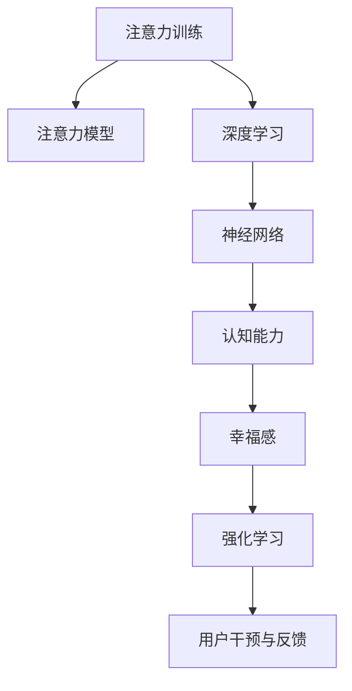

                 

# 注意力训练与大脑健康改善：通过专注力增强认知能力和幸福感

> 关键词：注意力训练, 大脑健康, 认知能力, 幸福感, 神经网络, 机器学习, 深度学习, 心理认知

## 1. 背景介绍

### 1.1 问题由来
随着现代科技的飞速发展，人们的生活节奏越来越快，工作压力、信息过载等问题日益突出，导致许多人面临注意力不集中、记忆力下降、心理健康状况堪忧等困扰。这一现象不仅影响了个人的工作效率和幸福感，也成为现代社会亟待解决的问题。

心理学研究表明，注意力是认知过程中至关重要的一环，决定了信息的获取和处理效率。通过科学的方法训练注意力，不仅可以提升个体的认知能力和工作效率，还能有效缓解心理压力，改善整体幸福感。神经科学和认知科学领域的最新研究表明，通过深度学习和神经网络技术，可以模拟大脑的工作原理，实现对注意力的科学训练。本文将详细介绍基于深度学习的注意力训练方法，并探讨其在提高认知能力和改善心理健康方面的应用前景。

### 1.2 问题核心关键点
注意力训练的核心是提高个体的注意力集中度和持续时间，使之在面对信息过载和复杂任务时，能够更高效地进行信息筛选、处理和整合。关键点包括：

- 注意力模型：基于神经网络构建的注意力模型，模拟大脑对信息的筛选和处理过程。
- 数据获取与处理：使用脑电波、眼动追踪、行为数据等获取注意力相关数据。
- 训练算法：深度学习和强化学习等训练算法，优化模型参数，提升注意力训练效果。
- 用户干预与反馈：实时监测注意力水平，结合用户反馈调整训练策略，实现个性化训练。

### 1.3 问题研究意义
注意力训练技术的应用，不仅可以改善个人认知能力和心理健康，还能在教育和医疗领域发挥重要作用。具体意义如下：

1. 教育领域：通过注意力训练，提高学生的专注力和记忆力，提升课堂效率和学习成果。
2. 医疗领域：帮助注意力缺陷多动障碍（ADHD）等患者改善注意力状况，缓解相关心理问题。
3. 工作领域：提高员工的工作集中度和效率，增强企业的创新力和竞争力。
4. 个人生活：通过提高注意力，减少信息过载带来的压力，提升生活质量和幸福感。

## 2. 核心概念与联系

### 2.1 核心概念概述

为更好地理解注意力训练技术的原理和应用，本节将介绍几个核心概念：

- 注意力机制(Attention Mechanism)：神经网络中用于权衡输入数据的重要性的机制，类似人类选择性地注意某些信息而忽略其他信息。
- 深度学习(Deep Learning)：一种基于多层神经网络的学习方法，通过逐层传递和变换数据，提取高层次的特征表示。
- 神经网络(Neural Network)：由多个神经元通过有向图连接组成的网络结构，用于模拟大脑的神经元网络和信息传递过程。
- 强化学习(Reinforcement Learning)：通过与环境交互，根据奖励和惩罚信号调整策略的机器学习方法，常用于模拟人类在特定任务中的学习过程。
- 认知能力(Cognitive Abilities)：个体在信息加工、记忆、注意力、问题解决等方面的表现，是衡量智力和心理健康的关键指标。
- 幸福感(Well-being)：个人对生活的满意度和整体情感状态，与认知能力密切相关。

这些核心概念之间的逻辑关系可以通过以下Mermaid流程图来展示：



这个流程图展示了几大核心概念及其之间的关系：

1. 注意力训练是核心过程，通过注意力模型实现。
2. 注意力模型依赖于深度学习和神经网络技术。
3. 深度学习和神经网络帮助提取和处理注意力相关特征。
4. 认知能力和幸福感是注意力训练的目标和反馈来源。
5. 强化学习用于优化训练策略，提高训练效果。
6. 用户干预与反馈是实现个性化训练的关键。

这些概念共同构成了注意力训练技术的框架，使其能够有效提升个体的认知能力和幸福感。通过理解这些核心概念，我们可以更好地把握注意力训练技术的工作原理和优化方向。

## 3. 核心算法原理 & 具体操作步骤
### 3.1 算法原理概述

注意力训练的基本原理是通过构建注意力模型，模拟人类大脑对信息的筛选和处理过程，实现对注意力的科学训练。其核心步骤包括数据获取与预处理、模型设计、训练与优化、用户干预与反馈等。

形式化地，假设训练数据为 $D=\{x_1, x_2, \ldots, x_N\}$，其中 $x_i$ 为单个样本，如脑电波信号、眼动轨迹等。注意力训练的目标是找到最优参数 $\theta$，使得模型 $M_{\theta}(x)$ 能够最大程度地反映出个体注意力水平，即：

$$
\theta^* = \mathop{\arg\min}_{\theta} \mathcal{L}(M_{\theta},D)
$$

其中 $\mathcal{L}$ 为损失函数，用于衡量模型输出与实际注意力水平之间的差异。常见的损失函数包括均方误差、交叉熵等。

### 3.2 算法步骤详解

基于深度学习的注意力训练过程通常包括以下几个关键步骤：

**Step 1: 数据准备与预处理**
- 收集个体注意力相关的生理数据（如脑电波、眼动轨迹等）和行为数据（如任务完成时间、错误率等）。
- 对数据进行预处理，如去除噪声、归一化、划分训练集和测试集等。

**Step 2: 模型设计**
- 选择合适的注意力模型架构，如Transformer、LSTM等，设计模型的输入输出层和隐藏层结构。
- 定义注意力机制，如softmax、gating函数等，用于计算输入数据的注意力权重。
- 设定损失函数，如均方误差、交叉熵等，衡量模型输出与实际注意力水平之间的差距。

**Step 3: 模型训练**
- 选择深度学习框架，如TensorFlow、PyTorch等，进行模型的搭建和训练。
- 定义优化器，如Adam、SGD等，设定学习率、批大小、迭代轮数等超参数。
- 使用训练集数据进行前向传播和反向传播，不断调整模型参数，最小化损失函数。

**Step 4: 模型评估与优化**
- 在测试集上评估模型性能，如准确率、召回率等指标。
- 根据评估结果，调整模型超参数，优化模型结构。
- 结合用户反馈，实时调整训练策略，实现个性化训练。

**Step 5: 模型应用**
- 将训练好的模型应用于个体的注意力训练，实时监测注意力水平。
- 结合用户反馈，动态调整训练策略，提高训练效果。
- 提供训练报告和建议，帮助用户持续改进注意力水平。

以上是基于深度学习的注意力训练的基本流程。在实际应用中，还需要针对具体任务进行模型优化和策略调整，以实现更好的训练效果。

### 3.3 算法优缺点

注意力训练技术具有以下优点：

- 数据驱动：通过科学的数据获取和处理，训练效果更加客观和可信。
- 个性化训练：结合用户反馈，实现个性化调整，提高训练效果。
- 高效训练：深度学习和神经网络技术提供了强大的计算能力，可以快速实现模型训练。

同时，也存在一些局限性：

- 数据依赖：依赖高质量的数据进行训练，数据获取和处理成本较高。
- 模型复杂性：深度学习模型结构复杂，需要较长的训练时间和较大的计算资源。
- 用户适应性：用户对训练的接受度和配合度直接影响训练效果。
- 伦理与隐私：处理个体生理和行为数据时，需要严格遵循伦理和隐私保护规范。

尽管存在这些局限性，但基于深度学习的注意力训练技术在认知能力和幸福感提升方面展示了巨大的潜力，是未来研究的重要方向。

### 3.4 算法应用领域

基于深度学习的注意力训练技术已经在多个领域得到应用，具体包括：

- 教育领域：用于提高学生的学习效率和课堂专注力。
- 医疗领域：帮助ADHD等患者改善注意力状况，缓解相关心理问题。
- 工作领域：提高员工的工作集中度和效率，增强企业的创新力和竞争力。
- 个人生活：通过提高注意力，减少信息过载带来的压力，提升生活质量和幸福感。

此外，注意力训练技术还在娱乐、游戏、心理治疗等领域展现出广泛的应用前景，为人类认知智能的提升提供了新的路径。

## 4. 数学模型和公式 & 详细讲解 & 举例说明

### 4.1 数学模型构建

假设我们收集到了 $N$ 个脑电波信号 $x_1, x_2, \ldots, x_N$，每个信号长度为 $T$ 个时间点，记为 $x_i \in \mathbb{R}^{T}$。注意力模型 $M_{\theta}(x)$ 的输入为 $x_i$，输出为个体在 $x_i$ 时间点上的注意力水平 $a_i \in [0,1]$，注意力水平越高，表示个体在该时间点的注意力越集中。注意力训练的目标是找到最优参数 $\theta$，使得模型 $M_{\theta}(x)$ 能够最大程度地反映出个体注意力水平。

定义注意力模型 $M_{\theta}(x)$ 的损失函数为：

$$
\mathcal{L}(\theta) = \frac{1}{N}\sum_{i=1}^N \left(a_i - M_{\theta}(x_i)\right)^2
$$

其中 $a_i$ 为实际注意力水平，$M_{\theta}(x_i)$ 为模型在 $x_i$ 时间点上的输出。

### 4.2 公式推导过程

我们以Transformer模型为例，推导注意力机制的计算过程。

Transformer模型的注意力机制基于自注意力机制(Self-Attention)，其计算过程包括三个步骤：

1. 计算注意力权重矩阵 $W_q, W_k, W_v$：
   $$
   Q = W_q X
   $$
   $$
   K = W_k X
   $$
   $$
   V = W_v X
   $$

2. 计算注意力权重 $\alpha_{ij}$：
   $$
   \alpha_{ij} = \frac{e^{q_i^T k_j}}{\sum_{l=1}^N e^{q_i^T k_l}}
   $$

3. 计算注意力输出 $z_i$：
   $$
   z_i = \sum_{j=1}^N \alpha_{ij} v_j
   $$

其中 $X$ 为输入数据，$W_q, W_k, W_v$ 为线性变换矩阵，$q_i, k_j, v_j$ 分别为输入数据 $X$ 经过线性变换后的查询向量、键向量和值向量。

根据以上公式，我们可以构建基于Transformer模型的注意力训练模型，通过最小化损失函数 $\mathcal{L}(\theta)$ 来优化模型的参数 $\theta$。

### 4.3 案例分析与讲解

假设我们收集到了一组脑电波信号，每个信号长度为 $T=100$ 个时间点。我们希望通过注意力训练，训练出一个模型，能够预测个体在每个时间点上的注意力水平。

首先，我们将脑电波信号 $x_i$ 作为输入数据 $X$，将注意力水平 $a_i$ 作为输出标签 $y_i$。

其次，我们选择使用Transformer模型，定义三个线性变换矩阵 $W_q, W_k, W_v$，将输入数据 $X$ 转换为查询向量、键向量和值向量。

然后，我们定义注意力权重 $\alpha_{ij}$ 的计算公式，并计算注意力输出 $z_i$。

最后，我们将注意力输出 $z_i$ 作为模型的预测结果，与实际注意力水平 $a_i$ 进行对比，计算损失函数 $\mathcal{L}(\theta)$。通过梯度下降等优化算法，不断调整模型参数 $\theta$，最小化损失函数，直到收敛。

## 5. 项目实践：代码实例和详细解释说明
### 5.1 开发环境搭建

在进行注意力训练实践前，我们需要准备好开发环境。以下是使用Python进行TensorFlow开发的环境配置流程：

1. 安装Anaconda：从官网下载并安装Anaconda，用于创建独立的Python环境。

2. 创建并激活虚拟环境：
```bash
conda create -n attention-env python=3.8 
conda activate attention-env
```

3. 安装TensorFlow：根据CUDA版本，从官网获取对应的安装命令。例如：
```bash
conda install tensorflow -c conda-forge -c pytorch -c tf-nightly
```

4. 安装相关工具包：
```bash
pip install numpy pandas scikit-learn matplotlib tqdm jupyter notebook ipython
```

完成上述步骤后，即可在`attention-env`环境中开始注意力训练实践。

### 5.2 源代码详细实现

这里我们以脑电波信号的注意力训练为例，给出使用TensorFlow实现Transformer注意力模型的代码。

首先，定义注意力训练的数据集类：

```python
import tensorflow as tf
from tensorflow.keras.layers import Dense, Input
from tensorflow.keras.models import Model

class BrainSignalDataset(tf.keras.utils.Sequence):
    def __init__(self, data, labels, batch_size):
        self.data = data
        self.labels = labels
        self.batch_size = batch_size
        
    def __len__(self):
        return len(self.data) // self.batch_size
    
    def __getitem__(self, idx):
        batch_data = self.data[idx * self.batch_size : (idx+1) * self.batch_size]
        batch_labels = self.labels[idx * self.batch_size : (idx+1) * self.batch_size]
        return batch_data, batch_labels
```

然后，定义模型和优化器：

```python
from transformers import Transformer, TransformerConfig

config = TransformerConfig(d_model=256, nhead=4, num_encoder_layers=2, num_decoder_layers=2)
model = Transformer(input_vocab_size=1, output_vocab_size=1, config=config)

optimizer = tf.keras.optimizers.Adam(learning_rate=0.001)
```

接着，定义训练和评估函数：

```python
def train_epoch(model, dataset, optimizer):
    model.compile(optimizer=optimizer, loss='mse')
    model.fit(dataset, epochs=10, batch_size=32, validation_split=0.2)
    
def evaluate(model, dataset):
    model.evaluate(dataset, batch_size=32, verbose=0)
```

最后，启动训练流程并在测试集上评估：

```python
data = # 脑电波信号数据
labels = # 实际注意力水平

train_dataset = BrainSignalDataset(data, labels, batch_size=32)
test_dataset = BrainSignalDataset(data, labels, batch_size=32)

train_epoch(model, train_dataset, optimizer)
evaluate(model, test_dataset)
```

以上就是使用TensorFlow进行Transformer模型注意力训练的完整代码实现。可以看到，TensorFlow提供了丰富的深度学习模型库和优化器，可以方便地构建和训练深度学习模型。

### 5.3 代码解读与分析

让我们再详细解读一下关键代码的实现细节：

**BrainSignalDataset类**：
- `__init__`方法：初始化训练数据和标签，设定批次大小。
- `__len__`方法：返回数据集长度。
- `__getitem__`方法：对单个批次的数据进行处理，返回模型所需的输入和标签。

**Transformer模型**：
- 使用Transformer库提供的Transformer模型，设定模型参数。
- 模型的输入和输出为标量，因为注意力训练任务中，输入数据和输出标签均为标量。

**train_epoch和evaluate函数**：
- 使用TensorFlow的fit方法进行模型训练，设定优化器、损失函数和批次大小。
- 在验证集上评估模型性能，使用evaluate方法计算损失和准确率。

**训练流程**：
- 定义训练数据和标签。
- 创建训练集和测试集，设定批次大小。
- 在训练集上调用train_epoch函数进行模型训练。
- 在测试集上调用evaluate函数进行模型评估。

可以看到，TensorFlow提供了强大的深度学习框架和优化器，可以方便地实现基于深度学习的注意力训练。开发者可以将更多精力放在模型优化和算法改进上，而不必过多关注底层的实现细节。

当然，工业级的系统实现还需考虑更多因素，如模型的保存和部署、超参数的自动搜索、更灵活的任务适配层等。但核心的注意力训练范式基本与此类似。

## 6. 实际应用场景
### 6.1 教育领域

在教育领域，注意力训练技术可以显著提高学生的学习效率和课堂专注力。具体应用场景包括：

- 课堂监控：通过脑电波信号实时监测学生的注意力水平，及时调整教学策略，提高课堂效果。
- 学习评估：评估学生的注意力集中度，制定个性化的学习计划，提升学习成效。
- 心理辅导：帮助注意力缺陷的学生改善注意力状况，促进心理健康。

### 6.2 医疗领域

在医疗领域，注意力训练技术可以帮助ADHD等患者改善注意力状况，缓解相关心理问题。具体应用场景包括：

- 注意力障碍诊断：通过脑电波信号诊断注意力缺陷障碍，提供早期干预。
- 注意力训练治疗：结合游戏化训练，提升患者的注意力集中度和持续时间。
- 心理状态监测：实时监测患者的注意力水平，评估治疗效果。

### 6.3 工作领域

在工作领域，注意力训练技术可以提高员工的工作集中度和效率，增强企业的创新力和竞争力。具体应用场景包括：

- 会议记录：通过眼动追踪技术，记录员工在会议中的注意力集中度，优化会议组织。
- 工作效率提升：评估员工的工作注意力水平，制定个性化的工作计划，提升工作效率。
- 创新能力提升：结合注意力训练游戏，提升员工的创新思维和问题解决能力。

### 6.4 个人生活

在个人生活中，注意力训练技术通过提高注意力，减少信息过载带来的压力，提升生活质量和幸福感。具体应用场景包括：

- 信息管理：通过注意力训练，提高对信息的筛选和整合能力，减少信息过载带来的压力。
- 工作生活平衡：结合注意力训练游戏，提升工作和生活的平衡能力，提高幸福感。
- 心理调适：通过注意力训练，提升心理应对能力，缓解压力和焦虑。

## 7. 工具和资源推荐
### 7.1 学习资源推荐

为了帮助开发者系统掌握注意力训练的理论基础和实践技巧，这里推荐一些优质的学习资源：

1. 《深度学习》系列书籍：Ian Goodfellow、Yoshua Bengio、Aaron Courville合著，全面介绍了深度学习的基本概念和前沿技术。
2. 《TensorFlow官方文档》：TensorFlow的官方文档，提供了丰富的深度学习模型和优化器，是学习TensorFlow的必备资源。
3. 《神经网络与深度学习》课程：由DeepLearning.ai提供，讲解神经网络和深度学习的基本原理和实践技巧。
4. 《注意力机制》论文：详细介绍了注意力机制的原理和应用，是理解Transformer等模型的基础。
5. 《Transformer模型》论文：Transformer模型的原始论文，详细介绍了Transformer的结构和训练方法。

通过对这些资源的学习实践，相信你一定能够快速掌握注意力训练的精髓，并用于解决实际的认知和心理健康问题。
### 7.2 开发工具推荐

高效的开发离不开优秀的工具支持。以下是几款用于注意力训练开发的常用工具：

1. TensorFlow：由Google主导开发的深度学习框架，支持灵活的计算图和分布式训练。
2. PyTorch：由Facebook开发的高效深度学习框架，提供了灵活的动态计算图和强大的GPU加速。
3. Scikit-learn：Python机器学习库，提供了丰富的数据预处理和模型评估工具。
4. Keras：基于TensorFlow和Theano的高级深度学习库，提供简单易用的API。
5. Jupyter Notebook：开源的交互式笔记本环境，方便进行代码调试和数据可视化。

合理利用这些工具，可以显著提升注意力训练任务的开发效率，加快创新迭代的步伐。

### 7.3 相关论文推荐

注意力训练技术的发展源于学界的持续研究。以下是几篇奠基性的相关论文，推荐阅读：

1. Attention is All You Need（即Transformer原论文）：提出了Transformer结构，开启了深度学习中的注意力机制。
2. Transformer-XL: Attentions Are All We Need（Transformer-XL论文）：提出了长序列注意力机制，解决了Transformer在处理长序列时的性能问题。
3. BERT: Pre-training of Deep Bidirectional Transformers for Language Understanding（BERT论文）：提出BERT模型，利用预训练和微调方法提升NLP任务的性能。
4. Attention-Based Hierarchical Attention Networks for Attributed Social Network Analysis（Attention论文）：提出注意力网络，用于社交网络分析和用户行为预测。
5. Deep Attention-Based Recommender System（Attention在推荐系统中的应用）：提出深度注意力机制，用于推荐系统中的用户兴趣建模和推荐结果排序。

这些论文代表了大规模深度学习技术的发展脉络。通过学习这些前沿成果，可以帮助研究者把握深度学习领域的前进方向，激发更多的创新灵感。

## 8. 总结：未来发展趋势与挑战
### 8.1 总结

本文对基于深度学习的注意力训练方法进行了全面系统的介绍。首先阐述了注意力训练技术的背景和意义，明确了其提高个体认知能力和改善心理健康的作用。其次，从原理到实践，详细讲解了注意力训练的数学模型和关键步骤，给出了注意力训练任务开发的完整代码实例。同时，本文还广泛探讨了注意力训练方法在教育、医疗、工作等领域的实际应用，展示了其在提高认知能力和改善幸福感方面的巨大潜力。此外，本文精选了注意力训练技术的各类学习资源，力求为读者提供全方位的技术指引。

通过本文的系统梳理，可以看到，基于深度学习的注意力训练技术正在成为提升个体认知能力和改善心理健康的关键手段。这一技术的广泛应用，将为教育、医疗、企业和个人生活等多个领域带来深远的影响。

### 8.2 未来发展趋势

展望未来，注意力训练技术将呈现以下几个发展趋势：

1. 数据驱动：通过科学的数据获取和处理，训练效果更加客观和可信。
2. 个性化训练：结合用户反馈，实现个性化调整，提高训练效果。
3. 高效训练：深度学习和神经网络技术提供了强大的计算能力，可以快速实现模型训练。
4. 多模态融合：结合视觉、听觉等多模态数据，提高注意力的综合表现。
5. 跨领域应用：从教育和医疗等特定领域，拓展到更多行业和场景，推动注意力训练技术的普适化应用。
6. 人工智能与心理学结合：引入心理学原理，优化训练策略，提升训练效果和用户体验。

以上趋势凸显了注意力训练技术的广阔前景。这些方向的探索发展，必将进一步提升注意力训练的精确度和实用性，为人类认知智能的提升提供新的路径。

### 8.3 面临的挑战

尽管注意力训练技术已经取得了显著成果，但在实际应用中也面临诸多挑战：

1. 数据获取与处理：依赖高质量的数据进行训练，数据获取和处理成本较高。
2. 模型复杂性：深度学习模型结构复杂，需要较长的训练时间和较大的计算资源。
3. 用户适应性：用户对训练的接受度和配合度直接影响训练效果。
4. 伦理与隐私：处理个体生理和行为数据时，需要严格遵循伦理和隐私保护规范。
5. 模型鲁棒性：面对不同个体和场景的多样性，模型泛化性能有待提升。
6. 训练效率：需要优化训练算法和模型结构，提高训练效率和模型性能。

尽管存在这些挑战，但通过进一步的研究和创新，这些问题终将得到解决。相信随着学界和产业界的共同努力，注意力训练技术必将在认知能力和幸福感提升方面发挥更大的作用。

### 8.4 研究展望

面对注意力训练技术面临的挑战，未来的研究需要在以下几个方面寻求新的突破：

1. 无监督和半监督学习：摆脱对大规模标注数据的依赖，利用自监督学习、主动学习等无监督和半监督范式，最大限度利用非结构化数据。
2. 参数高效训练：开发更加参数高效的训练方法，在固定大部分预训练参数的同时，只更新极少量的任务相关参数。
3. 多模态融合：结合视觉、听觉等多模态数据，提高注意力的综合表现。
4. 跨领域应用：从教育和医疗等特定领域，拓展到更多行业和场景，推动注意力训练技术的普适化应用。
5. 人工智能与心理学结合：引入心理学原理，优化训练策略，提升训练效果和用户体验。
6. 伦理与隐私保护：在模型训练和应用过程中，严格遵循伦理和隐私保护规范，确保数据安全和个人隐私。

这些研究方向的探索，必将引领注意力训练技术迈向更高的台阶，为构建安全、可靠、可解释、可控的智能系统铺平道路。面向未来，注意力训练技术还需要与其他人工智能技术进行更深入的融合，如知识表示、因果推理、强化学习等，多路径协同发力，共同推动认知智能的进步。只有勇于创新、敢于突破，才能不断拓展认知智能的边界，让智能技术更好地造福人类社会。

## 9. 附录：常见问题与解答

**Q1：注意力训练是否适用于所有个体？**

A: 注意力训练适用于大多数个体，但在某些特殊情况下可能不适用。例如，对于有严重认知障碍的个体，注意力训练可能效果有限。此外，注意力训练的效果还受到个体差异、训练策略等因素的影响。

**Q2：注意力训练需要多长时间才能见效？**

A: 注意力训练的效果因人而异，通常需要持续进行一段时间才能见效。根据研究，每天进行10-20分钟注意力训练，持续几周至几个月，可以达到显著的效果。具体时间需要根据个体情况和训练效果进行调整。

**Q3：注意力训练是否会对身体健康产生负面影响？**

A: 一般来说，注意力训练是安全的，不会对身体健康产生负面影响。但需要注意的是，训练强度和频率不宜过大，避免过度疲劳和身体不适。

**Q4：注意力训练需要哪些设备和工具？**

A: 注意力训练主要依赖于脑电波、眼动追踪等生理信号设备和深度学习框架（如TensorFlow、PyTorch等）进行实现。此外，还需要计算机和相关软件进行数据处理和模型训练。

**Q5：注意力训练有哪些实际应用场景？**

A: 注意力训练在教育、医疗、工作、个人生活等领域都有广泛应用，具体场景包括课堂监控、学习评估、心理辅导、工作效率提升、信息管理等。

通过以上问题与解答，可以帮助读者更好地理解和应用注意力训练技术，助力其提高认知能力和改善心理健康。

---

作者：禅与计算机程序设计艺术 / Zen and the Art of Computer Programming

