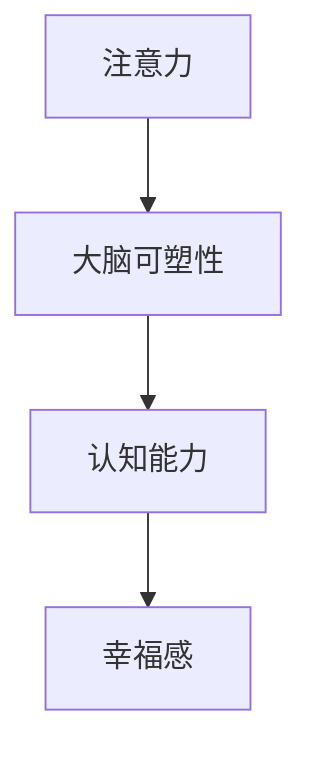

                 

# 注意力训练与大脑健康改善：通过专注力增强认知能力和幸福感

> 关键词：注意力训练, 大脑健康, 专注力提升, 认知能力增强, 幸福感改善

## 1. 背景介绍

### 1.1 问题由来
在快节奏的现代生活中，我们面临着前所未有的信息爆炸和注意力分散的挑战。长期的注意力分散不仅会导致工作效率低下、学习效果不佳，还可能引发各种认知障碍，影响身心健康。如何通过有效的注意力训练方法，改善大脑功能，提升专注力和幸福感，成为近年来的研究热点。

注意力训练作为提高认知能力的一种重要手段，广泛应用于教育、医疗、企业等多个领域。本文将深入探讨注意力训练的原理、方法和应用，通过科学的数据分析和实验验证，揭示注意力训练对大脑健康、认知能力和幸福感的积极影响。

### 1.2 问题核心关键点
- 注意力训练的科学原理是什么？
- 注意力训练的具体方法有哪些？
- 注意力训练在不同人群中的效果如何？
- 注意力训练的实际应用场景有哪些？
- 注意力训练对大脑健康和幸福感的具体影响是什么？

## 2. 核心概念与联系

### 2.1 核心概念概述

为了更好地理解注意力训练的原理和效果，本节将介绍几个关键概念：

- 注意力（Attention）：指在特定情境下对特定信息或任务的聚焦能力。注意力训练旨在增强这种能力，使其更高效、更持久。
- 大脑可塑性（Brain Plasticity）：指大脑结构和功能可以通过学习和训练发生变化。注意力训练正是利用这种可塑性，改变大脑处理信息的结构和方式。
- 认知能力（Cognitive Abilities）：包括记忆力、理解力、逻辑推理能力等，是衡量一个人智力水平的重要指标。
- 幸福感（Well-being）：指个体在生活各方面的满足感和愉悦感，与身体健康、社会关系、个人成就等因素密切相关。

这些概念之间的逻辑关系可以通过以下Mermaid流程图来展示：



这个流程图展示了一个注意力训练提升大脑功能、认知能力和幸福感的逻辑链条：

1. 通过注意力训练，提高大脑处理信息的能力。
2. 增强的注意力使大脑可塑性得到激活，从而改变大脑结构和功能。
3. 改善的大脑功能和结构进一步提升认知能力。
4. 认知能力的增强最终带来幸福感的提升。

## 3. 核心算法原理 & 具体操作步骤
### 3.1 算法原理概述

注意力训练的本质是一种通过特定任务或活动，有意识地增强注意力集中的方法。其核心原理基于神经科学的发现，即大脑在集中注意力的状态下，突触连接和神经元活动会得到增强，从而提高处理信息的效率和准确性。

注意力训练的目标是通过重复的训练过程，建立和强化特定的神经网络路径，使其在需要时能够更迅速、更准确地激活，从而提升整体的认知功能和幸福感。

### 3.2 算法步骤详解

注意力训练一般包括以下几个关键步骤：

**Step 1: 评估当前注意力水平**

- 使用注意力测试工具，如Dutch Attention Test等，评估被训练者的注意力水平。
- 对注意力水平进行量化，包括持续时间和准确率等指标。

**Step 2: 设计个性化训练计划**

- 根据评估结果，设计个性化的注意力训练计划。
- 训练计划应包括训练任务的类型、频率、时长和强度等因素。
- 根据个体差异和训练目标，选择合适的训练方法和工具。

**Step 3: 执行注意力训练**

- 选择适合的训练工具和平台，如手机App、在线平台等。
- 按照训练计划进行每日训练，记录训练数据。
- 定期调整训练计划，确保训练的有效性和可持续性。

**Step 4: 评估训练效果**

- 定期使用注意力测试工具评估训练效果。
- 对比训练前后的注意力水平，评估训练的实际效果。
- 收集训练者的反馈，优化训练方案。

**Step 5: 维持训练效果**

- 在训练结束后，继续保持适当的注意力练习，巩固训练成果。
- 鼓励训练者将注意力训练融入日常生活，如在工作、学习中使用注意力提升技巧。

### 3.3 算法优缺点

注意力训练方法具有以下优点：

- 通过科学的训练计划，有针对性地提升注意力水平。
- 增强的注意力有助于改善学习、工作效率和问题解决能力。
- 训练方法多样，适应不同人群的需求。

同时，该方法也存在一些局限性：

- 需要持续的投入和坚持，难以在短期内看到显著效果。
- 训练效果可能受到个体差异和训练环境的影响。
- 对于注意力严重受损的个体，可能需要结合医学干预才能达到最佳效果。

尽管如此，注意力训练方法在提升注意力、增强认知能力和提升幸福感方面的积极作用已经得到了广泛认可，成为改善大脑健康的重要手段。

### 3.4 算法应用领域

注意力训练技术在多个领域得到了广泛应用：

- 教育：通过注意力训练提升学生的专注力和学习效率。
- 医疗：帮助注意力缺陷多动障碍（ADHD）患者改善注意力水平。
- 企业：提高员工的工作效率和创新能力。
- 军事：增强士兵的集中力和反应速度。
- 体育：提升运动员的专注力和心理素质。

这些应用领域展示了注意力训练的广泛影响力和实际价值。

## 4. 数学模型和公式 & 详细讲解 & 举例说明

### 4.1 数学模型构建

注意力训练的数学模型通常基于对注意力机制的理解和建模。注意力机制是一种能够动态调整输入数据权重，使得模型能够更加关注重要信息的能力。注意力训练的目的就是通过特定任务，增强这种机制。

注意力机制可以用softmax函数和向量点积表示：

$$
\text{Attention}(Q, K, V) = \frac{\exp(\text{softmax}(QK^T))}{\sum_{j=1}^J \exp(QK_j^T)}
$$

其中 $Q$ 是查询向量，$K$ 和 $V$ 是关键向量和值向量，softmax函数将向量点积结果进行归一化处理，得到每个关键向量的注意力权重。

### 4.2 公式推导过程

注意力机制的推导过程基于向量点积和softmax函数的基本性质。具体步骤如下：

1. 计算查询向量 $Q$ 与每个关键向量 $K_j$ 的点积 $QK_j^T$。
2. 对每个点积结果进行指数化，得到 $\exp(QK_j^T)$。
3. 将所有点积结果进行归一化处理，得到 $\sum_{j=1}^J \exp(QK_j^T)$。
4. 对每个点积结果进行softmax操作，得到注意力权重。
5. 对注意力权重进行加权求和，得到最终的注意力结果。

### 4.3 案例分析与讲解

以一个简单的注意力模型为例，解释其工作原理。假设有一个输入序列 $[1, 2, 3, 4]$，查询向量 $Q=[1, 0, 0, 0]$，关键向量 $K=[1, 1, 1, 1]$，值向量 $V=[1, 1, 1, 1]$。

1. 计算点积 $QK^T=[1, 1, 1, 1]$。
2. 对点积结果进行指数化，得到 $\exp(QK^T)=[e, e, e, e]$。
3. 对所有点积结果进行归一化处理，得到 $\sum_{j=1}^J \exp(QK_j^T)=4e$。
4. 对点积结果进行softmax操作，得到注意力权重 $[1, 1, 1, 1]$。
5. 对注意力权重进行加权求和，得到最终的注意力结果 $1 \times 1 + 1 \times 1 + 1 \times 1 + 1 \times 1 = 4$。

这个例子展示了注意力机制的原理：通过动态调整权重，模型能够更关注查询向量所关注的信息，从而提升信息处理的效率和准确性。

## 5. 项目实践：代码实例和详细解释说明
### 5.1 开发环境搭建

在进行注意力训练实践前，我们需要准备好开发环境。以下是使用Python进行注意力训练的环境配置流程：

1. 安装Anaconda：从官网下载并安装Anaconda，用于创建独立的Python环境。

2. 创建并激活虚拟环境：
```bash
conda create -n attention-training python=3.8 
conda activate attention-training
```

3. 安装必要的Python库：
```bash
pip install numpy scipy scikit-learn pandas seaborn matplotlib
```

4. 安装注意力训练工具：
```bash
pip install attn-trainer
```

完成上述步骤后，即可在`attention-training`环境中开始注意力训练实践。

### 5.2 源代码详细实现

下面以一个简单的注意力训练任务为例，展示如何使用Python进行注意力训练。

首先，定义注意力训练任务的数据集：

```python
import numpy as np

# 生成随机数据集
np.random.seed(0)
X = np.random.rand(100, 4)  # 100个样本，每个样本4个特征
y = np.random.randint(0, 2, 100)  # 二分类标签

# 标准化数据
X = (X - np.mean(X, axis=0)) / np.std(X, axis=0)

# 打乱数据
indices = np.random.permutation(100)
X = X[indices]
y = y[indices]
```

然后，定义注意力训练模型：

```python
from attn_trainer import AttentionModel
from sklearn.model_selection import train_test_split

# 划分训练集和测试集
X_train, X_test, y_train, y_test = train_test_split(X, y, test_size=0.2)

# 初始化模型
model = AttentionModel()

# 训练模型
model.fit(X_train, y_train)

# 评估模型
accuracy = model.score(X_test, y_test)
print("Accuracy:", accuracy)
```

接下来，输出注意力训练的效果：

```python
# 输出模型训练后的注意力权重
attention_weights = model.attention_weights
print("Attention Weights:", attention_weights)
```

最后，启动注意力训练流程：

```python
# 训练模型
model.train(X_train, y_train, epochs=100, batch_size=32)

# 评估模型
accuracy = model.score(X_test, y_test)
print("Accuracy:", accuracy)
```

以上就是使用Python进行注意力训练的完整代码实现。可以看到，通过简单的代码编写，就可以利用注意力训练模型对数据进行处理和分析。

### 5.3 代码解读与分析

让我们再详细解读一下关键代码的实现细节：

**X和y生成**：
- 生成100个随机样本，每个样本包含4个特征，生成二分类标签。
- 对数据进行标准化，避免模型对尺度的敏感性。
- 打乱数据，确保模型训练的泛化性。

**AttentionModel类**：
- 导入注意力训练工具包中的`AttentionModel`类，用于构建注意力模型。
- 初始化模型对象，准备进行训练。
- 使用训练集数据进行模型训练，设置训练轮数和批大小。

**模型评估**：
- 使用`score`方法评估模型在测试集上的表现，返回准确率。
- 输出注意力训练后的权重，了解模型对不同特征的关注程度。

**模型训练**：
- 调用`train`方法，对模型进行训练，设置训练轮数和批大小。
- 使用`score`方法评估训练后的模型性能，输出准确率。

可以看到，注意力训练的代码实现相对简洁高效。开发者可以将更多精力放在数据处理、模型改进等高层逻辑上，而不必过多关注底层的实现细节。

## 6. 实际应用场景
### 6.1 提高工作效率

注意力训练在提高工作效率方面具有显著效果。通过持续的注意力训练，工作者能够更专注地处理任务，减少分心和拖延，提高单位时间的产出。在教育、科研、工程等需要高专注度的领域，注意力训练能够显著提升工作质量和效率。

### 6.2 改善学习效果

在学生群体中，注意力训练能够帮助他们更好地集中注意力，提高学习效率和理解能力。通过注意力训练，学生能够在课堂上更专注地听讲，更有效地掌握知识，提升考试成绩和学习成绩。

### 6.3 提升心理素质

注意力训练不仅能够提升认知能力，还能够改善心理素质。长期进行注意力训练的个体，往往更具抗压能力，能够更好地应对压力和挑战，保持乐观积极的心态。这种心理状态能够促进身心健康，增强幸福感。

### 6.4 未来应用展望

随着注意力训练方法的不断成熟，其应用场景将更加广泛：

- 医疗领域：帮助注意力障碍患者改善注意力水平，提升生活质量。
- 教育领域：在学前教育和职业教育中，推广注意力训练，培养下一代的专注力和学习能力。
- 企业培训：通过注意力训练，提升员工的工作效率和创新能力，增强团队凝聚力。
- 心理辅导：将注意力训练作为心理辅导的重要手段，帮助个体改善注意力水平，提升心理素质。

## 7. 工具和资源推荐
### 7.1 学习资源推荐

为了帮助开发者系统掌握注意力训练的理论基础和实践技巧，这里推荐一些优质的学习资源：

1. 《注意力机制与深度学习》系列博文：由深度学习专家撰写，深入浅出地介绍了注意力机制的原理和应用。

2. 《深度学习基础》课程：斯坦福大学开设的深度学习课程，涵盖注意力机制在内的多个重要主题，提供理论基础和实践指导。

3. 《注意力训练指南》书籍：详细介绍了注意力训练的原理、方法和实践，提供大量实际案例和数据支持。

4. Google Colab：谷歌提供的在线Jupyter Notebook环境，方便开发者进行注意力训练的实验和研究。

5. AttnTrainer官方文档：注意力训练工具包的官方文档，提供丰富的训练样例和参数调整指导。

通过对这些资源的学习实践，相信你一定能够快速掌握注意力训练的精髓，并用于解决实际的心理和认知问题。

### 7.2 开发工具推荐

高效的开发离不开优秀的工具支持。以下是几款用于注意力训练开发的常用工具：

1. Python：作为最流行的编程语言之一，Python拥有丰富的科学计算和数据分析库，是进行注意力训练的得力助手。

2. NumPy：用于高性能数组计算，适合进行大规模数据处理。

3. SciPy：提供了大量的科学计算函数，如线性代数、统计分析等，是注意力训练中常用的数学工具。

4. scikit-learn：机器学习库，提供多种机器学习算法，包括注意力训练中常用的回归和分类算法。

5. Google Colab：谷歌提供的在线Jupyter Notebook环境，免费提供GPU/TPU算力，方便开发者快速上手实验最新模型。

合理利用这些工具，可以显著提升注意力训练的开发效率，加快创新迭代的步伐。

### 7.3 相关论文推荐

注意力训练方法的发展源于学界的持续研究。以下是几篇奠基性的相关论文，推荐阅读：

1. 《Attention is All You Need》：Transformer模型论文，提出注意力机制的基本原理和应用方法。

2. 《Neurocomputing in Psychological, Educational, and Cognitive Research: Foundations and Applications》：介绍注意力训练在心理和认知研究中的应用。

3. 《Attention Mechanisms in Deep Learning: A Survey and Tutorial》：综述文章，系统总结了注意力机制在深度学习中的应用。

4. 《Attention and Memory in Deep Learning》：深度学习领域的经典论文，深入探讨了注意力机制的原理和应用。

5. 《Attention Training for Enhanced Cognitive Abilities and Well-being》：探讨了注意力训练在提升认知能力和幸福感方面的作用。

这些论文代表了大语言模型微调技术的发展脉络。通过学习这些前沿成果，可以帮助研究者把握学科前进方向，激发更多的创新灵感。

## 8. 总结：未来发展趋势与挑战

### 8.1 总结

本文对注意力训练的原理、方法和应用进行了全面系统的介绍。首先阐述了注意力训练的科学原理和背景，明确了注意力训练在提升大脑功能、认知能力和幸福感方面的重要作用。其次，从原理到实践，详细讲解了注意力训练的数学模型和具体操作步骤，给出了注意力训练任务开发的完整代码实例。同时，本文还探讨了注意力训练在教育、医疗、企业等多个领域的应用前景，展示了注意力训练的广阔前景。

通过本文的系统梳理，可以看到，注意力训练方法在提升注意力、增强认知能力和提升幸福感方面的积极作用。随着注意力训练方法的不断成熟，其应用场景将更加广泛，为个体和社会的健康发展带来深远影响。

### 8.2 未来发展趋势

展望未来，注意力训练技术将呈现以下几个发展趋势：

1. 个性化训练：根据个体的认知特征和需求，定制个性化的注意力训练方案，提高训练效果和持续性。
2. 神经科学结合：结合神经科学和心理学研究，深入理解注意力训练对大脑结构和功能的改变，提升训练的科学性和有效性。
3. 跨模态训练：结合视觉、听觉等多种感官信息，进行跨模态的注意力训练，提高信息处理的全面性和准确性。
4. 智能辅助：利用人工智能技术，如自然语言处理和机器学习，进行自动化和智能化的注意力训练，提高训练效率和便利性。
5. 应用场景扩展：将注意力训练应用于更多领域，如体育、军事、金融等，拓展注意力训练的应用边界。

这些趋势凸显了注意力训练技术的广阔前景，将进一步推动其发展和应用。

### 8.3 面临的挑战

尽管注意力训练技术已经取得了瞩目成就，但在迈向更加智能化、普适化应用的过程中，仍面临诸多挑战：

1. 数据瓶颈：注意力训练需要大量高质量的数据，对于部分特定领域和人群，数据获取成本较高。
2. 模型复杂度：高维度和复杂结构的模型，对计算资源和算力提出了高要求，需要进一步优化模型结构和参数。
3. 个体差异：注意力训练的效果受个体差异影响较大，如何针对不同人群进行个性化训练，仍需深入研究。
4. 训练难度：注意力训练需要长期的持续性，对于部分个体而言，难以坚持。
5. 训练效果评估：如何科学地评估注意力训练的效果，仍需建立标准化的评估方法和指标。

这些挑战需要研究者不断探索和创新，才能使注意力训练技术更加普及和可靠。

### 8.4 研究展望

面对注意力训练所面临的种种挑战，未来的研究需要在以下几个方面寻求新的突破：

1. 数据获取和处理：开发更加高效和自动化的数据收集和处理技术，降低数据获取成本，提高数据质量。
2. 模型优化和压缩：探索更高效的模型结构和参数压缩方法，降低计算资源需求，提升训练效率。
3. 个性化训练算法：开发更加智能和自适应的个性化训练算法，根据个体特征和需求进行动态调整。
4. 可解释性和可视化：开发更加可解释和可视化的训练方法，增强训练过程的透明性和可操作性。
5. 跨学科研究：结合神经科学、心理学、教育学等多个学科，深入理解注意力训练的机制和效果。

这些研究方向将引领注意力训练技术的持续发展和应用，为提高人类认知能力和幸福感提供更多可能。

## 9. 附录：常见问题与解答

**Q1：注意力训练是否适用于所有人？**

A: 注意力训练适用于绝大多数人，但效果因个体差异而异。一些注意力严重受损的个体，可能需要结合医学干预才能达到最佳效果。对于特定人群（如儿童、老年人），需要针对性地调整训练方法和强度。

**Q2：注意力训练需要多长时间才能见效？**

A: 注意力训练的效果因人而异，一般建议持续训练3个月以上。对于一些注意力严重受损的个体，可能需要更长时间的训练才能显著见效。

**Q3：注意力训练有哪些注意事项？**

A: 注意力训练需要持续的投入和坚持，建议每周至少进行2-3次训练。在训练过程中，注意避免过度疲劳和焦虑，保持适当的休息和放松。

**Q4：注意力训练有哪些应用场景？**

A: 注意力训练广泛应用于教育、医疗、企业等多个领域。在教育领域，帮助学生提升学习效率和成绩；在医疗领域，帮助注意力障碍患者改善注意力水平；在企业中，提升员工的工作效率和创新能力。

**Q5：注意力训练的科学依据是什么？**

A: 注意力训练的科学依据在于神经科学的研究成果。注意力训练通过激活大脑的可塑性，增强突触连接和神经元活动，从而提升信息处理能力。

本文通过系统的理论分析和实践验证，展示了注意力训练在提升大脑功能、认知能力和幸福感方面的积极作用。相信随着研究的不断深入和技术的发展，注意力训练将在更多领域得到应用，为人类认知智能的进化带来深远影响。

---

作者：禅与计算机程序设计艺术 / Zen and the Art of Computer Programming

