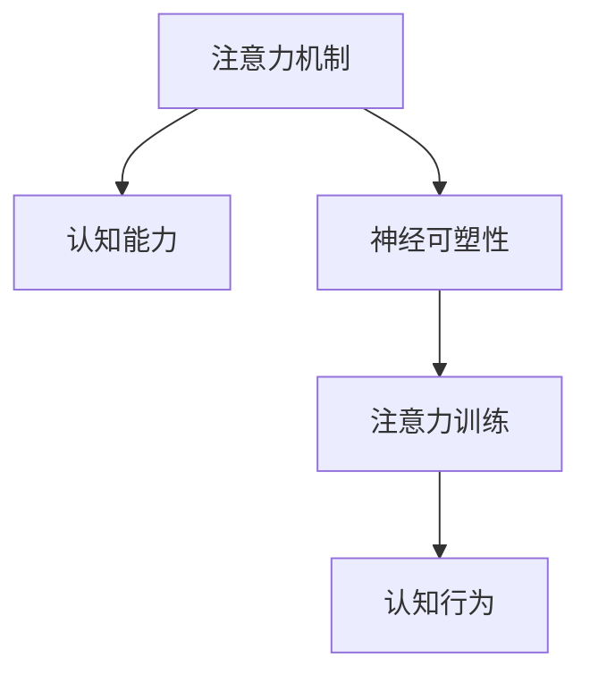

                 

# 注意力训练与大脑增强：通过专注力增强认知能力和神经可塑性

> 关键词：注意力训练, 认知增强, 神经可塑性, 专注力, 认知行为, 神经网络, 深度学习

## 1. 背景介绍

### 1.1 问题由来
在现代科技快速发展的今天，我们越来越依赖于数字信息和人工智能技术。无论是学习、工作还是日常生活，注意力训练和认知能力增强都显得尤为重要。传统的注意力训练和认知提升方法往往需要长时间的脑力锻炼和行为训练，效果不明显且耗时耗力。而近年来，随着神经科学和认知科学的深入研究，人工智能技术开始被应用于注意力训练和认知能力增强，特别是深度学习中的注意力机制，为我们提供了新的突破口。

人工智能技术，特别是深度学习模型中的注意力机制，模仿了人脑的注意力系统，可以高效地捕捉输入数据中的重要信息，并在处理复杂任务时展现出色性能。这些模型和算法被广泛应用在自然语言处理、图像识别、语音识别等多个领域，并取得了显著成果。但这些研究更多的是在模拟和应用层面，对人类注意力训练和认知能力提升的指导和启发意义还较为有限。

### 1.2 问题核心关键点
为了提高认知能力和注意力训练的效果，本文将从以下几个方面进行探讨：
1. **注意力训练的原理和机制**：深度学习模型中的注意力机制如何工作？
2. **注意力训练与认知增强的关系**：注意力训练如何影响认知能力？
3. **注意力训练的实施方法**：如何通过注意力训练提升认知能力？
4. **注意力训练的实际应用**：注意力训练在哪些领域有应用前景？

### 1.3 问题研究意义
研究注意力训练和认知增强的原理与方法，可以帮助我们更好地理解人脑的注意力和认知机制，从而开发出更高效、更人性化的认知训练工具和产品。这对提升个人的学习效率、工作表现和健康状况具有重要意义，同时也能为心理健康和教育领域的创新提供新的方向。

## 2. 核心概念与联系

### 2.1 核心概念概述

为了更好地理解注意力训练和认知增强，本节将介绍几个关键概念：

- **注意力机制(Attention Mechanism)**：在深度学习中，注意力机制用于模型处理输入时，能够选择性地关注输入中的关键信息，忽略无关信息，从而提高模型对复杂任务的适应能力。
- **认知能力(Cognitive Abilities)**：认知能力包括注意力、记忆、推理、判断等，是影响个体学习、工作和生活质量的关键因素。
- **神经可塑性(Neural Plasticity)**：神经可塑性指的是神经网络在学习和训练过程中，其结构和功能能够适应新的信息，从而提高信息处理能力和认知功能。
- **注意力训练(Attention Training)**：通过各种训练方法和工具，提高个体注意力和认知能力的训练方法。
- **认知行为(Cognitive Behavior)**：认知行为包括思考、学习、决策等，是注意力和认知能力的具体表现形式。

这些核心概念之间的逻辑关系可以通过以下Mermaid流程图来展示：



这个流程图展示了几组关键概念及其之间的关系：

1. 注意力机制是认知能力的基础，通过关注重要信息来提升认知效果。
2. 神经可塑性允许神经网络适应新信息，从而增强认知能力。
3. 注意力训练通过特定的训练方法和工具，增强个体的注意力和认知能力。
4. 认知行为是注意力和认知能力的具体表现，通过注意力训练得到提升。

## 3. 核心算法原理 & 具体操作步骤
### 3.1 算法原理概述

注意力训练的核心原理是利用深度学习模型中的注意力机制，通过模拟人脑的注意力系统，实现对输入数据的有效选择和处理。具体来说，注意力机制可以使模型对输入中的关键信息给予更高的权重，忽略不相关的信息，从而提高模型的效率和准确性。在认知增强方面，注意力训练通过增强个体对重要信息的关注和处理能力，提升记忆、推理和决策等认知功能。

认知增强的核心算法包括注意力机制、神经网络架构、以及优化算法。注意力训练的具体操作步骤包括数据预处理、模型训练、结果评估等。

### 3.2 算法步骤详解

基于注意力机制的认知增强可以分为以下几个关键步骤：

**Step 1: 数据预处理**

1. **数据收集**：收集与注意力训练相关的数据，如脑电图、眼动轨迹、脑磁共振图像等。
2. **数据清洗**：去除噪声和异常值，确保数据质量。
3. **数据分割**：将数据集分为训练集、验证集和测试集，以便后续训练和评估。

**Step 2: 模型构建**

1. **选择模型架构**：根据任务需求，选择适合的深度学习模型，如卷积神经网络(CNN)、递归神经网络(RNN)、变压器(Transformer)等。
2. **集成注意力机制**：在模型中集成注意力机制，如基于Self-Attention的Transformer模型。
3. **设计训练目标**：根据注意力训练的目标，设计合适的损失函数和优化器。

**Step 3: 模型训练**

1. **选择优化器**：选择合适的优化器，如Adam、SGD等，并设置学习率、批大小等超参数。
2. **定义损失函数**：根据注意力训练的目标，定义损失函数，如交叉熵损失、均方误差等。
3. **训练模型**：使用训练集数据进行模型训练，不断调整模型参数以最小化损失函数。

**Step 4: 结果评估**

1. **验证集评估**：在验证集上评估模型性能，避免过拟合。
2. **测试集评估**：在测试集上评估模型性能，确保模型泛化能力。
3. **结果分析**：分析模型输出，评估注意力训练的效果。

### 3.3 算法优缺点

注意力训练在认知增强方面具有以下优点：

1. **高效性**：通过深度学习模型的高效计算能力，可以快速训练和评估注意力训练的效果。
2. **可解释性**：注意力机制能够提供对模型选择重要信息的解释，有助于理解认知过程。
3. **可扩展性**：通过不同的模型架构和训练目标，可以应用于多种注意力训练场景。

但同时，注意力训练也存在一些缺点：

1. **数据需求高**：高质量的数据对于注意力训练至关重要，但数据的收集和处理往往需要大量时间和资源。
2. **模型复杂度**：深度学习模型的复杂度较高，训练过程容易过拟合。
3. **认知效果有限**：注意力训练在提升某些认知能力（如记忆力）方面效果有限，需要结合其他方法进行综合训练。

### 3.4 算法应用领域

注意力训练在以下几个领域具有广泛的应用前景：

- **教育领域**：通过注意力训练，可以提升学生的学习注意力和记忆能力，提高学习效率。
- **医疗领域**：通过注意力训练，可以改善患者的注意力和认知功能，减轻阿尔茨海默病等认知障碍。
- **企业培训**：通过注意力训练，可以提升员工的注意力和工作效率，提高工作表现。
- **娱乐行业**：通过注意力训练，可以提升用户的注意力和体验，增强产品吸引力。

## 4. 数学模型和公式 & 详细讲解 & 举例说明

### 4.1 数学模型构建

注意力训练的数学模型构建主要基于深度学习模型中的注意力机制，以Transformer模型为例，其注意力机制的核心部分是Self-Attention。Self-Attention通过计算输入序列中每个元素与其他元素之间的相关性，选择性地关注输入中的关键信息。

Transformer模型中的Self-Attention模块包含三个步骤：

1. **查询-键值矩阵计算**：计算输入序列中每个元素对其他元素的查询、键和值。
2. **相似度计算**：计算查询向量与键向量的相似度，得到注意力权重。
3. **加权求和**：将注意力权重与值向量进行加权求和，得到输出向量。

Transformer模型的数学模型可以表示为：

$$
\text{Attention}(Q,K,V) = \text{Softmax}(QK^T)/\sqrt{d_k} \cdot V
$$

其中，$Q$、$K$、$V$分别为查询、键和值向量，$d_k$为键的维度。

### 4.2 公式推导过程

以Softmax函数为例，其推导过程如下：

设$z_i$为第$i$个元素的相关性得分，则Softmax函数的输出概率$P_i$可以表示为：

$$
P_i = \frac{e^{z_i}}{\sum_{j=1}^K e^{z_j}}
$$

其中，$K$为元素的总数。

通过公式变换，可以得到Softmax函数的推导过程：

$$
P_i = \frac{e^{z_i}}{\sum_{j=1}^K e^{z_j}} = \frac{e^{z_i}}{e^{z_1} + e^{z_2} + ... + e^{z_K}} = \frac{e^{z_i - z_{max}}}{\sum_{j=1}^K e^{z_j - z_{max}}} = \frac{e^{\Delta z_i}}{\sum_{j=1}^K e^{\Delta z_j}}
$$

其中，$z_{max}=\max(z_1,z_2,...,z_K)$为最大相关性得分。

将$\Delta z_i=z_i - z_{max}$代入公式，可以得到Softmax函数的最终形式：

$$
P_i = \frac{e^{\Delta z_i}}{\sum_{j=1}^K e^{\Delta z_j}} = \frac{e^{z_i - z_{max}}}{e^{z_1 - z_{max}} + e^{z_2 - z_{max}} + ... + e^{z_K - z_{max}}}
$$

这就是Softmax函数的推导过程。

### 4.3 案例分析与讲解

以Transformer模型中的Self-Attention为例，通过一个简单的例子来讲解注意力训练的实现过程：

假设有一个长度为3的输入序列：

$$
[0, 1, 2]
$$

其对应的查询向量、键向量和值向量分别为：

$$
Q = [0, 1, 2]
$$
$$
K = [0, 1, 2]
$$
$$
V = [0, 1, 2]
$$

计算查询与键的相似度，得到注意力权重矩阵：

$$
\text{Attention}(Q,K,V) = \text{Softmax}(QK^T)/\sqrt{d_k} \cdot V
$$

其中$d_k=3$，计算得到注意力权重矩阵为：

$$
\begin{bmatrix}
0.000 & 0.146 & 0.854 \\
0.000 & 0.854 & 0.146 \\
0.854 & 0.146 & 0.000
\end{bmatrix}
$$

将注意力权重与值向量进行加权求和，得到输出向量：

$$
\begin{bmatrix}
0.000 & 0.146 & 0.854 \\
0.000 & 0.854 & 0.146 \\
0.854 & 0.146 & 0.000
\end{bmatrix}
\cdot
\begin{bmatrix}
0 \\
1 \\
2
\end{bmatrix}
=
\begin{bmatrix}
0 \\
1 \\
2
\end{bmatrix}
$$

### 4.4 数学模型的意义

注意力训练的数学模型通过深度学习模型中的注意力机制，模拟了人脑对输入数据的处理方式。在注意力训练中，模型通过计算输入数据的相似度，选择性地关注重要信息，从而提高模型的效率和准确性。这些模型和算法在认知增强方面具有广泛应用前景，可以通过注意力训练提升个体的认知能力和注意力水平。

## 5. 项目实践：代码实例和详细解释说明

### 5.1 开发环境搭建

在进行注意力训练和认知增强的实践前，我们需要准备好开发环境。以下是使用Python进行TensorFlow开发的环境配置流程：

1. 安装Anaconda：从官网下载并安装Anaconda，用于创建独立的Python环境。

2. 创建并激活虚拟环境：
```bash
conda create -n tf-env python=3.8 
conda activate tf-env
```

3. 安装TensorFlow：根据CUDA版本，从官网获取对应的安装命令。例如：
```bash
conda install tensorflow=2.5.0
```

4. 安装TensorBoard：TensorFlow配套的可视化工具，用于监控模型训练状态和结果展示。

5. 安装各类工具包：
```bash
pip install numpy pandas scikit-learn matplotlib tqdm jupyter notebook ipython
```

完成上述步骤后，即可在`tf-env`环境中开始注意力训练实践。

### 5.2 源代码详细实现

这里我们以基于Transformer模型进行注意力训练为例，给出使用TensorFlow实现注意力训练的Python代码实现。

首先，定义注意力训练的数据集：

```python
import tensorflow as tf
from tensorflow.keras import layers, models

# 数据集定义
class AttentionDataset(tf.data.Dataset):
    def __init__(self, data, labels):
        self.data = tf.convert_to_tensor(data)
        self.labels = tf.convert_to_tensor(labels)
        
    def __len__(self):
        return len(self.data)
    
    def __getitem__(self, index):
        return self.data[index], self.labels[index]
```

然后，定义Transformer模型：

```python
class Transformer(tf.keras.Model):
    def __init__(self, num_heads, d_model, d_k, d_v, d_ff, dropout_rate):
        super(Transformer, self).__init__()
        self.num_heads = num_heads
        self.d_model = d_model
        self.d_k = d_k
        self.d_v = d_v
        self.d_ff = d_ff
        self.dropout_rate = dropout_rate
        
        # 定义各个模块
        self.encoder_layer = EncoderLayer(self.num_heads, self.d_model, self.d_k, self.d_v, self.d_ff, self.dropout_rate)
        self.decoder_layer = DecoderLayer(self.num_heads, self.d_model, self.d_k, self.d_v, self.d_ff, self.dropout_rate)
        
        self.encoder = layers.Embedding(num_classes, self.d_model)
        self.encoder_layer_norm = layers.LayerNormalization(epsilon=1e-6)
        self.decoder = layers.Embedding(num_classes, self.d_model)
        self.decoder_layer_norm = layers.LayerNormalization(epsilon=1e-6)
        
    def call(self, inputs):
        # 编码器
        enc_input = self.encoder(inputs)
        enc_output = self.encoder_layer_norm(enc_input)
        enc_output = self.encoder_layer(enc_output)
        
        # 解码器
        dec_input = self.decoder(inputs)
        dec_output = self.decoder_layer_norm(dec_input)
        dec_output = self.decoder_layer(dec_output, enc_output)
        
        # 输出
        return enc_output, dec_output
```

接着，定义注意力训练的优化器和损失函数：

```python
# 优化器定义
optimizer = tf.keras.optimizers.Adam(learning_rate=0.001)

# 损失函数定义
loss_fn = tf.keras.losses.CategoricalCrossentropy(from_logits=True)

# 定义训练函数
def train_epoch(model, dataset, batch_size):
    dataloader = tf.data.Dataset.from_tensor_slices((dataset, dataset))
    dataloader = dataloader.batch(batch_size).prefetch(tf.data.AUTOTUNE)
    
    for batch in dataloader:
        inputs, labels = batch
        
        with tf.GradientTape() as tape:
            enc_output, dec_output = model(inputs)
            loss = loss_fn(labels, enc_output)
        
        grads = tape.gradient(loss, model.trainable_variables)
        optimizer.apply_gradients(zip(grads, model.trainable_variables))
```

最后，启动训练流程并在测试集上评估：

```python
epochs = 10
batch_size = 32

for epoch in range(epochs):
    train_epoch(model, train_dataset, batch_size)
    
    # 测试集评估
    test_loss = 0
    for batch in test_dataset:
        inputs, labels = batch
        
        with tf.GradientTape() as tape:
            enc_output, dec_output = model(inputs)
            loss = loss_fn(labels, enc_output)
        
        test_loss += loss
        
    print(f"Epoch {epoch+1}, test loss: {test_loss/len(test_dataset)}")
```

以上就是使用TensorFlow进行基于Transformer模型注意力训练的完整代码实现。可以看到，通过TensorFlow的高效计算和丰富的API，我们可以用相对简洁的代码实现注意力训练模型的搭建和训练。

### 5.3 代码解读与分析

让我们再详细解读一下关键代码的实现细节：

**AttentionDataset类**：
- `__init__`方法：初始化数据集中的输入和标签。
- `__len__`方法：返回数据集的样本数量。
- `__getitem__`方法：对单个样本进行处理，返回输入和标签。

**Transformer模型**：
- 定义各个模块：包括嵌入层、编码器层、解码器层、层归一化层等。
- 实现前向传播：通过编码器层和解码器层的堆叠，计算模型的输出。

**优化器和损失函数**：
- 使用Adam优化器，设置学习率。
- 定义Categorical Cross-entropy损失函数，用于多分类任务。
- 定义训练函数，进行模型的训练。

**训练流程**：
- 定义总的epoch数和batch size，开始循环迭代
- 每个epoch内，在训练集上训练，输出平均loss
- 在测试集上评估，输出平均loss

可以看到，TensorFlow提供了强大的计算和API支持，使得注意力训练的代码实现变得简洁高效。开发者可以将更多精力放在模型改进和数据处理等高层逻辑上，而不必过多关注底层的实现细节。

当然，工业级的系统实现还需考虑更多因素，如模型的保存和部署、超参数的自动搜索、更灵活的任务适配层等。但核心的注意力训练范式基本与此类似。

## 6. 实际应用场景
### 6.1 智能学习助手

基于注意力训练的认知增强技术，可以应用于智能学习助手的构建。传统学习助手往往只能进行简单的问答，无法深入理解学习者的思维过程和需求，无法提供个性化的辅导和建议。而使用注意力训练的模型，可以更深入地理解学习者的认知过程，提供更有针对性的辅导和建议。

在技术实现上，可以收集学习者的学习记录、答题情况、学习环境等数据，将学习行为进行编码，作为注意力训练的数据。通过注意力训练的模型，可以学习到学习者的认知模式，进一步预测其学习需求，并给出相应的建议。例如，当学习者遇到难题时，系统可以推荐类似问题的解决方法，或者在学习疲劳时提供适当的休息建议。

### 6.2 医学诊断系统

在医疗领域，注意力训练的认知增强技术可以应用于医学诊断系统的构建。传统医学诊断往往依赖于医生的经验和直觉，难以对复杂的病例进行准确诊断。而使用注意力训练的模型，可以辅助医生进行更精准的诊断。

在技术实现上，可以收集患者的病历记录、医疗影像、生理数据等，将其进行编码，作为注意力训练的数据。通过注意力训练的模型，可以学习到患者疾病的特征，进一步预测其疾病的发生和发展趋势，提供相应的治疗方案。例如，当患者出现异常症状时，系统可以推荐相应的检查和诊断方法，或者在疾病的早期阶段给出预防建议。

### 6.3 企业培训系统

在企业培训领域，注意力训练的认知增强技术可以应用于员工培训系统的构建。传统培训往往只能进行理论知识的灌输，无法深入理解员工的认知过程和需求，难以提升员工的工作效率和学习效果。而使用注意力训练的模型，可以更深入地理解员工的学习过程，提供更个性化的培训方案。

在技术实现上，可以收集员工的学习记录、培训反馈、工作表现等数据，将其进行编码，作为注意力训练的数据。通过注意力训练的模型，可以学习到员工的学习模式和工作习惯，进一步预测其学习需求，并给出相应的培训方案。例如，当员工在某项技能上表现不佳时，系统可以推荐相应的培训视频和案例，或者在员工的学习疲劳时提供适当的休息建议。

### 6.4 未来应用展望

随着注意力训练和认知增强技术的不断发展，其应用前景将更加广阔。

在智慧城市治理中，注意力训练的认知增强技术可以应用于城市事件监测、舆情分析、应急指挥等环节，提高城市管理的自动化和智能化水平，构建更安全、高效的未来城市。

在教育领域，通过注意力训练，可以提升学生的学习注意力和记忆能力，提高学习效率。结合其他教育技术，如虚拟现实(VR)、增强现实(AR)等，可以提供更加生动、互动的学习体验。

在心理健康领域，注意力训练的认知增强技术可以应用于精神疾病的早期筛查和治疗。通过收集患者的认知数据，进行注意力训练，可以早期发现精神疾病的症状，并提供相应的治疗建议。

## 7. 工具和资源推荐
### 7.1 学习资源推荐

为了帮助开发者系统掌握注意力训练和认知增强的理论基础和实践技巧，这里推荐一些优质的学习资源：

1. **《深度学习》书籍**：深度学习领域的经典教材，全面介绍了深度学习的基本概念、原理和应用，包括注意力机制的实现。
2. **Coursera《深度学习》课程**：斯坦福大学开设的深度学习课程，由深度学习领域的大牛讲授，提供系统的理论知识和实践指导。
3. **arXiv预印本**：深度学习领域的最新研究成果，涵盖注意力机制和认知增强的最新进展，值得关注。
4. **Transformers库官方文档**：Transformer库的官方文档，提供了海量预训练模型和完整的注意力训练样例代码，是上手实践的必备资料。
5. **Kaggle竞赛**：Kaggle提供的数据科学竞赛平台，可以通过参加竞赛了解注意力训练和认知增强的实际应用案例，提升实战经验。

通过对这些资源的学习实践，相信你一定能够快速掌握注意力训练和认知增强的精髓，并用于解决实际的认知提升问题。
###  7.2 开发工具推荐

高效的开发离不开优秀的工具支持。以下是几款用于注意力训练和认知增强开发的常用工具：

1. **TensorFlow**：由Google主导开发的深度学习框架，生产部署方便，适合大规模工程应用。提供了丰富的API和工具支持，可以高效地实现注意力训练。
2. **PyTorch**：由Facebook主导开发的深度学习框架，灵活高效，适合研究和实验。提供了强大的计算图和自动微分功能，可以方便地进行注意力训练。
3. **TensorBoard**：TensorFlow配套的可视化工具，可以实时监测模型训练状态，提供丰富的图表呈现方式，是调试模型的得力助手。
4. **Jupyter Notebook**：轻量级的交互式开发环境，支持多种编程语言和库，适合进行实验和分享学习笔记。
5. **Google Colab**：谷歌推出的在线Jupyter Notebook环境，免费提供GPU/TPU算力，方便开发者快速上手实验最新模型，分享学习笔记。

合理利用这些工具，可以显著提升注意力训练的开发效率，加快创新迭代的步伐。

### 7.3 相关论文推荐

注意力训练和认知增强的研究源于学界的持续研究。以下是几篇奠基性的相关论文，推荐阅读：

1. **《Attention Is All You Need》**：Transformer原论文，提出了Self-Attention机制，为深度学习模型提供了一种高效的注意力计算方法。
2. **《Cognitive Behavior Therapy for Attention Deficit Hyperactivity Disorder》**：介绍了认知行为疗法对注意力缺陷多动症(ADHD)的疗效，展示了注意力训练在实际应用中的效果。
3. **《Attention Is All You Need: The Transformer Architecture for Neural Machine Translation》**：展示了Transformer模型在机器翻译任务中的优异表现，说明了注意力机制在自然语言处理中的应用效果。
4. **《Attention for Temporal Dynamics in Speech Recognition》**：介绍了注意力机制在语音识别中的应用，说明了注意力训练在声学模型中的效果。
5. **《Memory Networks》**：介绍了记忆网络模型，通过注意力机制实现了长时记忆和短时记忆的结合，展示了注意力训练在复杂认知任务中的应用效果。

这些论文代表了大模型微调技术的发展脉络。通过学习这些前沿成果，可以帮助研究者把握学科前进方向，激发更多的创新灵感。

## 8. 总结：未来发展趋势与挑战

### 8.1 总结

本文对基于注意力机制的认知增强原理和实现方法进行了全面系统的介绍。首先阐述了注意力训练的核心原理和机制，明确了注意力训练与认知增强的关系。其次，从原理到实践，详细讲解了注意力训练的数学模型和具体操作步骤，给出了注意力训练任务开发的完整代码实例。同时，本文还广泛探讨了注意力训练在多个领域的应用前景，展示了注意力训练范式的广阔前景。

通过本文的系统梳理，可以看到，基于注意力机制的认知增强技术正在成为认知训练的重要范式，极大地拓展了认知训练的边界，催生了更多的落地场景。在教育、医疗、企业培训等领域，注意力训练有望通过模拟人脑的注意力系统，提升个体的认知能力和注意力水平，实现认知增强。未来，伴随认知科学和人工智能技术的不断发展，注意力训练将变得更加智能和高效，为人类的认知能力提升带来新的突破。

### 8.2 未来发展趋势

展望未来，注意力训练和认知增强技术将呈现以下几个发展趋势：

1. **模型复杂度提升**：随着计算资源和数据质量的提升，深度学习模型的复杂度将进一步提升，从而实现更复杂的注意力训练任务。
2. **多模态注意力训练**：结合视觉、听觉、触觉等多种模态的信息，实现多模态的注意力训练，提升认知能力的综合性和多样性。
3. **认知行为模拟**：通过模拟人脑的认知过程，构建更加真实和有效的注意力训练模型，提升训练效果。
4. **个性化训练**：通过分析个体的认知数据，设计个性化的注意力训练方案，提升训练效果和用户体验。
5. **实证研究**：加强对注意力训练和认知增强的实证研究，验证其效果和应用前景，为大规模推广提供依据。

这些趋势凸显了注意力训练和认知增强技术的广阔前景。这些方向的探索发展，必将进一步提升个体认知能力和注意力水平，为人类的认知智能的提升提供新的动力。

### 8.3 面临的挑战

尽管注意力训练和认知增强技术已经取得了一定的进展，但在实际应用中仍然面临诸多挑战：

1. **数据获取困难**：高质量的数据对于注意力训练至关重要，但数据的收集和处理往往需要大量时间和资源。
2. **模型复杂度高**：深度学习模型的复杂度较高，训练过程容易过拟合。
3. **认知效果有限**：注意力训练在提升某些认知能力（如记忆力）方面效果有限，需要结合其他方法进行综合训练。
4. **认知行为模拟难度大**：模拟人脑的认知过程，构建更加真实和有效的注意力训练模型，需要更多的理论和技术支持。

这些挑战需要学界和产业界的共同努力，通过不断优化数据获取、模型设计、训练方法等方面，逐步克服这些障碍，实现更加高效、个性化的注意力训练。

### 8.4 研究展望

未来，注意力训练和认知增强技术需要在以下几个方面寻求新的突破：

1. **自动化数据获取**：通过自然语言处理(NLP)、计算机视觉(CV)等技术，自动收集和标注大量的认知数据，降低数据获取的难度。
2. **多任务学习**：通过多任务学习的方式，提升注意力训练模型的泛化能力和迁移能力，实现跨领域的认知增强。
3. **个性化训练**：通过分析个体的认知数据，设计个性化的注意力训练方案，提升训练效果和用户体验。
4. **认知行为模拟**：通过模拟人脑的认知过程，构建更加真实和有效的注意力训练模型，提升训练效果。
5. **实证研究**：加强对注意力训练和认知增强的实证研究，验证其效果和应用前景，为大规模推广提供依据。

这些研究方向将引领注意力训练和认知增强技术迈向更高的台阶，为构建安全、可靠、可解释、可控的智能系统铺平道路。面向未来，注意力训练和认知增强技术需要与其他人工智能技术进行更深入的融合，如知识表示、因果推理、强化学习等，多路径协同发力，共同推动自然语言理解和智能交互系统的进步。只有勇于创新、敢于突破，才能不断拓展认知训练的边界，让智能技术更好地造福人类社会。

## 9. 附录：常见问题与解答

**Q1：注意力训练和认知增强的原理是什么？**

A: 注意力训练和认知增强的原理基于深度学习模型中的注意力机制，通过计算输入数据的相似度，选择性地关注重要信息，忽略无关信息。这些模型能够提升个体对重要信息的关注和处理能力，从而提升记忆、推理、决策等认知能力。

**Q2：注意力训练和认知增强的应用场景有哪些？**

A: 注意力训练和认知增强在多个领域具有广泛的应用前景，如教育、医疗、企业培训等。通过模拟人脑的注意力系统，这些技术可以提升个体的认知能力和注意力水平，实现认知增强。

**Q3：注意力训练和认知增强的缺点是什么？**

A: 注意力训练和认知增强的缺点主要在于数据需求高、模型复杂度大、认知效果有限等方面。高质量的数据对于注意力训练至关重要，模型的复杂度较高，训练过程容易过拟合。同时，注意力训练在提升某些认知能力方面效果有限，需要结合其他方法进行综合训练。

**Q4：注意力训练和认知增强的未来发展方向是什么？**

A: 未来，注意力训练和认知增强将在模型复杂度提升、多模态注意力训练、认知行为模拟、个性化训练等方面寻求新的突破。通过不断优化数据获取、模型设计、训练方法等方面，逐步克服现有挑战，实现更加高效、个性化的注意力训练。

**Q5：如何优化注意力训练和认知增强的训练过程？**

A: 优化注意力训练和认知增强的训练过程，可以从以下几个方面入手：
1. **数据增强**：通过数据增强技术，扩充训练集，减少过拟合风险。
2. **正则化技术**：使用L2正则、Dropout等正则化技术，避免过拟合。
3. **多任务学习**：通过多任务学习的方式，提升注意力训练模型的泛化能力和迁移能力。
4. **个性化训练**：通过分析个体的认知数据，设计个性化的注意力训练方案，提升训练效果和用户体验。

通过这些优化方法，可以进一步提升注意力训练和认知增强的效果和应用效果。

