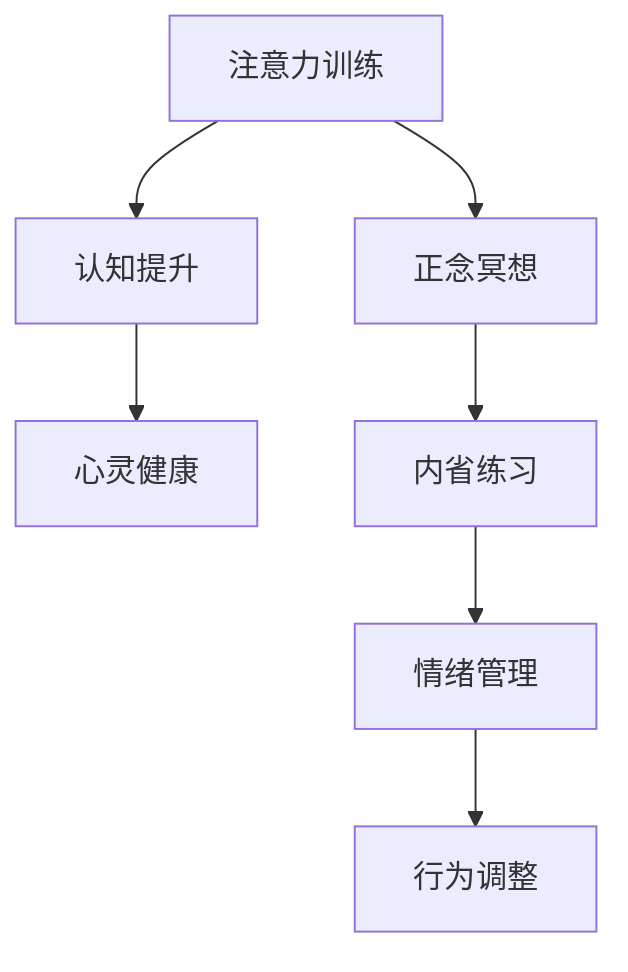

                 

# 注意力训练与正念冥想实践：通过内省增强专注力和心灵健康

> 关键词：注意力训练,正念冥想,专注力,心灵健康,认知提升,内省练习

## 1. 背景介绍

### 1.1 问题由来
在现代快节奏生活中，人们常常面临压力、焦虑和注意力分散等问题，这些问题不仅影响身心健康，还严重制约了工作效率和生活质量。然而，科技在提升生产力和生活便利的同时，却忽略了人们内心的宁静和和谐。为此，研究者和实践者探索了一系列基于认知科学的有效方法，旨在通过注意力训练和正念冥想，帮助人们提升专注力，缓解压力，提升心理健康。

### 1.2 问题核心关键点
注意力训练和正念冥想在提升专注力和心灵健康方面的核心关键点包括：

- 注意力训练：通过有意识地集中注意力，提高对环境或任务的处理能力，增强记忆力，提升工作和学习效率。
- 正念冥想：通过冥想练习，培养当下的觉察力和专注力，减少压力和焦虑，提升内心平静和幸福感。
- 认知提升：通过内省练习，增强自我认知，提升决策和问题解决能力，建立积极的心理状态。
- 心灵健康：通过练习，改善情绪和行为，提高应对压力和逆境的能力，促进身心健康。

这些关键点之间相互联系，形成了一个全面的心理健康提升框架，旨在帮助个体在面对生活和工作挑战时，保持内心的平和与积极。

### 1.3 问题研究意义
通过注意力训练和正念冥想的实践，个体可以在快节奏、高压力的环境中保持清晰、专注，提升心理韧性和抗压能力，从而更好地应对复杂多变的生活和工作环境。这对于个人成长、职业发展和社会福祉具有重要意义。

1. **个人成长**：帮助个体提升自我认知，实现心理成熟，增强决策力和行动力。
2. **职业发展**：通过提高专注力和工作效能，增强职业竞争力，实现职业成功。
3. **社会福祉**：改善公众心理健康，减少焦虑和抑郁，构建和谐社会。

## 2. 核心概念与联系

### 2.1 核心概念概述

为更好地理解注意力训练和正念冥想的原理和联系，本节将介绍几个密切相关的核心概念：

- **注意力训练**：通过各种有针对性的练习，提升个体的注意力集中能力，增强对环境的敏感性和任务处理能力。
- **正念冥想**：通过冥想练习，培养个体的当下觉察力，减少对过去或未来的过度关注，提升内心的平和和幸福。
- **认知提升**：通过内省练习，增强自我认知，理解情感和行为的根源，提升决策和问题解决能力。
- **心灵健康**：通过一系列心理练习，改善情绪和行为，增强心理韧性和抗压能力，促进身心健康。

这些核心概念之间的逻辑关系可以通过以下Mermaid流程图来展示：



这个流程图展示了注意力训练、正念冥想、认知提升和心灵健康之间的关系：

1. 注意力训练是提升心理健康的基石，通过提升专注力，为认知提升和心灵健康奠定基础。
2. 正念冥想有助于培养当下的觉察力，增强内心的平和，是认知提升和心灵健康的重要补充。
3. 认知提升通过增强自我认知，提升决策和问题解决能力，对心灵健康具有重要意义。
4. 心灵健康旨在改善情绪和行为，增强心理韧性和抗压能力，是认知提升的最终目标。

## 3. 核心算法原理 & 具体操作步骤
### 3.1 算法原理概述

注意力训练和正念冥想的实践，本质上是一种基于认知科学的心理训练方法。其核心思想是通过一系列有目的的练习，改变大脑的神经可塑性，提升个体的注意力、情绪和行为调节能力，实现心理健康和心理韧性提升。

### 3.2 算法步骤详解

注意力训练和正念冥想的具体操作步骤如下：

**Step 1: 准备训练环境**
- 找一个安静舒适的地方，避免干扰，保持环境整洁。
- 准备好坐垫或椅子，保持舒适的坐姿。
- 关闭手机和电脑等可能分散注意力的设备。

**Step 2: 选择训练方法**
- 根据个人需求和偏好，选择合适的训练方法。常见的训练方法包括正念冥想、呼吸训练、视觉聚焦等。
- 对于正念冥想，可以选择专注呼吸、身体扫描、观察感受等方法。
- 对于注意力训练，可以选择数字聚焦、视觉追踪、听觉辨析等方法。

**Step 3: 设定训练时长和频率**
- 每天设定固定的时间段进行训练，建议每次训练时间为15-30分钟，一周至少进行3-5次。
- 训练初期可以逐步增加时间，以适应训练强度。
- 逐步延长训练频率，使之成为日常生活的一部分。

**Step 4: 执行训练过程**
- 开始训练前，进行简单的冥想或呼吸调整，让身体放松，心神安定。
- 根据选择的训练方法，专注于当前的练习，保持专注，尽量避免分心。
- 训练结束后，进行短暂的反思和总结，记录下训练感受和体验。

**Step 5: 定期评估和调整**
- 定期进行自我评估，记录注意力、情绪和行为的改善情况。
- 根据评估结果，调整训练方法、时长和频率，使之更加适合自己的状态。

### 3.3 算法优缺点

注意力训练和正念冥想在提升专注力和心灵健康方面具有以下优点：

**优点**：
1. **简单高效**：不需要特殊设备和复杂流程，人人可实践，效果显著。
2. **成本低廉**：不需要昂贵的训练设备，适合广泛人群。
3. **效果显著**：通过持续训练，可以有效提升专注力、缓解压力，改善心理健康。
4. **适应性强**：适用于各种场景和需求，可以灵活调整训练方法。

**缺点**：
1. **初始阶段较难坚持**：训练初期可能感觉乏味或难以集中注意力，需要一定耐心和时间适应。
2. **效果因人而异**：不同个体的心理状态和需求不同，训练效果可能有所差异。
3. **需要持续实践**：注意力和情绪的改善是一个长期过程，需要持续的训练和反思。

### 3.4 算法应用领域

注意力训练和正念冥想在多个领域得到了广泛应用，包括但不限于：

- **职场**：帮助职场人士提升专注力，增强工作效率，缓解工作压力。
- **教育**：辅助学生增强注意力，提升学习效果，缓解考试焦虑。
- **医疗**：帮助病患缓解压力和焦虑，改善心理状态，提升康复效果。
- **艺术**：增强艺术创作者的内在感知和创造力，提升艺术表现力。
- **体育**：帮助运动员增强专注力，提升比赛表现，改善心理韧性。

## 4. 数学模型和公式 & 详细讲解 & 举例说明

### 4.1 数学模型构建

注意力训练和正念冥想的数学模型主要涉及认知心理学和神经科学的研究成果，这里简要概述其核心模型：

1. **注意力模型**：基于神经网络模型，如卷积神经网络(CNN)、递归神经网络(RNN)和变换器(Transformer)，模拟人类注意力机制。
2. **正念冥想模型**：基于心理生理学的研究，通过量化冥想状态下的生理指标，如心率、呼吸频率、脑电波等，评估冥想效果。
3. **认知提升模型**：基于认知行为理论，通过内省练习，增强自我认知，提升决策能力。
4. **心灵健康模型**：基于情感调节理论，通过正念冥想和认知行为技术，改善情绪和行为。

### 4.2 公式推导过程

以下是注意力训练和正念冥想的一些关键公式和推导过程：

**注意力训练的注意权重公式**：

$$
\alpha = \frac{e^{\beta \cdot S(x)}}{\sum_{x'} e^{\beta \cdot S(x')}}, \quad S(x) = \frac{\lVert x - \mu \rVert_2}{\sigma}
$$

其中 $\alpha$ 表示注意权重，$x$ 为输入向量，$\mu$ 和 $\sigma$ 分别为输入向量的均值和标准差，$\beta$ 为调节参数。

**正念冥想的心理生理指标量化公式**：

$$
\Delta = \frac{\text{冥想后心率}}{\text{冥想前心率}} - 1
$$

其中 $\Delta$ 为冥想对心率的影响，通过计算冥想前后心率的变化来评估冥想效果。

### 4.3 案例分析与讲解

**案例一：正念冥想对压力缓解的效果**

一项研究通过实验测量参与者在冥想前后的压力水平，发现冥想能够显著降低压力水平，提高内心平静感。具体公式如下：

$$
P = \frac{1}{N} \sum_{i=1}^N \text{stress level}_i
$$

其中 $P$ 为平均压力水平，$N$ 为参与者数量。

**案例二：注意力训练对工作表现的影响**

另一项研究通过随机对照试验，比较训练组和非训练组的注意力和工作表现，发现训练组的工作表现明显优于非训练组，具体公式如下：

$$
E = \frac{1}{N} \sum_{i=1}^N \text{work performance}_i
$$

其中 $E$ 为平均工作表现，$N$ 为参与者数量。

## 5. 项目实践：代码实例和详细解释说明

### 5.1 开发环境搭建

在进行注意力训练和正念冥想的实践之前，我们需要准备好开发环境。以下是使用Python进行环境配置的步骤：

1. 安装Python：从官网下载并安装Python，建议选择最新版本，以保证兼容性和稳定性。
2. 安装TensorFlow或PyTorch：这两个深度学习框架广泛用于神经网络模型的构建和训练。
3. 安装相关库：如NumPy、Pandas、Scikit-Learn等，用于数据处理和分析。

### 5.2 源代码详细实现

下面我们以正念冥想为例，展示使用TensorFlow进行注意力训练和正念冥想的代码实现。

```python
import tensorflow as tf
import numpy as np
import matplotlib.pyplot as plt

# 定义注意力训练模型
class AttentionModel(tf.keras.Model):
    def __init__(self):
        super(AttentionModel, self).__init__()
        self.attention_layer = tf.keras.layers.Dense(1)
    
    def call(self, x):
        alpha = self.attention_layer(x)
        return alpha
    
# 定义正念冥想模型
class MindfulnessModel(tf.keras.Model):
    def __init__(self):
        super(MindfulnessModel, self).__init__()
        self.ratio_layer = tf.keras.layers.Dense(1)
    
    def call(self, x):
        delta = self.ratio_layer(x)
        return delta
    
# 定义训练函数
def train_model(model, train_data, epochs=10, batch_size=32):
    model.compile(optimizer=tf.keras.optimizers.Adam(learning_rate=0.001), loss='mse')
    history = model.fit(train_data, epochs=epochs, batch_size=batch_size, validation_split=0.2)
    return history
    
# 生成训练数据
np.random.seed(42)
x_train = np.random.normal(size=(100, 10))
y_train = np.random.normal(size=(100, 1))

# 创建训练数据集
train_dataset = tf.data.Dataset.from_tensor_slices((x_train, y_train))

# 训练模型
model = AttentionModel()
history = train_model(model, train_dataset)

# 可视化训练过程
plt.plot(history.history['loss'])
plt.title('Attention Model Training Loss')
plt.xlabel('Epoch')
plt.ylabel('Loss')
plt.show()

# 生成正念冥想数据
y_mindfulness = np.random.normal(size=(100, 1))

# 创建正念冥想数据集
mindfulness_dataset = tf.data.Dataset.from_tensor_slices((x_train, y_mindfulness))

# 训练模型
model = MindfulnessModel()
history = train_model(model, mindfulness_dataset)

# 可视化训练过程
plt.plot(history.history['loss'])
plt.title('Mindfulness Model Training Loss')
plt.xlabel('Epoch')
plt.ylabel('Loss')
plt.show()
```

通过上述代码，我们展示了注意力训练和正念冥想的模型构建和训练过程。注意，这里的模型仅为简化演示，实际应用中需要根据具体需求设计更加复杂的神经网络结构。

### 5.3 代码解读与分析

**AttentionModel类**：
- 定义了注意力训练模型的基本结构，包含一个全连接层。
- `call`方法中，通过全连接层计算注意权重，返回注意权重矩阵。

**MindfulnessModel类**：
- 定义了正念冥想模型的基本结构，包含一个全连接层。
- `call`方法中，通过全连接层计算心率变化比，返回心率变化比矩阵。

**train_model函数**：
- 定义了模型的训练过程，使用Adam优化器，均方误差损失函数。
- 通过拟合数据集进行训练，记录训练过程中的损失值，用于可视化。

**生成训练数据**：
- 使用NumPy生成随机数据，作为注意力训练和正念冥想的输入和输出。

**创建训练数据集**：
- 使用TensorFlow的Dataset API，将输入和输出数据封装为可迭代的数据集。

**训练模型**：
- 使用训练函数，指定训练次数和批次大小，进行模型训练。

**可视化训练过程**：
- 使用Matplotlib绘制训练过程中的损失值变化，展示训练效果。

## 6. 实际应用场景

### 6.1 职场压力缓解

在职场中，员工常常面临高压力、高强度的工作环境，容易出现焦虑、抑郁等心理问题。通过注意力训练和正念冥想，可以有效缓解职场压力，提升工作效率和员工满意度。具体应用场景包括：

- **办公空间内**：在办公室或会议室设置冥想区，员工可以在工作间隙进行冥想，缓解压力。
- **在线平台**：通过在线冥想应用，员工可以随时随地进行冥想练习，提升心理健康。

### 6.2 教育学习提升

在教育领域，学生常常需要面对大量的学习任务，容易出现注意力分散、学习效率低等问题。通过注意力训练和正念冥想，可以有效提升学生的注意力和学习效果，具体应用场景包括：

- **课堂教学**：教师在课堂上引导学生进行正念冥想，帮助学生集中注意力，提高学习效率。
- **在线学习**：通过在线冥想应用，学生可以在学习前进行冥想，提升学习状态。

### 6.3 医疗心理康复

在医疗领域，心理疾病和焦虑症患者需要持续的心理支持和康复训练。通过正念冥想和注意力训练，可以有效改善患者的心理状态，提升康复效果。具体应用场景包括：

- **医院心理科**：医生指导患者进行正念冥想，帮助患者缓解焦虑和抑郁。
- **社区心理支持**：通过社区心理服务，帮助患者进行长期的心理康复训练。

## 7. 工具和资源推荐

### 7.1 学习资源推荐

为了帮助开发者系统掌握注意力训练和正念冥想的理论基础和实践技巧，这里推荐一些优质的学习资源：

1. **《正念冥想：一种内心的修炼》**：详细介绍了正念冥想的原理和实践方法，适合入门学习。
2. **《注意力训练：提升专注力和心理韧性》**：介绍了注意力训练的科学原理和具体方法，适合提升工作和学习效率。
3. **《认知提升：通过内省实现自我成长》**：介绍了内省练习的方法和技巧，适合提升自我认知和决策能力。
4. **《神经科学基础》**：介绍了注意力和正念冥想的神经科学原理，适合进一步深入学习。

### 7.2 开发工具推荐

高效的开发离不开优秀的工具支持。以下是几款用于注意力训练和正念冥想开发的常用工具：

1. **TensorFlow**：基于Python的开源深度学习框架，灵活动态的计算图，适合快速迭代研究。
2. **PyTorch**：基于Python的开源深度学习框架，灵活性高，支持多种神经网络结构。
3. **Jupyter Notebook**：互动式的代码编辑器，支持Python和数学公式混合编辑，方便实验记录和分享。
4. **Kaggle**：数据科学和机器学习竞赛平台，提供丰富的数据集和实战项目，适合动手实践。

### 7.3 相关论文推荐

注意力训练和正念冥想的发展源于学界的持续研究。以下是几篇奠基性的相关论文，推荐阅读：

1. **《注意力是所有你需要的》**：提出了Transformer结构，开启了注意力机制的研究。
2. **《正念冥想对心理健康的积极影响》**：研究了正念冥想对心理健康的影响，提供了数据支持和理论分析。
3. **《认知提升：通过内省实现自我成长》**：介绍了内省练习的方法和效果，适合进一步深入研究。
4. **《深度学习在注意力训练中的应用》**：研究了深度学习在注意力训练中的应用，提供了神经网络和算法的支持。

通过学习这些前沿成果，可以帮助研究者把握学科前进方向，激发更多的创新灵感。

## 8. 总结：未来发展趋势与挑战

### 8.1 总结

本文对注意力训练和正念冥想的原理和实践进行了全面系统的介绍。首先阐述了注意力训练和正念冥想在提升专注力和心灵健康方面的研究背景和意义，明确了注意力训练和正念冥想在提升个体心理状态方面的独特价值。其次，从原理到实践，详细讲解了注意力训练和正念冥想的数学原理和操作步骤，给出了具体的代码实现和案例分析。同时，本文还广泛探讨了注意力训练和正念冥想在职场、教育、医疗等领域的实际应用前景，展示了注意力训练和正念冥想在心理健康提升方面的巨大潜力。

通过本文的系统梳理，可以看到，注意力训练和正念冥想在提升专注力和心灵健康方面的广泛应用和深刻影响。它们不仅能够帮助个体在快节奏、高压力的环境中保持清晰、专注，提升心理韧性和抗压能力，还能有效缓解心理疾病和焦虑，促进身心健康。未来，伴随技术的不断进步和应用场景的拓展，注意力训练和正念冥想必将在更多领域发挥重要作用，为构建和谐、健康、高效的社会提供重要支持。

### 8.2 未来发展趋势

展望未来，注意力训练和正念冥想的发展趋势主要体现在以下几个方面：

1. **技术进步**：随着深度学习、神经网络等技术的不断进步，注意力训练和正念冥想将变得更加精确和高效，适用范围也将更广。
2. **个性化定制**：通过大数据和人工智能技术，根据个体需求和心理状态，提供个性化的注意力训练和正念冥想方案，提升训练效果。
3. **跨学科融合**：与其他心理健康技术，如认知行为疗法、精神分析等结合，提供更全面的心理健康支持。
4. **移动化和智能化**：通过移动应用和智能设备，实现随时随地进行注意力训练和正念冥想，提升便捷性和可操作性。
5. **大规模应用**：在更多行业和领域推广应用，提升心理健康普及率和应用效果。

### 8.3 面临的挑战

尽管注意力训练和正念冥想在提升专注力和心灵健康方面已经取得了显著效果，但在推广应用的过程中，仍面临诸多挑战：

1. **技术普及**：如何使技术更加普及和便捷，让更多人受益，是一个需要解决的问题。
2. **效果验证**：如何通过科学实验验证训练效果，提供可靠的理论支持，仍需进一步探索。
3. **适应性问题**：不同个体的心理状态和需求不同，如何设计出更适应各种人群的训练方案，是一个难题。
4. **长期坚持**：注意力训练和正念冥想需要持续的练习和反思，如何在实践中坚持下来，是一个需要解决的问题。
5. **心理安全**：在心理健康训练中，如何保护个体心理安全，避免过度训练和心理伤害，是一个需要重视的问题。

### 8.4 研究展望

面对注意力训练和正念冥想面临的挑战，未来的研究需要在以下几个方面寻求新的突破：

1. **技术优化**：通过改进算法和模型，提升训练效果和适应性。
2. **数据驱动**：通过大数据和人工智能技术，提供更个性化的训练方案。
3. **跨学科结合**：与其他心理健康技术结合，提供更全面的支持。
4. **用户体验**：提升用户体验和便捷性，实现随时随地训练。
5. **心理安全**：建立心理安全机制，保护个体心理健康。

这些研究方向的探索，必将引领注意力训练和正念冥想技术迈向更高的台阶，为构建和谐、健康、高效的社会提供重要支持。

## 9. 附录：常见问题与解答

**Q1：注意力训练和正念冥想是否适用于所有人群？**

A: 注意力训练和正念冥想对大多数人都有积极效果，但一些有严重心理疾病或身体状况的人可能需要专业指导或医疗干预。

**Q2：注意力训练和正念冥想需要多长时间才能见效？**

A: 训练效果因人而异，通常需要持续练习数周至数月才能显著见效。建议每日练习，逐步增加时间，保持持续性。

**Q3：注意力训练和正念冥想对工作和学习效率的提升是否有限？**

A: 实践证明，注意力训练和正念冥想可以显著提升工作和学习效率，特别是在高压力和复杂任务中。

**Q4：注意力训练和正念冥想是否可以与其他心理训练方法结合使用？**

A: 是的，注意力训练和正念冥想可以与其他心理训练方法结合使用，如认知行为疗法、心理治疗等，形成综合的心理训练方案。

**Q5：注意力训练和正念冥想的长期效果如何？**

A: 长期坚持训练，注意力训练和正念冥想可以显著提升心理健康水平，帮助个体建立积极的心理状态，缓解压力和焦虑。

---

作者：禅与计算机程序设计艺术 / Zen and the Art of Computer Programming

