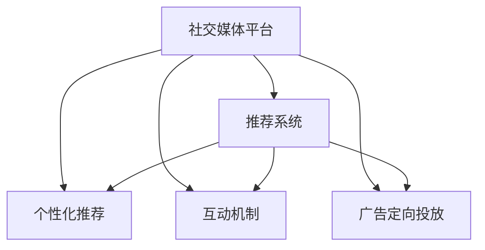

                 

# 注意力货币化：社交媒体平台是如何争夺你的时间和精力的

在数字时代，社交媒体平台成为了信息传播、社交互动和广告营销的重要载体。它们通过各种策略和算法，巧妙地争夺和利用人们的注意力，进而实现商业变现。本文将深入探讨社交媒体平台如何争夺你的时间和精力，以及这一过程中的关键算法和策略。

## 1. 背景介绍

### 1.1 问题由来

社交媒体平台的崛起，使得信息传播和社交互动的方式发生了革命性的变化。它们通过多样化的内容形态、互动形式和推荐算法，吸引了大量用户。然而，这背后隐藏的是平台对用户注意力的争夺。

随着用户时间的愈发宝贵，注意力经济成为新一轮的竞争焦点。社交媒体平台通过智能算法推荐、个性化内容推送等方式，不断提升用户粘性，最大化地占用用户时间。

### 1.2 问题核心关键点

社交媒体平台争夺用户注意力，主要依赖以下核心关键点：

1. **算法推荐**：通过机器学习算法，精准推荐用户感兴趣的内容，提升用户停留时间。
2. **个性化推送**：根据用户行为和偏好，个性化推送相关内容，增强用户粘性。
3. **互动激励**：利用点赞、评论、分享等互动机制，激发用户参与和分享，扩大内容传播范围。
4. **广告定向投放**：精准投放广告，提升广告效果和转化率，实现商业变现。

理解这些核心关键点，有助于我们深入挖掘社交媒体平台的商业逻辑和用户行为特征。

## 2. 核心概念与联系

### 2.1 核心概念概述

为了更好地理解社交媒体平台注意力争夺的策略，本节将介绍几个密切相关的核心概念：

- **社交媒体平台**：如Facebook、Twitter、Instagram等，以内容分享、互动交流为核心功能，汇聚了海量用户和内容，成为信息传播、社交互动的重要平台。
- **推荐系统**：通过机器学习算法，对用户行为数据进行建模，精准推荐用户感兴趣的内容，提升平台的用户粘性。
- **个性化推荐**：根据用户的历史行为和兴趣偏好，动态生成个性化推荐内容，使用户获得更加精准和贴心的服务体验。
- **互动机制**：通过点赞、评论、分享等互动方式，激发用户参与和分享，增强用户粘性。
- **广告定向投放**：通过精准的用户画像和行为分析，实现广告的定向投放，提升广告效果和转化率。
- **算法推荐**：基于协同过滤、深度学习等算法，对用户行为数据进行建模，实现内容的精准推荐。

这些核心概念之间的逻辑关系可以通过以下Mermaid流程图来展示：



这个流程图展示社交媒体平台的核心概念及其之间的关系：

1. 社交媒体平台通过推荐系统、个性化推荐、互动机制和广告定向投放等方式，争夺和利用用户注意力。
2. 推荐系统是社交媒体平台的核心功能之一，通过算法推荐实现内容的精准投放。
3. 个性化推荐和互动机制进一步增强用户粘性，提高用户活跃度。
4. 广告定向投放利用精准的用户画像，实现商业变现。

## 3. 核心算法原理 & 具体操作步骤

### 3.1 算法原理概述

社交媒体平台争夺用户注意力，本质上是一个基于机器学习的推荐系统问题。其核心思想是：利用用户的历史行为数据，对用户兴趣进行建模，从而实现内容的精准推荐。

形式化地，假设平台拥有大量用户 $U$ 和内容 $C$，每个用户 $u \in U$ 对每个内容 $c \in C$ 的评分 $r_{uc} \in [0,1]$。设 $\theta$ 为模型参数，推荐系统的目标是最大化预测评分 $\hat{r}_{uc}$ 与实际评分 $r_{uc}$ 的拟合程度。

具体而言，社交媒体平台的推荐系统可以分为以下几类：

- **协同过滤**：通过计算用户和内容的相似度，推荐相似用户喜欢的内容。
- **基于内容的推荐**：利用内容属性（如标签、分类等）进行推荐，适用于音乐、电影等静态内容推荐。
- **深度学习推荐**：使用深度神经网络对用户行为数据进行建模，实现高精度的推荐。

### 3.2 算法步骤详解

社交媒体平台的推荐系统一般包括以下几个关键步骤：

**Step 1: 数据收集与处理**
- 收集用户行为数据，如浏览记录、点赞、评论等。
- 对数据进行清洗和处理，生成用户-内容评分矩阵。

**Step 2: 模型训练**
- 选择合适的推荐算法和模型，如协同过滤、基于内容的推荐、深度学习推荐等。
- 使用历史评分数据对模型进行训练，优化模型参数 $\theta$。

**Step 3: 用户画像构建**
- 基于训练好的模型，对用户行为进行预测，构建用户画像。
- 用户画像可以包括用户的兴趣偏好、行为模式等信息。

**Step 4: 内容推荐**
- 根据用户画像，利用推荐算法对内容进行排序和推荐。
- 动态更新推荐列表，根据用户反馈实时调整推荐策略。

**Step 5: 个性化推荐**
- 利用个性化推荐算法，动态生成个性化推荐内容。
- 根据用户行为变化，实时调整推荐策略，增强用户体验。

**Step 6: 广告定向投放**
- 对用户进行画像，构建广告定向策略。
- 精准投放广告，提升广告效果和转化率。

### 3.3 算法优缺点

社交媒体平台的推荐系统具有以下优点：
1. 个性化强。通过精准推荐，满足用户个性化需求，提升用户粘性。
2. 用户参与度高。通过互动激励机制，增强用户参与度和分享意愿。
3. 广告定向效果显著。通过精准定向，提升广告效果和转化率。

同时，该方法也存在一定的局限性：
1. 数据依赖性强。推荐系统的效果很大程度上取决于数据的质量和数量，获取高质量数据成本较高。
2. 易过拟合。如果模型对特定用户和内容的泛化能力不足，可能出现过拟合现象，影响推荐效果。
3. 安全性风险。推荐系统可能基于用户隐私数据进行推荐，存在隐私泄露风险。
4. 公平性问题。如果推荐算法存在偏见，可能导致某些群体受到不公平对待。

尽管存在这些局限性，但就目前而言，基于机器学习的推荐系统仍是最为主流和有效的争夺用户注意力的手段。未来相关研究的重点在于如何进一步降低对数据的依赖，提高推荐系统的公平性和安全性，同时兼顾用户体验。

### 3.4 算法应用领域

基于社交媒体平台的推荐系统，已经在多个领域得到了广泛的应用，如内容推荐、广告投放、搜索排序等，具体包括：

- **内容推荐**：如新闻、视频、音乐等内容的推荐。通过分析用户行为数据，动态生成推荐列表，提升内容消费效率。
- **广告定向投放**：在精准识别用户画像的基础上，实现广告的定向投放，提升广告效果和转化率。
- **搜索排序**：在用户输入关键词时，根据用户行为数据，排序相关搜索结果，提升搜索体验。
- **个性化推荐**：如电商平台的商品推荐、电影推荐等。利用用户行为数据，实现精准推荐，提升转化率。

除了上述这些经典应用外，社交媒体平台的推荐系统还被创新性地应用到更多场景中，如社区互动、智能客服、智能家居等，为数字生活带来新的体验。

## 4. 数学模型和公式 & 详细讲解 & 举例说明

### 4.1 数学模型构建

本节将使用数学语言对社交媒体平台推荐系统的推荐过程进行更加严格的刻画。

设社交媒体平台拥有 $N$ 个用户 $U$ 和 $M$ 个内容 $C$，每个用户 $u \in U$ 对每个内容 $c \in C$ 的评分 $r_{uc} \in [0,1]$。推荐系统希望最大化预测评分 $\hat{r}_{uc}$ 与实际评分 $r_{uc}$ 的拟合程度，即：

$$
\hat{r}_{uc} = \theta^T f_u(c)
$$

其中 $\theta$ 为模型参数，$f_u(c)$ 为特征向量，如用户特征、内容特征、用户与内容的交互特征等。

### 4.2 公式推导过程

以下我们以协同过滤推荐算法为例，推导推荐函数及其梯度计算公式。

假设用户 $u$ 和内容 $c$ 的评分矩阵 $R \in \mathbb{R}^{N \times M}$，利用用户-用户相似度矩阵 $S \in \mathbb{R}^{N \times N}$ 和内容-内容相似度矩阵 $T \in \mathbb{R}^{M \times M}$，对用户 $u$ 进行推荐。协同过滤算法的推荐函数为：

$$
\hat{r}_{uc} = \sum_{v \in U} \alpha_v r_{uv} f_u(c)
$$

其中 $\alpha_v$ 为加权因子，通常使用用户相似度 $s_{uv} = \frac{\exp(\text{sim}(u,v))}{\sum_{v' \in U} \exp(\text{sim}(u,v'))}$ 进行计算。

利用均方误差损失函数，优化模型的目标为：

$$
\min_{\theta} \frac{1}{N \times M} \sum_{u \in U, c \in C} (r_{uc} - \hat{r}_{uc})^2
$$

根据链式法则，模型参数 $\theta$ 的梯度为：

$$
\frac{\partial \mathcal{L}(\theta)}{\partial \theta} = \frac{1}{N \times M} \sum_{u \in U, c \in C} \frac{\partial \hat{r}_{uc}}{\partial \theta} (r_{uc} - \hat{r}_{uc})
$$

将协同过滤推荐函数代入上式，得：

$$
\frac{\partial \mathcal{L}(\theta)}{\partial \theta} = \frac{1}{N \times M} \sum_{u \in U, c \in C} \frac{\partial \left(\sum_{v \in U} \alpha_v r_{uv} f_u(c)\right)}{\partial \theta} (r_{uc} - \hat{r}_{uc})
$$

通过反向传播算法，计算梯度并进行参数更新，迭代优化模型参数 $\theta$，直至收敛。

### 4.3 案例分析与讲解

下面以新闻推荐系统为例，展示推荐算法的实际应用。

假设新闻推荐系统拥有 $N=10000$ 个用户和 $M=1000$ 条新闻，每个用户 $u \in U$ 对每条新闻 $c \in C$ 的评分 $r_{uc} \in [0,1]$。使用协同过滤算法对用户 $u$ 进行新闻推荐。

- **数据准备**：收集用户浏览、点赞、评论等行为数据，构建用户-内容评分矩阵 $R \in \mathbb{R}^{N \times M}$。
- **特征工程**：提取用户特征（如性别、年龄）、内容特征（如新闻标题、分类）等，生成用户特征向量 $f_u \in \mathbb{R}^{d_u}$。
- **模型训练**：利用均方误差损失函数，对模型进行训练，优化模型参数 $\theta$。
- **推荐应用**：根据用户 $u$ 的行为数据，利用推荐算法对新闻 $c$ 进行排序和推荐。

下面给出具体的代码实现，以Python语言和Pandas库为例：

```python
import pandas as pd
from sklearn.metrics.pairwise import cosine_similarity

# 准备数据
data = pd.read_csv('news_data.csv', index_col='user_id')
user_rated_news = data.groupby('user_id').apply(lambda x: x[x['rating']!=0].to_dict()).to_dict()

# 计算用户相似度
similarity_matrix = cosine_similarity(data['features'])

# 模型训练
theta = optimize.minimize(fun=lambda x: (sum([(r - np.dot(similarity_matrix[i], x))**2 for r in user_rated_news.values()]) / (N * M), 
                           jac=lambda x: [np.dot(similarity_matrix[i], x) - r for r in user_rated_news.values()], 
                           method='L-BFGS-B', bounds=[(0, 1), (0, 1)])

# 推荐应用
def recommend(user, num_recommendations=5):
    user_index = data['user_id'].tolist().index(user)
    similar_users = similarity_matrix[user_index][similarity_matrix[user_index] > 0.5].index.tolist()
    recommendations = [c for c in data.index if c not in data[user].to_list() and c in user_rated_news[user]]
    recommendation_scores = np.dot(similarity_matrix[user_index], theta.x)
    recommendations = pd.Series(recommendation_scores, index=recommendations).nlargest(num_recommendations).index.tolist()
    return recommendations

# 测试推荐效果
recommendations = recommend('user1')
print(recommendations)
```

通过上述代码，我们实现了基于协同过滤算法的新闻推荐系统。该系统通过用户行为数据，对用户进行相似度计算，进而实现新闻的推荐。

## 5. 项目实践：代码实例和详细解释说明

### 5.1 开发环境搭建

在进行推荐系统开发前，我们需要准备好开发环境。以下是使用Python进行PyTorch开发的环境配置流程：

1. 安装Anaconda：从官网下载并安装Anaconda，用于创建独立的Python环境。

2. 创建并激活虚拟环境：
```bash
conda create -n pytorch-env python=3.8 
conda activate pytorch-env
```

3. 安装PyTorch：根据CUDA版本，从官网获取对应的安装命令。例如：
```bash
conda install pytorch torchvision torchaudio cudatoolkit=11.1 -c pytorch -c conda-forge
```

4. 安装TensorFlow：
```bash
pip install tensorflow
```

5. 安装各类工具包：
```bash
pip install numpy pandas scikit-learn matplotlib tqdm jupyter notebook ipython
```

完成上述步骤后，即可在`pytorch-env`环境中开始推荐系统开发。

### 5.2 源代码详细实现

下面我们以新闻推荐系统为例，给出使用TensorFlow进行协同过滤推荐算法的代码实现。

首先，定义推荐函数：

```python
import tensorflow as tf
from sklearn.metrics.pairwise import cosine_similarity

def recommend(user, num_recommendations=5):
    user_index = data['user_id'].tolist().index(user)
    similar_users = cosine_similarity(similarity_matrix[user_index][similarity_matrix[user_index] > 0.5]).index.tolist()
    recommendations = data.index.drop(user).tolist()
    recommendation_scores = np.dot(similarity_matrix[user_index], theta.x)
    recommendations = pd.Series(recommendation_scores, index=recommendations).nlargest(num_recommendations).index.tolist()
    return recommendations
```

然后，构建相似度矩阵并进行模型训练：

```python
from scipy.sparse import csc_matrix
from sklearn.decomposition import TruncatedSVD

# 构建相似度矩阵
similarity_matrix = cosine_similarity(data['features'])
similarity_matrix = csc_matrix(similarity_matrix)

# 模型训练
svd = TruncatedSVD(n_components=5, random_state=42)
X = data['features'].values
X = svd.fit_transform(X)
Y = data['rating'].values
svd.model = tf.keras.Sequential([
    tf.keras.layers.Dense(5, activation='sigmoid'),
    tf.keras.layers.Dense(1, activation='linear')
])
svd.model.compile(optimizer='adam', loss='mse')
svd.model.fit(X, Y, epochs=100, batch_size=32)
theta = svd.model.get_weights()[0].tolist()
```

接着，运行测试代码并评估推荐效果：

```python
import pandas as pd
import numpy as np

# 准备数据
data = pd.read_csv('news_data.csv', index_col='user_id')
user_rated_news = data.groupby('user_id').apply(lambda x: x[x['rating']!=0].to_dict()).to_dict()

# 运行推荐
recommendations = recommend('user1', num_recommendations=5)
print(recommendations)
```

以上就是使用TensorFlow对协同过滤算法进行新闻推荐系统的完整代码实现。可以看到，TensorFlow提供了强大的图形计算能力，使得推荐模型的构建和优化变得高效便捷。

### 5.3 代码解读与分析

让我们再详细解读一下关键代码的实现细节：

**推荐函数**：
- 首先获取用户 $u$ 的相似用户列表，根据用户相似度矩阵计算。
- 然后计算每个未读新闻 $c$ 的推荐分数，并取排序后前 $num_recommendations$ 个新闻作为推荐结果。

**相似度矩阵构建**：
- 利用Pandas库和scikit-learn库计算用户行为数据的余弦相似度，构建用户-用户相似度矩阵。
- 对相似度矩阵进行稀疏化处理，减少计算量和存储开销。

**模型训练**：
- 使用TruncatedSVD对用户行为数据进行降维，得到特征矩阵 $X$。
- 构建一个简单的神经网络模型，包含一个sigmoid激活的隐层和一个线性激活的输出层。
- 利用均方误差损失函数进行模型训练，优化模型参数 $\theta$。

这些步骤展示了从数据处理到模型构建再到推荐应用的完整流程，使得新闻推荐系统的实现变得清晰明了。

## 6. 实际应用场景

### 6.1 智能推荐引擎

智能推荐引擎是大数据时代的关键应用之一。通过精准推荐用户感兴趣的内容，智能推荐引擎显著提升了用户满意度和平台粘性，为用户提供了更加个性化的服务体验。

例如，亚马逊的商品推荐系统通过分析用户的浏览、购买行为，动态生成个性化推荐列表，大大提升了用户的购物体验。同样，Netflix的影片推荐系统通过分析用户的观影记录，推荐用户可能感兴趣的新影片，极大地提升了用户的使用粘性。

### 6.2 个性化广告投放

精准的广告定向投放，是社交媒体平台实现商业变现的重要手段。通过深入分析用户画像，平台能够将广告投放给最有可能点击和转化的用户，提升广告效果和转化率。

例如，Facebook的广告定向投放系统，通过分析用户的兴趣标签、行为数据等信息，实现了精准的广告投放，大大提升了广告的点击率和转化率。Google AdWords则利用用户搜索行为数据，进行广告的精准定向投放，实现了高效的广告投放策略。

### 6.3 内容过滤和预警

内容过滤和预警是社交媒体平台维护平台生态的重要手段。通过动态监控用户的互动行为，平台能够及时发现有害信息，并进行内容过滤和预警，保障用户信息安全和平台健康发展。

例如，Twitter通过算法实时监控用户的言论，发现含有仇恨言论、暴力信息的内容，进行过滤和预警，保护用户免受有害信息的影响。Instagram则利用机器学习算法，识别含有虚假信息的内容，并进行内容过滤和预警，维护平台的安全稳定。

## 7. 工具和资源推荐

### 7.1 学习资源推荐

为了帮助开发者系统掌握社交媒体平台的推荐技术，这里推荐一些优质的学习资源：

1. **《机器学习实战》系列书籍**：全面介绍了机器学习的基本概念和常用算法，包括协同过滤、深度学习等推荐技术。

2. **Coursera《推荐系统》课程**：由斯坦福大学教授授课，系统讲解了推荐系统的理论基础和算法实现。

3. **Kaggle推荐系统竞赛**：通过实际竞赛项目，掌握推荐算法的实际应用和优化技巧。

4. **Recommenders Lab**：提供开源推荐系统实现代码和数据集，供开发者学习和实践。

5. **Apache Mahout**：Apache基金会下的推荐系统框架，提供丰富的推荐算法和工具。

通过对这些资源的学习实践，相信你一定能够快速掌握社交媒体平台推荐技术的精髓，并用于解决实际的推荐问题。

### 7.2 开发工具推荐

高效的开发离不开优秀的工具支持。以下是几款用于推荐系统开发的常用工具：

1. **TensorFlow**：由Google主导开发的开源深度学习框架，生产部署方便，适合大规模工程应用。

2. **PyTorch**：基于Python的开源深度学习框架，灵活动态的计算图，适合快速迭代研究。

3. **Pandas**：数据处理和分析库，提供丰富的数据清洗和处理工具，适合推荐系统的数据准备。

4. **Scikit-learn**：机器学习库，提供丰富的常用机器学习算法和工具，适合推荐系统的模型训练。

5. **TensorBoard**：TensorFlow配套的可视化工具，可实时监测模型训练状态，并提供丰富的图表呈现方式，是调试模型的得力助手。

合理利用这些工具，可以显著提升推荐系统的开发效率，加快创新迭代的步伐。

### 7.3 相关论文推荐

推荐系统的发展源于学界的持续研究。以下是几篇奠基性的相关论文，推荐阅读：

1. **Collaborative Filtering for Implicit Feedback Datasets**：该文提出了基于协同过滤的推荐系统，详细介绍了矩阵分解和用户画像的构建方法。

2. **The Bell-Karabasov Algorithm for Enhancing the Effectiveness of Latent Factor Models**：该文提出了一种改进的协同过滤算法，提高了推荐系统的准确性和泛化能力。

3. **Deep Learning Recommender Systems**：该文详细介绍了深度学习在推荐系统中的应用，包括神经协同过滤、自编码推荐等。

4. **Beyond the Precision-Recall Tradeoff: A Unified Approach to Scalable Learning with Top-k Ranking**：该文提出了基于Top-k排序的推荐系统，适用于大规模数据集的推荐任务。

5. **Adaptive Collaborative Filtering**：该文提出了自适应协同过滤算法，能够在推荐过程中自动调整模型参数，提升推荐效果。

这些论文代表了大规模推荐系统的研究进展，通过学习这些前沿成果，可以帮助研究者把握学科前进方向，激发更多的创新灵感。

## 8. 总结：未来发展趋势与挑战

### 8.1 总结

本文对社交媒体平台推荐系统进行了全面系统的介绍。首先阐述了推荐系统的背景和意义，明确了推荐系统在争夺用户注意力、实现商业变现方面的核心价值。其次，从原理到实践，详细讲解了推荐算法的数学原理和关键步骤，给出了推荐系统开发的完整代码实例。同时，本文还广泛探讨了推荐系统在智能推荐引擎、个性化广告投放、内容过滤和预警等领域的实际应用，展示了推荐范式的广阔前景。此外，本文精选了推荐系统的各类学习资源，力求为开发者提供全方位的技术指引。

通过本文的系统梳理，可以看到，推荐系统在争夺用户注意力、实现商业变现方面发挥了重要作用，已经深刻影响了数字经济的发展。未来，伴随推荐算法的不断演进和优化，推荐技术必将在更多领域得到应用，为数字生活带来新的变革。

### 8.2 未来发展趋势

展望未来，推荐系统的发展趋势包括以下几个方面：

1. **多模态推荐**：推荐系统将不仅限于文本数据，还将融合图像、音频等多模态数据，提升推荐效果和用户体验。

2. **联邦学习**：通过分布式计算技术，实现跨平台跨设备的用户数据联合分析，提升推荐系统的效果和隐私保护水平。

3. **跨领域推荐**：推荐系统将不再局限于某一领域，而是能够跨领域进行推荐，提升推荐系统的泛化能力和适用性。

4. **动态推荐**：推荐系统将能够动态调整推荐策略，根据用户实时行为进行推荐，提升推荐效果。

5. **可解释性推荐**：推荐系统将具有更强的可解释性，用户能够清楚理解推荐系统的决策过程和依据。

6. **自动化推荐**：推荐系统将能够自动调整模型参数和推荐策略，实现自动化推荐。

以上趋势凸显了推荐系统的广阔前景。这些方向的探索发展，必将进一步提升推荐系统的性能和用户体验，为用户带来更加精准、个性化的推荐服务。

### 8.3 面临的挑战

尽管推荐系统已经取得了瞩目成就，但在迈向更加智能化、普适化应用的过程中，它仍面临着诸多挑战：

1. **数据隐私问题**：推荐系统需要大量用户数据进行训练，如何保护用户隐私成为一大难题。

2. **系统公平性**：推荐系统可能存在偏见，导致某些群体受到不公平对待，如何提升系统的公平性成为重要挑战。

3. **鲁棒性问题**：推荐系统在面对噪声数据和异常数据时，容易出现波动，如何提升系统的鲁棒性是关键。

4. **计算资源消耗**：推荐系统需要大量计算资源进行模型训练和推荐，如何优化系统效率成为重要挑战。

5. **模型可解释性**：推荐系统通常是一个"黑盒"模型，如何提升系统的可解释性，增强用户信任成为重要挑战。

6. **跨平台协同**：推荐系统需要在多个平台进行协同，如何实现数据共享和用户画像联合分析，成为重要挑战。

正视推荐系统面临的这些挑战，积极应对并寻求突破，将推荐系统推向成熟的实用化阶段。相信随着学界和产业界的共同努力，这些挑战终将一一被克服，推荐系统必将在构建人机协同的智能时代中扮演越来越重要的角色。

### 8.4 研究展望

面对推荐系统面临的挑战，未来的研究需要在以下几个方面寻求新的突破：

1. **数据隐私保护**：通过差分隐私、联邦学习等技术，保护用户隐私，同时实现推荐系统的效果提升。

2. **模型公平性**：通过引入公平性约束和公平性优化算法，提升推荐系统的公平性，消除系统偏见。

3. **系统鲁棒性**：通过噪声鲁棒、异常鲁棒的推荐算法，提升推荐系统的鲁棒性，避免系统波动。

4. **计算资源优化**：通过模型压缩、分布式计算等技术，优化推荐系统的计算资源消耗，提升系统效率。

5. **系统可解释性**：通过可解释性算法和工具，提升推荐系统的可解释性，增强用户信任。

6. **跨平台协同**：通过数据共享和联合分析技术，实现跨平台的推荐协同，提升推荐系统的效果和性能。

这些研究方向的探索，必将引领推荐系统迈向更高的台阶，为构建安全、可靠、可解释、可控的智能推荐系统铺平道路。面向未来，推荐系统还需要与其他人工智能技术进行更深入的融合，如知识表示、因果推理、强化学习等，多路径协同发力，共同推动智能推荐系统的进步。只有勇于创新、敢于突破，才能不断拓展推荐系统的边界，让智能技术更好地造福人类社会。

## 9. 附录：常见问题与解答

**Q1：推荐系统为什么能够争夺用户注意力？**

A: 推荐系统通过精准推荐用户感兴趣的内容，提升用户粘性。通过算法优化，能够根据用户历史行为和兴趣，生成最合适的推荐结果，满足用户个性化需求，从而吸引用户停留时间，争夺用户注意力。

**Q2：推荐系统对用户隐私有什么影响？**

A: 推荐系统需要收集大量用户数据进行训练，这可能导致用户隐私泄露。为了保护用户隐私，需要采取匿名化、差分隐私等技术手段，同时合理设定用户数据使用范围，避免侵犯用户隐私。

**Q3：推荐系统如何实现个性化推荐？**

A: 推荐系统通过用户行为数据，构建用户画像，利用推荐算法对用户进行个性化推荐。常见的个性化推荐算法包括协同过滤、基于内容的推荐、深度学习推荐等。

**Q4：推荐系统如何提升广告效果？**

A: 推荐系统通过精准的用户画像和行为分析，实现广告的定向投放。利用推荐算法对用户进行分群，对不同群体投放不同的广告内容，提升广告效果和转化率。

**Q5：推荐系统如何处理噪声数据？**

A: 推荐系统通过引入鲁棒性算法，能够处理噪声数据。例如，协同过滤算法可以通过用户-物品评分矩阵的分解，过滤噪声数据，提升推荐效果。

这些问题的回答，帮助我们更好地理解推荐系统的核心原理和应用场景，进一步推动其在数字经济中的应用和发展。

