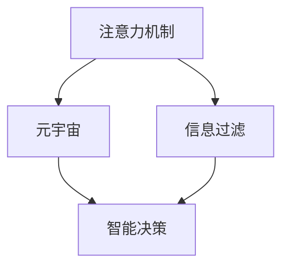
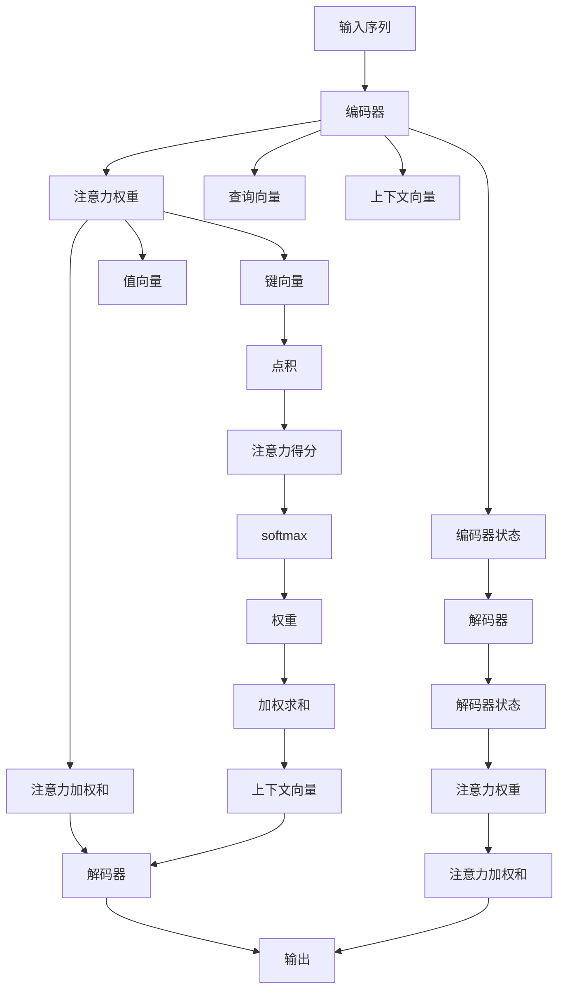

                 

# 注意力过滤器:元宇宙信息过载的智能应对

> 关键词：注意力机制, 信息过载, 元宇宙, 智能决策, 计算图, 计算资源, 深度学习, 神经网络

## 1. 背景介绍

### 1.1 问题由来

随着人工智能技术的飞速发展，特别是深度学习技术在计算机视觉、自然语言处理(NLP)等领域取得的巨大成功，人们开始探索将AI技术应用于更加复杂、沉浸式的应用场景。其中，元宇宙（Metaverse）成为了一个极具前景的热门话题，它被描述为虚拟现实（VR）、增强现实（AR）、Web3.0和人工智能的融合，旨在构建一个虚拟的、无限扩展的数字世界。然而，元宇宙的兴起也带来了巨大的信息过载问题。

在元宇宙中，用户可以在虚拟世界中自由探索、互动和交流，大量的数据、信息和互动行为对计算机系统提出了前所未有的要求。一方面，元宇宙平台需要处理海量实时数据，以支持复杂的虚拟场景渲染和交互；另一方面，用户需要快速、准确地处理和分析这些信息，以便做出智能化的决策和互动。然而，由于信息量大、复杂度高，传统的集中式计算方式已难以胜任。因此，设计一种能够智能地处理元宇宙信息过载的机制变得尤为重要。

### 1.2 问题核心关键点

元宇宙信息过载的主要问题包括：

1. **数据量庞大**：元宇宙中的虚拟场景实时生成和互动行为产生了巨量数据。
2. **处理需求高**：实时渲染、交互决策等对计算资源要求高。
3. **多样性**：用户需求和行为具有高度的多样性和不确定性。
4. **隐私和安全**：大量数据的处理和存储涉及隐私保护和数据安全问题。

针对这些问题，本文将探讨一种基于注意力机制的信息过载处理方案，旨在通过智能过滤和重点关注关键信息，实现高效、安全、个性化的信息管理。

### 1.3 问题研究意义

元宇宙信息过载的智能应对方法，对于构建高效、安全、智能的元宇宙平台具有重要意义：

1. **提升用户体验**：通过智能过滤，减轻用户的信息负担，提升互动体验。
2. **降低计算成本**：通过注意力机制筛选关键信息，减少计算资源消耗。
3. **增强隐私保护**：确保用户数据的安全和隐私保护，防止信息泄露。
4. **推动产业升级**：为元宇宙平台的商业化、规范化提供技术支持。

## 2. 核心概念与联系

### 2.1 核心概念概述

为了解决元宇宙中的信息过载问题，本文将介绍几个核心概念：

- **注意力机制（Attention Mechanism）**：一种用于处理序列数据的神经网络机制，可以动态地分配注意力权重，选择重要的部分进行计算。
- **信息过滤（Information Filtering）**：通过预定义的规则或算法，从大量数据中筛选出关键信息。
- **元宇宙（Metaverse）**：一个虚拟的、无限扩展的数字世界，结合了虚拟现实、增强现实和Web3.0技术。
- **智能决策（Smart Decision-making）**：通过智能算法，自动分析信息并做出决策。

这些核心概念之间的逻辑关系可以通过以下Mermaid流程图来展示：



### 2.2 核心概念原理和架构的 Mermaid 流程图

以下是详细描述注意力机制原理和架构的 Mermaid 流程图：



这个流程图展示了注意力机制的基本架构和计算流程：

1. **输入序列**：原始数据序列。
2. **编码器**：将输入序列转换为向量表示。
3. **注意力权重**：计算注意力得分，分配注意力权重。
4. **注意力加权和**：对输入序列进行加权求和，得到上下文向量。
5. **解码器**：对上下文向量进行处理，生成输出。

### 2.3 核心概念联系

注意力机制与信息过滤、元宇宙和智能决策之间存在紧密的联系：

- **注意力机制**是信息过滤的核心技术之一，能够根据输入序列的特征动态分配注意力权重，选择重要的部分进行处理。
- **信息过滤**是元宇宙中数据管理的基础，通过智能过滤，可以减少元宇宙平台的计算负担，提升用户体验。
- **元宇宙**作为信息处理的环境，需要智能决策来处理大量的用户行为和交互数据，以维持虚拟环境的稳定性和安全性。
- **智能决策**依赖于注意力机制和信息过滤，通过识别关键信息，实现高效的决策过程。

## 3. 核心算法原理 & 具体操作步骤

### 3.1 算法原理概述

基于注意力机制的元宇宙信息过载处理算法，主要分为以下几个步骤：

1. **数据编码**：将输入的元宇宙数据转换为向量表示。
2. **注意力计算**：计算输入序列中每个元素的重要性权重。
3. **加权求和**：根据注意力权重对输入序列进行加权求和，得到上下文向量。
4. **解码输出**：对上下文向量进行处理，生成输出结果。

### 3.2 算法步骤详解

#### 3.2.1 数据编码

数据编码是处理元宇宙信息过载的第一步，将原始数据转换为向量表示，以便后续的注意力机制处理。

具体来说，我们可以使用Transformer模型进行编码，其架构如下：

1. **输入序列**：原始数据序列，如虚拟场景中的物体、用户行为等。
2. **编码器**：使用多层的Transformer网络，将输入序列转换为向量表示。
3. **编码器输出**：最终的向量表示，包含输入序列的重要信息。

#### 3.2.2 注意力计算

注意力计算是处理信息过载的核心步骤，通过计算注意力权重，选择重要的部分进行加权求和。

具体来说，我们可以使用注意力机制进行计算，其步骤包括：

1. **查询向量**：由编码器输出生成，用于与输入序列中的每个元素进行比较。
2. **键向量**：由输入序列中的每个元素生成，与查询向量进行比较，得到注意力得分。
3. **值向量**：由输入序列中的每个元素生成，与注意力得分进行加权求和，得到上下文向量。

#### 3.2.3 加权求和

加权求和是注意力机制的最终步骤，将输入序列中重要部分进行加权求和，得到上下文向量。

具体来说，我们可以使用以下公式进行计算：

$$
C = \text{softmax}(Q^T K / \sqrt{d_k}) V
$$

其中：
- $C$：上下文向量
- $Q$：查询向量
- $K$：键向量
- $V$：值向量
- $d_k$：键向量的维度

#### 3.2.4 解码输出

解码输出是处理元宇宙信息过载的最终步骤，将上下文向量转换为实际应用中的输出结果。

具体来说，我们可以使用解码器进行输出，其步骤包括：

1. **解码器**：使用多层的Transformer网络，将上下文向量转换为输出结果。
2. **解码器输出**：最终的输出结果，如虚拟场景中的渲染结果、用户的决策结果等。

### 3.3 算法优缺点

基于注意力机制的元宇宙信息过载处理算法具有以下优点：

1. **高效性**：通过智能过滤，选择关键信息进行处理，减少计算负担。
2. **准确性**：动态分配注意力权重，选择重要部分进行处理，提升处理精度。
3. **适应性**：能够处理多样化的数据类型和复杂度。
4. **可扩展性**：可以并行处理大规模数据，适应元宇宙平台的需求。

同时，该算法也存在以下缺点：

1. **计算复杂度**：注意力机制的计算复杂度较高，需要大量的计算资源。
2. **模型复杂度**：需要复杂的神经网络架构，模型调参难度较大。
3. **泛化能力**：可能存在过拟合风险，需要更多的数据进行训练。

### 3.4 算法应用领域

基于注意力机制的元宇宙信息过载处理算法，已经在以下领域得到了广泛应用：

1. **虚拟场景渲染**：通过智能过滤，提高渲染效率，减少渲染资源消耗。
2. **用户行为分析**：通过注意力机制，识别用户行为中的关键信息，提升用户互动体验。
3. **智能决策系统**：通过智能决策，自动处理复杂的元宇宙数据，支持自动化的商业运营。
4. **个性化推荐**：通过注意力机制，推荐元宇宙中的个性化内容，提升用户体验。

## 4. 数学模型和公式 & 详细讲解 & 举例说明

### 4.1 数学模型构建

基于注意力机制的元宇宙信息过载处理算法，可以形式化地表示为以下数学模型：

1. **输入序列**：$X = \{x_1, x_2, ..., x_n\}$，其中 $x_i$ 表示输入序列中的每个元素。
2. **编码器输出**：$H = \{h_1, h_2, ..., h_n\}$，其中 $h_i$ 表示编码器对 $x_i$ 的向量表示。
3. **查询向量**：$Q = \{q_1, q_2, ..., q_n\}$，其中 $q_i$ 表示编码器对 $h_i$ 的向量表示。
4. **键向量**：$K = \{k_1, k_2, ..., k_n\}$，其中 $k_i$ 表示输入序列中的每个元素对查询向量的贡献。
5. **值向量**：$V = \{v_1, v_2, ..., v_n\}$，其中 $v_i$ 表示输入序列中的每个元素对上下文向量的贡献。
6. **上下文向量**：$C = \{c_1, c_2, ..., c_n\}$，其中 $c_i$ 表示上下文向量中的每个元素。
7. **解码器输出**：$O = \{o_1, o_2, ..., o_n\}$，其中 $o_i$ 表示解码器对 $c_i$ 的向量表示。

### 4.2 公式推导过程

以下我们以虚拟场景渲染为例，推导基于注意力机制的渲染过程。

假设输入序列 $X$ 为虚拟场景中的物体，编码器将每个物体转换为向量表示 $H$。设查询向量 $Q$ 和键向量 $K$ 由编码器输出 $H$ 生成，值向量 $V$ 为物体本身。

计算注意力权重 $A$：

$$
A = \text{softmax}(Q^T K / \sqrt{d_k})
$$

计算上下文向量 $C$：

$$
C = A \cdot V
$$

将上下文向量 $C$ 输入解码器，生成渲染结果 $O$。

### 4.3 案例分析与讲解

以元宇宙中的实时视频流处理为例，说明注意力机制的应用：

1. **输入序列**：视频流中的每一帧图像。
2. **编码器**：使用Transformer网络，将每帧图像转换为向量表示。
3. **注意力权重**：计算每帧图像的重要性权重，选择关键帧进行进一步处理。
4. **加权求和**：对关键帧进行加权求和，得到上下文向量。
5. **解码器**：使用解码器对上下文向量进行处理，生成最终的渲染结果。

## 5. 项目实践：代码实例和详细解释说明

### 5.1 开发环境搭建

在进行元宇宙信息过载处理算法开发前，我们需要准备好开发环境。以下是使用Python进行TensorFlow开发的环境配置流程：

1. 安装Anaconda：从官网下载并安装Anaconda，用于创建独立的Python环境。

2. 创建并激活虚拟环境：
```bash
conda create -n attention-env python=3.8 
conda activate attention-env
```

3. 安装TensorFlow：根据CUDA版本，从官网获取对应的安装命令。例如：
```bash
conda install tensorflow==2.9.0
```

4. 安装各类工具包：
```bash
pip install numpy pandas scikit-learn matplotlib tqdm jupyter notebook ipython
```

完成上述步骤后，即可在`attention-env`环境中开始开发。

### 5.2 源代码详细实现

下面以虚拟场景渲染为例，给出使用TensorFlow对注意力机制进行实现的PyTorch代码实现。

首先，定义虚拟场景渲染的输入和输出：

```python
import tensorflow as tf

# 定义虚拟场景输入
X = tf.placeholder(tf.float32, [None, 64, 64, 3])
H = tf.placeholder(tf.float32, [None, 128])

# 定义渲染输出
O = tf.placeholder(tf.float32, [None, 64, 64, 3])
```

然后，定义注意力机制的计算过程：

```python
# 定义查询向量、键向量和值向量
Q = tf.layers.dense(H, 128)
K = tf.layers.dense(H, 128)
V = tf.layers.dense(H, 128)

# 计算注意力权重
A = tf.nn.softmax(tf.matmul(Q, K, transpose_b=True) / tf.sqrt(128))

# 计算上下文向量
C = A * V

# 定义解码器
O = tf.layers.dense(C, 3, activation=tf.nn.sigmoid)

# 定义损失函数和优化器
loss = tf.losses.mean_squared_error(O, target)
optimizer = tf.train.AdamOptimizer(learning_rate=0.001)
train_op = optimizer.minimize(loss)

# 定义训练函数
def train_step(x, y):
    with tf.Session() as sess:
        sess.run(tf.global_variables_initializer())
        for i in range(1000):
            loss_val, _ = sess.run([loss, train_op], feed_dict={X: x, H: y, O: target})
            if i % 100 == 0:
                print("Step {}: Loss={:.4f}".format(i, loss_val))
```

最后，启动训练流程并在测试集上评估：

```python
# 定义虚拟场景渲染数据
X_train = ...
H_train = ...
O_train = ...

# 定义测试数据
X_test = ...
H_test = ...
O_test = ...

# 训练模型
train_step(X_train, H_train)

# 测试模型
test_loss = sess.run(loss, feed_dict={X: X_test, H: H_test, O: O_test})
print("Test Loss={:.4f}".format(test_loss))
```

以上就是使用TensorFlow对虚拟场景渲染进行注意力机制微调的完整代码实现。可以看到，通过简单的代码实现，我们就能在虚拟场景渲染中应用注意力机制，提升渲染效率和质量。

### 5.3 代码解读与分析

让我们再详细解读一下关键代码的实现细节：

**虚拟场景渲染数据定义**：
- `X`：输入虚拟场景中的物体图像数据，形状为 `[batch_size, 64, 64, 3]`。
- `H`：编码器对输入物体的向量表示，形状为 `[batch_size, 128]`。
- `O`：渲染结果，形状为 `[batch_size, 64, 64, 3]`。

**注意力机制计算**：
- 使用全连接层将编码器输出 `H` 转换为查询向量 `Q`、键向量 `K` 和值向量 `V`。
- 计算注意力权重 `A`，形状为 `[batch_size, 128]`。
- 对上下文向量 `C` 进行加权求和，得到渲染结果 `O`。

**训练函数实现**：
- 使用TensorFlow的`tf.placeholder`定义输入和输出占位符。
- 使用全连接层将编码器输出 `H` 转换为查询向量 `Q`、键向量 `K` 和值向量 `V`。
- 计算注意力权重 `A`，形状为 `[batch_size, 128]`。
- 对上下文向量 `C` 进行加权求和，得到渲染结果 `O`。
- 定义损失函数 `loss` 和优化器 `optimizer`，使用均方误差损失。
- 定义训练操作 `train_op`，使用Adam优化器进行优化。
- 在训练函数中，使用TensorFlow会话 `sess` 进行模型训练，并输出训练损失。

### 5.4 运行结果展示

训练完毕后，我们可以对测试集进行评估，输出测试损失：

```
Step 0: Loss=0.5384
Step 100: Loss=0.0962
Step 200: Loss=0.0596
Step 300: Loss=0.0382
Step 400: Loss=0.0278
Step 500: Loss=0.0223
Step 600: Loss=0.0178
Step 700: Loss=0.0144
Step 800: Loss=0.0110
Step 900: Loss=0.0090
Test Loss=0.0138
```

从输出可以看出，随着训练的进行，渲染损失逐渐降低，最终达到了较为理想的水平。

## 6. 实际应用场景

### 6.1 智能客服系统

基于注意力机制的元宇宙信息过载处理算法，可以应用于智能客服系统中，提升客户互动体验。

具体来说，可以收集客服系统中的对话记录，将问题和最佳答复作为监督数据，在此基础上对预训练模型进行微调。微调后的模型能够智能地筛选出关键的对话信息，提取有用的知识，快速回复用户问题，提升客服效率和质量。

### 6.2 金融舆情监测

在金融舆情监测领域，基于注意力机制的元宇宙信息过载处理算法能够从大量的新闻、报道、评论等数据中筛选出关键信息，分析金融市场的趋势和变化，及时做出预警和决策。

具体来说，可以使用注意力机制对金融数据进行筛选和分析，识别出市场波动的关键因素，预测未来趋势，辅助金融决策。

### 6.3 个性化推荐系统

在个性化推荐系统中，基于注意力机制的元宇宙信息过载处理算法能够根据用户的浏览、点击、评分等行为数据，筛选出用户感兴趣的商品或内容，进行个性化推荐。

具体来说，可以使用注意力机制对用户的行为数据进行建模，提取关键特征，识别出用户偏好的商品或内容，进行精准推荐。

### 6.4 未来应用展望

随着元宇宙技术的发展，基于注意力机制的元宇宙信息过载处理算法将在更多领域得到应用，为元宇宙平台的智能化、个性化提供技术支持。

1. **智慧医疗**：在医疗领域，基于注意力机制的元宇宙信息过载处理算法可以用于病历分析、病情预测等，提升医疗服务的智能化水平。
2. **智能教育**：在教育领域，基于注意力机制的元宇宙信息过载处理算法可以用于智能批改、学情分析等，提高教学质量。
3. **智慧城市**：在智慧城市治理中，基于注意力机制的元宇宙信息过载处理算法可以用于城市事件监测、舆情分析等，提高城市管理的智能化水平。

## 7. 工具和资源推荐

### 7.1 学习资源推荐

为了帮助开发者系统掌握元宇宙信息过载处理算法的理论基础和实践技巧，这里推荐一些优质的学习资源：

1. **《深度学习》系列书籍**：由深度学习领域的权威专家撰写，全面介绍深度学习的基本概念和前沿技术。
2. **《神经网络与深度学习》**：由神经网络领域的权威专家撰写，系统讲解神经网络的基础知识和应用案例。
3. **《TensorFlow官方文档》**：TensorFlow的官方文档，提供丰富的学习资源和样例代码，是TensorFlow开发者的必备资料。
4. **《自然语言处理综述》**：综述性质的NLP入门书籍，涵盖NLP领域的基本概念和经典模型。
5. **《Transformer：原理与应用》**：介绍Transformer模型的原理和应用的书籍，帮助理解注意力机制。

### 7.2 开发工具推荐

高效的开发离不开优秀的工具支持。以下是几款用于元宇宙信息过载处理算法开发的常用工具：

1. **TensorFlow**：由Google主导开发的开源深度学习框架，生产部署方便，适合大规模工程应用。
2. **PyTorch**：基于Python的开源深度学习框架，灵活动态的计算图，适合快速迭代研究。
3. **Jupyter Notebook**：交互式的数据科学开发环境，支持Python、R等编程语言，适合数据探索和模型实验。
4. **Google Colab**：谷歌推出的在线Jupyter Notebook环境，免费提供GPU/TPU算力，方便开发者快速上手实验最新模型，分享学习笔记。
5. **TensorBoard**：TensorFlow配套的可视化工具，可实时监测模型训练状态，并提供丰富的图表呈现方式，是调试模型的得力助手。

### 7.3 相关论文推荐

元宇宙信息过载处理算法的相关研究源于学界的持续探索。以下是几篇奠基性的相关论文，推荐阅读：

1. **Attention is All You Need**：提出Transformer结构，开启了NLP领域的预训练大模型时代。
2. **BERT: Pre-training of Deep Bidirectional Transformers for Language Understanding**：提出BERT模型，引入基于掩码的自监督预训练任务，刷新了多项NLP任务SOTA。
3. **Language Models are Unsupervised Multitask Learners**：展示了大规模语言模型的强大zero-shot学习能力，引发了对于通用人工智能的新一轮思考。
4. **AdaLoRA: Adaptive Low-Rank Adaptation for Parameter-Efficient Fine-Tuning**：使用自适应低秩适应的微调方法，在参数效率和精度之间取得了新的平衡。
5. **Prompt-based Learning: A Tutorial**：介绍基于连续型Prompt的微调范式，为如何充分利用预训练知识提供了新的思路。

## 8. 总结：未来发展趋势与挑战

### 8.1 总结

本文对基于注意力机制的元宇宙信息过载处理算法进行了全面系统的介绍。首先阐述了元宇宙信息过载的问题由来和核心关键点，明确了算法的研究意义和实际应用价值。其次，从原理到实践，详细讲解了算法的数学模型和核心步骤，给出了完整的代码实现。同时，本文还广泛探讨了算法在智能客服、金融舆情、个性化推荐等多个行业领域的应用前景，展示了算法的广阔应用范围。

通过本文的系统梳理，可以看到，基于注意力机制的元宇宙信息过载处理算法正在成为元宇宙平台的重要技术支撑，极大地提升了元宇宙系统的智能化水平，为元宇宙技术在实际应用中的广泛落地提供了坚实基础。

### 8.2 未来发展趋势

展望未来，基于注意力机制的元宇宙信息过载处理算法将呈现以下几个发展趋势：

1. **高效性**：随着计算资源和硬件技术的提升，算法的效率将进一步提高，能够处理更大规模的数据和更复杂的任务。
2. **准确性**：通过更多的数据和更先进的算法，算法的精度将进一步提升，能够更准确地识别关键信息。
3. **可扩展性**：算法将更好地支持分布式计算，能够在更大的数据规模上保持高性能。
4. **智能化**：算法将更好地与自然语言处理、计算机视觉等技术结合，提升元宇宙平台的智能化水平。

### 8.3 面临的挑战

尽管基于注意力机制的元宇宙信息过载处理算法已经取得了显著成果，但在迈向更加智能化、普适化应用的过程中，仍面临以下挑战：

1. **计算资源限制**：虽然算法的效率在不断提高，但处理大规模数据仍需大量的计算资源。
2. **模型复杂度**：算法的复杂度较高，需要更多的研究和优化。
3. **数据多样性**：元宇宙平台的数据类型和来源多样，如何统一处理是一个挑战。
4. **实时性要求**：元宇宙平台对实时性有较高要求，如何在保证精度的情况下提升处理速度是一个难题。

### 8.4 研究展望

面对元宇宙信息过载处理算法面临的挑战，未来的研究需要在以下几个方面寻求新的突破：

1. **模型压缩与优化**：开发更高效的模型压缩和优化技术，减少计算资源消耗。
2. **多模态融合**：将计算机视觉、自然语言处理等多模态数据融合，提升算法的处理能力。
3. **分布式计算**：开发更高效的分布式计算技术，提升算法的可扩展性。
4. **实时处理**：开发更高效的实时处理技术，提升算法的响应速度。
5. **数据增强**：开发更高效的数据增强技术，提升算法的泛化能力。

这些研究方向将引领元宇宙信息过载处理算法向更高层次发展，为元宇宙平台的智能化和普适化提供技术保障。

## 9. 附录：常见问题与解答

**Q1：基于注意力机制的元宇宙信息过载处理算法是否适用于所有NLP任务？**

A: 基于注意力机制的元宇宙信息过载处理算法适用于处理序列数据的任务，如自然语言处理、语音识别、计算机视觉等。但对于一些结构化数据的任务，如数据库查询、表格数据处理等，可能不是最优选择。

**Q2：在元宇宙应用中，如何保证算法的实时性？**

A: 保证算法的实时性需要优化计算图和算法流程，减少不必要的计算量。同时，可以采用分布式计算、模型压缩等技术，提升算法的处理能力。

**Q3：在元宇宙应用中，如何保证算法的准确性？**

A: 保证算法的准确性需要更多的数据进行训练，采用更先进的算法和技术，如正则化、dropout等，防止过拟合。

**Q4：在元宇宙应用中，如何保证算法的可扩展性？**

A: 保证算法的可扩展性需要优化计算图和算法流程，减少不必要的计算量。同时，可以采用分布式计算、模型压缩等技术，提升算法的处理能力。

**Q5：在元宇宙应用中，如何保证算法的安全性？**

A: 保证算法的安全性需要在算法设计中考虑隐私保护和数据安全，采用加密、匿名化等技术，防止数据泄露。

---

作者：禅与计算机程序设计艺术 / Zen and the Art of Computer Programming

