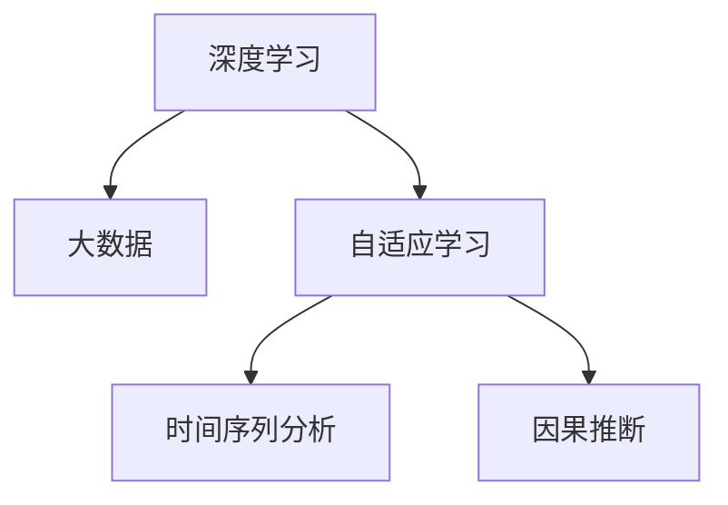

                 

# 洞察力与未来学：预测与塑造未来的能力

> 关键词：未来预测, 人工智能, 深度学习, 大数据, 自适应学习, 机器学习, 数据科学

## 1. 背景介绍

### 1.1 问题由来
随着数字化时代的到来，大数据和人工智能技术的应用愈发广泛。数据分析和机器学习模型已经成为决策制定和趋势预测的重要工具。但随着数据量的爆炸式增长和算法的日益复杂，预测和决策的难度也随之增加。如何在海量数据和复杂模型中提取有价值的洞察力，并利用这些洞察力进行未来学研究，成为了一个亟待解决的问题。

### 1.2 问题核心关键点
未来学研究的核心在于预测未来的发展趋势和潜在变化，从而为决策提供依据。数据驱动的洞察力与机器学习模型在此过程中起到了至关重要的作用。借助大数据分析，我们能够提取有用的模式和规律，并利用深度学习模型对这些规律进行建模和预测。然而，传统的统计分析和机器学习模型往往忽视了模型自适应学习能力的重要性，使得预测结果与实际变化存在差距。因此，如何在复杂环境中增强模型的自适应学习能力，提高预测的准确性，成为了未来学研究的重点。

### 1.3 问题研究意义
未来学研究对于理解社会、经济和技术的发展趋势至关重要。通过深度学习和大数据技术，我们能够捕捉和分析不同领域的数据，揭示隐藏的模式和关联。这不仅能够帮助企业和政府做出更准确的预测和决策，还能够揭示出未来可能面临的挑战和机遇，为政策制定和资源配置提供科学依据。因此，通过深度学习模型增强自适应学习能力，对于提升预测和决策的准确性，推动社会的可持续发展具有重要意义。

## 2. 核心概念与联系

### 2.1 核心概念概述

为更好地理解未来学研究中深度学习模型的应用，本节将介绍几个关键概念：

- **深度学习**：一种基于人工神经网络的机器学习方法，通过多层非线性变换，能够从复杂数据中提取高层次的抽象特征。
- **大数据**：指规模巨大、多样化和快速变化的数据集，涵盖了结构化、半结构化和非结构化数据，是大数据分析的基础。
- **自适应学习**：指模型能够根据新的数据和环境变化，动态调整内部参数和结构，提高模型的泛化能力和鲁棒性。
- **时间序列分析**：一种预测未来趋势的方法，通过分析时间序列数据中的规律，预测未来的变化趋势。
- **因果推断**：通过研究变量之间的因果关系，理解不同因素对未来发展的影响，提高预测的准确性。

这些核心概念之间的逻辑关系可以通过以下Mermaid流程图来展示：



这个流程图展示了大数据、深度学习、自适应学习和时间序列分析、因果推断之间的紧密联系。通过这些关键技术，未来学研究能够揭示隐藏在数据背后的规律，从而做出更加准确的预测。

## 3. 核心算法原理 & 具体操作步骤
### 3.1 算法原理概述

未来学研究中深度学习模型的核心算法原理是自适应学习。自适应学习指模型能够根据新的数据和环境变化，动态调整内部参数和结构，提高模型的泛化能力和鲁棒性。在深度学习模型中，自适应学习通常通过以下步骤实现：

1. **数据准备**：收集和清洗与未来学研究相关的数据集，如历史数据、传感器数据等。
2. **模型训练**：利用历史数据对深度学习模型进行训练，学习数据中的规律和模式。
3. **模型评估**：在验证集上评估模型的性能，选择表现最好的模型进行下一步操作。
4. **模型调优**：根据评估结果，调整模型参数和结构，提高模型的泛化能力和鲁棒性。
5. **模型预测**：利用训练好的模型对未来的发展趋势进行预测，并提供决策依据。

### 3.2 算法步骤详解

未来学研究中深度学习模型的具体操作步骤如下：

**Step 1: 数据准备**
- 收集与未来学研究相关的数据集，如历史数据、传感器数据等。
- 对数据进行清洗和预处理，包括缺失值填补、异常值检测等操作。

**Step 2: 模型训练**
- 选择适合的深度学习模型，如卷积神经网络(CNN)、循环神经网络(RNN)、长短期记忆网络(LSTM)等。
- 利用历史数据对模型进行训练，学习数据中的规律和模式。
- 通过交叉验证等方法评估模型的性能，选择表现最好的模型进行下一步操作。

**Step 3: 模型调优**
- 根据模型在验证集上的表现，调整模型的超参数，如学习率、批大小、隐藏层数等。
- 引入正则化技术，如L2正则、Dropout等，防止模型过拟合。
- 使用自适应学习算法，如自适应梯度算法(AdaGrad)、自适应矩估计(RMSprop)等，动态调整模型参数。

**Step 4: 模型预测**
- 利用训练好的模型对未来的发展趋势进行预测。
- 利用时间序列分析和因果推断方法，分析预测结果中的因果关系，提高预测的准确性。

### 3.3 算法优缺点

自适应学习算法的优点在于能够动态调整模型参数和结构，提高模型的泛化能力和鲁棒性。但在实际应用中也存在一些缺点：

- **计算复杂度高**：自适应学习算法需要大量计算资源，特别是在大规模数据集上训练时。
- **模型参数多**：自适应学习算法通常需要调整大量的模型参数，增加了模型的复杂度。
- **过拟合风险高**：自适应学习算法在数据集较小或特征较为复杂时，容易发生过拟合现象。
- **模型可解释性差**：自适应学习算法的内部机制较为复杂，模型的决策过程难以解释。

尽管存在这些局限性，自适应学习算法在预测未来趋势和提高决策准确性方面具有重要意义，是未来学研究中不可或缺的工具。

### 3.4 算法应用领域

未来学研究中深度学习模型的应用领域广泛，涵盖了以下几个方面：

- **金融预测**：利用历史数据和市场信息，预测股票、债券等金融产品的未来走势。
- **医疗诊断**：通过分析患者的历史数据和医疗记录，预测疾病的发展趋势和潜在风险。
- **能源管理**：利用传感器数据和历史用电信息，预测能源消耗的变化趋势，优化能源分配。
- **城市规划**：通过分析交通、环境等数据，预测城市发展的趋势，指导城市规划和建设。
- **智能制造**：利用机器和传感器数据，预测生产线上的异常和故障，提高生产效率和质量。

## 4. 数学模型和公式 & 详细讲解
### 4.1 数学模型构建

未来学研究中深度学习模型的数学模型通常包括两个部分：输入数据和输出预测。设输入数据为 $X$，输出预测为 $Y$，深度学习模型的数学模型可表示为：

$$ Y = f(X; \theta) $$

其中 $f$ 表示模型函数， $\theta$ 为模型参数。

### 4.2 公式推导过程

以线性回归模型为例，介绍未来学研究中深度学习模型的公式推导过程：

**线性回归模型**：

$$ Y = \theta_0 + \theta_1 X_1 + \theta_2 X_2 + ... + \theta_n X_n + \epsilon $$

其中 $\theta_0, \theta_1, ..., \theta_n$ 为模型参数，$\epsilon$ 为误差项。

**最小二乘法**：

$$ \hat{\theta} = \arg\min_{\theta} \frac{1}{N} \sum_{i=1}^N (Y_i - f(X_i; \theta))^2 $$

利用最小二乘法，求解模型参数 $\hat{\theta}$，使模型预测结果与实际结果误差最小。

**梯度下降算法**：

$$ \theta \leftarrow \theta - \eta \nabla_{\theta} \mathcal{L}(\theta) $$

其中 $\eta$ 为学习率，$\mathcal{L}(\theta)$ 为损失函数。

通过梯度下降算法，不断调整模型参数 $\theta$，使得模型预测结果更加准确。

### 4.3 案例分析与讲解

以金融预测为例，介绍如何使用深度学习模型进行未来学研究。

**数据准备**：
- 收集股票历史价格、交易量、市场指数等数据。
- 对数据进行清洗和预处理，去除异常值和缺失值。

**模型训练**：
- 选择LSTM模型，利用历史数据对模型进行训练，学习数据中的规律和模式。
- 通过交叉验证评估模型性能，选择表现最好的模型进行下一步操作。

**模型调优**：
- 调整模型的超参数，如学习率、批大小、隐藏层数等。
- 引入正则化技术，如L2正则、Dropout等，防止模型过拟合。

**模型预测**：
- 利用训练好的LSTM模型对未来股票价格进行预测。
- 利用时间序列分析和因果推断方法，分析预测结果中的因果关系，提高预测的准确性。

## 5. 项目实践：代码实例和详细解释说明
### 5.1 开发环境搭建

在进行未来学研究中深度学习模型开发前，需要先准备好开发环境。以下是使用Python进行TensorFlow开发的环境配置流程：

1. 安装Anaconda：从官网下载并安装Anaconda，用于创建独立的Python环境。

2. 创建并激活虚拟环境：
```bash
conda create -n tf-env python=3.8 
conda activate tf-env
```

3. 安装TensorFlow：根据CUDA版本，从官网获取对应的安装命令。例如：
```bash
conda install tensorflow-gpu -c conda-forge -c pypi
```

4. 安装各类工具包：
```bash
pip install numpy pandas scikit-learn matplotlib tqdm jupyter notebook ipython
```

完成上述步骤后，即可在`tf-env`环境中开始深度学习模型的开发。

### 5.2 源代码详细实现

下面以线性回归模型为例，给出使用TensorFlow进行未来学研究的PyTorch代码实现。

首先，定义线性回归模型的输入数据和标签：

```python
import tensorflow as tf
import numpy as np

# 定义输入数据
X = np.array([[1, 2], [3, 4], [5, 6], [7, 8], [9, 10]], dtype=float)

# 定义标签
Y = np.array([[2], [4], [6], [8], [10]], dtype=float)
```

然后，定义模型：

```python
# 定义线性回归模型
class LinearRegressionModel(tf.keras.Model):
    def __init__(self, input_dim, output_dim):
        super(LinearRegressionModel, self).__init__()
        self.linear = tf.keras.layers.Dense(output_dim, input_dim=input_dim)

    def call(self, inputs):
        x = self.linear(inputs)
        return x
```

接着，定义损失函数和优化器：

```python
# 定义损失函数
loss_fn = tf.keras.losses.MeanSquaredError()

# 定义优化器
optimizer = tf.keras.optimizers.SGD(learning_rate=0.01)
```

最后，启动训练流程并在测试集上评估：

```python
# 定义训练集和测试集
train_dataset = tf.data.Dataset.from_tensor_slices((X, Y)).batch(2)
test_dataset = tf.data.Dataset.from_tensor_slices((X, Y)).batch(2)

# 定义训练循环
@tf.function
def train_step(phase, inputs, labels):
    with tf.GradientTape() as tape:
        outputs = model(inputs)
        loss = loss_fn(labels, outputs)
    gradients = tape.gradient(loss, model.trainable_variables)
    optimizer.apply_gradients(zip(gradients, model.trainable_variables))

# 训练模型
num_epochs = 100
for epoch in range(num_epochs):
    for phase, (batch_x, batch_y) in enumerate(train_dataset):
        train_step(phase, batch_x, batch_y)

    # 在测试集上评估模型
    test_loss = tf.keras.metrics.Mean()
    for test_x, test_y in test_dataset:
        test_loss.update_state(test_y, model(test_x))
    print(f"Epoch {epoch+1}, test loss: {test_loss.result().numpy():.4f}")
```

以上就是使用TensorFlow进行未来学研究的完整代码实现。可以看到，TensorFlow提供了丰富的API和工具，能够方便地实现深度学习模型的训练和预测。

### 5.3 代码解读与分析

让我们再详细解读一下关键代码的实现细节：

**X和Y的定义**：
- 使用NumPy库定义输入数据和标签。

**模型定义**：
- 定义线性回归模型，包括一个全连接层。

**损失函数和优化器**：
- 定义均方误差损失函数和随机梯度下降优化器。

**训练循环**：
- 使用tf.function装饰器将训练循环定义为可图化的函数。
- 在训练循环中，通过tf.GradientTape记录梯度，并使用optimizer.apply_gradients更新模型参数。
- 在测试集上计算损失，并输出测试损失。

可以看出，TensorFlow的API和工具大大简化了深度学习模型的开发过程，使得开发者能够更专注于模型设计和算法优化。

## 6. 实际应用场景
### 6.1 金融预测

在金融预测领域，深度学习模型可以应用于股票价格预测、债券收益率预测等任务。通过收集历史金融数据，利用深度学习模型学习数据中的规律和模式，能够预测未来金融市场的变化趋势，帮助投资者做出更明智的决策。

### 6.2 医疗诊断

在医疗诊断领域，深度学习模型可以应用于疾病预测、治疗方案优化等任务。通过分析患者的历史数据和医疗记录，利用深度学习模型学习数据中的规律和模式，能够预测疾病的发展趋势和潜在风险，指导医生制定更有效的治疗方案。

### 6.3 能源管理

在能源管理领域，深度学习模型可以应用于能源消耗预测、设备故障预测等任务。通过分析传感器数据和历史用电信息，利用深度学习模型学习数据中的规律和模式，能够预测能源消耗的变化趋势，优化能源分配，提高能源利用效率。

### 6.4 城市规划

在城市规划领域，深度学习模型可以应用于交通流量预测、环境污染预测等任务。通过分析交通、环境等数据，利用深度学习模型学习数据中的规律和模式，能够预测城市发展的趋势，指导城市规划和建设，提升城市管理水平。

### 6.5 智能制造

在智能制造领域，深度学习模型可以应用于生产线异常预测、设备故障预测等任务。通过分析机器和传感器数据，利用深度学习模型学习数据中的规律和模式，能够预测生产线上的异常和故障，提高生产效率和质量。

## 7. 工具和资源推荐
### 7.1 学习资源推荐

为了帮助开发者系统掌握未来学研究中深度学习模型的理论基础和实践技巧，这里推荐一些优质的学习资源：

1. 《深度学习》系列博文：由大模型技术专家撰写，深入浅出地介绍了深度学习原理、算法和应用。

2. 《TensorFlow实战》书籍：TensorFlow的官方教程，涵盖了TensorFlow的各个方面，包括模型构建、训练、推理等。

3. 《PyTorch深度学习》书籍：PyTorch的官方教程，详细介绍了PyTorch的API和工具，适合TensorFlow开发者学习。

4. Coursera《深度学习》课程：由斯坦福大学教授Andrew Ng主讲的深度学习课程，覆盖了深度学习的基本概念和算法。

5. Kaggle数据科学竞赛：Kaggle提供了丰富的数据集和竞赛任务，适合练习深度学习模型的应用。

通过对这些资源的学习实践，相信你一定能够快速掌握未来学研究中深度学习模型的精髓，并用于解决实际的未来学问题。
###  7.2 开发工具推荐

高效的开发离不开优秀的工具支持。以下是几款用于未来学研究中深度学习模型开发的常用工具：

1. TensorFlow：由Google主导开发的深度学习框架，生产部署方便，适合大规模工程应用。提供了丰富的API和工具，方便开发和部署。

2. PyTorch：基于Python的开源深度学习框架，灵活动态的计算图，适合快速迭代研究。提供了丰富的模型和算法库，适合学术研究和算法开发。

3. Keras：基于TensorFlow和Theano的高级API，易于上手，适合初学者和快速原型开发。

4. Scikit-learn：基于Python的机器学习库，提供了丰富的模型和算法，适合快速建模和分析。

5. Jupyter Notebook：基于IPython的交互式编程环境，方便代码编写和结果展示。

合理利用这些工具，可以显著提升未来学研究中深度学习模型的开发效率，加快创新迭代的步伐。

### 7.3 相关论文推荐

未来学研究中深度学习模型的发展源于学界的持续研究。以下是几篇奠基性的相关论文，推荐阅读：

1. 《深度学习》：Yoshua Bengio等人编写的深度学习教材，详细介绍了深度学习的原理和应用。

2. 《使用卷积神经网络进行图像分类》：Alex Krizhevsky等人提出的CNN模型，在ImageNet数据集上取得了很好的效果。

3. 《使用长短期记忆网络进行序列预测》：Sepp Hochreiter等人提出的LSTM模型，在时间序列预测任务中表现优异。

4. 《使用神经网络进行自然语言处理》：Andrej Karpathy等人提出的语言模型，在自然语言处理任务中取得了很好的效果。

5. 《使用自适应学习算法进行机器学习》：Tadashi Yamashita等人提出的自适应学习算法，能够动态调整模型参数，提高模型的泛化能力和鲁棒性。

这些论文代表了大模型研究的发展脉络。通过学习这些前沿成果，可以帮助研究者把握学科前进方向，激发更多的创新灵感。

## 8. 总结：未来发展趋势与挑战
### 8.1 总结

本文对未来学研究中深度学习模型的相关内容进行了全面系统的介绍。首先阐述了未来学研究中深度学习模型的核心算法原理，详细讲解了自适应学习算法的具体步骤。其次，从原理到实践，介绍了未来学研究中深度学习模型的操作步骤和注意事项。最后，本文还探讨了深度学习模型在实际应用中的广泛应用场景，推荐了一些优质的学习资源和工具。

通过本文的系统梳理，可以看到，未来学研究中深度学习模型具有广阔的应用前景和重要的研究价值。未来，伴随深度学习模型的不断演进，其在金融预测、医疗诊断、能源管理、城市规划、智能制造等领域的应用将进一步拓展，为社会经济的发展带来深远影响。

### 8.2 未来发展趋势

展望未来，未来学研究中深度学习模型的发展趋势如下：

1. **模型规模持续增大**：随着算力成本的下降和数据规模的扩张，深度学习模型的参数量还将持续增长。超大规模模型蕴含的丰富知识，有望支撑更加复杂多变的未来学预测任务。

2. **自适应学习能力增强**：未来的深度学习模型将更加注重自适应学习能力的提升，能够根据新的数据和环境变化，动态调整内部参数和结构，提高模型的泛化能力和鲁棒性。

3. **时间序列分析和因果推断方法的发展**：时间序列分析和因果推断方法将成为未来学研究中深度学习模型的重要组成部分，提高预测的准确性和可靠性。

4. **跨领域融合的趋势**：未来的深度学习模型将更加注重跨领域融合，融合视觉、语音、文本等多模态信息，提高对复杂问题的理解和建模能力。

5. **模型可解释性和可控性的提升**：未来的深度学习模型将更加注重模型可解释性和可控性，通过可视化工具和方法，增强模型的决策过程和输出结果的可解释性。

6. **伦理道德和社会责任的重视**：未来的深度学习模型将更加注重伦理道德和社会责任，避免模型偏见和有害影响，确保模型的公平性和安全性。

以上趋势凸显了未来学研究中深度学习模型的广阔前景。这些方向的探索发展，必将进一步提升未来学研究中的深度学习模型的性能和应用范围，为社会经济的发展提供有力的支持。

### 8.3 面临的挑战

尽管未来学研究中深度学习模型在预测未来趋势方面取得了显著进展，但在迈向更加智能化、普适化应用的过程中，仍面临诸多挑战：

1. **数据质量和数据量不足**：深度学习模型需要大量的高质量数据进行训练，但数据获取和标注成本高，难以满足大规模应用的需求。

2. **模型复杂度高**：深度学习模型通常需要调整大量的模型参数，增加了模型的复杂度，对计算资源和存储空间提出了更高的要求。

3. **模型泛化能力不足**：深度学习模型在面对新数据时，泛化能力往往不足，难以应对数据分布变化和环境变化。

4. **模型可解释性差**：深度学习模型的内部机制较为复杂，模型的决策过程难以解释，增加了模型应用的复杂性和风险。

5. **模型安全性问题**：深度学习模型可能学习到有偏见、有害的信息，通过预测和决策传递到实际应用中，带来安全隐患。

6. **伦理道德和法律责任**：深度学习模型在应用过程中可能涉及伦理道德和法律责任问题，需要制定相应的规范和标准。

面对这些挑战，未来的深度学习模型需要在数据获取、模型设计、训练优化、模型评估、模型应用等方面进行全面的改进和优化，方能更好地服务于未来学研究和社会经济的发展。

### 8.4 研究展望

未来的研究需要在以下几个方面寻求新的突破：

1. **无监督学习和自监督学习的探索**：探索无监督学习和自监督学习方法，减少对标注数据的依赖，利用未标注数据进行模型训练和预测。

2. **跨领域融合技术的研究**：研究跨领域融合技术，将视觉、语音、文本等多模态信息融合，提高模型的泛化能力和适应性。

3. **模型可解释性增强**：研究模型可解释性增强技术，通过可视化工具和方法，增强模型的决策过程和输出结果的可解释性。

4. **伦理道德和社会责任的重视**：研究伦理道德和社会责任相关的技术，确保深度学习模型的公平性和安全性。

5. **模型自适应学习能力的研究**：研究模型自适应学习能力，通过动态调整模型参数和结构，提高模型的泛化能力和鲁棒性。

6. **数据生成和数据增强技术的研究**：研究数据生成和数据增强技术，通过合成数据和增强技术，提高模型在数据稀缺场景下的表现。

这些研究方向的探索，必将推动未来学研究中深度学习模型的不断演进，为社会经济的发展提供更强大的技术支持。

## 9. 附录：常见问题与解答

**Q1：未来学研究中深度学习模型是否适用于所有未来学任务？**

A: 深度学习模型在大多数未来学任务上都能取得不错的效果，特别是对于数据量较大的任务。但对于一些特定领域的任务，如医疗、法律等，仅仅依靠通用语料预训练的模型可能难以很好地适应。此时需要在特定领域语料上进一步预训练，再进行微调，才能获得理想效果。

**Q2：如何选择合适的深度学习模型？**

A: 选择合适的深度学习模型需要考虑数据类型、问题规模和复杂度等因素。对于图像数据，可以使用卷积神经网络(CNN)；对于序列数据，可以使用循环神经网络(RNN)、长短期记忆网络(LSTM)等；对于自然语言数据，可以使用Transformer模型等。在选择模型时，需要综合考虑模型的性能、训练时间和资源消耗等因素。

**Q3：深度学习模型在训练过程中如何避免过拟合？**

A: 避免过拟合的方法包括：
1. 数据增强：通过旋转、缩放、裁剪等方式扩充训练集。
2. 正则化：使用L2正则、Dropout等技术，防止模型过拟合。
3. 早停策略：在验证集上监控模型性能，一旦性能不再提升，立即停止训练。
4. 模型简化：通过减少模型层数、神经元个数等方法，降低模型复杂度，避免过拟合。

这些方法需要根据具体任务和数据特点进行灵活组合。只有在数据、模型、训练、推理等各环节进行全面优化，才能最大限度地发挥深度学习模型的威力。

**Q4：深度学习模型在实际应用中需要注意哪些问题？**

A: 在实际应用中，需要注意以下问题：
1. 模型裁剪：去除不必要的层和参数，减小模型尺寸，加快推理速度。
2. 量化加速：将浮点模型转为定点模型，压缩存储空间，提高计算效率。
3. 服务化封装：将模型封装为标准化服务接口，便于集成调用。
4. 弹性伸缩：根据请求流量动态调整资源配置，平衡服务质量和成本。
5. 监控告警：实时采集系统指标，设置异常告警阈值，确保服务稳定性。
6. 安全防护：采用访问鉴权、数据脱敏等措施，保障数据和模型安全。

大模型微调需要开发者根据具体任务，不断迭代和优化模型、数据和算法，方能得到理想的效果。

**Q5：未来学研究中深度学习模型有哪些应用场景？**

A: 未来学研究中深度学习模型在金融预测、医疗诊断、能源管理、城市规划、智能制造等领域有着广泛的应用。例如：
1. 金融预测：利用历史数据和市场信息，预测股票、债券等金融产品的未来走势。
2. 医疗诊断：通过分析患者的历史数据和医疗记录，预测疾病的发展趋势和潜在风险。
3. 能源管理：利用传感器数据和历史用电信息，预测能源消耗的变化趋势，优化能源分配。
4. 城市规划：通过分析交通、环境等数据，预测城市发展的趋势，指导城市规划和建设。
5. 智能制造：利用机器和传感器数据，预测生产线上的异常和故障，提高生产效率和质量。

以上是未来学研究中深度学习模型的一些典型应用场景，未来随着模型的不断演进，其应用领域还将进一步拓展。

---

作者：禅与计算机程序设计艺术 / Zen and the Art of Computer Programming

