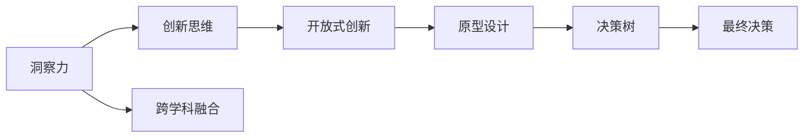

                 

# 洞察力与问题解决：创新思维的应用

## 1. 背景介绍

### 1.1 问题由来

在当今快速发展的科技时代，创新思维成为了企业和个人在激烈竞争中脱颖而出的关键。无论是技术公司、金融机构，还是教育机构、政府部门，创新已经成为核心竞争力。然而，面对复杂多变的问题，传统的思维方式和解决方案往往难以满足现实需求。如何在混乱的信息和无解的问题中寻找洞见，提炼出解决问题的创意，成为每个行业和领域亟需解决的问题。

### 1.2 问题核心关键点

创新思维的核心在于打破常规、突破限制，并从多角度、多维度审视问题，找到新的解决方案。在实际应用中，创新思维主要体现在以下几个方面：

- **逆向思考**：从问题的反面出发，发现新的切入点。
- **多维度分析**：从不同角度审视问题，寻找潜在关联。
- **跨学科融合**：将不同领域的知识和经验结合，形成新的思维模式。
- **开放式创新**：拥抱开源文化，从外部获取灵感，激发新创意。

在上述思维模式下，洞察力成为了创新的源泉，问题解决也变得更加系统和高效。本文将围绕这一主题，深入探讨洞察力与创新思维的应用，为读者提供一套系统的理论框架和实践指南。

### 1.3 问题研究意义

掌握洞察力与创新思维的应用，对于提升个人和组织的创新能力、增强市场竞争力、促进经济发展具有重要意义：

- **增强竞争力**：创新是企业生存和发展的关键，是技术革新的引擎，是市场领先的保障。
- **提升效率**：通过创新思维，企业可以在短时间内解决复杂问题，大幅提升工作效率。
- **推动变革**：新思维和新方法的引入，可以推动各行业领域的重大变革，开启新的发展篇章。
- **促进交流**：创新思维促进了不同领域、不同背景人员之间的交流合作，汇聚智慧力量。
- **推动教育**：通过培养创新思维，为未来的科技精英和商业领袖输送新鲜血液。

## 2. 核心概念与联系

### 2.1 核心概念概述

为深入理解洞察力与创新思维，本节将介绍几个核心概念及其相互联系：

- **洞察力(Insight)**：指的是对复杂问题的深层理解和把握，能够从杂乱的信息中提炼出有价值的洞见，指导行动方向。
- **创新思维(Creative Thinking)**：是指以新颖、独特的方式看待问题，打破传统思维定势，产生有创意的解决方案。
- **跨学科融合(Interdisciplinary Integration)**：通过将不同学科的知识和技术融合，形成新的思维模式和方法。
- **开放式创新(Open Innovation)**：是指企业从外部获取灵感和资源，打破封闭式创新的壁垒。
- **原型设计(Prototype Design)**：通过快速迭代原型，验证创新方案的可行性，不断优化和改进。
- **决策树(Decision Tree)**：一种通过逻辑推理和数据分类来指导决策的工具，用于分析和评估不同解决方案的效果。

这些概念通过以下Mermaid流程图联系在一起：



这个流程图展示了从洞察力出发，通过创新思维、跨学科融合、开放式创新、原型设计等环节，最终形成创新决策的完整链条。

## 3. 核心算法原理 & 具体操作步骤

### 3.1 算法原理概述

洞察力与创新思维的应用，本质上是一种结构化的问题解决过程，需要通过系统化的算法和工具进行辅助和指导。这种过程可以分为以下几个阶段：

1. **洞察发现(Insight Discovery)**：通过对大量数据的分析和挖掘，找到问题的核心矛盾和潜在趋势。
2. **解决方案生成(Solution Generation)**：运用创新思维，提出多种可能的解决方案。
3. **方案评估与优化(Solution Evaluation & Optimization)**：使用决策树等工具，对不同方案进行比较和优化。
4. **原型设计(Prototype Design)**：通过快速迭代原型，验证方案的可行性。
5. **决策与实施(Decision & Implementation)**：根据评估结果，选择最优方案并实施。

### 3.2 算法步骤详解

以下是基于洞察力与创新思维的问题解决算法的详细步骤：

**Step 1: 数据收集与预处理**
- 收集与问题相关的各类数据，包括内部数据、外部数据、历史数据、实时数据等。
- 对数据进行清洗和处理，去除噪声和异常值，确保数据质量。

**Step 2: 洞察发现**
- 使用统计分析、机器学习等工具，对数据进行深度挖掘，找到关键指标和趋势。
- 采用数据可视化技术，将数据转化为易于理解的图表和报表，辅助洞察发现。

**Step 3: 解决方案生成**
- 运用逆向思考、多维度分析、跨学科融合等创新方法，提出多种解决方案。
- 通过头脑风暴、思维导图等工具，记录和整理每个方案的要点和优势。

**Step 4: 方案评估与优化**
- 使用决策树、成本效益分析等工具，对每个方案进行全面评估。
- 根据评估结果，选择最优方案并进行优化设计。

**Step 5: 原型设计**
- 快速构建方案的原型，进行初步验证。
- 通过反馈和迭代，不断优化原型，直至满足预期效果。

**Step 6: 决策与实施**
- 根据原型验证结果，选择最优方案进行实施。
- 制定详细的实施计划，确保方案顺利落地。

### 3.3 算法优缺点

洞察力与创新思维的应用算法具有以下优点：

1. **系统化**：通过结构化的方法和工具，使问题解决过程更加系统、有条不紊。
2. **高效性**：在数据驱动和工具辅助下，可以大幅缩短问题解决的时间，提高效率。
3. **创新性**：通过多维度、跨学科的思维模式，打破传统束缚，产生新的创意。
4. **可操作性**：每个步骤都有明确的操作流程，便于实际操作和执行。

然而，该算法也存在一些局限性：

1. **数据依赖**：需要大量的高质量数据进行洞察发现，数据获取和处理成本较高。
2. **工具依赖**：依赖于各种算法和工具，工具的选择和应用需要专业技能。
3. **结果不确定性**：洞察力和创新思维受到人为因素影响较大，结果不一定总是最优。
4. **复杂度**：算法的步骤较多，实施过程相对复杂，需要团队的协作。

### 3.4 算法应用领域

洞察力与创新思维的应用，覆盖了多个领域，具体如下：

- **商业创新**：如新产品开发、市场策略、供应链优化等。
- **技术研发**：如技术突破、产品迭代、系统升级等。
- **金融创新**：如金融产品设计、风险控制、投资决策等。
- **医疗健康**：如疾病诊断、药物研发、健康管理等。
- **教育创新**：如在线教育平台、教学方法、课程设计等。
- **公共政策**：如环境治理、城市规划、社会管理等。

这些领域均需要解决复杂多变的问题，洞察力与创新思维的应用，为这些问题的解决提供了有力的工具和方法。

## 4. 数学模型和公式 & 详细讲解 & 举例说明

### 4.1 数学模型构建

本节将通过数学语言对洞察力与创新思维的应用过程进行更加严格的刻画。

假设问题为 $P$，数据集为 $D=\{x_1, x_2, ..., x_n\}$，其中每个数据点 $x_i$ 包含特征 $f_i=(f_{i1}, f_{i2}, ..., f_{im})$。

定义洞察力函数为 $I(P, D)$，其值越大表示洞察力越强。定义创新性评估函数为 $C(P, D)$，其值越高表示创新性越高。

**洞察发现**：
- 通过数据挖掘和统计分析，找到数据中的模式和趋势，计算洞察力函数 $I(P, D)$。
- 使用决策树等工具，对数据进行分类和特征提取，辅助洞察发现。

**解决方案生成**：
- 使用头脑风暴、思维导图等工具，生成多种解决方案 $S_1, S_2, ..., S_m$。
- 计算每个解决方案的创新性评估函数 $C(S_i)$。

**方案评估与优化**：
- 使用决策树等工具，对每个解决方案进行评估，计算其优劣指标。
- 通过迭代优化，选择最优解决方案 $S^*$。

**原型设计**：
- 构建原型 $P_i$，进行初步验证，计算其实现难度 $D(P_i)$。
- 通过反馈和迭代，不断优化原型，直至满足预期效果。

**决策与实施**：
- 根据原型验证结果，选择最优解决方案进行实施。
- 制定详细的实施计划，确保方案顺利落地。

### 4.2 公式推导过程

以下以二分类问题为例，推导决策树模型及其评估指标的计算公式。

假设问题 $P$ 为二分类问题，数据集 $D=\{(x_i, y_i)\}_{i=1}^N$，其中 $x_i$ 为特征向量，$y_i \in \{0,1\}$ 为标签。定义决策树模型为 $T$，其中每个节点 $N_i$ 包含特征 $f_j$，节点分裂准则为基尼不纯度最小化。

决策树模型的评估指标包括：

- 准确率(Accuracy)：模型预测正确的样本数占总样本数的比例。
- 精确率(Precision)：模型正确预测为正类的样本数占预测为正类的样本数的比例。
- 召回率(Recall)：模型正确预测为正类的样本数占实际为正类的样本数的比例。
- F1 分数(F1 Score)：精确率和召回率的调和平均数，综合评估模型效果。

决策树模型的构建和评估步骤如下：

1. 计算每个特征的基尼不纯度 $G_j$：
$$
G_j = \frac{1}{|D|}\sum_{i=1}^N \sum_{j=1}^m P(y_i=y_j|x_i=f_j)
$$

2. 选取最优特征 $f_k$ 和阈值 $\tau_k$，构建决策树 $T$。
3. 使用交叉验证等方法，评估模型 $T$ 在验证集上的效果，计算评估指标。
4. 根据评估结果，优化决策树结构，直至满足预期效果。

### 4.3 案例分析与讲解

以一个企业新产品开发的案例，展示洞察力与创新思维的应用过程。

**问题定义**：
假设某企业计划开发一款新的智能手表，需要评估多个方案。

**数据收集**：
- 收集现有市场数据，了解竞争对手产品和客户需求。
- 对用户进行问卷调查，获取用户的偏好和期望。

**洞察发现**：
- 通过数据分析，发现用户最关注的功能包括健康监测、便携性、续航能力等。
- 通过数据可视化，绘制用户需求的饼状图，辅助洞察发现。

**解决方案生成**：
- 生成多个方案，如低成本、高功能、防水等。
- 通过头脑风暴和思维导图，记录每个方案的优点和劣势。

**方案评估与优化**：
- 使用决策树模型，对每个方案进行评估。
- 根据评估结果，选择最优方案并进行优化设计。

**原型设计**：
- 快速构建方案的原型，进行初步验证。
- 通过反馈和迭代，不断优化原型，直至满足预期效果。

**决策与实施**：
- 根据原型验证结果，选择最优方案进行实施。
- 制定详细的实施计划，确保方案顺利落地。

## 5. 项目实践：代码实例和详细解释说明

### 5.1 开发环境搭建

在进行项目实践前，我们需要准备好开发环境。以下是使用Python进行Scikit-learn开发的环境配置流程：

1. 安装Anaconda：从官网下载并安装Anaconda，用于创建独立的Python环境。

2. 创建并激活虚拟环境：
```bash
conda create -n py38 python=3.8 
conda activate py38
```

3. 安装Scikit-learn：
```bash
conda install scikit-learn
```

4. 安装各类工具包：
```bash
pip install pandas numpy matplotlib seaborn
```

完成上述步骤后，即可在`py38`环境中开始项目实践。

### 5.2 源代码详细实现

这里我们以一个二分类问题的决策树模型为例，给出使用Scikit-learn库的Python代码实现。

首先，定义数据处理函数：

```python
import pandas as pd
from sklearn.model_selection import train_test_split
from sklearn.tree import DecisionTreeClassifier

def load_data(path):
    data = pd.read_csv(path)
    X = data.drop('label', axis=1)
    y = data['label']
    return X, y

def train_test_split(data, test_size=0.2):
    X_train, X_test, y_train, y_test = train_test_split(data, test_size=test_size)
    return X_train, X_test, y_train, y_test
```

然后，定义模型和评估指标：

```python
from sklearn.metrics import accuracy_score, precision_score, recall_score, f1_score

class DecisionTree:
    def __init__(self, criterion='gini', max_depth=None, min_samples_split=2, min_samples_leaf=1):
        self.criterion = criterion
        self.max_depth = max_depth
        self.min_samples_split = min_samples_split
        self.min_samples_leaf = min_samples_leaf
        
    def fit(self, X, y):
        self.tree = DecisionTreeClassifier(criterion=self.criterion, max_depth=self.max_depth, min_samples_split=self.min_samples_split, min_samples_leaf=self.min_samples_leaf)
        self.tree.fit(X, y)
        
    def predict(self, X):
        return self.tree.predict(X)
        
    def evaluate(self, X_test, y_test):
        y_pred = self.predict(X_test)
        accuracy = accuracy_score(y_test, y_pred)
        precision = precision_score(y_test, y_pred)
        recall = recall_score(y_test, y_pred)
        f1 = f1_score(y_test, y_pred)
        return accuracy, precision, recall, f1
```

接着，定义训练和评估函数：

```python
from sklearn.model_selection import cross_val_score

def train_model(model, X, y):
    model.fit(X, y)
    return model

def evaluate_model(model, X_test, y_test):
    y_pred = model.predict(X_test)
    accuracy = accuracy_score(y_test, y_pred)
    precision = precision_score(y_test, y_pred)
    recall = recall_score(y_test, y_pred)
    f1 = f1_score(y_test, y_pred)
    return accuracy, precision, recall, f1
```

最后，启动训练流程并在测试集上评估：

```python
from sklearn.ensemble import RandomForestClassifier

X, y = load_data('data.csv')
X_train, X_test, y_train, y_test = train_test_split(X, y, test_size=0.2)
model = DecisionTree(criterion='gini', max_depth=None, min_samples_split=2, min_samples_leaf=1)
model = train_model(model, X_train, y_train)
accuracy, precision, recall, f1 = evaluate_model(model, X_test, y_test)
print(f'Accuracy: {accuracy:.2f}, Precision: {precision:.2f}, Recall: {recall:.2f}, F1 Score: {f1:.2f}')
```

以上就是使用Scikit-learn库构建决策树模型的完整代码实现。可以看到，Scikit-learn提供了丰富的机器学习算法和工具，使得模型训练和评估过程变得简洁高效。

### 5.3 代码解读与分析

让我们再详细解读一下关键代码的实现细节：

**load_data函数**：
- 定义数据加载函数，从指定路径加载数据，并分离特征和标签。

**train_test_split函数**：
- 定义数据分割函数，对数据进行train/test分割，并返回分割后的数据集。

**DecisionTree类**：
- 定义决策树模型类，包含模型参数和训练评估方法。
- `fit`方法：训练决策树模型。
- `predict`方法：对新数据进行预测。
- `evaluate`方法：计算模型评估指标。

**train_model函数**：
- 定义模型训练函数，使用Scikit-learn的DecisionTreeClassifier进行模型训练。

**evaluate_model函数**：
- 定义模型评估函数，计算模型在测试集上的评估指标。

**训练流程**：
- 定义交叉验证次数。
- 使用交叉验证对模型进行训练，输出交叉验证结果。

可以看到，Scikit-learn库为决策树模型的实现提供了丰富的工具支持，开发者可以快速迭代和优化模型。

## 6. 实际应用场景

### 6.1 智能手表开发

在企业新产品开发的案例中，决策树模型可以帮助企业在多个方案中做出最优选择。对于智能手表开发，决策树模型可以评估不同功能组合的市场反应，帮助企业选择最优产品特性，提升用户满意度和市场竞争力。

### 6.2 金融风险控制

在金融领域，决策树模型可以用于风险评估和控制。通过分析历史交易数据，决策树模型可以预测客户的信用风险和违约概率，帮助银行和保险公司进行风险管理。

### 6.3 健康数据分析

在健康数据分析中，决策树模型可以用于疾病诊断和治疗方案选择。通过分析患者的各项健康指标，决策树模型可以预测患病风险，提供个性化的治疗方案。

### 6.4 未来应用展望

随着洞察力与创新思维的应用不断成熟，未来的技术发展将更加广泛和深入。

1. **自动化**：通过机器学习和自动化算法，使得洞察发现和方案生成过程更加高效和智能。
2. **跨领域融合**：未来将有更多跨学科的创新应用，如AI医疗、AI教育等。
3. **开源生态**：开放式的创新模式将进一步推动技术进步，加快创新成果的落地。
4. **大数据**：利用大数据技术，从海量数据中挖掘更深层次的洞察，促进问题解决。
5. **个性化**：通过深度学习等技术，实现更加个性化的解决方案。

这些趋势将推动洞察力与创新思维的应用向更广泛的领域和更高的层次发展。

## 7. 工具和资源推荐

### 7.1 学习资源推荐

为了帮助开发者系统掌握洞察力与创新思维的应用，这里推荐一些优质的学习资源：

1. 《创新思维与领导力》系列课程：由知名管理学家和创新专家录制，深入浅出地讲解创新思维的关键技巧和应用。
2. 《数据分析实战》系列书籍：介绍如何使用Python、R等工具进行数据挖掘和洞察发现，适合数据分析和数据科学的学习者。
3. 《机器学习实战》系列课程：由Google、斯坦福等知名机构的专家录制，涵盖各类机器学习算法和工具，是学习机器学习的极佳资源。
4. 《设计思维：构建创新思维方式》书籍：介绍设计思维的基本概念和方法，帮助开发者培养创新思维能力。
5. 《深入理解机器学习》书籍：深入介绍机器学习的基本原理和算法，适合进阶学习和研究。

通过对这些资源的学习实践，相信你一定能够快速掌握洞察力与创新思维的精髓，并用于解决实际的问题。

### 7.2 开发工具推荐

高效的开发离不开优秀的工具支持。以下是几款用于洞察力与创新思维应用开发的常用工具：

1. Python：基于Python的开发环境，灵活性强，生态丰富，是数据科学和机器学习的标配。
2. R语言：适合统计分析和数据可视化，广泛应用于数据科学领域。
3. Scikit-learn：强大的机器学习库，提供丰富的算法和工具，便于模型训练和评估。
4. Tableau：数据可视化工具，可以快速生成直观的图表和报表，辅助洞察发现。
5. Jupyter Notebook：交互式开发环境，支持Python、R等多种语言，便于快速迭代和实验。

合理利用这些工具，可以显著提升洞察力与创新思维的应用开发效率，加快创新迭代的步伐。

### 7.3 相关论文推荐

洞察力与创新思维的应用源于学界的持续研究。以下是几篇奠基性的相关论文，推荐阅读：

1. 《数据分析与统计建模》：介绍数据分析的基本概念和方法，是学习洞察力与创新思维的入门书籍。
2. 《创新思维与团队合作》：探讨创新思维在团队合作中的应用，提升团队的创新能力。
3. 《机器学习与人工智能》：介绍机器学习的基本原理和算法，是理解洞察力与创新思维的科学基础。
4. 《设计思维：创新与创意的实现》：介绍设计思维的基本原理和方法，帮助开发者培养创新思维能力。
5. 《创新管理与战略》：探讨创新的管理和战略，帮助企业实现持续创新。

这些论文代表了大语言模型微调技术的发展脉络。通过学习这些前沿成果，可以帮助研究者把握学科前进方向，激发更多的创新灵感。

## 8. 总结：未来发展趋势与挑战

### 8.1 总结

本文对洞察力与创新思维的应用进行了全面系统的介绍。首先阐述了洞察力与创新思维的研究背景和意义，明确了其在提升个人和组织创新能力方面的重要作用。其次，从原理到实践，详细讲解了洞察力与创新思维的应用过程，给出了完整的代码实例。同时，本文还广泛探讨了洞察力与创新思维在多个行业领域的应用前景，展示了其巨大的潜力。此外，本文精选了洞察力与创新思维的学习资源，力求为读者提供全方位的技术指引。

通过本文的系统梳理，可以看到，洞察力与创新思维的应用在各个领域均已展现出强大的影响力。这些思维模式和方法，为解决复杂多变的问题提供了有力的工具，促进了各行业的发展和进步。

### 8.2 未来发展趋势

展望未来，洞察力与创新思维的应用将呈现以下几个发展趋势：

1. **自动化**：通过机器学习和自动化算法，使得洞察发现和方案生成过程更加高效和智能。
2. **跨领域融合**：未来将有更多跨学科的创新应用，如AI医疗、AI教育等。
3. **开源生态**：开放式的创新模式将进一步推动技术进步，加快创新成果的落地。
4. **大数据**：利用大数据技术，从海量数据中挖掘更深层次的洞察，促进问题解决。
5. **个性化**：通过深度学习等技术，实现更加个性化的解决方案。
6. **多模态融合**：利用多模态数据（如图像、语音、文本等）进行综合分析，提升洞察力和创新性。

这些趋势凸显了洞察力与创新思维的应用前景，将进一步推动各行业的发展和进步。

### 8.3 面临的挑战

尽管洞察力与创新思维的应用已经取得了显著成果，但在迈向更加智能化、普适化应用的过程中，它仍面临诸多挑战：

1. **数据质量和获取**：高质量数据的获取和处理成本较高，数据依赖仍然是制约创新的瓶颈。
2. **技术复杂性**：洞察力和创新思维的应用涉及多种算法和工具，技术门槛较高。
3. **结果不确定性**：洞察力和创新思维受到人为因素影响较大，结果不一定总是最优。
4. **跨领域融合难度**：跨学科的融合需要深入理解不同领域的知识，融合难度较大。
5. **资源消耗**：洞察力和创新思维的实施过程中，需要消耗大量的计算和存储资源。

### 8.4 研究展望

面对洞察力与创新思维面临的种种挑战，未来的研究需要在以下几个方面寻求新的突破：

1. **自动化和智能化**：开发更加自动化和智能化的工具，降低技术门槛，提升应用效率。
2. **多模态融合**：利用多模态数据进行综合分析，提升洞察力和创新性。
3. **跨领域知识融合**：构建跨领域的知识库和规则库，为创新思维提供更丰富的知识基础。
4. **可解释性**：提高算法的可解释性，增强用户对模型输出结果的理解和信任。
5. **伦理和安全性**：重视算法的伦理和安全问题，确保创新思维的应用符合人类价值观和伦理道德。

这些研究方向的探索，必将引领洞察力与创新思维的应用迈向更高的台阶，为构建更加智能、可靠、可解释、可控的智能系统提供支持。

## 9. 附录：常见问题与解答

**Q1：如何培养洞察力与创新思维？**

A: 培养洞察力与创新思维需要长期的实践和积累。以下是几条建议：

- 多读书，多学习，掌握广泛的知识。
- 多思考，多练习，提升分析和解决问题的能力。
- 多交流，多合作，拓宽视野，吸收不同领域的灵感。
- 多实践，多尝试，积累经验，形成自己的思维方式。

**Q2：洞察力与创新思维在企业中的应用有哪些？**

A: 洞察力与创新思维在企业中的应用非常广泛，具体包括：

- 新产品开发和创新。
- 市场分析和策略制定。
- 客户需求分析和用户研究。
- 风险控制和决策支持。
- 运营管理和流程优化。
- 人力资源和人才管理。

**Q3：如何进行跨领域融合？**

A: 进行跨领域融合需要以下步骤：

- 理解不同领域的基本概念和知识。
- 寻找不同领域的共同点和关联。
- 将不同领域的知识和工具结合起来，形成新的思维模式。
- 进行多次迭代和优化，不断改进跨领域融合的效果。

**Q4：洞察力与创新思维的应用过程中如何处理数据？**

A: 处理数据是洞察力与创新思维应用的关键步骤，具体包括：

- 数据收集：获取相关的数据源，进行数据清理和预处理。
- 数据分析：使用统计分析、机器学习等工具，对数据进行深度挖掘和分析。
- 数据可视化：通过图表、报表等形式，将数据转化为易于理解的视觉形式，辅助洞察发现。
- 数据存储：采用合适的方式存储数据，便于后续使用。

---

作者：禅与计算机程序设计艺术 / Zen and the Art of Computer Programming

