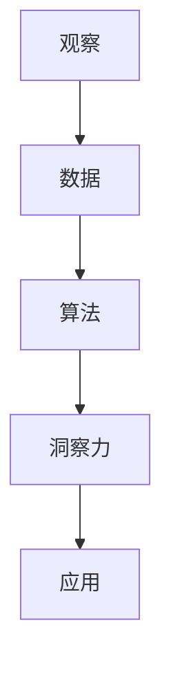

                 

# 洞察力的培养：从观察到创新的跨越

## 1. 背景介绍

### 1.1 问题由来
在现代社会，信息量爆炸式增长，日常工作中，我们需要处理和分析大量的数据。这种高强度的信息处理工作，对人的观察力、理解力和决策能力提出了极高的要求。然而，由于传统信息处理方式（如文字处理、表格分析）的局限性，很多情况下，我们很难从海量的数据中快速提取出有用的信息，做出准确的决策。

这种背景下，计算机技术的应用变得越来越重要。通过算法和计算能力，计算机可以快速处理、分析和挖掘海量数据，从而为决策者提供强有力的支持。然而，计算机的自动化处理虽然高效，但难以拥有人类直觉和洞察力。因此，如何将人类观察力和计算机计算能力进行有机结合，成为当下技术领域的重要课题。

### 1.2 问题核心关键点
如何通过计算机技术提升人类的观察力和洞察力，是当前智能技术研究的重点之一。这涉及到多个关键问题：

1. 数据如何有效表示和组织？
2. 算法如何高效处理和挖掘数据？
3. 人机交互如何更自然、更高效？
4. 洞察力如何从数据中提炼和应用？

本文将围绕这些核心问题，探讨计算机技术如何辅助人类培养和提升洞察力，从观察到创新的跨越。

### 1.3 问题研究意义
培养和提升洞察力，对个人职业发展和组织创新能力具有重要意义：

1. 增强决策能力。洞察力能帮助决策者快速理解和分析数据，抓住关键信息，做出更准确的决策。
2. 提升创新能力。观察力和洞察力是创新的重要源泉，能帮助人们在复杂问题中发现新的解决思路和方法。
3. 促进人机协作。增强洞察力，可以让人们更好地利用计算机工具，提升工作效率和创新效率。
4. 强化组织竞争力。洞察力的培养和应用，能够提升组织在数据驱动决策中的能力，从而增强市场竞争力。

## 2. 核心概念与联系

### 2.1 核心概念概述

本节将介绍几个关键概念，并说明它们之间的联系。

- **洞察力 (Insight)：** 指通过观察和分析数据，提炼出新的、有价值的信息和知识。洞察力具有突发性、创新性和实用性。
- **观察 (Observation)：** 指从数据中获取信息、事实和模式的过程。观察是洞察力的基础。
- **算法 (Algorithm)：** 一组计算机指令或操作，用于解决特定问题或完成任务。算法是洞察力的工具。
- **人机交互 (Human-Computer Interaction, HCI)：** 研究计算机如何与人类交互，并理解人类行为和需求的技术。人机交互是洞察力的应用场景。

这些概念之间存在紧密联系：

- 观察力是洞察力的基础，观察到的数据和事实是洞察力形成的前提。
- 算法是洞察力的工具，通过高效算法，可以自动地从数据中提取有用信息。
- 人机交互是洞察力的应用场景，通过人机交互技术，洞察力可以被有效地转化为实际行动。

这些概念共同构成了一个从观察、算法到洞察力，再到应用的全链条技术体系。

### 2.2 核心概念原理和架构的 Mermaid 流程图



## 3. 核心算法原理 & 具体操作步骤

### 3.1 算法原理概述

洞察力培养的核心算法包括：

1. 数据预处理算法：用于清洗和格式化数据，使其适合观察和分析。
2. 特征提取算法：用于从数据中提炼出有用的特征，供算法处理。
3. 模型训练算法：用于训练算法模型，识别数据中的模式和规律。
4. 可视化算法：用于将数据和洞察力结果进行可视化展示，帮助观察和理解。

这些算法共同构成了一个数据驱动的洞察力培养框架，其核心思想是：通过数据预处理和特征提取，将数据转化为可供算法处理的格式；通过模型训练，从数据中提炼出模式和规律；通过可视化，将洞察力结果展示给观察者。

### 3.2 算法步骤详解

以机器学习模型训练为例，洞察力培养的详细步骤包括：

**Step 1: 数据预处理**
- 数据清洗：去除噪声、缺失值和异常值。
- 数据格式化：将数据转换为算法可处理的格式，如数值化、标准化、归一化等。
- 数据划分：将数据划分为训练集、验证集和测试集，供模型训练、调参和测试。

**Step 2: 特征提取**
- 特征选择：从数据中提炼出有用的特征，去除无用和冗余特征。
- 特征转换：将原始特征转化为新的特征表示，如PCA降维、LDA线性判别、TF-IDF特征等。
- 特征组合：将不同特征进行组合，构建新的复合特征，以提高模型性能。

**Step 3: 模型训练**
- 模型选择：选择合适的机器学习算法，如线性回归、决策树、神经网络等。
- 模型调参：通过交叉验证等方法，优化模型超参数，提高模型性能。
- 模型评估：在测试集上评估模型性能，选择最佳模型进行应用。

**Step 4: 可视化展示**
- 结果展示：使用图表、热力图等形式，将模型结果可视化展示。
- 解释说明：解释模型输出的关键特征和模式，帮助观察者理解洞察力结果。
- 交互交互：提供交互式界面，供观察者进行深入分析和探索。

### 3.3 算法优缺点

数据驱动的洞察力培养算法具有以下优点：

1. 高效性：通过自动化算法处理数据，可以大幅提高效率。
2. 准确性：机器学习算法经过大量数据训练，通常具有较高的准确性和泛化能力。
3. 可解释性：现代算法技术（如LIME、SHAP等）提供了对模型输出结果的解释和可视化，帮助观察者理解洞察力形成过程。

然而，这些算法也存在以下缺点：

1. 对数据依赖性强：算法的效果依赖于数据的质量和多样性，数据偏差可能导致洞察力结果错误。
2. 模型黑盒问题：复杂的机器学习模型（如深度神经网络）通常难以解释其内部决策过程。
3. 需要专业知识：算法的设计和应用需要相关领域的专业知识，门槛较高。
4. 过拟合风险：模型可能在训练集上表现良好，但在新数据上泛化能力不足。

### 3.4 算法应用领域

数据驱动的洞察力培养算法广泛应用在多个领域：

- **金融分析**：通过历史数据和市场动态，预测股票走势、评估投资风险。
- **医疗诊断**：利用患者数据和医学图像，辅助医生进行疾病诊断和治疗方案制定。
- **市场营销**：分析消费者行为数据，进行市场细分、消费者画像和营销策略优化。
- **产品设计**：通过用户反馈和市场数据，优化产品设计和功能，提升用户体验。
- **风险管理**：分析各类风险数据，制定风险控制策略，保障组织安全。

## 4. 数学模型和公式 & 详细讲解 & 举例说明

### 4.1 数学模型构建

本节将使用数学语言对洞察力培养的核心算法进行严格建模。

假设我们有一组训练数据 $D = \{(x_i, y_i)\}_{i=1}^N$，其中 $x_i$ 为输入特征， $y_i$ 为输出标签。洞察力培养的目标是找到一个模型 $h$，使得 $h(x)$ 尽可能接近真实标签 $y$。

模型训练的目标是最小化损失函数 $\mathcal{L}$：

$$
\min_{h} \mathcal{L}(h; D) = \frac{1}{N} \sum_{i=1}^N \ell(h(x_i), y_i)
$$

其中 $\ell$ 为损失函数，如均方误差、交叉熵等。

### 4.2 公式推导过程

以线性回归为例，推导模型训练的数学公式。

假设模型 $h(x)$ 为线性函数，即 $h(x) = \mathbf{w} \cdot \mathbf{x} + b$，其中 $\mathbf{w}$ 为权重向量，$b$ 为偏置项。模型训练的目标是最小化损失函数：

$$
\mathcal{L}(h; D) = \frac{1}{N} \sum_{i=1}^N (y_i - h(x_i))^2
$$

通过求偏导数，可以得到损失函数对权重向量和偏置项的梯度：

$$
\nabla_{\mathbf{w}, b} \mathcal{L}(h; D) = \frac{1}{N} \sum_{i=1}^N 2(y_i - h(x_i))\nabla_{\mathbf{x}} h(x_i)
$$

其中 $\nabla_{\mathbf{x}} h(x_i) = \mathbf{w}$。

通过梯度下降算法，可以更新权重向量和偏置项：

$$
\mathbf{w} \leftarrow \mathbf{w} - \eta \nabla_{\mathbf{w}, b} \mathcal{L}(h; D)
$$

其中 $\eta$ 为学习率。

### 4.3 案例分析与讲解

以房价预测为例，分析模型训练和洞察力培养的过程。

假设我们有一组历史房价数据 $(x, y)$，其中 $x$ 为房屋特征（如面积、位置等），$y$ 为房价。我们的目标是通过这些数据，训练一个线性回归模型，预测新房屋的房价。

1. **数据预处理**：清洗数据，去除异常值，标准化数据，划分训练集、验证集和测试集。
2. **特征提取**：从房屋特征中提取有用的特征，如面积、楼层、位置等。
3. **模型训练**：通过最小化损失函数，训练线性回归模型，得到最佳权重向量和偏置项。
4. **可视化展示**：绘制房价与特征之间的关系图，展示模型的预测结果。
5. **洞察力提炼**：观察模型的预测结果，提炼出关键特征和规律，如高楼层房屋价格较低，靠近市中心的房屋价格较高。

## 5. 项目实践：代码实例和详细解释说明

### 5.1 开发环境搭建

在进行洞察力培养的实践前，我们需要准备好开发环境。以下是使用Python进行Scikit-Learn开发的环境配置流程：

1. 安装Anaconda：从官网下载并安装Anaconda，用于创建独立的Python环境。

2. 创建并激活虚拟环境：
```bash
conda create -n insight-env python=3.8 
conda activate insight-env
```

3. 安装Scikit-Learn：从官网获取对应的安装命令。例如：
```bash
conda install scikit-learn
```

4. 安装NumPy、Pandas等库：
```bash
pip install numpy pandas
```

5. 安装Matplotlib、Seaborn等可视化库：
```bash
pip install matplotlib seaborn
```

完成上述步骤后，即可在`insight-env`环境中开始洞察力培养的实践。

### 5.2 源代码详细实现

下面我们以房价预测为例，给出使用Scikit-Learn进行线性回归的代码实现。

首先，导入必要的库：

```python
import pandas as pd
import numpy as np
from sklearn.model_selection import train_test_split
from sklearn.linear_model import LinearRegression
import matplotlib.pyplot as plt
```

然后，加载数据集：

```python
data = pd.read_csv('house_prices.csv')
```

接着，数据预处理和特征提取：

```python
# 选择有用的特征
features = ['area', 'location', 'floor']
X = data[features]
y = data['price']

# 标准化数据
from sklearn.preprocessing import StandardScaler
scaler = StandardScaler()
X = scaler.fit_transform(X)
```

进行模型训练：

```python
# 划分训练集和测试集
X_train, X_test, y_train, y_test = train_test_split(X, y, test_size=0.2)

# 训练线性回归模型
model = LinearRegression()
model.fit(X_train, y_train)
```

进行模型评估和可视化：

```python
# 在测试集上评估模型
y_pred = model.predict(X_test)
mse = np.mean((y_pred - y_test)**2)
print(f'Mean Squared Error: {mse:.2f}')

# 可视化预测结果
plt.scatter(X_test[:, 0], y_test, label='Actual Prices')
plt.scatter(X_test[:, 0], y_pred, color='red', label='Predicted Prices')
plt.xlabel('Floor')
plt.ylabel('Price')
plt.legend()
plt.show()
```

以上就是使用Scikit-Learn进行线性回归的完整代码实现。可以看到，Scikit-Learn提供了简单易用的接口，帮助开发者快速完成模型训练和可视化。

### 5.3 代码解读与分析

让我们再详细解读一下关键代码的实现细节：

**数据预处理**：
- 从CSV文件中加载数据集，选择有用的特征。
- 使用StandardScaler标准化数据，确保模型收敛。

**特征提取**：
- 从数据中提取有用的特征，如面积、楼层、位置等。

**模型训练**：
- 使用train_test_split将数据集划分为训练集和测试集。
- 使用LinearRegression训练线性回归模型，最小化损失函数。

**模型评估和可视化**：
- 在测试集上评估模型性能，计算均方误差。
- 使用Matplotlib绘制房价与楼层之间的关系图，展示模型预测结果。

这些代码实现了洞察力培养的一个完整流程，展示了数据预处理、特征提取、模型训练和可视化等关键步骤。

## 6. 实际应用场景

### 6.1 智能客服系统

基于数据驱动的洞察力培养技术，可以广泛应用于智能客服系统的构建。传统客服往往需要配备大量人力，高峰期响应缓慢，且一致性和专业性难以保证。使用洞察力培养技术，可以分析客服聊天记录，识别出客户常见问题、典型回答，构建知识库。

在技术实现上，可以收集企业内部的历史客服对话记录，将问题和最佳答复构建成监督数据，在此基础上对模型进行训练和微调。经过训练的模型能够自动理解客户意图，匹配最合适的回答，从而提升客服效率和质量。

### 6.2 金融舆情监测

金融机构需要实时监测市场舆论动向，以便及时应对负面信息传播，规避金融风险。传统的人工监测方式成本高、效率低，难以应对网络时代海量信息爆发的挑战。

使用洞察力培养技术，可以分析金融领域相关的新闻、报道、评论等文本数据，预测市场趋势，评估风险。具体而言，可以收集金融领域相关的网络文本数据，构建文本分类、情感分析等模型，分析市场情绪变化，评估风险等级。系统可以根据情绪变化，自动预警，帮助金融机构快速应对潜在风险。

### 6.3 个性化推荐系统

当前的推荐系统往往只依赖用户的历史行为数据进行物品推荐，无法深入理解用户的真实兴趣偏好。使用洞察力培养技术，可以分析用户浏览、点击、评论、分享等行为数据，提炼出用户兴趣偏好。

在技术实现上，可以收集用户行为数据，提取文本特征，训练机器学习模型，预测用户对不同物品的兴趣度。根据兴趣度，推荐系统可以生成个性化推荐列表，提升用户体验和满意度。

### 6.4 未来应用展望

随着洞察力培养技术的不断发展，其在更多领域将得到应用，为传统行业带来变革性影响。

在智慧医疗领域，基于洞察力培养的医学图像分析、疾病预测、治疗方案优化等应用将提升医疗服务的智能化水平，辅助医生诊疗，加速新药开发进程。

在智能教育领域，洞察力培养技术可应用于作业批改、学情分析、知识推荐等方面，因材施教，促进教育公平，提高教学质量。

在智慧城市治理中，洞察力培养技术可应用于城市事件监测、舆情分析、应急指挥等环节，提高城市管理的自动化和智能化水平，构建更安全、高效的未来城市。

此外，在企业生产、社会治理、文娱传媒等众多领域，洞察力培养技术也将不断涌现，为经济社会发展注入新的动力。相信随着技术的日益成熟，洞察力培养技术将成为人工智能落地应用的重要范式，推动人工智能技术向更广阔的领域加速渗透。

## 7. 工具和资源推荐

### 7.1 学习资源推荐

为了帮助开发者系统掌握洞察力培养的理论基础和实践技巧，这里推荐一些优质的学习资源：

1. 《机器学习》书籍：由Tom Mitchell等专家所著，系统介绍了机器学习的基本概念和算法。
2. 《深度学习》课程：由Ian Goodfellow等专家授课，涵盖了深度学习的基础知识和经典模型。
3. 《Python数据分析与可视化》书籍：由RoboFlow等专家所著，介绍了Python在数据分析和可视化中的应用。
4. Kaggle平台：提供了大量的数据集和竞赛，供开发者实践和探索。
5. Coursera平台：提供多门数据科学、机器学习等课程，涵盖基础知识和前沿技术。

通过对这些资源的学习实践，相信你一定能够快速掌握洞察力培养的精髓，并用于解决实际的NLP问题。

### 7.2 开发工具推荐

高效的开发离不开优秀的工具支持。以下是几款用于洞察力培养开发的常用工具：

1. Python：简单易用的编程语言，具有丰富的科学计算和数据处理库。
2. Jupyter Notebook：交互式编程环境，方便进行数据探索和代码调试。
3. Matplotlib、Seaborn：可视化工具，帮助将洞察力结果展示给观察者。
4. Scikit-Learn、TensorFlow：机器学习库，提供了多种模型和算法。
5. Tableau、PowerBI：数据可视化工具，提供了丰富的图表和仪表盘。

合理利用这些工具，可以显著提升洞察力培养任务的开发效率，加快创新迭代的步伐。

### 7.3 相关论文推荐

洞察力培养技术的发展源于学界的持续研究。以下是几篇奠基性的相关论文，推荐阅读：

1. 《Deep Learning》论文：Yann LeCun等专家发表的深度学习开创性论文，介绍了深度神经网络的基本思想和应用。
2. 《Natural Language Processing with Transformers》书籍：Jacob Devlin等专家所著，介绍了Transformers等先进模型在NLP中的应用。
3. 《Understanding Deep Learning》论文：Ian Goodfellow等专家发表的深度学习理论综述，深入分析了深度神经网络的特性和应用。
4. 《Machine Learning Yearning》书籍：Andrew Ng所著，介绍了机器学习工程实践中的一些技巧和经验。
5. 《Deep Learning Specialization》课程：Andrew Ng授课，涵盖了深度学习的基础知识和实践应用。

这些论文和书籍代表了大数据驱动洞察力培养技术的发展脉络。通过学习这些前沿成果，可以帮助研究者把握学科前进方向，激发更多的创新灵感。

## 8. 总结：未来发展趋势与挑战

### 8.1 总结

本文对基于数据驱动的洞察力培养方法进行了全面系统的介绍。首先阐述了洞察力培养的背景和意义，明确了数据驱动的洞察力培养对提高决策能力和创新能力的重要价值。其次，从原理到实践，详细讲解了洞察力培养的数学模型和关键步骤，给出了洞察力培养任务开发的完整代码实例。同时，本文还广泛探讨了洞察力培养方法在智能客服、金融舆情、个性化推荐等多个行业领域的应用前景，展示了数据驱动洞察力培养技术的广阔前景。

通过本文的系统梳理，可以看到，数据驱动的洞察力培养方法正在成为人工智能领域的重要范式，极大地拓展了预训练语言模型的应用边界，催生了更多的落地场景。未来，伴随数据驱动洞察力培养技术的不断演进，相信人工智能技术必将在更广阔的应用领域大放异彩，深刻影响人类的生产生活方式。

### 8.2 未来发展趋势

展望未来，数据驱动的洞察力培养技术将呈现以下几个发展趋势：

1. 模型规模持续增大。随着算力成本的下降和数据规模的扩张，预训练语言模型的参数量还将持续增长。超大规模语言模型蕴含的丰富语言知识，有望支撑更加复杂多变的下游任务微调。
2. 微调方法日趋多样。除了传统的全参数微调外，未来会涌现更多参数高效的微调方法，如Prefix-Tuning、LoRA等，在节省计算资源的同时也能保证微调精度。
3. 持续学习成为常态。随着数据分布的不断变化，微调模型也需要持续学习新知识以保持性能。如何在不遗忘原有知识的同时，高效吸收新样本信息，将成为重要的研究课题。
4. 标注样本需求降低。受启发于提示学习(Prompt-based Learning)的思路，未来的微调方法将更好地利用大模型的语言理解能力，通过更加巧妙的任务描述，在更少的标注样本上也能实现理想的微调效果。
5. 多模态微调崛起。当前的微调主要聚焦于纯文本数据，未来会进一步拓展到图像、视频、语音等多模态数据微调。多模态信息的融合，将显著提升语言模型对现实世界的理解和建模能力。
6. 模型通用性增强。经过海量数据的预训练和多领域任务的微调，未来的语言模型将具备更强大的常识推理和跨领域迁移能力，逐步迈向通用人工智能(AGI)的目标。

以上趋势凸显了数据驱动洞察力培养技术的广阔前景。这些方向的探索发展，必将进一步提升人工智能系统的性能和应用范围，为人类认知智能的进化带来深远影响。

### 8.3 面临的挑战

尽管数据驱动的洞察力培养技术已经取得了瞩目成就，但在迈向更加智能化、普适化应用的过程中，它仍面临着诸多挑战：

1. 标注成本瓶颈。虽然微调大大降低了标注数据的需求，但对于长尾应用场景，难以获得充足的高质量标注数据，成为制约微调性能的瓶颈。如何进一步降低微调对标注样本的依赖，将是一大难题。
2. 模型鲁棒性不足。当前微调模型面对域外数据时，泛化性能往往大打折扣。对于测试样本的微小扰动，微调模型的预测也容易发生波动。如何提高微调模型的鲁棒性，避免灾难性遗忘，还需要更多理论和实践的积累。
3. 推理效率有待提高。大规模语言模型虽然精度高，但在实际部署时往往面临推理速度慢、内存占用大等效率问题。如何在保证性能的同时，简化模型结构，提升推理速度，优化资源占用，将是重要的优化方向。
4. 可解释性亟需加强。当前微调模型更像是"黑盒"系统，难以解释其内部工作机制和决策逻辑。对于医疗、金融等高风险应用，算法的可解释性和可审计性尤为重要。如何赋予微调模型更强的可解释性，将是亟待攻克的难题。
5. 安全性有待保障。预训练语言模型难免会学习到有偏见、有害的信息，通过微调传递到下游任务，产生误导性、歧视性的输出，给实际应用带来安全隐患。如何从数据和算法层面消除模型偏见，避免恶意用途，确保输出的安全性，也将是重要的研究课题。
6. 知识整合能力不足。现有的微调模型往往局限于任务内数据，难以灵活吸收和运用更广泛的先验知识。如何让微调过程更好地与外部知识库、规则库等专家知识结合，形成更加全面、准确的信息整合能力，还有很大的想象空间。

正视数据驱动洞察力培养面临的这些挑战，积极应对并寻求突破，将是大规模语言模型微调走向成熟的必由之路。相信随着学界和产业界的共同努力，这些挑战终将一一被克服，数据驱动洞察力培养技术必将在构建人机协同的智能时代中扮演越来越重要的角色。

### 8.4 未来突破

面对数据驱动洞察力培养所面临的种种挑战，未来的研究需要在以下几个方面寻求新的突破：

1. 探索无监督和半监督微调方法。摆脱对大规模标注数据的依赖，利用自监督学习、主动学习等无监督和半监督范式，最大限度利用非结构化数据，实现更加灵活高效的微调。
2. 研究参数高效和计算高效的微调范式。开发更加参数高效的微调方法，在固定大部分预训练参数的同时，只更新极少量的任务相关参数。同时优化微调模型的计算图，减少前向传播和反向传播的资源消耗，实现更加轻量级、实时性的部署。
3. 融合因果和对比学习范式。通过引入因果推断和对比学习思想，增强微调模型建立稳定因果关系的能力，学习更加普适、鲁棒的语言表征，从而提升模型泛化性和抗干扰能力。
4. 引入更多先验知识。将符号化的先验知识，如知识图谱、逻辑规则等，与神经网络模型进行巧妙融合，引导微调过程学习更准确、合理的语言模型。同时加强不同模态数据的整合，实现视觉、语音等多模态信息与文本信息的协同建模。
5. 结合因果分析和博弈论工具。将因果分析方法引入微调模型，识别出模型决策的关键特征，增强输出解释的因果性和逻辑性。借助博弈论工具刻画人机交互过程，主动探索并规避模型的脆弱点，提高系统稳定性。
6. 纳入伦理道德约束。在模型训练目标中引入伦理导向的评估指标，过滤和惩罚有偏见、有害的输出倾向。同时加强人工干预和审核，建立模型行为的监管机制，确保输出符合人类价值观和伦理道德。

这些研究方向的探索，必将引领数据驱动洞察力培养技术迈向更高的台阶，为构建安全、可靠、可解释、可控的智能系统铺平道路。面向未来，数据驱动洞察力培养技术还需要与其他人工智能技术进行更深入的融合，如知识表示、因果推理、强化学习等，多路径协同发力，共同推动自然语言理解和智能交互系统的进步。只有勇于创新、敢于突破，才能不断拓展语言模型的边界，让智能技术更好地造福人类社会。

## 9. 附录：常见问题与解答

**Q1：数据驱动的洞察力培养是否适用于所有领域？**

A: 数据驱动的洞察力培养在大多数领域都能取得不错的效果，特别是对于数据量较大的任务。但对于一些特定领域的任务，如医学、法律等，仅仅依靠通用语料预训练的模型可能难以很好地适应。此时需要在特定领域语料上进一步预训练，再进行微调，才能获得理想效果。此外，对于一些需要时效性、个性化很强的任务，如对话、推荐等，微调方法也需要针对性的改进优化。

**Q2：如何选择合适的数据集进行洞察力培养？**

A: 选择合适的数据集是洞察力培养的关键，通常需要考虑以下几个方面：
1. 数据的多样性和代表性：选择多样性和代表性的数据集，覆盖任务中的各种情况。
2. 数据的规模和质量：尽量选择数据规模大、质量高的数据集，确保训练效果。
3. 数据的可获取性：选择容易获取的数据集，避免数据获取成本过高。

**Q3：模型训练过程中如何进行超参数调优？**

A: 超参数调优是模型训练中的重要环节，通常包括以下步骤：
1. 选择超参数范围：根据经验选择合适的超参数范围。
2. 使用网格搜索或随机搜索：在超参数空间中进行网格搜索或随机搜索，寻找最优的超参数组合。
3. 使用交叉验证：使用交叉验证评估模型性能，避免过拟合。
4. 多次实验：多次实验验证超参数调优结果的可靠性。

**Q4：如何避免模型过拟合？**

A: 避免模型过拟合的方法包括：
1. 数据增强：通过数据增强技术，扩充训练集，减少模型过拟合。
2. 正则化：使用L2正则化、Dropout等方法，限制模型复杂度，避免过拟合。
3. 早停法：在验证集性能不再提升时，停止训练，避免模型过拟合。
4. 模型裁剪：对模型进行裁剪，去除冗余参数，提高模型泛化能力。

**Q5：如何提升模型推理速度？**

A: 提升模型推理速度的方法包括：
1. 模型裁剪：对模型进行裁剪，去除冗余参数，提高模型推理速度。
2. 量化加速：将浮点模型转为定点模型，压缩存储空间，提高计算效率。
3. 模型并行：使用模型并行技术，将模型分布在多个GPU/TPU上，提高推理速度。

这些方法可以结合使用，根据具体需求选择最合适的策略，提升模型推理速度。

---

作者：禅与计算机程序设计艺术 / Zen and the Art of Computer Programming

