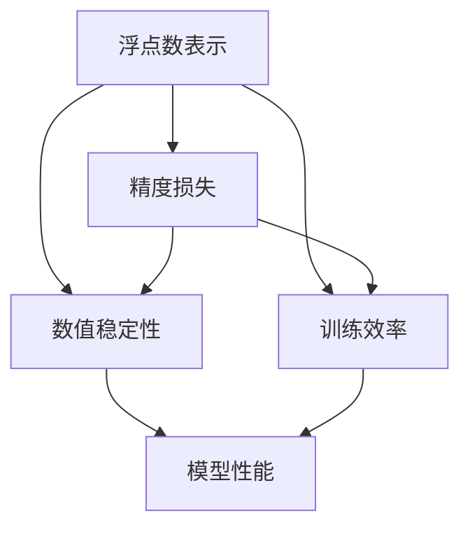
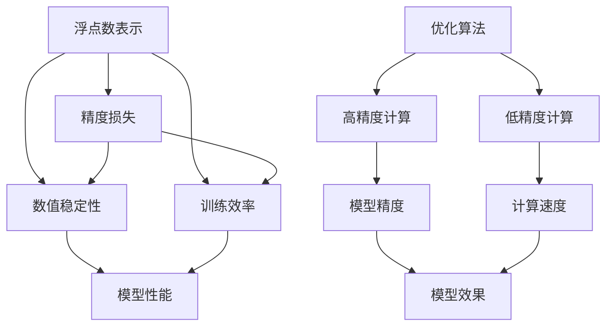

                 

## 1. 背景介绍

在人工智能（AI）计算中，浮点数精度是一个既重要又复杂的话题。浮点数在计算机科学中用于表示实数，但由于计算机使用有限的位数来表示这些数，因此不可避免地存在精度损失。在AI计算中，浮点数的精度对模型的性能、稳定性、训练和推理效率有着深远的影响。本博客将深入探讨浮点数精度的概念、影响及其在AI计算中的重要性，并提供具体的方法和实践建议，以帮助开发者在实际项目中更有效地管理和利用浮点数精度。

## 2. 核心概念与联系

### 2.1 核心概念概述

浮点数精度在AI计算中扮演着双刃剑的角色，它既是模型训练和推理的基石，也是性能提升和优化的瓶颈。以下是与浮点数精度相关的几个核心概念：

- **浮点数表示**：计算机使用固定位数来表示实数，这种表示方式会导致精度损失。例如，IEEE 754标准定义了单精度（32位）和双精度（64位）浮点数。
- **精度损失**：由于计算机使用有限位数来表示实数，因此无法精确表示某些实数，导致精度损失。例如，数值过大的数会被截断或舍入，这会影响模型的计算精度。
- **数值稳定性**：数值稳定性指模型在计算过程中的稳定性和准确性。精度损失和数值不稳定可能会导致模型输出不正确或产生异常。
- **训练效率**：在AI模型训练过程中，浮点数的精度和计算速度密切相关。高精度计算需要更多的时间和计算资源，而低精度计算则可以提高训练和推理的速度。

这些概念之间的逻辑关系可以通过以下Mermaid流程图来展示：



这个流程图展示了浮点数表示与精度损失、数值稳定性、训练效率之间的关系，以及这些因素如何影响模型性能。

### 2.2 核心概念原理和架构的 Mermaid 流程图



这个流程图进一步细化了浮点数精度对AI模型性能的影响，并引入了优化算法、高精度计算和低精度计算等概念。

## 3. 核心算法原理 & 具体操作步骤

### 3.1 算法原理概述

AI模型在训练和推理过程中，广泛使用浮点数进行数值计算。浮点数的精度对模型的性能和稳定性有着重要影响。高精度计算可以提升模型的精度和鲁棒性，但同时也会增加计算开销。低精度计算则可以加速训练和推理过程，但可能会引入数值不稳定和精度损失。因此，如何在精度和效率之间找到平衡，是AI计算中一个重要的问题。

### 3.2 算法步骤详解

浮点数精度的管理通常包括以下几个步骤：

1. **确定精度要求**：根据具体任务和应用场景，确定所需的浮点数精度。例如，对于图像识别等高精度要求的任务，可能需要使用高精度浮点数；而对于实时性要求较高的任务，则需要考虑使用低精度浮点数。
2. **选择合适的数据类型**：根据精度要求，选择合适的数据类型，如单精度浮点数、双精度浮点数、定点数等。
3. **优化计算过程**：使用优化算法和技术，如量化、剪枝、矩阵分解等，提高计算效率，同时尽量减少精度损失。
4. **测试和评估**：在实际应用中，定期评估模型性能，调整精度和计算策略，以获得最佳效果。

### 3.3 算法优缺点

#### 优点

- **提高计算效率**：使用低精度浮点数可以减少计算资源的使用，加速训练和推理过程。
- **减少内存使用**：低精度浮点数占用更少的内存空间，有助于优化系统资源利用率。
- **减少数值不稳定**：高精度浮点数可以减少数值不稳定，提高模型的鲁棒性。

#### 缺点

- **增加计算开销**：高精度浮点数计算需要更多的计算资源和时间。
- **引入精度损失**：低精度浮点数计算可能会引入数值不稳定和精度损失。
- **复杂度增加**：优化高精度计算需要更复杂的算法和技术，增加了开发难度。

### 3.4 算法应用领域

浮点数精度在AI计算中的应用领域非常广泛，包括但不限于：

- **计算机视觉**：在图像识别、目标检测等任务中，高精度浮点数有助于提升模型精度，低精度浮点数则可加速计算。
- **自然语言处理**：在语言模型训练和推理中，浮点数精度对模型效果和训练效率有重要影响。
- **语音识别**：在声学模型训练和推理中，高精度浮点数可以提高模型准确性，低精度浮点数则可加快推理速度。
- **推荐系统**：在推荐算法训练和推理中，浮点数精度对模型效果和推荐速度有重要影响。

## 4. 数学模型和公式 & 详细讲解 & 举例说明

### 4.1 数学模型构建

在AI模型中，浮点数的精度通常由数据类型决定。以下是几种常见浮点数数据类型的数学模型：

- **单精度浮点数**：用32位表示，包括1位符号位、8位指数位、23位尾数位。其数学模型为：
$$
f(x) = (-1)^s \times (1+\sum_{i=0}^{22} x_i \times 2^{-(i+1)})
$$
其中，$s$ 表示符号位，$x_i$ 表示尾数位。
- **双精度浮点数**：用64位表示，包括1位符号位、11位指数位、52位尾数位。其数学模型为：
$$
f(x) = (-1)^s \times (1+\sum_{i=0}^{51} x_i \times 2^{-(i+1)})
$$

### 4.2 公式推导过程

由于计算机使用固定位数来表示浮点数，因此在进行数值计算时，可能会出现精度损失和数值不稳定。以下是一些常见的数值计算问题及其公式推导：

- **截断误差**：在进行数值计算时，超过数据类型表示范围的数会被截断，导致精度损失。例如，计算 $1 + 2^{53-1}$ 时，结果会被截断为无限大。
- **舍入误差**：在进行数值计算时，超过数据类型表示范围的数会被舍入，导致精度损失。例如，计算 $\sqrt{2}$ 时，结果会被舍入为无限循环小数。
- **数值不稳定**：在进行数值计算时，小的数值变化可能会产生大的误差，导致数值不稳定。例如，计算 $\frac{1}{x}$ 时，$x$ 接近0时会产生无限大或无限小的结果。

### 4.3 案例分析与讲解

以神经网络中的反向传播算法为例，分析浮点数精度对模型性能的影响：

- **高精度计算**：使用双精度浮点数进行反向传播，可以得到较为精确的梯度值，提高模型的收敛速度和准确性。
- **低精度计算**：使用单精度浮点数进行反向传播，可以减少计算开销，加速训练过程，但可能会引入数值不稳定和精度损失。
- **量化技术**：使用量化技术（如8位整数量化），可以在保持一定精度的同时，大幅减少计算资源的使用。

## 5. 项目实践：代码实例和详细解释说明

### 5.1 开发环境搭建

在进行浮点数精度管理时，需要一个适合的环境来进行开发和测试。以下是使用Python和TensorFlow搭建开发环境的步骤：

1. 安装Python和TensorFlow：确保Python和TensorFlow版本匹配，并能够正确运行。
2. 安装NumPy和Pillow：这些库用于进行数值计算和图像处理。
3. 安装tf-nightly：这是一个TensorFlow的开发版本，包含最新功能和API支持。

### 5.2 源代码详细实现

以下是一个简单的TensorFlow模型训练代码，展示了如何在模型中使用单精度和双精度浮点数：

```python
import tensorflow as tf
import numpy as np

# 使用双精度浮点数
x = tf.constant([1.0, 2.0, 3.0], dtype=tf.float64)
y = tf.constant([4.0, 5.0, 6.0], dtype=tf.float64)
z = x + y

# 使用单精度浮点数
x = tf.constant([1.0, 2.0, 3.0], dtype=tf.float32)
y = tf.constant([4.0, 5.0, 6.0], dtype=tf.float32)
z = x + y

# 输出结果
with tf.Session() as sess:
    print(sess.run(z))
```

### 5.3 代码解读与分析

上述代码展示了在TensorFlow中使用单精度和双精度浮点数进行基本算术运算。通过运行代码，我们可以看到，单精度浮点数和双精度浮点数在精度和计算速度上的差异。

## 6. 实际应用场景

### 6.1 计算机视觉

在计算机视觉中，浮点数精度对模型性能和训练效率有重要影响。例如，在图像分类任务中，使用高精度浮点数可以提升模型的准确性，但会增加计算开销；使用低精度浮点数则可以加速训练过程，但可能会引入数值不稳定。

### 6.2 自然语言处理

在自然语言处理中，浮点数精度对语言模型的训练和推理效果有重要影响。例如，在机器翻译任务中，高精度浮点数可以提高翻译质量，但会增加计算开销；使用低精度浮点数则可以加速推理过程，但可能会引入数值不稳定。

### 6.3 语音识别

在语音识别中，浮点数精度对声学模型的训练和推理效果有重要影响。例如，在高精度浮点数上进行声学模型训练可以提高语音识别准确性，但会增加计算开销；使用低精度浮点数则可以加速推理过程，但可能会引入数值不稳定。

### 6.4 推荐系统

在推荐系统中，浮点数精度对推荐算法的效果和速度有重要影响。例如，在高精度浮点数上进行推荐算法训练可以提高推荐质量，但会增加计算开销；使用低精度浮点数则可以加速推理过程，但可能会引入数值不稳定。

## 7. 工具和资源推荐

### 7.1 学习资源推荐

为了帮助开发者深入理解浮点数精度在AI计算中的作用，以下是一些推荐的学习资源：

1. **《深度学习》（Ian Goodfellow 等著）**：这本书是深度学习领域的经典之作，详细介绍了深度学习的基础知识和应用。
2. **TensorFlow官方文档**：TensorFlow官方文档提供了丰富的教程和示例，帮助开发者快速上手TensorFlow进行浮点数精度的管理。
3. **PyTorch官方文档**：PyTorch官方文档提供了详细的教程和示例，帮助开发者快速上手PyTorch进行浮点数精度的管理。

### 7.2 开发工具推荐

以下是一些推荐用于浮点数精度管理的开发工具：

1. **TensorFlow**：TensorFlow是Google开发的深度学习框架，支持多种数据类型和优化算法，适用于高性能计算和浮点数精度的管理。
2. **PyTorch**：PyTorch是Facebook开发的深度学习框架，支持动态计算图和自动微分，适用于灵活高效的浮点数精度管理。
3. **MXNet**：MXNet是Apache开发的深度学习框架，支持多种数据类型和优化算法，适用于高性能计算和浮点数精度的管理。

### 7.3 相关论文推荐

以下是一些推荐的相关论文，帮助开发者深入理解浮点数精度在AI计算中的作用：

1. **"Revisiting Floating-Point Precision in Deep Learning"**：这篇论文讨论了浮点数精度对深度学习模型性能的影响，提出了多种优化策略。
2. **"Floating-Point Arithmetic in Deep Neural Networks: Issues and Recommendations"**：这篇论文讨论了深度神经网络中浮点数精度管理的问题，提出了多种优化策略。
3. **"Quantization and Quantization-Aware Training: A Survey"**：这篇论文总结了量化技术在深度学习中的应用，讨论了多种量化策略和优化方法。

## 8. 总结：未来发展趋势与挑战

### 8.1 研究成果总结

浮点数精度在AI计算中扮演着双刃剑的角色，既影响模型的性能和稳定性，也影响训练和推理效率。通过合理的浮点数精度管理，可以有效提升AI系统的性能和可靠性。

### 8.2 未来发展趋势

未来，浮点数精度管理将在以下几个方面取得新的进展：

1. **量化技术的进步**：量化技术将成为浮点数精度管理的重要手段，进一步减少计算开销，提升计算效率。
2. **低精度计算的应用**：低精度计算将继续在AI系统中广泛应用，加速训练和推理过程。
3. **混合精度计算**：混合精度计算将成为一种新的趋势，在保持一定精度的同时，大幅提升计算效率。
4. **模型优化算法**：新的模型优化算法将进一步提升浮点数精度的管理效果，减少数值不稳定和精度损失。

### 8.3 面临的挑战

尽管浮点数精度管理已经取得了一些进展，但在实际应用中仍面临一些挑战：

1. **精度和速度的平衡**：如何在精度和速度之间找到最佳平衡，是浮点数精度管理的重要挑战。
2. **数值不稳定的处理**：数值不稳定的问题仍然存在，需要通过算法优化和模型改进来提升模型的鲁棒性。
3. **开发复杂度增加**：浮点数精度管理增加了开发难度，需要更多的技术储备和经验积累。

### 8.4 研究展望

未来，浮点数精度管理的研究将在以下几个方面进行探索：

1. **新型数据类型**：开发新型数据类型，如混合精度数据类型，进一步提升计算效率。
2. **多精度计算**：探索多精度计算，即在计算过程中同时使用多种精度浮点数，提升计算效果。
3. **自适应精度管理**：开发自适应精度管理算法，根据计算需求自动调整浮点数精度，提升计算效果。
4. **模型压缩技术**：通过模型压缩技术，减少浮点数计算开销，提升计算效率。

通过不断探索和创新，浮点数精度管理将为AI系统的性能和效率带来新的突破，推动AI技术的快速发展。

## 9. 附录：常见问题与解答

**Q1: 什么是浮点数精度损失？**

A: 浮点数精度损失是指在计算机中使用有限位数来表示实数时，由于舍入和截断等原因导致的数值不准确。

**Q2: 如何提高浮点数的精度？**

A: 提高浮点数精度的方法包括使用更高精度数据类型（如双精度浮点数）、优化计算过程（如量化、剪枝）、使用更高精度算法（如自适应精度管理算法）等。

**Q3: 低精度浮点数计算的优点和缺点是什么？**

A: 低精度浮点数计算的优点是计算速度快、内存占用小，但缺点是数值不稳定、精度损失较大。

**Q4: 浮点数精度管理在AI系统中的应用有哪些？**

A: 浮点数精度管理在AI系统中的应用包括计算机视觉、自然语言处理、语音识别、推荐系统等，对模型性能和计算效率有重要影响。

**Q5: 如何在AI系统中进行浮点数精度优化？**

A: 在AI系统中进行浮点数精度优化的常用方法包括量化技术、混合精度计算、自适应精度管理、优化算法等。

