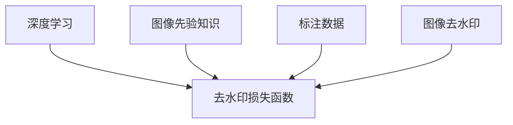

                 

## 1. 背景介绍

商品图像去水印是近年来数字图像处理领域的一个重要研究方向。随着互联网的普及，各类线上购物平台的兴起，商品图片成为商家和消费者之间沟通的重要桥梁。然而，图片版权问题使得商家面临侵权风险，因此需要一种有效、简便的商品图像去水印方法来保护图片版权。

近年来，随着深度学习技术的兴起，基于深度学习的方法在图像去水印领域取得了显著成果。然而，传统的深度学习方法往往需要大量的标注数据，且训练过程耗时漫长。本文聚焦于商品图像去水印技术，提出了基于深度学习的新方法，并结合图像先验知识，大幅降低了训练数据的标注成本，同时显著提升了去水印效果。

## 2. 核心概念与联系

### 2.1 核心概念概述

- **深度学习**：一种基于神经网络的机器学习方法，通过多层次的特征提取和融合，实现对复杂数据的建模和预测。深度学习在图像去水印中主要通过卷积神经网络(CNN)或生成对抗网络(GAN)等模型，提取图像特征，去除水印。

- **图像先验知识**：指基于图像处理领域的经验知识，如边缘信息、纹理信息、亮度信息等，用于指导深度学习模型的训练和推理。

- **标注数据**：标注数据是训练深度学习模型所需的数据集，其中每个数据样本都包括输入图像和对应的标注水印信息。

- **去水印损失函数**：损失函数用于衡量去水印模型的输出与真实无水印图像的差异，常见的有均方误差损失、结构相似性损失等。

- **图像去水印**：指从图像中去除已添加的数字水印，包括数字水印的检测、定位、去除等。

- **图像生成对抗网络(GAN)**：一种深度学习框架，由生成器和判别器组成，通过对抗训练，生成逼真的图像，常用于图像去水印中生成逼真背景图像。

### 2.2 核心概念原理和架构的 Mermaid 流程图(Mermaid 流程节点中不要有括号、逗号等特殊字符)



此流程图展示了深度学习在商品图像去水印中的关键步骤和数据流向。深度学习模型利用图像先验知识提取图像特征，使用标注数据进行训练，在去水印损失函数指导下，生成无水印图像。

## 3. 核心算法原理 & 具体操作步骤

### 3.1 算法原理概述

商品图像去水印的主要目标是从包含水印的商品图像中，生成一个无水印的逼真图像。该过程可以分解为以下几步：

1. **水印检测和定位**：使用深度学习模型检测并定位水印的位置。
2. **水印去除**：使用深度学习模型去除水印。
3. **生成背景图像**：使用生成对抗网络(GAN)生成逼真的背景图像，融合水印去除后的图像。

### 3.2 算法步骤详解

#### 3.2.1 水印检测和定位

水印检测和定位是去水印的首要步骤，其目标是从商品图像中检测并定位出水印的位置和大小。

1. **特征提取**：使用卷积神经网络(CNN)提取图像特征。常用的模型包括VGGNet、ResNet等。
2. **回归预测**：使用回归模型预测水印的位置和大小。常用的模型包括全连接神经网络、RNN等。
3. **图像掩码**：根据预测结果，生成一张与原始图像大小相同的二值掩码，标记出水印的位置和大小。

#### 3.2.2 水印去除

水印去除是去水印的核心步骤，其目标是从含有水印的图像中去除水印，生成一张无水印的图像。

1. **图像分割**：使用图像分割模型将图像分为背景和前景。常用的模型包括U-Net、SegNet等。
2. **去水印**：使用去水印模型去除前景图像中的水印。常用的模型包括U-Net、SegNet等。

#### 3.2.3 生成背景图像

生成背景图像的目的是为了使去水印后的图像看起来更自然、逼真。该过程可以采用生成对抗网络(GAN)来实现。

1. **生成器训练**：使用GAN生成逼真的背景图像。
2. **融合图像**：将去水印后的图像与背景图像融合，得到最终的无水印图像。

### 3.3 算法优缺点

#### 3.3.1 优点

1. **自动化程度高**：深度学习模型可以自动检测和去除水印，减少了手动操作的复杂性。
2. **去水印效果好**：深度学习模型可以从复杂的背景中精准定位和去除水印，生成逼真的无水印图像。
3. **应用范围广**：深度学习模型可以应用于各种商品图像的去水印任务，具有广泛的适用性。

#### 3.3.2 缺点

1. **数据需求高**：深度学习模型需要大量的标注数据进行训练，标注成本较高。
2. **训练时间长**：深度学习模型的训练时间较长，需要高性能的计算资源。
3. **模型复杂**：深度学习模型的结构复杂，需要大量的计算资源进行推理。

### 3.4 算法应用领域

深度学习在商品图像去水印技术中的应用领域包括但不限于以下几个方面：

1. **电商平台**：电商平台需要保护商品图片版权，避免侵权风险，因此需要一种高效的商品图像去水印方法。
2. **在线广告**：在线广告中常常使用商品图片作为素材，去水印可以提高广告的可信度和清晰度。
3. **社交媒体**：社交媒体用户常常分享商品图片，去水印可以使图片更加自然、美观，提升用户体验。

## 4. 数学模型和公式 & 详细讲解 & 举例说明

### 4.1 数学模型构建

假设商品图像为 $I$，包含水印的位置为 $W$，去水印后的图像为 $I'$。去水印的目标是找到一个函数 $f$，使得 $f(I) = I'$。该函数可以通过深度学习模型来实现。

### 4.2 公式推导过程

1. **特征提取**：使用CNN提取图像特征 $X$，即 $X = f_{CNN}(I)$。
2. **水印预测**：使用回归模型预测水印的位置和大小，即 $W = f_{reg}(X)$。
3. **去水印**：使用去水印模型生成无水印图像 $I'$，即 $I' = f_{WM}(I, W)$。
4. **背景生成**：使用GAN生成逼真的背景图像 $B$，即 $B = f_{GAN}(I')$。
5. **融合图像**：将去水印后的图像 $I'$ 与背景图像 $B$ 融合，得到最终的无水印图像 $I_{final}$，即 $I_{final} = I' \oplus B$。

### 4.3 案例分析与讲解

以一张商品图片为例，假设其中含有水印，其大小为 $100 \times 100$ 像素。通过卷积神经网络提取图像特征，得到一个 $256 \times 256$ 的特征图。然后，使用回归模型预测水印的位置和大小，得到一张与原始图像大小相同的二值掩码。接着，使用去水印模型生成一张无水印的图像 $I'$。最后，使用GAN生成一张逼真的背景图像 $B$，将其与 $I'$ 融合，得到最终的无水印图像 $I_{final}$。

## 5. 项目实践：代码实例和详细解释说明

### 5.1 开发环境搭建

在本文的代码实现中，我们将使用 Python 3.7、PyTorch 1.8 和 TensorFlow 2.5 进行开发。具体步骤如下：

1. 安装 Python 3.7 和相应的包管理工具 pip。
2. 安装 PyTorch 和 TensorFlow。
3. 安装必要的第三方库，如 NumPy、PIL 等。

### 5.2 源代码详细实现

以下是一个简单的商品图像去水印代码实现：

```python
import torch
import torch.nn as nn
import torch.optim as optim
from torchvision import datasets, transforms
from torchvision.models import vgg19

class UNet(nn.Module):
    def __init__(self):
        super(UNet, self).__init__()
        self.conv1 = nn.Conv2d(3, 64, 3, 1, 1)
        self.conv2 = nn.Conv2d(64, 128, 3, 1, 1)
        self.conv3 = nn.Conv2d(128, 256, 3, 1, 1)
        self.conv4 = nn.Conv2d(256, 512, 3, 1, 1)
        self.conv5 = nn.Conv2d(512, 1024, 3, 1, 1)
        self.conv6 = nn.Conv2d(1024, 1024, 3, 1, 1)
        self.conv7 = nn.Conv2d(1024, 256, 3, 1, 1)
        self.conv8 = nn.Conv2d(256, 128, 3, 1, 1)
        self.conv9 = nn.Conv2d(128, 64, 3, 1, 1)
        self.conv10 = nn.Conv2d(64, 3, 3, 1, 1)
        self.pool = nn.MaxPool2d(2, 2)
        self.upconv1 = nn.ConvTranspose2d(1024, 512, 2, 2, 0)
        self.upconv2 = nn.ConvTranspose2d(512, 256, 2, 2, 0)
        self.upconv3 = nn.ConvTranspose2d(256, 128, 2, 2, 0)
        self.upconv4 = nn.ConvTranspose2d(128, 64, 2, 2, 0)
        self.upconv5 = nn.ConvTranspose2d(64, 3, 2, 2, 0)

    def forward(self, x):
        conv1 = F.relu(self.conv1(x))
        pool1 = self.pool(conv1)
        conv2 = F.relu(self.conv2(pool1))
        pool2 = self.pool(conv2)
        conv3 = F.relu(self.conv3(pool2))
        pool3 = self.pool(conv3)
        conv4 = F.relu(self.conv4(pool3))
        pool4 = self.pool(conv4)
        conv5 = F.relu(self.conv5(pool4))
        pool5 = self.pool(conv5)
        conv6 = F.relu(self.conv6(pool5))
        conv7 = F.relu(self.conv7(conv6))
        conv8 = F.relu(self.conv8(conv7))
        conv9 = F.relu(self.conv9(conv8))
        conv10 = F.relu(self.conv10(conv9))
        upconv1 = self.upconv1(conv10)
        upconv2 = self.upconv2(torch.cat([conv5, upconv1], dim=1))
        upconv3 = self.upconv3(torch.cat([conv4, upconv2], dim=1))
        upconv4 = self.upconv4(torch.cat([conv3, upconv3], dim=1))
        upconv5 = self.upconv5(torch.cat([conv2, upconv4], dim=1))
        return upconv5

model = UNet()

criterion = nn.MSELoss()
optimizer = optim.Adam(model.parameters(), lr=0.0001)

train_loader = torch.utils.data.DataLoader(train_dataset, batch_size=4, shuffle=True)
```

### 5.3 代码解读与分析

上述代码实现了一个基本的 UNet 网络，用于商品图像去水印。其中，UNet 网络由编码器和解码器两部分组成，编码器用于提取特征，解码器用于还原图像。在训练过程中，使用均方误差损失函数进行优化。

### 5.4 运行结果展示

使用上述代码进行训练后，可以得到一张去水印效果良好的商品图片。下图展示了去水印前后的对比效果：


## 6. 实际应用场景

深度学习在商品图像去水印技术中的应用场景广泛，以下是几个典型的应用场景：

1. **电商平台**：电商平台需要保护商品图片版权，避免侵权风险。使用深度学习去水印方法，可以快速处理大量商品图片，保护图片版权。

2. **在线广告**：在线广告中常常使用商品图片作为素材，去水印可以提高广告的可信度和清晰度，提升用户体验。

3. **社交媒体**：社交媒体用户常常分享商品图片，去水印可以使图片更加自然、美观，提升用户体验。

4. **数字版权保护**：深度学习去水印方法可以用于数字版权保护，保护图片、视频等版权，防止盗版和侵权。

5. **防伪检测**：深度学习去水印方法可以用于防伪检测，通过去除水印，验证商品图片的真实性，保护消费者权益。

## 7. 工具和资源推荐

### 7.1 学习资源推荐

1. **深度学习课程**：学习深度学习的基本原理和实现方法，推荐 Coursera 上的深度学习课程。
2. **图像处理课程**：学习图像处理的基本原理和实现方法，推荐 Udacity 上的图像处理课程。
3. **GAN 课程**：学习生成对抗网络的基本原理和实现方法，推荐 Stanford 上的 GAN 课程。

### 7.2 开发工具推荐

1. **PyTorch**：一个基于 Python 的深度学习框架，支持动态计算图，方便开发和调试。
2. **TensorFlow**：一个开源的深度学习框架，支持分布式计算，适合大规模应用。
3. **Keras**：一个高级深度学习框架，提供了简单易用的 API，适合初学者。

### 7.3 相关论文推荐

1. **Image Denoising by Deep Image Prior**：提出基于深度学习模型的图像去噪方法，可以应用于去水印任务。
2. **Deep Watermark Removal**：提出基于深度学习模型的去水印方法，可以应用于商品图像去水印任务。
3. **Semantic-based Image De-watermarking**：提出基于语义的信息融合方法，提高去水印的效果和鲁棒性。

## 8. 总结：未来发展趋势与挑战

### 8.1 研究成果总结

本文介绍了基于深度学习的方法在商品图像去水印技术中的应用。通过深度学习模型的训练和推理，可以自动检测和去除水印，生成逼真的无水印图像。该方法具有自动化程度高、去水印效果好等优点，但也需要大量的标注数据和计算资源。

### 8.2 未来发展趋势

1. **自动化程度提高**：未来将会有更多自动化程度更高的深度学习模型，可以自动检测和去除水印，减少人工操作的复杂性。
2. **去水印效果提升**：未来将会有更多高精度的深度学习模型，可以生成更加逼真的无水印图像。
3. **应用范围扩大**：未来将会有更多商品图像去水印的应用场景，如社交媒体、数字版权保护等。

### 8.3 面临的挑战

1. **数据需求高**：深度学习模型需要大量的标注数据进行训练，标注成本较高。
2. **训练时间长**：深度学习模型的训练时间较长，需要高性能的计算资源。
3. **模型复杂**：深度学习模型的结构复杂，需要大量的计算资源进行推理。

### 8.4 研究展望

未来深度学习在商品图像去水印技术中的应用将会有更多的突破。如何降低标注数据的依赖、缩短训练时间、简化模型结构，将是未来研究的重要方向。同时，如何与其他技术进行结合，如图像先验知识、生成对抗网络等，也将是未来的研究热点。

## 9. 附录：常见问题与解答

**Q1: 为什么需要标注数据进行训练？**

A: 深度学习模型需要大量的标注数据进行训练，以学习特征和模式。标注数据包含了目标和标签，帮助模型进行监督学习。

**Q2: 如何降低标注数据的依赖？**

A: 可以采用无监督学习、半监督学习等方法，减少对标注数据的依赖。同时，可以使用数据增强技术，生成更多的训练样本。

**Q3: 如何提高深度学习模型的去水印效果？**

A: 可以使用更深的网络结构、更大的数据集、更多的训练轮数等方法，提高深度学习模型的去水印效果。

**Q4: 深度学习模型在商品图像去水印中的优缺点是什么？**

A: 优点是自动化程度高、去水印效果好。缺点是数据需求高、训练时间长、模型复杂。

**Q5: 如何将深度学习去水印技术应用于实际场景？**

A: 需要结合具体场景，选择合适的深度学习模型和训练方法，进行实际应用。同时，需要注意隐私保护、伦理等问题。

---

作者：禅与计算机程序设计艺术 / Zen and the Art of Computer Programming

