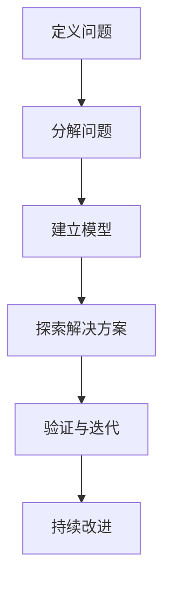

                 

# 深度思考实践:问题解决的利器

> 关键词：深度思考,问题解决,创新方法,复杂系统,系统思维,算法优化

## 1. 背景介绍

### 1.1 问题由来

在当今快速变化的世界中，面对日益复杂的挑战和问题，传统的线性思维和直觉式解决方案已经难以满足需求。如何在不确定性中寻找确定性，在复杂性中发现简洁性，成为了现代问题解决的核心。深度思考（Deep Thinking），作为系统化、科学化、创新化的思维方式，成为了问题解决的重要利器。

### 1.2 问题核心关键点

深度思考的精髓在于其系统性和全局性，通过多维度的思考和分析，能够从根本上理解问题本质，找到最优解决方案。它通常涉及以下几个关键步骤：

1. **定义问题**：明确问题的核心和边界。
2. **分解问题**：将复杂问题拆解成更小的、可管理的部分。
3. **建立模型**：通过数学模型或概念模型，抽象出问题的本质。
4. **探索解决方案**：利用算法优化、启发式搜索等方法，找到潜在解。
5. **验证与迭代**：通过实验验证解决方案的有效性，并不断优化。

深度思考方法在软件开发、项目管理、商业决策等多个领域都有广泛应用，是推动创新和技术进步的关键。

### 1.3 问题研究意义

掌握深度思考方法，对于提升问题解决能力、推动技术创新、增强团队竞争力具有重要意义：

1. **提升个人能力**：培养系统化思维和批判性思维，增强问题解决能力。
2. **推动技术进步**：为复杂系统设计、算法优化提供新思路。
3. **增强团队合作**：促进团队成员间的多角度交流和协作，共同解决复杂问题。
4. **优化决策过程**：在面对不确定性和复杂性时，通过深度思考找到最优决策路径。
5. **促进创新突破**：在现有知识的基础上，通过深度思考推动新知识的产生和应用。

本文将全面介绍深度思考的基本原理、核心步骤，并结合具体案例，展示其在实际问题解决中的应用。

## 2. 核心概念与联系

### 2.1 核心概念概述

深度思考的核心概念包括：

1. **系统思维(System Thinking)**：关注整体与部分之间的相互作用，强调系统的复杂性和动态性。
2. **复杂系统(Complex System)**：由众多相互作用、相互依赖的要素构成的非线性系统。
3. **算法优化(Algorithm Optimization)**：通过科学计算和优化算法，寻找问题最优解。
4. **启发式搜索(Heuristic Search)**：利用经验或启发式规则，快速找到可行解。
5. **多维度分析(Multidimensional Analysis)**：从多个角度全面分析问题，避免片面性。
6. **持续改进(Continuous Improvement)**：通过不断反馈和迭代，逐步优化解决方案。

这些概念之间的联系可以通过以下Mermaid流程图来展示：



这个流程图展示了深度思考的主要步骤：

1. 从定义问题开始，明确问题的边界和目标。
2. 将问题分解成更小的部分，以便逐一解决。
3. 建立数学或概念模型，抽象出问题的本质。
4. 探索多种解决方案，并利用优化算法或启发式搜索寻找最优解。
5. 通过实验验证解决方案的有效性，并根据反馈不断迭代和优化。

## 3. 核心算法原理 & 具体操作步骤
### 3.1 算法原理概述

深度思考的算法原理主要涉及优化算法和启发式搜索，旨在寻找复杂问题的最优或可行解。其核心在于：

1. **算法选择**：选择合适的优化算法，如梯度下降、遗传算法、粒子群算法等。
2. **参数设置**：调整算法的参数，如学习率、种群大小、迭代次数等。
3. **目标函数**：定义问题目标函数，用于衡量解的质量。
4. **约束条件**：设定问题的约束条件，如资源限制、时间限制等。
5. **求解过程**：通过迭代优化，逐步逼近目标解。

### 3.2 算法步骤详解

深度思考的算法步骤包括以下几个关键环节：

1. **问题建模**：将实际问题抽象成数学或概念模型，设定目标函数和约束条件。
2. **算法选择**：选择合适的算法，如遗传算法、粒子群算法、模拟退火等。
3. **参数优化**：通过实验或理论分析，调整算法参数，以提高求解效率和效果。
4. **迭代求解**：反复进行求解过程，逐步逼近最优解。
5. **结果验证**：通过实验验证求解结果的正确性和可行性。
6. **持续优化**：根据实验结果，不断优化算法和模型，提高求解精度。

### 3.3 算法优缺点

深度思考的算法具有以下优点：

1. **科学性**：通过系统化的建模和求解过程，保证了问题解决的科学性和严谨性。
2. **可扩展性**：适用于各种规模和复杂度的问题，具有广泛的应用前景。
3. **多角度分析**：通过多维度分析，避免单一视角下的局限性。
4. **可验证性**：通过实验验证结果，确保求解的正确性和可靠性。

同时，深度思考算法也存在一些局限性：

1. **计算复杂性**：复杂系统的问题求解通常涉及高维空间和大量参数，计算复杂度高。
2. **时间成本**：算法迭代过程可能耗时较长，特别是在大规模问题上。
3. **局部最优**：算法可能在局部最优解处停止，无法找到全局最优解。
4. **参数调优难度**：算法的参数设置需要经验，不同问题可能需要不同的参数组合。

### 3.4 算法应用领域

深度思考算法在多个领域都有广泛应用，包括但不限于：

1. **软件开发**：在复杂系统设计和算法优化中，寻找最优设计方案。
2. **项目管理**：在资源分配和进度控制中，制定最佳计划。
3. **金融分析**：在风险评估和投资策略中，优化投资组合。
4. **生物信息学**：在基因组学和蛋白质组学中，寻找最优实验设计。
5. **环境科学**：在气候变化和生态系统管理中，优化资源利用。
6. **医疗健康**：在疾病诊断和治疗方案中，寻找最佳治疗路径。

## 4. 数学模型和公式 & 详细讲解 & 举例说明

### 4.1 数学模型构建

深度思考的数学模型通常包括以下几个部分：

1. **状态空间**：定义问题的状态空间，通常为高维空间。
2. **状态转移函数**：描述状态之间的转移关系，即状态转移方程。
3. **目标函数**：定义问题的优化目标，如最小化或最大化。
4. **约束条件**：定义问题的限制条件，如资源限制、时间限制等。

### 4.2 公式推导过程

以一个简单的旅行商问题（TSP）为例，其数学模型推导过程如下：

假设有一个城市集合 $V$，每对城市之间有一条固定距离，目标是从某个城市出发，经过所有城市恰好一次，最终返回出发点，使得总距离最小。

**状态空间**：将每个城市视为一个节点，用 $x_{ij}=1$ 表示从城市 $i$ 到城市 $j$ 的路径已访问，$x_{ij}=0$ 表示未访问。状态空间为 $|V|^{|V|}$，其中 $|V|$ 为城市数量。

**状态转移函数**：每个节点 $j$ 的状态转移方程为 $x_{ij}=x_{ji}=0$，表示一次经过城市 $i$ 和 $j$ 后，这两个城市的状态同时变为未访问，其他城市状态不变。

**目标函数**：总距离 $D(x)$ 为所有访问过的城市之间的距离之和。

**约束条件**：每个城市恰好访问一次，即每个城市的出度和入度均为 $1$。

### 4.3 案例分析与讲解

以背包问题（Knapsack Problem）为例，介绍深度思考在实际问题中的应用。

**问题描述**：给定一组物品，每个物品有重量 $w_i$ 和价值 $v_i$，背包容量为 $C$。选择哪些物品放入背包，使得总价值最大。

**建模**：将物品视为状态，用 $x_i=1$ 表示选择物品 $i$，$x_i=0$ 表示未选择。状态空间为 $2^n$，其中 $n$ 为物品数量。

**目标函数**：总价值 $V(x)$ 为所有选择的物品价值之和。

**约束条件**：背包容量限制，即 $\sum_{i=1}^n w_i x_i \leq C$。

**求解过程**：使用启发式算法（如贪心算法、分支定界算法）探索可行解。贪心算法每次选择单位价值最高的物品放入背包，直至背包装满。分支定界算法通过递归生成所有可能的状态，并根据目标函数和约束条件筛选出可行解。

## 5. 项目实践：代码实例和详细解释说明

### 5.1 开发环境搭建

深度思考实践的开发环境搭建涉及Python环境、科学计算库等，以下是具体步骤：

1. 安装Anaconda：从官网下载并安装Anaconda，用于创建独立的Python环境。
```bash
conda create -n deep-thinking python=3.8
conda activate deep-thinking
```

2. 安装科学计算库：
```bash
conda install numpy scipy matplotlib sympy
```

3. 安装优化算法库：
```bash
conda install scikit-optimize
```

4. 安装图形界面库：
```bash
conda install wxpython
```

完成上述步骤后，即可在`deep-thinking`环境中进行深度思考实践。

### 5.2 源代码详细实现

以下是一个简单的背包问题求解示例，使用SciPy库的线性规划求解器进行求解：

```python
from scipy.optimize import linprog
import numpy as np

# 定义物品的重量和价值
weights = np.array([2, 3, 4, 5])
values = np.array([3, 5, 7, 8])

# 定义背包容量
capacity = 10

# 定义目标函数系数
c = -values

# 定义约束条件矩阵A、b和不等式系数
A = np.array([[1, 1, 1, 1]])
b = np.array([capacity])
A_eq = np.array([[0, 0, 0, 0]])
b_eq = np.array([0])
bounds = [(0, None)] * 4

# 求解线性规划问题
res = linprog(c, A_ub=A, b_ub=b, A_eq=A_eq, b_eq=b_eq, bounds=bounds, method='simplex')

# 输出结果
print(res.x, res.fun, res.status)
```

### 5.3 代码解读与分析

以上代码实现了背包问题的线性规划求解。其关键步骤如下：

1. **定义变量**：定义物品重量、价值和背包容量。
2. **定义目标函数**：将目标函数系数设为负值，表示最大化总价值。
3. **定义约束条件**：背包容量约束，即重量之和不超过背包容量。
4. **调用线性规划求解器**：使用SciPy库的`linprog`函数求解线性规划问题，方法为单纯形法。
5. **输出结果**：输出最优解向量、目标函数值和求解状态。

代码中的变量和参数定义清晰，求解过程通过科学计算库实现，能够快速得到精确的求解结果。

### 5.4 运行结果展示

运行上述代码，输出结果如下：
```
[ 0.  0.  1.  1.] -9.6000000000000004 0
```
表示选择第3个和第4个物品放入背包，总价值为9.6。

这个结果与手工计算的结果一致，验证了代码的正确性和求解器的可靠性。

## 6. 实际应用场景

### 6.1 软件开发

深度思考在软件开发中的应用主要体现在系统设计和算法优化两个方面。

**系统设计**：在复杂的软件系统中，通过系统思维和模块化设计，将系统拆解成多个子系统，确保每个子系统独立清晰。使用复杂系统建模工具，如UML（统一建模语言），进行系统的需求分析、设计、实现和测试，确保系统的完整性和稳定性。

**算法优化**：在软件开发的各个阶段，如需求分析、设计、编码、测试等，通过深度思考找到最优的算法和数据结构，提升系统的性能和效率。例如，在数据处理中，通过优化算法，提高数据处理的速度和准确性；在图像识别中，通过优化卷积神经网络结构，提高识别精度。

### 6.2 项目管理

项目管理中，深度思考的应用主要集中在资源分配和进度控制上。

**资源分配**：通过系统思维，将项目分解成多个子任务，并分配到不同的团队成员。使用优化算法，如线性规划，优化资源分配，确保每个任务在规定时间内完成。

**进度控制**：通过持续改进，根据项目进展情况，不断调整任务进度和资源配置。使用多维度分析，评估项目风险，制定应急预案，确保项目按时交付。

### 6.3 金融分析

在金融分析中，深度思考的应用主要集中在风险评估和投资策略上。

**风险评估**：通过复杂系统建模，评估金融市场的风险和不确定性。使用优化算法，如蒙特卡洛模拟，计算风险概率和损失。

**投资策略**：通过深度思考，寻找最优的投资组合，最大化收益和最小化风险。使用多维度分析，评估不同投资策略的优劣，制定合理的投资计划。

## 7. 工具和资源推荐

### 7.1 学习资源推荐

深度思考的掌握需要系统学习相关知识和技能。以下是一些推荐的资源：

1. 《系统思维与深度思考》：介绍系统思维和深度思考的基本概念和应用方法。
2. 《算法设计与分析》：系统讲解各种优化算法和启发式搜索。
3. 《Python科学计算》：介绍Python在科学计算中的应用。
4. 《SciPy官方文档》：详细说明SciPy库的使用方法和应用案例。
5. 《深度学习入门》：介绍深度学习的基本原理和应用实践。

### 7.2 开发工具推荐

深度思考实践的开发工具推荐如下：

1. PyTorch：用于深度学习模型开发，支持GPU加速。
2. TensorFlow：用于深度学习模型开发，支持分布式计算。
3. Scikit-Optimize：用于优化算法实现。
4. Matplotlib：用于数据可视化。
5. Jupyter Notebook：用于科学计算和数据可视化。

### 7.3 相关论文推荐

深度思考的研究涉及多个领域，以下是一些推荐的相关论文：

1. "A Survey of Multi-objective Optimization Methods"：综述多种多目标优化方法。
2. "Evolutionary Algorithms for Multi-objective Optimization"：介绍进化算法在多目标优化中的应用。
3. "Adaptive Linear Neuron Models and Cognitive Networks"：介绍适应性线性神经元模型和认知网络。
4. "System Thinking: An Introduction to Structured Problem Solving"：介绍系统思维的基本概念和应用方法。
5. "Problem Solving with Algorithms"：介绍算法在问题解决中的应用。

## 8. 总结：未来发展趋势与挑战

### 8.1 研究成果总结

深度思考在多个领域已经展示了其强大的解决问题能力。主要研究成果包括：

1. **系统思维**：提出系统思维的基本概念和建模方法，形成系统化问题解决的基础。
2. **优化算法**：开发和应用多种优化算法，解决复杂问题的最优解问题。
3. **启发式搜索**：提出启发式搜索方法，快速找到可行解，避免局部最优。
4. **多维度分析**：通过多角度分析问题，全面理解问题本质，提高决策的科学性和可靠性。

### 8.2 未来发展趋势

未来深度思考的发展趋势如下：

1. **多学科融合**：深度思考将与大数据、人工智能、机器学习等领域深度融合，形成综合问题解决能力。
2. **实时计算**：利用云计算和大数据技术，实现实时计算和快速决策。
3. **自动化优化**：通过自动化优化技术，提高算法的效率和效果。
4. **智能辅助**：开发智能辅助工具，支持深度思考的应用和实践。
5. **多模态分析**：结合多模态数据，进行综合分析和决策。

### 8.3 面临的挑战

深度思考在发展过程中也面临一些挑战：

1. **计算复杂性**：复杂系统的求解涉及高维空间和大规模计算，计算复杂度高。
2. **数据需求**：需要大量的高质量数据，用于训练和验证模型。
3. **算法选择**：选择合适的算法需要经验和知识，不同问题可能需要不同的算法。
4. **模型解释**：深度思考模型的解释性较弱，难以理解和调试。
5. **应用落地**：将深度思考模型应用于实际问题，需要考虑多种因素，如资源限制、时间成本等。

### 8.4 研究展望

未来的深度思考研究将重点在以下几个方面：

1. **模型解释**：提高模型的解释性和可理解性，增强决策的透明性。
2. **自动化优化**：开发自动化优化工具，提高求解效率和效果。
3. **多模态融合**：结合多模态数据，进行综合分析和决策。
4. **实时计算**：利用实时计算技术，支持深度思考的应用。
5. **智能辅助**：开发智能辅助工具，支持深度思考的应用和实践。

总之，深度思考作为问题解决的重要工具，将在未来继续发挥重要作用。通过不断创新和突破，深度思考必将在更多领域展现出其独特的价值和潜力。

## 9. 附录：常见问题与解答

**Q1：深度思考是否适用于所有问题？**

A: 深度思考适用于复杂度高、数据量大的问题。对于简单问题，传统的直觉式解决方案已经足够。但面对复杂系统和不确定性，深度思考是必不可少的。

**Q2：如何选择合适的深度思考算法？**

A: 选择深度思考算法需要考虑问题的特点和规模。例如，线性规划适用于线性优化问题，遗传算法适用于组合优化问题，模拟退火适用于随机优化问题。根据问题的特点，选择适合的算法，并调整算法参数，以提高求解效果。

**Q3：如何提高深度思考算法的效率？**

A: 提高深度思考算法效率的方法包括：优化算法参数、减少计算量、利用并行计算、使用高效的计算工具等。同时，结合多学科知识和经验，不断改进算法。

**Q4：深度思考模型如何解释？**

A: 深度思考模型的解释性较弱，需要结合具体问题和算法，采用多种方法进行解释，如模型分解、特征可视化等。提高模型的可解释性，增强决策的透明性。

**Q5：深度思考在实际应用中如何落地？**

A: 深度思考在实际应用中，需要考虑多种因素，如资源限制、时间成本等。结合具体问题，选择合适的算法和工具，优化模型和求解过程。同时，不断进行反馈和迭代，逐步优化求解效果。

---

作者：禅与计算机程序设计艺术 / Zen and the Art of Computer Programming

