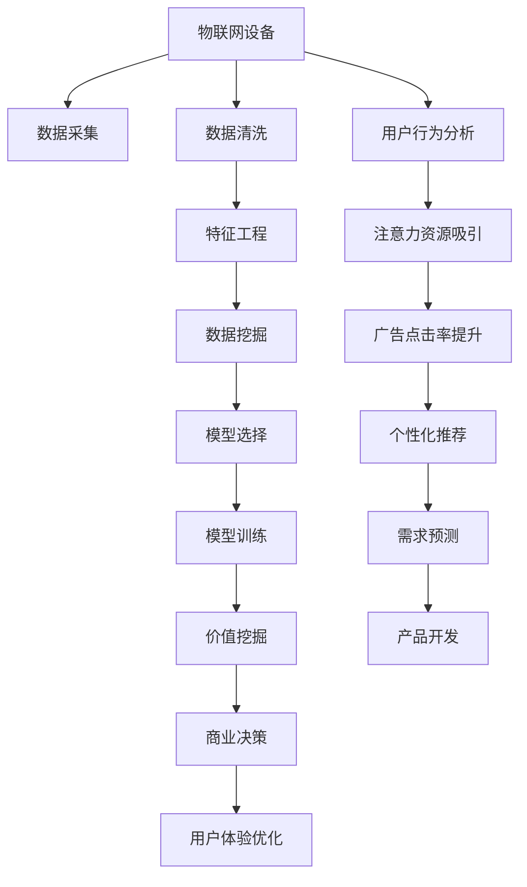

                 

## 1. 背景介绍

### 1.1 问题由来

随着物联网(IoT)技术的迅速发展，大量智能设备接入到互联网中，带来了海量的数据与设备交互行为。这些设备产生的数据蕴含着丰富的价值，能够为商业决策、用户体验优化等方面提供重要参考。然而，传统的物联网数据处理方式往往忽视了这些数据中的价值，难以挖掘其潜力。因此，如何有效利用物联网设备的数据，挖掘其注意力经济价值，成为了当前亟待解决的问题。

### 1.2 问题核心关键点

注意力经济(A注意力经济)的概念最早由诺贝尔经济学奖得主赫伯特·西蒙(Herbert Simon)提出，指的是通过吸引人们关注和注意力，来获取经济收益的一种新型商业模式。对于物联网设备而言，通过关注用户行为和设备使用情况，可以获取用户的注意力，从而提升广告点击率、增加产品销量，实现商业价值的最大化。

在实践层面，需要注意以下几个关键点：
- **数据采集与分析**：如何高效、准确地采集物联网设备数据，并进行清洗与分析。
- **模型选择与训练**：选择何种算法模型，并进行相应的训练和调参。
- **价值挖掘与应用**：如何基于模型预测结果，进行商业决策和用户行为优化。
- **隐私保护与合规**：在获取和利用用户数据的过程中，如何保护用户的隐私，遵守相关法律法规。

### 1.3 问题研究意义

挖掘物联网设备的注意力经济价值，对于提升企业的商业决策水平、优化用户体验、提高产品销量等方面具有重要意义：
1. **精准营销**：通过分析用户行为数据，精准投放广告，提升广告点击率和转化率。
2. **个性化推荐**：基于用户使用行为，推荐个性化的商品和服务，提升用户满意度。
3. **需求预测**：预测用户需求和市场趋势，指导产品开发和库存管理。
4. **用户体验优化**：通过数据分析，优化设备使用场景和功能，提升用户使用体验。

## 2. 核心概念与联系

### 2.1 核心概念概述

为了更好地理解物联网设备注意力经济价值挖掘的过程，本节将介绍几个关键概念及其相互联系：

- **物联网(IoT)**：通过传感器、射频识别技术、嵌入式系统等，实现设备互联和数据交互的网络。
- **注意力经济(A注意力经济)**：利用人们的注意力资源，通过吸引关注和点击来创造经济价值。
- **数据挖掘(Data Mining)**：从数据中提取有用信息和知识的过程。
- **机器学习(Machine Learning)**：利用算法模型对数据进行训练和预测。
- **推荐系统(Recommendation System)**：根据用户行为和偏好，推荐个性化商品和服务。
- **智能决策系统(Intelligent Decision System)**：利用机器学习模型，辅助决策者进行商业决策。

这些概念之间的关系可以通过以下Mermaid流程图来展示：



这个流程图展示了物联网设备数据从采集到商业决策的整个过程，以及各个环节的关键技术点。

## 3. 核心算法原理 & 具体操作步骤
### 3.1 算法原理概述

物联网设备注意力经济价值挖掘的过程，本质上是一个基于数据挖掘和机器学习的预测与优化过程。其核心思想是：通过采集和分析物联网设备的数据，挖掘其中的潜在价值，构建预测模型，并应用到商业决策中，从而提升注意力经济价值。

具体来说，可以分成以下几个步骤：
1. **数据采集**：通过传感器、应用程序接口(API)等方式，采集物联网设备产生的数据。
2. **数据清洗与预处理**：对采集到的数据进行清洗、去重、归一化等处理。
3. **特征工程**：从清洗后的数据中提取有用的特征，用于模型训练。
4. **模型选择与训练**：选择合适的机器学习模型，并使用标注数据对其进行训练。
5. **预测与优化**：基于训练好的模型，进行预测并应用到商业决策中，优化用户体验。

### 3.2 算法步骤详解

以下我们将详细介绍基于机器学习的物联网设备注意力经济价值挖掘的具体步骤：

**Step 1: 数据采集与清洗**

- 数据采集：使用传感器、应用程序接口(API)等方式，获取物联网设备产生的数据，如设备使用时间、位置、温度、湿度等。
- 数据清洗：对采集到的数据进行去重、去噪、填补缺失值等处理，保证数据质量。

**Step 2: 特征工程**

- 特征提取：从清洗后的数据中提取有用的特征，如设备使用频率、用户活跃时间、地理位置等。
- 特征选择：选择最相关的特征进行模型训练，避免维度灾难。

**Step 3: 模型选择与训练**

- 模型选择：根据任务需求，选择适合的机器学习模型，如线性回归、随机森林、深度神经网络等。
- 模型训练：使用标注数据对模型进行训练，并根据交叉验证等技术进行调参。

**Step 4: 预测与优化**

- 预测：使用训练好的模型对新数据进行预测，如预测设备的使用时间、用户的活跃时间等。
- 优化：根据预测结果进行商业决策，如优化广告投放策略、推荐个性化商品、提升用户使用体验等。

### 3.3 算法优缺点

基于机器学习的物联网设备注意力经济价值挖掘方法具有以下优点：
1. **高效性**：自动化数据处理和模型训练过程，大大提升了数据利用效率。
2. **准确性**：通过模型训练，能够提高预测结果的准确性，降低人为因素的影响。
3. **可扩展性**：支持大规模数据处理，易于扩展到多个物联网设备和应用场景。

同时，该方法也存在一些局限性：
1. **数据质量依赖**：预测结果的准确性高度依赖于数据的质量和完整性。
2. **模型复杂性**：选择合适的模型和调参过程较为复杂，需要丰富的经验和专业知识。
3. **隐私问题**：在获取和利用数据的过程中，需要注意保护用户隐私，遵守相关法律法规。

### 3.4 算法应用领域

物联网设备的注意力经济价值挖掘技术，已经在多个领域得到应用，例如：

- **智能家居**：通过分析家庭设备的使用数据，优化家庭智能场景，提升用户使用体验。
- **智慧城市**：通过分析城市交通和公共设施的使用数据，优化城市管理和服务，提升城市运营效率。
- **健康医疗**：通过分析可穿戴设备的数据，预测用户健康状况，提供个性化的健康建议。
- **零售电商**：通过分析购物设备和消费者行为数据，进行精准营销和个性化推荐，提升销售额。
- **智能制造**：通过分析工业设备和生产线数据，优化生产流程，提高生产效率和质量。

## 4. 数学模型和公式 & 详细讲解  
### 4.1 数学模型构建

在物联网设备注意力经济价值挖掘中，常见的数学模型包括线性回归、逻辑回归、随机森林、深度神经网络等。这里以线性回归模型为例，进行详细讲解。

假设我们有物联网设备产生的数据集 $D=\{(x_i, y_i)\}_{i=1}^N$，其中 $x_i$ 为特征向量，$y_i$ 为注意力经济价值。线性回归模型的目标是通过最小化损失函数 $\mathcal{L}(\theta)$，找到最优的线性关系：

$$
\mathcal{L}(\theta) = \frac{1}{2N}\sum_{i=1}^N (y_i - \theta^T x_i)^2
$$

其中 $\theta$ 为模型参数向量，包含特征向量的权重和偏置项。通过梯度下降等优化算法，可以找到最优的 $\theta$，使得模型预测值逼近真实值。

### 4.2 公式推导过程

以下我们将详细推导线性回归模型的损失函数及其梯度计算公式：

**梯度计算**

设模型预测值 $\hat{y_i} = \theta^T x_i$，则预测误差 $\epsilon_i = y_i - \hat{y_i}$。线性回归模型的损失函数为：

$$
\mathcal{L}(\theta) = \frac{1}{2N}\sum_{i=1}^N \epsilon_i^2
$$

对 $\mathcal{L}(\theta)$ 求导，得到：

$$
\nabla_{\theta}\mathcal{L}(\theta) = \frac{1}{N}\sum_{i=1}^N \epsilon_i x_i
$$

其中 $\nabla_{\theta}\mathcal{L}(\theta)$ 为损失函数对参数 $\theta$ 的梯度，用于更新模型参数。

### 4.3 案例分析与讲解

以智能家居设备为例，假设我们有一个智能窗帘系统，设备收集了每天开合的时间、气温、湿度等数据，并标注了每天的能量消耗。通过线性回归模型，我们可以预测在不同温度和湿度条件下，窗帘的开合时间对能量消耗的影响，从而优化设备的使用策略，降低能耗。

## 5. 项目实践：代码实例和详细解释说明
### 5.1 开发环境搭建

在进行物联网设备注意力经济价值挖掘的项目实践前，我们需要准备好开发环境。以下是使用Python进行PyTorch开发的环境配置流程：

1. 安装Anaconda：从官网下载并安装Anaconda，用于创建独立的Python环境。

2. 创建并激活虚拟环境：
```bash
conda create -n pytorch-env python=3.8 
conda activate pytorch-env
```

3. 安装PyTorch：根据CUDA版本，从官网获取对应的安装命令。例如：
```bash
conda install pytorch torchvision torchaudio cudatoolkit=11.1 -c pytorch -c conda-forge
```

4. 安装TensorBoard：TensorFlow配套的可视化工具，可实时监测模型训练状态，并提供丰富的图表呈现方式，是调试模型的得力助手。

5. 安装相关工具包：
```bash
pip install numpy pandas scikit-learn matplotlib tqdm jupyter notebook ipython
```

完成上述步骤后，即可在`pytorch-env`环境中开始项目实践。

### 5.2 源代码详细实现

下面我们以智能家居设备的能源消耗预测为例，给出使用PyTorch进行线性回归模型训练的PyTorch代码实现。

首先，定义数据集：

```python
import pandas as pd
import numpy as np

# 数据集定义
data = pd.read_csv('device_data.csv')

# 特征选择
features = data[['temp', 'humidity', 'duration']]
targets = data['energy_consumption']
```

然后，定义模型和优化器：

```python
from torch import nn, optim
import torch

# 模型定义
class LinearRegression(nn.Module):
    def __init__(self, input_size):
        super(LinearRegression, self).__init__()
        self.linear = nn.Linear(input_size, 1)

    def forward(self, x):
        return self.linear(x)

# 数据预处理
features_tensor = torch.from_numpy(features.values).float()
targets_tensor = torch.from_numpy(targets.values).float()

# 模型实例化
model = LinearRegression(features.shape[1])

# 优化器
optimizer = optim.SGD(model.parameters(), lr=0.01)
```

接着，定义训练和评估函数：

```python
from torch.utils.data import TensorDataset, DataLoader

# 数据集封装
dataset = TensorDataset(features_tensor, targets_tensor)
dataloader = DataLoader(dataset, batch_size=32)

# 训练函数
def train(model, dataloader, optimizer):
    for epoch in range(100):
        for inputs, targets in dataloader:
            optimizer.zero_grad()
            outputs = model(inputs)
            loss = nn.MSELoss()(outputs, targets)
            loss.backward()
            optimizer.step()
        print(f'Epoch: {epoch+1}, Loss: {loss.item()}')

# 评估函数
def evaluate(model, dataloader):
    model.eval()
    with torch.no_grad():
        predictions, targets = [], []
        for inputs, targets in dataloader:
            outputs = model(inputs)
            predictions.append(outputs.detach().numpy())
            targets.append(targets.numpy())
    return np.mean(np.abs(predictions - targets))
```

最后，启动训练流程并在测试集上评估：

```python
train(model, dataloader, optimizer)
print(f'Model accuracy: {evaluate(model, dataloader)}')
```

以上就是使用PyTorch进行智能家居设备能源消耗预测的完整代码实现。可以看到，通过线性回归模型，我们可以有效预测设备的使用情况，并用于优化能源消耗。

### 5.3 代码解读与分析

让我们再详细解读一下关键代码的实现细节：

**DataLoader**：
- 使用TensorDataset和DataLoader封装数据集，方便模型训练和评估。

**模型训练与评估**：
- 定义训练函数，通过循环迭代，在前向传播和后向传播中计算损失函数，并根据梯度更新模型参数。
- 定义评估函数，将模型置于评估模式，使用numpy数组计算预测误差，并返回均方误差。

**训练与评估流程**：
- 在训练函数中，使用循环迭代每个批次的数据，进行前向传播和后向传播，更新模型参数。
- 在评估函数中，将模型置于评估模式，使用numpy数组计算预测误差，并返回均方误差。

## 6. 实际应用场景
### 6.1 智能家居

物联网设备的注意力经济价值挖掘在智能家居中具有广泛应用。通过分析家庭设备的使用数据，可以优化家庭智能场景，提升用户使用体验。

例如，智能窗帘设备可以根据环境温度和湿度自动调整开合时间，降低能源消耗，提高室内舒适度。智能空调可以根据用户使用习惯和环境变化，自动调节温度和风速，提升使用体验。

### 6.2 智慧城市

物联网设备的注意力经济价值挖掘在智慧城市中也具有重要意义。通过分析城市交通和公共设施的使用数据，可以优化城市管理和服务，提升城市运营效率。

例如，智能交通系统可以根据车流量和道路情况，动态调整信号灯和路线，减少交通拥堵。智能路灯可以根据人流和车流情况，自动调整亮度和开合时间，节省能源。

### 6.3 健康医疗

物联网设备的注意力经济价值挖掘在健康医疗中也有潜在应用。通过分析可穿戴设备的数据，可以预测用户健康状况，提供个性化的健康建议。

例如，智能手表可以根据用户的心率和步数，预测心率异常和运动不足的风险，提醒用户进行运动或就医。智能血压计可以根据血压数据，预测高血压的风险，提供个性化的饮食和生活建议。

### 6.4 未来应用展望

随着物联网技术的不断发展，基于机器学习的注意力经济价值挖掘将展现出更广阔的前景。未来，该技术将在更多领域得到应用，为人类生产和生活带来更多便利和优化。

例如，在零售电商领域，通过分析购物设备和消费者行为数据，可以进行精准营销和个性化推荐，提升销售额。在智能制造领域，通过分析工业设备和生产线数据，可以优化生产流程，提高生产效率和质量。

## 7. 工具和资源推荐
### 7.1 学习资源推荐

为了帮助开发者系统掌握物联网设备注意力经济价值挖掘的理论基础和实践技巧，这里推荐一些优质的学习资源：

1. 《Python机器学习》系列博文：由知名数据科学家撰写，深入浅出地介绍了机器学习的基础知识和实用技巧，非常适合初学者。

2. CS229《机器学习》课程：斯坦福大学开设的机器学习课程，涵盖理论基础和实用技术，是入门机器学习的极佳资源。

3. 《深度学习》书籍：由深度学习领域权威人士撰写，全面介绍了深度学习的基本概念和应用方法，是深入学习的好书。

4. TensorFlow官方文档：TensorFlow的官方文档，提供了丰富的学习资源和代码示例，是学习TensorFlow的必备资料。

5. Kaggle竞赛：参加Kaggle的机器学习竞赛，可以实战练习，提升解决实际问题的能力。

通过对这些资源的学习实践，相信你一定能够快速掌握物联网设备注意力经济价值挖掘的精髓，并用于解决实际的NLP问题。
###  7.2 开发工具推荐

高效的开发离不开优秀的工具支持。以下是几款用于物联网设备注意力经济价值挖掘开发的常用工具：

1. Python：作为最流行的编程语言之一，Python语言简单易学，有丰富的库和框架支持，是机器学习任务开发的理想选择。

2. PyTorch：基于Python的开源深度学习框架，灵活动态的计算图，适合快速迭代研究。大部分预训练语言模型都有PyTorch版本的实现。

3. TensorFlow：由Google主导开发的开源深度学习框架，生产部署方便，适合大规模工程应用。同样有丰富的预训练语言模型资源。

4. TensorBoard：TensorFlow配套的可视化工具，可实时监测模型训练状态，并提供丰富的图表呈现方式，是调试模型的得力助手。

5. Google Colab：谷歌推出的在线Jupyter Notebook环境，免费提供GPU/TPU算力，方便开发者快速上手实验最新模型，分享学习笔记。

合理利用这些工具，可以显著提升物联网设备注意力经济价值挖掘任务的开发效率，加快创新迭代的步伐。

### 7.3 相关论文推荐

物联网设备注意力经济价值挖掘的研究源于学界的持续研究。以下是几篇奠基性的相关论文，推荐阅读：

1. "Machine Learning: A Probabilistic Perspective"：Tom Mitchell著，介绍了机器学习的基础理论和方法。

2. "A Tutorial on Machine Learning-Based Predictive Maintenance Schemes"：Mohamed Elmasry等著，介绍了基于机器学习的预测维护技术。

3. "Predicting Equipment Failure with Data Mining Techniques"：Fazal Shahzad等著，介绍了数据挖掘在预测设备故障中的应用。

4. "A Survey of Machine Learning Techniques for Predictive Maintenance"：Vishal Ramakrishnan等著，介绍了机器学习在预测维护中的多种方法。

5. "Deep Learning for Predictive Maintenance"：Jonathan Lee等著，介绍了深度学习在预测维护中的研究进展。

这些论文代表了大语言模型微调技术的发展脉络。通过学习这些前沿成果，可以帮助研究者把握学科前进方向，激发更多的创新灵感。

## 8. 总结：未来发展趋势与挑战
### 8.1 总结

本文对基于机器学习的物联网设备注意力经济价值挖掘方法进行了全面系统的介绍。首先阐述了物联网设备注意力经济价值挖掘的背景和意义，明确了该技术在提升企业商业决策水平、优化用户体验等方面的重要价值。其次，从原理到实践，详细讲解了该方法的数学模型、训练步骤和应用场景，给出了项目实践的完整代码实现。

通过本文的系统梳理，可以看到，基于机器学习的物联网设备注意力经济价值挖掘技术正在成为工业界的热点，极大地拓展了物联网数据的应用边界，为各行各业带来了新的经济机遇。未来，伴随机器学习技术的不断进步，该技术还将进一步优化，应用于更多领域，为人类生产和生活带来更多便利和优化。

### 8.2 未来发展趋势

展望未来，物联网设备注意力经济价值挖掘技术将呈现以下几个发展趋势：

1. **算法复杂性提升**：随着深度学习模型的不断进步，基于神经网络的注意力经济价值挖掘方法将逐步取代传统统计方法。

2. **数据来源多样化**：从单一设备数据逐步扩展到多设备、多源数据的融合，提升预测的全面性和准确性。

3. **实时化预测**：随着IoT设备的广泛应用，实时化预测和反馈机制将成为提升用户体验的重要手段。

4. **跨领域应用拓展**：从智能家居、智慧城市等特定领域，逐步拓展到更多行业，如零售电商、智能制造等。

5. **隐私保护与安全**：随着数据量的不断增长，隐私保护和数据安全将成为重要的研究课题，相关法律法规也将更加严格。

以上趋势凸显了物联网设备注意力经济价值挖掘技术的广阔前景。这些方向的探索发展，必将进一步提升该技术的应用效果，为人类生产和生活带来更多便利和优化。

### 8.3 面临的挑战

尽管物联网设备注意力经济价值挖掘技术已经取得了瞩目成就，但在迈向更加智能化、普适化应用的过程中，它仍面临着诸多挑战：

1. **数据获取与标注成本**：大规模高质量数据的获取和标注成本较高，限制了该技术的应用范围。

2. **算法复杂性与调参难度**：深度学习模型复杂，调参过程繁琐，需要丰富的经验和专业知识。

3. **隐私保护与安全**：在获取和利用数据的过程中，需要保护用户隐私，遵守相关法律法规。

4. **实时化处理能力**：大规模数据流处理需要高并发的计算资源，现有系统可能面临瓶颈。

5. **跨领域应用挑战**：不同领域的数据特征和业务需求差异较大，需要个性化的模型和策略。

6. **模型可解释性**：深度学习模型"黑盒"特性明显，难以解释其内部工作机制和决策逻辑。

正视物联网设备注意力经济价值挖掘所面临的这些挑战，积极应对并寻求突破，将是大语言模型微调走向成熟的必由之路。相信随着学界和产业界的共同努力，这些挑战终将一一被克服，物联网设备注意力经济价值挖掘必将在构建人机协同的智能时代中扮演越来越重要的角色。

### 8.4 研究展望

面对物联网设备注意力经济价值挖掘所面临的种种挑战，未来的研究需要在以下几个方面寻求新的突破：

1. **自动化标注与数据合成**：利用自动化标注技术和数据合成技术，降低数据获取与标注成本。

2. **轻量化模型与算法优化**：开发轻量化模型和优化算法，提升算法的实时化处理能力。

3. **跨领域知识融合**：结合领域知识和专家经验，提升模型在跨领域应用中的准确性和泛化能力。

4. **可解释性增强**：开发可解释性增强方法，提高模型的可解释性和透明性。

5. **隐私保护与合规**：研究隐私保护技术与合规方法，保护用户数据安全和隐私。

这些研究方向的探索，必将引领物联网设备注意力经济价值挖掘技术迈向更高的台阶，为构建安全、可靠、可解释、可控的智能系统铺平道路。面向未来，该技术还需要与其他人工智能技术进行更深入的融合，如知识表示、因果推理、强化学习等，多路径协同发力，共同推动自然语言理解和智能交互系统的进步。只有勇于创新、敢于突破，才能不断拓展物联网设备数据的应用边界，让人工智能技术更好地造福人类社会。

## 9. 附录：常见问题与解答

**Q1: 物联网设备数据如何采集与清洗？**

A: 物联网设备数据采集与清洗主要包括以下步骤：
1. 数据采集：通过传感器、API等方式，从设备中获取数据。
2. 数据清洗：去除噪声、异常值和重复值，保证数据质量。
3. 数据预处理：进行归一化、标准化等处理，使数据适合模型训练。

**Q2: 如何选择适合的机器学习模型？**

A: 选择适合的机器学习模型需要考虑以下几个因素：
1. 数据类型与特征：根据数据类型和特征选择合适的模型，如回归、分类、聚类等。
2. 数据量大小：对于小数据集，选择简单的模型，如线性回归、决策树等；对于大数据集，选择复杂的模型，如深度神经网络、随机森林等。
3. 预测目标：根据预测目标选择合适的模型，如分类任务选择逻辑回归、支持向量机等。

**Q3: 如何保护用户隐私？**

A: 保护用户隐私需要考虑以下几个方面：
1. 匿名化处理：将个人身份信息去除，只保留对模型训练有用的数据。
2. 数据加密：对敏感数据进行加密处理，防止数据泄露。
3. 合规性审查：遵守相关法律法规，确保数据使用合规。

**Q4: 如何提升模型性能？**

A: 提升模型性能需要考虑以下几个方面：
1. 增加数据量：通过数据合成和增强技术，增加数据量。
2. 优化模型结构：选择适合的数据结构和算法，如卷积神经网络、循环神经网络等。
3. 调参优化：使用网格搜索、贝叶斯优化等方法，进行模型参数的调参优化。

**Q5: 如何评估模型效果？**

A: 评估模型效果需要考虑以下几个指标：
1. 准确率：模型预测结果与真实结果的一致性。
2. 召回率：模型正确预测的正样本占实际正样本的比例。
3. F1分数：综合考虑准确率和召回率的指标。
4. AUC-ROC曲线：衡量模型预测性能的曲线，AUC值越大，模型性能越好。

这些关键问题及其解答，可以帮助开发者系统掌握物联网设备注意力经济价值挖掘的核心技术和应用策略，提升实践水平和应用效果。

---

作者：禅与计算机程序设计艺术 / Zen and the Art of Computer Programming

