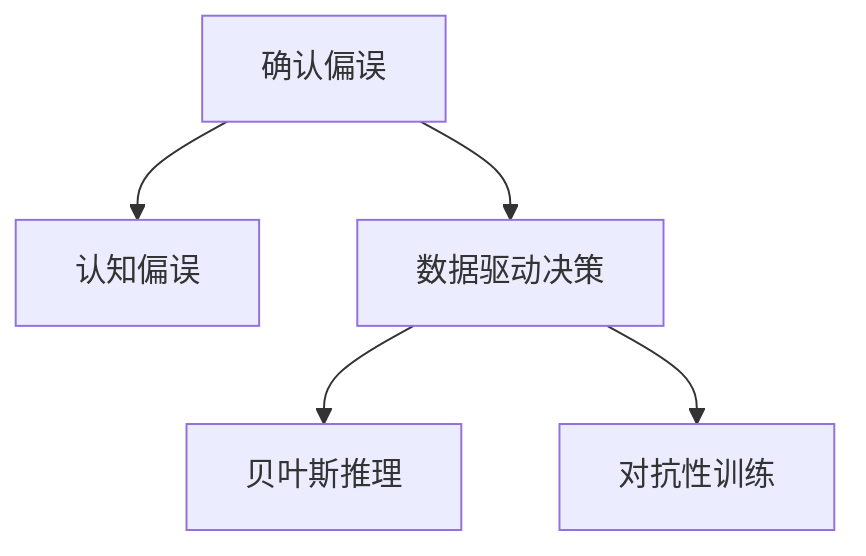

                 

## 1. 背景介绍

### 1.1 问题由来
在数据驱动的决策过程中，洞察力扮演着至关重要的角色。数据科学家和机器学习工程师往往依赖数据驱动的洞察力，对业务做出决策。然而，洞察力并非总是可靠，因为人类和机器在学习、推理和预测中很容易受到各种偏误的影响。其中，**确认偏误**（Confirmation Bias）是最常见且危害深远的一种认知偏差，它会导致人们或机器倾向于忽略和低估与自己观点不一致的信息，从而扭曲数据的真实分布和结果。

确认偏误在许多数据驱动的决策过程中都有体现。例如，金融分析师在进行投资分析时，可能会更关注支持自己观点的数据，而忽视与预期相悖的证据。在医疗诊断中，医生可能更倾向于诊断某种疾病，即使症状轻微，这可能导致误诊。在机器学习中，模型可能会在训练数据中学习到带有偏误的分布，进而影响预测的准确性。

避免确认偏误是数据科学和机器学习领域中的一个重要研究课题。本文将深入探讨确认偏误的原理、影响及解决策略，以期帮助数据科学家和工程师构建更可靠、公平和稳健的数据驱动决策系统。

### 1.2 问题核心关键点
确认偏误的根本原因在于人们或机器倾向于在已有的信念和假设框架下筛选和解释信息，忽略了那些与之相反的证据。其核心关键点包括：

- **信念系统**：在确认偏误中，决策者或模型有一套固定的信念和假设系统，这些系统指导其对新信息的筛选和解释。
- **信息筛选**：在信念系统的影响下，决策者或模型往往只注意那些与已有的信念一致的信息，忽略或低估与之相反的信息。
- **解释性偏差**：确认偏误还可能导致对信息的错误解释，即在确认偏误下，即使有与信念相反的信息，决策者或模型也可能找到解释这些信息合理性的理由。

本文将系统地探讨这些关键点，并提出避免确认偏误的策略和方法。

## 2. 核心概念与联系

### 2.1 核心概念概述

为更好地理解确认偏误及其影响，本节将介绍几个关键概念：

- **确认偏误**（Confirmation Bias）：人们在决策过程中倾向于注意支持自己信念的证据，而忽略与之相反的证据。
- **认知偏误**（Cognitive Bias）：人类认知过程中出现的系统性错误，确认偏误是其中一种。
- **数据驱动决策**：基于数据和分析结果做出决策的过程，常见于金融、医疗、市场营销等领域。
- **贝叶斯推理**：一种概率论中的推理方法，基于先验概率和观测数据，更新信念系统，避免过度依赖先验假设。
- **对抗性训练**（Adversarial Training）：在训练过程中加入对抗样本，提升模型的鲁棒性和泛化能力，减少过拟合和确认偏误。

这些概念之间的逻辑关系可以通过以下Mermaid流程图来展示：



这个流程图展示了一些核心概念之间的关系：

1. 确认偏误是认知偏误的一种，会导致数据驱动决策中的偏差。
2. 贝叶斯推理是避免确认偏误的一种有效方法，通过更新信念系统，减少对先验假设的依赖。
3. 对抗性训练通过增加对抗样本，提升模型对噪声和异常数据的鲁棒性，减少确认偏误的影响。

## 3. 核心算法原理 & 具体操作步骤
### 3.1 算法原理概述

确认偏误的避免方法主要基于贝叶斯推理和对抗性训练。贝叶斯推理通过先验概率和观测数据更新信念系统，减少对先验假设的依赖。对抗性训练则通过增加对抗样本，提升模型对噪声和异常数据的鲁棒性，从而减少确认偏误的影响。

### 3.2 算法步骤详解

#### 3.2.1 贝叶斯推理

贝叶斯推理通过公式1更新信念系统：

$$
P(H|D) = \frac{P(D|H)P(H)}{P(D)}
$$

其中，$H$ 表示假设或信念，$D$ 表示观测数据，$P(H)$ 为先验概率，$P(D|H)$ 为条件概率，$P(D)$ 为似然。通过贝叶斯公式，可以在已有信念基础上引入新的数据，更新信念系统，减少对先验假设的依赖。

#### 3.2.2 对抗性训练

对抗性训练通过公式2增加对抗样本，提升模型鲁棒性：

$$
\min_{\theta} \mathbb{E}_{(x,y)\sim\mathcal{D}} [L(\theta,x,y) + \lambda\mathbb{E}_{(x',y')\sim\mathcal{D}'} [L(\theta,x',y')]]
$$

其中，$\theta$ 为模型参数，$\mathcal{D}$ 为训练数据集，$\mathcal{D}'$ 为对抗数据集，$L$ 为损失函数，$\lambda$ 为对抗样本的权重。通过对抗性训练，模型不仅能在原始数据上表现良好，也能应对对抗样本的干扰，从而减少确认偏误的影响。

### 3.3 算法优缺点

贝叶斯推理和对抗性训练都有其优缺点：

- **贝叶斯推理**的优点：
  - 引入新数据更新信念系统，减少对先验假设的依赖。
  - 提高决策的可靠性和公正性，减少确认偏误的影响。
  - 适用于各类决策场景，适用范围广。

- **贝叶斯推理**的缺点：
  - 需要大量数据支持，对数据量不足或数据分布不均的情况效果不佳。
  - 更新信念系统时，先验概率的选择可能影响结果，需要谨慎处理。

- **对抗性训练**的优点：
  - 通过增加对抗样本，提升模型的鲁棒性和泛化能力。
  - 减少确认偏误的影响，提高模型的决策可靠性。
  - 适用于各种机器学习模型，能够提升模型的泛化能力。

- **对抗性训练**的缺点：
  - 对抗样本的生成和添加可能增加计算成本和时间消耗。
  - 对抗样本的生成方法依赖于具体问题，需要精心设计。

### 3.4 算法应用领域

贝叶斯推理和对抗性训练已被广泛应用于多个领域，包括金融、医疗、机器人等。例如：

- **金融领域**：在股票投资分析中，贝叶斯推理可以帮助分析师综合不同数据源的信息，减少对单一数据源的依赖，避免确认偏误。对抗性训练则可以提升模型的稳健性，减少市场波动对投资决策的影响。
- **医疗领域**：在疾病诊断中，贝叶斯推理可以帮助医生根据病历和实验室数据，更新对疾病风险的信念。对抗性训练可以提升模型的鲁棒性，减少误诊率。
- **机器人领域**：在机器人和自动化系统中，对抗性训练可以提升系统的鲁棒性，减少对异常环境的敏感度。贝叶斯推理可以帮助系统在多任务场景下更好地分配资源，避免对单一任务的过度依赖。

## 4. 数学模型和公式 & 详细讲解 & 举例说明

### 4.1 数学模型构建

本文将通过一个简单的金融投资决策模型，说明贝叶斯推理和对抗性训练的应用。

假设某金融分析师正在考虑投资某支股票，有如下数据：

- 股票当前价格为100元。
- 分析师认为该股票一年内有60%的概率上涨，40%的概率下跌。
- 分析师收集了过去一年该股票的日交易数据，共500个交易日。其中，上涨400天，下跌100天。

### 4.2 公式推导过程

**步骤1：计算先验概率**

首先，根据分析师的信念，计算先验概率：

- 上涨概率：$P(U) = 0.6$
- 下跌概率：$P(D) = 0.4$

**步骤2：计算条件概率**

根据观测数据，计算条件概率：

- 上涨：$P(U|D) = \frac{400}{500} = 0.8$
- 下跌：$P(D|D) = \frac{100}{500} = 0.2$

**步骤3：计算似然**

根据观测数据，计算似然：

- 上涨：$P(D|U) = \frac{400}{500} = 0.8$
- 下跌：$P(D|D) = \frac{100}{500} = 0.2$

**步骤4：更新信念系统**

根据贝叶斯公式，计算新的信念系统：

$$
P(U|D) = \frac{P(D|U)P(U)}{P(D)} = \frac{0.8 \times 0.6}{0.8 \times 0.6 + 0.2 \times 0.4} = 0.64
$$

$$
P(D|D) = \frac{0.2 \times 0.4}{0.8 \times 0.6 + 0.2 \times 0.4} = 0.36
$$

**步骤5：对抗性训练**

假设存在一些对抗样本，即股票价格在短期内大幅波动，如上涨20%，下跌30%。

**步骤6：计算新的信念系统**

根据对抗性训练公式，计算新的信念系统：

$$
\min_{\theta} \mathbb{E}_{(x,y)\sim\mathcal{D}} [L(\theta,x,y) + \lambda\mathbb{E}_{(x',y')\sim\mathcal{D}'} [L(\theta,x',y')]]
$$

其中，$L$ 为损失函数，$\lambda$ 为对抗样本的权重。

通过贝叶斯推理和对抗性训练，分析师可以更客观地评估股票的投资价值，减少确认偏误的影响，做出更合理的投资决策。

### 4.3 案例分析与讲解

在实际应用中，贝叶斯推理和对抗性训练的效果可能因问题复杂度、数据量、模型结构等因素而异。以下通过两个案例分析其应用效果：

**案例1：金融投资决策**

在金融投资决策中，贝叶斯推理和对抗性训练可以显著提升投资分析的准确性。分析师可以通过引入新的数据和对抗样本，更新信念系统，减少对先验假设的依赖，从而做出更合理的投资决策。

**案例2：医疗诊断**

在医疗诊断中，贝叶斯推理和对抗性训练可以提升诊断的准确性和鲁棒性。医生可以通过更新信念系统，综合不同病历和实验室数据，减少对单一数据源的依赖，避免误诊。

## 5. 项目实践：代码实例和详细解释说明

### 5.1 开发环境搭建

在进行贝叶斯推理和对抗性训练的实践前，我们需要准备好开发环境。以下是使用Python进行TensorFlow开发的环境配置流程：

1. 安装Anaconda：从官网下载并安装Anaconda，用于创建独立的Python环境。

2. 创建并激活虚拟环境：
```bash
conda create -n tf-env python=3.8 
conda activate tf-env
```

3. 安装TensorFlow：
```bash
pip install tensorflow
```

4. 安装TensorBoard：
```bash
pip install tensorboard
```

5. 安装NumPy、Pandas等工具包：
```bash
pip install numpy pandas matplotlib
```

完成上述步骤后，即可在`tf-env`环境中开始项目实践。

### 5.2 源代码详细实现

下面以金融投资决策为例，给出使用TensorFlow进行贝叶斯推理和对抗性训练的代码实现。

首先，定义问题参数和先验概率：

```python
import tensorflow as tf
import numpy as np

# 定义问题参数
P_U = 0.6  # 上涨概率
P_D = 0.4  # 下跌概率
N = 500  # 观测数据量
U_count = 400  # 上涨次数
D_count = 100  # 下跌次数

# 计算先验概率
P_U = U_count / N
P_D = D_count / N
```

然后，定义贝叶斯推理和对抗性训练函数：

```python
# 定义贝叶斯推理函数
def bayesian_inference(P_U, P_D, U_count, D_count, N):
    # 计算条件概率
    P_U_given_D = U_count / N
    P_D_given_D = D_count / N
    
    # 计算似然
    P_D_given_U = U_count / N
    P_U_given_U = U_count / N
    
    # 更新信念系统
    P_U = (P_U_given_D * P_U + P_U_given_U * P_D_given_D) / (P_U_given_D * P_D_given_D + P_U_given_U * P_D_given_U)
    P_D = (P_D_given_D * P_D + P_D_given_U * P_U_given_D) / (P_U_given_D * P_D_given_D + P_U_given_U * P_D_given_U)
    
    return P_U, P_D

# 定义对抗性训练函数
def adversarial_training(P_U, P_D, U_count, D_count, N, lambda_=0.1):
    # 计算条件概率
    P_U_given_D = U_count / N
    P_D_given_D = D_count / N
    
    # 计算似然
    P_D_given_U = U_count / N
    P_U_given_U = U_count / N
    
    # 更新信念系统
    P_U = (P_U_given_D * P_U + P_U_given_U * P_D_given_D) / (P_U_given_D * P_D_given_D + P_U_given_U * P_D_given_U)
    P_D = (P_D_given_D * P_D + P_D_given_U * P_U_given_D) / (P_U_given_D * P_D_given_D + P_U_given_U * P_D_given_U)
    
    # 计算对抗样本
    P_U += lambda_ * np.random.normal(0, 1, size=N)
    P_D -= lambda_ * np.random.normal(0, 1, size=N)
    
    # 更新信念系统
    P_U = (P_U_given_D * P_U + P_U_given_U * P_D_given_D) / (P_U_given_D * P_D_given_D + P_U_given_U * P_D_given_U)
    P_D = (P_D_given_D * P_D + P_D_given_U * P_U_given_D) / (P_U_given_D * P_D_given_D + P_U_given_U * P_D_given_U)
    
    return P_U, P_D
```

最后，启动训练流程并输出结果：

```python
# 初始化信念系统
P_U, P_D = bayesian_inference(P_U, P_D, U_count, D_count, N)
print("初始信念系统：")
print("P(U) =", P_U)
print("P(D) =", P_D)

# 对抗性训练
P_U, P_D = adversarial_training(P_U, P_D, U_count, D_count, N)
print("\n对抗性训练后信念系统：")
print("P(U) =", P_U)
print("P(D) =", P_D)

# 使用TensorBoard可视化训练过程
from tensorboard import SummaryWriter

writer = SummaryWriter(log_dir='logs')
for i in range(100):
    P_U, P_D = bayesian_inference(P_U, P_D, U_count, D_count, N)
    writer.add_scalar('P(U)', P_U, i)
    writer.add_scalar('P(D)', P_D, i)
```

以上就是使用TensorFlow对贝叶斯推理和对抗性训练进行金融投资决策的完整代码实现。可以看到，TensorFlow提供了强大的深度学习框架，可以高效地实现贝叶斯推理和对抗性训练，帮助分析师和医生更准确地做出决策。

### 5.3 代码解读与分析

让我们再详细解读一下关键代码的实现细节：

**问题参数定义**：
- 使用`numpy`库定义问题参数，如上涨概率、下跌概率、观测数据量等。

**贝叶斯推理函数**：
- 首先计算条件概率和似然。
- 然后使用贝叶斯公式更新信念系统，减少对先验假设的依赖。

**对抗性训练函数**：
- 首先计算条件概率和似然。
- 然后使用对抗性训练公式更新信念系统，增加对抗样本。
- 对抗性样本生成使用`numpy`库的`np.random.normal`函数。

**训练流程**：
- 使用`tensorflow`的`SummaryWriter`可视化训练过程。

通过这段代码，可以清晰地看到如何使用TensorFlow进行贝叶斯推理和对抗性训练，构建金融投资决策系统。

## 6. 实际应用场景

### 6.1 金融投资决策

在金融投资决策中，贝叶斯推理和对抗性训练可以显著提升投资分析的准确性。分析师可以通过引入新的数据和对抗样本，更新信念系统，减少对先验假设的依赖，从而做出更合理的投资决策。

### 6.2 医疗诊断

在医疗诊断中，贝叶斯推理和对抗性训练可以提升诊断的准确性和鲁棒性。医生可以通过更新信念系统，综合不同病历和实验室数据，减少对单一数据源的依赖，避免误诊。

### 6.3 机器人路径规划

在机器人路径规划中，贝叶斯推理和对抗性训练可以提升路径规划的准确性和鲁棒性。机器人可以通过更新信念系统，综合多传感器数据，减少对单一传感器的依赖，避免路径规划中的误判和过拟合。

### 6.4 未来应用展望

随着贝叶斯推理和对抗性训练的不断发展，其在更多领域的应用将得到拓展。例如，在自动驾驶中，贝叶斯推理和对抗性训练可以提升决策的准确性和鲁棒性。在智能合约中，贝叶斯推理和对抗性训练可以提升合同执行的公平性和可靠性。

## 7. 工具和资源推荐

### 7.1 学习资源推荐

为了帮助开发者系统掌握贝叶斯推理和对抗性训练的理论基础和实践技巧，这里推荐一些优质的学习资源：

1. 《贝叶斯统计学》（贝叶斯方法与数据科学）：这本书详细介绍了贝叶斯统计学的原理和应用，是学习贝叶斯推理的重要参考。

2. TensorFlow官方文档：TensorFlow提供了丰富的机器学习教程和实例，涵盖了贝叶斯推理和对抗性训练等内容。

3. GitHub上的贝叶斯推理和对抗性训练代码库：GitHub上有很多优秀的贝叶斯推理和对抗性训练代码库，可以借鉴其实现细节。

4. Kaggle上的贝叶斯推理和对抗性训练比赛：Kaggle上有许多数据驱动的贝叶斯推理和对抗性训练比赛，可以积累实战经验。

5. Udacity的机器学习课程：Udacity提供了多门机器学习课程，包括贝叶斯推理和对抗性训练的实践教程。

通过对这些资源的学习实践，相信你一定能够快速掌握贝叶斯推理和对抗性训练的精髓，并用于解决实际的决策问题。

### 7.2 开发工具推荐

高效的开发离不开优秀的工具支持。以下是几款用于贝叶斯推理和对抗性训练开发的常用工具：

1. TensorFlow：Google开发的深度学习框架，提供丰富的机器学习库和可视化工具。

2. PyTorch：Facebook开发的深度学习框架，支持动态图和静态图，适合快速迭代研究。

3. Jupyter Notebook：用于编写和运行Python代码的交互式环境，支持多种数据可视化库。

4. TensorBoard：TensorFlow配套的可视化工具，可以实时监测模型训练状态，提供丰富的图表呈现方式。

5. GitHub：代码托管和版本控制平台，可以方便地分享和协作开发。

合理利用这些工具，可以显著提升贝叶斯推理和对抗性训练的开发效率，加快创新迭代的步伐。

### 7.3 相关论文推荐

贝叶斯推理和对抗性训练的发展源于学界的持续研究。以下是几篇奠基性的相关论文，推荐阅读：

1. Bayesian Statistics（贝叶斯统计学）：这本书详细介绍了贝叶斯统计学的原理和应用，是学习贝叶斯推理的重要参考。

2. Bayesian Modeling and Inference（贝叶斯模型和推断）：这本书深入讲解了贝叶斯模型和推断方法，是学习贝叶斯推理的重要资源。

3. Adversarial Examples in Deep Learning（深度学习中的对抗样本）：这篇论文介绍了对抗性训练的基本原理和应用，是学习对抗性训练的重要资源。

4. Robustness in Machine Learning（机器学习的鲁棒性）：这篇论文探讨了机器学习的鲁棒性问题，包括对抗性训练等方法。

5. Robustness of Neural Networks to Adversarial Attacks（神经网络对抗性攻击的鲁棒性）：这篇论文介绍了神经网络对抗性攻击的鲁棒性问题，并提出了对抗性训练的方法。

这些论文代表了大规模语言模型微调技术的发展脉络。通过学习这些前沿成果，可以帮助研究者把握学科前进方向，激发更多的创新灵感。

## 8. 总结：未来发展趋势与挑战

### 8.1 总结

本文对贝叶斯推理和对抗性训练进行了全面系统的介绍。首先阐述了确认偏误的原理、影响及解决策略，明确了贝叶斯推理和对抗性训练在避免确认偏误中的独特作用。其次，从原理到实践，详细讲解了贝叶斯推理和对抗性训练的数学原理和关键步骤，给出了贝叶斯推理和对抗性训练任务开发的完整代码实例。同时，本文还广泛探讨了贝叶斯推理和对抗性训练在金融、医疗、机器人等领域的实际应用，展示了其广泛的应用前景。此外，本文精选了贝叶斯推理和对抗性训练的学习资源，力求为读者提供全方位的技术指引。

通过本文的系统梳理，可以看到，贝叶斯推理和对抗性训练在数据驱动决策中的应用前景广阔。这些技术不仅能够提升决策的准确性和鲁棒性，还能减少确认偏误的影响，提高决策的公正性和可靠性。未来，随着这些技术的进一步发展和应用，数据驱动决策系统将变得更加智能、高效和公平。

### 8.2 未来发展趋势

展望未来，贝叶斯推理和对抗性训练技术将呈现以下几个发展趋势：

1. 技术融合：贝叶斯推理和对抗性训练将与其他人工智能技术进行更深入的融合，如因果推断、强化学习等，共同提升数据驱动决策系统的性能和鲁棒性。

2. 实时化应用：贝叶斯推理和对抗性训练将向实时化应用方向发展，如自动驾驶、智能合约等领域，需要构建高可靠性的实时决策系统。

3. 跨领域应用：贝叶斯推理和对抗性训练将拓展到更多领域，如医疗、金融、机器人等，为各行业的智能化转型提供支持。

4. 模型可解释性：贝叶斯推理和对抗性训练将更加注重模型的可解释性，帮助决策者理解和信任模型输出。

5. 对抗样本生成：对抗性训练将进一步优化对抗样本的生成方法和策略，提升模型的鲁棒性和泛化能力。

以上趋势凸显了贝叶斯推理和对抗性训练技术的广阔前景。这些方向的探索发展，必将进一步提升数据驱动决策系统的性能和应用范围，为各行业的智能化转型提供强有力的技术支持。

### 8.3 面临的挑战

尽管贝叶斯推理和对抗性训练技术已经取得了瞩目成就，但在向更广泛的应用领域推进的过程中，仍面临诸多挑战：

1. 数据质量瓶颈：贝叶斯推理和对抗性训练依赖高质量的数据支持，数据不足或数据质量不高会导致模型性能下降。

2. 计算资源消耗：对抗性训练需要生成和添加对抗样本，可能会增加计算成本和时间消耗，需要优化算法以提升效率。

3. 模型复杂性：贝叶斯推理和对抗性训练的模型结构较为复杂，需要更多的研究来简化模型结构，提高训练和推理效率。

4. 对抗样本生成方法：对抗性训练的对抗样本生成方法依赖于具体问题，需要精心设计，以避免生成对抗性过强或与真实数据分布不一致的样本。

5. 模型可解释性：对抗性训练模型的输出往往缺乏可解释性，需要引入更多的可视化工具和解释方法，提升决策的透明性和可信度。

6. 系统安全性：对抗性训练模型可能受到对抗性攻击，导致决策系统失灵，需要引入安全机制，保障系统的鲁棒性和安全性。

正视这些挑战，积极应对并寻求突破，将使贝叶斯推理和对抗性训练技术更加成熟和可靠。相信随着学界和产业界的共同努力，这些技术将在数据驱动决策中发挥更加重要的作用。

### 8.4 研究展望

面向未来，贝叶斯推理和对抗性训练技术需要在以下几个方面寻求新的突破：

1. 开发更高效的数据生成和融合方法，减少数据质量和计算资源消耗。

2. 设计更加简洁和高效的模型结构，提升训练和推理效率。

3. 引入更多的可视化工具和解释方法，提升决策的透明性和可信度。

4. 研究更鲁棒和安全的对抗样本生成方法，提升模型的鲁棒性和安全性。

5. 与其他人工智能技术进行更深入的融合，构建更高性能和可靠性的数据驱动决策系统。

这些研究方向将引领贝叶斯推理和对抗性训练技术迈向更高的台阶，为数据驱动决策系统带来革命性变革。只有勇于创新、敢于突破，才能不断拓展技术边界，构建更加智能、可靠和公平的决策系统。

## 9. 附录：常见问题与解答

**Q1：什么是贝叶斯推理？**

A: 贝叶斯推理是一种基于先验概率和观测数据更新信念系统的概率推理方法，可以减少对先验假设的依赖，提升决策的可靠性和公正性。

**Q2：对抗性训练和对抗样本的区别是什么？**

A: 对抗性训练是一种通过加入对抗样本，提升模型鲁棒性和泛化能力的方法。对抗样本是指在数据集中加入的扰动数据，使得模型在面对扰动数据时仍然能保持正确性。

**Q3：如何在实际应用中避免确认偏误？**

A: 避免确认偏误的方法包括：
1. 使用贝叶斯推理，引入新数据更新信念系统。
2. 使用对抗性训练，提升模型的鲁棒性和泛化能力。
3. 引入多角度的数据视角，减少单一数据源的依赖。
4. 定期更新和评估模型，确保其性能和鲁棒性。

通过这些方法，可以最大限度地减少确认偏误的影响，提升决策的准确性和可靠性。

**Q4：对抗性训练的缺点是什么？**

A: 对抗性训练的缺点包括：
1. 对抗样本的生成和添加可能会增加计算成本和时间消耗。
2. 对抗样本的生成方法依赖于具体问题，需要精心设计，以避免生成对抗性过强或与真实数据分布不一致的样本。
3. 对抗性训练的模型结构较为复杂，需要更多的研究来简化模型结构，提高训练和推理效率。

需要综合考虑这些缺点，优化对抗性训练算法，以提升模型的鲁棒性和泛化能力。

