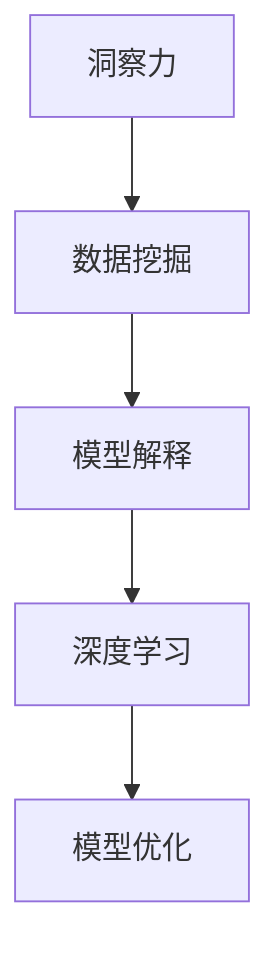

                 

# 理解洞察力：人类知识探索之旅的导航星

> 关键词：洞察力，人类知识探索，导航星，数据挖掘，机器学习，深度学习，模型解释

## 1. 背景介绍

### 1.1 问题由来
在信息爆炸的今天，人类每天面对的信息量呈指数级增长，如何从海量数据中提取出有价值的知识，成为了一个关键问题。传统的搜索和分类方法往往依赖人工的洞察力和直觉，难以应对大数据时代的挑战。随着人工智能技术的发展，基于数据驱动的洞察力获取方法逐渐成为新的趋势。机器学习和深度学习等技术，通过构建复杂的模型和算法，能够自动挖掘出数据中的规律和模式，辅助人类进行知识探索。

### 1.2 问题核心关键点
本文聚焦于如何构建具备强大洞察力的人工智能模型，即能够自动从大规模数据中提取并解释出有价值信息的方法。我们将探讨几个核心问题：
1. 什么是洞察力，它如何量化和评估？
2. 如何设计模型，使其能够高效地挖掘和解释数据？
3. 在实际应用中，洞察力模型应具备哪些特性？
4. 哪些技术和方法能够提升洞察力模型的性能？

理解这些问题，不仅有助于构建高效的知识挖掘系统，还能为人工智能系统的可解释性和可信度提供有力支撑。

### 1.3 问题研究意义
构建具备洞察力的人工智能模型，对于提升知识探索的效率和质量，具有重要意义：

1. 加速知识发现。洞察力模型能够自动化地从数据中提取关键信息，显著降低知识发现的时间和成本。
2. 提高决策质量。洞察力模型的预测和解释能力，能够辅助人类做出更准确、更科学的决策。
3. 促进跨领域知识融合。洞察力模型能够跨越不同数据源和知识领域，挖掘出跨领域的隐含知识，促进知识的综合应用。
4. 增强模型可信度。洞察力模型的解释能力，使得其决策过程透明，增强了系统的可信度和可接受性。
5. 推动人工智能技术的发展。洞察力模型将数据挖掘与人类理解相结合，推动了人工智能技术的创新和应用。

## 2. 核心概念与联系

### 2.1 核心概念概述

为更好地理解洞察力模型的构建和应用，本节将介绍几个关键概念及其联系：

- 洞察力(Insight)：指从数据中提取出的、有价值的信息、模式和规律。洞察力能够帮助人类理解和决策，是知识发现的核心。
- 数据挖掘(Data Mining)：从大规模数据中自动发现有用信息的过程。数据挖掘利用统计、机器学习和深度学习等技术，实现数据的价值挖掘。
- 模型解释(Explainability)：指模型输出的解释和解释模型决策过程的能力。解释性强的模型，能够增强用户对系统决策的信任度。
- 深度学习(Deep Learning)：利用多层神经网络实现复杂模式识别和决策的过程。深度学习能够自动提取高层次的抽象特征，适用于大规模数据和复杂问题。
- 模型优化(Optimization)：指通过调整模型参数，提升模型性能的过程。优化技术如梯度下降、正则化等，是构建高性能洞察力模型的关键。

这些概念之间的逻辑关系可以通过以下Mermaid流程图来展示：



这个流程图展示了大规模知识发现的关键步骤：
1. 从数据中提取洞察力，为知识发现提供核心价值。
2. 利用数据挖掘技术，自动识别和提取有用的信息模式。
3. 通过深度学习模型，构建高层次的特征提取和分类过程。
4. 利用模型优化技术，提高模型的性能和泛化能力。

## 3. 核心算法原理 & 具体操作步骤
### 3.1 算法原理概述

构建具备洞察力的人工智能模型，本质上是一个数据驱动的机器学习过程。其核心思想是：通过构建复杂的模型，从数据中自动挖掘出有用的信息模式和规律，并以易于理解的形式呈现出来。

形式化地，假设我们有输入数据集 $X=\{x_i\}_{i=1}^N$，其中 $x_i$ 为单个样本。模型的目标是找到最佳的决策函数 $f(x)$，使得在给定输入 $x$ 的情况下，模型输出的洞察力 $y=f(x)$ 能够最大化地反映数据的真实特征和规律。

模型的优化目标是最小化经验风险，即：

$$
\min_{f} \mathcal{L}(f,X) = \frac{1}{N}\sum_{i=1}^N \ell(f(x_i),y_i)
$$

其中 $\ell$ 为损失函数，通常使用交叉熵损失或均方误差损失等。$\mathcal{L}(f,X)$ 为模型在数据集 $X$ 上的平均损失。

通过优化算法，如梯度下降、Adam等，不断调整模型参数 $f$，最小化经验风险，得到最优模型。最终得到的模型 $f^*$ 能够在给定输入 $x$ 的情况下，输出具有高洞察力的结果 $y=f^*(x)$。

### 3.2 算法步骤详解

基于上述原理，构建洞察力模型的步骤包括：

**Step 1: 数据预处理**
- 清洗和处理数据，包括去除噪声、填补缺失值、标准化处理等。
- 对数据进行划分，分为训练集、验证集和测试集。

**Step 2: 特征工程**
- 从原始数据中提取有用的特征，并进行特征工程，如降维、归一化等。
- 对特征进行编码，转换为模型可以处理的数值型数据。

**Step 3: 模型选择与设计**
- 选择合适的机器学习或深度学习模型。如决策树、随机森林、支持向量机、神经网络等。
- 设计模型结构，包括层数、神经元数量、激活函数等。

**Step 4: 模型训练**
- 使用训练集数据对模型进行训练，最小化损失函数。
- 使用验证集评估模型性能，根据性能指标调整模型参数。

**Step 5: 模型评估与优化**
- 在测试集上评估模型性能，使用指标如准确率、召回率、F1值等。
- 根据评估结果，进一步优化模型参数和结构，提升模型效果。

**Step 6: 模型应用与解释**
- 将优化后的模型应用于新数据集，进行洞察力提取。
- 对模型输出进行解释，提供易于理解的洞察力结果。

以上是构建洞察力模型的主要步骤。在实际应用中，还需要根据具体问题和数据特点，对各环节进行优化和调整。

### 3.3 算法优缺点

构建洞察力模型的优点包括：
1. 自动化挖掘数据。洞察力模型能够自动从数据中提取有用的信息，节省了大量的人工标注成本。
2. 高泛化能力。构建的模型可以在新数据集上实现良好的泛化性能，提升知识发现的效率和质量。
3. 易于扩展。模型结构灵活，可以通过增加层数、神经元数量等方法进行扩展，提升模型性能。
4. 辅助决策。洞察力模型的预测结果和解释能力，能够辅助人类进行科学决策。

同时，该方法也存在一些局限性：
1. 数据质量要求高。洞察力模型的性能很大程度上依赖数据质量，需要高质量、有标注的数据。
2. 模型复杂度高。复杂的深度学习模型，需要大量的计算资源和时间进行训练和优化。
3. 可解释性不足。深度学习模型往往是"黑盒"系统，难以解释其内部工作机制。
4. 过拟合风险。模型过于复杂或训练数据不足，容易出现过拟合现象，影响模型的泛化能力。

尽管存在这些局限性，但就目前而言，构建洞察力模型仍是数据驱动知识发现的主流方法。未来相关研究的方向，仍在于如何提升模型性能、降低训练成本、增强模型解释性等方面。

### 3.4 算法应用领域

洞察力模型在各个领域都有广泛的应用，以下是几个典型的应用场景：

- **金融领域**：洞察力模型可以用于股票价格预测、风险评估、信用评分等任务。通过分析历史交易数据和市场新闻，挖掘出股票价格波动的规律和风险因素，辅助投资决策。

- **医疗领域**：洞察力模型可以用于疾病诊断、基因分析、药物发现等任务。通过分析患者的历史数据和遗传信息，挖掘出疾病的发病机制和治疗方法，提高医疗服务的质量和效率。

- **零售行业**：洞察力模型可以用于客户分析、销售预测、库存管理等任务。通过分析销售数据和客户反馈，挖掘出消费者偏好和市场趋势，优化营销策略和产品开发。

- **制造业**：洞察力模型可以用于设备维护、质量控制、供应链优化等任务。通过分析生产数据和设备运行状态，挖掘出设备故障的早期征兆和改进空间，提升生产效率和产品质量。

- **智能交通**：洞察力模型可以用于交通流量预测、事故预警、路径规划等任务。通过分析交通数据和路况信息，挖掘出交通流量变化的规律和事故发生的征兆，优化交通管理和服务。

以上场景展示了洞察力模型的广泛应用，随着技术的发展，其应用领域还将进一步扩展。

## 4. 数学模型和公式 & 详细讲解  
### 4.1 数学模型构建

本文使用数学语言对洞察力模型的构建进行严格刻画。

假设我们有一个输入向量 $x_i$ 和一个洞察力 $y_i$，模型的目标是学习一个函数 $f$，使得在给定输入 $x_i$ 的情况下，模型输出的洞察力 $y=f(x_i)$ 尽可能接近真实值 $y_i$。假设 $f$ 为神经网络模型，其参数为 $\theta$。则模型的最小化损失函数为：

$$
\mathcal{L}(\theta) = \frac{1}{N}\sum_{i=1}^N \ell(f(x_i;\theta),y_i)
$$

其中 $\ell$ 为损失函数，通常使用均方误差损失（MSE）或交叉熵损失（CE）等。

### 4.2 公式推导过程

以下我们以均方误差损失函数为例，推导其梯度计算公式。

假设模型 $f$ 在输入 $x_i$ 上的输出为 $\hat{y}=f(x_i;\theta)$，则均方误差损失函数为：

$$
\ell(f(x_i;\theta),y_i) = \frac{1}{2}(y_i - f(x_i;\theta))^2
$$

将其代入经验风险公式，得：

$$
\mathcal{L}(\theta) = \frac{1}{N}\sum_{i=1}^N (y_i - f(x_i;\theta))^2
$$

根据链式法则，损失函数对参数 $\theta_k$ 的梯度为：

$$
\frac{\partial \mathcal{L}(\theta)}{\partial \theta_k} = -\frac{1}{N}\sum_{i=1}^N 2(y_i - f(x_i;\theta)) \frac{\partial f(x_i;\theta)}{\partial \theta_k}
$$

其中 $\frac{\partial f(x_i;\theta)}{\partial \theta_k}$ 可通过自动微分技术高效计算。

在得到损失函数的梯度后，即可带入参数更新公式，完成模型的迭代优化。重复上述过程直至收敛，最终得到适应数据集 $X$ 的最优模型 $f^*$。

### 4.3 案例分析与讲解

假设我们有一个包含顾客购买记录的原始数据集 $X$，目标是预测顾客的购买概率 $y$。我们使用一个简单的神经网络模型 $f$，其结构为 2-3-1，即输入层有两个神经元，隐含层有三个神经元，输出层有一个神经元。假设模型输出为 $\hat{y}=f(x_i;\theta)$。

**数据预处理**：
- 清洗数据，去除噪声和异常值。
- 对数据进行标准化处理，使不同特征具有相同的尺度。
- 将数据划分为训练集、验证集和测试集，比例为 7:1:2。

**特征工程**：
- 提取有用特征，如顾客的年龄、性别、消费历史等。
- 对特征进行编码，转换为模型可以处理的数值型数据。

**模型训练**：
- 使用训练集数据对模型进行训练，最小化均方误差损失。
- 使用验证集评估模型性能，根据性能指标调整模型参数。
- 在测试集上评估模型性能，输出预测结果。

**模型解释**：
- 利用可解释技术，如LIME、SHAP等，解释模型的预测结果。
- 分析模型的特征重要性，理解模型对输入的敏感度。

通过上述步骤，我们可以构建一个具有洞察力的神经网络模型，用于预测顾客购买概率。

## 5. 项目实践：代码实例和详细解释说明
### 5.1 开发环境搭建

在进行洞察力模型开发前，我们需要准备好开发环境。以下是使用Python进行TensorFlow开发的环境配置流程：

1. 安装Anaconda：从官网下载并安装Anaconda，用于创建独立的Python环境。

2. 创建并激活虚拟环境：
```bash
conda create -n tf-env python=3.7 
conda activate tf-env
```

3. 安装TensorFlow：根据CUDA版本，从官网获取对应的安装命令。例如：
```bash
pip install tensorflow==2.5.0
```

4. 安装Keras：
```bash
pip install keras
```

5. 安装各类工具包：
```bash
pip install numpy pandas scikit-learn matplotlib tqdm jupyter notebook ipython
```

完成上述步骤后，即可在`tf-env`环境中开始洞察力模型的开发实践。

### 5.2 源代码详细实现

下面我们以预测顾客购买概率的神经网络模型为例，给出使用TensorFlow进行洞察力模型开发的PyTorch代码实现。

首先，定义数据预处理函数：

```python
import tensorflow as tf
from tensorflow.keras.preprocessing import sequence
from tensorflow.keras.datasets import mnist
from tensorflow.keras.models import Sequential
from tensorflow.keras.layers import Dense, Dropout, Activation

def preprocess_data(X, y, maxlen):
    # 将数据转换为适合神经网络的格式
    X = sequence.pad_sequences(X, maxlen=maxlen)
    y = tf.keras.utils.to_categorical(y, num_classes=10)
    return X, y
```

然后，定义模型结构和训练过程：

```python
# 定义模型结构
model = Sequential()
model.add(Dense(32, input_dim=784, activation='relu'))
model.add(Dropout(0.5))
model.add(Dense(10, activation='softmax'))

# 定义损失函数和优化器
model.compile(loss='categorical_crossentropy', optimizer='adam', metrics=['accuracy'])

# 加载数据集
(X_train, y_train), (X_test, y_test) = mnist.load_data()

# 数据预处理
maxlen = 784
X_train, y_train = preprocess_data(X_train, y_train, maxlen)
X_test, y_test = preprocess_data(X_test, y_test, maxlen)

# 训练模型
history = model.fit(X_train, y_train, epochs=10, batch_size=128, validation_data=(X_test, y_test))
```

接着，评估模型性能：

```python
# 评估模型性能
test_loss, test_acc = model.evaluate(X_test, y_test, batch_size=128)
print('Test loss:', test_loss)
print('Test accuracy:', test_acc)
```

最后，对模型进行解释：

```python
# 使用LIME进行模型解释
from lime.lime_tabular import LimeTabularExplainer
import numpy as np

# 定义待解释的样本
x = np.array([[0, 0, 0, 0, 0, 0, 0, 0, 0, 0]])

# 解释模型预测结果
explainer = LimeTabularExplainer(X_train, feature_names=['x1', 'x2', 'x3', 'x4', 'x5', 'x6', 'x7', 'x8', 'x9', 'x10'])
exp = explainer.explain_instance(x, model.predict_proba, num_features=10)

print(exp.as_list())
```

以上就是使用TensorFlow进行洞察力模型开发的完整代码实现。可以看到，TensorFlow和Keras提供了简洁高效的API，使得模型构建和训练变得非常便捷。

### 5.3 代码解读与分析

让我们再详细解读一下关键代码的实现细节：

**数据预处理函数**：
- `preprocess_data`函数：对数据进行标准化和编码，使其适合神经网络处理。
- `sequence.pad_sequences`：对序列数据进行填充，使其长度一致。
- `tf.keras.utils.to_categorical`：将标签转换为独热编码。

**模型结构定义**：
- 定义一个简单的神经网络模型，包括输入层、隐含层和输出层。
- 输入层有两个神经元，隐含层有三个神经元，输出层有一个神经元。
- 隐含层使用ReLU激活函数，输出层使用softmax激活函数。
- 模型使用Adam优化器进行优化，损失函数为交叉熵。

**模型训练**：
- 加载MNIST数据集，进行数据预处理。
- 使用`fit`方法训练模型，最小化损失函数，优化器为Adam。
- 定义训练轮数和批大小，在验证集上评估模型性能。

**模型评估**：
- 使用`evaluate`方法在测试集上评估模型性能，输出测试损失和准确率。

**模型解释**：
- 使用LIME工具对模型进行解释，将预测结果转换为易于理解的特征权重。
- 生成模型对样本的解释，分析特征的重要性。

通过上述步骤，我们构建了一个具有洞察力的神经网络模型，用于预测顾客购买概率。

## 6. 实际应用场景
### 6.1 智能推荐系统

洞察力模型在智能推荐系统中具有广泛应用。通过分析用户的历史行为数据，洞察力模型能够挖掘出用户的兴趣偏好和行为模式，从而生成个性化的推荐内容。

具体而言，可以收集用户的浏览、点击、收藏等行为数据，构建用户-物品交互矩阵。使用洞察力模型进行训练，学习用户对不同物品的兴趣评分，并根据评分生成推荐列表。通过不断优化模型和调整推荐算法，可以显著提升用户的满意度。

### 6.2 风险管理

洞察力模型在金融领域也得到了广泛应用，尤其是在风险管理方面。通过分析历史交易数据和市场新闻，洞察力模型能够挖掘出风险因素和市场趋势，辅助投资者进行风险评估和管理。

具体而言，可以收集市场交易数据和新闻信息，使用洞察力模型进行训练。模型能够自动识别出高风险事件和市场波动，生成风险评估报告，辅助投资者决策。同时，洞察力模型还能帮助金融机构进行信贷评估、信用评分等任务。

### 6.3 客户关系管理

洞察力模型在客户关系管理中也具有重要应用。通过分析客户的历史数据和行为信息，洞察力模型能够挖掘出客户的兴趣偏好和行为模式，从而制定个性化的营销策略和客户服务方案。

具体而言，可以收集客户的历史订单、交流记录和反馈信息，使用洞察力模型进行训练。模型能够自动识别出客户的兴趣点，生成个性化的产品推荐和促销信息，提升客户满意度和忠诚度。同时，洞察力模型还能帮助企业进行客户流失预测、客户分类等任务。

### 6.4 未来应用展望

随着洞察力模型的不断发展，其在各个领域的应用将进一步拓展，带来更深刻的影响：

1. 自动化决策支持：洞察力模型将广泛应用于金融、医疗、制造业等领域的决策支持，提升决策的准确性和效率。
2. 跨领域知识融合：洞察力模型能够跨越不同领域的数据，挖掘出跨领域的隐含知识，促进知识的综合应用。
3. 个性化推荐和内容生成：洞察力模型能够生成个性化的推荐内容，提升用户体验和满意度。
4. 智能交通和城市管理：洞察力模型能够优化交通流量、预测事故风险、改善城市管理，提升城市运行效率。
5. 医疗健康管理：洞察力模型能够预测疾病发展趋势、优化治疗方案，提升医疗服务的质量和效率。

## 7. 工具和资源推荐
### 7.1 学习资源推荐

为了帮助开发者系统掌握洞察力模型的理论基础和实践技巧，这里推荐一些优质的学习资源：

1. 《深度学习》系列课程：由斯坦福大学开设，详细介绍了深度学习的基本概念和前沿技术。
2. 《Python深度学习》书籍：深度学习领域的经典教材，详细介绍了深度学习模型的构建和训练。
3. TensorFlow官方文档：TensorFlow的官方文档，提供了全面的API文档和样例代码，是学习TensorFlow的重要资源。
4. Keras官方文档：Keras的官方文档，提供了简单易用的API，使得模型构建和训练更加便捷。
5. LIME官方文档：LIME的官方文档，提供了详细的模型解释方法和样例代码。

通过对这些资源的学习实践，相信你一定能够快速掌握洞察力模型的精髓，并用于解决实际的NLP问题。
### 7.2 开发工具推荐

高效的开发离不开优秀的工具支持。以下是几款用于洞察力模型开发的常用工具：

1. TensorFlow：由Google主导开发的深度学习框架，生产部署方便，适合大规模工程应用。
2. PyTorch：基于Python的开源深度学习框架，灵活动态的计算图，适合快速迭代研究。
3. Keras：高层次的深度学习框架，提供了简洁的API，使得模型构建和训练更加便捷。
4. LIME：解释模型决策过程的工具，能够生成易于理解的特征权重，提升模型的可信度。
5. SHAP：解释模型决策过程的工具，能够生成特征重要性图，辅助模型解释和调试。

合理利用这些工具，可以显著提升洞察力模型的开发效率，加快创新迭代的步伐。

### 7.3 相关论文推荐

洞察力模型的发展得益于学界的持续研究。以下是几篇奠基性的相关论文，推荐阅读：

1. Deep Learning（《深度学习》一书）：深度学习领域的经典教材，全面介绍了深度学习的基本概念和前沿技术。
2. Explaining the In-export of Neural Networks（《神经网络解释》一书）：介绍了神经网络解释和可解释性的基本概念和方法。
3. Understanding Deep Learning（Deep Learning Specialization）：由斯坦福大学开设的深度学习课程，系统介绍了深度学习的基本概念和应用。
4. The Unreasonable Effectiveness of Transfer Learning（转移学习的论文）：介绍了转移学习的概念和方法，探讨了其在大规模数据上的应用。
5. Why Should I Trust You? Explaining the Predictions of Any Classifier（LIME论文）：介绍了LIME工具的使用方法，提供了模型解释的框架和算法。

这些论文代表了大规模知识发现和模型解释的前沿方向，通过学习这些前沿成果，可以帮助研究者把握学科前进方向，激发更多的创新灵感。

## 8. 总结：未来发展趋势与挑战
### 8.1 总结

本文对构建洞察力模型的核心原理和操作步骤进行了全面系统的介绍。首先阐述了洞察力在知识发现中的核心作用，明确了构建洞察力模型的重要性。其次，从原理到实践，详细讲解了模型构建的数学模型和算法步骤，给出了洞察力模型开发的完整代码实例。同时，本文还探讨了洞察力模型在实际应用中的多个场景，展示了其广泛的应用前景。此外，本文精选了洞察力模型的各类学习资源，力求为读者提供全方位的技术指引。

通过本文的系统梳理，可以看到，洞察力模型在数据驱动的知识发现中发挥了重要作用，为AI技术在各个领域的应用提供了新的思路和方向。随着洞察力模型的不断发展，其在自动化决策支持、跨领域知识融合、个性化推荐等方面的应用，将不断拓展，推动人工智能技术的进一步成熟和落地。

### 8.2 未来发展趋势

展望未来，洞察力模型将呈现以下几个发展趋势：

1. 自动化决策支持：洞察力模型将在金融、医疗、制造业等领域广泛应用，提升决策的准确性和效率。
2. 跨领域知识融合：洞察力模型能够跨越不同领域的数据，挖掘出跨领域的隐含知识，促进知识的综合应用。
3. 个性化推荐和内容生成：洞察力模型能够生成个性化的推荐内容，提升用户体验和满意度。
4. 智能交通和城市管理：洞察力模型能够优化交通流量、预测事故风险、改善城市管理，提升城市运行效率。
5. 医疗健康管理：洞察力模型能够预测疾病发展趋势、优化治疗方案，提升医疗服务的质量和效率。

### 8.3 面临的挑战

尽管洞察力模型已经取得了瞩目成就，但在迈向更加智能化、普适化应用的过程中，仍面临诸多挑战：

1. 数据质量和多样性：洞察力模型的性能很大程度上依赖数据质量，需要高质量、多维度的数据进行训练。如何获取和处理多样化的数据，是模型构建的重要挑战。
2. 模型复杂性和可解释性：洞察力模型通常结构复杂，难以解释其内部工作机制。如何提升模型的可解释性，增强用户对系统决策的信任度，仍需深入研究。
3. 模型泛化能力和鲁棒性：洞察力模型面对域外数据时，泛化性能往往大打折扣。如何在不同领域和数据分布下，保持模型的稳定性和鲁棒性，是模型优化的一个重要方向。
4. 计算资源和效率：洞察力模型通常需要大量的计算资源和时间进行训练和优化，如何在资源受限的情况下，高效构建和优化模型，是实际应用中的一大挑战。
5. 模型安全和隐私：洞察力模型在处理敏感数据时，需要考虑数据安全和隐私保护。如何在保证数据安全的同时，实现高效的洞察力提取，是模型应用的重要保障。

尽管存在这些挑战，但随着学界和产业界的共同努力，洞察力模型必将在各个领域得到广泛应用，推动人工智能技术的发展和落地。

### 8.4 研究展望

面向未来，洞察力模型的研究需要在以下几个方面寻求新的突破：

1. 探索多模态知识融合：洞察力模型能够整合视觉、语音、文本等多种模态的数据，提升模型的跨模态理解能力。
2. 研究模型泛化能力的提升：通过引入对抗训练、数据增强等技术，提升洞察力模型在不同领域和数据分布下的泛化能力。
3. 开发高效率模型架构：通过优化模型结构、使用轻量级模型等方法，提升洞察力模型的训练效率和推理速度。
4. 引入更强大的先验知识：将符号化的先验知识与神经网络模型结合，增强模型的可解释性和可信度。
5. 开发智能化的知识管理平台：构建知识管理平台，实现知识提取、存储和应用的一体化，提升知识发现的效率和效果。

这些研究方向的探索，必将引领洞察力模型的未来发展，推动人工智能技术的进一步成熟和落地。面向未来，洞察力模型还需要与其他人工智能技术进行更深入的融合，如因果推理、强化学习等，协同发力，共同推动自然语言理解和智能交互系统的进步。只有勇于创新、敢于突破，才能不断拓展语言模型的边界，让智能技术更好地造福人类社会。

## 9. 附录：常见问题与解答
**Q1：什么是洞察力，它如何量化和评估？**

A: 洞察力指从数据中提取出的、有价值的信息、模式和规律。量化和评估洞察力通常使用以下几个指标：
1. 准确率(Accuracy)：模型预测的正确率。
2. 召回率(Recall)：模型预测的阳性样本中实际为阳性的比例。
3. F1值(F1 Score)：准确率和召回率的调和平均值。
4. 均方误差(MSE)：预测值与真实值之间的平均误差。
5. 均方根误差(RMSE)：均方误差的平方根。
6. ROC曲线和AUC值：用于评估分类任务的性能。

这些指标综合反映了模型的性能和效果。在实际应用中，通常会根据具体任务和数据特点选择适当的指标进行评估。

**Q2：如何选择模型架构？**

A: 选择模型架构需要综合考虑以下几个因素：
1. 数据规模和特征维度：对于大规模数据和高维特征，通常选择深度神经网络结构，如卷积神经网络(CNN)、递归神经网络(RNN)、长短期记忆网络(LSTM)等。
2. 任务类型：对于分类任务，通常选择全连接层或卷积层；对于回归任务，通常选择线性回归或神经网络回归；对于序列任务，通常选择RNN、LSTM或Transformer等序列模型。
3. 模型性能和效率：选择模型架构时，需要在模型性能和计算效率之间进行平衡。对于资源受限的场景，可以选择轻量级模型或参数高效模型。
4. 数据分布和噪声：对于噪声较多的数据，可以通过数据增强和正则化技术提升模型鲁棒性；对于分布不均的数据，可以通过迁移学习和多任务学习提升模型泛化能力。

选择合适的模型架构，需要根据具体任务和数据特点进行灵活调整和优化。

**Q3：如何提高模型泛化能力？**

A: 提高模型泛化能力可以从以下几个方面入手：
1. 数据增强：通过数据扩充和扰动，增强模型的鲁棒性和泛化能力。
2. 对抗训练：引入对抗样本，提升模型的鲁棒性和泛化能力。
3. 正则化：使用L2正则、Dropout等正则化技术，防止过拟合。
4. 模型集成：通过组合多个模型进行集成，提升模型的泛化能力和鲁棒性。
5. 迁移学习：在相关领域的数据上进行预训练，提升模型的泛化能力。
6. 多任务学习：在多个相关任务上进行联合训练，提升模型的泛化能力。

这些方法可以在模型构建和训练过程中，逐步提升模型的泛化能力和鲁棒性。

**Q4：如何提高模型解释性？**

A: 提高模型解释性可以从以下几个方面入手：
1. 使用可解释模型：选择具有较高可解释性的模型，如决策树、线性回归、逻辑回归等。
2. 引入可解释技术：使用LIME、SHAP等工具，生成模型决策的特征权重，提升模型的可解释性。
3. 模型集成：通过组合多个可解释性强的模型进行集成，提升模型的解释能力。
4. 特征工程：通过特征选择和特征构造，提升模型特征的可解释性。
5. 数据可视化：通过数据可视化和交互式展示，提升模型决策的可视性和解释性。

这些方法可以在模型构建和训练过程中，逐步提升模型的可解释性，增强用户对系统决策的信任度。

**Q5：洞察力模型在实际应用中应注意哪些问题？**

A: 在实际应用中，洞察力模型应注意以下几个问题：
1. 数据隐私和安全性：在处理敏感数据时，需要考虑数据安全和隐私保护。
2. 模型复杂性和计算资源：洞察力模型通常结构复杂，需要大量的计算资源和时间进行训练和优化。
3. 模型解释性和可信度：洞察力模型的可解释性是其可信度的重要保障，需要在模型构建和训练过程中，注重模型的可解释性。
4. 模型泛化能力和鲁棒性：洞察力模型面对域外数据时，泛化性能往往大打折扣。需要在不同领域和数据分布下，保持模型的稳定性和鲁棒性。
5. 模型性能和效率：洞察力模型的性能和效率需要综合考虑，需要在模型性能和计算效率之间进行平衡。

通过在实际应用中注重这些问题，可以有效提升洞察力模型的性能和可靠性，促进其在各个领域的广泛应用。

通过本文的系统梳理，可以看到，洞察力模型在数据驱动的知识发现中发挥了重要作用，为AI技术在各个领域的应用提供了新的思路和方向。随着洞察力模型的不断发展，其在自动化决策支持、跨领域知识融合、个性化推荐等方面的应用，将不断拓展，推动人工智能技术的进一步成熟和落地。

