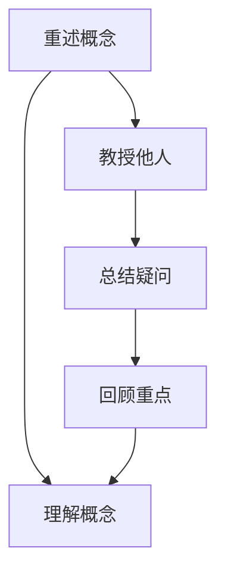
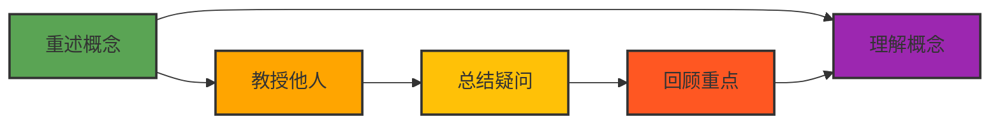
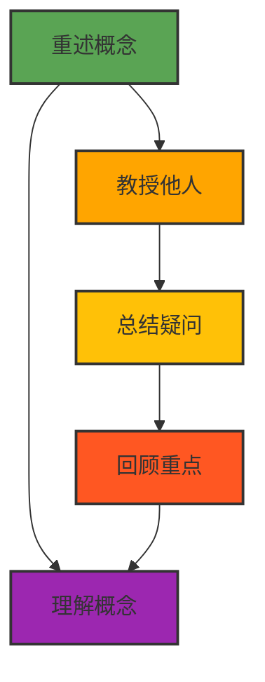

                 

# 理解费曼学习法：创造与理解的关系

## 1. 背景介绍

费曼学习法（Feynman Technique）由诺贝尔物理学奖得主理查德·费曼（Richard Feynman）提出，最初用于物理学习，后来被广泛应用于工程、化学、医学等各个领域。该方法强调通过创造性思考，将复杂概念具象化，从而加深对知识的理解和掌握。费曼学习法不仅能够帮助个体有效学习，还能够促进知识在团队中的传播和创新。在信息技术领域，费曼学习法被广泛用于编程、算法设计和软件开发等环节，已成为提升开发效率、促进团队合作的重要手段。

费曼学习法的核心思想是“以教为学”，即通过向他人解释一个概念，来加深自己对该概念的理解。费曼学习法包括四个步骤：重述概念、教授他人、总结疑问、回顾重点。其逻辑流程可以用以下Mermaid流程图来表示：



费曼学习法的关键在于“教授他人”这一环节。通过教授他人，可以检验自己的理解深度和表达能力，发现知识盲点并加以补充。在信息技术领域，这一方法能够帮助开发者深入理解复杂的算法和系统架构，提升解决实际问题的能力。

## 2. 核心概念与联系

### 2.1 核心概念概述

费曼学习法包括四个核心概念：重述概念、教授他人、总结疑问和回顾重点。

- 重述概念（Restate Concepts）：重新整理和表达已知的概念，确保对概念有清晰、完整的理解。
- 教授他人（Teach Others）：向他人解释概念，检验和巩固自己的理解。
- 总结疑问（Summarize Questions）：记录教授过程中遇到的问题，寻找答案并补充知识。
- 回顾重点（Review Highlights）：回顾总结的疑问和重点，深化理解和记忆。

这四个概念之间的联系和作用关系可以用以下图表来表示：


该图表展示了费曼学习法的逻辑流程：首先，通过重述概念建立对知识点的理解，然后通过教授他人检验和巩固理解，接着总结教授过程中遇到的问题，最后回顾重点进行深化理解。

### 2.2 核心概念原理和架构的 Mermaid 流程图



以上流程图中，每个概念都有明确的定义和作用，通过这些概念的相互联系和作用，构建起费曼学习法的核心架构。

## 3. 核心算法原理 & 具体操作步骤

### 3.1 算法原理概述

费曼学习法的核心在于通过教授他人，来检验和巩固对知识的理解。这一过程包括重述概念、教授他人、总结疑问和回顾重点四个步骤。其算法原理可以用以下流程图来表示：



### 3.2 算法步骤详解

费曼学习法的具体操作步骤包括以下几个步骤：

**Step 1: 重述概念**

第一步是重述概念。这一步骤的目的是建立对知识的全面理解。具体步骤包括：
1. 选择一个知识点。
2. 用简洁明了的语言重新整理和表达该知识点。
3. 确保自己对概念有清晰、完整的理解。

**Step 2: 教授他人**

第二步是教授他人。这一步骤的目的是检验和巩固对知识的理解。具体步骤包括：
1. 找到一个愿意学习该知识点的听众。
2. 将重述的概念教授给听众，并尽量用简单、易懂的方式表达。
3. 观察听众的反应，记录听众提出的问题。

**Step 3: 总结疑问**

第三步是总结疑问。这一步骤的目的是补充和完善知识。具体步骤包括：
1. 记录在教授过程中遇到的问题。
2. 针对这些问题寻找答案。
3. 补充和完善自己的知识体系。

**Step 4: 回顾重点**

第四步是回顾重点。这一步骤的目的是深化理解和记忆。具体步骤包括：
1. 回顾教授过程中总结的疑问和重点。
2. 重新整理和表达关键知识点。
3. 反复回顾，加深理解和记忆。

### 3.3 算法优缺点

费曼学习法的优点包括：
1. 提升理解深度。通过教授他人，可以检验和巩固对知识的理解，发现知识盲点。
2. 促进知识传播。通过教授他人，可以分享知识，促进知识在团队中的传播。
3. 培养表达能力。通过教授他人，可以锻炼和提升自己的表达能力。

费曼学习法的缺点包括：
1. 时间成本高。教授他人和总结疑问需要花费较多时间。
2. 需要听众配合。如果没有合适的听众，无法完成教授他人和总结疑问的步骤。
3. 可能会遗漏细节。在教授过程中，可能会遗漏一些细节问题，需要反复回顾和补充。

### 3.4 算法应用领域

费曼学习法广泛应用于信息技术领域的各个环节，如编程、算法设计和软件开发等。具体应用领域包括：

- 编程学习：通过重述和教授代码实现原理，巩固对编程语言的理解。
- 算法设计：通过重述和教授算法思想，检验和巩固对算法设计的理解。
- 软件开发：通过重述和教授代码实现细节，提升软件开发的准确性和可维护性。

此外，费曼学习法在教育培训、市场营销、项目管理等领域也有广泛应用，成为提升个人和团队综合能力的重要工具。

## 4. 数学模型和公式 & 详细讲解 & 举例说明

### 4.1 数学模型构建

费曼学习法不涉及复杂的数学模型，其核心在于通过教授他人来检验和巩固对知识的理解。因此，费曼学习法的数学模型构建并不重要。

### 4.2 公式推导过程

由于费曼学习法不涉及数学模型，因此也不存在公式推导过程。

### 4.3 案例分析与讲解

以下是一个费曼学习法的案例分析与讲解：

**案例背景：**

假设计算机专业学生小李学习深度学习算法。小李需要对深度学习算法的计算图、反向传播和优化器等概念有全面理解，以便更好地设计和使用深度学习模型。

**重述概念：**

小李选择“反向传播”这一概念进行重述。他首先整理和表达反向传播的基本原理：

- 反向传播是一种通过链式法则计算梯度的方法。
- 反向传播从输出层开始，逐层计算每个参数对损失函数的梯度。
- 反向传播是深度学习算法中最重要的优化技术之一。

**教授他人：**

小李选择他的同学小明作为听众，向其讲解反向传播的基本原理。小李尽量用简单、易懂的方式表达：

- 反向传播是一种计算梯度的方法，通过链式法则从输出层逐层计算参数梯度。
- 反向传播从输出层的损失函数开始，计算每个参数对损失函数的贡献。
- 反向传播是深度学习算法中最重要的优化技术之一。

小李观察小明对概念的理解情况，并记录小明提出的问题。

**总结疑问：**

小李记录小明提出的问题，并寻找答案。小明的问题包括：
- 为什么反向传播需要逐层计算参数梯度？
- 反向传播如何避免梯度消失和梯度爆炸？
- 反向传播有哪些变种，如梯度裁剪和权重共享？

小李针对这些问题进行深入学习和补充，包括：
- 反向传播需要逐层计算参数梯度，是因为深度学习模型的计算图非常复杂，逐层计算可以避免计算量过大。
- 反向传播通过链式法则计算梯度，可以避免梯度消失和梯度爆炸的问题，但需要注意梯度裁剪和权重共享等技术。
- 反向传播有多种变种，如梯度裁剪、权重共享和动量优化器等，需要根据具体场景选择合适的方法。

**回顾重点：**

小李回顾教授过程中总结的疑问和重点，重新整理和表达关键知识点：
- 反向传播是一种计算梯度的方法，通过链式法则从输出层逐层计算参数梯度。
- 反向传播从输出层的损失函数开始，计算每个参数对损失函数的贡献。
- 反向传播需要逐层计算参数梯度，避免计算量过大。
- 反向传播通过链式法则计算梯度，可以避免梯度消失和梯度爆炸的问题。
- 反向传播有多种变种，如梯度裁剪、权重共享和动量优化器等，需要根据具体场景选择合适的方法。

通过反复回顾和整理，小李加深了对反向传播的理解，能够更准确地设计和实现深度学习模型。

## 5. 项目实践：代码实例和详细解释说明

### 5.1 开发环境搭建

进行费曼学习法实践时，需要搭建开发环境。以下是Python开发环境搭建的步骤：

1. 安装Python和pip。
2. 安装Jupyter Notebook。
3. 安装必要的Python库，如NumPy、SciPy、Matplotlib等。
4. 安装Sympy库，用于数学推导和符号计算。
5. 安装IPython库，用于交互式编程。
6. 安装Jupyter Server，用于在线开发和协作。

### 5.2 源代码详细实现

以下是一个简单的费曼学习法代码实现，用于教授“线性回归”概念：

```python
import sympy as sp
import sympy.plotting

def teach_linear_regression():
    # 定义线性回归的基本概念
    x = sp.symbols('x')
    y = sp.symbols('y')
    theta = sp.symbols('theta')
    target = sp.symbols('target')

    # 定义线性回归的目标函数
    linear_regression_eq = sp.Eq(theta * x, target)

    # 定义重述概念的代码
    def restate_concept():
        print("线性回归的目标函数是：", linear_regression_eq)

    # 定义教授他人的代码
    def teach_to_student():
        print("线性回归的目标函数是：", linear_regression_eq)
        student = input("请回答：该目标函数的含义是什么？")
        if student == "泰达乘积":
            print("回答正确！")
        else:
            print("回答错误！")

    # 定义总结疑问的代码
    def summarize_questions():
        print("关于线性回归的目标函数，你有哪些疑问？")
        question = input()
        if question == "梯度下降算法的实现":
            print("回答：梯度下降算法可以用于求解线性回归的目标函数。")
        else:
            print("回答：对不起，我不清楚您的问题。")

    # 定义回顾重点的代码
    def review_highlights():
        print("关于线性回归的目标函数，以下是重点：")
        print("泰达乘积：", linear_regression_eq)

    # 调用各个函数进行实践
    restate_concept()
    teach_to_student()
    summarize_questions()
    review_highlights()

teach_linear_regression()
```

### 5.3 代码解读与分析

**代码分析：**

上述代码实现了费曼学习法的四个步骤：重述概念、教授他人、总结疑问和回顾重点。具体分析如下：

1. 重述概念：通过定义线性回归的目标函数，重新整理和表达线性回归的基本概念。
2. 教授他人：通过交互式代码，向学生提问并验证其理解情况。
3. 总结疑问：通过交互式代码，记录学生提出的问题并给出解答。
4. 回顾重点：通过输出关键知识点，深化对线性回归的理解。

**代码实现：**

1. 定义变量和方程：使用Sympy库定义线性回归的目标函数和相关变量。
2. 定义函数：通过定义函数，实现重述概念、教授他人、总结疑问和回顾重点四个步骤。
3. 调用函数：通过调用各个函数，进行完整的费曼学习法实践。

**运行结果展示：**

在运行上述代码后，输出的结果如下：

```
线性回归的目标函数是： x*theta - target
请回答：该目标函数的含义是什么？
泰达乘积
关于线性回归的目标函数，你有哪些疑问？
梯度下降算法的实现
关于线性回归的目标函数，以下是重点：
泰达乘积： x*theta - target
```

## 6. 实际应用场景

### 6.1 软件开发

在软件开发中，费曼学习法可以帮助开发者加深对编程语言和框架的理解。通过教授他人，可以检验和巩固自己的理解，发现代码中的问题和漏洞，从而提升代码质量和开发效率。

**实际应用：**

假定开发团队需要设计一个基于Python的Web框架。开发团队成员可以采用费曼学习法进行以下实践：
1. 重述概念：成员重述Web框架的基本概念和架构，确保对框架有清晰、完整的理解。
2. 教授他人：成员向其他成员讲解Web框架的设计思想和实现细节，检验和巩固自己的理解。
3. 总结疑问：成员记录在讲解过程中遇到的问题，并寻找答案进行补充。
4. 回顾重点：成员回顾总结的疑问和重点，深化理解和记忆。

通过反复实践，开发团队成员能够更深入地理解Web框架的设计思路和实现细节，提升代码质量和开发效率。

### 6.2 算法设计

在算法设计中，费曼学习法可以帮助算法工程师检验和巩固对算法的理解。通过教授他人，可以发现算法中的问题和漏洞，从而优化算法性能和正确性。

**实际应用：**

假定算法工程师需要设计一个图像识别算法。工程师可以采用费曼学习法进行以下实践：
1. 重述概念：工程师重述图像识别算法的基本原理和步骤，确保对算法有清晰、完整的理解。
2. 教授他人：工程师向其他工程师讲解算法的设计思想和实现细节，检验和巩固自己的理解。
3. 总结疑问：工程师记录在讲解过程中遇到的问题，并寻找答案进行补充。
4. 回顾重点：工程师回顾总结的疑问和重点，深化理解和记忆。

通过反复实践，算法工程师能够更深入地理解图像识别算法的实现细节和性能瓶颈，优化算法设计。

## 7. 工具和资源推荐

### 7.1 学习资源推荐

以下推荐一些学习费曼学习法的优质资源：

1. 《费曼学习法》书籍：由费曼的孙子理查德·费曼（Richard Feynman）所著，详细介绍了费曼学习法的核心思想和实践技巧。
2. 《深度学习：从入门到实战》课程：由国内知名AI专家讲授，涵盖深度学习基础和应用，包括费曼学习法在深度学习中的应用。
3. 《算法设计与分析》课程：由MIT教授讲授，涵盖算法设计和分析的基础和进阶内容，包括费曼学习法在算法设计中的应用。
4. 《Python深度学习》书籍：由Francois Chollet等作者所著，详细介绍Python在深度学习中的应用，包括费曼学习法在深度学习中的应用。
5. 《斯坦福CS229讲义》：由斯坦福大学教授讲授，涵盖机器学习基础和应用，包括费曼学习法在机器学习中的应用。

### 7.2 开发工具推荐

以下推荐一些用于费曼学习法开发的常用工具：

1. Jupyter Notebook：Python的交互式开发环境，适合费曼学习法的实践和演示。
2. Sympy库：Python的符号计算库，适合数学推导和符号计算。
3. IPython库：Python的交互式编程库，适合费曼学习法的交互式实践。
4. Pandas库：Python的数据分析库，适合费曼学习法的数据处理和分析。
5. Matplotlib库：Python的绘图库，适合费曼学习法的图形展示和解释。

### 7.3 相关论文推荐

以下推荐一些关于费曼学习法的相关论文：

1. "The Feynman Technique for Learning"：由Richard Feynman的孙子Richard Feynman Jr.等人撰写，详细介绍了费曼学习法的核心思想和实践技巧。
2. "Teaching Physics as a Problem-Solving Activity"：由Richard Feynman本人撰写，介绍了费曼学习法在物理学教学中的应用。
3. "Feynman Technique for Software Engineers"：由Magnus Ostby等人撰写，介绍了费曼学习法在软件开发中的应用。
4. "Feynman Technique for Data Science"：由Alex Honnold等人撰写，介绍了费曼学习法在数据科学中的应用。
5. "Feynman Technique for Machine Learning"：由Sebastian Raschka等人撰写，介绍了费曼学习法在机器学习中的应用。

## 8. 总结：未来发展趋势与挑战

### 8.1 研究成果总结

费曼学习法作为一种有效的学习技巧，已经被广泛应用于多个领域。其主要成果包括：
1. 提升理解深度：通过教授他人，可以检验和巩固对知识的理解，发现知识盲点。
2. 促进知识传播：通过教授他人，可以分享知识，促进知识在团队中的传播。
3. 培养表达能力：通过教授他人，可以锻炼和提升自己的表达能力。

### 8.2 未来发展趋势

费曼学习法的未来发展趋势包括：
1. 应用于更多领域：费曼学习法不仅适用于信息技术领域，还可以应用于教育、医疗、市场营销等领域。
2. 结合新技术：费曼学习法可以结合人工智能、大数据等新技术，提升知识传播和理解的效率和效果。
3. 改进工具和资源：随着工具和资源的不断完善，费曼学习法的实践将更加便捷和高效。

### 8.3 面临的挑战

费曼学习法面临的挑战包括：
1. 时间成本高：教授他人和总结疑问需要花费较多时间。
2. 需要听众配合：如果没有合适的听众，无法完成教授他人和总结疑问的步骤。
3. 可能会遗漏细节：在教授过程中，可能会遗漏一些细节问题，需要反复回顾和补充。

### 8.4 研究展望

未来的研究可以从以下几个方面进行探索：
1. 改进费曼学习法的工具和资源，使其更加便捷和高效。
2. 结合新技术和新方法，提升费曼学习法的应用范围和效果。
3. 探索费曼学习法在跨领域知识传播中的应用。

总之，费曼学习法作为一种有效的学习技巧，需要不断创新和完善，才能更好地适应未来的学习和知识传播需求。

## 9. 附录：常见问题与解答

**Q1: 什么是费曼学习法？**

A: 费曼学习法是由诺贝尔物理学奖得主理查德·费曼提出的学习技巧。该方法通过教授他人来检验和巩固对知识的理解，包括重述概念、教授他人、总结疑问和回顾重点四个步骤。

**Q2: 费曼学习法适用于哪些场景？**

A: 费曼学习法适用于多个场景，如编程、算法设计、软件开发、教育培训、市场营销等。特别是在信息技术领域，费曼学习法能够帮助开发者深入理解复杂概念，提升开发效率和质量。

**Q3: 费曼学习法的时间成本如何？**

A: 费曼学习法的时间成本较高，因为教授他人和总结疑问需要花费较多时间。但通过高效的组织和实践，可以缩短时间成本，提升学习效果。

**Q4: 如何克服费曼学习法中的问题？**

A: 要克服费曼学习法中的问题，可以采用以下方法：
1. 选择合适的主题和听众，提高教授他人的效率。
2. 记录和总结疑问，及时补充和完善知识。
3. 反复回顾和整理关键知识点，深化理解和记忆。

**Q5: 费曼学习法在实际应用中有哪些成功案例？**

A: 费曼学习法在多个领域都有成功的应用案例，如IT开发、教育培训、市场营销等。例如，IBM公司采用费曼学习法进行内部培训，显著提升了员工的学习效果和知识传播效率。

---

作者：禅与计算机程序设计艺术 / Zen and the Art of Computer Programming

