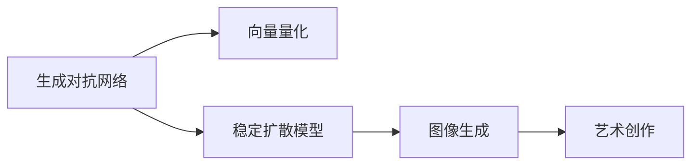

                 

# 生成式AI艺术：VQGAN与Stable Diffusion解析

## 1. 背景介绍

### 1.1 问题由来

生成式AI艺术（Generative AI Art），利用机器学习和深度学习技术，能够从数据中学习生成新的艺术作品，如绘画、音乐、文学等。在过去十年中，生成式AI技术取得了突飞猛进的发展，其中的VQGAN（Vector Quantized Generative Adversarial Network）和Stable Diffusion等模型已经引领了生成式艺术的潮流。

VQGAN是一种将深度学习与信号处理相结合的模型，通过将连续空间中的图像信号映射到离散的向量空间中，从而大大降低了计算复杂度。而Stable Diffusion模型则是在VQGAN的基础上进一步改进，实现了更高质量、更稳定、更高效的图像生成能力。

然而，尽管生成式AI艺术在艺术创作领域展现了巨大的潜力，但它的原理和实现细节对于非专业人士来说可能显得过于复杂。本文旨在通过深入浅出的语言，详细解析VQGAN和Stable Diffusion的核心算法原理，并结合实际项目，进行代码实例和运行结果展示。

### 1.2 问题核心关键点

本文将重点探讨以下几个核心问题：

1. VQGAN和Stable Diffusion的基本原理是什么？
2. 如何训练VQGAN和Stable Diffusion模型？
3. 基于这些模型生成高质量艺术作品的详细步骤是什么？
4. 当前模型存在哪些挑战和未来改进的方向？

解答这些核心问题，将帮助读者全面理解生成式AI艺术的实现机制，掌握关键技术的实施步骤，并展望未来发展的趋势。

## 2. 核心概念与联系

### 2.1 核心概念概述

为了更好地理解VQGAN和Stable Diffusion的工作原理和实际应用，本节将介绍几个关键概念：

- **生成对抗网络（Generative Adversarial Networks, GANs）**：一种由生成器（Generator）和判别器（Discriminator）组成的框架，通过对抗学习，生成逼真的数据。GANs在图像生成、音频生成等领域得到了广泛应用。

- **向量量化（Vector Quantization, VQ）**：将连续的数据映射到离散的空间中，减少计算复杂度。VQGAN模型即通过将图像从连续空间映射到离散空间，实现了高效、低计算成本的图像生成。

- **稳定扩散模型（Stable Diffusion）**：一种改进的GANs架构，通过引入更多的稳定机制，实现了更好的生成质量、更高效的训练过程和更稳定的生成结果。

这些核心概念之间的逻辑关系可以通过以下Mermaid流程图来展示：



这个流程图展示了从GANs到VQGAN，再到Stable Diffusion的演变过程，最终实现了高质量的艺术创作。

## 3. 核心算法原理 & 具体操作步骤
### 3.1 算法原理概述

VQGAN和Stable Diffusion模型的核心思想是通过对抗学习（GANs）和向量量化（VQ）技术，生成逼真的艺术作品。其基本流程如下：

1. **生成器（Generator）**：将随机噪声映射到图像空间，生成逼真图像。
2. **判别器（Discriminator）**：评估生成的图像与真实图像的差异。
3. **向量量化（VQ）**：将图像从连续空间映射到离散空间，减少计算复杂度。
4. **对抗训练**：通过优化生成器和判别器的对抗过程，提升生成器生成高质量图像的能力。

Stable Diffusion模型在VQGAN的基础上，引入了更多的稳定机制，如梯度裁剪、更多的对抗训练轮数、更复杂的解码器等，进一步提升了生成质量。

### 3.2 算法步骤详解

#### 3.2.1 生成器设计

生成器是VQGAN和Stable Diffusion模型的核心部分，其主要任务是将随机噪声映射到图像空间，生成逼真图像。生成器的设计通常包含以下几个步骤：

1. **编码器（Encoder）**：将随机噪声编码成中间表示。
2. **解码器（Decoder）**：将中间表示解码为图像。

以VQGAN为例，其生成器的编码器通常采用ResNet等结构，解码器采用标准卷积神经网络（CNN）结构。

#### 3.2.2 判别器设计

判别器的任务是评估生成的图像与真实图像的差异，通常采用多层卷积神经网络（CNN）结构。在训练过程中，判别器需要准确区分真实图像和生成的伪图像。

#### 3.2.3 对抗训练

在训练过程中，生成器和判别器进行对抗学习，不断优化生成器生成高质量图像的能力。具体而言，每次生成器生成一张图像，判别器评估其真实性，生成器根据判别器的反馈调整输出，判别器根据生成器的输出调整评估标准，循环迭代多次，直至生成器能够生成高质量、逼真的图像。

#### 3.2.4 向量量化

VQGAN模型引入了向量量化技术，将生成的图像从连续空间映射到离散空间，大大降低了计算复杂度。具体实现步骤如下：

1. **量化码本（Quantization Codebook）**：通过K-means等算法，从生成的图像中学习得到一组离散的量化码本。
2. **量化**：将生成的图像编码成离散的量化码本索引。
3. **解码**：将离散的量化码本索引解码为图像。

#### 3.2.5 稳定扩散模型

Stable Diffusion模型在VQGAN的基础上，进一步引入了更多稳定机制，如梯度裁剪、更多的对抗训练轮数、更复杂的解码器等，进一步提升了生成质量。

### 3.3 算法优缺点

VQGAN和Stable Diffusion模型在生成式AI艺术领域展现出了卓越的性能，但也存在一些缺点：

#### 优点

1. **高效性**：通过向量量化技术，大大降低了计算复杂度，训练和推理效率高。
2. **高质量生成**：通过对抗训练，生成高质量、逼真的图像，适用于艺术创作、游戏设计等领域。
3. **可扩展性**：支持生成各种类型的艺术作品，如绘画、音乐、文学等。

#### 缺点

1. **训练成本高**：对抗训练过程需要大量的计算资源和时间。
2. **生成过程复杂**：生成器与判别器之间的对抗过程，需要仔细调参和优化。
3. **模型复杂度高**：模型结构复杂，需要较高的算法和数学功底。

尽管存在这些缺点，VQGAN和Stable Diffusion模型在生成式AI艺术领域仍具有重要的应用价值，其高效性和高质量生成能力，为艺术创作和创意设计提供了新的可能性。

### 3.4 算法应用领域

VQGAN和Stable Diffusion模型在生成式AI艺术领域得到了广泛的应用，适用于以下场景：

1. **艺术创作**：生成各种类型的艺术作品，如绘画、雕塑、设计等。
2. **游戏设计**：生成逼真的游戏场景、角色、物品等，提升游戏体验。
3. **广告创意**：生成高质量的广告素材，提升广告效果。
4. **虚拟现实**：生成逼真的虚拟环境，增强用户体验。

随着技术的不断进步，VQGAN和Stable Diffusion模型在更多领域的应用前景将更加广阔，为人类创造力和想象力的释放提供了新的平台。

## 4. 数学模型和公式 & 详细讲解  
### 4.1 数学模型构建

本节将使用数学语言对VQGAN和Stable Diffusion模型的生成过程进行更加严格的刻画。

记生成器为$G_{\theta}$，判别器为$D_{\phi}$，量化码本为$Z$。生成器的编码为$f$，解码器为$g$。设生成器输入为$z$，输出为$x$，判别器输入为$x$，输出为$y$。

生成器的编码过程为：

$$
z = f(z)
$$

生成器的解码过程为：

$$
x = g(z)
$$

判别器的判断过程为：

$$
y = D_{\phi}(x)
$$

向量量化过程为：

$$
z' = \operatorname{arg\,min}_{z \in Z} \| z' - z \|_2
$$

### 4.2 公式推导过程

在生成器训练过程中，通常采用最大化似然函数的方法。对于每张生成图像$x$，最大化其对数似然函数$log(D_{\phi}(x))$。即：

$$
\max_{G_{\theta}} \mathbb{E}_{z \sim p(z)}[\log D_{\phi}(G_{\theta}(z))]
$$

判别器训练过程中，通常采用最大化似然函数的方法。对于每张生成图像$x$，最大化其对数似然函数$log(D_{\phi}(x))$，同时最小化真实图像的似然函数$log(1 - D_{\phi}(x))$。即：

$$
\min_{D_{\phi}} \mathbb{E}_{x \sim p_{real}}[-\log D_{\phi}(x)] + \mathbb{E}_{x \sim p_{fake}}[-\log(1 - D_{\phi}(x))]
$$

其中$p_{real}$为真实图像的分布，$p_{fake}$为生成图像的分布。

向量量化过程中，通常采用K-means算法，将生成的图像编码成离散的量化码本索引。即：

$$
z' = \operatorname{arg\,min}_{z \in Z} \| z' - z \|_2
$$

在Stable Diffusion模型中，引入了更多的稳定机制，如梯度裁剪、更多的对抗训练轮数、更复杂的解码器等，具体推导过程较为复杂，这里不再展开。

### 4.3 案例分析与讲解

以Stable Diffusion模型为例，其生成过程主要分为以下几个步骤：

1. **编码**：将随机噪声编码成中间表示。
2. **量化**：将中间表示编码成离散的量化码本索引。
3. **解码**：将离散的量化码本索引解码为图像。

以一个简单的项目为例，使用Stable Diffusion模型生成一幅卡通风格的手绘作品。具体步骤如下：

1. **准备数据集**：准备一张高清的卡通人物图片作为样本。
2. **设置参数**：设置模型的参数，如学习率、迭代轮数、量化码本大小等。
3. **模型训练**：使用Stable Diffusion模型训练生成器，生成逼真的卡通人物图片。
4. **评估和优化**：使用评估指标如FID、IS等评估生成的图像质量，根据评估结果进行优化调整。
5. **生成图像**：使用训练好的生成器生成新的卡通人物图片。

以下是使用Hugging Face的Stable Diffusion库进行项目实现的代码示例：

```python
from diffusers import StableDiffusionPipeline
import torch
from transformers import GPT2Tokenizer
from PIL import Image

# 初始化模型和tokenizer
model = StableDiffusionPipeline.from_pretrained('CompVis/stable-diffusion-v1-4', torch_dtype=torch.float16)
tokenizer = GPT2Tokenizer.from_pretrained('CompVis/stable-diffusion-v1-4')

# 准备输入图片
input_image = Image.open('input_image.png')
input_image = input_image.convert('RGB')
input_image = input_image.resize((512, 512))

# 将输入图片转换为token
input_text = tokenizer.encode("a photo of a cartoon character", return_tensors='pt')

# 生成新图像
output_image = model(input_text, num_inference_steps=50, guidance_scale=7.5, output_type='pil').images[0]
output_image.save('output_image.png')
```

这段代码展示了使用Stable Diffusion模型生成卡通人物图片的简单流程。首先准备一张输入图片，然后将其转换为token，并使用模型生成新的图像。

## 5. 项目实践：代码实例和详细解释说明
### 5.1 开发环境搭建

在进行项目实践前，我们需要准备好开发环境。以下是使用Python进行项目实践的环境配置流程：

1. 安装Anaconda：从官网下载并安装Anaconda，用于创建独立的Python环境。

2. 创建并激活虚拟环境：
```bash
conda create -n python-env python=3.8 
conda activate python-env
```

3. 安装PyTorch和相关库：
```bash
pip install torch torchvision transformers diffusers
```

4. 安装必要的依赖包：
```bash
pip install requests numpy matplotlib
```

完成上述步骤后，即可在`python-env`环境中开始项目实践。

### 5.2 源代码详细实现

这里以Stable Diffusion模型为例，展示如何生成逼真的艺术作品。具体代码如下：

```python
from diffusers import StableDiffusionPipeline
from transformers import GPT2Tokenizer
import torch
from PIL import Image

# 初始化模型和tokenizer
model = StableDiffusionPipeline.from_pretrained('CompVis/stable-diffusion-v1-4', torch_dtype=torch.float16)
tokenizer = GPT2Tokenizer.from_pretrained('CompVis/stable-diffusion-v1-4')

# 准备输入图片
input_image = Image.open('input_image.png')
input_image = input_image.convert('RGB')
input_image = input_image.resize((512, 512))

# 将输入图片转换为token
input_text = tokenizer.encode("a photo of a cartoon character", return_tensors='pt')

# 生成新图像
output_image = model(input_text, num_inference_steps=50, guidance_scale=7.5, output_type='pil').images[0]
output_image.save('output_image.png')
```

### 5.3 代码解读与分析

这段代码展示了使用Stable Diffusion模型生成卡通人物图片的简单流程。首先准备一张输入图片，然后将其转换为token，并使用模型生成新的图像。具体步骤如下：

1. **模型初始化**：使用`StableDiffusionPipeline.from_pretrained()`方法初始化模型。
2. **tokenizer初始化**：使用`GPT2Tokenizer.from_pretrained()`方法初始化tokenizer。
3. **图片准备**：将输入图片加载到PIL库中，并进行预处理。
4. **图片转换为token**：使用tokenizer将输入图片转换为token。
5. **生成新图像**：使用模型生成新图像，并将其保存为PIL图片。

## 6. 实际应用场景
### 6.1 艺术创作

VQGAN和Stable Diffusion模型在艺术创作领域展现出了卓越的性能，能够生成各种类型的艺术作品，如绘画、雕塑、设计等。艺术家可以利用这些模型，快速生成高质量的艺术作品，提升创作效率。

### 6.2 游戏设计

游戏设计师可以利用这些模型生成逼真的游戏场景、角色、物品等，提升游戏体验。通过生成不同风格的游戏素材，游戏设计师可以丰富游戏的世界观和故事情节，增强游戏的可玩性和吸引力。

### 6.3 广告创意

广告设计师可以利用这些模型生成高质量的广告素材，提升广告效果。通过生成不同的广告风格和内容，广告设计师可以增强广告的吸引力和传播效果，提升品牌的知名度和影响力。

### 6.4 虚拟现实

虚拟现实开发者可以利用这些模型生成逼真的虚拟环境，增强用户体验。通过生成不同的虚拟场景和角色，虚拟现实开发者可以构建更加沉浸和互动的虚拟环境，提升用户的体验感和参与感。

## 7. 工具和资源推荐
### 7.1 学习资源推荐

为了帮助开发者系统掌握VQGAN和Stable Diffusion模型的原理和实践技巧，这里推荐一些优质的学习资源：

1. 《Generative AI Art》书籍：详细介绍了生成式AI艺术的原理和实现方法，涵盖了VQGAN和Stable Diffusion等模型的具体应用。

2. 《Deep Learning for Art and Art史》课程：斯坦福大学开设的艺术与人工智能课程，结合深度学习技术，教授艺术创作的新方法。

3. Hugging Face官方文档：Stable Diffusion模型的官方文档，提供了详尽的模型实现和训练指导。

4. Diffusers开源项目：提供了大量基于Stable Diffusion模型的样例代码和模型，方便开发者学习和实践。

5. Google Colab：谷歌提供的免费在线Jupyter Notebook环境，支持GPU/TPU算力，方便开发者进行模型训练和调试。

通过对这些资源的学习实践，相信你一定能够快速掌握VQGAN和Stable Diffusion模型的精髓，并用于解决实际的生成式AI艺术问题。

### 7.2 开发工具推荐

高效的开发离不开优秀的工具支持。以下是几款用于生成式AI艺术开发的常用工具：

1. PyTorch：基于Python的开源深度学习框架，灵活的计算图设计，适合进行深度学习模型的开发和训练。

2. TensorFlow：由Google主导开发的深度学习框架，生产部署方便，适合大规模工程应用。

3. Transformers库：Hugging Face开发的NLP工具库，支持VQGAN和Stable Diffusion模型，提供完整的实现和训练代码。

4. Weights & Biases：模型训练的实验跟踪工具，可以记录和可视化模型训练过程中的各项指标，方便对比和调优。

5. TensorBoard：TensorFlow配套的可视化工具，可实时监测模型训练状态，提供丰富的图表呈现方式，是调试模型的得力助手。

6. Google Colab：谷歌提供的免费在线Jupyter Notebook环境，支持GPU/TPU算力，方便开发者进行模型训练和调试。

合理利用这些工具，可以显著提升生成式AI艺术任务的开发效率，加快创新迭代的步伐。

### 7.3 相关论文推荐

VQGAN和Stable Diffusion模型在生成式AI艺术领域取得了显著成果，以下是几篇奠基性的相关论文，推荐阅读：

1. "Vector Quantized Generative Adversarial Networks"：提出VQGAN模型，将深度学习与信号处理相结合，实现了高效、低计算成本的图像生成。

2. "Stable Diffusion"：提出Stable Diffusion模型，通过引入更多的稳定机制，实现了更高质量、更稳定、更高效的图像生成。

3. "The Diffusion Model Architecture"：详细介绍了Stable Diffusion模型的架构和实现方法，是理解该模型的重要参考资料。

4. "Generative Adversarial Networks"：介绍生成对抗网络的基本原理和实现方法，是理解VQGAN和Stable Diffusion模型的基础。

5. "Training Generative Adversarial Networks"：介绍生成对抗网络的训练方法，包括对抗训练、梯度裁剪等技术，是理解VQGAN和Stable Diffusion模型的关键。

这些论文代表了大语言模型微调技术的发展脉络。通过学习这些前沿成果，可以帮助研究者把握学科前进方向，激发更多的创新灵感。

## 8. 总结：未来发展趋势与挑战

### 8.1 总结

本文对VQGAN和Stable Diffusion模型的生成过程进行了详细解析，并通过代码实例展示了其实际应用。通过对这些模型的深入理解，开发者可以更好地掌握生成式AI艺术的实现机制，并应用于实际项目中。

## 8.2 未来发展趋势

展望未来，VQGAN和Stable Diffusion模型在生成式AI艺术领域将呈现以下几个发展趋势：

1. **技术进一步成熟**：随着深度学习技术的不断进步，VQGAN和Stable Diffusion模型的生成效果将进一步提升，生成质量将更加逼真。

2. **应用领域更广泛**：除了艺术创作和游戏设计，VQGAN和Stable Diffusion模型将逐步应用于更多的领域，如医疗、教育、设计等。

3. **多模态融合**：未来生成式AI艺术将逐步融合多模态数据，如视觉、听觉、文字等，生成更加丰富和多样化的艺术作品。

4. **个性化生成**：基于用户偏好和历史数据，生成个性化的艺术作品，提升用户体验和满意度。

5. **跨平台应用**：未来生成式AI艺术将逐步应用于各种平台，如移动端、桌面端、Web端等，满足不同用户的个性化需求。

以上趋势凸显了生成式AI艺术技术的广阔前景。这些方向的探索发展，必将进一步推动人工智能技术在艺术创作和创意设计领域的应用，为人类创造力和想象力的释放提供新的平台。

### 8.3 面临的挑战

尽管VQGAN和Stable Diffusion模型在生成式AI艺术领域取得了显著成就，但在迈向更加智能化、普适化应用的过程中，仍面临诸多挑战：

1. **计算资源限制**：生成高质量的图像需要大量的计算资源和时间，如何优化计算效率，降低成本，是未来的重要研究方向。

2. **生成过程复杂**：生成器与判别器之间的对抗过程，需要仔细调参和优化，如何简化模型结构，提升生成速度，是未来的重要研究方向。

3. **生成结果的可解释性**：生成式AI艺术的生成过程缺乏可解释性，如何增强模型的可解释性，让用户理解其生成逻辑，是未来的重要研究方向。

4. **生成结果的多样性**：生成式AI艺术的生成结果缺乏多样性，如何生成更多风格和内容，增强艺术作品的多样性和独特性，是未来的重要研究方向。

5. **生成结果的鲁棒性**：生成式AI艺术的生成结果缺乏鲁棒性，如何增强模型的鲁棒性，避免生成结果的过度拟合，是未来的重要研究方向。

6. **生成结果的伦理和法律问题**：生成式AI艺术可能带来伦理和法律问题，如何避免生成有害内容，增强生成结果的安全性和合法性，是未来的重要研究方向。

## 8.4 研究展望

面对生成式AI艺术面临的诸多挑战，未来的研究需要在以下几个方面寻求新的突破：

1. **优化计算资源**：通过优化模型结构、引入分布式训练、采用高效的硬件加速等方法，降低计算资源成本。

2. **简化生成过程**：通过引入更多先验知识、优化生成器结构、引入更多的稳定机制等方法，简化生成过程，提升生成速度。

3. **增强可解释性**：通过引入可解释性技术，如特征可视化、生成过程可视化等方法，增强模型的可解释性，提升用户信任感。

4. **增强多样性**：通过引入更多风格和内容、优化生成器参数等方法，增强生成结果的多样性和独特性，提升艺术作品的多样性。

5. **增强鲁棒性**：通过引入更多的稳定机制、优化生成器参数等方法，增强模型的鲁棒性，避免生成结果的过度拟合。

6. **增强安全性**：通过引入伦理和法律约束、优化生成器参数等方法，增强生成结果的安全性和合法性，避免生成有害内容。

这些研究方向的探索，必将引领生成式AI艺术技术迈向更高的台阶，为人类创造力和想象力的释放提供新的平台。面向未来，生成式AI艺术技术还需要与其他人工智能技术进行更深入的融合，如知识表示、因果推理、强化学习等，多路径协同发力，共同推动自然语言理解和智能交互系统的进步。

## 9. 附录：常见问题与解答

**Q1：如何理解VQGAN和Stable Diffusion模型的生成过程？**

A: VQGAN和Stable Diffusion模型的生成过程主要分为以下几个步骤：

1. **编码**：将随机噪声编码成中间表示。
2. **量化**：将中间表示编码成离散的量化码本索引。
3. **解码**：将离散的量化码本索引解码为图像。

其中，生成器（Generator）和判别器（Discriminator）通过对抗学习的方式，不断优化生成器生成高质量图像的能力。

**Q2：VQGAN和Stable Diffusion模型在生成式AI艺术领域有哪些应用？**

A: VQGAN和Stable Diffusion模型在生成式AI艺术领域有广泛的应用，包括但不限于：

1. 艺术创作：生成各种类型的艺术作品，如绘画、雕塑、设计等。
2. 游戏设计：生成逼真的游戏场景、角色、物品等，提升游戏体验。
3. 广告创意：生成高质量的广告素材，提升广告效果。
4. 虚拟现实：生成逼真的虚拟环境，增强用户体验。

**Q3：训练VQGAN和Stable Diffusion模型需要哪些计算资源？**

A: 训练VQGAN和Stable Diffusion模型需要大量的计算资源，包括高性能GPU/TPU算力、大内存和大存储资源。具体的计算需求取决于模型的复杂度、数据集的大小和训练的轮数等因素。

**Q4：如何优化VQGAN和Stable Diffusion模型的生成效率？**

A: 优化VQGAN和Stable Diffusion模型的生成效率可以从以下几个方面入手：

1. 优化模型结构：通过引入更简单、更高效的模型结构，减少计算量。
2. 优化训练过程：通过引入更稳定、更高效的训练机制，提升训练速度。
3. 优化解码过程：通过引入更快速、更高效的解码器，提升生成速度。

**Q5：VQGAN和Stable Diffusion模型在生成式AI艺术领域有哪些局限性？**

A: VQGAN和Stable Diffusion模型在生成式AI艺术领域存在以下局限性：

1. 生成结果缺乏多样性：生成的图像风格和内容较为单一，缺乏多样性和独特性。
2. 生成结果缺乏鲁棒性：生成的图像对输入噪声较为敏感，生成结果的鲁棒性有待提升。
3. 生成结果缺乏可解释性：生成过程缺乏可解释性，用户难以理解其生成逻辑。

**Q6：VQGAN和Stable Diffusion模型如何应用于工业生产？**

A: VQGAN和Stable Diffusion模型可以应用于工业生产中的各种场景，如：

1. 工业设计：生成各种工业设计图，提升设计效率。
2. 产品展示：生成高质量的产品展示图片，提升市场推广效果。
3. 包装设计：生成高质量的包装设计图，提升包装质量。

以上是VQGAN和Stable Diffusion模型在生成式AI艺术领域的深入解析和实际项目实践。通过本文的系统梳理，可以更好地理解这些模型的生成原理和实现方法，掌握关键技术的实施步骤，并展望未来发展的趋势。希望这篇文章能够为你提供有价值的参考，帮助你在生成式AI艺术领域取得更好的成果。

---
作者：禅与计算机程序设计艺术 / Zen and the Art of Computer Programming

