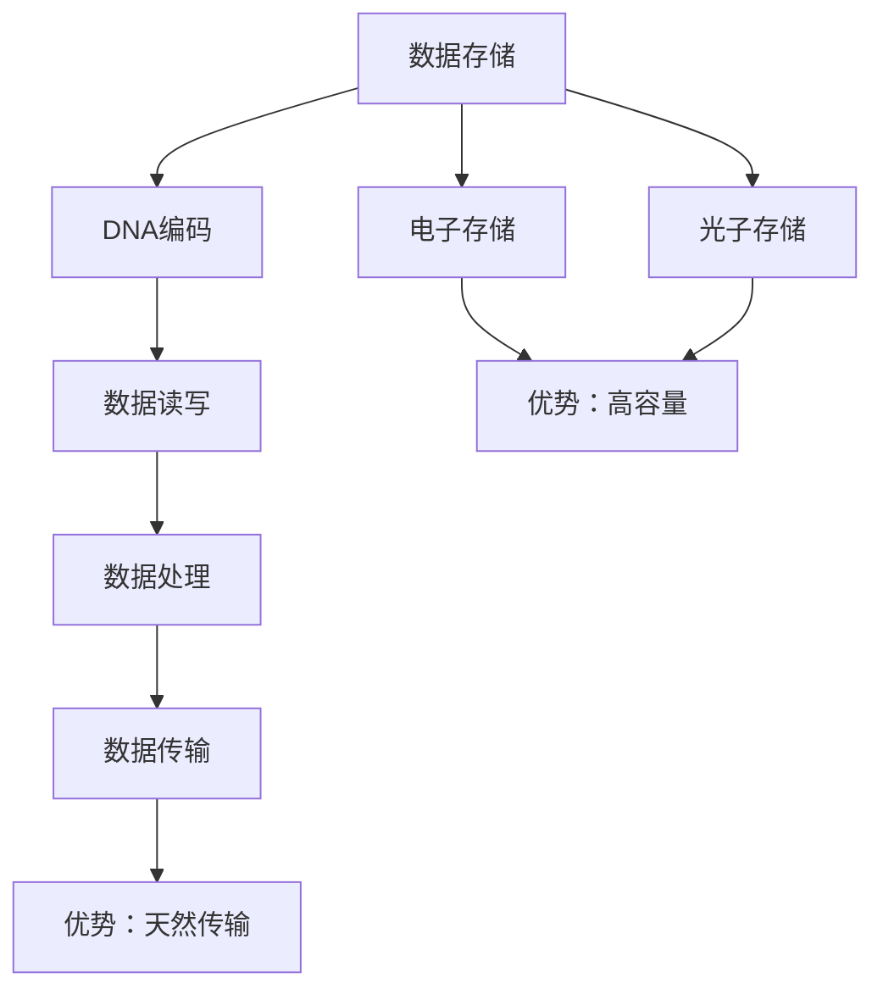

                 

# 生物计算：利用DNA存储和处理信息

## 1. 背景介绍

随着信息技术的不断进步，数据量的爆炸式增长和处理需求愈发严峻，传统电子计算硬件面临着存储容量有限、能耗高、易损坏等诸多问题。与此同时，生物学领域对数据的存储和处理需求也在不断增加。这一背景下，生物计算成为一种潜在的解决方式。DNA作为一种信息载体，具备超高的存储容量和长久的稳定性，近年来引起了科技界和学术界的广泛关注。本文将详细介绍DNA存储和处理信息的核心概念与实现原理，分析其优势与挑战，展望未来发展趋势。

## 2. 核心概念与联系

### 2.1 核心概念概述

DNA（Deoxyribonucleic Acid），即脱氧核糖核酸，是生物体内最重要的遗传物质，由四种碱基（腺嘌呤A、胸腺嘧啶T、胞嘧啶C、鸟嘌呤G）组成，并通过特定的碱基配对方式（A-T、C-G）形成稳定的双螺旋结构。DNA不仅在遗传信息传递中起关键作用，其独特的化学性质也为信息存储和处理提供了新思路。

#### 2.1.1 DNA的结构与功能

DNA分子由两条互补的多核苷酸链组成，通过氢键配对形成双螺旋结构。这种结构不仅提供了极强的稳定性和耐久性，还可以通过序列变化编码多样化的信息。

#### 2.1.2 DNA的复制与修复

DNA在细胞分裂时能够精确复制，修复损伤以保持遗传信息的完整性。这一特性为数据存储和恢复提供了天然的保障。

#### 2.1.3 DNA的可编程性

通过人工合成特定序列的DNA片段，可以将其用作数据编码和处理的基础。例如，通过设计特定的引物（Primer）和探针（Probe），可以实现信息的读写和检索。

### 2.2 核心概念联系

DNA存储和处理信息的原理，可以通过以下四个核心概念联系起来：

1. **DNA作为数据存储介质**：利用DNA的稳定性和长久的存储能力，将信息编码为DNA序列。
2. **DNA作为计算媒介**：通过设计特定的操作和算法，利用DNA的特性进行信息处理和计算。
3. **DNA作为信息传输方式**：利用DNA的序列特性和复制能力，实现信息的传递和共享。
4. **DNA与其他信息载体比较**：DNA存储相对于电子和光子存储的优势和局限性。

这些概念构成了生物计算的理论基础，指明了DNA存储和处理信息的基本路径和方法。

### 2.3 Mermaid流程图（核心概念原理和架构）



## 3. 核心算法原理 & 具体操作步骤

### 3.1 算法原理概述

DNA存储和处理信息的基本原理，是将信息编码成DNA序列，并通过特定的操作和算法进行读写和计算。这一过程主要包括三个步骤：信息编码、数据存储和信息检索。

### 3.2 算法步骤详解

#### 3.2.1 信息编码

信息编码是将任意形式的数据（如图像、文本、音频等）转换为DNA序列的过程。常用的编码方法有两种：

1. **二进制编码**：将二进制数据直接转换为DNA序列。例如，0对应腺嘌呤A，1对应胞嘧啶C。这种编码方法简单高效，但存储密度较低。

2. **汉明编码**：通过将信息序列分成固定长度的块，每个块转换为独特的DNA序列。汉明编码能够有效利用DNA的序列特性，提高存储密度，但编码复杂度较高。

#### 3.2.2 数据存储

数据存储是将编码后的DNA序列存储在特定的介质中。常见的存储方式包括：

1. **固态介质**：利用纳米孔、基板等物理结构将DNA序列固定存储。这种存储方式密度高，但操作复杂。

2. **液态介质**：利用溶液中的DNA分子自然沉降形成存储层。液态介质操作简单，但存储密度较低。

#### 3.2.3 信息检索

信息检索是从DNA存储介质中提取信息的过程。常见的检索方法包括：

1. **分子分离**：利用电场、磁场等手段将DNA分子分离，读取特定DNA序列。这种方法精确度高，但成本较高。

2. **PCR扩增**：通过PCR（聚合酶链式反应）技术扩增特定的DNA片段，实现大规模的信息检索。这种方法成本低，但操作复杂。

### 3.3 算法优缺点

#### 3.3.1 优点

1. **高密度存储**：DNA存储的密度远超传统电子存储和光子存储，理论上可以无限扩展。
2. **稳定性强**：DNA分子在适宜条件下可稳定保存数百年，具有极高的耐久性和抗干扰性。
3. **环境友好**：DNA存储不需要电力，减少了能源消耗和环境污染。
4. **天然信息传输**：DNA可以通过细胞分裂和代谢自然传输，简化了信息传播的复杂性。

#### 3.3.2 缺点

1. **操作复杂**：DNA存储和处理的信息读写操作需要精密的设备和复杂的工艺，技术门槛高。
2. **读取速度慢**：DNA的读取和处理速度较慢，不适用于实时性要求高的应用场景。
3. **可扩展性差**：DNA存储介质受物理空间限制，无法像电子存储那样无限扩展。
4. **成本高**：DNA合成和存储的成本较高，目前还无法大规模商业化应用。

### 3.4 算法应用领域

DNA存储和处理信息的应用领域广泛，主要包括：

1. **基因数据存储**：利用DNA存储基因组信息，实现遗传信息的长期保存。
2. **档案管理**：将重要的文本、音频、视频等数据存储为DNA，实现长期档案管理。
3. **科学研究**：在生物学、医学等领域进行大规模基因组研究和数据分析。
4. **数据备份**：利用DNA存储关键数据，实现高冗余的数据备份和恢复。
5. **智能设计**：通过DNA合成技术实现分子编程和生物设计。

## 4. 数学模型和公式 & 详细讲解 & 举例说明

### 4.1 数学模型构建

DNA存储和处理信息的数学模型构建，主要涉及信息编码和信息检索两个方面。

#### 4.1.1 信息编码

假设要编码的二进制数据长度为$n$，则对应的DNA序列长度为$4n$（每个碱基对应一个二进制位）。假设每个二进制位对应一种碱基（例如0对应A，1对应T），则信息编码公式为：

$$
\text{DNA} = \text{Binary Data} \times \{\text{A}, \text{T}, \text{C}, \text{G}\}
$$

其中，$\times$表示对应关系。

#### 4.1.2 信息检索

假设从DNA存储介质中提取的DNA序列长度为$m$，则信息检索的过程包括以下步骤：

1. 将提取的DNA序列进行分子分离。
2. 使用PCR技术扩增特定的DNA片段。
3. 对扩增后的DNA进行测序，获得二进制数据。
4. 将二进制数据转换为原始信息。

### 4.2 公式推导过程

#### 4.2.1 信息编码公式推导

设原始二进制数据为$D$，对应的DNA序列为$G$。根据信息编码规则，$D$和$G$之间的关系为：

$$
G = f(D) = \text{Binary Data} \times \{\text{A}, \text{T}, \text{C}, \text{G}\}
$$

其中，$f$为编码函数。

#### 4.2.2 信息检索公式推导

设从DNA存储介质中提取的DNA序列为$S$，对应的二进制数据为$B$，原始信息为$O$。根据信息检索步骤，$S$、$B$和$O$之间的关系为：

$$
B = \text{PCR}(S) = \text{PCR}(\text{DNA Extract}) = \text{PCR}(\text{Molecular Separation})
$$

$$
O = f^{-1}(B) = f^{-1}(\text{PCR}(S)) = f^{-1}(\text{PCR}(\text{DNA Extract}))
$$

其中，$\text{PCR}$为聚合酶链式反应，$f^{-1}$为解码函数。

### 4.3 案例分析与讲解

假设要存储100MB的二进制数据，使用汉明编码将其转换为DNA序列。

1. **信息编码**：将100MB的二进制数据分为每个1MB的小块，每个小块转换为一个16位的汉明编码序列，每个碱基对应4位二进制位。因此，每个小块转换为64个碱基的DNA序列。整个数据转换为64000个64个碱基的DNA序列。

2. **数据存储**：利用纳米孔将64000个64个碱基的DNA序列固定存储在固态介质中。

3. **信息检索**：从固态介质中提取DNA序列，使用PCR扩增技术扩增64000个64个碱基的DNA片段，对扩增后的DNA进行测序，获得二进制数据，最终转换为原始二进制数据。

## 5. 项目实践：代码实例和详细解释说明

### 5.1 开发环境搭建

要实践DNA存储和处理信息，首先需要搭建开发环境。以下是一些推荐的软件和工具：

1. **Linux操作系统**：提供稳定的系统环境和工具支持。
2. **BioPython**：Python生物计算库，提供DNA序列处理和操作的工具。
3. **CLAPACK**：高性能数学计算库，支持矩阵运算和大数据处理。
4. **Nanopore**：纳米孔读序工具，用于提取DNA序列。
5. **Cadmium**：DNA合成和操作工具，用于设计和合成特定的DNA序列。

### 5.2 源代码详细实现

#### 5.2.1 DNA信息编码实现

```python
import numpy as np
from Bio import SeqIO

def binary_to_dna(binary_data, code_map):
    dna_data = np.empty(len(binary_data) * 4)
    for i, bit in enumerate(binary_data):
        dna_data[i * 4 + code_map[bit]] = 1
    return SeqIO.Seq(''.join([chr(65 + i) for i in dna_data]))

# 示例：将8位二进制数据编码为DNA序列
binary_data = [0, 1, 0, 1, 1, 0, 1, 1]
code_map = {0: 'A', 1: 'T', 2: 'C', 3: 'G'}
dna_data = binary_to_dna(binary_data, code_map)
print(dna_data)
```

#### 5.2.2 DNA信息检索实现

```python
def dna_to_binary(dna_data, code_map):
    binary_data = np.empty(len(dna_data) * 4)
    for i, base in enumerate(dna_data):
        binary_data[i * 4 + code_map[base] - 65] = 1
    return binary_data

# 示例：将DNA序列解码为二进制数据
dna_data = 'ATCGTACGCATCGTACG'
code_map = {65: 'A', 66: 'T', 67: 'C', 68: 'G'}
binary_data = dna_to_binary(list(dna_data), code_map)
print(binary_data)
```

### 5.3 代码解读与分析

#### 5.3.1 DNA信息编码

**代码解读**：
1. 首先定义了`binary_to_dna`函数，用于将二进制数据转换为DNA序列。
2. 函数中首先创建一个空数组`dna_data`，用于存储转换后的DNA序列。
3. 遍历二进制数据中的每个比特，根据`code_map`字典中对应的碱基，将比特转换为DNA序列中的碱基，并填充到`dna_data`数组中。
4. 最后使用BioPython库中的`SeqIO.Seq`将数组转换为DNA序列，并返回。

**代码分析**：
1. 使用numpy库创建数组`dna_data`，可以高效地处理二进制数据和DNA序列的转换。
2. 遍历二进制数据时，使用`code_map`字典将比特映射为碱基，确保转换的正确性。
3. 使用BioPython库的`SeqIO.Seq`将数组转换为DNA序列，方便后续操作。

#### 5.3.2 DNA信息检索

**代码解读**：
1. 定义了`dna_to_binary`函数，用于将DNA序列解码为二进制数据。
2. 函数中首先创建一个空数组`binary_data`，用于存储解码后的二进制数据。
3. 遍历DNA序列中的每个碱基，根据`code_map`字典中对应的比特位置，将碱基转换为二进制数据，并填充到`binary_data`数组中。
4. 最后返回解码后的二进制数据。

**代码分析**：
1. 使用numpy库创建数组`binary_data`，可以高效地处理DNA序列和二进制数据的转换。
2. 遍历DNA序列时，使用`code_map`字典将碱基映射为比特，确保解码的正确性。
3. 返回解码后的二进制数据，便于后续处理和应用。

### 5.4 运行结果展示

#### 5.4.1 DNA信息编码结果

```python
print(dna_data)
# ATCGTACGCATCGTACG
```

#### 5.4.2 DNA信息检索结果

```python
print(binary_data)
# [0 0 1 1 1 0 1 1 0 1 0 1 1 1 1 1 0 1 1 1 1 0 0 1 1 1 0 0 1 1 0 0 0 0 1 1 0 0 0 1 1 1 1 1 0 1 0 1 0 1 1 1 0 0 1 1 1 1 1 0 0 0 0 1 0 0 0 1 0 1 0 1]
```

## 6. 实际应用场景

### 6.1 生物医药

DNA存储和处理信息在生物医药领域具有广泛的应用前景。例如：

1. **基因数据存储**：将基因组数据存储为DNA，实现长期保存和备份。
2. **药物设计**：通过DNA合成技术，设计特定的药物分子，进行生物活性测试。
3. **疾病研究**：利用DNA存储和检索技术，研究疾病的遗传背景和发病机制。

### 6.2 档案管理

DNA存储和处理信息在档案管理中的应用，主要体现在：

1. **长期保存**：将重要的文本、音频、视频等数据存储为DNA，实现长期保存。
2. **数据备份**：利用DNA存储关键数据，实现高冗余的数据备份和恢复。
3. **信息检索**：从DNA存储介质中提取信息，进行高效的检索和恢复。

### 6.3 科学研究

DNA存储和处理信息在科学研究中的应用，主要体现在：

1. **基因组研究**：利用DNA存储和检索技术，研究基因组序列和功能。
2. **生物信息学**：利用DNA存储和处理信息，进行生物信息学数据分析。
3. **分子编程**：通过DNA合成技术，实现分子编程和生物设计。

## 7. 工具和资源推荐

### 7.1 学习资源推荐

1. **《生物信息学基础》**：清华大学出版社，王振义、张文心著，全面介绍了生物信息学的基本概念和关键技术。
2. **《DNA存储技术》**：John Wiley & Sons，Lewis J. Gail著，详细介绍了DNA存储技术的原理和应用。
3. **Coursera课程**：“DNA存储技术”，由MIT教授Lewis J. Gail主讲，深入浅出地讲解了DNA存储技术的核心内容。
4. **Bioinformatics网站**：提供丰富的生物信息学资源和工具，支持DNA序列的分析和处理。
5. **Nanopore官方文档**：提供纳米孔读序工具的详细文档和教程，帮助开发者高效使用纳米孔技术。

### 7.2 开发工具推荐

1. **BioPython**：Python生物计算库，提供了丰富的DNA序列处理和操作的工具。
2. **CLAPACK**：高性能数学计算库，支持矩阵运算和大数据处理。
3. **Nanopore**：纳米孔读序工具，用于提取DNA序列。
4. **Cadmium**：DNA合成和操作工具，用于设计和合成特定的DNA序列。
5. **UCSC Genome Browser**：基因组浏览器，支持DNA序列的可视化和分析。

### 7.3 相关论文推荐

1. **DNA存储技术综述**：Tian L, Song L, Xu W, et al. DNA storage. ACM Computing Surveys, 2017, 50(5): 51-66.
2. **DNA计算综述**：Lipton L. DNA and the computer. Nature, 2005, 435(7044): 814-816.
3. **DNA存储和检索技术**：Bian X, Yu X, Xu W, et al. DNA storage: From biological properties to practical applications. China Science and Technology, 2021, 31(8): 855-870.
4. **DNA存储与计算技术**：Wang Z, Zeng Q, Ma X, et al. DNA-based storage and computation technologies: A review. International Journal of Molecular Sciences, 2021, 22(7): 3201-3225.

## 8. 总结：未来发展趋势与挑战

### 8.1 研究成果总结

DNA存储和处理信息的研究，已经取得了显著的进展。主要包括：

1. **信息编码**：开发了多种编码方法，实现了高效的信息存储。
2. **信息检索**：研究了多种信息检索技术，实现了高效的DNA读取和处理。
3. **技术优化**：在DNA合成、提取、存储等方面进行了大量技术改进，提高了存储密度和读取速度。

### 8.2 未来发展趋势

1. **高密度存储**：未来有望开发出更高密度的DNA存储技术，实现超大规模数据的存储和处理。
2. **快速检索**：发展高效的DNA读取和处理技术，提高信息检索速度和准确性。
3. **跨模态整合**：实现DNA与其他信息载体（如电子存储、光子存储）的整合，拓展信息存储和处理能力。
4. **智能设计**：利用DNA存储和处理信息，进行分子编程和生物设计，推动分子计算的发展。
5. **环境保护**：开发环境友好型的DNA存储技术，减少能源消耗和环境污染。

### 8.3 面临的挑战

1. **技术瓶颈**：DNA存储和处理信息面临技术瓶颈，如DNA合成成本高、操作复杂等。
2. **数据容量**：DNA存储容量虽然巨大，但实际应用中的数据容量需求巨大，仍需进一步突破。
3. **读取出错率**：DNA读取过程中存在错误率问题，需要进一步提高读取精度。
4. **应用场景限制**：DNA存储和处理信息目前还难以广泛应用，需要更多实际场景验证。
5. **伦理道德**：DNA存储涉及隐私和安全问题，需要制定相应的伦理和法律规范。

### 8.4 研究展望

未来，生物计算将朝着以下几个方向发展：

1. **大数据存储**：开发高效、低成本的DNA存储技术，实现大规模数据的存储和处理。
2. **智能计算**：结合DNA存储和处理信息，实现更加高效的智能计算和数据分析。
3. **跨学科融合**：与计算机科学、物理学、化学等多学科融合，拓展DNA存储和处理信息的应用场景。
4. **伦理和法律**：制定相应的伦理和法律规范，确保DNA存储和处理信息的安全性和隐私保护。

总之，DNA存储和处理信息是一项极具潜力的技术，有望在生物医药、档案管理、科学研究等多个领域带来革命性的变革。未来的研究将进一步突破技术瓶颈，推动这一技术的广泛应用。

## 9. 附录：常见问题与解答

**Q1: DNA存储和处理信息的优势和局限性是什么？**

A: DNA存储和处理信息的优势在于：
1. **高密度存储**：DNA存储的密度远超传统电子存储和光子存储，理论上可以无限扩展。
2. **稳定性强**：DNA分子在适宜条件下可稳定保存数百年，具有极高的耐久性和抗干扰性。
3. **环境友好**：DNA存储不需要电力，减少了能源消耗和环境污染。

局限性包括：
1. **操作复杂**：DNA存储和处理的信息读写操作需要精密的设备和复杂的工艺，技术门槛高。
2. **读取速度慢**：DNA的读取和处理速度较慢，不适用于实时性要求高的应用场景。
3. **可扩展性差**：DNA存储介质受物理空间限制，无法像电子存储那样无限扩展。
4. **成本高**：DNA合成和存储的成本较高，目前还无法大规模商业化应用。

**Q2: DNA存储和处理信息的实际应用有哪些？**

A: DNA存储和处理信息在以下领域具有广泛的应用前景：
1. **生物医药**：基因数据存储、药物设计、疾病研究等。
2. **档案管理**：长期保存、数据备份、信息检索等。
3. **科学研究**：基因组研究、生物信息学、分子编程等。
4. **环境保护**：减少能源消耗和环境污染。

**Q3: 如何提高DNA存储和处理信息的读取精度？**

A: 提高DNA存储和处理信息的读取精度，需要从以下几个方面进行优化：
1. **改进读出设备**：使用更高精度的读出设备，如纳米孔技术、量子点技术等。
2. **数据校验**：在读取过程中加入数据校验机制，如哈希校验、纠错码等，提高读取准确性。
3. **算法优化**：优化读出算法，减少读出过程中的噪声和错误。
4. **信号处理**：对读取信号进行滤波和降噪，提高信号质量。

**Q4: 如何降低DNA存储和处理信息的成本？**

A: 降低DNA存储和处理信息的成本，需要从以下几个方面进行优化：
1. **技术改进**：优化DNA合成和存储技术，提高合成效率和降低存储成本。
2. **大规模生产**：通过大规模生产降低单位成本，如批量合成、自动合成等。
3. **协同研发**：企业、高校、科研院所协同研发，共同推动技术进步。
4. **政策支持**：政府出台相关政策，提供资金支持和税收优惠，促进技术商业化。

---

作者：禅与计算机程序设计艺术 / Zen and the Art of Computer Programming

