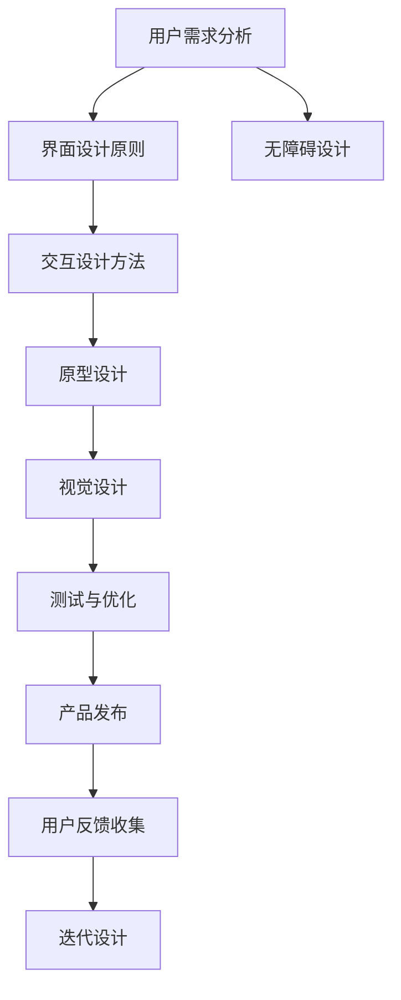

                 

# 用户界面设计：打造友好易用的人机交互体验

> 关键词：用户界面设计(UI),人机交互,用户体验(UX),交互设计,可用性,无障碍设计,原型设计,视觉设计

## 1. 背景介绍

### 1.1 问题由来

随着信息技术的发展，用户界面设计（User Interface Design，UI）已成为应用程序开发中的核心环节。一个友好易用的用户界面不仅能提升用户满意度，还能极大地提高产品竞争力。许多企业在技术、市场、产品设计上投入了大量资源，以期在竞争激烈的市场中脱颖而出。

然而，尽管如此，许多产品的用户界面仍然存在诸多问题，如操作复杂、易用性差、用户需求未被充分满足等。这些问题不仅直接影响了用户体验，还可能对企业的品牌形象造成负面影响。因此，打造友好易用的人机交互体验，成为当前软件开发者和设计人员的首要任务。

### 1.2 问题核心关键点

本文将从以下几个方面系统介绍用户界面设计的核心概念和关键技术，帮助读者深入理解并掌握用户界面设计的方法和技巧。

1. **用户需求分析**：了解用户真实需求，是设计友好易用界面的前提。
2. **用户界面设计原则**：掌握基本的设计原则，如简洁性、一致性、易用性等，是提升用户体验的基础。
3. **交互设计方法**：熟悉交互设计方法，如原型设计、迭代设计等，是实现高效、合理设计的重要手段。
4. **无障碍设计**：理解无障碍设计的必要性，掌握相关技术，是确保产品普适性的关键。
5. **原型工具和资源推荐**：了解常用的原型工具和设计资源，是高效设计的保障。

## 2. 核心概念与联系

### 2.1 核心概念概述

用户界面设计（User Interface Design, UI）旨在通过视觉、交互等方式，提高用户与产品的互动体验，从而提升用户满意度和产品价值。

人机交互（Human-Computer Interaction, HCI）是指用户通过接口与计算机系统进行交互的过程，涉及界面、交互方式、用户体验等多个方面。

用户体验（User Experience, UX）是指用户在使用产品过程中的整体感受，包括易用性、满意度、情感体验等。

无障碍设计（Accessibility Design）是指确保产品能够被各类用户（包括残障用户）轻松访问和使用，以满足其需求。

### 2.2 核心概念原理和架构的 Mermaid 流程图



这个流程图展示了用户界面设计的核心流程：从需求分析到原型设计，再到视觉设计、测试与优化，最终完成产品发布和用户反馈收集。无障碍设计贯穿整个流程，确保产品对各类用户友好。

## 3. 核心算法原理 & 具体操作步骤

### 3.1 算法原理概述

用户界面设计的过程可以概括为以下几个步骤：

1. **需求分析**：明确用户需求，确定产品目标和功能。
2. **界面设计**：根据需求，设计友好的用户界面，包括视觉、交互等元素。
3. **交互设计**：优化用户与系统的交互方式，提升用户体验。
4. **测试与优化**：通过用户测试，发现和解决界面问题，持续优化设计。

### 3.2 算法步骤详解

以下是用户界面设计的具体步骤：

**Step 1: 需求分析**

1. **调研用户需求**：通过问卷调查、访谈、可用性测试等方法，深入了解用户需求和使用场景。
2. **确定功能需求**：根据调研结果，确定产品的主要功能和辅助功能。
3. **制定设计目标**：明确设计的核心目标，如提升用户满意度、降低操作复杂度等。

**Step 2: 界面设计**

1. **选择设计风格**：根据产品定位和目标用户，选择合适的设计风格，如扁平化、暗黑等。
2. **布局设计**：合理布局界面元素，确保信息清晰、易读。
3. **视觉设计**：选择合适的颜色、字体、图标等视觉元素，提升界面的吸引力和可读性。

**Step 3: 交互设计**

1. **交互方式设计**：设计直观、易用的交互方式，如点击、滑动、拖拽等。
2. **反馈机制设计**：确保用户操作后及时反馈，增强用户体验。
3. **交互流程设计**：设计合理的操作流程，避免用户迷失和困惑。

**Step 4: 测试与优化**

1. **用户测试**：通过可用性测试、A/B测试等方法，评估界面和交互效果。
2. **数据分析**：通过数据分析，发现用户常见问题，并指导后续优化。
3. **迭代设计**：根据测试反馈和数据分析结果，不断迭代设计，提升产品体验。

### 3.3 算法优缺点

用户界面设计的优点包括：

1. **提升用户体验**：通过合理的界面和交互设计，提升用户满意度。
2. **降低用户操作难度**：简化用户操作流程，减少操作复杂度。
3. **提升用户转化率**：通过友好的界面和高效的交互，增加用户留存和转化。

缺点包括：

1. **设计难度大**：需要考虑用户需求、界面布局、视觉设计等多方面因素，设计难度大。
2. **依赖用户反馈**：需要持续收集用户反馈，进行迭代优化，设计周期长。
3. **需大量投入**：设计、测试、优化等环节需要大量人力物力，投入成本高。

### 3.4 算法应用领域

用户界面设计在多个领域都有广泛应用，包括但不限于：

- **移动应用**：如微信、支付宝、抖音等。
- **Web应用**：如电商平台、社交网络、在线教育等。
- **企业软件**：如ERP系统、CRM系统、项目管理工具等。
- **智能设备**：如智能手机、智能音箱、智能家居等。
- **医疗健康**：如电子病历、健康管理应用等。

## 4. 数学模型和公式 & 详细讲解 & 举例说明

### 4.1 数学模型构建

用户界面设计中的数学模型主要涉及可用性、用户满意度等指标的评估和优化。这些指标通常采用问卷调查、用户测试等方法获得。

### 4.2 公式推导过程

假设用户界面设计包含以下指标：

- 可用性评分（A）
- 用户满意度评分（S）
- 操作时间（T）

设计目标为最大化这些指标的平均值。数学模型如下：

$$
\text{目标函数} = \frac{A + S + T}{3}
$$

通过问卷调查和用户测试，收集大量数据，利用统计学方法计算上述指标。优化目标函数，提升整体用户体验。

### 4.3 案例分析与讲解

以微信小程序为例，设计团队通过调研发现用户对界面简洁性有较高要求。因此，设计团队选择简洁、明亮的界面风格，简化操作流程，并引入动画效果增强用户互动。通过A/B测试和用户反馈收集，不断优化界面和交互设计，最终实现了高效、友好的用户界面。

## 5. 项目实践：代码实例和详细解释说明

### 5.1 开发环境搭建

用户界面设计通常需要使用原型设计工具进行初步设计和迭代优化。以下是常用的开发环境搭建流程：

1. **安装原型设计工具**：如Sketch、Adobe XD、Figma等。
2. **搭建开发环境**：安装Node.js、React等开发环境，准备前端开发工具。
3. **设计文档整理**：整理设计需求、界面布局、交互流程等文档，便于团队协作。

### 5.2 源代码详细实现

以微信小程序为例，其前端页面设计代码示例如下：

```javascript
// 页面组件定义
class MyComponent extends React.Component {
  render() {
    return (
      <View style={{ flex: 1, alignItems: 'center', justifyContent: 'center' }}>
        <Text>欢迎使用微信小程序</Text>
        <Button title="立即体验" onPress={() => this.props.onPress()} />
      </View>
    );
  }
}

// 页面渲染
ReactDOM.render(<MyComponent />, document.getElementById('root'));
```

### 5.3 代码解读与分析

以上代码实现了微信小程序的一个基本页面，包含标题和按钮组件。通过React和JavaScript实现页面交互和渲染。

**页面组件定义**：使用类组件定义页面结构，包含文本和按钮组件，分别用于显示标题和引导用户操作。

**页面渲染**：使用ReactDOM.render方法将组件渲染到页面，实现页面展示和交互。

### 5.4 运行结果展示

运行上述代码，微信小程序将展示欢迎界面和按钮组件。用户点击后，可以触发组件的onPress回调函数，实现页面跳转或执行其他操作。

## 6. 实际应用场景

### 6.1 智能家居

智能家居系统通过友好的用户界面设计，提升用户使用体验。例如，小米智能家居应用提供直观的界面，用户可以通过简单的拖拽操作，快速添加和管理各类智能设备。系统还支持语音控制，让用户通过语音指令轻松操作家电。

### 6.2 在线教育

在线教育平台通过友好的界面设计，增强用户体验，提升学习效果。例如，Khan Academy使用简洁直观的界面，让用户轻松浏览各类学习资源。平台还提供交互式练习、视频课程等，增强用户互动和参与感。

### 6.3 健康管理

健康管理应用通过友好的界面设计，提高用户使用体验。例如，MyFitnessPal使用清晰的界面布局，让用户轻松添加和记录饮食、运动等信息。应用还支持数据分析和建议，帮助用户建立健康生活方式。

### 6.4 未来应用展望

随着人工智能和物联网技术的发展，用户界面设计将更加智能化和个性化。未来，用户界面设计将结合语音、图像等技术，提供更加自然、便捷的交互方式。同时，设计也将更加注重用户体验的个性化和定制化，满足不同用户的需求。

## 7. 工具和资源推荐

### 7.1 学习资源推荐

以下是用户界面设计的常用学习资源：

1. **《Don't Make Me Think》**：一本经典的用户界面设计书籍，介绍了许多界面设计原则和方法。
2. **《The Elements of User Experience》**：另一本经典的用户体验设计书籍，涵盖了用户体验设计的方方面面。
3. **Nielsen Norman Group**：提供大量界面设计、用户体验的资源和研究报告，是设计人员的必读材料。
4. **InVision Design System Manager**：一款设计管理工具，帮助团队协作、共享设计资源。
5. **Adobe XD**：一款原型设计工具，支持多种设计协作和分享方式，是设计人员常用的工具之一。

### 7.2 开发工具推荐

以下是常用的用户界面设计工具：

1. **Sketch**：一款流行的Mac界面设计工具，支持矢量绘图、界面排版、动画设计等多种功能。
2. **Adobe XD**：一款跨平台的原型设计工具，支持实时预览、协作编辑、导出设计原型等功能。
3. **Figma**：一款云端原型设计工具，支持团队协作、实时编辑、在线共享等多种功能。
4. **Balsamiq**：一款快速原型设计工具，支持多种界面元素和交互方式，适合快速原型设计。
5. **Axure RP**：一款功能强大的原型设计工具，支持复杂交互、动画设计等多种功能。

### 7.3 相关论文推荐

以下是几篇经典的UI设计相关论文，推荐阅读：

1. **“Interaction of Computers and People”**：唐纳德·诺曼（Donald A. Norman）的经典著作，介绍了许多界面设计原则和方法。
2. **“Designing with the Mind in Mind”**：唐纳德·诺曼的另一本经典著作，进一步探讨了人机交互的设计原理和方法。
3. **“The Design of Everyday Things”**：唐纳德·诺曼的另一本经典著作，探讨了设计思维和方法，适用于界面设计。
4. **“Interaction Design Foundation”**：提供大量交互设计相关资源和课程，适合初学者和进阶人员。
5. **“User Interface Design for Virtual Systems”**：JActions等设计研究人员的研究论文，探讨了虚拟系统的界面设计。

## 8. 总结：未来发展趋势与挑战

### 8.1 总结

本文系统介绍了用户界面设计的核心概念、关键技术，以及实际应用场景和未来发展趋势。通过深入了解用户需求，掌握基本的设计原则和交互设计方法，用户界面设计人员可以设计出更加友好易用的界面，提升用户体验。

### 8.2 未来发展趋势

未来，用户界面设计将呈现以下发展趋势：

1. **智能化**：结合人工智能技术，设计更加智能、个性化的界面。
2. **定制化**：通过数据分析和用户画像，提供更加个性化和定制化的界面。
3. **无障碍化**：确保界面对各类用户友好，支持残障用户使用。
4. **跨平台化**：设计适应多种设备和平台的界面，提升用户体验。
5. **自适应化**：根据用户行为和环境变化，动态调整界面设计，提升适应性。

### 8.3 面临的挑战

用户界面设计面临的挑战包括：

1. **技术变革快**：需要不断学习和适应新的技术和设计理念。
2. **需求变化快**：需要及时了解用户需求变化，进行快速迭代优化。
3. **资源投入大**：需要大量人力物力投入设计、测试、优化等环节。
4. **用户体验提升难**：设计改进可能带来用户期望不一致，提升用户体验难度大。

### 8.4 研究展望

未来，用户界面设计需要进一步探索和研究：

1. **智能交互**：结合自然语言处理、机器学习等技术，实现更加智能化的交互方式。
2. **个性化设计**：结合大数据分析，提供更加个性化和定制化的界面设计。
3. **无障碍设计**：引入更多无障碍设计技术，确保各类用户友好使用。
4. **多模态设计**：结合视觉、听觉、触觉等多种感官设计，提升用户体验。
5. **用户体验优化**：通过更多用户体验研究，不断优化设计方案，提升用户满意度。

## 9. 附录：常见问题与解答

**Q1: 用户界面设计的基本原则是什么？**

A: 用户界面设计的基本原则包括：

1. **简洁性**：保持界面简洁，避免过度装饰。
2. **一致性**：界面元素和交互方式保持一致，避免用户困惑。
3. **易用性**：界面操作简便，用户容易上手。
4. **可访问性**：界面对残障用户友好，支持语音、键盘等辅助设备。
5. **反馈及时**：用户操作后及时反馈，增强用户体验。

**Q2: 如何设计用户界面的无障碍性？**

A: 设计用户界面的无障碍性，需考虑以下几点：

1. **支持键盘操作**：确保用户可以使用键盘进行界面操作。
2. **支持屏幕阅读器**：确保屏幕阅读器用户可以顺利访问界面。
3. **使用高对比度**：确保界面元素易于识别。
4. **使用可调整字体大小**：确保不同用户可以调整字体大小以适应需求。
5. **避免闪烁和抖动**：避免界面闪烁和抖动，减少视觉疲劳。

**Q3: 如何进行用户界面设计的测试与优化？**

A: 用户界面设计的测试与优化包括以下几个步骤：

1. **可用性测试**：邀请目标用户测试界面，收集用户反馈。
2. **A/B测试**：将不同设计方案进行对比，选择最优方案。
3. **数据分析**：通过数据分析，发现用户常见问题，指导后续优化。
4. **用户反馈收集**：持续收集用户反馈，进行迭代优化。

**Q4: 如何平衡界面设计和用户体验？**

A: 界面设计和用户体验的平衡主要依赖于以下几方面：

1. **用户研究**：深入了解用户需求和使用场景。
2. **设计原则**：遵循界面设计的基本原则，保持简洁、一致、易用等。
3. **用户测试**：通过用户测试，收集反馈，发现和解决界面问题。
4. **迭代设计**：根据用户反馈，不断迭代优化设计，提升用户体验。

**Q5: 如何提高用户界面的可访问性？**

A: 提高用户界面的可访问性，需从以下几个方面入手：

1. **使用语义化标签**：确保HTML标签语义明确，帮助屏幕阅读器用户理解界面内容。
2. **使用ARIA标签**：使用ARIA标签提供额外的辅助功能，帮助残障用户理解界面元素。
3. **使用可调整字体大小**：确保不同用户可以调整字体大小以适应需求。
4. **提供多种交互方式**：支持键盘操作、屏幕阅读器、语音助手等多种交互方式。
5. **避免视觉闪烁和抖动**：避免界面闪烁和抖动，减少视觉疲劳。

---

作者：禅与计算机程序设计艺术 / Zen and the Art of Computer Programming

