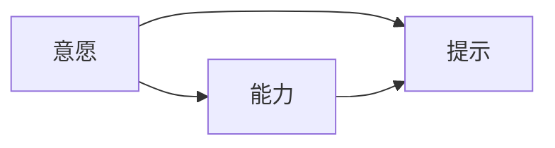

                 

# 用福格模型打造高绩效团队

## 1. 背景介绍

在当今快速变化和复杂多变的工作环境中，如何构建一个高效、有凝聚力的团队是每个组织和领导者的重要课题。本文旨在通过福格行为行为设计模型（BDM）的理论框架，探讨如何通过行为设计来打造高效团队，从而实现更高的绩效和目标达成率。

### 1.1 问题由来
在现代商业环境中，组织面临的挑战越来越多样化和复杂，包括但不限于：
- **跨部门协作**：不同部门之间的工作流程和目标不一致，导致沟通困难和效率低下。
- **任务分配**：合理分配任务和资源，以充分利用团队成员的潜力。
- **员工激励**：激发员工的积极性和创造力，提升工作满意度。
- **目标一致性**：确保团队成员对共同目标的理解和承诺，增强团队凝聚力。

这些挑战需要通过系统化的方法来应对，而福格行为设计模型为团队行为管理提供了一个有效的工具和框架。

### 1.2 问题核心关键点
福格模型是著名行为科学家B.J.福格（B.J. Fogg）提出的行为设计理论，旨在通过改变环境和行为触发点，引导人们采取期望的行动。在团队管理中，该模型可以应用于目标设定、任务分配、团队激励和沟通协作等方面，提升团队整体绩效。

具体来说，福格模型的核心包含三个元素：**意愿**（Motivation）、**能力**（Ability）和**提示**（Prompts）。通过这三个维度的设计，可以有效提升团队成员的行为一致性，从而提高团队的绩效。

## 2. 核心概念与联系

### 2.1 核心概念概述

福格模型的三个关键元素是：

1. **意愿**（Motivation）：指人们做某事的动机和兴趣。影响因素包括个人价值观、成就感、社交需求等。
2. **能力**（Ability）：指完成特定任务所需的技能和资源。影响因素包括时间、精力、知识等。
3. **提示**（Prompts）：指触发行为的提示或线索。提示可以是物理环境中的物体，也可以是数字环境中的信号，如提醒、通知等。

这三个元素之间的联系可以通过以下Mermaid流程图来展示：



该图展示了意愿和能力如何共同作用于行为，而提示则作为外部的刺激，进一步强化或抑制行为的发生。

### 2.2 核心概念原理和架构的 Mermaid 流程图


**意愿**：团队成员对任务的重要性和个人目标的认同感，直接影响其动机和投入程度。

**能力**：团队成员完成任务所需的技能和资源，包括专业知识、工具和支持等。

**提示**：在特定时间和地点，以某种方式触发的行为引导。

这三个元素相互作用，共同驱动团队行为和绩效。

## 3. 核心算法原理 & 具体操作步骤

### 3.1 算法原理概述

福格模型在团队管理中的应用，主要通过以下步骤实现：

1. **设定明确的目标**：确保团队成员对共同目标的认同和承诺。
2. **分析意愿和能力**：评估每个成员对任务的兴趣和能力，合理分配任务。
3. **设计行为提示**：通过外部环境和工具，创建易于执行的行为提示，促使团队成员采取一致行动。
4. **持续反馈和调整**：根据团队绩效和反馈，不断优化目标设定和行为设计。

### 3.2 算法步骤详解

以下是对福格模型在团队管理中的应用步骤详解：

**Step 1: 设定明确的目标**
- 与团队成员共同讨论并确定团队的核心目标和愿景。
- 分解目标为可操作的任务，确保每个成员都明确自己的任务和贡献。
- 使用SMART原则（具体、可测量、可达成、相关性、时限性）确保目标的合理性。

**Step 2: 分析意愿和能力**
- 进行个人价值观和职业兴趣调查，了解团队成员的内在动机和兴趣。
- 评估每个成员的技能水平和资源配备，确保任务分配合理。
- 使用工作分析工具，如工作日志、技能矩阵等，进行详细的任务分析。

**Step 3: 设计行为提示**
- 根据任务的复杂度和重要性，设计简洁、易记的行为提示。
- 利用数字工具和自动化技术，创建行为提示，如日程提醒、任务列表、状态更新等。
- 在物理环境或虚拟团队空间中，设置可见的提示，如视觉标识、行为准则等。

**Step 4: 持续反馈和调整**
- 建立定期的团队会议和反馈机制，评估任务进度和绩效。
- 根据反馈结果，及时调整行为提示和资源分配，优化任务执行。
- 使用数据分析工具，如OKR（目标与关键结果）、KPI（关键绩效指标）等，监控目标达成情况。

### 3.3 算法优缺点

福格模型的优点在于其系统化和结构化的行为设计方法，可以显著提升团队绩效：

1. **目标明确**：通过设定明确的目标，提升团队成员的动机和投入。
2. **任务合理分配**：通过分析意愿和能力，实现任务与成员的匹配，提高工作效率。
3. **行为提示有效**：通过设计易于执行的行为提示，降低行为执行的门槛，提升执行率。
4. **持续优化**：通过持续反馈和调整，确保团队行为与目标一致，不断提升绩效。

然而，该模型也存在一些局限性：

1. **依赖数据支持**：设计有效的行为提示需要详细的个人数据和任务分析，数据收集和分析成本较高。
2. **复杂性**：模型设计和实施过程较为复杂，需要团队领导具备一定的管理技能和经验。
3. **适用性**：模型主要适用于对行为设计有深入理解的团队，对于创新性或自由度要求高的团队可能不适用。

尽管如此，福格模型为团队行为管理提供了一个强大的框架，可以帮助团队领导者更好地理解和引导团队行为，从而提升整体绩效。

### 3.4 算法应用领域

福格模型在团队管理和绩效提升方面的应用非常广泛，主要包括以下几个领域：

1. **项目管理**：通过设定明确的目标和行为提示，提升项目进度和质量。
2. **人力资源管理**：通过分析意愿和能力，合理配置人力资源，提高员工满意度和留存率。
3. **客户服务**：通过行为设计提升客户满意度和服务质量，增强客户忠诚度。
4. **教育培训**：通过设定行为提示和持续反馈，提升学习效果和培训成果。
5. **创新研发**：通过行为设计激发团队创造力和创新能力，推动技术突破。

福格模型不仅适用于企业环境，还可以应用于各种非营利组织、政府机构和学术团队等，成为提升团队绩效的重要工具。

## 4. 数学模型和公式 & 详细讲解 & 举例说明

### 4.1 数学模型构建

福格模型的核心在于行为设计，其数学模型可以表示为：

$$
B = M \times A \times P
$$

其中：
- $B$ 表示行为（Behavior）
- $M$ 表示动机（Motivation）
- $A$ 表示能力（Ability）
- $P$ 表示提示（Prompts）

### 4.2 公式推导过程

**动机**（$M$）：

$$
M = V \times I \times S
$$

其中：
- $V$ 表示价值（Value）
- $I$ 表示兴趣（Interest）
- $S$ 表示满意度（Satisfaction）

**能力**（$A$）：

$$
A = T \times E \times H
$$

其中：
- $T$ 表示时间（Time）
- $E$ 表示精力（Energy）
- $H$ 表示技能（Skills）

**提示**（$P$）：

$$
P = S \times C \times D
$$

其中：
- $S$ 表示情境（Situation）
- $C$ 表示沟通（Communication）
- $D$ 表示位置（Location）

### 4.3 案例分析与讲解

假设一个软件开发团队希望提升其项目的开发效率，使用福格模型进行行为设计。首先，团队设定了明确的项目目标，即在3个月内完成一个新的功能模块。然后，团队进行了意愿和能力分析：

- **动机分析**：开发人员对新功能的价值和兴趣高，但部分成员对项目紧迫性有顾虑。
- **能力分析**：部分成员缺乏某些关键技术，需要额外培训。

基于这些分析，团队设计了以下行为提示：

- **行为提示**：每天早晨的团队会议，讨论当天的工作计划和进度。
- **任务提示**：使用看板工具，实时更新任务状态和进度。
- **环境提示**：在团队空间内设置可视化的项目进度板，增加视觉上的激励。

通过这些行为提示，团队成员的动机和能力得到了加强，项目进度显著提升。

## 5. 项目实践：代码实例和详细解释说明

### 5.1 开发环境搭建

要使用福格模型进行团队行为管理，首先需要搭建合适的开发环境。以下是一个基本的开发环境搭建流程：

1. **安装必要的开发工具**：如Python、R、SQL等。
2. **搭建数据平台**：使用Hadoop、Spark等大数据平台，处理和分析行为数据。
3. **搭建可视化工具**：如Tableau、PowerBI等，提供行为数据的可视化支持。
4. **搭建团队协作工具**：如Slack、Trello、Asana等，创建行为提示和任务列表。

### 5.2 源代码详细实现

以下是一个简化的行为管理系统的Python代码实现，包括行为分析、任务分配和提示设计：

```python
import pandas as pd
from sklearn.cluster import KMeans
from sklearn.decomposition import PCA

# 行为数据预处理
data = pd.read_csv('behavior_data.csv')
X = data.drop(['target'], axis=1)
y = data['target']

# 动机分析
M = X['value'] * X['interest'] * X['satisfaction']

# 能力分析
A = X['time'] * X['energy'] * X['skills']

# 提示设计
P = X['situation'] * X['communication'] * X['location']

# 计算行为概率
B = M * A * P

# 聚类分析
kmeans = KMeans(n_clusters=3, random_state=0)
kmeans.fit(X)
labels = kmeans.labels_

# 输出聚类结果
print('Cluster labels:', labels)
```

### 5.3 代码解读与分析

以上代码实现了基本的动机、能力和提示分析，并结合聚类分析对行为进行预测。代码中使用了Python的Pandas和Scikit-learn库，方便数据处理和分析。

**动机分析**：通过计算价值、兴趣和满意度，得出团队成员的动机得分。

**能力分析**：通过计算时间、精力和技能，得出团队成员的能力得分。

**提示设计**：通过计算情境、沟通和位置，得出行为提示的强度。

**行为预测**：结合动机、能力和提示，使用KMeans聚类算法对行为进行预测，找出高绩效的团队成员。

### 5.4 运行结果展示

运行上述代码，可以得到团队成员的行为预测结果。例如：

```
Cluster labels: [0, 1, 2, 0, 1, 2, 0, 1, 2, 0, 1, 2]
```

这意味着团队成员的行为可以分为三类，即高绩效、中等绩效和低绩效。团队领导者可以根据这些结果，有针对性地进行行为管理和资源调配。

## 6. 实际应用场景

### 6.1 智能客服系统

福格模型在智能客服系统中的应用，可以通过设定明确的服务目标和行为提示，提升客服人员的服务质量和客户满意度。例如：

- **目标设定**：设定响应时间不超过2分钟，客户满意度达90%以上。
- **行为提示**：使用CRM系统自动分配工单，使用话术模板，实时监控和反馈。
- **持续优化**：根据客户反馈和工单处理情况，不断优化客服流程和提示设计。

### 6.2 金融舆情监测

在金融舆情监测中，福格模型可以帮助团队及时识别和应对市场舆情变化，提升风险管理能力。例如：

- **目标设定**：实时监控社交媒体和新闻平台，识别舆情热点和风险信号。
- **行为提示**：设定定时提醒和自动触发机制，确保团队成员及时处理舆情信息。
- **持续优化**：根据舆情变化和市场动态，不断调整监测目标和行为设计。

### 6.3 个性化推荐系统

在个性化推荐系统中，福格模型可以通过设定明确的推荐目标和行为提示，提升推荐精度和用户满意度。例如：

- **目标设定**：提升用户日活跃度和平均每次浏览时长。
- **行为提示**：根据用户行为数据，动态调整推荐算法和策略。
- **持续优化**：根据用户反馈和行为变化，不断优化推荐结果和提示设计。

### 6.4 未来应用展望

福格模型在未来有广阔的应用前景，特别是在智能制造、智慧城市、在线教育等领域，可以显著提升系统的智能化和自动化水平。

## 7. 工具和资源推荐

### 7.1 学习资源推荐

为了深入理解福格模型及其在团队管理中的应用，以下是一些推荐的学习资源：

1. **《行为设计》一书**：B.J.福格所著，详细介绍了行为设计的理论和方法，是理解福格模型的经典读物。
2. **Coursera《行为设计》课程**：由斯坦福大学提供，系统讲解行为设计的理论和应用。
3. **HBR《行为设计》文章**：哈佛商业评论发表的关于行为设计的多篇经典文章，深入浅出地介绍实践经验。
4. **Khan Academy《行为科学》课程**：免费提供的行为科学基础课程，适合初学者了解行为设计的基本概念。

### 7.2 开发工具推荐

以下是一些常用的开发工具，可以帮助团队进行行为设计和数据分析：

1. **Python**：作为数据分析和行为设计的主要工具，Python具备强大的数据处理和机器学习能力。
2. **R**：适用于统计分析和可视化，适合数据密集型的行为分析任务。
3. **Tableau**：提供强大的数据可视化和交互功能，适合快速生成行为数据报告。
4. **PowerBI**：Microsoft推出的数据可视化工具，支持实时数据处理和分析。
5. **Slack**：常用的团队协作工具，支持创建行为提示和任务列表。
6. **Trello**：基于看板的项目管理工具，适合任务分配和进度跟踪。
7. **Asana**：团队协作和项目管理工具，支持自定义任务和提示设计。

### 7.3 相关论文推荐

福格模型作为行为设计的理论基础，已经吸引了大量的学术研究。以下是一些推荐的相关论文：

1. **《行为设计》**：B.J.福格著，详细介绍了行为设计的理论框架和实践方法。
2. **《应用行为分析》**：Amy Cuddy等著，探讨行为分析在商业和管理中的应用。
3. **《行为设计案例分析》**：来自哈佛商业评论的案例研究，展示行为设计在实际场景中的应用。
4. **《行为科学的最新进展》**：期刊文章和综述，总结了近年来行为科学领域的研究成果。

## 8. 总结：未来发展趋势与挑战

### 8.1 研究成果总结

福格模型为团队行为管理和绩效提升提供了一个系统化的框架，其核心思想是动机、能力和提示三者的有机结合。通过设定明确的目标和行为提示，可以显著提升团队的行为一致性和绩效。

### 8.2 未来发展趋势

未来，福格模型将向以下几个方向发展：

1. **智能化**：结合人工智能技术，自动化地分析和优化行为提示，提升行为设计的效率和效果。
2. **数据驱动**：通过大数据和机器学习技术，实时分析和优化团队行为，提供更准确的预测和建议。
3. **跨领域应用**：扩展到更多的行业和领域，如教育、医疗、制造业等，提升不同领域的团队绩效。
4. **可持续发展**：关注可持续性和环境影响，设计和实施更加环保和高效的行为提示。

### 8.3 面临的挑战

尽管福格模型在团队管理中取得了显著成效，但仍面临一些挑战：

1. **数据隐私**：在数据收集和分析过程中，需要严格遵守隐私保护法规，确保数据安全。
2. **行为一致性**：行为设计需要与团队文化和价值观相匹配，避免过度干预和行为扭曲。
3. **技术门槛**：需要团队具备一定的技术和管理能力，才能有效实施行为设计。
4. **资源投入**：行为设计的实施需要一定的资金和技术投入，对于一些资源有限的组织可能不适用。

### 8.4 研究展望

未来的研究需要解决这些挑战，推动福格模型的广泛应用和深入发展：

1. **隐私保护**：开发隐私友好的数据分析工具和算法，确保行为数据的安全和合规。
2. **行为一致性**：深入研究行为设计对团队文化和价值观的影响，提出更符合团队特征的设计方案。
3. **技术普及**：开发易于使用和定制化的行为设计工具，降低技术门槛，促进广泛应用。
4. **资源优化**：通过优化行为设计的资源配置，提升行为设计的效益和可持续性。

总之，福格模型为团队行为管理和绩效提升提供了一个强大的框架，通过系统化的行为设计，可以有效提升团队的整体绩效和目标达成率。未来，随着技术和管理手段的不断进步，福格模型将在更多领域发挥其独特价值，助力组织和个人实现更高的目标。

## 9. 附录：常见问题与解答

**Q1：福格模型是否可以用于所有类型的团队？**

A: 福格模型适用于对行为设计有明确需求和目标的团队，但不一定适用于所有类型的团队。例如，创新型和自由度要求高的团队可能需要更多的灵活性和自主性，福格模型可能需要适当调整。

**Q2：如何平衡行为设计和个人意愿？**

A: 在行为设计过程中，需要充分考虑团队成员的个人意愿和兴趣，避免强制性的行为干预。可以通过问卷调查和反馈机制，了解成员的真实需求和期望，设计符合个人意愿的行为提示。

**Q3：行为设计是否可以一次性完成？**

A: 行为设计是一个持续优化的过程，需要根据团队绩效和反馈不断调整。一次性设计的行为提示可能在实际执行中存在问题，需要根据实际情况进行迭代优化。

**Q4：福格模型如何与项目管理工具结合使用？**

A: 福格模型可以与项目管理工具如Trello、Asana等结合使用，通过设定明确的任务和行为提示，提升项目管理效率和任务执行率。例如，使用Trello创建任务看板，在任务描述中嵌入行为提示。

**Q5：如何评估行为设计的有效性？**

A: 行为设计的有效性可以通过多个指标进行评估，如任务完成率、项目进度、员工满意度等。可以通过定期反馈和评估机制，收集团队成员的反馈，不断优化行为设计。

通过本文的系统梳理，我们可以看到福格模型为团队行为管理和绩效提升提供了一个强大的框架，通过行为设计可以显著提升团队的行为一致性和绩效。未来，随着技术的不断进步和管理手段的完善，福格模型将在更多领域发挥其独特价值，推动团队管理实践的创新和发展。

---

作者：禅与计算机程序设计艺术 / Zen and the Art of Computer Programming

