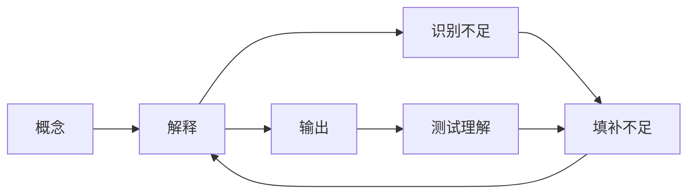

                 

## 1. 背景介绍

在当前这个信息爆炸的时代，学习和掌握新的知识和技能变得越来越重要。然而，如何有效学习、深入理解一个新概念或技术，成为了许多人的难题。费曼提问法（Feynman Technique），又称为费曼学习法、费曼学习策略、费曼学习技巧，是由诺贝尔物理学奖得主理查德·费曼提出的一种学习策略。本文将详细介绍费曼提问法的基本原理、操作步骤、优缺点和应用领域，并通过实际案例展示其效果。

## 2. 核心概念与联系

### 2.1 核心概念概述

费曼提问法是一种通过提问来促进深度学习的策略。该方法利用自我解释的方式，使学习者深入理解概念，从而提高学习效率和效果。费曼提问法涉及四个关键步骤：首先，挑选一个概念，其次，尝试用自己的话解释该概念，第三，找出解释中的不足，最后，填补这些不足，进一步深化理解。

费曼提问法基于以下理论：
- 理解是学习的根本目的。
- 通过自我解释，可以促进深层理解。
- 发现并填补知识漏洞，可以加深记忆。

## 3. 核心算法原理 & 具体操作步骤

### 3.1 算法原理概述

费曼提问法的核心思想是通过自我解释来加深对概念的理解。学习者需要：
- 挑选一个概念，并尝试用自己的话解释它。
- 找到解释中的不清晰或漏洞，记录下来。
- 回过头来填补这些漏洞，确保理解到位。

通过反复这个过程，学习者可以逐步深化对概念的理解，最终达到精通的程度。

### 3.2 算法步骤详解

#### 步骤一：挑选一个概念

开始时，选择一个感兴趣的概念或技术。这个概念应该是你希望深入理解的内容，可以是你在学习过程中遇到的新知识，也可以是某个领域的核心概念。

#### 步骤二：解释概念

尝试用你自己的话，详细地解释这个概念。注意，不要直接复制书本或网页上的定义或解释，而是要自己组织语言，从最基础的概念开始，逐步深入。

#### 步骤三：识别不足

在解释的过程中，你可能会发现某些地方解释不清，或者有些概念你还没有完全理解。记录下这些不足，例如某些术语没有定义、某些步骤没有解释清楚、某些关系没有说明等。

#### 步骤四：填补不足

针对记录下的不足，逐一进行深入研究，直到你完全理解了这些概念。这个过程可能需要查阅书籍、文献、教程等，甚至可能需要询问老师、同事或网络上的专家。

#### 步骤五：测试理解

最后，再次用自己的话解释这个概念，确保你能够清晰、准确地描述，并且没有任何漏洞。

## 4. 数学模型和公式 & 详细讲解 & 举例说明

### 4.1 数学模型构建

费曼提问法没有具体的数学模型，但其核心思想可以通过以下流程来建模：
1. 输入：一个概念或问题。
2. 解释：学习者用自己的话解释该概念。
3. 识别不足：找出解释中的漏洞。
4. 填补不足：学习者深入研究并填补漏洞。
5. 输出：学习者重新解释该概念，确保无漏洞。

### 4.2 公式推导过程

虽然费曼提问法没有具体的数学公式，但我们可以用流程图来表示整个过程：

### 4.3 案例分析与讲解

#### 案例一：理解循环引用

假设我们要深入理解循环引用的概念。我们按照费曼提问法的步骤来操作：

1. 挑选概念：循环引用。
2. 解释概念：循环引用是指一个对象通过自己的引用链回到自己，这种循环结构可以导致内存泄漏等问题。
3. 识别不足：这个解释有点笼统，没有具体说明循环引用的细节，例如如何检测和解决循环引用等问题。
4. 填补不足：进一步查询资料，学习如何检测和解决循环引用的方法，例如使用垃圾回收机制、使用弱引用等。
5. 输出：再次解释循环引用，包括循环引用的定义、检测方法、解决策略等。

通过这个过程，我们对循环引用的理解变得更加深入和具体。

## 5. 项目实践：代码实例和详细解释说明

### 5.1 开发环境搭建

费曼提问法主要依赖于自我学习和研究，不需要特殊的开发环境。只需要一台电脑、一些学习材料（书籍、在线教程等）和一些笔记本即可。

### 5.2 源代码详细实现

虽然费曼提问法本身不需要编程，但我们可以使用编程工具来辅助记录和整理学习过程。例如，可以使用Jupyter Notebook来记录和分享学习笔记，使用GitHub来协作和保存学习资料。

### 5.3 代码解读与分析

虽然费曼提问法不涉及编程，但我们可以用编程的方式来辅助实施这个过程。例如，使用Python编写一个简单的脚本，记录学习笔记和填补不足的查询，这样可以让学习过程更加系统化。

### 5.4 运行结果展示

使用费曼提问法后的结果应该是对概念的深度理解和应用能力。例如，在理解了循环引用的概念后，你可以编写一些代码来测试和解决循环引用的问题，或者写一些博客文章来分享你的理解。

## 6. 实际应用场景

费曼提问法不仅适用于学术学习，还适用于职业培训、技能提升等多个场景。例如：

### 6.1 职业培训

在职业培训中，费曼提问法可以帮助学员深入理解技术原理，掌握实践技能。例如，对于一个复杂的软件系统，学员可以通过费曼提问法逐步理解其架构、设计和实现细节。

### 6.2 技能提升

在技能提升中，费曼提问法可以帮助从业者系统化地学习新技能，提高工作效率。例如，对于一个新的编程框架或工具，从业者可以通过费曼提问法深入理解其核心概念和使用方法。

### 6.3 科学研究

在科学研究中，费曼提问法可以帮助研究人员系统化地理解科学问题，提出创新的解决方案。例如，在生物学领域，研究人员可以通过费曼提问法深入理解某个生物过程的机制，提出新的研究方向。

## 7. 工具和资源推荐

### 7.1 学习资源推荐

- **《费曼学习法：超级强大学习系统》**：详细介绍了费曼提问法的基本原理和操作步骤。
- **《如何阅读一本书》**：提供了阅读和理解书籍的详细方法，包括费曼提问法的使用。
- **《刻意练习》**：介绍了刻意练习的概念和技巧，包括如何通过自我解释和反馈来提高学习效果。

### 7.2 开发工具推荐

- **Jupyter Notebook**：用于记录和分享学习笔记的轻量级工具。
- **GitHub**：用于协作和保存学习资料的版本控制系统。
- **Google Scholar**：用于搜索和查阅学习材料的学术搜索引擎。

### 7.3 相关论文推荐

- **《费曼学习法：超级强大学习系统》**：介绍费曼提问法的基本原理和操作步骤。
- **《如何阅读一本书》**：提供了阅读和理解书籍的详细方法，包括费曼提问法的使用。
- **《刻意练习》**：介绍了刻意练习的概念和技巧，包括如何通过自我解释和反馈来提高学习效果。

## 8. 总结：未来发展趋势与挑战

### 8.1 研究成果总结

费曼提问法是一种有效的学习策略，通过自我解释和反馈来促进深度理解。该方法已被广泛应用于学术、职业和科学等领域，取得了显著的效果。

### 8.2 未来发展趋势

未来，费曼提问法将继续发展，包括：
- 更多的应用场景。费曼提问法不仅适用于学术学习，还适用于职业培训、技能提升等多个领域。
- 工具和平台的优化。随着技术的发展，可能会出现更多辅助费曼提问法的工具和平台，帮助学习者更高效地实施这个过程。
- 与其他学习方法的结合。费曼提问法可以与其他学习方法（如主动学习、心智模型等）结合，形成更加系统的学习体系。

### 8.3 面临的挑战

虽然费曼提问法具有显著的优点，但仍然面临一些挑战：
- 时间和精力的投入。费曼提问法需要大量的时间和精力，对于忙碌的学习者来说可能难以坚持。
- 自我评估的难度。如何准确识别和填补知识漏洞，对学习者提出了较高的要求。
- 适用范围的局限。费曼提问法适用于对某个概念进行深入理解的情况，但可能不适用于系统化学习或泛化能力的学习。

### 8.4 研究展望

未来，如何改进费曼提问法的使用体验和效率，是一个重要的研究方向。例如，开发辅助工具来自动化识别和填补知识漏洞，提供个性化的学习建议等。

## 9. 附录：常见问题与解答

### 9.1 常见问题

**Q1：费曼提问法是否适用于所有类型的学习？**

A: 费曼提问法适用于深度理解某个概念或技术的情况，但可能不适用于系统化学习或泛化能力的学习。

**Q2：如何识别和填补知识漏洞？**

A: 识别知识漏洞可以通过自我解释和比较学习笔记来发现。填补漏洞可以通过查阅书籍、文献、教程等，甚至可能需要询问老师、同事或网络上的专家。

**Q3：费曼提问法是否需要大量的时间和精力？**

A: 费曼提问法需要大量的时间和精力，但可以通过设置具体的学习目标和计划，来提高效率。

**Q4：费曼提问法是否适用于所有类型的知识？**

A: 费曼提问法适用于对某个概念进行深入理解的情况，但可能不适用于图像、音乐等非文字知识。

---

作者：禅与计算机程序设计艺术 / Zen and the Art of Computer Programming

