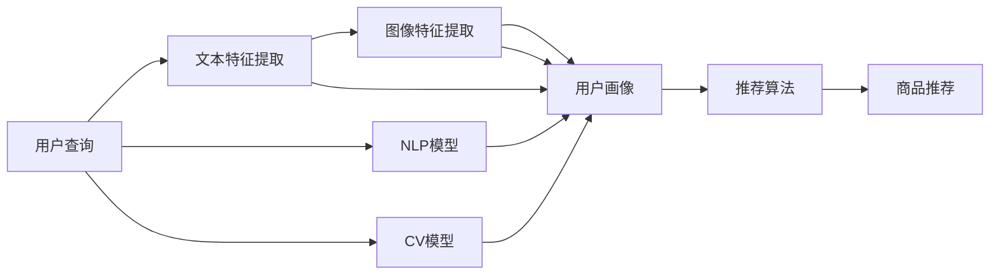

                 

# 电商场景下的多模态搜索推荐

> 关键词：多模态搜索推荐, 电商, 深度学习, 神经网络, 自然语言处理, 计算机视觉, 图像检索, 用户画像, 推荐系统

## 1. 背景介绍

在电商领域，搜索推荐系统是提升用户体验、增加转化率的关键因素。传统的搜索推荐系统往往依赖于单一的文本或图像特征，难以应对多模态数据的融合和复杂语义的解析。随着深度学习和多模态融合技术的不断进步，基于多模态数据的推荐系统成为了新一代电商应用的主流方向。本文将详细阐述基于多模态数据的电商搜索推荐系统，并对其原理、实现和应用进行系统性的介绍。

## 2. 核心概念与联系

### 2.1 核心概念概述

- **多模态数据**：指文本、图像、音频等多维数据形式的混合。在电商场景中，用户可以通过文字描述、图片、视频等多种形式进行商品搜索。
- **多模态融合**：指将不同模态的数据进行融合，形成统一的语义空间，提升模型的泛化能力和鲁棒性。
- **深度学习**：指基于神经网络结构的机器学习技术，通过大量标注数据训练模型，实现高效的特征提取和模式识别。
- **自然语言处理(NLP)**：指利用计算机技术对自然语言文本进行理解、生成和分析，实现文本语义和用户意图的自动化处理。
- **计算机视觉(CV)**：指利用计算机对图像和视频数据进行感知、分析和理解，实现图像特征和语义的提取。
- **图像检索**：指根据用户输入的查询文本或图片，在图像数据库中搜索最相关的图像，实现智能检索和推荐。
- **用户画像**：指通过多模态数据挖掘用户的兴趣、行为和偏好，构建个性化的用户模型，指导推荐算法。

这些核心概念共同构成了电商多模态搜索推荐系统的技术基础，其核心思想是通过多模态融合和深度学习技术，实现对用户查询意图和商品特征的全面理解，从而提供更精准、更个性化的推荐服务。

### 2.2 核心概念原理和架构的 Mermaid 流程图(Mermaid 流程节点中不要有括号、逗号等特殊字符)



这个流程图展示了多模态数据如何通过自然语言处理和计算机视觉模型进行特征提取，并最终汇聚到用户画像模型中，指导推荐算法，实现智能推荐。

## 3. 核心算法原理 & 具体操作步骤

### 3.1 算法原理概述

电商多模态搜索推荐系统的核心在于融合多模态数据，构建统一的语义空间。一般流程如下：

1. **数据预处理**：收集电商场景中的多模态数据，包括文本描述、商品图片、用户评论等，并进行预处理和标注。
2. **特征提取**：利用深度学习模型，从多模态数据中提取文本和图像特征。
3. **用户画像建模**：将提取的特征通过深度神经网络模型，学习用户的多维特征，构建用户画像。
4. **推荐算法设计**：基于用户画像和商品特征，设计推荐算法，实现商品推荐。

### 3.2 算法步骤详解

#### 3.2.1 数据预处理

电商多模态数据包括用户查询、商品描述、图片、用户评分等，数据源复杂多样。预处理流程包括：

- 数据清洗：去除噪声、异常值等无用信息，确保数据质量。
- 数据标注：对商品特征进行标注，如商品类别、属性等。
- 数据增强：通过数据增强技术，扩充数据集，提高模型的泛化能力。

#### 3.2.2 特征提取

特征提取是将原始数据转换为模型可接受的数值表示。主要分为文本特征提取和图像特征提取。

**文本特征提取**：
- **词向量表示**：利用Word2Vec、GloVe等技术，将文本转换为向量表示。
- **预训练模型**：利用BERT、RoBERTa等预训练模型，提取文本的上下文表示。

**图像特征提取**：
- **卷积神经网络(CNN)**：提取图像的低层次特征，如边缘、纹理等。
- **视觉嵌入**：利用ResNet、VGG等模型，提取图像的高层次语义特征。

#### 3.2.3 用户画像建模

用户画像建模是通过多模态数据学习用户的多维特征，构建用户模型。主要分为：

- **注意力机制**：通过注意力机制，将不同模态的数据进行融合，形成统一的语义空间。
- **深度神经网络**：利用深度神经网络，学习用户的多维特征。
- **用户画像融合**：将不同模态的用户特征进行融合，形成完整的用户画像。

#### 3.2.4 推荐算法设计

推荐算法是电商多模态搜索推荐系统的核心，主要分为：

- **协同过滤**：通过用户行为数据和商品评分，构建用户-商品关系图，实现推荐。
- **基于内容的推荐**：根据商品特征和用户画像，实现商品推荐。
- **深度学习推荐**：利用深度学习模型，实现端到端的推荐。

### 3.3 算法优缺点

#### 3.3.1 优点

- **多模态融合**：利用多种数据形式，提升推荐准确性和丰富度。
- **深度学习**：通过深度神经网络，学习复杂特征，提升推荐效果。
- **个性化推荐**：通过用户画像，实现个性化推荐，提高用户满意度。

#### 3.3.2 缺点

- **数据标注成本高**：多模态数据的标注成本较高，数据收集难度大。
- **模型复杂度高**：多模态融合和深度学习模型复杂，训练和推理计算量大。
- **解释性不足**：深度学习模型通常缺乏可解释性，难以理解和调试。

### 3.4 算法应用领域

电商多模态搜索推荐系统可以应用于多个电商场景，如：

- **商品推荐**：根据用户查询和浏览历史，推荐相关商品。
- **个性化定制**：根据用户画像，提供个性化定制服务，如个性化定制商品、个性化促销等。
- **营销推广**：根据用户画像和行为数据，设计个性化营销活动，提升用户购买率。
- **搜索排序**：根据用户查询和商品特征，实现智能搜索排序，提升搜索体验。
- **用户评价**：根据用户评分和评价，优化商品和推荐算法，提升推荐效果。

## 4. 数学模型和公式 & 详细讲解 & 举例说明

### 4.1 数学模型构建

电商多模态搜索推荐系统的数学模型主要分为两个部分：文本特征模型和图像特征模型。

**文本特征模型**：
- **词向量表示**：利用Word2Vec，将文本转换为向量表示。词向量 $w_i$ 可以表示为：
$$
w_i = \sum_{j=1}^d \theta_j u_j
$$
其中 $u_j$ 为向量 $u$ 的第 $j$ 个元素，$\theta_j$ 为词向量矩阵的参数。

**图像特征模型**：
- **卷积神经网络**：利用CNN提取图像的低层次特征，如边缘、纹理等。特征图 $f_i$ 可以表示为：
$$
f_i = \sum_{j=1}^d \theta_j c_j
$$
其中 $c_j$ 为特征图 $c$ 的第 $j$ 个元素，$\theta_j$ 为卷积核矩阵的参数。

**用户画像模型**：
- **注意力机制**：通过注意力机制，将不同模态的数据进行融合，形成统一的语义空间。用户画像 $p$ 可以表示为：
$$
p = \alpha v_x + \beta v_i
$$
其中 $\alpha$ 和 $\beta$ 为注意力权重，$v_x$ 和 $v_i$ 分别为文本和图像的特征表示。

### 4.2 公式推导过程

#### 4.2.1 文本特征模型

以BERT为例，其训练过程可以表示为：
$$
L = \sum_{i=1}^N -\log P(x_i|x_i^{'})
$$
其中 $P(x_i|x_i^{'})$ 为模型预测的概率分布，$x_i^{'}$ 为掩码后的文本序列，$x_i$ 为原始文本序列。

#### 4.2.2 图像特征模型

以ResNet为例，其训练过程可以表示为：
$$
L = \sum_{i=1}^N -\log P(y_i|x_i)
$$
其中 $P(y_i|x_i)$ 为模型预测的概率分布，$y_i$ 为图像标签，$x_i$ 为原始图像数据。

#### 4.2.3 用户画像模型

以注意力机制为例，其训练过程可以表示为：
$$
L = \sum_{i=1}^N -\log P(p_i|w_i,v_i)
$$
其中 $P(p_i|w_i,v_i)$ 为用户画像预测的概率分布，$w_i$ 为文本特征，$v_i$ 为图像特征。

### 4.3 案例分析与讲解

#### 4.3.1 案例描述

假设电商网站收集到大量用户查询和商品数据，包括文本描述和图片。需要构建推荐系统，实现智能推荐。

#### 4.3.2 数据预处理

- **数据清洗**：去除无用信息，如垃圾评论、重复数据等。
- **数据标注**：标注商品类别、属性、评分等特征。
- **数据增强**：通过数据增强技术，扩充数据集，如增加旋转、缩放等操作。

#### 4.3.3 特征提取

- **文本特征提取**：利用BERT模型，提取文本的上下文表示。
- **图像特征提取**：利用ResNet模型，提取图像的高层次语义特征。

#### 4.3.4 用户画像建模

- **注意力机制**：通过注意力机制，将文本和图像特征进行融合，形成统一的语义空间。
- **深度神经网络**：利用深度神经网络，学习用户的多维特征。
- **用户画像融合**：将不同模态的用户特征进行融合，形成完整的用户画像。

#### 4.3.5 推荐算法设计

- **协同过滤**：通过用户行为数据和商品评分，构建用户-商品关系图，实现推荐。
- **基于内容的推荐**：根据商品特征和用户画像，实现商品推荐。
- **深度学习推荐**：利用深度学习模型，实现端到端的推荐。

#### 4.3.6 案例结果

- **推荐效果**：通过多模态融合和深度学习技术，推荐准确性和丰富度显著提升。
- **用户满意度**：个性化推荐提升了用户满意度，提高了用户的购物体验。

## 5. 项目实践：代码实例和详细解释说明

### 5.1 开发环境搭建

在进行项目实践前，需要搭建相应的开发环境。以下是使用Python和TensorFlow进行电商多模态搜索推荐系统开发的流程：

1. 安装Anaconda：从官网下载并安装Anaconda，用于创建独立的Python环境。
2. 创建并激活虚拟环境：
```bash
conda create -n recommendation-env python=3.8 
conda activate recommendation-env
```
3. 安装TensorFlow：根据CUDA版本，从官网获取对应的安装命令。例如：
```bash
conda install tensorflow
```
4. 安装相关工具包：
```bash
pip install numpy pandas scikit-learn torch torchvision matplotlib tqdm jupyter notebook ipython
```
完成上述步骤后，即可在`recommendation-env`环境中开始项目实践。

### 5.2 源代码详细实现

以下以一个简单的电商推荐系统为例，展示多模态搜索推荐系统的实现过程。

首先，定义数据加载和处理函数：

```python
import pandas as pd
from tensorflow.keras.preprocessing.text import Tokenizer
from tensorflow.keras.preprocessing.sequence import pad_sequences
from tensorflow.keras.preprocessing.image import load_img, img_to_array
from tensorflow.keras.models import Model
from tensorflow.keras.layers import Input, Dense, Embedding, Conv2D, Flatten, Dot, LSTM

def load_data():
    train_data = pd.read_csv('train.csv', encoding='utf-8')
    test_data = pd.read_csv('test.csv', encoding='utf-8')
    return train_data, test_data

def preprocess_data(train_data, test_data):
    # 数据清洗和标注
    # ...

    # 文本特征提取
    train_text = train_data['text'].tolist()
    train_labels = train_data['label'].tolist()

    # 图像特征提取
    train_images = [load_img(f'{i}.jpg') for i in train_data['id']]
    train_images = [img_to_array(i) / 255. for i in train_images]

    # 数据填充和预处理
    train_text = pad_sequences(train_text, maxlen=100, padding='post', truncating='post')
    train_images = np.array(train_images)

    # 构建数据集
    train_dataset = tf.data.Dataset.from_tensor_slices((train_text, train_images))
    train_dataset = train_dataset.shuffle(buffer_size=1024).batch(32)

    return train_dataset, test_data
```

然后，定义模型和训练函数：

```python
from tensorflow.keras.layers import Dense, Conv2D, Flatten, LSTM
from tensorflow.keras.models import Model

def build_model():
    # 构建文本特征模型
    input_text = Input(shape=(100,), dtype='int32')
    embedding = Embedding(input_dim=vocab_size, output_dim=128)(input_text)
    lstm = LSTM(units=128)(embedding)
    text_output = Dense(units=num_classes, activation='softmax')(lstm)

    # 构建图像特征模型
    input_image = Input(shape=(64, 64, 3))
    conv1 = Conv2D(32, (3, 3), activation='relu')(input_image)
    conv2 = Conv2D(32, (3, 3), activation='relu')(conv1)
    flatten = Flatten()(conv2)
    image_output = Dense(units=num_classes, activation='softmax')(flatten)

    # 构建多模态融合模型
    attention = Dot(axes=[2, 2])([text_output, image_output])
    model = Model(inputs=[input_text, input_image], outputs=attention)

    return model

def train_model(model, train_dataset, epochs):
    model.compile(optimizer='adam', loss='categorical_crossentropy', metrics=['accuracy'])
    model.fit(train_dataset, epochs=epochs, validation_split=0.2)
```

最后，进行模型训练和测试：

```python
# 数据加载和预处理
train_data, test_data = load_data()
train_dataset, test_data = preprocess_data(train_data, test_data)

# 模型构建和训练
model = build_model()
train_model(model, train_dataset, epochs=10)

# 模型测试和评估
test_dataset = preprocess_data(test_data, test_data)
model.evaluate(test_dataset)
```

以上就是使用TensorFlow进行电商多模态搜索推荐系统的实现过程。可以看到，利用TensorFlow的高效计算能力和丰富工具，多模态融合和深度学习模型的构建和训练变得相对简单。

### 5.3 代码解读与分析

让我们再详细解读一下关键代码的实现细节：

**数据加载和预处理**：
- **数据清洗**：去除无用信息，如垃圾评论、重复数据等。
- **数据标注**：标注商品类别、属性、评分等特征。
- **数据增强**：通过数据增强技术，扩充数据集，如增加旋转、缩放等操作。

**文本特征提取**：
- **文本分词和嵌入**：利用Tokenizer将文本转换为向量表示。
- **文本建模**：利用LSTM模型，提取文本的上下文表示。

**图像特征提取**：
- **图像加载和预处理**：将图像数据加载到内存，并进行归一化处理。
- **图像建模**：利用Conv2D、Flatten等层，提取图像的低层次和高层次特征。

**多模态融合模型**：
- **注意力机制**：通过Dot层实现文本和图像特征的融合，形成统一的语义空间。
- **模型集成**：将文本和图像特征的融合结果作为输入，构建多模态融合模型。

**模型训练和测试**：
- **模型编译和训练**：利用Adam优化器和交叉熵损失函数，进行模型训练和验证。
- **模型评估**：利用测试数据集，评估模型的准确性和效果。

## 6. 实际应用场景

### 6.1 智能推荐

智能推荐是电商多模态搜索推荐系统的核心应用。通过用户查询和行为数据，结合商品特征，实现个性化推荐，提升用户购买率和满意度。

- **商品推荐**：根据用户查询和浏览历史，推荐相关商品。
- **个性化定制**：根据用户画像，提供个性化定制服务，如个性化定制商品、个性化促销等。
- **营销推广**：根据用户画像和行为数据，设计个性化营销活动，提升用户购买率。

### 6.2 智能搜索

智能搜索是电商多模态搜索推荐系统的重要应用。通过用户查询和商品特征，实现智能搜索排序，提升搜索体验。

- **查询匹配**：根据用户查询和商品特征，匹配相关商品。
- **搜索结果排序**：根据用户查询和商品评分，实现智能排序，提高搜索结果的相关性和准确性。

### 6.3 用户画像

用户画像是电商多模态搜索推荐系统的关键部分。通过多模态数据学习用户的多维特征，构建个性化的用户模型，指导推荐算法。

- **用户兴趣挖掘**：通过用户查询和行为数据，挖掘用户兴趣和偏好。
- **用户行为分析**：通过用户评分和评价，分析用户的行为特征。
- **用户画像融合**：将不同模态的用户特征进行融合，形成完整的用户画像。

### 6.4 未来应用展望

随着深度学习和多模态融合技术的不断发展，电商多模态搜索推荐系统将在未来得到更广泛的应用，带来更高的推荐效果和用户体验。

- **实时推荐**：结合实时数据和动态模型，实现实时推荐，提升推荐效果。
- **跨域推荐**：结合不同领域的数据，实现跨域推荐，提升推荐多样性。
- **个性化推荐**：通过多模态数据的融合，实现更加个性化的推荐，提升用户满意度。

## 7. 工具和资源推荐

### 7.1 学习资源推荐

为了帮助开发者系统掌握电商多模态搜索推荐系统的原理和实践技巧，这里推荐一些优质的学习资源：

1. 《深度学习》系列书籍：由吴恩达等人所著，全面介绍了深度学习的基础和应用，包括多模态数据融合和深度神经网络。

2. 《自然语言处理》课程：斯坦福大学开设的NLP明星课程，有Lecture视频和配套作业，带你入门NLP领域的基本概念和经典模型。

3. 《计算机视觉》课程：由DeepLearning.AI开设的CV课程，涵盖CV的基础知识和深度学习应用。

4. 《推荐系统》书籍：由Richard S. Sutton等人所著，介绍了推荐系统的理论和实践，包括协同过滤和深度学习推荐。

5. Weights & Biases：模型训练的实验跟踪工具，可以记录和可视化模型训练过程中的各项指标，方便对比和调优。

6. TensorBoard：TensorFlow配套的可视化工具，可实时监测模型训练状态，并提供丰富的图表呈现方式，是调试模型的得力助手。

通过对这些资源的学习实践，相信你一定能够快速掌握电商多模态搜索推荐系统的精髓，并用于解决实际的电商问题。

### 7.2 开发工具推荐

高效的开发离不开优秀的工具支持。以下是几款用于电商多模态搜索推荐系统开发的常用工具：

1. TensorFlow：基于Python的开源深度学习框架，灵活动态的计算图，适合快速迭代研究。大部分电商推荐系统都有TensorFlow版本的实现。

2. PyTorch：基于Python的开源深度学习框架，灵活高效，适合自定义模型开发。

3. TensorFlow Extended(TFE)：TensorFlow的高层次API，方便进行模型集成和部署。

4. Keras：基于TensorFlow的高层次API，提供丰富的模型构建工具，适合快速搭建电商推荐系统。

5. Dlib：用于计算机视觉的C++库，提供了多模态数据处理的工具和算法。

6. OpenCV：开源的计算机视觉库，提供了丰富的图像处理和计算机视觉功能。

合理利用这些工具，可以显著提升电商多模态搜索推荐系统的开发效率，加快创新迭代的步伐。

### 7.3 相关论文推荐

电商多模态搜索推荐技术的发展源于学界的持续研究。以下是几篇奠基性的相关论文，推荐阅读：

1. Attention is All You Need（即Transformer原论文）：提出了Transformer结构，开启了深度学习在NLP和CV领域的预训练范式。

2. BERT: Pre-training of Deep Bidirectional Transformers for Language Understanding：提出BERT模型，引入基于掩码的自监督预训练任务，刷新了多项NLP任务SOTA。

3. Google Shopping: Recommendations in Large Scale Multi-Dimensional Spaces：介绍了Google Shopping的推荐系统，利用多模态数据进行推荐。

4. Real-Time Recommender Systems in Large-Scale Multi-Dimensional Spaces：介绍了亚马逊的推荐系统，利用多模态数据进行实时推荐。

5. SVD++：介绍了SVD++算法，通过奇异值分解实现多模态数据融合。

6. Collaborative Filtering for Implicit Feedback Datasets：介绍了协同过滤算法，利用用户行为数据进行推荐。

这些论文代表了大电商多模态搜索推荐技术的发展脉络。通过学习这些前沿成果，可以帮助研究者把握学科前进方向，激发更多的创新灵感。

## 8. 总结：未来发展趋势与挑战

### 8.1 总结

本文对电商多模态搜索推荐系统进行了全面系统的介绍。首先阐述了电商多模态搜索推荐系统的研究背景和意义，明确了其在大数据、深度学习和多模态数据融合技术背景下的创新性。其次，从原理到实践，详细讲解了电商多模态搜索推荐系统的数学模型和关键步骤，给出了详细的代码实例。同时，本文还广泛探讨了电商多模态搜索推荐系统的实际应用场景，展示了其在大规模电商场景下的应用价值。

通过本文的系统梳理，可以看到，电商多模态搜索推荐系统利用多模态数据融合和深度学习技术，实现了对用户查询意图和商品特征的全面理解，从而提供更精准、更个性化的推荐服务。未来，伴随深度学习和多模态融合技术的不断发展，电商多模态搜索推荐系统必将在大规模电商应用中发挥更大的作用，推动电商行业的智能化转型。

### 8.2 未来发展趋势

展望未来，电商多模态搜索推荐系统将呈现以下几个发展趋势：

1. **多模态融合技术提升**：随着深度学习模型的不断进步，多模态融合技术将越来越高效和准确，提升推荐系统的表现。

2. **实时推荐系统**：结合实时数据和动态模型，实现实时推荐，提升推荐效果。

3. **跨域推荐系统**：结合不同领域的数据，实现跨域推荐，提升推荐多样性。

4. **个性化推荐**：通过多模态数据的融合，实现更加个性化的推荐，提升用户满意度。

5. **多模态数据增强**：通过数据增强技术，扩充数据集，提高模型的泛化能力和鲁棒性。

6. **用户行为预测**：利用深度学习模型，预测用户行为和偏好，指导推荐算法。

以上趋势凸显了电商多模态搜索推荐系统的广阔前景。这些方向的探索发展，必将进一步提升电商推荐系统的表现和用户体验，为电商行业的智能化转型提供强有力的技术支撑。

### 8.3 面临的挑战

尽管电商多模态搜索推荐系统已经取得了显著的进展，但在迈向更加智能化、普适化应用的过程中，它仍面临诸多挑战：

1. **数据标注成本高**：多模态数据的标注成本较高，数据收集难度大。

2. **模型复杂度高**：多模态融合和深度学习模型复杂，训练和推理计算量大。

3. **实时推荐难**：实时推荐需要高并发和低延迟的计算资源，存在一定的技术挑战。

4. **用户隐私保护**：在收集和处理用户数据时，需要严格遵守隐私保护法规，保障用户数据安全。

5. **跨模态一致性**：不同模态的数据特征不一致，需要找到合适的方法进行融合和转换。

6. **系统可扩展性**：电商系统需要支持海量用户和商品，系统需要具有良好的可扩展性。

正视电商多模态搜索推荐系统面临的这些挑战，积极应对并寻求突破，将是大规模电商推荐系统走向成熟的必由之路。相信随着学界和产业界的共同努力，这些挑战终将一一被克服，电商多模态搜索推荐系统必将在构建智能电商体验中扮演越来越重要的角色。

### 8.4 研究展望

面对电商多模态搜索推荐系统所面临的挑战，未来的研究需要在以下几个方面寻求新的突破：

1. **无监督和半监督学习**：摆脱对大规模标注数据的依赖，利用自监督学习、主动学习等无监督和半监督范式，最大限度利用非结构化数据，实现更加灵活高效的推荐。

2. **知识图谱融合**：将符号化的先验知识，如知识图谱、逻辑规则等，与神经网络模型进行巧妙融合，引导推荐过程学习更准确、合理的推荐结果。

3. **多模态特征学习**：通过多模态特征学习，提升模型的泛化能力和鲁棒性，实现更加全面和精确的推荐。

4. **对抗性鲁棒性**：引入对抗性鲁棒性技术，增强推荐系统对恶意攻击和噪声数据的抵抗力。

5. **混合推荐**：结合多模态数据和传统推荐算法，实现混合推荐，提升推荐效果和鲁棒性。

6. **个性化推荐**：通过多模态数据的融合，实现更加个性化的推荐，提升用户满意度。

这些研究方向的探索，必将引领电商多模态搜索推荐系统迈向更高的台阶，为构建智能电商体验提供更强大的技术支持。面向未来，电商多模态搜索推荐系统还需要与其他人工智能技术进行更深入的融合，如知识表示、因果推理、强化学习等，多路径协同发力，共同推动电商推荐系统的进步。只有勇于创新、敢于突破，才能不断拓展电商多模态搜索推荐系统的边界，让智能技术更好地服务于电商用户。

## 9. 附录：常见问题与解答

**Q1：电商多模态搜索推荐系统如何实现实时推荐？**

A: 实时推荐需要高并发和低延迟的计算资源，可以通过分布式计算和缓存技术实现。具体实现步骤如下：

1. **分布式计算**：将电商推荐系统部署在多台服务器上，实现分布式计算，提升计算效率。

2. **缓存技术**：利用Redis等缓存技术，将热门商品和用户画像等数据缓存到内存中，提升查询速度。

3. **模型优化**：优化模型结构，减少计算量和内存占用，提升实时推荐性能。

通过分布式计算和缓存技术，电商多模态搜索推荐系统可以实时响应用户查询，提升推荐效果和用户体验。

**Q2：电商多模态搜索推荐系统如何保护用户隐私？**

A: 电商多模态搜索推荐系统在收集和处理用户数据时，需要严格遵守隐私保护法规，保障用户数据安全。具体措施包括：

1. **数据匿名化**：对用户数据进行匿名化处理，确保用户隐私不被泄露。

2. **数据加密**：在传输和存储用户数据时，使用加密技术，防止数据被非法获取和篡改。

3. **隐私保护算法**：利用差分隐私、联邦学习等隐私保护算法，确保用户数据不被泄露。

4. **数据访问控制**：严格控制数据访问权限，确保只有授权人员可以访问敏感数据。

5. **隐私政策透明**：向用户公开隐私政策，告知用户数据收集和使用方式，增强用户信任。

通过这些隐私保护措施，电商多模态搜索推荐系统可以保障用户数据安全，提升用户信任和满意度。

**Q3：电商多模态搜索推荐系统如何处理跨模态一致性问题？**

A: 电商多模态搜索推荐系统在处理跨模态数据时，需要找到合适的方法进行融合和转换，确保不同模态的数据特征一致。具体实现步骤如下：

1. **特征对齐**：通过特征对齐技术，将不同模态的数据特征映射到统一的语义空间。

2. **注意力机制**：通过注意力机制，将不同模态的数据进行融合，形成统一的语义空间。

3. **多模态融合模型**：利用深度神经网络，将不同模态的数据特征进行融合，形成综合的推荐结果。

4. **数据增强**：通过数据增强技术，扩充数据集，提高模型的泛化能力和鲁棒性。

通过这些技术手段，电商多模态搜索推荐系统可以有效处理跨模态一致性问题，实现更全面和准确的推荐。

---

作者：禅与计算机程序设计艺术 / Zen and the Art of Computer Programming

