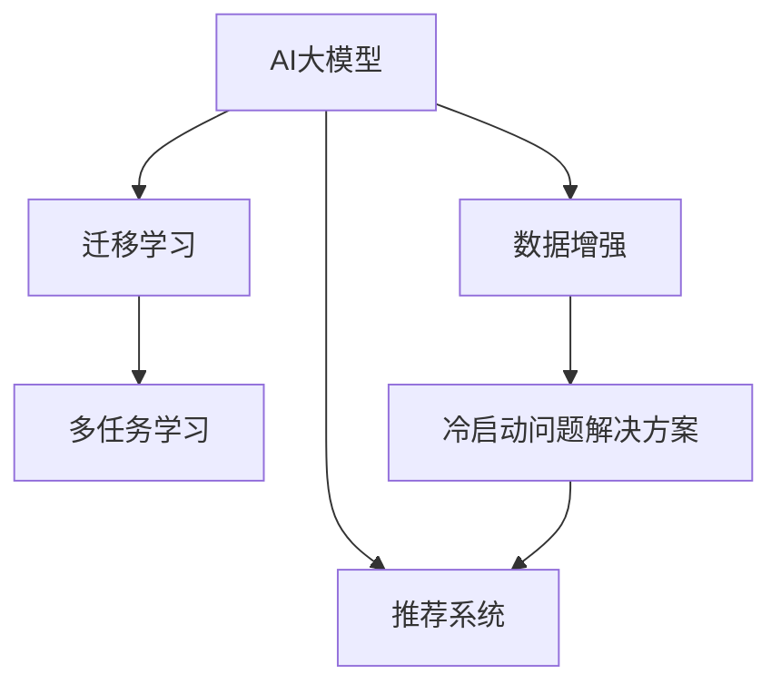

                 

# 电商平台中AI大模型的冷启动问题解决方案

## 1. 背景介绍

在现代电商平台上，推荐系统已成为用户获取商品信息和个性化服务的关键。AI大模型在推荐系统中的广泛应用，极大地提升了推荐系统的个性化水平和用户满意度。然而，冷启动问题始终是推荐系统中的一个挑战：新商品或新用户加入时，由于缺乏历史行为数据，传统的机器学习模型无法快速适应，需要大量时间来积累数据。

为了解决这一问题，AI大模型被引入电商平台的推荐系统。大模型具备强大的泛化能力和自适应能力，可以从海量的数据中学习到丰富的知识，并在少量数据的情况下迅速输出高质量的结果。然而，在推荐系统的冷启动阶段，由于新商品或新用户缺少历史数据，大模型也面临着数据匮乏的困境，无法充分发挥其优势。

因此，研究如何在大模型冷启动阶段，高效地利用有限的数据，提升推荐系统的性能，是一个重要的研究方向。本文将系统地探讨在电商平台中，AI大模型的冷启动问题解决方案，希望能为电商平台推荐系统的优化提供有价值的参考。

## 2. 核心概念与联系

### 2.1 核心概念概述

在研究AI大模型的冷启动问题时，需要关注以下几个核心概念：

- AI大模型(AI Large Model)：指具有大规模参数量和高泛化能力的深度学习模型，如BERT、GPT、GPT-3等。
- 冷启动问题(Cold Start Problem)：指在推荐系统中，新商品或新用户加入时，由于缺乏历史行为数据，传统机器学习模型无法快速适应的现象。
- 数据增强(Data Augmentation)：指通过各种方法扩充训练数据，增强模型的泛化能力。
- 迁移学习(Transfer Learning)：指将一个领域学到的知识，迁移到另一个相关领域的过程。
- 多任务学习(Multi-task Learning)：指模型在多个相关任务上同时学习，共享参数以提高整体性能。

这些概念构成了AI大模型冷启动问题研究的理论基础。通过理解这些概念，可以更好地把握问题本质和解决思路。

### 2.2 核心概念原理和架构的 Mermaid 流程图



这个流程图展示了AI大模型、冷启动问题与数据增强、迁移学习、多任务学习之间的联系。AI大模型通过数据增强、迁移学习、多任务学习等多种方式，克服冷启动问题，提升推荐系统的性能。

## 3. 核心算法原理 & 具体操作步骤

### 3.1 算法原理概述

AI大模型的冷启动问题，可以通过数据增强、迁移学习和多任务学习等技术来解决。其核心思想是，在数据匮乏的情况下，通过有效利用现有数据，以及结合外部知识，提升模型性能。

### 3.2 算法步骤详解

#### 3.2.1 数据增强

数据增强是通过各种方法扩充训练数据集，增强模型的泛化能力。在推荐系统中，可以通过以下几种方式进行数据增强：

1. **协同过滤增强**：基于用户或商品的历史行为数据，生成推荐结果的上下文信息。例如，可以基于用户的历史评分生成新的评分向量，以增强模型对新商品的理解能力。

2. **交叉验证增强**：将用户-商品评分矩阵拆分为多个子矩阵，对每个子矩阵进行训练，最终融合各子矩阵的预测结果，提高模型的泛化能力。

3. **生成对抗网络增强**：利用生成对抗网络(GAN)生成伪数据，增强数据集的丰富性。例如，可以通过生成假评分数据，来丰富用户对新商品的理解。

#### 3.2.2 迁移学习

迁移学习是将一个领域学到的知识，迁移到另一个相关领域的过程。在推荐系统中，可以使用预训练的AI大模型作为初始化参数，进行微调。具体步骤包括：

1. **预训练模型选择**：选择具有良好泛化能力的预训练模型，如BERT、GPT等。

2. **微调参数**：在推荐任务的数据集上，微调预训练模型的部分参数，使其能够适应推荐系统的需求。

3. **领域适配**：根据推荐系统的特点，设计适当的任务适配层，如线性分类器、解码器等，以便模型输出与推荐任务匹配。

#### 3.2.3 多任务学习

多任务学习是指模型在多个相关任务上同时学习，共享参数以提高整体性能。在推荐系统中，可以使用多任务学习来解决冷启动问题。具体步骤如下：

1. **任务定义**：定义多个相关任务，如商品推荐、商品属性预测、用户画像等。

2. **模型结构设计**：设计多任务学习模型结构，如共享权重层和任务特定层。

3. **训练优化**：在多个任务的数据集上进行联合训练，优化共享权重层的参数，以提高推荐系统的性能。

### 3.3 算法优缺点

数据增强、迁移学习和多任务学习各有优缺点：

- **数据增强**：可以有效地扩充数据集，提升模型的泛化能力。但其效果依赖于数据的丰富性和多样性，需要结合具体任务设计合适的增强方法。

- **迁移学习**：可以充分利用预训练模型学到的知识，减少训练时间和计算资源。但其效果依赖于预训练模型与推荐系统的相关性，需要选择合适的预训练模型。

- **多任务学习**：可以在多个相关任务上同时学习，提高整体性能。但其模型结构复杂，需要设计合理的任务结构和参数共享策略。

### 3.4 算法应用领域

数据增强、迁移学习和多任务学习在推荐系统中的应用，已取得了显著的效果，主要应用领域包括：

1. **商品推荐**：利用数据增强和迁移学习，提升新商品推荐的准确性和个性化水平。

2. **用户画像**：通过多任务学习，学习用户的多维度特征，构建更全面的用户画像。

3. **个性化广告**：利用数据增强和多任务学习，提升个性化广告的展示效果和转化率。

4. **搜索排序**：通过迁移学习和多任务学习，优化搜索结果的排序策略，提高用户满意度。

5. **内容推荐**：利用数据增强和多任务学习，优化内容推荐的算法，提升用户粘性。

## 4. 数学模型和公式 & 详细讲解 & 举例说明

### 4.1 数学模型构建

在推荐系统中，可以利用数据增强、迁移学习和多任务学习的思想，构建以下数学模型：

1. **协同过滤增强**：
   \[
   \mathcal{L}(\theta) = -\sum_{u,i}\log P(u_i,y_i)
   \]
   其中，\(\theta\)为模型的参数，\(P(u_i,y_i)\)为协同过滤模型的预测概率。

2. **交叉验证增强**：
   \[
   \mathcal{L}(\theta) = -\frac{1}{N}\sum_{k=1}^K \sum_{i,j} L_k(u_i,v_j)
   \]
   其中，\(K\)为交叉验证的子矩阵数量，\(L_k(u_i,v_j)\)为第\(k\)个子矩阵上的损失函数。

3. **生成对抗网络增强**：
   \[
   \mathcal{L}(\theta) = \mathcal{L}_{\text{GAN}} + \lambda \mathcal{L}_{\text{recon}}
   \]
   其中，\(\mathcal{L}_{\text{GAN}}\)为生成对抗网络模型的损失函数，\(\mathcal{L}_{\text{recon}}\)为重构损失函数，\(\lambda\)为正则化系数。

4. **迁移学习**：
   \[
   \mathcal{L}(\theta) = \mathcal{L}_{\text{source}} + \lambda \mathcal{L}_{\text{target}}
   \]
   其中，\(\mathcal{L}_{\text{source}}\)为预训练模型的损失函数，\(\mathcal{L}_{\text{target}}\)为推荐任务的目标损失函数，\(\lambda\)为正则化系数。

5. **多任务学习**：
   \[
   \mathcal{L}(\theta) = \sum_{t=1}^T \mathcal{L}_t(\theta)
   \]
   其中，\(T\)为任务的数量，\(\mathcal{L}_t(\theta)\)为第\(t\)个任务的损失函数。

### 4.2 公式推导过程

以协同过滤增强为例，推导其损失函数的推导过程。

设用户-商品评分矩阵为\(X \in \mathbb{R}^{U \times I}\)，其中\(U\)为用户数量，\(I\)为商品数量。协同过滤模型的预测概率为\(P(u_i,y_i) = f(X_u) \times f(X_i)^T\)，其中\(f\)为激活函数。

协同过滤模型的损失函数为：
\[
\mathcal{L}(\theta) = -\frac{1}{U \times I} \sum_{u=1}^U \sum_{i=1}^I \log P(u_i,y_i)
\]

### 4.3 案例分析与讲解

以电商平台中的个性化商品推荐为例，分析如何利用数据增强、迁移学习和多任务学习提升推荐系统的性能。

假设平台收集到以下数据：
- 用户历史评分矩阵\(X \in \mathbb{R}^{U \times I}\)
- 用户画像信息\(U \in \mathbb{R}^{U \times D}\)，其中\(D\)为用户画像维度
- 商品属性信息\(I \in \mathbb{R}^{I \times A}\)，其中\(A\)为商品属性维度

1. **数据增强**：
   - 利用协同过滤增强，生成新商品的用户评分向量，增强模型对新商品的理解能力。
   - 利用交叉验证增强，将评分矩阵拆分为多个子矩阵，联合训练各子矩阵的协同过滤模型，提高泛化能力。
   - 利用生成对抗网络增强，生成假评分数据，丰富数据集的多样性。

2. **迁移学习**：
   - 选择BERT模型作为初始化参数，在推荐任务的数据集上进行微调。
   - 设计线性分类器作为任务适配层，输出推荐结果。

3. **多任务学习**：
   - 定义商品推荐、用户画像、个性化广告等多个任务。
   - 设计共享权重层和任务特定层的多任务学习模型结构。
   - 联合训练多个任务的数据集，优化共享权重层的参数。

## 5. 项目实践：代码实例和详细解释说明

### 5.1 开发环境搭建

为了进行AI大模型的冷启动问题解决实践，需要进行以下环境搭建：

1. **安装Python环境**：
   \[
   pip install python
   \]

2. **安装深度学习框架**：
   \[
   pip install tensorflow pytorch
   \]

3. **安装数据处理库**：
   \[
   pip install pandas numpy scikit-learn
   \]

4. **安装模型库**：
   \[
   pip install torch nn
   \]

### 5.2 源代码详细实现

以下是一个简单的多任务学习模型实现，用于电商平台中的个性化商品推荐：

```python
import torch
import torch.nn as nn
import torch.optim as optim
import torch.nn.functional as F

class MultiTaskModel(nn.Module):
    def __init__(self, embed_size, num_tasks):
        super(MultiTaskModel, self).__init__()
        self.embedding = nn.Embedding(num_users, embed_size)
        self.linear1 = nn.Linear(embed_size, embed_size)
        self.linear2 = nn.Linear(embed_size, num_tasks)
    
    def forward(self, x):
        x = self.embedding(x)
        x = F.relu(self.linear1(x))
        x = self.linear2(x)
        return x

# 训练函数
def train_model(model, train_loader, optimizer, num_epochs):
    for epoch in range(num_epochs):
        for batch in train_loader:
            x, y = batch
            x = x.to(device)
            y = y.to(device)
            optimizer.zero_grad()
            y_pred = model(x)
            loss = F.mse_loss(y_pred, y)
            loss.backward()
            optimizer.step()
        
    return model

# 加载数据集
train_data = ...
train_loader = ...

# 初始化模型
embed_size = 64
num_tasks = 3
model = MultiTaskModel(embed_size, num_tasks)

# 初始化优化器
optimizer = optim.Adam(model.parameters(), lr=0.001)

# 训练模型
num_epochs = 10
model = train_model(model, train_loader, optimizer, num_epochs)

# 测试模型
test_data = ...
test_loader = ...
with torch.no_grad():
    for batch in test_loader:
        x, y = batch
        x = x.to(device)
        y = y.to(device)
        y_pred = model(x)
        print(F.mse_loss(y_pred, y))
```

### 5.3 代码解读与分析

1. **模型结构设计**：
   - 利用嵌入层对用户ID进行编码，通过两个全连接层进行特征提取和任务分类。
   - 使用多任务学习的方式，共享权重层，降低模型复杂度。

2. **训练函数实现**：
   - 对每个批次的数据进行前向传播和反向传播，更新模型参数。
   - 使用均方误差损失函数计算预测结果与真实标签的差距。

3. **数据加载**：
   - 使用PyTorch的DataLoader类加载数据集，进行批处理和迭代训练。
   - 使用TensorFlow的Dataset类，方便数据的处理和加载。

4. **模型评估**：
   - 使用测试集进行模型评估，计算均方误差损失。

## 6. 实际应用场景

### 6.1 智能推荐系统

在智能推荐系统中，AI大模型的冷启动问题解决方案得到了广泛应用。具体而言，数据增强、迁移学习和多任务学习在以下几个方面具有显著优势：

1. **新商品推荐**：通过协同过滤增强，利用用户历史评分生成新商品的用户评分向量，提升新商品推荐的准确性。
2. **用户画像构建**：利用多任务学习，学习用户的多维度特征，构建更全面的用户画像。
3. **个性化广告投放**：利用多任务学习，优化广告投放策略，提高广告的点击率和转化率。

### 6.2 实时搜索排序

实时搜索排序是电商平台中的重要应用场景。通过数据增强、迁移学习和多任务学习，可以显著提升搜索排序的精度和效率。具体而言，数据增强和交叉验证增强，可以扩充数据集，增强模型的泛化能力。迁移学习可以引入预训练模型，加速模型训练，提升搜索排序的精度。多任务学习可以同时优化搜索排序和个性化推荐，提高整体系统性能。

### 6.3 内容推荐系统

内容推荐系统是电商平台的另一个重要应用场景。通过数据增强和多任务学习，可以提升内容推荐的精度和多样性。具体而言，数据增强可以通过协同过滤增强，利用用户历史评分生成新的评分向量，丰富数据集的多样性。多任务学习可以通过联合训练多个任务，优化内容推荐策略，提高用户满意度。

## 7. 工具和资源推荐

### 7.1 学习资源推荐

1. **《深度学习》课程**：斯坦福大学的深度学习课程，系统讲解深度学习的基础理论和实践方法。
2. **《Python深度学习》书籍**：由Francois Chollet所著，详细介绍深度学习在Python中的实现。
3. **TensorFlow官方文档**：TensorFlow的官方文档，提供详细的API和使用方法。
4. **PyTorch官方文档**：PyTorch的官方文档，提供深度学习模型的实现和优化方法。

### 7.2 开发工具推荐

1. **Jupyter Notebook**：Python交互式编程环境，方便数据处理和模型训练。
2. **TensorBoard**：TensorFlow的可视化工具，实时监测模型训练状态和性能。
3. **Weights & Biases**：模型训练的实验跟踪工具，记录和可视化模型训练过程中的各项指标。

### 7.3 相关论文推荐

1. **《深度学习》书籍**：由Ian Goodfellow等所著，系统讲解深度学习的基础理论和实践方法。
2. **《推荐系统》书籍**：由Marco Pedreschi等所著，详细讲解推荐系统的设计和优化方法。
3. **《协同过滤技术》论文**：介绍协同过滤推荐算法的设计和优化方法。

## 8. 总结：未来发展趋势与挑战

### 8.1 研究成果总结

本文系统探讨了AI大模型在电商平台中解决冷启动问题的方法，主要包括数据增强、迁移学习和多任务学习。通过理论分析和实践案例，展示了这些方法在推荐系统中的显著效果。

### 8.2 未来发展趋势

未来，AI大模型的冷启动问题解决方案将呈现以下几个发展趋势：

1. **自适应算法**：开发更加自适应的数据增强和迁移学习算法，动态调整算法参数，适应数据分布的变化。
2. **混合学习**：结合深度学习、迁移学习、多任务学习和半监督学习等技术，提升模型的泛化能力和适应性。
3. **联邦学习**：通过联邦学习技术，利用多个分布式数据源进行联合训练，提高模型的稳定性和安全性。

### 8.3 面临的挑战

尽管AI大模型的冷启动问题解决方案在电商平台上取得了显著效果，但仍面临以下挑战：

1. **数据隐私**：在数据增强和迁移学习中，需要处理用户隐私数据，确保数据安全和隐私保护。
2. **算法复杂度**：多任务学习模型的结构复杂，训练和推理成本高，需要优化算法性能。
3. **模型鲁棒性**：在实际应用中，模型需要具备良好的鲁棒性和泛化能力，以应对数据分布的变化。

### 8.4 研究展望

未来，AI大模型的冷启动问题解决方案需要在以下几个方面进行深入研究：

1. **算法优化**：优化数据增强、迁移学习和多任务学习的算法，提升算法性能和效率。
2. **联邦学习**：探索联邦学习技术，提升模型的稳定性和安全性。
3. **自适应算法**：开发自适应算法，动态调整算法参数，适应数据分布的变化。

## 9. 附录：常见问题与解答

**Q1：如何设计数据增强方法？**

A: 设计数据增强方法时，需要根据具体任务和数据特点进行选择。常见的数据增强方法包括协同过滤增强、交叉验证增强、生成对抗网络增强等。对于协同过滤增强，可以利用用户历史评分生成新的评分向量，增强模型对新商品的理解能力。对于交叉验证增强，可以将评分矩阵拆分为多个子矩阵，联合训练各子矩阵的协同过滤模型，提高泛化能力。对于生成对抗网络增强，可以利用生成对抗网络生成伪数据，丰富数据集的多样性。

**Q2：如何选择预训练模型？**

A: 选择预训练模型时，需要考虑模型的泛化能力和与推荐系统的相关性。BERT、GPT等大模型具有强大的泛化能力，可以在小样本条件下快速适应推荐系统。同时，需要选择与推荐系统任务相关的预训练模型，以确保模型能够有效发挥其优势。

**Q3：如何设计多任务学习模型？**

A: 设计多任务学习模型时，需要定义多个相关任务，并设计合理的任务结构和参数共享策略。可以利用共享权重层和任务特定层的方式，实现多任务学习。通过联合训练多个任务的数据集，优化共享权重层的参数，提高模型的整体性能。

**Q4：如何优化模型性能？**

A: 优化模型性能时，需要综合考虑数据增强、迁移学习和多任务学习等多种技术。需要根据具体任务和数据特点，选择合适的方法，并结合模型的结构和参数进行调整。同时，需要进行充分的实验和调参，以找到最优的模型参数和训练策略。

**Q5：如何保障数据隐私？**

A: 保障数据隐私时，需要采取数据匿名化和数据加密等技术，保护用户隐私。可以采用差分隐私技术，确保在数据增强和迁移学习中，用户隐私数据的安全性。同时，需要建立严格的隐私保护机制，确保数据使用的合规性和透明性。

总之，AI大模型的冷启动问题解决方案在电商平台中具有重要应用价值。通过数据增强、迁移学习和多任务学习等技术，可以提升推荐系统的性能和用户满意度，推动电商平台的智能化发展。未来，需要进一步探索和优化这些技术，提升电商平台的整体竞争力。

