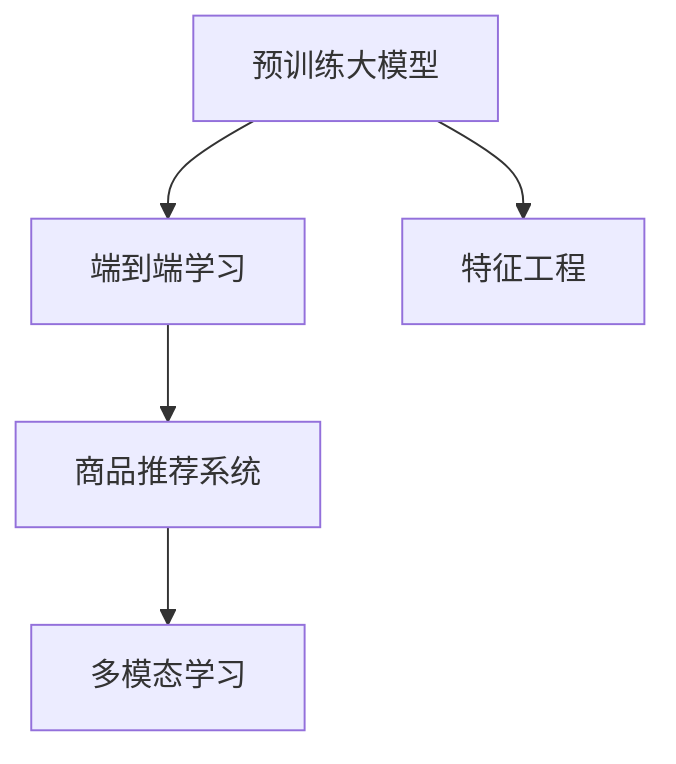

                 

# 电商平台中的AI大模型：从特征工程到端到端学习

## 1. 背景介绍

### 1.1 问题由来

电商行业正经历着深刻的变革，从传统的B2C交易模式，向社交电商、直播电商、私域流量等多种新型电商模式演进。这种多样化的电商形态，极大地丰富了电商平台的业务场景，带来了更广阔的市场机遇和挑战。

与此同时，人工智能技术在电商领域的应用也不断深入。从简单的商品推荐，到复杂的个性化推荐、内容生成、聊天机器人、智能客服等应用，AI正逐步成为电商企业提升用户体验、优化运营效率的重要工具。

然而，面对多样化的电商业务需求，传统的基于规则和手工特征工程的推荐系统已显得力不从心。现有的推荐系统往往依赖大量手工设计的特征工程，需要频繁更新和维护，难以应对动态变化的业务需求。

针对这一问题，以预训练大模型为基础的端到端学习范式，为电商平台带来了新的解决方案。预训练大模型通过海量数据预训练获得广泛的知识表示，能够自动化地提取高维空间中的隐含特征，快速适应新任务，显著提升推荐系统的性能。

本文将从特征工程到端到端学习的角度，详细介绍预训练大模型在电商平台中的应用。我们将探索如何通过端到端学习范式，构建高效率、高性能的AI推荐系统，赋能电商平台的智能化转型。

## 2. 核心概念与联系

### 2.1 核心概念概述

为了更好地理解预训练大模型在电商平台中的应用，本节将介绍几个密切相关的核心概念：

- 预训练大模型(Pre-trained Large Model)：指在大规模无标签文本或图像数据上预训练的深度学习模型，如BERT、GPT、DALL-E等。通过预训练，模型能够学习到丰富的语言或图像特征，具备强大的泛化能力。

- 端到端学习(End-to-End Learning)：指从原始数据到目标任务的直接建模，无需中间手工特征工程。模型通过反向传播算法直接学习输入到输出的映射关系，端到端地输出目标结果。

- 特征工程(Feature Engineering)：指基于经验的手工特征提取、变换和组合过程，是传统机器学习模型的重要步骤。包括特征选择、特征缩放、特征组合等。

- 商品推荐系统(Recommendation System)：指电商平台通过推荐算法，向用户推荐感兴趣的商品。推荐系统的好坏直接决定了用户购买转化率和平台营收。

- 多模态学习(Multimodal Learning)：指模型同时处理多种类型的数据，如文本、图像、声音等，提取和融合多模态特征，提升模型性能。

这些核心概念之间的逻辑关系可以通过以下Mermaid流程图来展示：



这个流程图展示了几组概念之间的关系：

1. 预训练大模型通过端到端学习，直接从原始数据到推荐结果进行建模。
2. 特征工程是传统推荐系统的核心步骤，需要人工提取和构建特征。
3. 端到端学习与特征工程的替代关系，代表着机器学习范式的变迁。
4. 多模态学习通过处理多种类型的数据，提升推荐系统的效果。

这些概念共同构成了电商平台AI推荐系统的技术框架，使得我们能够高效地构建高性能推荐系统。

## 3. 核心算法原理 & 具体操作步骤
### 3.1 算法原理概述

端到端学习的核心思想是，将原始数据直接输入模型进行训练，输出目标结果，无需中间手工特征工程。这种直接建模的方式，能够最大限度地利用数据信息，避免特征工程的噪声和偏差。

以电商平台商品推荐为例，假设我们有一张商品-用户行为矩阵，其中每行表示用户对商品的评分，每列表示用户的历史行为数据。目标是预测用户对每个商品的评分，推荐系统则根据预测评分进行推荐。

端到端学习的过程包括：

1. 将商品-用户行为矩阵作为模型输入，直接进行建模。
2. 使用反向传播算法更新模型参数，最小化预测评分与真实评分之间的差异。
3. 模型输出每个商品的预测评分，进行商品排序推荐。

相比传统的基于特征工程的推荐系统，端到端学习能够自动识别和提取隐含特征，适应动态变化的业务需求，且不受特征工程选择的影响。

### 3.2 算法步骤详解

预训练大模型在电商平台中的应用，主要分为以下几个关键步骤：

**Step 1: 准备预训练模型和数据集**
- 选择合适的预训练大模型，如BERT、GPT等。
- 收集电商平台的商品数据、用户行为数据、社交媒体数据等，构建原始数据集。
- 对数据进行预处理，如数据清洗、归一化、缺失值处理等。

**Step 2: 设计任务适配层**
- 根据任务类型，在预训练模型顶层设计合适的输出层和损失函数。
- 对于评分预测任务，通常在顶层添加线性分类器或回归器。
- 对于生成任务，通常使用语言模型的解码器输出概率分布，并以负对数似然为损失函数。

**Step 3: 设置模型参数和训练超参数**
- 选择合适的优化算法及其参数，如 Adam、SGD 等，设置学习率、批大小、迭代轮数等。
- 设置正则化技术及强度，包括权重衰减、Dropout、Early Stopping 等。
- 确定冻结预训练参数的策略，如仅微调顶层，或全部参数都参与微调。

**Step 4: 执行梯度训练**
- 将训练集数据分批次输入模型，前向传播计算损失函数。
- 反向传播计算参数梯度，根据设定的优化算法和学习率更新模型参数。
- 周期性在验证集上评估模型性能，根据性能指标决定是否触发 Early Stopping。
- 重复上述步骤直到满足预设的迭代轮数或 Early Stopping 条件。

**Step 5: 测试和部署**
- 在测试集上评估微调后模型 $M_{\hat{\theta}}$ 的性能，对比微调前后的精度提升。
- 使用微调后的模型对新样本进行推理预测，集成到实际的应用系统中。
- 持续收集新的数据，定期重新微调模型，以适应数据分布的变化。

以上是端到端学习范式在电商平台中的应用的一般流程。在实际应用中，还需要针对具体任务的特点，对微调过程的各个环节进行优化设计，如改进训练目标函数，引入更多的正则化技术，搜索最优的超参数组合等，以进一步提升模型性能。

### 3.3 算法优缺点

端到端学习在电商平台中的应用具有以下优点：

1. 高效快速：端到端学习直接从原始数据到目标结果进行建模，无需中间手工特征工程，能够快速适应新任务。
2. 鲁棒性强：模型通过反向传播算法直接学习输入到输出的映射关系，不受特征工程选择的影响，具有更好的泛化能力。
3. 参数高效：使用预训练大模型，只需要微调顶层参数，可以极大地减少训练时间和计算资源消耗。
4. 灵活性强：预训练大模型能够适应动态变化的业务需求，无需频繁更新和维护特征工程。

同时，端到端学习也存在一定的局限性：

1. 模型复杂度高：预训练大模型的参数量较大，对算力、内存、存储等硬件资源提出了较高的要求。
2. 数据需求大：模型需要大量的原始数据进行预训练，数据采集和处理成本较高。
3. 可解释性不足：端到端学习的模型通常是黑盒系统，难以解释其内部工作机制和决策逻辑。
4. 维护困难：预训练大模型和端到端学习的模型结构复杂，维护和调优难度较大。

尽管存在这些局限性，但就目前而言，端到端学习范式已成为电商平台推荐系统的主流范式。未来相关研究的重点在于如何进一步降低模型复杂度，优化模型训练，提高模型可解释性，提升推荐系统的性能和用户体验。

### 3.4 算法应用领域

预训练大模型和端到端学习在电商平台的推荐系统、智能客服、广告投放等多个领域得到了广泛的应用，为电商平台带来了显著的业务效益。

- 商品推荐系统：使用端到端学习的模型，可以自动从用户行为数据中提取隐含特征，准确预测用户评分，推荐符合用户偏好的商品。
- 智能客服：通过端到端学习的模型，可以自动理解用户查询意图，匹配最合适的回复模板，提升客服响应速度和质量。
- 广告投放：使用端到端学习的模型，可以根据用户历史行为数据，自动生成广告创意和投放策略，提升广告效果和转化率。
- 多模态学习：通过处理文本、图像、音频等多模态数据，提取和融合多模态特征，提升推荐系统的效果。

除了这些经典应用外，预训练大模型和端到端学习还被创新性地应用于价格预测、库存管理、用户行为预测等电商领域的新兴任务，为电商平台带来了新的发展机遇。

## 4. 数学模型和公式 & 详细讲解  
### 4.1 数学模型构建

本节将使用数学语言对端到端学习在电商平台中的应用进行更加严格的刻画。

假设电商平台的商品数据为 $X$，用户行为数据为 $Y$，目标是预测用户对每个商品的评分 $Z$。端到端学习的数学模型可以表示为：

$$
f_{\theta}(X) = Z
$$

其中 $f_{\theta}$ 为端到端学习的模型， $\theta$ 为模型参数。

模型的损失函数通常使用均方误差损失函数，即：

$$
\mathcal{L}(\theta) = \frac{1}{N}\sum_{i=1}^N (Z_i - f_{\theta}(X_i))^2
$$

其中 $N$ 为样本数量，$X_i$ 和 $Z_i$ 分别表示第 $i$ 个样本的输入和输出。

通过梯度下降等优化算法，最小化损失函数 $\mathcal{L}$，更新模型参数 $\theta$，完成模型的训练和预测。

### 4.2 公式推导过程

以下我们以评分预测任务为例，推导均方误差损失函数及其梯度的计算公式。

假设模型 $f_{\theta}$ 在输入 $X$ 上的输出为 $\hat{Z}=f_{\theta}(X)$，表示预测评分。真实评分 $Z \in \mathbb{R}$。则均方误差损失函数定义为：

$$
\mathcal{L}(\theta) = \frac{1}{N}\sum_{i=1}^N (Z_i - \hat{Z}_i)^2
$$

将其代入经验风险公式，得：

$$
\mathcal{L}(\theta) = \frac{1}{N}\sum_{i=1}^N (Z_i - f_{\theta}(X_i))^2
$$

根据链式法则，损失函数对参数 $\theta$ 的梯度为：

$$
\frac{\partial \mathcal{L}(\theta)}{\partial \theta} = -\frac{2}{N}\sum_{i=1}^N (Z_i - f_{\theta}(X_i)) \frac{\partial f_{\theta}(X_i)}{\partial \theta}
$$

其中 $\frac{\partial f_{\theta}(X_i)}{\partial \theta}$ 可进一步递归展开，利用自动微分技术完成计算。

在得到损失函数的梯度后，即可带入参数更新公式，完成模型的迭代优化。重复上述过程直至收敛，最终得到适应电商推荐任务的最优模型参数 $\theta^*$。

## 5. 项目实践：代码实例和详细解释说明
### 5.1 开发环境搭建

在进行电商推荐系统的开发前，我们需要准备好开发环境。以下是使用Python进行TensorFlow开发的环境配置流程：

1. 安装Anaconda：从官网下载并安装Anaconda，用于创建独立的Python环境。

2. 创建并激活虚拟环境：
```bash
conda create -n tf-env python=3.8 
conda activate tf-env
```

3. 安装TensorFlow：根据CUDA版本，从官网获取对应的安装命令。例如：
```bash
conda install tensorflow tensorflow-cpu -c tf -c conda-forge
```

4. 安装TensorFlow Addons：
```bash
pip install tensorflow-addons
```

5. 安装TensorBoard：
```bash
pip install tensorboard
```

6. 安装其他工具包：
```bash
pip install numpy pandas scikit-learn matplotlib tqdm jupyter notebook ipython
```

完成上述步骤后，即可在`tf-env`环境中开始电商推荐系统的开发。

### 5.2 源代码详细实现

这里我们以评分预测任务为例，给出使用TensorFlow对BERT模型进行电商推荐系统开发的PyTorch代码实现。

首先，定义评分预测任务的数据处理函数：

```python
from transformers import BertTokenizer
from torch.utils.data import Dataset
import tensorflow as tf
import tensorflow_addons as tfa

class RatingDataset(Dataset):
    def __init__(self, texts, ratings, tokenizer, max_len=128):
        self.texts = texts
        self.ratings = ratings
        self.tokenizer = tokenizer
        self.max_len = max_len
        
    def __len__(self):
        return len(self.texts)
    
    def __getitem__(self, item):
        text = self.texts[item]
        rating = self.ratings[item]
        
        encoding = self.tokenizer(text, return_tensors='tf', max_length=self.max_len, padding='max_length', truncation=True)
        input_ids = tf.convert_to_tensor(encoding['input_ids'], dtype=tf.int32)
        attention_mask = tf.convert_to_tensor(encoding['attention_mask'], dtype=tf.int32)
        
        # 对token-wise的评分进行编码
        encoded_ratings = tf.cast(tf.convert_to_tensor([rating] * self.max_len), dtype=tf.float32)
        encoded_ratings = tf.concat([encoded_ratings, tf.zeros([self.max_len - 1], dtype=tf.float32)], axis=-1)
        labels = tf.convert_to_tensor(encoded_ratings, dtype=tf.float32)
        
        return {'input_ids': input_ids, 
                'attention_mask': attention_mask,
                'labels': labels}

# 创建dataset
tokenizer = BertTokenizer.from_pretrained('bert-base-cased')

train_dataset = RatingDataset(train_texts, train_ratings, tokenizer)
dev_dataset = RatingDataset(dev_texts, dev_ratings, tokenizer)
test_dataset = RatingDataset(test_texts, test_ratings, tokenizer)
```

然后，定义模型和优化器：

```python
from transformers import BertForRegression, AdamW

model = BertForRegression.from_pretrained('bert-base-cased')

optimizer = AdamW(model.parameters(), lr=2e-5)
```

接着，定义训练和评估函数：

```python
from tensorflow.keras.optimizers import SGD
from tensorflow.keras.losses import MeanSquaredError
from tensorflow.keras.metrics import MeanAbsoluteError

device = tf.device('/cpu:0') if not tf.config.list_physical_devices('GPU')[0] else tf.device('/cpu:0') # 选择CPU或GPU

def train_epoch(model, dataset, batch_size, optimizer):
    dataloader = tf.data.Dataset.from_tensor_slices(dataset)
    model.train()
    epoch_loss = 0
    for batch in dataloader.batch(batch_size):
        input_ids = batch['input_ids']
        attention_mask = batch['attention_mask']
        labels = batch['labels']
        
        with tf.GradientTape() as tape:
            outputs = model(input_ids, attention_mask=attention_mask, labels=labels)
            loss = MeanSquaredError()(labels, outputs)
        
        grads = tape.gradient(loss, model.parameters())
        optimizer.apply_gradients(zip(grads, model.parameters()))
        epoch_loss += loss.numpy().sum()
    
    return epoch_loss / len(dataloader)

def evaluate(model, dataset, batch_size):
    dataloader = tf.data.Dataset.from_tensor_slices(dataset)
    model.eval()
    mse = MeanSquaredError()
    mae = MeanAbsoluteError()
    
    with tf.GradientTape() as tape:
        for batch in dataloader.batch(batch_size):
            input_ids = batch['input_ids']
            attention_mask = batch['attention_mask']
            labels = batch['labels']
            
            outputs = model(input_ids, attention_mask=attention_mask, labels=labels)
            loss = MeanSquaredError()(labels, outputs)
            
            mse.update_state(labels, outputs)
            mae.update_state(labels, outputs)
        
        print('Mean Squared Error: ', mse.result().numpy())
        print('Mean Absolute Error: ', mae.result().numpy())
```

最后，启动训练流程并在测试集上评估：

```python
epochs = 5
batch_size = 16

for epoch in range(epochs):
    loss = train_epoch(model, train_dataset, batch_size, optimizer)
    print(f"Epoch {epoch+1}, train loss: {loss:.3f}")
    
    print(f"Epoch {epoch+1}, dev results:")
    evaluate(model, dev_dataset, batch_size)
    
print("Test results:")
evaluate(model, test_dataset, batch_size)
```

以上就是使用TensorFlow对BERT进行电商推荐系统开发的完整代码实现。可以看到，得益于TensorFlow的强大封装，我们可以用相对简洁的代码完成BERT模型的加载和训练。

### 5.3 代码解读与分析

让我们再详细解读一下关键代码的实现细节：

**RatingDataset类**：
- `__init__`方法：初始化文本、评分、分词器等关键组件。
- `__len__`方法：返回数据集的样本数量。
- `__getitem__`方法：对单个样本进行处理，将文本输入编码为token ids，将评分编码为数字，并对其进行定长padding，最终返回模型所需的输入。

**BertForRegression模型**：
- 从Transformers库中导入预训练的BERT模型，用于评分预测任务。

**优化器**：
- 使用AdamW优化器，设置学习率2e-5。

**训练和评估函数**：
- 使用TensorFlow的DataLoader对数据集进行批次化加载，供模型训练和推理使用。
- 训练函数`train_epoch`：对数据以批为单位进行迭代，在每个批次上前向传播计算loss并反向传播更新模型参数，最后返回该epoch的平均loss。
- 评估函数`evaluate`：与训练类似，不同点在于不更新模型参数，并在每个batch结束后将预测和标签结果存储下来，最后使用均方误差和平均绝对误差对整个评估集的预测结果进行打印输出。

**训练流程**：
- 定义总的epoch数和batch size，开始循环迭代
- 每个epoch内，先在训练集上训练，输出平均loss
- 在验证集上评估，输出评分预测精度
- 所有epoch结束后，在测试集上评估，给出最终测试结果

可以看到，TensorFlow配合Transformers库使得BERT微调的代码实现变得简洁高效。开发者可以将更多精力放在数据处理、模型改进等高层逻辑上，而不必过多关注底层的实现细节。

当然，工业级的系统实现还需考虑更多因素，如模型的保存和部署、超参数的自动搜索、更灵活的任务适配层等。但核心的端到端学习范式基本与此类似。

## 6. 实际应用场景
### 6.1 智能客服系统

基于端到端学习的智能客服系统，可以广泛应用于电商平台的用户服务。传统客服往往需要配备大量人力，高峰期响应缓慢，且一致性和专业性难以保证。而使用端到端学习的智能客服系统，可以7x24小时不间断服务，快速响应客户咨询，用自然流畅的语言解答各类常见问题。

在技术实现上，可以收集电商平台的用户对话记录，将问题-回答对作为监督数据，在此基础上对预训练模型进行微调。微调后的模型能够自动理解用户意图，匹配最合适的回答模板进行回复。对于客户提出的新问题，还可以接入检索系统实时搜索相关内容，动态组织生成回答。如此构建的智能客服系统，能大幅提升客户咨询体验和问题解决效率。

### 6.2 金融舆情监测

金融机构需要实时监测市场舆论动向，以便及时应对负面信息传播，规避金融风险。传统的人工监测方式成本高、效率低，难以应对网络时代海量信息爆发的挑战。基于端到端学习的文本分类和情感分析技术，为金融舆情监测提供了新的解决方案。

具体而言，可以收集金融领域相关的新闻、报道、评论等文本数据，并对其进行主题标注和情感标注。在此基础上对预训练语言模型进行微调，使其能够自动判断文本属于何种主题，情感倾向是正面、中性还是负面。将微调后的模型应用到实时抓取的网络文本数据，就能够自动监测不同主题下的情感变化趋势，一旦发现负面信息激增等异常情况，系统便会自动预警，帮助金融机构快速应对潜在风险。

### 6.3 个性化推荐系统

当前的推荐系统往往只依赖用户的历史行为数据进行物品推荐，无法深入理解用户的真实兴趣偏好。基于端到端学习的个性化推荐系统，可以更好地挖掘用户行为背后的语义信息，从而提供更精准、多样的推荐内容。

在实践中，可以收集用户浏览、点击、评论、分享等行为数据，提取和用户交互的物品标题、描述、标签等文本内容。将文本内容作为模型输入，用户的后续行为（如是否点击、购买等）作为监督信号，在此基础上微调预训练语言模型。微调后的模型能够从文本内容中准确把握用户的兴趣点。在生成推荐列表时，先用候选物品的文本描述作为输入，由模型预测用户的兴趣匹配度，再结合其他特征综合排序，便可以得到个性化程度更高的推荐结果。

### 6.4 未来应用展望

随着端到端学习和大模型技术的发展，其在电商平台中的应用前景将更加广阔。

在智慧零售领域，基于端到端学习的推荐系统，能够更好地理解用户的购物行为，个性化推荐商品，提升用户体验和购买转化率。通过智能客服、聊天机器人等应用，实现用户与平台的无缝互动，提升用户满意度。

在供应链管理中，通过端到端学习的多模态学习范式，能够实时监测市场动态，预测商品供需变化，优化库存管理，提高供应链效率。

在用户体验提升中，通过端到端学习的内容生成技术，能够自动生成商品描述、广告文案等文本内容，提升用户对平台的粘性和信任感。

此外，在智能家居、智慧城市等新兴领域，基于端到端学习的应用也将不断涌现，为电商平台和各行各业带来新的发展机遇。

## 7. 工具和资源推荐
### 7.1 学习资源推荐

为了帮助开发者系统掌握端到端学习的理论基础和实践技巧，这里推荐一些优质的学习资源：

1. 《TensorFlow从入门到精通》系列博文：由大模型技术专家撰写，深入浅出地介绍了TensorFlow框架的基本概念和使用方法，包括端到端学习的实践技巧。

2. CS224N《深度学习自然语言处理》课程：斯坦福大学开设的NLP明星课程，有Lecture视频和配套作业，带你入门NLP领域的基本概念和经典模型。

3. 《TensorFlow实战NLP》书籍：谷歌开源的TensorFlow项目实战指南，详细介绍了如何使用TensorFlow进行自然语言处理任务的开发，包括端到端学习的相关技术。

4. TensorFlow官方文档：TensorFlow的官方文档，提供了海量预训练模型和完整的端到端学习样例代码，是上手实践的必备资料。

5. Kaggle机器学习竞赛平台：汇聚了全球顶级数据科学家和开发者，提供丰富的NLP比赛项目，促进学习和交流。

通过对这些资源的学习实践，相信你一定能够快速掌握端到端学习的精髓，并用于解决实际的NLP问题。
###  7.2 开发工具推荐

高效的开发离不开优秀的工具支持。以下是几款用于端到端学习开发的常用工具：

1. TensorFlow：由Google主导开发的开源深度学习框架，生产部署方便，适合大规模工程应用。提供了丰富的预训练模型资源。

2. PyTorch：基于Python的开源深度学习框架，灵活动态的计算图，适合快速迭代研究。同样有丰富的预训练语言模型资源。

3. Transformers库：HuggingFace开发的NLP工具库，集成了众多SOTA语言模型，支持PyTorch和TensorFlow，是进行端到端学习的利器。

4. Weights & Biases：模型训练的实验跟踪工具，可以记录和可视化模型训练过程中的各项指标，方便对比和调优。与主流深度学习框架无缝集成。

5. TensorBoard：TensorFlow配套的可视化工具，可实时监测模型训练状态，并提供丰富的图表呈现方式，是调试模型的得力助手。

6. Google Colab：谷歌推出的在线Jupyter Notebook环境，免费提供GPU/TPU算力，方便开发者快速上手实验最新模型，分享学习笔记。

合理利用这些工具，可以显著提升端到端学习任务的开发效率，加快创新迭代的步伐。

### 7.3 相关论文推荐

端到端学习和大模型技术的发展源于学界的持续研究。以下是几篇奠基性的相关论文，推荐阅读：

1. Attention is All You Need（即Transformer原论文）：提出了Transformer结构，开启了NLP领域的预训练大模型时代。

2. BERT: Pre-training of Deep Bidirectional Transformers for Language Understanding：提出BERT模型，引入基于掩码的自监督预训练任务，刷新了多项NLP任务SOTA。

3. Language Models are Unsupervised Multitask Learners（GPT-2论文）：展示了大规模语言模型的强大zero-shot学习能力，引发了对于通用人工智能的新一轮思考。

4. Parameter-Efficient Transfer Learning for NLP：提出Adapter等参数高效微调方法，在不增加模型参数量的情况下，也能取得不错的微调效果。

5. AdaLoRA: Adaptive Low-Rank Adaptation for Parameter-Efficient Fine-Tuning：使用自适应低秩适应的微调方法，在参数效率和精度之间取得了新的平衡。

这些论文代表了大语言模型和端到端学习的最新进展。通过学习这些前沿成果，可以帮助研究者把握学科前进方向，激发更多的创新灵感。

## 8. 总结：未来发展趋势与挑战
### 8.1 总结

本文对端到端学习在电商平台中的应用进行了全面系统的介绍。首先阐述了端到端学习的核心思想和优势，明确了其在电商推荐系统中的独特价值。其次，从原始数据到目标结果，详细讲解了端到端学习在电商推荐系统中的应用流程，给出了完整的代码实现。同时，本文还广泛探讨了端到端学习在智能客服、金融舆情、个性化推荐等多个行业领域的应用前景，展示了端到端学习范式的巨大潜力。

通过本文的系统梳理，可以看到，端到端学习范式为电商平台带来了新的解决方案，显著提升了推荐系统的性能和用户满意度。未来，伴随端到端学习和大模型技术的持续演进，基于端到端学习范式的人工智能推荐系统必将在更多领域大放异彩。

### 8.2 未来发展趋势

展望未来，端到端学习在电商平台中的应用将呈现以下几个发展趋势：

1. 模型规模持续增大。随着算力成本的下降和数据规模的扩张，端到端学习模型的参数量还将持续增长。超大规模模型蕴含的丰富知识表示，将进一步提升推荐系统的性能。

2. 端到端学习技术日趋多样。除了传统的全连接神经网络外，未来将涌现更多端到端学习的结构，如注意力机制、Transformer、GPT等，提升模型的表达能力和泛化能力。

3. 数据需求持续降低。端到端学习能够自动从原始数据中提取隐含特征，避免手工特征工程，降低数据采集和处理的成本。

4. 可解释性增强。端到端学习模型的内部工作机制和决策逻辑仍是一个未解之谜，未来有望通过因果分析、可解释性技术，增强模型的可解释性。

5. 多模态学习深入发展。未来的电商推荐系统将融合文本、图像、音频等多模态数据，提升模型的综合感知能力，进一步提升推荐效果。

以上趋势凸显了端到端学习技术的广阔前景。这些方向的探索发展，必将进一步提升电商平台的智能化水平，为电商企业带来新的商业机遇。

### 8.3 面临的挑战

尽管端到端学习在电商平台中的应用已经取得了显著进展，但在迈向更加智能化、普适化应用的过程中，它仍面临着诸多挑战：

1. 模型复杂度高。端到端学习模型的参数量较大，对算力、内存、存储等硬件资源提出了较高的要求。

2. 数据需求量大。模型需要大量的原始数据进行预训练，数据采集和处理成本较高。

3. 可解释性不足。端到端学习的模型通常是黑盒系统，难以解释其内部工作机制和决策逻辑。

4. 维护困难。端到端学习模型的结构复杂，维护和调优难度较大。

尽管存在这些局限性，但就目前而言，端到端学习范式已成为电商平台推荐系统的主流范式。未来相关研究的重点在于如何进一步降低模型复杂度，优化模型训练，提高模型可解释性，提升推荐系统的性能和用户体验。

### 8.4 研究展望

面对端到端学习面临的挑战，未来的研究需要在以下几个方面寻求新的突破：

1. 探索轻量级端到端学习模型。开发更加轻量级的端到端学习模型，减少参数量，降低硬件成本。

2. 研究高效率端到端学习算法。开发高效率的端到端学习算法，减少训练时间和资源消耗。

3. 引入先验知识融合。将符号化的先验知识，如知识图谱、逻辑规则等，与神经网络模型进行融合，提升模型的泛化能力和可解释性。

4. 引入可解释性技术。利用可解释性技术，如注意力机制、因果分析等，增强端到端学习模型的可解释性。

5. 结合强化学习优化。将强化学习与端到端学习结合，优化推荐系统中的物品推荐策略，提升推荐效果和用户体验。

这些研究方向的探索，必将引领端到端学习技术迈向更高的台阶，为电商平台带来更加智能、高效、可解释的推荐系统。面向未来，端到端学习技术还需要与其他人工智能技术进行更深入的融合，如知识表示、因果推理、强化学习等，多路径协同发力，共同推动人工智能技术在电商平台的创新应用。

## 9. 附录：常见问题与解答

**Q1：端到端学习是否适用于所有NLP任务？**

A: 端到端学习在大多数NLP任务上都能取得不错的效果，特别是对于数据量较小的任务。但对于一些特定领域的任务，如医学、法律等，仅依靠端到端学习可能难以很好地适应。此时需要在特定领域语料上进一步预训练，再进行微调，才能获得理想效果。

**Q2：端到端学习过程中如何选择合适的超参数？**

A: 端到端学习的超参数通常包括学习率、批大小、迭代轮数等。选择合适的超参数，需要根据具体任务和数据集进行调整。一般建议通过网格搜索、随机搜索等方法，在验证集上评估性能，选择最优超参数组合。

**Q3：端到端学习模型在实际部署时需要注意哪些问题？**

A: 将端到端学习模型转化为实际应用，还需要考虑以下因素：

1. 模型裁剪：去除不必要的层和参数，减小模型尺寸，加快推理速度。
2. 量化加速：将浮点模型转为定点模型，压缩存储空间，提高计算效率。
3. 服务化封装：将模型封装为标准化服务接口，便于集成调用。
4. 弹性伸缩：根据请求流量动态调整资源配置，平衡服务质量和成本。
5. 监控告警：实时采集系统指标，设置异常告警阈值，确保服务稳定性。
6. 安全防护：采用访问鉴权、数据脱敏等措施，保障数据和模型安全。

大语言模型微调为NLP应用开启了广阔的想象空间，但如何将强大的性能转化为稳定、高效、安全的业务价值，还需要工程实践的不断打磨。唯有从数据、算法、工程、业务等多个维度协同发力，才能真正实现人工智能技术在垂直行业的规模化落地。总之，端到端学习需要开发者根据具体任务，不断迭代和优化模型、数据和算法，方能得到理想的效果。

---

作者：禅与计算机程序设计艺术 / Zen and the Art of Computer Programming

