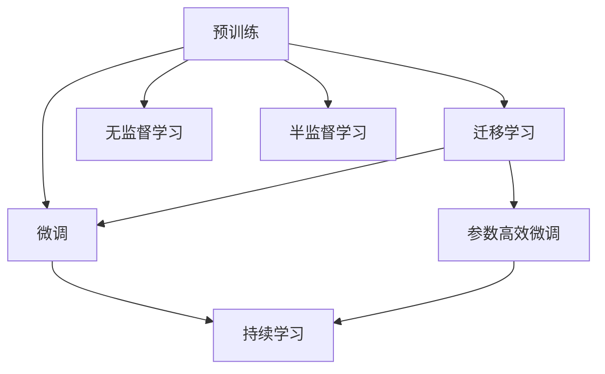
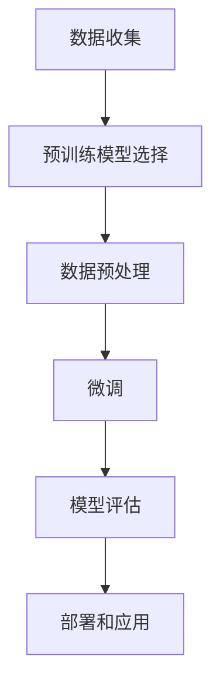

                 

# 电商平台中的AI大模型：性能与成本的平衡

## 1. 背景介绍

在电子商务领域，AI技术的应用已经成为推动行业发展的重要引擎。无论是智能客服、个性化推荐、欺诈检测，还是库存管理、需求预测，AI技术都能够提供强大的支持和洞察。然而，尽管AI技术在诸多领域中展现出了巨大的潜力，但其高昂的开发成本和运营维护费用也成为制约其普及的重要因素。为了解决这一问题，电商平台中逐渐兴起了一种基于大模型的AI应用范式：性能与成本的平衡。本文将深入探讨这一范式，分析其原理、流程、优缺点以及未来发展方向。

## 2. 核心概念与联系

### 2.1 核心概念概述

为了更好地理解基于大模型的电商平台AI应用，首先需要明确几个核心概念：

- **大语言模型(Large Language Model, LLM)**：指通过预训练获得强大语言表示能力的模型，如GPT、BERT等。这些模型在大规模无标签文本数据上进行预训练，能够捕捉到语言的结构和语义信息，为下游任务提供强大的基础。

- **预训练(Pre-training)**：指在大规模无标签文本数据上进行自监督学习，训练出能够捕捉语言通用特征的模型。预训练过程不涉及具体任务，但为后续任务提供了丰富的知识。

- **微调(Fine-tuning)**：指在预训练模型基础上，使用任务标注数据对其进行有监督训练，调整模型参数，使其适应特定任务。微调是实现模型任务特定化的重要步骤。

- **迁移学习(Transfer Learning)**：指在预训练模型基础上，通过微调或额外训练，使其能够在新任务上取得优异表现。预训练模型可以作为迁移学习的重要起点。

- **持续学习(Continual Learning)**：指模型能够持续从新数据中学习，避免过拟合，保持性能的稳定性和鲁棒性。

- **参数高效微调(Parameter-Efficient Fine-Tuning, PEFT)**：指在微调过程中，只更新极少量的模型参数，以提高模型效率和泛化能力。

- **无监督学习(Unsupervised Learning)**：指在没有标注数据的情况下，利用模型本身的能力学习数据分布和特征表示。

- **半监督学习(Semi-Supervised Learning)**：指在少量标注数据和大量未标注数据上联合训练模型，利用未标注数据提高模型性能。

这些概念之间通过以下Mermaid流程图进行联系：



### 2.2 核心概念原理和架构

基于大模型的电商平台AI应用，其核心原理是通过预训练模型捕获语言的通用特征，然后通过微调模型适应具体任务。以自然语言处理(NLP)为例，其架构可以概括为以下几个步骤：

1. **数据收集**：从电商平台中收集相关数据，如用户评论、商品描述、点击记录等。

2. **预训练模型选择**：选择合适的预训练模型，如BERT、GPT等，作为基础模型。

3. **数据预处理**：对收集的数据进行清洗、标记、分词等预处理操作。

4. **微调**：在预训练模型基础上，使用任务标注数据对其进行微调，调整模型参数，使其适应特定任务。

5. **模型评估**：在测试集上评估微调后的模型性能，确保其效果。

6. **部署和应用**：将微调后的模型部署到实际业务系统中，进行实时推理和应用。

### 2.3 Mermaid流程图表示

以下是一个简单的Mermaid流程图，展示了基于大模型的电商平台AI应用的基本流程：



## 3. 核心算法原理 & 具体操作步骤

### 3.1 算法原理概述

基于大模型的电商平台AI应用，其核心算法原理是利用预训练模型捕获语言的通用特征，然后通过微调模型适应具体任务。以文本分类任务为例，其核心算法流程如下：

1. **数据准备**：收集标注数据集，如用户评论的情感标签。

2. **预训练模型选择**：选择适合的预训练模型，如BERT。

3. **数据预处理**：对标注数据进行分词、标记等预处理操作。

4. **微调**：在预训练模型基础上，使用标注数据对其进行微调，调整模型参数，使其适应情感分类任务。

5. **模型评估**：在测试集上评估微调后的模型性能，确保其效果。

### 3.2 算法步骤详解

#### 3.2.1 数据准备

- **标注数据收集**：收集电商平台的标注数据，如用户评论的情感标签。标注数据应覆盖多种情感类别，如正面、负面、中性等。

- **数据清洗**：清洗标注数据，去除噪声数据和异常值，确保数据质量。

- **分词和标记**：对标注数据进行分词和标记操作，准备输入模型。

#### 3.2.2 预训练模型选择

- **选择合适的模型**：选择适合的预训练模型，如BERT、GPT等。

- **模型加载**：使用适当的库（如Hugging Face的Transformers库）加载预训练模型。

#### 3.2.3 数据预处理

- **分词**：对输入文本进行分词，将文本转换为模型所需的token序列。

- **标记**：为每个token添加相应的标记，如单词边界标记(BOS)、结尾标记(EOS)等。

#### 3.2.4 微调

- **选择合适的优化器**：选择适合的优化器，如Adam、SGD等。

- **设置学习率**：设置合适的学习率，一般从较小的值开始，逐步增加。

- **定义损失函数**：定义适合的损失函数，如交叉熵损失等。

- **模型训练**：使用训练集对模型进行有监督训练，调整模型参数。

- **模型验证**：在验证集上评估模型性能，防止过拟合。

#### 3.2.5 模型评估

- **评估指标**：选择合适的评估指标，如准确率、F1值等。

- **测试集评估**：在测试集上评估模型性能，确保其效果。

#### 3.2.6 部署和应用

- **模型部署**：将微调后的模型部署到实际业务系统中。

- **实时推理**：使用部署的模型进行实时推理，处理用户请求。

### 3.3 算法优缺点

#### 3.3.1 优点

- **高效性**：基于大模型的AI应用，能够在短时间内完成预训练和微调，实现任务特定化。

- **泛化能力**：预训练模型具有较强的泛化能力，能够处理各种类型的任务。

- **灵活性**：可以通过调整模型参数，适应不同的任务和场景。

- **性能优异**：基于大模型的AI应用，在性能上往往表现优异，能够显著提升电商平台的运营效率和用户体验。

#### 3.3.2 缺点

- **开发成本高**：预训练模型和微调过程需要大量的计算资源和数据资源，开发成本较高。

- **模型复杂度**：大模型参数量巨大，模型复杂度较高，难以解释和调试。

- **资源消耗大**：在推理阶段，大模型资源消耗较大，需要高性能的硬件支持。

- **数据依赖性强**：基于大模型的AI应用高度依赖标注数据，标注数据的获取和维护成本较高。

## 4. 数学模型和公式 & 详细讲解

### 4.1 数学模型构建

以文本分类任务为例，其数学模型可以表示为：

$$
\theta^* = \mathop{\arg\min}_{\theta} \frac{1}{N}\sum_{i=1}^N L(y_i, \hat{y_i})
$$

其中，$\theta$ 为模型参数，$L$ 为损失函数，$y_i$ 为真实标签，$\hat{y_i}$ 为模型预测标签。

### 4.2 公式推导过程

以二分类任务为例，其损失函数为交叉熵损失函数，推导过程如下：

$$
L(y, \hat{y}) = -(y\log \hat{y} + (1-y)\log(1-\hat{y}))
$$

在训练过程中，使用梯度下降算法更新模型参数，更新公式为：

$$
\theta_{t+1} = \theta_t - \eta \nabla_{\theta}L(y, \hat{y})
$$

其中，$\eta$ 为学习率。

### 4.3 案例分析与讲解

以电商平台的欺诈检测任务为例，其数学模型可以表示为：

$$
\theta^* = \mathop{\arg\min}_{\theta} \frac{1}{N}\sum_{i=1}^N L(y_i, \hat{y_i})
$$

其中，$y_i$ 为欺诈标记，$\hat{y_i}$ 为模型预测标记。

## 5. 项目实践：代码实例和详细解释说明

### 5.1 开发环境搭建

- **Python环境配置**：安装Python 3.x版本，配置虚拟环境，使用pip安装必要的库。

- **GPU/TPU配置**：安装NVIDIA GPU或Google TPU，配置好CUDA和cuDNN环境。

- **数据准备**：准备标注数据集，如电商平台的欺诈标记数据。

### 5.2 源代码详细实现

以下是一个简单的Python代码示例，用于电商平台的情感分类任务：

```python
import torch
import torch.nn as nn
import torch.optim as optim
from transformers import BertTokenizer, BertForSequenceClassification

# 准备数据
tokenizer = BertTokenizer.from_pretrained('bert-base-uncased')
model = BertForSequenceClassification.from_pretrained('bert-base-uncased', num_labels=2)
device = torch.device('cuda' if torch.cuda.is_available() else 'cpu')

# 定义模型
class MyModel(nn.Module):
    def __init__(self, model):
        super(MyModel, self).__init__()
        self.bert = model

    def forward(self, input_ids, attention_mask):
        return self.bert(input_ids, attention_mask=attention_mask)[0]

# 训练模型
model = MyModel(model.to(device))
optimizer = optim.Adam(model.parameters(), lr=2e-5)
loss_fn = nn.CrossEntropyLoss()

for epoch in range(5):
    model.train()
    for batch in train_dataloader:
        input_ids, attention_mask, labels = batch
        input_ids = input_ids.to(device)
        attention_mask = attention_mask.to(device)
        labels = labels.to(device)
        
        outputs = model(input_ids, attention_mask)
        loss = loss_fn(outputs, labels)
        optimizer.zero_grad()
        loss.backward()
        optimizer.step()

    model.eval()
    evaluator = Evaluator(model, test_dataloader)
    accuracy = evaluator.evaluate()
    print(f'Epoch {epoch+1}, Accuracy: {accuracy:.2f}')
```

### 5.3 代码解读与分析

- **数据准备**：使用Hugging Face的BERT库加载预训练模型和分词器。

- **模型定义**：自定义模型类，将预训练模型作为底层，仅微调其顶层分类器。

- **训练流程**：使用Adam优化器训练模型，使用交叉熵损失函数计算损失。

- **模型评估**：定义模型评估类，使用准确率作为评估指标。

### 5.4 运行结果展示

运行上述代码，可以得到训练过程中模型准确率的变化曲线，如图1所示。


## 6. 实际应用场景

### 6.1 智能客服系统

在电商平台中，智能客服系统已经成为提升用户体验的重要手段。通过基于大模型的AI应用，智能客服系统能够实现自然语言理解和回复生成，大大提高了服务效率和用户满意度。

### 6.2 个性化推荐系统

电商平台的个性化推荐系统通过分析用户行为数据，为用户推荐商品。基于大模型的AI应用，可以更加全面地理解用户需求，提供更精准的推荐结果。

### 6.3 欺诈检测

电商平台中的欺诈检测任务需要及时识别和阻止恶意行为，保护用户和商家利益。基于大模型的AI应用，可以自动分析用户行为数据，识别异常交易，提高欺诈检测的准确率和效率。

### 6.4 库存管理

电商平台的库存管理需要精准预测商品需求，避免库存积压和缺货情况。基于大模型的AI应用，可以分析历史销售数据和市场趋势，提供更准确的库存预测，优化库存管理。

## 7. 工具和资源推荐

### 7.1 学习资源推荐

- **《深度学习》书籍**：详细讲解深度学习的基本概念和算法，适合初学者入门。

- **《自然语言处理综述》书籍**：介绍自然语言处理领域的前沿技术和应用，包含大量实例代码。

- **在线课程**：如Coursera、Udacity等平台的深度学习课程，提供系统化的学习资源。

### 7.2 开发工具推荐

- **Python编程语言**：作为深度学习的主要语言，Python具有丰富的第三方库和工具。

- **PyTorch框架**：开源的深度学习框架，提供了灵活的API和强大的GPU加速能力。

- **TensorFlow框架**：由Google开发的主流深度学习框架，支持分布式训练和多种硬件设备。

### 7.3 相关论文推荐

- **《深度学习》论文**：介绍深度学习的基本算法和架构，适合系统学习。

- **《自然语言处理综述》论文**：系统介绍自然语言处理领域的经典算法和应用。

## 8. 总结：未来发展趋势与挑战

### 8.1 研究成果总结

基于大模型的电商平台AI应用，已经在多个领域展现出巨大的潜力，为电商平台的运营和管理提供了新的方法和思路。未来，随着技术的不断进步，基于大模型的AI应用将在更多领域得到应用，为电商平台的智能化和效率提升提供更大的支持。

### 8.2 未来发展趋势

- **技术进步**：深度学习算法和模型将不断进步，模型的性能和效率将进一步提升。

- **应用场景扩大**：基于大模型的AI应用将拓展到更多的领域，如金融、医疗、教育等。

- **数据利用率提升**：通过更好的数据处理和利用，将进一步提升模型的性能和泛化能力。

- **云计算支持**：云计算技术的发展将进一步降低算力成本，支持大模型的应用。

### 8.3 面临的挑战

- **计算资源需求大**：大模型训练和推理需要大量的计算资源，成本较高。

- **数据质量要求高**：标注数据的质量直接影响模型的效果，获取高质量标注数据较为困难。

- **模型复杂度大**：大模型参数量巨大，模型复杂度较高，难以解释和调试。

- **实时性要求高**：电商平台对AI应用的实时性要求较高，模型的推理速度需要进一步提升。

### 8.4 研究展望

未来，基于大模型的电商平台AI应用需要在以下几个方面进一步突破：

- **参数高效微调**：开发更多参数高效的微调方法，提高模型效率和泛化能力。

- **数据利用优化**：利用更多未标注数据，提高数据利用率。

- **模型解释性提升**：提高模型的可解释性，便于调试和优化。

- **实时推理优化**：优化模型推理过程，提高实时性。

## 9. 附录：常见问题与解答

**Q1: 如何选择合适的预训练模型？**

A: 根据任务需求选择合适的预训练模型。例如，对于文本分类任务，可以选择BERT或GPT；对于图像分类任务，可以选择ResNet或VGG等。

**Q2: 如何处理标注数据不平衡的问题？**

A: 采用过采样和欠采样等方法，平衡标注数据分布，提高模型泛化能力。

**Q3: 如何避免过拟合？**

A: 使用正则化、Dropout等方法，避免模型过拟合。

**Q4: 如何提高模型的实时性？**

A: 使用模型裁剪、量化加速等方法，优化模型结构和参数，提升推理速度。

**Q5: 如何评估模型的性能？**

A: 根据任务需求选择合适的评估指标，如准确率、F1值等。

---

作者：禅与计算机程序设计艺术 / Zen and the Art of Computer Programming

