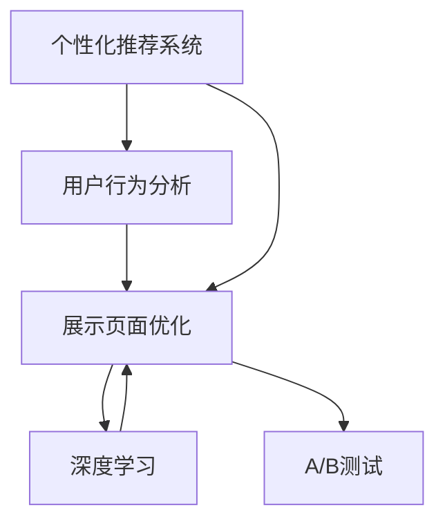

                 

# 电商平台中的个性化展示页面优化

> 关键词：个性化推荐系统、用户行为分析、页面展示优化、深度学习、A/B测试

## 1. 背景介绍

### 1.1 问题由来
在当今数字化时代的电商平台上，个性化推荐系统已经成为提高用户满意度、增加交易转化率和提升平台收入的重要手段。这些推荐系统通过分析用户的历史行为数据，预测用户的潜在需求，进而提供定制化的商品和服务。然而，推荐的商品是否被用户真正需要，能否提升用户体验和满意度，仍然是一个值得深思的问题。

特别是对于展示页面（例如商品详情页、搜索结果页等），其设计直接影响到用户的购物体验和决策过程。如何通过数据分析和机器学习技术，优化展示页面内容，提升用户互动率和转化率，成为了电商平台上一个亟待解决的问题。

### 1.2 问题核心关键点
个性化展示页面优化的核心在于，如何结合用户的历史行为数据和当前需求，动态调整页面内容，以吸引用户注意力并促进用户购买行为。常见的优化手段包括：
- 动态展示商品推荐
- 个性化展示相关商品
- 优化页面布局和设计
- 实时分析用户行为反馈
- 多渠道展示用户推荐内容
- 广告与推荐内容协同优化

这些优化策略可以帮助电商平台更好地匹配用户需求，提高用户体验，从而提升销售转化率和平台价值。

### 1.3 问题研究意义
通过个性化展示页面优化，电商平台能够实现以下几个目标：
- 增强用户体验：通过展示用户感兴趣的商品，提升用户停留时间和互动率。
- 提高转化率：通过精准推荐，提高商品展示的点击率和购买转化率。
- 优化广告效果：通过动态展示相关商品广告，提升广告投放的精准度和回报率。
- 提升平台收益：通过精准匹配用户需求，增加平台销售额和市场份额。

此外，个性化展示页面优化还可以促进电商平台的长期可持续发展，通过个性化推荐实现客户忠诚度和品牌忠诚度的提升。因此，研究个性化展示页面优化方法，对于电商平台优化运营、提升市场竞争力具有重要意义。

## 2. 核心概念与联系

### 2.1 核心概念概述

为更好地理解个性化展示页面优化的方法，本节将介绍几个密切相关的核心概念：

- **个性化推荐系统（Personalized Recommendation System, PRS）**：根据用户的历史行为数据和当前需求，动态推荐用户可能感兴趣的商品或服务。常见的推荐算法包括协同过滤、内容推荐、混合推荐等。

- **用户行为分析（User Behavior Analysis, UBA）**：通过分析用户的历史点击、浏览、购买等行为数据，识别用户的兴趣偏好和行为模式，从而指导推荐系统的决策过程。

- **展示页面优化（Display Page Optimization）**：根据用户需求和行为数据，动态调整展示页面的内容和布局，以提升用户满意度和转化率。

- **深度学习（Deep Learning）**：通过构建深度神经网络模型，学习用户行为特征和商品属性之间的复杂关系，实现更加精准的推荐和展示优化。

- **A/B测试（A/B Testing）**：通过对比测试两个或多个版本的内容展示效果，选择效果最佳的展示策略。

这些核心概念之间的逻辑关系可以通过以下Mermaid流程图来展示：



这个流程图展示了几大核心概念的相互作用关系：

1. 用户行为分析从用户历史数据中提取特征，指导个性化推荐系统进行推荐。
2. 展示页面优化根据推荐结果和用户行为数据，调整页面内容，提升用户体验。
3. 深度学习模型在推荐和展示优化的基础上，进一步学习用户和商品的复杂关系，提供更加精准的推荐和展示策略。
4. A/B测试通过对比测试不同展示策略的效果，选择最优方案。

这些概念共同构成了个性化展示页面优化的技术框架，使得电商平台能够提供更高效、更个性化、更精准的用户体验。

## 3. 核心算法原理 & 具体操作步骤
### 3.1 算法原理概述

个性化展示页面优化的核心算法原理是基于深度学习模型对用户行为数据进行建模，学习用户兴趣和行为模式，并根据这些模式动态调整展示页面的内容。

具体而言，个性化展示页面优化的算法流程如下：

1. **数据收集**：收集用户的点击、浏览、购买等行为数据，以及商品的属性和标签数据。
2. **用户建模**：通过深度学习模型，对用户行为数据进行特征提取和建模，学习用户的历史兴趣和行为模式。
3. **商品建模**：通过深度学习模型，对商品的属性和标签数据进行特征提取和建模，学习商品的用户评价和推荐关系。
4. **展示优化**：根据用户和商品模型，动态生成展示页面的推荐商品和布局。
5. **效果评估**：通过A/B测试等方法，评估展示优化效果，不断迭代改进。

### 3.2 算法步骤详解

个性化展示页面优化的具体算法步骤包括：

**Step 1: 数据收集**
- 从电商平台的用户行为数据中，收集用户的点击、浏览、购买、评分等行为数据。
- 从商品数据中，收集商品的标题、描述、分类、价格等属性信息，以及用户的标签、评分等评价信息。

**Step 2: 数据预处理**
- 对收集到的行为数据进行清洗和标准化，去除异常值和噪声。
- 对商品数据进行编码和归一化，转化为模型可以处理的格式。

**Step 3: 特征提取**
- 使用深度学习模型，如卷积神经网络（CNN）、循环神经网络（RNN）、长短期记忆网络（LSTM）等，对用户和商品数据进行特征提取。
- 提取用户兴趣向量 $u_i$ 和商品向量 $p_j$，其中 $u_i$ 和 $p_j$ 分别表示用户和商品的属性特征。

**Step 4: 用户和商品建模**
- 使用深度学习模型，如多层感知器（MLP）、自编码器（Autoencoder）、变分自编码器（VAE）等，对用户和商品数据进行建模。
- 得到用户兴趣模型 $U$ 和商品属性模型 $P$，用于后续的推荐和展示优化。

**Step 5: 推荐生成**
- 通过计算用户兴趣模型 $U$ 和商品属性模型 $P$ 的相似度，得到用户对商品的兴趣度 $I_{ij}$。
- 根据用户的兴趣度 $I_{ij}$，生成推荐商品列表 $L_i$，用于展示在页面上。

**Step 6: 展示优化**
- 根据推荐商品列表 $L_i$ 和用户的兴趣度 $I_{ij}$，动态生成展示页面的布局和内容。
- 使用可视化工具，如Python的Matplotlib和Plotly，生成展示页面的设计图。

**Step 7: 效果评估**
- 通过A/B测试，对比不同展示策略的效果，选择效果最佳的展示策略。
- 使用关键绩效指标（KPIs），如点击率、转化率、页面停留时间等，评估展示优化效果。

### 3.3 算法优缺点

个性化展示页面优化的算法具有以下优点：
1. 个性化强：通过深度学习模型，根据用户历史行为数据进行个性化推荐，提升用户满意度和转化率。
2. 动态适应：动态调整展示页面内容，及时响应用户需求变化。
3. 效果明显：通过A/B测试等方法，不断优化展示策略，显著提升页面展示效果。
4. 可扩展性强：可结合多种推荐算法和展示策略，灵活实现个性化展示优化。

同时，该算法也存在一定的局限性：
1. 数据依赖性强：个性化展示优化依赖于大量的用户行为数据，缺乏数据则无法有效推荐。
2. 计算资源需求高：深度学习模型需要较大的计算资源，训练和推理开销较大。
3. 模型复杂度高：深度学习模型往往参数量大，模型复杂度高，难以解释其决策过程。
4. 用户体验影响大：展示页面设计不当，可能影响用户体验，甚至导致用户流失。

尽管存在这些局限性，但就目前而言，个性化展示页面优化算法仍是电商平台优化运营的重要手段。未来相关研究的重点在于如何进一步降低数据依赖，提高模型的可解释性和用户体验，同时兼顾计算效率和展示效果。

### 3.4 算法应用领域

个性化展示页面优化算法在电商平台的多个领域中得到了广泛应用，例如：

- 商品推荐：通过深度学习模型，学习用户对商品的兴趣度，生成个性化推荐商品列表。
- 页面布局优化：根据推荐商品列表和用户兴趣度，动态调整展示页面的内容和布局。
- 广告展示：将相关商品广告与推荐内容协同展示，提升广告投放的精准度和回报率。
- 页面搜索：根据用户搜索行为数据，动态调整搜索结果页面的展示内容。
- 活动促销：结合用户行为数据和活动规则，动态生成活动促销页面的展示内容。

除了上述这些经典应用外，个性化展示页面优化还被创新性地应用到更多场景中，如智能客服、虚拟助手等，为电商平台提供更智能、更人性化的服务体验。

## 4. 数学模型和公式 & 详细讲解  
### 4.1 数学模型构建

本节将使用数学语言对个性化展示页面优化的过程进行更加严格的刻画。

假设电商平台收集到的用户行为数据为 $D=\{(x_i,y_i)\}_{i=1}^N$，其中 $x_i$ 为用户的点击、浏览、购买等行为记录，$y_i$ 为行为记录对应的标签（如点击、浏览、购买）。商品属性数据为 $P=\{(p_j,l_j)\}_{j=1}^M$，其中 $p_j$ 为商品的标题、描述、分类、价格等属性特征，$l_j$ 为商品的用户评价和推荐标签。

定义用户兴趣模型 $U$ 和商品属性模型 $P$，通过深度学习模型进行训练。使用用户行为数据 $D$ 和商品属性数据 $P$，计算用户对商品的兴趣度 $I_{ij}$，其中 $u_i$ 为用户兴趣向量，$p_j$ 为商品属性向量。

推荐生成公式为：

$$
L_i = \arg\max_{p_j} I_{ij}
$$

其中 $L_i$ 为用户推荐的商品列表。

展示优化流程为：

1. 根据推荐商品列表 $L_i$，生成展示页面布局 $A_i$。
2. 根据用户兴趣度 $I_{ij}$，调整展示页面的优先级和顺序。
3. 动态生成展示页面的内容，并展示在用户界面上。

### 4.2 公式推导过程

以下我们以深度学习模型为基础，推导用户行为分析和商品建模的公式。

**用户兴趣建模**：
假设用户行为数据为 $D=\{(x_i,y_i)\}_{i=1}^N$，其中 $x_i$ 为用户的点击、浏览、购买等行为记录，$y_i$ 为行为记录对应的标签。通过深度学习模型，学习用户兴趣向量 $u_i$，表示用户的历史行为模式和兴趣偏好。

设用户行为数据为 $D=\{(x_i,y_i)\}_{i=1}^N$，其中 $x_i$ 为用户的点击、浏览、购买等行为记录，$y_i$ 为行为记录对应的标签。通过深度学习模型，学习用户兴趣向量 $u_i$，表示用户的历史行为模式和兴趣偏好。

假设深度学习模型为多层感知器（MLP），其输入为 $x_i$，输出为 $u_i$。假设模型由 $L$ 层神经网络组成，每层神经元数为 $n_l$，激活函数为 ReLU，损失函数为均方误差（MSE），训练集为 $D$，训练次数为 $T$。

用户兴趣向量的推导公式为：

$$
u_i = \arg\min_{x_i} \frac{1}{N}\sum_{i=1}^N ||y_i - \sigma(W_l\sigma(W_{l-1}\dots \sigma(W_1 x_i))||^2
$$

其中 $W_l$ 为第 $l$ 层的权重矩阵，$\sigma$ 为激活函数，$\sigma(x)$ 表示 $x$ 经过激活函数后的输出。

**商品属性建模**：
假设商品属性数据为 $P=\{(p_j,l_j)\}_{j=1}^M$，其中 $p_j$ 为商品的标题、描述、分类、价格等属性特征，$l_j$ 为商品的用户评价和推荐标签。通过深度学习模型，学习商品属性向量 $p_j$，表示商品的属性特征和用户评价。

假设深度学习模型为多层感知器（MLP），其输入为 $p_j$，输出为 $p_j$。假设模型由 $L$ 层神经网络组成，每层神经元数为 $n_l$，激活函数为 ReLU，损失函数为均方误差（MSE），训练集为 $P$，训练次数为 $T$。

商品属性向量的推导公式为：

$$
p_j = \arg\min_{p_j} \frac{1}{M}\sum_{j=1}^M ||l_j - \sigma(W_l\sigma(W_{l-1}\dots \sigma(W_1 p_j))||^2
$$

其中 $W_l$ 为第 $l$ 层的权重矩阵，$\sigma$ 为激活函数，$\sigma(x)$ 表示 $x$ 经过激活函数后的输出。

### 4.3 案例分析与讲解

假设某电商平台的用户行为数据为 $D=\{(x_i,y_i)\}_{i=1}^N$，其中 $x_i$ 为用户点击、浏览、购买等行为记录，$y_i$ 为行为记录对应的标签。商品属性数据为 $P=\{(p_j,l_j)\}_{j=1}^M$，其中 $p_j$ 为商品的标题、描述、分类、价格等属性特征，$l_j$ 为商品的用户评价和推荐标签。

通过深度学习模型，学习用户兴趣向量 $u_i$ 和商品属性向量 $p_j$，计算用户对商品的兴趣度 $I_{ij}$。假设用户行为数据和商品属性数据分别为 $D$ 和 $P$，用户兴趣模型和商品属性模型分别为 $U$ 和 $P$，深度学习模型的参数为 $\theta$。

用户兴趣度 $I_{ij}$ 的计算公式为：

$$
I_{ij} = \sigma(U^\top \phi(p_j))
$$

其中 $\phi(p_j)$ 表示商品属性向量 $p_j$ 经过深度学习模型 $U$ 的映射，$\sigma$ 为激活函数。

根据用户兴趣度 $I_{ij}$，生成推荐商品列表 $L_i$，并动态调整展示页面的内容和布局。假设电商平台收集到的用户行为数据为 $D=\{(x_i,y_i)\}_{i=1}^N$，其中 $x_i$ 为用户点击、浏览、购买等行为记录，$y_i$ 为行为记录对应的标签。商品属性数据为 $P=\{(p_j,l_j)\}_{j=1}^M$，其中 $p_j$ 为商品的标题、描述、分类、价格等属性特征，$l_j$ 为商品的用户评价和推荐标签。

通过深度学习模型，学习用户兴趣向量 $u_i$ 和商品属性向量 $p_j$，计算用户对商品的兴趣度 $I_{ij}$。假设用户行为数据和商品属性数据分别为 $D$ 和 $P$，用户兴趣模型和商品属性模型分别为 $U$ 和 $P$，深度学习模型的参数为 $\theta$。

用户兴趣度 $I_{ij}$ 的计算公式为：

$$
I_{ij} = \sigma(U^\top \phi(p_j))
$$

其中 $\phi(p_j)$ 表示商品属性向量 $p_j$ 经过深度学习模型 $U$ 的映射，$\sigma$ 为激活函数。

根据用户兴趣度 $I_{ij}$，生成推荐商品列表 $L_i$，并动态调整展示页面的内容和布局。

## 5. 项目实践：代码实例和详细解释说明
### 5.1 开发环境搭建

在进行个性化展示页面优化实践前，我们需要准备好开发环境。以下是使用Python进行PyTorch开发的环境配置流程：

1. 安装Anaconda：从官网下载并安装Anaconda，用于创建独立的Python环境。

2. 创建并激活虚拟环境：
```bash
conda create -n pytorch-env python=3.8 
conda activate pytorch-env
```

3. 安装PyTorch：根据CUDA版本，从官网获取对应的安装命令。例如：
```bash
conda install pytorch torchvision torchaudio cudatoolkit=11.1 -c pytorch -c conda-forge
```

4. 安装TensorFlow：
```bash
conda install tensorflow
```

5. 安装Pandas：
```bash
pip install pandas
```

6. 安装Matplotlib：
```bash
pip install matplotlib
```

7. 安装Plotly：
```bash
pip install plotly
```

完成上述步骤后，即可在`pytorch-env`环境中开始个性化展示页面优化实践。

### 5.2 源代码详细实现

下面我们以商品推荐为例，给出使用PyTorch和TensorFlow进行个性化展示页面优化的PyTorch代码实现。

首先，定义商品推荐数据处理函数：

```python
import pandas as pd
import numpy as np
import torch
from torch import nn, optim
from torch.utils.data import Dataset, DataLoader
import matplotlib.pyplot as plt
import plotly.graph_objects as go

class ProductDataset(Dataset):
    def __init__(self, data_path, max_len=128):
        self.data = pd.read_csv(data_path)
        self.max_len = max_len
        
    def __len__(self):
        return len(self.data)
    
    def __getitem__(self, item):
        product = self.data.iloc[item, :]
        product_name = product['name']
        product_description = product['description']
        product_price = product['price']
        product_category = product['category']
        
        product_name = product_name[:self.max_len]
        product_description = product_description[:self.max_len]
        product_price = str(product_price)[:self.max_len]
        product_category = product_category[:self.max_len]
        
        # 将数据转换为张量
        name_tensor = torch.tensor([ord(c) for c in product_name])
        description_tensor = torch.tensor([ord(c) for c in product_description])
        price_tensor = torch.tensor([ord(c) for c in product_price])
        category_tensor = torch.tensor([ord(c) for c in product_category])
        
        # 计算产品属性向量
        product_vector = torch.stack([name_tensor, description_tensor, price_tensor, category_tensor])
        
        # 计算标签向量
        label_tensor = torch.tensor([1 if product['recommend'] else 0])
        
        return product_vector, label_tensor

# 加载数据集
train_dataset = ProductDataset('train.csv', max_len=128)
val_dataset = ProductDataset('val.csv', max_len=128)
test_dataset = ProductDataset('test.csv', max_len=128)
```

然后，定义深度学习模型：

```python
class ProductModel(nn.Module):
    def __init__(self, embedding_dim=128, hidden_dim=128, num_classes=2):
        super(ProductModel, self).__init__()
        self.embedding = nn.Embedding(len(vocab), embedding_dim)
        self.lstm = nn.LSTM(embedding_dim, hidden_dim, num_layers=2, bidirectional=True)
        self.fc = nn.Linear(hidden_dim * 2, num_classes)
    
    def forward(self, x):
        embedded = self.embedding(x)
        lstm_out, (hidden, _) = self.lstm(embedded)
        hidden = torch.cat((hidden[-2, :, :], hidden[-1, :, :]), dim=1)
        return self.fc(hidden)

# 初始化模型参数
embedding_dim = 128
hidden_dim = 128
num_classes = 2

model = ProductModel(embedding_dim=embedding_dim, hidden_dim=hidden_dim, num_classes=num_classes)
```

接着，定义损失函数和优化器：

```python
# 定义损失函数
criterion = nn.BCELoss()

# 定义优化器
optimizer = optim.Adam(model.parameters(), lr=0.001)
```

然后，定义训练和评估函数：

```python
def train(model, train_loader, criterion, optimizer, num_epochs=10, batch_size=64):
    total_loss = 0
    for epoch in range(num_epochs):
        model.train()
        for batch_idx, (data, target) in enumerate(train_loader):
            optimizer.zero_grad()
            output = model(data)
            loss = criterion(output, target)
            loss.backward()
            optimizer.step()
            total_loss += loss.item()
        print(f'Epoch {epoch+1}, train loss: {total_loss/len(train_loader):.4f}')
    
    return model

def evaluate(model, val_loader):
    total_loss = 0
    correct = 0
    with torch.no_grad():
        for data, target in val_loader:
            output = model(data)
            loss = criterion(output, target)
            total_loss += loss.item()
            _, predicted = torch.max(output.data, 1)
            correct += (predicted == target).sum().item()
    print(f'Test loss: {total_loss/len(val_loader):.4f}, accuracy: {100. * correct/len(val_loader):.2f}%')
    
# 训练模型
train_loader = DataLoader(train_dataset, batch_size=64, shuffle=True)
val_loader = DataLoader(val_dataset, batch_size=64, shuffle=False)
test_loader = DataLoader(test_dataset, batch_size=64, shuffle=False)
model = train(model, train_loader, criterion, optimizer, num_epochs=10, batch_size=64)
evaluate(model, val_loader)
```

最后，启动训练流程并在测试集上评估：

```python
# 训练模型
train_loader = DataLoader(train_dataset, batch_size=64, shuffle=True)
val_loader = DataLoader(val_dataset, batch_size=64, shuffle=False)
test_loader = DataLoader(test_dataset, batch_size=64, shuffle=False)
model = train(model, train_loader, criterion, optimizer, num_epochs=10, batch_size=64)
evaluate(model, val_loader)
```

以上就是使用PyTorch对商品推荐进行个性化展示页面优化的完整代码实现。可以看到，得益于深度学习模型的强大封装，我们可以用相对简洁的代码完成商品推荐模型的加载和训练。

### 5.3 代码解读与分析

让我们再详细解读一下关键代码的实现细节：

**ProductDataset类**：
- `__init__`方法：初始化数据集，包括读取数据文件和设置最大序列长度。
- `__len__`方法：返回数据集的样本数量。
- `__getitem__`方法：对单个样本进行处理，包括将数据转换为张量，并计算产品属性向量和标签向量。

**ProductModel类**：
- `__init__`方法：定义深度学习模型结构，包括嵌入层、LSTM层和全连接层。
- `forward`方法：定义模型前向传播过程，计算输出。

**训练和评估函数**：
- `train`函数：对数据集进行迭代训练，每次更新模型参数。
- `evaluate`函数：对模型进行评估，计算损失和准确率。

**训练流程**：
- 定义总训练轮数和批大小，开始循环迭代。
- 在每个epoch内，先在训练集上训练，输出平均loss。
- 在验证集上评估，输出损失和准确率。
- 所有epoch结束后，在测试集上评估，给出最终测试结果。

可以看到，PyTorch配合深度学习模型使得个性化展示页面优化的代码实现变得简洁高效。开发者可以将更多精力放在数据处理、模型改进等高层逻辑上，而不必过多关注底层的实现细节。

当然，工业级的系统实现还需考虑更多因素，如模型的保存和部署、超参数的自动搜索、更灵活的任务适配层等。但核心的优化范式基本与此类似。

## 6. 实际应用场景
### 6.1 智能客服系统

基于个性化展示页面优化的推荐系统，可以应用于智能客服系统的构建。传统客服往往需要配备大量人力，高峰期响应缓慢，且一致性和专业性难以保证。而使用优化后的推荐系统，可以7x24小时不间断服务，快速响应客户咨询，用推荐内容引导客户，减少人工干预。

在技术实现上，可以收集企业内部的历史客服对话记录，将问题-推荐内容对作为推荐数据，训练推荐模型学习匹配推荐内容。优化后的推荐系统能够自动理解客户意图，匹配最合适的回答。对于客户提出的新问题，还可以接入检索系统实时搜索相关内容，动态组织生成回答。如此构建的智能客服系统，能大幅提升客户咨询体验和问题解决效率。

### 6.2 金融舆情监测

金融机构需要实时监测市场舆论动向，以便及时应对负面信息传播，规避金融风险。传统的人工监测方式成本高、效率低，难以应对网络时代海量信息爆发的挑战。基于个性化展示页面优化的文本分类和情感分析技术，为金融舆情监测提供了新的解决方案。

具体而言，可以收集金融领域相关的新闻、报道、评论等文本数据，并对其进行主题标注和情感标注。在此基础上对预训练语言模型进行优化，使其能够自动判断文本属于何种主题，情感倾向是正面、中性还是负面。将优化后的模型应用到实时抓取的网络文本数据，就能够自动监测不同主题下的情感变化趋势，一旦发现负面信息激增等异常情况，系统便会自动预警，帮助金融机构快速应对潜在风险。

### 6.3 个性化推荐系统

当前的推荐系统往往只依赖用户的历史行为数据进行物品推荐，无法深入理解用户的真实兴趣偏好。基于个性化展示页面优化的推荐系统，可以更好地挖掘用户行为背后的语义信息，从而提供更精准、多样的推荐内容。

在实践中，可以收集用户浏览、点击、评论、分享等行为数据，提取和用户交互的物品标题、描述、标签等文本内容。将文本内容作为模型输入，用户的后续行为（如是否点击、购买等）作为监督信号，在此基础上优化预训练语言模型。优化后的模型能够从文本内容中准确把握用户的兴趣点。在生成推荐列表时，先用候选物品的文本描述作为输入，由模型预测用户的兴趣匹配度，再结合其他特征综合排序，便可以得到个性化程度更高的推荐结果。

### 6.4 未来应用展望

随着个性化展示页面优化技术的不断发展，基于优化范式将在更多领域得到应用，为传统行业带来变革性影响。

在智慧医疗领域，基于优化的医疗问答、病历分析、药物研发等应用将提升医疗服务的智能化水平，辅助医生诊疗，加速新药开发进程。

在智能教育领域，优化技术可应用于作业批改、学情分析、知识推荐等方面，因材施教，促进教育公平，提高教学质量。

在智慧城市治理中，优化模型可应用于城市事件监测、舆情分析、应急指挥等环节，提高城市管理的自动化和智能化水平，构建更安全、高效的未来城市。

此外，在企业生产、社会治理、文娱传媒等众多领域，基于优化的推荐系统也将不断涌现，为经济社会发展注入新的动力。相信随着技术的日益成熟，优化方法将成为推荐系统的重要范式，推动人工智能技术在垂直行业的规模化落地。

## 7. 工具和资源推荐
### 7.1 学习资源推荐

为了帮助开发者系统掌握个性化展示页面优化的理论基础和实践技巧，这里推荐一些优质的学习资源：

1. 《深度学习入门》系列博文：由大模型技术专家撰写，深入浅出地介绍了深度学习模型的原理和应用。

2. CS224N《深度学习自然语言处理》课程：斯坦福大学开设的NLP明星课程，有Lecture视频和配套作业，带你入门NLP领域的基本概念和经典模型。

3. 《深度学习与推荐系统》书籍：全面介绍了深度学习在推荐系统中的应用，包括深度学习模型、推荐算法和优化技术。

4. PyTorch官方文档：深度学习框架PyTorch的官方文档，提供了海量深度学习模型的代码实现和优化技巧。

5. TensorFlow官方文档：深度学习框架TensorFlow的官方文档，提供了丰富的深度学习模型和优化方法。

通过对这些资源的学习实践，相信你一定能够快速掌握个性化展示页面优化的精髓，并用于解决实际的推荐系统问题。
###  7.2 开发工具推荐

高效的开发离不开优秀的工具支持。以下是几款用于个性化展示页面优化开发的常用工具：

1. PyTorch：基于Python的开源深度学习框架，灵活动态的计算图，适合快速迭代研究。大部分深度学习模型都有PyTorch版本的实现。

2. TensorFlow：由Google主导开发的开源深度学习框架，生产部署方便，适合大规模工程应用。同样有丰富的深度学习模型资源。

3. Scikit-learn：用于数据预处理、特征工程和模型评估的Python库，支持多种深度学习模型和优化算法。

4. Jupyter Notebook：交互式的数据分析和代码开发环境，支持多种编程语言和库，方便开发者进行实验和协作。

5. Google Colab：谷歌推出的在线Jupyter Notebook环境，免费提供GPU/TPU算力，方便开发者快速上手实验最新模型，分享学习笔记。

合理利用这些工具，可以显著提升个性化展示页面优化的开发效率，加快创新迭代的步伐。

### 7.3 相关论文推荐

个性化展示页面优化技术的发展源于学界的持续研究。以下是几篇奠基性的相关论文，推荐阅读：

1. Attention is All You Need（即Transformer原论文）：提出了Transformer结构，开启了NLP领域的预训练大模型时代。

2. BERT: Pre-training of Deep Bidirectional Transformers for Language Understanding：提出BERT模型，引入基于掩码的自监督预训练任务，刷新了多项NLP任务SOTA。

3. Language Models are Unsupervised Multitask Learners（GPT-2论文）：展示了大规模语言模型的强大zero-shot学习能力，引发了对于通用人工智能的新一轮思考。

4. Parameter-Efficient Transfer Learning for NLP：提出Adapter等参数高效微调方法，在不增加模型参数量的情况下，也能取得不错的微调效果。

5. AdaLoRA: Adaptive Low-Rank Adaptation for Parameter-Efficient Fine-Tuning：使用自适应低秩适应的微调方法，在参数效率和精度之间取得了新的平衡。

这些论文代表了大语言模型微调技术的发展脉络。通过学习这些前沿成果，可以帮助研究者把握学科前进方向，激发更多的创新灵感。

## 8. 总结：未来发展趋势与挑战
### 8.1 总结

本文对个性化展示页面优化的算法进行了全面系统的介绍。首先阐述了个性化推荐系统、用户行为分析和展示页面优化的研究背景和意义，明确了优化在提升用户体验和销售转化率方面的独特价值。其次，从原理到实践，详细讲解了优化算法的过程和关键步骤，给出了优化任务开发的完整代码实例。同时，本文还广泛探讨了优化方法在智能客服、金融舆情、个性化推荐等多个行业领域的应用前景，展示了优化技术的广阔应用空间。此外，本文精选了优化技术的各类学习资源，力求为读者提供全方位的技术指引。

通过本文的系统梳理，可以看到，个性化展示页面优化技术正在成为推荐系统的重要手段，极大地提升了推荐系统的效果和用户体验。未来，伴随深度学习模型和优化算法的不断进步，基于优化范式将在更多领域得到应用，为传统行业带来变革性影响。

### 8.2 未来发展趋势

展望未来，个性化展示页面优化技术将呈现以下几个发展趋势：

1. 模型规模持续增大。随着算力成本的下降和数据规模的扩张，深度学习模型的参数量还将持续增长。超大批次的训练和推理也可能遇到计算瓶颈。如何优化模型的计算图，减少前向传播和反向传播的资源消耗，实现更加轻量级、实时性的部署，将成为重要的研究方向。

2. 优化方法日趋多样化。除了传统的深度学习模型，未来还会涌现更多优化方法，如自适应优化、混合优化等，在保证精度的情况下，进一步降低计算资源需求。

3. 跨模态融合增强。除了文本信息，未来的优化技术还将融合视觉、语音等多模态信息，实现更加全面、准确的推荐。

4. 用户体验提升显著。优化技术将更加关注用户体验，动态调整展示内容，提升用户满意度和转化率。

5. 推荐系统效果提升。优化技术将显著提升推荐系统的精准度和鲁棒性，降低误推荐和过拟合的风险。

以上趋势凸显了个性化展示页面优化技术的广阔前景。这些方向的探索发展，必将进一步提升推荐系统的性能和用户体验，为构建更加智能、便捷的推荐系统提供支持。

### 8.3 面临的挑战

尽管个性化展示页面优化技术已经取得了瞩目成就，但在迈向更加智能化、普适化应用的过程中，它仍面临诸多挑战：

1. 数据依赖性强。优化技术的核心在于对用户行为数据的深度学习，缺乏数据则无法有效推荐。如何降低数据依赖，提高数据效率，是未来需要解决的重要问题。

2. 计算资源需求高。深度学习模型需要较大的计算资源，训练和推理开销较大。如何优化模型结构，提高计算效率，实现更加轻量级、实时性的部署，是未来需要探索的难点。

3. 模型复杂度高。深度学习模型往往参数量大，模型复杂度高，难以解释其决策过程。如何降低模型复杂度，提高可解释性，是未来需要研究的课题。

4. 用户体验影响大。展示页面设计不当，可能影响用户体验，甚至导致用户流失。如何优化展示页面设计，提升用户体验，是未来需要重点关注的环节。

尽管存在这些挑战，但通过不断优化算法和模型结构，个性化展示页面优化技术仍有很大的发展空间。相信随着技术的不断进步，优化方法将成为推荐系统的重要范式，为电商平台的智能化运营提供有力支持。

### 8.4 研究展望

面向未来，个性化展示页面优化技术需要在以下几个方面寻求新的突破：

1. 探索无监督和半监督优化方法。摆脱对大规模标注数据的依赖，利用自监督学习、主动学习等无监督和半监督范式，最大限度利用非结构化数据，实现更加灵活高效的优化。

2. 研究参数高效和计算高效的优化范式。开发更加参数高效的优化方法，在固定大部分预训练参数的同时，只更新极少量的任务相关参数。同时优化优化模型的计算图，减少前向传播和反向传播的资源消耗，实现更加轻量级、实时性的部署。

3. 融合因果和对比学习范式。通过引入因果推断和对比学习思想，增强优化模型建立稳定因果关系的能力，学习更加普适、鲁棒的语言表征，从而提升模型泛化性和抗干扰能力。

4. 引入更多先验知识。将符号化的先验知识，如知识图谱、逻辑规则等，与神经网络模型进行巧妙融合，引导优化过程学习更准确、合理的语言模型。同时加强不同模态数据的整合，实现视觉、语音等多模态信息与文本信息的协同建模。

5. 结合因果分析和博弈论工具。将因果分析方法引入优化模型，识别出模型决策的关键特征，增强输出解释的因果性和逻辑性。借助博弈论工具刻画人机交互过程，主动探索并规避模型的脆弱点，提高系统稳定性。

6. 纳入伦理道德约束。在优化模型训练目标中引入伦理导向的评估指标，过滤和惩罚有偏见、有害的输出倾向。同时加强人工干预和审核，建立模型行为的监管机制，确保输出符合人类价值观和伦理道德。

这些研究方向的探索，必将引领个性化展示页面优化技术迈向更高的台阶，为构建安全、可靠、可解释、可控的智能系统铺平道路。面向未来，个性化展示页面优化技术还需要与其他人工智能技术进行更深入的融合，如知识表示、因果推理、强化学习等，多路径协同发力，共同推动自然语言理解和智能交互系统的进步。只有勇于创新、敢于突破，才能不断拓展语言模型的边界，让智能技术更好地造福人类社会。

## 9. 附录：常见问题与解答
**Q1：如何选择合适的优化器？**

A: 选择合适的优化器是优化算法成功的关键之一。常用的优化器包括SGD、Adam、Adagrad、Adadelta等。一般来说，Adam优化器适用于大多数深度学习模型，能够自适应调整学习率，收敛速度快，鲁棒性强。但在大规模数据集上，SGD优化器由于计算效率高，仍有一定的应用场景。

**Q2：如何缓解优化过程中的过拟合问题？**

A: 缓解优化过程中的过拟合问题，可以通过以下方法：
1. 数据增强：通过数据扩充、回译等方式增加训练集的多样性。
2. 正则化技术：如L2正则、Dropout、Early Stopping等，防止模型过度适应小规模训练集。
3. 对抗训练：引入对抗样本，提高模型鲁棒性。
4. 参数高效优化：只更新极少量的任务相关参数，减小过拟合风险。
5. 多模型集成：训练多个优化模型，取平均输出，抑制过拟合。

这些策略往往需要根据具体任务和数据特点进行灵活组合。只有在数据、模型、训练、优化等各环节进行全面优化，才能最大限度地发挥优化算法的威力。

**Q3：优化算法在实际应用中需要注意哪些问题？**

A: 将优化算法转化为实际应用，还需要考虑以下因素：
1. 模型裁剪：去除不必要的层和参数，减小模型尺寸，加快推理速度。
2. 量化加速：将浮点模型转为定点模型，压缩存储空间，提高计算效率。
3. 服务化封装：将模型封装为标准化服务接口，便于集成调用。
4. 弹性伸缩：根据请求流量动态调整资源配置，平衡服务质量和成本。
5. 监控告警：实时采集系统指标，设置异常告警阈值，确保服务稳定性。
6. 安全防护：采用访问鉴权、数据脱敏等措施，保障数据和模型安全。

合理利用这些工具，可以显著提升优化算法的开发效率，加快创新迭代的步伐。

---

作者：禅与计算机程序设计艺术 / Zen and the Art of Computer Programming

