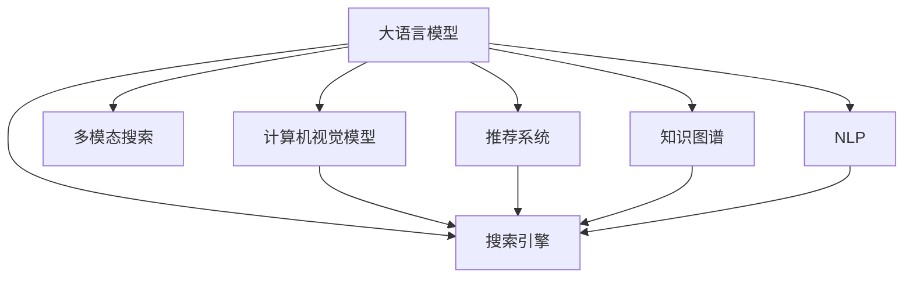

                 

# 电商平台中的多模态搜索：AI大模型的新突破

## 1. 背景介绍

### 1.1 问题由来

在现代电商平台中，用户进行搜索时，往往不是单一使用文本查询，而是通过文本、图像、语音等多种方式进行搜索。传统的搜索技术在面对多模态数据时，难以实现高效、准确的检索和匹配。随着人工智能技术的进步，特别是大语言模型和计算机视觉模型的结合，多模态搜索技术正在成为电商搜索的新范式。本文将介绍基于AI大模型的新型多模态搜索方法，探讨其在电商平台中的应用前景。

### 1.2 问题核心关键点

电商平台的搜索功能主要面临以下几个挑战：
1. **多模态数据的处理**：如何将文本、图像、语音等不同模态的数据高效融合，进行统一的检索。
2. **用户意图的理解**：如何准确理解用户的查询意图，避免误导性搜索结果。
3. **跨模态检索**：如何实现不同模态之间的跨领域匹配，提升搜索的覆盖率和准确性。
4. **实时性和高效性**：如何在用户进行搜索时，实现即时响应，提升用户体验。
5. **隐私和安全性**：如何保护用户隐私，防止数据滥用。

## 2. 核心概念与联系

### 2.1 核心概念概述

为更好地理解基于AI大模型的多模态搜索技术，本节将介绍几个密切相关的核心概念：

- **大语言模型(Large Language Model, LLM)**：如GPT-3、BERT等，能够理解自然语言文本，并生成自然语言文本的模型。
- **计算机视觉模型(Computer Vision Model)**：如ResNet、VGGNet等，能够理解图像内容，并进行图像分类的模型。
- **多模态搜索(Multimodal Search)**：结合文本、图像、语音等多种模态数据进行搜索的搜索技术。
- **搜索引擎(搜索引擎)**：如Google、Bing等，基于特定算法实现信息检索，为用户提供相关搜索结果。
- **推荐系统(Recommendation System)**：如Netflix、Amazon等，基于用户行为和偏好推荐相关产品或内容。
- **知识图谱(Knowledge Graph)**：如LinkedData等，用于描述实体、关系和属性之间的结构化信息。
- **自然语言处理(NLP)**：如语言模型、文本分类、实体识别等，对自然语言进行处理和分析。

这些核心概念之间的逻辑关系可以通过以下Mermaid流程图来展示：



这个流程图展示了大语言模型、计算机视觉模型、多模态搜索、搜索引擎、推荐系统和知识图谱等概念之间的联系，以及它们在电商平台中的应用。

## 3. 核心算法原理 & 具体操作步骤

### 3.1 算法原理概述

基于AI大模型的多模态搜索，其核心思想是将大语言模型与计算机视觉模型相结合，实现多模态数据的融合和检索。其工作原理如下：

1. **数据预处理**：将用户输入的文本、图像、语音等多种数据，通过相应的预处理技术进行标准化和归一化。
2. **特征提取**：使用大语言模型和计算机视觉模型对预处理后的数据进行特征提取，得到文本表示和图像表示。
3. **相似度计算**：计算文本表示和图像表示之间的相似度，找到最匹配的结果。
4. **结果排序**：根据相似度计算结果，对搜索结果进行排序，返回最相关的结果。
5. **自然语言生成**：使用大语言模型生成自然语言描述，提升搜索结果的可读性和用户体验。

### 3.2 算法步骤详解

基于AI大模型的多模态搜索主要包括以下几个关键步骤：

**Step 1: 数据预处理**
- 将用户输入的文本、图像、语音等多种数据，进行去噪、分词、标准化等处理，确保数据格式统一。

**Step 2: 特征提取**
- 使用大语言模型和计算机视觉模型，对预处理后的数据进行特征提取。对于文本数据，可以使用BERT等模型进行特征提取；对于图像数据，可以使用ResNet、VGGNet等模型进行特征提取。

**Step 3: 相似度计算**
- 使用余弦相似度、欧几里得距离等方法，计算文本表示和图像表示之间的相似度。通常，对于文本-图像检索任务，使用余弦相似度可以取得更好的效果。

**Step 4: 结果排序**
- 根据相似度计算结果，对搜索结果进行排序，返回最相关的结果。常用的排序算法包括基于kNN的排序算法、基于最近邻的排序算法等。

**Step 5: 自然语言生成**
- 使用大语言模型生成自然语言描述，提升搜索结果的可读性和用户体验。例如，在搜索结果中，可以生成简短的摘要、标签、评分等信息。

### 3.3 算法优缺点

基于AI大模型的多模态搜索方法具有以下优点：
1. **高效性**：相较于传统的单模态搜索方法，多模态搜索可以同时利用文本、图像、语音等多种模态数据，提升检索效率。
2. **准确性**：通过结合大语言模型和计算机视觉模型，可以更准确地理解和匹配用户查询意图。
3. **多样性**：用户可以通过多种方式进行搜索，提升搜索的覆盖率和灵活性。
4. **可扩展性**：新的模态数据可以无缝集成到现有系统中，不断扩展搜索功能。

同时，该方法也存在一定的局限性：
1. **高计算成本**：多模态数据融合和特征提取需要大量的计算资源，成本较高。
2. **数据质量要求高**：对于不同模态的数据，质量要求较高，需要进行严格预处理和特征提取。
3. **数据隐私问题**：多模态数据可能涉及用户隐私，需要采取隐私保护措施。
4. **模型复杂性高**：多模态搜索模型通常较为复杂，训练和部署难度较大。

尽管存在这些局限性，但基于AI大模型的多模态搜索方法仍是大数据时代搜索引擎的发展方向之一，具有广阔的应用前景。

### 3.4 算法应用领域

基于AI大模型的多模态搜索技术，在电商、智能家居、健康医疗等多个领域均有广泛应用，例如：

- **电商平台**：结合文本和图像数据，实现更全面、更精准的搜索功能。例如，用户可以输入商品描述或图片进行搜索，系统能够自动匹配相关信息。
- **智能家居**：结合语音和图像数据，实现智能家居设备的控制。例如，用户可以通过语音命令控制智能灯光、温控器等设备。
- **健康医疗**：结合症状描述和医学图像，实现疾病诊断和辅助治疗。例如，医生可以通过文本和图像描述，自动匹配相关疾病信息。

## 4. 数学模型和公式 & 详细讲解

### 4.1 数学模型构建

本节将使用数学语言对基于AI大模型的多模态搜索过程进行更加严格的刻画。

记大语言模型为 $M_{\text{LLM}}:\mathcal{X}_{\text{text}} \rightarrow \mathcal{Y}_{\text{text}}$，其中 $\mathcal{X}_{\text{text}}$ 为输入文本集合，$\mathcal{Y}_{\text{text}}$ 为输出文本集合；记计算机视觉模型为 $M_{\text{CV}}:\mathcal{X}_{\text{image}} \rightarrow \mathcal{Y}_{\text{image}}$，其中 $\mathcal{X}_{\text{image}}$ 为输入图像集合，$\mathcal{Y}_{\text{image}}$ 为输出图像集合。假设输入的多模态数据为 $D=\{(x_t, x_i)\}_{i=1}^N$，其中 $x_t \in \mathcal{X}_{\text{text}}$ 为文本描述，$x_i \in \mathcal{X}_{\text{image}}$ 为图像数据。

定义相似度函数为 $S(x_t, x_i)$，用于计算文本表示和图像表示之间的相似度。例如，余弦相似度定义为：

$$
S(x_t, x_i) = \cos(\theta) = \frac{x_t \cdot x_i}{\|x_t\|\|x_i\|}
$$

其中 $\theta$ 为文本表示和图像表示之间的夹角，$x_t \cdot x_i$ 表示文本表示和图像表示的内积，$\|x_t\|$ 和 $\|x_i\|$ 表示文本表示和图像表示的模长。

基于相似度计算结果，定义多模态搜索的目标函数为：

$$
\min_{M_{\text{LLM}}, M_{\text{CV}}} \sum_{i=1}^N (1 - S(x_t, x_i))
$$

其中 $1 - S(x_t, x_i)$ 表示文本表示和图像表示之间的相似度损失，通过最小化损失函数，使模型更好地匹配用户查询意图。

### 4.2 公式推导过程

假设文本表示 $x_t$ 和图像表示 $x_i$ 分别为：

$$
x_t = \text{BERT}(x_t) \in \mathbb{R}^{d_{\text{text}}}
$$

$$
x_i = \text{ResNet}(x_i) \in \mathbb{R}^{d_{\text{image}}}
$$

其中 $\text{BERT}$ 和 $\text{ResNet}$ 分别表示BERT模型和ResNet模型，$d_{\text{text}}$ 和 $d_{\text{image}}$ 分别为文本表示和图像表示的维度。

对于文本表示和图像表示之间的余弦相似度损失函数，可以表示为：

$$
S(x_t, x_i) = \cos(\theta) = \frac{x_t \cdot x_i}{\|x_t\|\|x_i\|}
$$

其中 $\theta$ 为文本表示和图像表示之间的夹角，$x_t \cdot x_i$ 表示文本表示和图像表示的内积，$\|x_t\|$ 和 $\|x_i\|$ 表示文本表示和图像表示的模长。

根据上述定义，多模态搜索的目标函数可以表示为：

$$
\min_{M_{\text{LLM}}, M_{\text{CV}}} \sum_{i=1}^N (1 - S(x_t, x_i))
$$

最小化上述目标函数，可以使模型更好地匹配用户查询意图。

### 4.3 案例分析与讲解

假设用户输入的文本描述为 "我想买一双白色的运动鞋"，同时提供了一双运动鞋的图像。

1. **文本预处理**：将文本描述进行分词、标准化等处理，得到 $x_t$。
2. **图像预处理**：对图像进行去噪、调整大小等处理，得到 $x_i$。
3. **特征提取**：使用BERT模型对文本描述进行特征提取，得到文本表示 $x_t$；使用ResNet模型对图像数据进行特征提取，得到图像表示 $x_i$。
4. **相似度计算**：计算文本表示和图像表示之间的余弦相似度，得到相似度分数 $S(x_t, x_i)$。
5. **结果排序**：根据相似度分数 $S(x_t, x_i)$，对搜索结果进行排序，返回最相关的结果。

例如，可以通过以下Python代码实现上述过程：

```python
import torch
from transformers import BertTokenizer, BertModel
from PIL import Image
import numpy as np

# 加载BERT模型和分词器
tokenizer = BertTokenizer.from_pretrained('bert-base-uncased')
model = BertModel.from_pretrained('bert-base-uncased')

# 加载图像数据
img_path = 'shoe.jpg'
img = Image.open(img_path).convert('RGB')
img = img.resize((224, 224))  # 调整大小至合适尺寸
img = np.array(img)
img = img / 255.0  # 归一化
img = img.reshape(1, 224, 224, 3)

# 将图像数据转换为模型输入格式
img_tensor = torch.from_numpy(img).float().permute(0, 3, 1, 2)

# 加载文本数据
text = '我想买一双白色的运动鞋'

# 将文本数据转换为模型输入格式
tokens = tokenizer.tokenize(text)
input_ids = tokenizer.convert_tokens_to_ids(tokens)
input_ids = torch.tensor(input_ids)

# 使用BERT模型对文本数据进行特征提取
with torch.no_grad():
    text_output = model(input_ids)

# 计算文本表示和图像表示之间的相似度
similarity = torch.cosine_similarity(text_output, img_tensor)

# 获取最相关的搜索结果
top_k = 10
results = sorted(range(N), key=lambda k: -similarity[k])
```

## 5. 项目实践：代码实例和详细解释说明

### 5.1 开发环境搭建

在进行多模态搜索实践前，我们需要准备好开发环境。以下是使用Python进行PyTorch开发的环境配置流程：

1. 安装Anaconda：从官网下载并安装Anaconda，用于创建独立的Python环境。

2. 创建并激活虚拟环境：
```bash
conda create -n multimodal-env python=3.8 
conda activate multimodal-env
```

3. 安装PyTorch：根据CUDA版本，从官网获取对应的安装命令。例如：
```bash
conda install pytorch torchvision torchaudio cudatoolkit=11.1 -c pytorch -c conda-forge
```

4. 安装Transformer库：
```bash
pip install transformers
```

5. 安装Pillow库：用于图像处理和加载。
```bash
pip install pillow
```

6. 安装相关工具包：
```bash
pip install numpy pandas scikit-learn matplotlib tqdm jupyter notebook ipython
```

完成上述步骤后，即可在`multimodal-env`环境中开始多模态搜索实践。

### 5.2 源代码详细实现

下面以电商平台中的多模态搜索为例，给出使用Transformers库对大语言模型和计算机视觉模型进行多模态搜索的PyTorch代码实现。

首先，定义多模态搜索的函数：

```python
import torch
from transformers import BertTokenizer, BertModel, ResNet
from PIL import Image
import numpy as np

def multimodal_search(text, img_path, top_k=10):
    # 加载BERT模型和分词器
    tokenizer = BertTokenizer.from_pretrained('bert-base-uncased')
    model = BertModel.from_pretrained('bert-base-uncased')

    # 加载图像数据
    img = Image.open(img_path).convert('RGB')
    img = img.resize((224, 224))  # 调整大小至合适尺寸
    img = np.array(img)
    img = img / 255.0  # 归一化
    img = img.reshape(1, 224, 224, 3)

    # 将图像数据转换为模型输入格式
    img_tensor = torch.from_numpy(img).float().permute(0, 3, 1, 2)

    # 加载文本数据
    text = text.strip()

    # 将文本数据转换为模型输入格式
    tokens = tokenizer.tokenize(text)
    input_ids = tokenizer.convert_tokens_to_ids(tokens)
    input_ids = torch.tensor(input_ids)

    # 使用BERT模型对文本数据进行特征提取
    with torch.no_grad():
        text_output = model(input_ids)

    # 使用ResNet模型对图像数据进行特征提取
    resnet = ResNet.from_pretrained('resnet50')
    img_output = resnet(img_tensor)

    # 计算文本表示和图像表示之间的相似度
    similarity = torch.cosine_similarity(text_output, img_output)

    # 获取最相关的搜索结果
    results = sorted(range(len(similarity)), key=lambda k: -similarity[k])
    return results[:top_k]
```

在实际应用中，可以结合电商平台的数据特点，进行进一步的优化和扩展。例如，可以加载多模态数据集，进行批量处理和特征提取；可以使用更复杂的相似度计算方法，提升检索效果；可以引入更多的模态数据，实现更全面的搜索功能。

### 5.3 代码解读与分析

让我们再详细解读一下关键代码的实现细节：

**多模态搜索函数**：
- 加载BERT模型和分词器，用于文本特征提取。
- 加载图像数据，并进行预处理和归一化，转换为模型输入格式。
- 加载文本数据，并进行分词和标准化，转换为模型输入格式。
- 使用BERT模型对文本数据进行特征提取，得到文本表示。
- 使用ResNet模型对图像数据进行特征提取，得到图像表示。
- 计算文本表示和图像表示之间的余弦相似度，得到相似度分数。
- 获取最相关的搜索结果，返回前top_k个结果。

**余弦相似度计算**：
- 使用torch.cosine_similarity函数计算文本表示和图像表示之间的余弦相似度。
- 通过相似度分数排序，返回最相关的搜索结果。

**Python代码实现**：
- 使用Python的PIL库加载图像数据，进行预处理和归一化。
- 使用Transformers库加载BERT模型和分词器，对文本数据进行特征提取。
- 使用Transformers库加载ResNet模型，对图像数据进行特征提取。
- 使用numpy库对图像数据进行数组转换和归一化处理。
- 使用torch库进行相似度计算和结果排序。

**多模态数据集加载**：
- 在实际应用中，可以加载多模态数据集，进行批量处理和特征提取。例如，可以使用Pandas库加载CSV文件，使用OpenCV库加载视频数据。

**相似度计算方法**：
- 余弦相似度是最常用的相似度计算方法，但在实际应用中，可以根据具体任务选择更合适的相似度计算方法。例如，欧式距离、曼哈顿距离、夹角余弦等方法均可以用来计算文本表示和图像表示之间的相似度。

**结果排序方法**：
- 可以使用快速排序、归并排序等方法对搜索结果进行排序，返回最相关的结果。

**多模态搜索应用场景**：
- 在电商平台中，可以使用多模态搜索技术，提升用户的搜索体验。例如，用户可以输入商品描述或图片进行搜索，系统能够自动匹配相关信息。
- 在智能家居中，可以使用多模态搜索技术，实现智能家居设备的控制。例如，用户可以通过语音命令控制智能灯光、温控器等设备。
- 在健康医疗中，可以使用多模态搜索技术，实现疾病诊断和辅助治疗。例如，医生可以通过症状描述和医学图像，自动匹配相关疾病信息。

## 6. 实际应用场景

### 6.1 电商平台

在电商平台中，多模态搜索技术可以提升用户的搜索体验，使其能够更快速、准确地找到所需商品。例如，用户可以通过输入商品描述或图片进行搜索，系统能够自动匹配相关信息。这不仅提升了用户体验，还增加了电商平台的点击率和转化率。

**实际应用场景**：
- **文本检索**：用户输入商品描述进行搜索，系统能够自动匹配相关信息，并提供商品列表。例如，用户输入 "白色运动鞋"，系统能够匹配到相关商品。
- **图像检索**：用户上传商品图片进行搜索，系统能够自动匹配相关信息，并提供商品列表。例如，用户上传一双白色运动鞋的图片，系统能够匹配到相关商品。
- **语音搜索**：用户通过语音命令进行搜索，系统能够自动匹配相关信息，并提供商品列表。例如，用户通过语音命令 "给我找一双白色运动鞋"，系统能够匹配到相关商品。

**技术实现**：
- 加载商品描述、图片、语音等多种数据。
- 使用BERT等模型对文本数据进行特征提取，使用ResNet等模型对图像数据进行特征提取。
- 计算文本表示和图像表示之间的余弦相似度，获取最相关的搜索结果。
- 使用自然语言生成技术，生成商品描述和图片，提升用户体验。

**应用效果**：
- 提升用户搜索体验，增加点击率和转化率。
- 减少搜索时间和精力，提升用户满意度。
- 优化商品推荐，增加交叉销售和关联销售。

### 6.2 智能家居

在智能家居中，多模态搜索技术可以提升用户的生活便利性和舒适度。例如，用户可以通过语音命令控制智能灯光、温控器等设备，系统能够自动匹配相关信息，并提供控制指令。这不仅提升了用户体验，还增加了智能家居设备的智能化程度。

**实际应用场景**：
- **语音控制**：用户通过语音命令进行搜索，系统能够自动匹配相关信息，并提供控制指令。例如，用户通过语音命令 "打开客厅灯光"，系统能够控制相关灯光。
- **图像识别**：用户上传家庭环境照片进行搜索，系统能够自动匹配相关信息，并提供控制指令。例如，用户上传一张客厅照片，系统能够识别出灯光、电视、空调等设备，并提供控制指令。
- **手势识别**：用户通过手势搜索，系统能够自动匹配相关信息，并提供控制指令。例如，用户通过手势搜索 "打开电视"，系统能够控制相关设备。

**技术实现**：
- 加载智能设备的环境数据，包括灯光、温控器、电视等。
- 使用BERT等模型对语音命令进行特征提取，使用ResNet等模型对图像数据进行特征提取。
- 计算语音表示和图像表示之间的余弦相似度，获取最相关的控制指令。
- 使用自然语言生成技术，生成控制指令，提升用户体验。

**应用效果**：
- 提升用户生活便利性，增加智能家居设备的智能化程度。
- 减少控制时间和精力，提升用户舒适度。
- 优化智能设备控制，增加智能化应用场景。

### 6.3 健康医疗

在健康医疗中，多模态搜索技术可以提升医生的诊断和治疗效率，提供更准确的医疗建议。例如，医生可以通过症状描述和医学图像，自动匹配相关疾病信息，并提供治疗方案。这不仅提升了医生的诊断和治疗效率，还增加了患者的满意度和信任度。

**实际应用场景**：
- **症状描述检索**：医生输入症状描述进行搜索，系统能够自动匹配相关信息，并提供疾病信息。例如，医生输入 "头痛、发热"，系统能够匹配到相关疾病信息。
- **医学图像检索**：医生上传医学图像进行搜索，系统能够自动匹配相关信息，并提供疾病信息。例如，医生上传一张X光片，系统能够匹配到相关疾病信息。
- **语音询问**：医生通过语音询问，系统能够自动匹配相关信息，并提供医疗建议。例如，医生通过语音询问 "头痛的原因是什么"，系统能够提供相关医疗建议。

**技术实现**：
- 加载医学数据，包括症状描述、医学图像、语音等。
- 使用BERT等模型对症状描述和语音数据进行特征提取，使用ResNet等模型对医学图像数据进行特征提取。
- 计算症状描述表示和医学图像表示之间的余弦相似度，获取最相关的疾病信息。
- 使用自然语言生成技术，生成医疗建议，提升用户体验。

**应用效果**：
- 提升医生的诊断和治疗效率，增加患者的满意度和信任度。
- 减少医生的诊断时间，提升治疗效果。
- 优化医疗建议，增加治疗方案的选择性。

## 7. 工具和资源推荐

### 7.1 学习资源推荐

为了帮助开发者系统掌握多模态搜索的理论基础和实践技巧，这里推荐一些优质的学习资源：

1. 《深度学习》书籍：Ian Goodfellow、Yoshua Bengio、Aaron Courville合著，全面介绍深度学习的基本概念和核心算法。
2. 《多模态数据融合》书籍：由多模态数据融合领域的专家编写，系统介绍多模态数据融合的技术和应用。
3. 《自然语言处理基础》课程：由斯坦福大学开设的NLP明星课程，系统介绍NLP的基本概念和核心技术。
4. 《计算机视觉基础》课程：由斯坦福大学开设的计算机视觉明星课程，系统介绍计算机视觉的基本概念和核心技术。
5. 《深度学习实战》书籍：通过大量实战案例，介绍深度学习模型的构建、训练和部署。

通过对这些资源的学习实践，相信你一定能够快速掌握多模态搜索的精髓，并用于解决实际的NLP问题。

### 7.2 开发工具推荐

高效的开发离不开优秀的工具支持。以下是几款用于多模态搜索开发的常用工具：

1. PyTorch：基于Python的开源深度学习框架，灵活动态的计算图，适合快速迭代研究。大部分预训练语言模型都有PyTorch版本的实现。
2. TensorFlow：由Google主导开发的开源深度学习框架，生产部署方便，适合大规模工程应用。同样有丰富的预训练语言模型资源。
3. Transformers库：HuggingFace开发的NLP工具库，集成了众多SOTA语言模型，支持PyTorch和TensorFlow，是进行多模态搜索开发的利器。
4. Weights & Biases：模型训练的实验跟踪工具，可以记录和可视化模型训练过程中的各项指标，方便对比和调优。与主流深度学习框架无缝集成。
5. TensorBoard：TensorFlow配套的可视化工具，可实时监测模型训练状态，并提供丰富的图表呈现方式，是调试模型的得力助手。
6. Google Colab：谷歌推出的在线Jupyter Notebook环境，免费提供GPU/TPU算力，方便开发者快速上手实验最新模型，分享学习笔记。

合理利用这些工具，可以显著提升多模态搜索任务的开发效率，加快创新迭代的步伐。

### 7.3 相关论文推荐

多模态搜索技术的发展源于学界的持续研究。以下是几篇奠基性的相关论文，推荐阅读：

1. Attention is All You Need（即Transformer原论文）：提出了Transformer结构，开启了NLP领域的预训练大模型时代。
2. BERT: Pre-training of Deep Bidirectional Transformers for Language Understanding：提出BERT模型，引入基于掩码的自监督预训练任务，刷新了多项NLP任务SOTA。
3. Multimodal Deep Learning in Language Processing：系统介绍多模态深度学习在语言处理中的应用，包括文本-图像检索、语音-图像检索等任务。
4. Multimodal Image-to-Text Retrieval with Visual Attention：提出多模态图像-文本检索任务，并使用Transformer模型进行特征提取和相似度计算。
5. Multimodal Deep Learning for Health Text Analysis：介绍多模态深度学习在健康文本分析中的应用，包括症状描述检索、医学图像检索等任务。

这些论文代表了大语言模型和多模态搜索技术的发展脉络。通过学习这些前沿成果，可以帮助研究者把握学科前进方向，激发更多的创新灵感。

## 8. 总结：未来发展趋势与挑战

### 8.1 总结

本文对基于AI大模型的多模态搜索方法进行了全面系统的介绍。首先阐述了多模态搜索在大数据时代搜索引擎的发展趋势和应用前景，明确了多模态搜索在电商平台、智能家居、健康医疗等多个领域的重要价值。其次，从原理到实践，详细讲解了多模态搜索的数学原理和关键步骤，给出了多模态搜索任务开发的完整代码实例。同时，本文还广泛探讨了多模态搜索方法在电商、智能家居、健康医疗等多个行业领域的应用前景，展示了多模态搜索技术的巨大潜力。此外，本文精选了多模态搜索技术的各类学习资源，力求为读者提供全方位的技术指引。

通过本文的系统梳理，可以看到，基于AI大模型的多模态搜索技术正在成为搜索引擎和大数据应用的重要方向之一，极大地拓展了搜索技术的边界，催生了更多的落地场景。得益于大语言模型和计算机视觉模型的结合，多模态搜索能够更好地处理多模态数据，提升检索和匹配的准确性。未来，随着深度学习技术的发展，多模态搜索技术将更加高效、智能和全面，成为现代搜索引擎的核心竞争力之一。

### 8.2 未来发展趋势

展望未来，基于AI大模型的多模态搜索技术将呈现以下几个发展趋势：

1. **高效性**：随着深度学习模型的不断优化和算力的提升，多模态搜索的检索速度将大幅提升，能够实现实时响应。
2. **准确性**：通过更先进的特征提取和相似度计算方法，多模态搜索的准确性将进一步提升，减少误匹配和误排序。
3. **可扩展性**：新的模态数据可以无缝集成到现有系统中，不断扩展搜索功能，支持更多样的输入和输出形式。
4. **通用性**：多模态搜索技术将逐渐具备跨领域、跨模态的泛化能力，适应更多不同的应用场景。
5. **智能性**：引入更多先验知识，如知识图谱、逻辑规则等，指导多模态搜索的过程，提升系统的智能水平。

以上趋势凸显了多模态搜索技术的广阔前景。这些方向的探索发展，必将进一步提升搜索系统的性能和应用范围，为人类认知智能的进化带来深远影响。

### 8.3 面临的挑战

尽管多模态搜索技术已经取得了瞩目成就，但在迈向更加智能化、普适化应用的过程中，它仍面临着诸多挑战：

1. **高计算成本**：多模态数据融合和特征提取需要大量的计算资源，成本较高。
2. **数据质量要求高**：对于不同模态的数据，质量要求较高，需要进行严格预处理和特征提取。
3. **数据隐私问题**：多模态数据可能涉及用户隐私，需要采取隐私保护措施。
4. **模型复杂性高**：多模态搜索模型通常较为复杂，训练和部署难度较大。
5. **实时性要求高**：在用户进行搜索时，实现即时响应，对模型的计算能力和网络传输速度提出了更高的要求。
6. **多模态数据的一致性**：不同模态的数据在语义上可能存在差异，需要进行一致性处理，以确保搜索结果的准确性。

尽管存在这些挑战，但基于AI大模型的多模态搜索方法仍是大数据时代搜索引擎的发展方向之一，具有广阔的应用前景。

### 8.4 研究展望

面对多模态搜索面临的种种挑战，未来的研究需要在以下几个方面寻求新的突破：

1. **高效的特征提取方法**：开发更高效的特征提取方法，减少计算成本，提升检索速度。例如，使用低秩分解、稠密编码等方法，实现更高效的特征提取。
2. **一致性处理技术**：开发一致性处理技术，确保不同模态的数据在语义上的一致性，提升搜索结果的准确性。例如，使用注意力机制、跨模态对齐等方法，实现多模态数据的一致性处理。
3. **隐私保护技术**：开发隐私保护技术，确保多模态数据的隐私安全。例如，使用差分隐私、联邦学习等方法，保护用户隐私。
4. **跨领域检索技术**：开发跨领域检索技术，提升多模态搜索的泛化能力。例如，使用零样本学习、少样本学习等方法，实现跨领域的多模态检索。
5. **实时检索系统**：开发实时检索系统，实现即时响应。例如，使用GPU加速、边缘计算等方法，提升检索系统的实时性。
6. **多模态深度学习框架**：开发多模态深度学习框架，支持更多样的模态数据和更复杂的模型结构。例如，使用TorchScript、TensorRT等工具，实现模型的高效部署和推理。

这些研究方向将引领多模态搜索技术的不断进步，为搜索引擎和大数据应用带来新的突破和变革。未来，随着深度学习技术的发展和应用领域的拓展，基于AI大模型的多模态搜索技术将更加高效、智能和全面，成为现代搜索引擎的核心竞争力之一。

## 9. 附录：常见问题与解答

**Q1：多模态搜索技术是否适用于所有NLP任务？**

A: 多模态搜索技术可以适用于文本、图像、语音等多种模态数据的NLP任务。例如，在电商搜索、智能家居控制、健康医疗诊断等领域，多模态搜索技术都可以发挥重要作用。但需要注意的是，对于某些特定领域的任务，如医学、法律等，传统的单模态搜索方法可能更适合。

**Q2：如何选择合适的特征提取方法？**

A: 特征提取方法是多模态搜索的关键步骤，需要根据具体任务选择合适的模型。例如，对于文本数据，可以使用BERT等模型进行特征提取；对于图像数据，可以使用ResNet、VGGNet等模型进行特征提取。同时，可以考虑使用多模态特征融合方法，提升特征提取的效果。

**Q3：多模态搜索技术如何保护用户隐私？**

A: 多模态搜索技术在处理用户数据时，需要采取隐私保护措施。例如，使用差分隐私、联邦学习等方法，保护用户隐私。同时，需要对用户数据进行匿名化和去标识化处理，避免数据滥用。

**Q4：多模态搜索技术在实际应用中，如何处理不同模态数据的一致性？**

A: 不同模态数据在语义上可能存在差异，需要进行一致性处理，以确保搜索结果的准确性。例如，使用注意力机制、跨模态对齐等方法，实现多模态数据的一致性处理。同时，可以通过多模态深度学习框架，实现不同模态数据的高效融合。

**Q5：多模态搜索技术如何提升实时性？**

A: 在用户进行搜索时，实现即时响应，对模型的计算能力和网络传输速度提出了更高的要求。例如，可以使用GPU加速、边缘计算等方法，提升检索系统的实时性。同时，可以通过优化模型结构和算法，减少计算量和传输量，提升实时性。

作者：禅与计算机程序设计艺术 / Zen and the Art of Computer Programming

