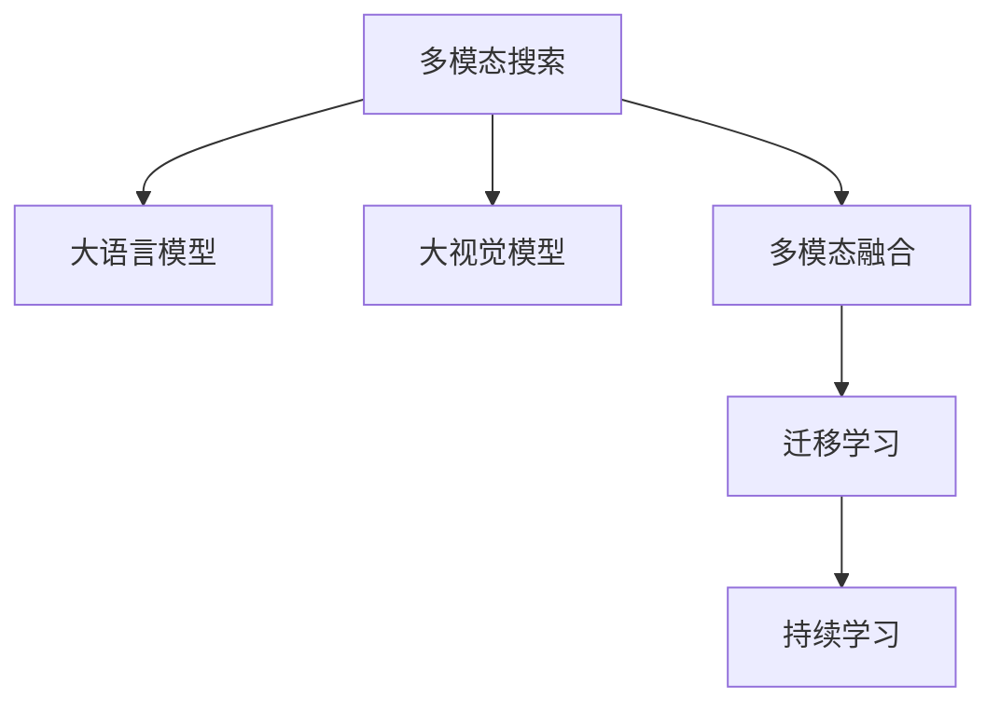

                 

# 电商平台中的多模态搜索：AI大模型的新突破

## 1. 背景介绍

在数字化经济时代，电商平台正经历着从以文本为主到多模态信息融合的变革。传统单一的文本搜索方式已无法满足用户对商品信息的全面需求。随着图像、视频、语音等丰富多样的多媒体数据涌现，电商平台需要构建多模态搜索系统，以支持更加智能化、个性化的用户体验。本文将介绍大模型在电商平台多模态搜索中的新突破，探讨其原理、实现和应用前景。

## 2. 核心概念与联系

### 2.1 核心概念概述

为了深入理解大模型在电商平台多模态搜索中的应用，本文首先介绍几个关键概念：

- **多模态搜索(Multimodal Search)**：利用文本、图像、视频、语音等多模态数据，通过AI技术实现全面、准确的商品检索。
- **大语言模型(Large Language Model, LLM)**：基于Transformer等结构的大规模预训练语言模型，能够学习丰富的自然语言知识，具备强大的文本理解能力。
- **大视觉模型(Large Vision Model)**：以Vision Transformer(ViT)为代表的大规模视觉模型，能够处理大规模图像数据，学习图像中的高层次语义信息。
- **多模态融合(Multimodal Fusion)**：将不同模态的信息进行融合，提升综合理解能力，生成更加准确的搜索结果。
- **迁移学习(Transfer Learning)**：通过预训练模型在特定任务上的微调，实现模型的泛化能力提升，减少对标注数据的依赖。
- **持续学习(Continual Learning)**：模型能够不断从新数据中学习，同时保持已学习的知识，以适应数据分布的变化。

这些概念通过以下Mermaid流程图展示了它们之间的联系：



## 3. 核心算法原理 & 具体操作步骤

### 3.1 算法原理概述

多模态搜索的核心在于利用大模型学习跨模态知识，融合不同模态的特征信息，生成精准的搜索结果。其算法原理可以概括为：

1. **特征提取**：利用大语言模型和大视觉模型对输入的文本、图像等数据进行特征提取，获得多模态的向量表示。
2. **多模态融合**：通过深度学习网络（如Transformer、MLP等），对多模态特征进行加权融合，生成融合后的高层次表示。
3. **相似度计算**：使用余弦相似度、欧式距离等方法，计算融合后表示之间的相似度，排序选择最相关的搜索结果。
4. **任务适配**：根据具体搜索任务（如文本搜索、图像搜索、语音搜索等），进行模型适配，调整输出格式和行为。

### 3.2 算法步骤详解

以电商平台文本图像混合搜索为例，详细介绍大模型在多模态搜索中的应用步骤：

1. **数据预处理**：收集电商平台的文本和图像数据，进行归一化、预处理等操作。
2. **特征提取**：
   - 文本特征提取：使用BERT、GPT等大语言模型，对文本数据进行预训练，提取文本向量表示。
   - 图像特征提取：使用ViT等大视觉模型，对图像数据进行预训练，提取图像向量表示。
3. **特征融合**：
   - 将提取的文本和图像向量进行拼接，通过全连接层或注意力机制进行融合。
   - 可选地，引入多模态注意力机制，对不同模态特征进行加权融合，生成综合向量表示。
4. **相似度计算**：
   - 使用余弦相似度、欧式距离等方法，计算查询向量与各个商品向量的相似度。
   - 根据相似度排序，选取与查询向量最接近的商品作为搜索结果。
5. **输出调整**：
   - 根据任务需求，调整输出格式，如生成商品名称、描述、图片等。
   - 如果需要进行语音搜索，可采用ASR技术将语音转换为文本，再结合上述方法进行检索。

### 3.3 算法优缺点

大模型在多模态搜索中的应用具有以下优点：

- **泛化能力强**：大模型经过大规模数据预训练，能够捕捉到多模态之间的复杂关联，泛化能力更强。
- **计算效率高**：大模型往往使用高性能计算框架（如PyTorch、TensorFlow），优化了模型计算图，推理速度更快。
- **易于扩展**：大模型的微调和部署相对简单，便于在多模态搜索系统中进行扩展和优化。

同时，大模型在多模态搜索中也有以下缺点：

- **资源消耗大**：大模型通常具有亿级参数，对计算资源和存储资源需求高。
- **模型复杂度高**：多模态融合和特征表示需要复杂的深度学习网络，模型结构复杂。
- **易受数据影响**：大模型对输入数据质量敏感，如果训练数据质量不佳，可能导致模型效果不理想。

### 3.4 算法应用领域

多模态搜索技术已经在电商、医疗、金融等多个领域得到了广泛应用，具体包括：

- **电商领域**：支持用户在文本和图像之间的跨模态搜索，提升用户体验和满意度。
- **医疗领域**：结合文本、图像、语音等多模态信息，进行疾病诊断和治疗方案推荐。
- **金融领域**：利用文本、图像、音频等多模态信息，进行市场情绪分析和投资策略优化。

## 4. 数学模型和公式 & 详细讲解

### 4.1 数学模型构建

我们以电商平台的文本图像混合搜索为例，构建数学模型。假设输入文本为 $x_t$，图像为 $x_v$，大语言模型为 $M_{\text{LM}}$，大视觉模型为 $M_{\text{V}}$。定义文本向量表示为 $h_{\text{text}} = M_{\text{LM}}(x_t)$，图像向量表示为 $h_{\text{image}} = M_{\text{V}}(x_v)$。多模态融合函数为 $F$，相似度计算函数为 $S$。

**文本和图像特征提取**：
$$
h_{\text{text}} = M_{\text{LM}}(x_t), \quad h_{\text{image}} = M_{\text{V}}(x_v)
$$

**多模态融合**：
$$
h_{\text{fusion}} = F(h_{\text{text}}, h_{\text{image}})
$$

**相似度计算**：
$$
s = S(h_{\text{fusion}}, h_q)
$$
其中 $h_q$ 为查询向量。

**排序和输出**：
$$
\text{top}_k = \text{argtop}_k(s), \quad \text{output} = \{d_i | i \in \text{top}_k\}
$$
其中 $\text{top}_k$ 表示选取相似度最高的前 $k$ 个搜索结果。

### 4.2 公式推导过程

在上述模型中，多模态融合 $F$ 和相似度计算 $S$ 可以进一步展开。

**多模态融合**：
假设 $h_{\text{text}}$ 和 $h_{\text{image}}$ 维度为 $d_{\text{text}}$ 和 $d_{\text{image}}$，则多模态融合函数 $F$ 可以采用拼接加权重的方式：
$$
h_{\text{fusion}} = \alpha h_{\text{text}} + (1-\alpha) h_{\text{image}}
$$
其中 $\alpha$ 为融合权重，通常通过交叉验证或模型微调得到。

**相似度计算**：
常用的相似度计算方法包括余弦相似度和欧式距离。以余弦相似度为例：
$$
s = \cos(\theta) = \frac{h_{\text{fusion}} \cdot h_q}{\|h_{\text{fusion}}\|_2 \|h_q\|_2}
$$
其中 $\theta$ 为向量夹角，$\cdot$ 表示点积，$\|\cdot\|_2$ 表示向量范数。

### 4.3 案例分析与讲解

以电商平台的多模态搜索为例，进行案例分析。假设用户输入查询文本 "红色连衣裙"，希望在搜索结果中包含该关键词的商品。

1. **文本特征提取**：使用BERT对查询文本进行编码，得到文本向量 $h_{\text{text}}$。
2. **图像特征提取**：对商品图片进行ViT编码，得到图像向量 $h_{\text{image}}$。
3. **多模态融合**：将文本和图像向量拼接，通过加权平均或注意力机制进行融合，得到综合向量表示 $h_{\text{fusion}}$。
4. **相似度计算**：计算查询向量 $h_q$ 与所有商品向量的相似度，排序选择前 $k$ 个最相关商品。
5. **输出调整**：根据任务需求，生成商品名称、描述、图片等信息，返回给用户。

## 5. 项目实践：代码实例和详细解释说明

### 5.1 开发环境搭建

在开始多模态搜索系统的开发前，需要搭建相应的开发环境。以下是Python环境配置的具体步骤：

1. 安装Anaconda：从官网下载并安装Anaconda，用于创建独立的Python环境。
```bash
conda install anaconda
```

2. 创建并激活虚拟环境：
```bash
conda create -n multimodal python=3.8 
conda activate multimodal
```

3. 安装必要的库：
```bash
conda install torch torchvision transformers opencv-python-scikit-image
```

4. 配置GPU环境：
```bash
conda install pytorch torchvision -c pytorch -c conda-forge
nvidia-smi
```

### 5.2 源代码详细实现

以下是一个简单的多模态搜索系统实现，包含文本和图像特征提取、融合和相似度计算：

```python
import torch
import torch.nn as nn
from transformers import BertTokenizer, BertForSequenceClassification
from torchvision import models, transforms
import cv2

class MultimodalSearch:
    def __init__(self, text_model, image_model):
        self.text_model = text_model
        self.image_model = image_model
        self.tokenizer = BertTokenizer.from_pretrained('bert-base-uncased')
        self.image_transforms = transforms.Compose([
            transforms.Resize(256),
            transforms.CenterCrop(224),
            transforms.ToTensor(),
            transforms.Normalize(mean=[0.485, 0.456, 0.406], std=[0.229, 0.224, 0.225])
        ])
    
    def text_to_vector(self, text):
        tokens = self.tokenizer.tokenize(text)
        input_ids = self.tokenizer.convert_tokens_to_ids(tokens)
        return self.text_model(input_ids).last_hidden_state[:, 0, :]
    
    def image_to_vector(self, image_path):
        image = cv2.imread(image_path)
        image_tensor = self.image_transforms(image).unsqueeze(0)
        return self.image_model(image_tensor).pooler_output
    
    def multimodal_fusion(self, text_vector, image_vector):
        alpha = 0.5  # 融合权重
        return alpha * text_vector + (1 - alpha) * image_vector
    
    def similarity(self, vector, query_vector):
        return torch.dot(vector, query_vector) / (torch.norm(vector) * torch.norm(query_vector))
    
    def search(self, query_text, image_paths, k):
        text_vector = self.text_to_vector(query_text)
        image_vectors = [self.image_to_vector(path) for path in image_paths]
        fusion_vectors = [self.multimodal_fusion(text_vector, vec) for vec in image_vectors]
        similarity_scores = [self.similarity(vec, text_vector) for vec in fusion_vectors]
        top_k_idx = torch.argsort(torch.tensor(similarity_scores), descending=True)[:k]
        return [(image_paths[i], similarity_scores[i]) for i in top_k_idx]
```

### 5.3 代码解读与分析

该代码实现了一个简单的多模态搜索系统，包含文本和图像特征提取、融合和相似度计算。以下是关键代码的解读：

- `MultimodalSearch`类：定义了多模态搜索系统的核心功能，包括文本特征提取、图像特征提取、多模态融合和相似度计算。
- `text_to_vector`方法：使用BERT对查询文本进行编码，返回文本向量表示。
- `image_to_vector`方法：对商品图片进行ViT编码，返回图像向量表示。
- `multimodal_fusion`方法：将文本和图像向量进行拼接和加权融合，得到综合向量表示。
- `similarity`方法：计算查询向量与各个商品向量的余弦相似度，返回排序后的相似度分数。
- `search`方法：根据查询文本和商品图片路径，调用上述方法进行多模态搜索，返回前 $k$ 个最相关商品及其相似度分数。

### 5.4 运行结果展示

假设我们有一个查询文本 "红色连衣裙"，需要搜索电商平台上的相关商品。我们可以使用以下代码进行测试：

```python
searcher = MultimodalSearch(text_model, image_model)
results = searcher.search("红色连衣裙", image_paths, 5)
for path, score in results:
    print(f"商品路径: {path}, 相似度分数: {score:.4f}")
```

运行结果会输出与查询文本最相关的5个商品路径及其相似度分数。

## 6. 实际应用场景

### 6.1 电商领域

多模态搜索在电商领域的应用场景丰富多样，例如：

1. **文本搜索**：用户通过输入文本查询，系统能够返回匹配的商品列表，提升搜索效率和准确性。
2. **图像搜索**：用户上传商品图片或描述图片，系统能够根据图片内容推荐相关商品。
3. **语音搜索**：用户通过语音输入查询，系统能够识别并返回匹配的商品。
4. **推荐系统**：结合用户历史行为和搜索记录，推荐相关商品，提高用户满意度。

### 6.2 医疗领域

在医疗领域，多模态搜索可以帮助医生进行疾病诊断和治疗方案推荐，具体应用包括：

1. **症状搜索**：输入症状描述，系统返回可能相关的疾病列表，辅助医生诊断。
2. **图像搜索**：上传患者影像资料，系统返回可能相关的疾病信息，提供诊断参考。
3. **文献搜索**：输入疾病名称，系统返回相关的医学文献和研究报告，支持临床决策。

### 6.3 金融领域

金融领域的多模态搜索应用，主要包括：

1. **市场情绪分析**：分析新闻、公告、社交媒体等文本和图像信息，识别市场情绪，预测股市走势。
2. **交易策略优化**：结合股票新闻、交易数据、财经评论等，优化交易策略，提高投资收益。
3. **风险管理**：分析金融数据和市场情绪，识别风险点，制定风险管理方案。

## 7. 工具和资源推荐

### 7.1 学习资源推荐

为了帮助开发者掌握多模态搜索的技术，推荐以下学习资源：

1. **《多模态学习：一种新兴的AI技术》（Multimodal Learning: A New AI Technology）**：介绍多模态学习的基本概念和应用场景。
2. **《深度学习与自然语言处理》（Deep Learning and Natural Language Processing）**：斯坦福大学课程，涵盖深度学习和NLP的多个方向，包括多模态搜索。
3. **《Transformers from PyTorch》**：讲解使用PyTorch实现Transformer模型的过程，涵盖多模态融合等技术。
4. **《Hugging Face Transformers库文档》**：官方文档提供了丰富的预训练模型和代码示例，适合学习多模态搜索系统的实现。
5. **CLUE开源项目**：提供多模态搜索任务的基准数据集和模型，助力模型开发和测试。

### 7.2 开发工具推荐

开发多模态搜索系统需要以下工具：

1. **PyTorch**：基于Python的深度学习框架，支持动态计算图，适合快速迭代研究。
2. **TensorFlow**：由Google主导的开源深度学习框架，生产部署方便，适合大规模工程应用。
3. **Transformers库**：Hugging Face开发的NLP工具库，集成了多个SOTA模型，支持多模态搜索。
4. **OpenCV**：计算机视觉库，用于图像处理和特征提取。
5. **Scikit-image**：Python图像处理库，支持图像增强、分割等操作。

### 7.3 相关论文推荐

以下是几篇关于多模态搜索的重要论文，推荐阅读：

1. **《多模态深度学习综述》（A Survey on Multimodal Deep Learning）**：总结多模态深度学习的基本概念和研究进展。
2. **《多模态表示学习：方法与挑战》（Multimodal Representation Learning: Methods and Challenges）**：探讨多模态表示学习的基本方法和技术。
3. **《基于多模态表示学习的多任务学习》（Multimodal Representation Learning for Multi-task Learning）**：介绍多模态表示学习在多任务学习中的应用。
4. **《多模态视觉检索：方法与挑战》（Multimodal Visual Retrieval: Methods and Challenges）**：总结多模态视觉检索的研究进展和应用场景。

## 8. 总结：未来发展趋势与挑战

### 8.1 研究成果总结

本文系统介绍了大模型在电商平台多模态搜索中的应用，涵盖了特征提取、多模态融合、相似度计算等关键技术。通过理论分析和代码实现，展示了多模态搜索系统的构建过程和应用效果。

### 8.2 未来发展趋势

未来，多模态搜索技术将在以下方向取得突破：

1. **模型规模更大**：随着计算资源和数据量的提升，大模型的参数规模将进一步增大，具备更强的泛化能力。
2. **多模态融合更高效**：引入更深层次的神经网络结构，提升多模态融合的准确性和效率。
3. **任务适配更灵活**：根据不同应用场景，灵活调整输出格式和行为，提升用户体验。
4. **持续学习更智能**：模型能够不断从新数据中学习，保持高性能，适应数据分布的变化。
5. **跨模态理解更深入**：研究更深层次的跨模态理解模型，提升对多模态信息的综合理解能力。

### 8.3 面临的挑战

多模态搜索技术在发展过程中仍面临诸多挑战：

1. **数据质量依赖**：高质量的数据是模型性能的保障，但获取高标注数据成本高，数据质量难以保证。
2. **计算资源需求大**：大模型需要高性能计算资源，超大规模数据的存储和处理成为难题。
3. **模型复杂度高**：多模态融合和特征表示需要复杂的深度学习网络，模型结构复杂。
4. **鲁棒性不足**：模型对输入数据和噪声敏感，鲁棒性不足。
5. **可解释性差**：多模态模型的决策过程复杂，难以解释和调试。

### 8.4 研究展望

未来，需要在以下方面进行深入研究：

1. **数据生成与增强**：研究生成对抗网络（GAN）等技术，生成高质量的数据，增强数据多样性。
2. **计算图优化**：优化计算图结构，提高推理速度和资源利用率。
3. **跨模态对齐**：研究多模态对齐方法，提升不同模态信息的融合效果。
4. **模型压缩与优化**：研究模型压缩和剪枝技术，降低计算和存储需求。
5. **可解释性增强**：研究可解释性技术，如LIME、SHAP等，提升模型的透明性和可信度。

## 9. 附录：常见问题与解答

**Q1: 多模态搜索中的预训练模型如何选择？**

A: 选择预训练模型时，需要考虑以下因素：
- 模型规模：大规模预训练模型如BERT、GPT、ViT等，能够提取更丰富的特征表示。
- 预训练任务：不同的预训练任务适用于不同的应用场景，如文本分类、图像分类等。
- 预训练数据：选择与任务相关的预训练数据，提升模型泛化能力。

**Q2: 如何提高多模态搜索的鲁棒性？**

A: 提高多模态搜索的鲁棒性，可以采用以下方法：
- 数据增强：引入数据扰动、噪声等，提升模型的鲁棒性。
- 正则化：使用L2正则、Dropout等正则化技术，防止过拟合。
- 对抗训练：引入对抗样本，提升模型的鲁棒性。
- 多模态对齐：研究多模态对齐方法，提升不同模态信息的融合效果。

**Q3: 多模态搜索中的计算效率如何优化？**

A: 优化多模态搜索的计算效率，可以采用以下方法：
- 计算图优化：优化计算图结构，减少前向传播和反向传播的资源消耗。
- 模型剪枝：通过剪枝和量化技术，降低模型参数和计算量。
- 分布式训练：使用分布式训练技术，提升训练和推理效率。

**Q4: 多模态搜索中的可解释性如何增强？**

A: 增强多模态搜索的可解释性，可以采用以下方法：
- 可解释性技术：研究LIME、SHAP等可解释性技术，提升模型的透明性和可信度。
- 可视化工具：使用可视化工具，展示模型的决策过程和特征重要性。
- 模型简化：通过模型简化和剪枝技术，降低模型复杂度，提升可解释性。

**Q5: 多模态搜索中的跨模态对齐方法有哪些？**

A: 常用的跨模态对齐方法包括：
- 特征空间对齐：通过线性变换或非线性变换，将不同模态的特征映射到同一空间。
- 多模态注意力机制：通过多模态注意力机制，对不同模态的信息进行加权融合。
- 元学习：研究元学习技术，学习多模态信息融合的通用模型。

通过以上方法和技术，可以逐步提升多模态搜索系统的性能和应用效果，推动大模型在电商、医疗、金融等领域的应用普及。

