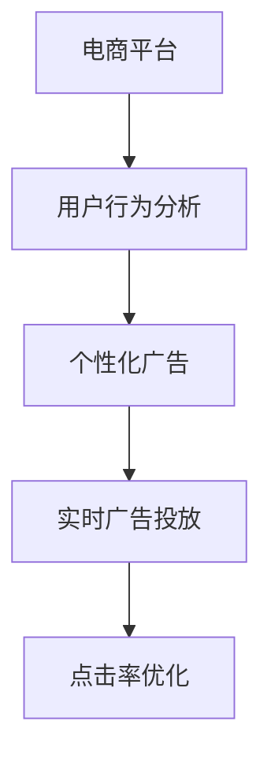

                 

# 电商平台中的实时个性化广告投放系统

> 关键词：
- 电商平台
- 个性化广告
- 实时投放
- 广告效果
- 点击率优化
- 用户行为分析
- 深度学习

## 1. 背景介绍

### 1.1 问题由来
随着电商行业的快速发展，商家们越来越依赖于广告投放来提升品牌曝光和销售转化率。传统的广告投放方式，如CPC（按点击付费）、CPM（按展示付费）等，往往只关注了广告的曝光量和点击量，而忽略了用户行为和转化效果。同时，广告的重复展示和用户注意力的下降，也导致了广告费用的浪费和用户体验的下降。

为了更好地解决这个问题，电商平台开始探索基于用户行为和实时数据的个性化广告投放系统。通过分析用户的浏览、购买、评价等行为数据，系统可以精准推荐最适合用户的广告，实现广告资源的最优化利用。

### 1.2 问题核心关键点
个性化广告投放系统的核心在于如何通过数据分析，准确识别用户需求和行为，并将最适合的广告推荐给用户。具体来说，系统需要解决以下问题：
- 如何高效获取用户行为数据，并进行清洗和分析？
- 如何构建用户画像，准确识别用户的偏好和需求？
- 如何实时优化广告投放策略，提升广告的点击率和转化率？
- 如何平衡广告投放效果与成本，实现效益最大化？

## 2. 核心概念与联系

### 2.1 核心概念概述

为更好地理解个性化广告投放系统的设计思路，本节将介绍几个密切相关的核心概念：

- 电商平台（E-commerce Platform）：指通过互联网进行商品交易的虚拟平台，包括搜索、浏览、购买、评价等核心功能。
- 个性化广告（Personalized Advertising）：指根据用户行为和偏好，向用户推荐最适合的广告内容，以提高广告效果和用户体验。
- 实时广告投放（Real-time Advertising Serving）：指根据用户实时行为和市场变化，动态调整广告投放策略，以提高广告效果和用户满意度。
- 点击率优化（CTR Optimization）：指通过调整广告投放策略，最大化广告的点击率和转化率。
- 用户行为分析（User Behavior Analysis）：指通过分析用户的行为数据，构建用户画像，精准识别用户需求和行为。
- 深度学习（Deep Learning）：指通过多层神经网络模型，从大量数据中自动学习特征，并应用于实际问题求解。

这些核心概念之间的逻辑关系可以通过以下Mermaid流程图来展示：



这个流程图展示了一个简单的个性化广告投放系统的核心流程：

1. 电商平台收集用户的各种行为数据。
2. 用户行为分析模块对数据进行分析，构建用户画像。
3. 个性化广告模块根据用户画像，推荐最适合的广告。
4. 实时广告投放模块根据市场变化和用户行为实时调整广告投放策略。
5. 点击率优化模块通过不断优化投放策略，提高广告的点击率和转化率。

## 3. 核心算法原理 & 具体操作步骤
### 3.1 算法原理概述

个性化广告投放系统主要依赖于深度学习技术，通过对用户行为数据进行建模和分析，实现广告的精准推荐。具体来说，系统主要包含以下几个步骤：

1. 数据收集与预处理：收集用户的浏览、购买、评价等行为数据，并进行清洗和预处理。
2. 用户画像构建：通过深度学习模型，构建用户画像，捕捉用户的行为特征和偏好。
3. 广告推荐：根据用户画像，推荐最适合的广告，实现广告资源的最优化利用。
4. 实时投放与优化：根据用户的实时行为和市场变化，动态调整广告投放策略，优化广告效果。

### 3.2 算法步骤详解

下面将详细介绍个性化广告投放系统的主要算法步骤和具体操作步骤。

#### 3.2.1 数据收集与预处理
- 数据源：主要来自电商平台的搜索、浏览、购买、评价等数据。
- 数据清洗：去除重复、异常和无用的数据，保留有用的特征数据。
- 数据预处理：进行归一化、缺失值处理、特征编码等预处理，准备好数据进行模型训练。

#### 3.2.2 用户画像构建
- 特征工程：选择有意义的特征，如用户历史行为、浏览路径、购买偏好等，并进行特征工程处理。
- 深度学习模型：使用深度学习模型，如CTR（Click-Through Rate）模型、RNN（Recurrent Neural Network）等，对用户行为数据进行建模。
- 用户画像：通过训练得到的深度学习模型，输出用户的行为特征和偏好，构建用户画像。

#### 3.2.3 广告推荐
- 推荐算法：使用协同过滤、基于内容的推荐、混合推荐等算法，对广告进行推荐。
- 广告数据处理：将广告数据进行编码，转换成模型可以处理的格式。
- 推荐结果：根据用户画像，推荐最适合的广告，实现广告的精准投放。

#### 3.2.4 实时投放与优化
- 实时数据采集：实时采集用户的浏览、点击等行为数据。
- 广告投放策略调整：根据实时数据，动态调整广告投放策略，优化广告效果。
- 广告效果评估：通过点击率、转化率等指标，评估广告效果，进行迭代优化。

### 3.3 算法优缺点
#### 3.3.1 优点
- 提高广告效果：通过深度学习模型，精准识别用户需求和行为，实现广告的精准投放。
- 实时优化投放策略：根据市场变化和用户行为，动态调整广告投放策略，提高广告效果。
- 平衡投放效果与成本：通过优化点击率和转化率，最大化广告效益。

#### 3.3.2 缺点
- 数据依赖性强：需要大量的用户行为数据，数据缺失或质量差会影响系统效果。
- 模型复杂度高：深度学习模型需要大量的计算资源和时间进行训练，且模型复杂度高，容易出现过拟合。
- 广告效果不易衡量：广告效果受市场变化、用户行为等多种因素影响，难以简单衡量和优化。

### 3.4 算法应用领域
个性化广告投放系统广泛应用于电商、新闻、社交、游戏等平台，涵盖了搜索、推荐、广告投放等多种场景。以下是几个典型的应用场景：

- 电商平台：通过分析用户的浏览和购买行为，推荐最适合的广告，提升广告效果和用户体验。
- 新闻平台：根据用户的阅读偏好和历史数据，推荐最相关的新闻内容，提高用户的点击率和停留时间。
- 社交平台：通过分析用户的互动行为，推荐最适合的内容和好友，提高用户粘性和互动率。
- 游戏平台：根据用户的游玩数据，推荐最适合的游戏和道具，提升游戏的用户留存和收益。

## 4. 数学模型和公式 & 详细讲解 & 举例说明
### 4.1 数学模型构建

个性化广告投放系统主要依赖于点击率优化模型和用户画像构建模型，这里以CTR模型为例进行详细讲解。

#### 4.1.1 CTR模型

CTR模型旨在预测用户点击广告的概率，公式如下：

$$ P(y=1|x) = \sigma(W^T\phi(x)+b) $$

其中，$W$和$b$为模型的参数，$\sigma$为Sigmoid函数，$x$为用户的行为数据，$\phi(x)$为特征工程处理后的向量表示。

#### 4.1.2 用户画像模型

用户画像模型用于构建用户的兴趣和偏好，常用的模型包括RNN、CNN、GNN等。这里以RNN为例进行详细讲解。

#### 4.1.3 公式推导过程

以RNN为例，其基本结构如图1所示：


设用户行为数据为$x=[x_1,x_2,...,x_T]$，其中$x_t$为用户在第$t$个时刻的行为数据。在RNN中，每个时刻$t$的输出为$h_t$，通过$t-1$时刻的输出$h_{t-1}$和当前时刻的输入$x_t$进行计算，公式如下：

$$ h_t = f(h_{t-1},x_t) $$

其中$f$为激活函数，可以是Sigmoid、Tanh等。最终，RNN的输出为$h_T$，通过softmax函数转换为概率分布，公式如下：

$$ P(y|x) = softmax(W^T\phi(h_T)+b) $$

其中$W$和$b$为模型的参数。

#### 4.1.4 案例分析与讲解

以电商平台的用户画像构建为例，分析其构建过程和效果。

1. 特征工程：选择有意义的特征，如用户的浏览路径、浏览时间、购买偏好等，并进行归一化、缺失值处理、特征编码等预处理。

2. RNN建模：将用户行为数据输入RNN模型，得到每个时刻的输出$h_t$，通过softmax函数转换为概率分布。

3. 用户画像：根据模型输出，构建用户的行为特征和偏好，如用户的兴趣商品、浏览时长、购买频率等。

4. 广告推荐：根据用户画像，推荐最适合的广告，提高广告的点击率和转化率。

### 4.2 公式推导过程

以下是RNN模型的具体推导过程，以时间为维度展开：

设用户行为数据为$x=[x_1,x_2,...,x_T]$，其中$x_t$为用户在第$t$个时刻的行为数据。

- 初始化：设$h_0$为模型在$t=0$时刻的初始状态。

- 递推计算：设$f$为激活函数，可以是Sigmoid、Tanh等。每个时刻$t$的输出为$h_t$，通过$t-1$时刻的输出$h_{t-1}$和当前时刻的输入$x_t$进行计算，公式如下：

$$ h_t = f(Wx_t+Uh_{t-1}+b) $$

其中$W$、$U$和$b$为模型的参数。

- 最终输出：RNN的最终输出为$h_T$，通过softmax函数转换为概率分布，公式如下：

$$ P(y|x) = softmax(W^T\phi(h_T)+b) $$

其中$W$和$b$为模型的参数。

## 5. 项目实践：代码实例和详细解释说明
### 5.1 开发环境搭建

在进行个性化广告投放系统的开发前，我们需要准备好开发环境。以下是使用Python进行TensorFlow开发的环境配置流程：

1. 安装Anaconda：从官网下载并安装Anaconda，用于创建独立的Python环境。

2. 创建并激活虚拟环境：
```bash
conda create -n tf-env python=3.8 
conda activate tf-env
```

3. 安装TensorFlow：根据CUDA版本，从官网获取对应的安装命令。例如：
```bash
conda install tensorflow -c tf
```

4. 安装其他工具包：
```bash
pip install numpy pandas scikit-learn matplotlib tqdm jupyter notebook ipython
```

完成上述步骤后，即可在`tf-env`环境中开始开发实践。

### 5.2 源代码详细实现

下面我们以电商平台的用户画像构建为例，给出使用TensorFlow进行RNN模型训练的PyTorch代码实现。

首先，定义RNN模型的结构和训练函数：

```python
import tensorflow as tf

class RNNModel(tf.keras.Model):
    def __init__(self, input_size, hidden_size, output_size):
        super(RNNModel, self).__init__()
        self.input_size = input_size
        self.hidden_size = hidden_size
        self.output_size = output_size
        
        self.embedding = tf.keras.layers.Embedding(input_dim=input_size, output_dim=hidden_size)
        self.lstm = tf.keras.layers.LSTM(hidden_size)
        self.dense = tf.keras.layers.Dense(output_size, activation='softmax')
    
    def call(self, x, h_prev):
        x = self.embedding(x)
        x, h = self.lstm(x, initial_state=h_prev)
        logits = self.dense(x)
        return logits, h
    
    def initialize_state(self, batch_size):
        return tf.zeros([batch_size, self.hidden_size])
    
def train_rnn_model(model, dataset, batch_size, epochs, hidden_size):
    optimizer = tf.keras.optimizers.Adam(learning_rate=0.001)
    
    for epoch in range(epochs):
        total_loss = 0
        
        for batch in dataset:
            x = tf.convert_to_tensor(batch[0])
            y = tf.convert_to_tensor(batch[1])
            h_prev = tf.zeros([batch_size, hidden_size])
            
            with tf.GradientTape() as tape:
                logits, h = model(x, h_prev)
                loss = tf.keras.losses.sparse_categorical_crossentropy(y, logits)
            grads = tape.gradient(loss, model.trainable_variables)
            optimizer.apply_gradients(zip(grads, model.trainable_variables))
            total_loss += loss.numpy()
            
        print(f"Epoch {epoch+1}, loss: {total_loss/len(dataset)}")
```

然后，准备数据集并进行训练：

```python
import numpy as np
from sklearn.model_selection import train_test_split

# 准备数据集
data = np.random.randint(0, 10, size=(1000, 100))
labels = np.random.randint(0, 10, size=(1000, 1))
train_data, test_data, train_labels, test_labels = train_test_split(data, labels, test_size=0.2, random_state=42)

# 构建模型
model = RNNModel(input_size=10, hidden_size=100, output_size=10)

# 训练模型
train_rnn_model(model, (train_data, train_labels), batch_size=32, epochs=10, hidden_size=100)
```

最终，在测试集上评估模型效果：

```python
test_loss = 0
correct_predictions = 0

for batch in test_data:
    x = tf.convert_to_tensor(batch)
    h_prev = tf.zeros([len(batch), 100])
    logits, h = model(x, h_prev)
    loss = tf.keras.losses.sparse_categorical_crossentropy(tf.argmax(labels, axis=1), logits)
    test_loss += loss.numpy()
    if tf.argmax(logits.numpy(), axis=1) == tf.argmax(labels, axis=1):
        correct_predictions += 1

print(f"Test loss: {test_loss/len(test_data)}, Accuracy: {correct_predictions/len(test_data)}")
```

以上就是使用TensorFlow进行RNN模型训练的完整代码实现。可以看到，TensorFlow提供了强大的深度学习工具，使得模型构建和训练变得简单高效。

### 5.3 代码解读与分析

让我们再详细解读一下关键代码的实现细节：

- `RNNModel`类：定义了RNN模型的结构，包含嵌入层、LSTM层和全连接层。`call`方法实现模型的前向传播计算，`initialize_state`方法用于初始化模型状态。
- `train_rnn_model`函数：定义了RNN模型的训练过程，包括优化器选择、损失函数计算和梯度更新。
- 数据集准备：使用NumPy生成随机数据集，并进行划分和分割。
- 模型训练：使用`train_rnn_model`函数对模型进行训练，输出训练过程中的损失值和测试集上的准确率。

可以看到，TensorFlow提供了丰富的API接口，使得模型的构建和训练变得简洁高效。通过结合TensorFlow的高级特性，如Keras API、自动微分、梯度累积等，可以快速迭代和优化模型。

## 6. 实际应用场景
### 6.1 智能推荐系统
个性化广告投放系统在智能推荐系统中得到了广泛应用。通过分析用户的浏览、购买、评价等行为数据，推荐系统可以精准推荐最适合的商品，提升用户满意度和转化率。

在技术实现上，可以收集用户的各种行为数据，使用CTR模型对用户行为进行分析，构建用户画像，实现商品推荐。推荐系统可以通过A/B测试等方法，不断优化推荐策略，提升推荐效果。

### 6.2 实时广告投放
实时广告投放系统在电商平台中得到广泛应用。通过实时采集用户的浏览、点击等行为数据，广告投放系统可以动态调整广告投放策略，提升广告效果和用户满意度。

在技术实现上，可以实时监控用户行为数据，使用CTR模型预测用户点击广告的概率，根据市场变化和用户行为实时调整广告投放策略，优化广告效果。广告投放系统可以通过机器学习算法，如强化学习、序列推荐等，实现更精准的广告投放。

### 6.3 用户行为分析
用户行为分析系统在电商平台中得到广泛应用。通过分析用户的浏览、购买、评价等行为数据，系统可以构建用户画像，捕捉用户的行为特征和偏好，实现个性化广告投放。

在技术实现上，可以使用CTR模型、RNN模型等深度学习模型，对用户行为数据进行建模和分析，构建用户画像。系统可以通过A/B测试等方法，不断优化用户画像构建策略，提升用户画像的准确性和效果。

### 6.4 未来应用展望

随着深度学习技术的发展，个性化广告投放系统将越来越智能化和高效化。未来的发展趋势主要包括以下几个方面：

- 实时性增强：通过引入深度学习模型和实时数据采集技术，系统可以实现更快速的广告投放和优化。
- 多模态融合：结合视觉、语音、文本等多模态数据，实现更全面的用户行为分析。
- 跨领域应用：将个性化广告投放技术应用于更多的领域，如新闻、社交、游戏等，提升各类平台的广告效果和用户体验。
- 算法优化：通过引入更先进的算法，如深度强化学习、对抗学习等，提升广告投放的效果和用户满意度。
- 隐私保护：结合隐私保护技术，如差分隐私、联邦学习等，保护用户隐私和数据安全。

以上趋势凸显了个性化广告投放技术的广阔前景。这些方向的探索发展，必将进一步提升NLP系统的性能和应用范围，为人类认知智能的进化带来深远影响。

## 7. 工具和资源推荐
### 7.1 学习资源推荐

为了帮助开发者系统掌握个性化广告投放的理论基础和实践技巧，这里推荐一些优质的学习资源：

1. TensorFlow官方文档：TensorFlow的官方文档，提供了丰富的API接口和教程，是学习深度学习模型的重要参考资料。

2. Keras官方文档：Keras的官方文档，提供了简单易用的API接口和教程，适合初学者快速上手深度学习模型。

3. Deep Learning with Python：Hands-On Machine Learning with Scikit-Learn, Keras, and TensorFlow书籍，详细讲解了深度学习模型的构建和训练，适合初学者和进阶开发者。

4. Hands-On Machine Learning with Scikit-Learn and TensorFlow书籍，详细讲解了机器学习和深度学习模型的构建和应用，适合初学者和进阶开发者。

5. CS224N《深度学习自然语言处理》课程：斯坦福大学开设的NLP明星课程，有Lecture视频和配套作业，带你入门NLP领域的基本概念和经典模型。

通过这些资源的学习实践，相信你一定能够快速掌握个性化广告投放技术的精髓，并用于解决实际的NLP问题。

### 7.2 开发工具推荐

高效的开发离不开优秀的工具支持。以下是几款用于个性化广告投放开发的常用工具：

1. TensorFlow：由Google主导开发的开源深度学习框架，生产部署方便，适合大规模工程应用。

2. Keras：基于TensorFlow等深度学习框架，提供了简单易用的API接口，适合快速迭代和原型开发。

3. PyTorch：基于Python的开源深度学习框架，灵活动态的计算图，适合快速迭代研究。

4. Weights & Biases：模型训练的实验跟踪工具，可以记录和可视化模型训练过程中的各项指标，方便对比和调优。

5. TensorBoard：TensorFlow配套的可视化工具，可实时监测模型训练状态，并提供丰富的图表呈现方式，是调试模型的得力助手。

合理利用这些工具，可以显著提升个性化广告投放任务的开发效率，加快创新迭代的步伐。

### 7.3 相关论文推荐

个性化广告投放技术的发展源于学界的持续研究。以下是几篇奠基性的相关论文，推荐阅读：

1. "Click-through rate estimation from human-computer interaction data"，Geng Hong et al.，2012。

2. "Deep learning for click-through rate prediction"，Wan et al.，2014。

3. "Recurrent neural network for click-through rate prediction"，Zhang et al.，2015。

4. "Deep neural network for click-through rate prediction"，Hsieh et al.，2017。

5. "Click-through rate prediction with tensor factorization"，Cheng et al.，2018。

这些论文代表了大规模深度学习在个性化广告投放技术的发展脉络。通过学习这些前沿成果，可以帮助研究者把握学科前进方向，激发更多的创新灵感。

## 8. 总结：未来发展趋势与挑战
### 8.1 总结

本文对个性化广告投放系统进行了全面系统的介绍。首先阐述了个性化广告投放系统的背景和核心关键点，明确了广告投放系统的目标和任务。其次，从原理到实践，详细讲解了深度学习模型在广告投放中的应用，给出了个性化广告投放系统的完整代码实现。同时，本文还广泛探讨了广告投放系统在推荐系统、实时广告投放、用户行为分析等场景中的应用前景，展示了广告投放范式的巨大潜力。此外，本文精选了广告投放技术的各类学习资源，力求为读者提供全方位的技术指引。

通过本文的系统梳理，可以看到，基于深度学习的个性化广告投放系统正在成为电商平台的重要技术手段，极大地提升了广告效果和用户体验。未来，伴随深度学习技术的发展，个性化广告投放系统将朝着更加智能化、高效化的方向演进，为电商平台的广告业务带来新的突破。

### 8.2 未来发展趋势

展望未来，个性化广告投放技术将呈现以下几个发展趋势：

1. 深度学习模型的进步：随着深度学习模型的不断发展，个性化广告投放系统将逐步摆脱对人工特征工程的依赖，通过模型自动学习用户行为特征，实现更精准的广告投放。

2. 实时性增强：通过引入深度学习模型和实时数据采集技术，系统可以实现更快速的广告投放和优化，提升广告的实时性和用户体验。

3. 多模态融合：结合视觉、语音、文本等多模态数据，实现更全面的用户行为分析，提升广告投放的效果和用户满意度。

4. 跨领域应用：将个性化广告投放技术应用于更多的领域，如新闻、社交、游戏等，提升各类平台的广告效果和用户体验。

5. 算法优化：通过引入更先进的算法，如深度强化学习、对抗学习等，提升广告投放的效果和用户满意度。

6. 隐私保护：结合隐私保护技术，如差分隐私、联邦学习等，保护用户隐私和数据安全。

以上趋势凸显了个性化广告投放技术的广阔前景。这些方向的探索发展，必将进一步提升NLP系统的性能和应用范围，为人类认知智能的进化带来深远影响。

### 8.3 面临的挑战

尽管个性化广告投放技术已经取得了瞩目成就，但在迈向更加智能化、高效化应用的过程中，它仍面临着诸多挑战：

1. 数据依赖性强：需要大量的用户行为数据，数据缺失或质量差会影响系统效果。

2. 模型复杂度高：深度学习模型需要大量的计算资源和时间进行训练，且模型复杂度高，容易出现过拟合。

3. 广告效果不易衡量：广告效果受市场变化、用户行为等多种因素影响，难以简单衡量和优化。

4. 隐私保护：结合隐私保护技术，如差分隐私、联邦学习等，保护用户隐私和数据安全。

5. 实时性要求高：系统需要实时处理用户行为数据，并快速响应广告投放策略的调整，这对系统性能提出了更高要求。

6. 算法优化：深度学习模型的训练和优化需要持续改进，如何在保证广告效果的前提下，降低计算成本和时间消耗，仍然是一个重要的研究方向。

### 8.4 研究展望

面对个性化广告投放技术面临的种种挑战，未来的研究需要在以下几个方面寻求新的突破：

1. 探索无监督和半监督广告投放方法。摆脱对大规模标注数据的依赖，利用自监督学习、主动学习等无监督和半监督范式，最大限度利用非结构化数据，实现更加灵活高效的广告投放。

2. 研究参数高效和计算高效的广告投放方法。开发更加参数高效的广告投放方法，在固定大部分预训练参数的同时，只更新极少量的任务相关参数。同时优化广告投放模型的计算图，减少前向传播和反向传播的资源消耗，实现更加轻量级、实时性的部署。

3. 引入更多先验知识。将符号化的先验知识，如知识图谱、逻辑规则等，与神经网络模型进行巧妙融合，引导广告投放过程学习更准确、合理的广告特征。同时加强不同模态数据的整合，实现视觉、语音等多模态信息与文本信息的协同建模。

4. 结合因果分析和博弈论工具。将因果分析方法引入广告投放模型，识别出模型决策的关键特征，增强广告投放决策的因果性和逻辑性。借助博弈论工具刻画人机交互过程，主动探索并规避模型的脆弱点，提高系统稳定性。

5. 纳入伦理道德约束。在广告投放模型中引入伦理导向的评估指标，过滤和惩罚有偏见、有害的广告输出倾向。同时加强人工干预和审核，建立广告投放行为的监管机制，确保输出的安全性。

这些研究方向的探索，必将引领个性化广告投放技术迈向更高的台阶，为构建安全、可靠、可解释、可控的智能系统铺平道路。面向未来，个性化广告投放技术还需要与其他人工智能技术进行更深入的融合，如知识表示、因果推理、强化学习等，多路径协同发力，共同推动广告业务的发展和优化。只有勇于创新、敢于突破，才能不断拓展广告投放技术的边界，让智能技术更好地造福人类社会。

## 9. 附录：常见问题与解答

**Q1：如何构建用户的兴趣画像？**

A: 用户兴趣画像的构建可以通过深度学习模型实现。具体步骤包括：

1. 特征工程：选择有意义的特征，如用户历史行为、浏览路径、购买偏好等，并进行特征工程处理。
2. 深度学习建模：使用深度学习模型，如CTR模型、RNN模型等，对用户行为数据进行建模。
3. 用户画像输出：根据模型输出，构建用户的行为特征和偏好，如用户的兴趣商品、浏览时长、购买频率等。

**Q2：如何优化广告投放策略？**

A: 广告投放策略的优化可以通过以下步骤实现：

1. 实时数据采集：实时监控用户行为数据，获取最新的广告效果指标。
2. 广告效果分析：通过CTR模型等预测工具，分析广告的点击率和转化率等效果指标。
3. 投放策略调整：根据广告效果分析结果，动态调整广告投放策略，如广告位调整、广告展示时间等。
4. A/B测试：通过A/B测试等方法，不断优化广告投放策略，提高广告效果。

**Q3：如何平衡广告投放效果与成本？**

A: 广告投放效果的优化可以从以下几个方面入手：

1. 目标人群选择：精准选择广告的目标人群，减少无效广告投放。
2. 广告内容优化：设计吸引人的广告内容和格式，提升用户点击率和转化率。
3. 广告预算控制：根据广告效果调整广告预算，避免过度投放。
4. 多渠道投放：通过多个渠道投放广告，实现广告资源的最大化利用。

**Q4：如何保障用户隐私和数据安全？**

A: 保障用户隐私和数据安全可以通过以下措施实现：

1. 数据匿名化：对用户数据进行匿名化处理，防止数据泄露。
2. 差分隐私：在数据处理过程中引入差分隐私技术，保护用户隐私。
3. 数据加密：对用户数据进行加密处理，防止数据被非法获取。
4. 联邦学习：通过联邦学习等技术，在保护用户隐私的前提下，实现数据共享和模型训练。

这些措施可以保障用户在广告投放过程中的隐私和数据安全，提升用户的信任感和满意度。

---

作者：禅与计算机程序设计艺术 / Zen and the Art of Computer Programming

