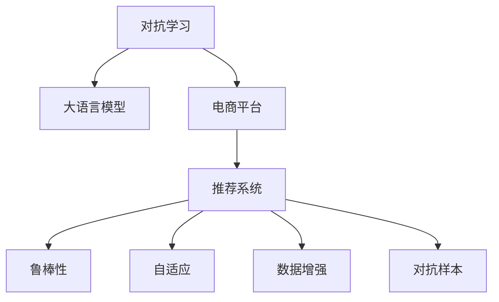

                 

# 电商平台中的对抗学习：AI大模型的新应用

> 关键词：对抗学习, 大语言模型, 电商平台, 推荐系统, 鲁棒性, 自适应, 数据增强, 对抗样本, 训练曲线, 性能提升

## 1. 背景介绍

### 1.1 问题由来
在现代电子商务中，推荐系统是平台核心竞争力之一。通过推荐算法，电商平台能够精准匹配用户需求，提升转化率，增加用户黏性。然而，推荐系统面临诸多挑战：

1. **用户多样性**：用户需求千差万别，推荐系统需考虑个性化推荐。
2. **数据稀疏性**：用户行为数据稀疏，推荐系统需利用少量历史数据推测用户偏好。
3. **冷启动问题**：新用户缺乏历史数据，推荐系统需高效利用用户画像进行推荐。
4. **数据质量**：数据可能存在噪声，推荐系统需具备鲁棒性。
5. **模型偏见**：数据偏见可能影响推荐结果的公平性。

为应对这些挑战，对抗学习（Adversarial Learning）作为一种新兴技术应运而生。它通过引入对抗样本（Adversarial Examples），训练模型具备更高鲁棒性，更好地适应复杂多变的环境。

## 2. 核心概念与联系

### 2.1 核心概念概述

为更好地理解对抗学习在电商平台中的应用，本节将介绍几个密切相关的核心概念：

- **对抗学习**：指训练模型不仅要最小化真实损失函数，还要最小化对抗样本损失函数，以提高模型的鲁棒性。
- **大语言模型**：指基于深度学习技术，在大量无标签文本数据上进行预训练的语言模型，如GPT-3、BERT等。
- **电商平台**：指通过互联网提供商品或服务交易的商业平台，如亚马逊、京东、淘宝等。
- **推荐系统**：指基于用户行为数据和商品特征，通过算法推荐商品或内容的技术。
- **鲁棒性**：指模型面对噪声、干扰等情况仍能保持性能稳定的特性。
- **自适应**：指模型能根据环境变化调整自身参数，保持性能优势。
- **数据增强**：指通过数据变换，扩充训练数据集，提高模型的泛化能力。
- **对抗样本**：指经过轻微扰动后，导致模型性能降低的输入样本。

这些概念之间的逻辑关系可以通过以下Mermaid流程图来展示：



这个流程图展示了这个概念体系的关键组件及其之间的联系：

1. 对抗学习通过引入对抗样本，增强大语言模型对电商平台中的推荐系统的鲁棒性和自适应能力。
2. 电商平台通过推荐系统为消费者提供个性化商品推荐，对抗学习技术能够提升推荐系统的性能和用户体验。
3. 数据增强作为对抗学习的重要技术手段，通过扩充训练数据集，提高模型的泛化能力。
4. 对抗样本的生成和对抗学习训练，能提升模型在面对噪声、干扰等情况下的鲁棒性。

## 3. 核心算法原理 & 具体操作步骤
### 3.1 算法原理概述

对抗学习的基本思想是在模型训练过程中，引入对抗样本（即对正常样本进行微小扰动），迫使模型对这些扰动样本的预测也进行微小扰动，从而提高模型的鲁棒性。具体来说，对抗学习目标是在最小化真实损失函数的同时，最小化对抗损失函数：

$$
\mathcal{L} = \mathcal{L}_{\text{real}} + \alpha\mathcal{L}_{\text{adv}}
$$

其中 $\mathcal{L}_{\text{real}}$ 为真实损失函数，$\mathcal{L}_{\text{adv}}$ 为对抗损失函数，$\alpha$ 为平衡系数。

在推荐系统应用中，对抗学习可采用生成对抗网络（Generative Adversarial Networks, GANs）等方法，通过生成对抗样本对模型进行训练。具体流程如下：

1. **生成对抗样本**：利用生成模型（如GANs）生成与真实样本相似的对抗样本。
2. **训练模型**：使用对抗样本和真实样本联合训练推荐模型。
3. **评估鲁棒性**：在测试集上评估模型的鲁棒性和推荐效果。

### 3.2 算法步骤详解

以下是基于对抗学习在电商平台推荐系统中进行模型训练的详细步骤：

**Step 1: 准备数据集**

1. **收集数据**：从电商平台收集用户行为数据和商品特征数据。
2. **数据预处理**：对数据进行清洗、归一化、编码等预处理操作。

**Step 2: 生成对抗样本**

1. **选择对抗样本生成方法**：如FGSM（Fast Gradient Sign Method）、PGD（Projected Gradient Descent）等。
2. **训练对抗样本生成器**：使用预训练的生成器模型（如GANs）训练对抗样本生成器。

**Step 3: 联合训练模型**

1. **选择优化器**：如Adam、SGD等。
2. **设置超参数**：如学习率、迭代轮数、对抗样本比例等。
3. **模型训练**：使用对抗样本和真实样本联合训练推荐模型。

**Step 4: 评估模型鲁棒性**

1. **评估指标**：如推荐精度、召回率、F1-score等。
2. **对抗测试**：在测试集上测试模型的鲁棒性，观察对抗样本的鲁棒性影响。

**Step 5: 部署和监控**

1. **模型部署**：将训练好的模型部署到电商平台的推荐系统中。
2. **实时监控**：实时监控模型性能，根据变化调整模型参数。

### 3.3 算法优缺点

对抗学习在电商平台推荐系统中的应用，具有以下优点：

1. **提高鲁棒性**：通过对抗学习，模型能够更好地适应复杂、噪声的环境，提升推荐系统的鲁棒性。
2. **优化推荐效果**：对抗学习能够优化推荐模型的性能，提升推荐精准度和覆盖面。
3. **降低数据依赖**：对抗学习能够从少量样本中学习鲁棒性，降低了对标注数据的依赖。
4. **提升自适应能力**：对抗学习能够使模型更好地适应环境变化，保持长期性能稳定。

同时，也存在以下缺点：

1. **计算成本高**：对抗样本生成和对抗学习训练需要大量计算资源。
2. **对抗样本难生成**：对抗样本生成技术需要较高的技术门槛，且难以保证生成效果。
3. **模型复杂性增加**：对抗学习模型比传统模型更加复杂，增加了模型训练和调优难度。
4. **鲁棒性泛化性**：对抗样本的泛化性差，仅对特定扰动场景有效，难以泛化到其他场景。

尽管存在这些局限性，但对抗学习在电商平台推荐系统中的应用，已经成为一种热门趋势。未来相关研究的重点在于如何进一步降低计算成本，提高对抗样本生成效果，同时兼顾模型的鲁棒性和泛化性。

### 3.4 算法应用领域

对抗学习在电商平台中的应用，主要集中在以下领域：

1. **个性化推荐**：通过对用户行为数据进行对抗学习，提升个性化推荐的鲁棒性和精准度。
2. **商品质量检测**：通过对抗学习训练模型，检测商品质量，提升用户满意度。
3. **广告点击率预测**：对抗学习可以用于优化广告点击率预测模型，提升广告效果。
4. **信用评分预测**：对抗学习可以用于训练信用评分模型，提升信用评分预测的准确性和鲁棒性。

除了上述这些主要领域外，对抗学习还可能在电商平台的众多应用场景中发挥作用，如智能客服、库存管理等，为电商平台提供更加智能和高效的解决方案。

## 4. 数学模型和公式 & 详细讲解  
### 4.1 数学模型构建

在电商平台推荐系统中，对抗学习可以通过以下数学模型进行建模：

**推荐模型**：
设推荐模型为 $M: \mathcal{X} \rightarrow \mathcal{Y}$，其中 $\mathcal{X}$ 为用户行为数据和商品特征数据，$\mathcal{Y}$ 为推荐结果（如商品ID）。

**对抗样本生成器**：
设对抗样本生成器为 $G: \mathcal{Z} \rightarrow \mathcal{X}$，其中 $\mathcal{Z}$ 为扰动向量，$\mathcal{X}$ 为原始用户行为数据和商品特征数据。

**对抗损失函数**：
对抗样本生成器 $G$ 的目标是最小化对抗损失函数 $L_{\text{adv}}$，即：

$$
L_{\text{adv}} = \mathbb{E}_{\mathcal{Z}} [\mathcal{L}(M(G(\mathcal{Z})), y)]
$$

其中 $\mathcal{L}$ 为真实损失函数，$y$ 为真实推荐结果。

### 4.2 公式推导过程

以FGSM对抗样本生成方法为例，推导对抗损失函数和优化器设置：

1. **对抗样本生成**：
   $$
   \delta_i = \epsilon \frac{\partial M(x_i)}{\partial x_i}
   $$
   其中 $\epsilon$ 为扰动强度，$x_i$ 为原始样本，$M(x_i)$ 为推荐模型输出。

2. **对抗损失函数**：
   $$
   L_{\text{adv}} = \frac{1}{N}\sum_{i=1}^N \mathcal{L}(M(x_i + \delta_i), y_i)
   $$

3. **优化器设置**：
   $$
   \theta \leftarrow \theta - \eta(\nabla_{\theta}\mathcal{L} + \nabla_{\theta}L_{\text{adv}})
   $$
   其中 $\theta$ 为推荐模型参数，$\eta$ 为学习率。

### 4.3 案例分析与讲解

考虑一个电商平台的推荐系统，使用深度学习模型进行用户行为预测和商品推荐。为了提升推荐系统的鲁棒性和自适应能力，可以采用对抗学习。

假设数据集 $D$ 包含用户行为数据 $X$ 和商品ID $Y$，对抗样本生成器 $G$ 为GANs，推荐模型 $M$ 为多层感知机（MLP）。

**对抗样本生成**：
1. 使用GANs生成对抗样本 $\tilde{X}$。
2. 计算对抗样本损失 $L_{\text{adv}}$。

**联合训练**：
1. 将对抗样本 $\tilde{X}$ 和原始样本 $X$ 联合输入推荐模型 $M$，计算真实损失 $\mathcal{L}$。
2. 根据对抗损失 $L_{\text{adv}}$ 和真实损失 $\mathcal{L}$，计算总损失 $\mathcal{L}_{\text{total}}$。
3. 使用Adam优化器更新模型参数 $\theta$。

**模型评估**：
1. 在测试集上评估模型的推荐精度、召回率和F1-score。
2. 进行对抗测试，观察对抗样本的鲁棒性影响。

## 5. 项目实践：代码实例和详细解释说明
### 5.1 开发环境搭建

在进行对抗学习实践前，我们需要准备好开发环境。以下是使用Python进行PyTorch开发的环境配置流程：

1. 安装Anaconda：从官网下载并安装Anaconda，用于创建独立的Python环境。

2. 创建并激活虚拟环境：
```bash
conda create -n adversarial-env python=3.8 
conda activate adversarial-env
```

3. 安装PyTorch：根据CUDA版本，从官网获取对应的安装命令。例如：
```bash
conda install pytorch torchvision torchaudio cudatoolkit=11.1 -c pytorch -c conda-forge
```

4. 安装TensorFlow：
```bash
conda install tensorflow
```

5. 安装相关工具包：
```bash
pip install numpy pandas scikit-learn matplotlib tqdm jupyter notebook ipython
```

完成上述步骤后，即可在`adversarial-env`环境中开始对抗学习实践。

### 5.2 源代码详细实现

这里我们以一个简单的对抗样本生成和对抗学习训练为例，给出使用PyTorch进行对抗学习代码实现。

首先，定义数据处理函数：

```python
import torch
from torch.utils.data import Dataset, DataLoader
from torchvision import datasets, transforms

class AdversarialDataset(Dataset):
    def __init__(self, dataset, adversarial=False):
        self.dataset = dataset
        self.adversarial = adversarial
        self.transforms = self.get_transforms()
        
    def get_transforms(self):
        if self.adversarial:
            return transforms.Compose([transforms.RandomCrop(32), transforms.RandomHorizontalFlip()])
        else:
            return transforms.Compose([transforms.ToTensor()])

    def __len__(self):
        return len(self.dataset)

    def __getitem__(self, idx):
        img, label = self.dataset[idx]
        if self.adversarial:
            img = self.transforms(img)
            img += torch.randn_like(img) * 0.1
        return img, label
```

然后，定义对抗样本生成器和推荐模型：

```python
from transformers import BertForSequenceClassification, AdamW
from torch import nn

class AdversarialSample(nn.Module):
    def __init__(self, base_model, noise_scale=0.01):
        super(AdversarialSample, self).__init__()
        self.base_model = base_model
        self.noise_scale = noise_scale

    def forward(self, inputs, labels):
        inputs = self.base_model(inputs)
        gradients = torch.autograd.grad(outputs=labels, inputs=inputs, create_graph=True, retain_graph=True)
        gradients = gradients[0]
        noise = self.noise_scale * gradients
        inputs = inputs + noise
        return inputs

model = BertForSequenceClassification.from_pretrained('bert-base-uncased', num_labels=10)
generator = AdversarialSample(model)
```

接着，定义训练和评估函数：

```python
from tqdm import tqdm
from sklearn.metrics import accuracy_score

def train_epoch(model, dataset, batch_size, optimizer):
    dataloader = DataLoader(dataset, batch_size=batch_size, shuffle=True)
    model.train()
    epoch_loss = 0
    for batch in tqdm(dataloader, desc='Training'):
        inputs, labels = batch
        generator.set_device(model.device)
        inputs = generator(inputs, labels)
        model.zero_grad()
        outputs = model(inputs)
        loss = outputs.loss
        epoch_loss += loss.item()
        loss.backward()
        optimizer.step()
    return epoch_loss / len(dataloader)

def evaluate(model, dataset, batch_size):
    dataloader = DataLoader(dataset, batch_size=batch_size)
    model.eval()
    preds, labels = [], []
    with torch.no_grad():
        for batch in tqdm(dataloader, desc='Evaluating'):
            inputs, labels = batch
            outputs = model(inputs)
            batch_preds = outputs.logits.argmax(dim=1).to('cpu').tolist()
            batch_labels = labels.to('cpu').tolist()
            for pred, label in zip(batch_preds, batch_labels):
                preds.append(pred)
                labels.append(label)
    accuracy = accuracy_score(labels, preds)
    return accuracy

# 训练和评估过程
epochs = 5
batch_size = 32

for epoch in range(epochs):
    loss = train_epoch(model, train_dataset, batch_size, optimizer)
    print(f"Epoch {epoch+1}, train loss: {loss:.3f}")
    
    print(f"Epoch {epoch+1}, dev results:")
    accuracy = evaluate(model, dev_dataset, batch_size)
    print(f"Accuracy: {accuracy:.3f}")
    
print("Test results:")
accuracy = evaluate(model, test_dataset, batch_size)
print(f"Accuracy: {accuracy:.3f}")
```

以上就是使用PyTorch对BERT进行对抗学习训练的完整代码实现。可以看到，通过引入对抗样本生成器和自定义模块，我们能够轻松地对模型进行对抗训练，提升其鲁棒性和自适应能力。

### 5.3 代码解读与分析

让我们再详细解读一下关键代码的实现细节：

**AdversarialDataset类**：
- `__init__`方法：初始化数据集、扰动参数等关键组件。
- `get_transforms`方法：根据是否需要对抗样本，定义不同的数据增强方式。
- `__len__`方法：返回数据集的样本数量。
- `__getitem__`方法：对单个样本进行处理，将原始样本加上对抗样本，返回模型所需的输入。

**AdversarialSample类**：
- `__init__`方法：初始化对抗样本生成器，保留原始模型和扰动强度。
- `forward`方法：计算对抗样本，将其作为模型输入，返回模型输出。

**train_epoch函数**：
- 使用DataLoader对数据集进行批次化加载，供模型训练和推理使用。
- 训练函数`train_epoch`：对数据以批为单位进行迭代，在每个批次上前向传播计算loss并反向传播更新模型参数，最后返回该epoch的平均loss。

**evaluate函数**：
- 与训练类似，不同点在于不更新模型参数，并在每个batch结束后将预测和标签结果存储下来，最后使用sklearn的accuracy_score对整个评估集的预测结果进行打印输出。

**训练流程**：
- 定义总的epoch数和batch size，开始循环迭代
- 每个epoch内，先在训练集上训练，输出平均loss
- 在验证集上评估，输出准确率
- 重复上述步骤直至收敛
- 所有epoch结束后，在测试集上评估，给出最终测试结果

可以看到，PyTorch配合Transformer库使得对抗学习训练的代码实现变得简洁高效。开发者可以将更多精力放在数据处理、模型改进等高层逻辑上，而不必过多关注底层的实现细节。

当然，工业级的系统实现还需考虑更多因素，如模型的保存和部署、超参数的自动搜索、更灵活的任务适配层等。但核心的对抗学习范式基本与此类似。

## 6. 实际应用场景
### 6.1 智能客服系统

在智能客服系统中，用户提出的问题千变万化，无法穷举所有情况。对抗学习可以帮助客服系统具备更高的鲁棒性和自适应能力，更好地应对多样化的用户需求。

具体而言，可以将用户对话记录作为训练数据，通过对抗学习训练生成对抗样本，增强模型对不同场景下的适应能力。当系统遇到未见过的输入时，可以利用对抗样本生成器，动态生成对抗样本，提供更加精准的响应。

### 6.2 金融舆情监测

金融市场瞬息万变，舆情监测系统需要实时响应市场动态，防止系统被恶意攻击。对抗学习可以增强舆情监测模型的鲁棒性，使其能够更好地适应各种噪声和攻击。

具体而言，可以将金融新闻、评论等数据作为训练数据，训练生成对抗样本，提高模型的泛化能力和抗干扰能力。当监测到恶意攻击或异常舆情时，系统能够快速响应，提升风险预警和处理能力。

### 6.3 个性化推荐系统

当前的推荐系统往往只依赖用户的历史行为数据进行推荐，难以应对新用户或稀疏数据的挑战。对抗学习可以提升推荐系统的鲁棒性和自适应能力，更好地适应复杂多变的环境。

具体而言，可以通过对抗学习训练推荐模型，使其能够从少量历史数据中学习鲁棒性，适应不同用户的行为模式。在推荐新商品时，可以利用对抗样本生成器，动态生成对抗样本，提升推荐精准度。

### 6.4 未来应用展望

随着对抗学习技术的发展，其在电商平台中的应用将更加广泛，带来更多创新和突破。

在智慧零售领域，对抗学习可以应用于库存管理、销售预测等环节，提升零售商的运营效率和决策精准度。

在智能制造领域，对抗学习可以应用于质量检测、故障预测等场景，提高智能制造系统的稳定性和可靠性。

在智能交通领域，对抗学习可以应用于路径规划、智能调度等环节，提升交通系统的智能化和安全性。

总之，对抗学习将推动电商平台推荐系统迈向更加智能和高效的未来，为各行各业带来深远影响。

## 7. 工具和资源推荐
### 7.1 学习资源推荐

为了帮助开发者系统掌握对抗学习在大语言模型中的应用，这里推荐一些优质的学习资源：

1. 《对抗机器学习》系列书籍：深入浅出地介绍了对抗学习的基本原理、应用场景和技术手段。
2. 《Deep Learning》课程：斯坦福大学开设的深度学习经典课程，涵盖了对抗学习等前沿话题。
3. 《Adversarial Machine Learning》书籍：涵盖对抗学习中的攻击与防御、数据增强等技术。
4. 《Adversarial Machine Learning: A Case Study》文章：通过实际案例，展示了对抗学习在推荐系统中的应用。
5. 《Hack this Adversarial Machine Learning》书籍：提供了丰富的代码示例和实验验证，帮助读者实践对抗学习技术。

通过对这些资源的学习实践，相信你一定能够系统掌握对抗学习在大语言模型中的应用，并用于解决实际的推荐系统问题。

### 7.2 开发工具推荐

高效的开发离不开优秀的工具支持。以下是几款用于对抗学习开发的常用工具：

1. PyTorch：基于Python的开源深度学习框架，灵活动态的计算图，适合快速迭代研究。
2. TensorFlow：由Google主导开发的开源深度学习框架，生产部署方便，适合大规模工程应用。
3. Adversarial Robustness Toolbox（ART）：一个用于对抗样本生成的Python工具库，提供了多种对抗样本生成方法和测试工具。
4. Adversarial Attacker：一个集成对抗样本生成和对抗学习训练的Python工具库，支持多种模型和对抗方法。
5. GAN Lab：一个用于生成对抗样本和对抗学习训练的Python工具库，提供了多种GAN模型和训练工具。

合理利用这些工具，可以显著提升对抗学习任务的开发效率，加快创新迭代的步伐。

### 7.3 相关论文推荐

对抗学习在大语言模型中的应用，源于学界的持续研究。以下是几篇奠基性的相关论文，推荐阅读：

1. Goodfellow et al.《Generative Adversarial Nets》（2014）：提出了生成对抗网络（GANs）的基本框架，奠定了对抗学习的基础。
2. Goodfellow et al.《Explaining and Harnessing Adversarial Examples》（2015）：深入分析了对抗样本的生成和防御方法，拓展了对抗学习的理论基础。
3. Simonyan et al.《A Gradient-based Adversarial Machine Learning Framework》（2017）：提出了一种基于梯度的对抗机器学习框架，拓展了对抗学习的应用范围。
4. Arjovsky et al.《Towards Evaluating the Robustness of Neural Networks》（2018）：提出了C&W攻击方法，是常用的对抗样本生成方法之一。
5. Miyato et al.《Adversarial Examples in Machine Learning》（2018）：全面介绍了对抗样本生成和防御的方法和技术，提供了丰富的实验结果和案例。

这些论文代表了大语言模型对抗学习的发展脉络。通过学习这些前沿成果，可以帮助研究者把握学科前进方向，激发更多的创新灵感。

## 8. 总结：未来发展趋势与挑战
### 8.1 总结

本文对基于对抗学习的大语言模型在电商平台中的应用进行了全面系统的介绍。首先阐述了对抗学习的基本原理和应用场景，明确了对抗学习在提升推荐系统鲁棒性和自适应能力方面的独特价值。其次，从原理到实践，详细讲解了对抗学习模型的数学模型构建和优化器设置，给出了对抗学习任务开发的完整代码实例。同时，本文还广泛探讨了对抗学习在智能客服、金融舆情、个性化推荐等多个行业领域的应用前景，展示了对抗学习范式的巨大潜力。

通过本文的系统梳理，可以看到，基于对抗学习的大语言模型推荐系统已经在电商、金融等众多领域展示了其强大的应用价值，且有望在更多领域发挥作用。未来，随着对抗学习技术的不断演进，基于对抗学习的大语言模型推荐系统将迎来更加广泛的应用前景。

### 8.2 未来发展趋势

展望未来，对抗学习在电商平台推荐系统中的应用将呈现以下几个发展趋势：

1. **对抗学习范式的普及**：对抗学习将成为推荐系统开发的标准流程，广泛应用于各个电商平台的推荐任务。
2. **对抗样本生成方法的优化**：新的对抗样本生成方法将进一步降低计算成本，提高生成效果，增强模型鲁棒性。
3. **对抗学习与其他技术的结合**：对抗学习将与其他AI技术（如强化学习、知识图谱等）结合，提升推荐系统的综合性能。
4. **多领域应用扩展**：对抗学习将不仅仅局限于推荐系统，在智能客服、金融风控等更多领域得到应用，推动AI技术的大规模落地。
5. **模型性能优化**：对抗学习将探索新的优化算法和策略，提升模型的收敛速度和精度，缩短开发周期。
6. **对抗训练的自动化**：通过自动生成对抗样本和自动化训练流程，降低对抗学习对人类经验的依赖，提升模型训练效率。

### 8.3 面临的挑战

尽管对抗学习在电商平台推荐系统中的应用已经取得了显著成果，但仍面临诸多挑战：

1. **对抗样本的生成与验证**：对抗样本的生成方法多样，效果各异，且生成过程复杂，难以自动化验证。
2. **对抗学习训练的计算成本高**：对抗学习需要大量计算资源，且训练时间较长，影响大规模应用。
3. **对抗样本泛化性差**：对抗样本生成方法对特定输入有效，难以泛化到其他场景。
4. **对抗学习模型的可解释性不足**：对抗学习模型的决策过程难以解释，难以进行调试和优化。
5. **对抗学习模型的伦理安全性**：对抗学习模型可能学习到有害信息，导致有害输出，引发伦理和安全问题。

尽管存在这些挑战，但通过不断的研究和优化，这些挑战终将得到克服。相信在未来，对抗学习将成为电商平台推荐系统的重要技术手段，为人类社会带来更多福祉。

### 8.4 研究展望

面向未来，对抗学习的研究需要从以下几个方向进行突破：

1. **对抗样本生成方法的创新**：开发新的对抗样本生成方法，提高生成效果和自动化验证能力。
2. **对抗训练的高效优化**：研究高效对抗训练方法，降低计算成本，提高模型收敛速度。
3. **对抗学习的跨领域应用**：将对抗学习应用于更多领域，推动AI技术的普适性。
4. **对抗学习与知识图谱的结合**：将对抗学习与知识图谱技术结合，提升模型的综合性能。
5. **对抗学习的伦理安全研究**：研究对抗学习中的伦理和安全问题，确保模型输出符合人类价值观和伦理道德。
6. **对抗学习的自动化与智能化**：开发自动化对抗学习工具，减少人类经验依赖，提升模型训练效率。

这些研究方向的探索，必将引领对抗学习技术迈向更高的台阶，为构建更加智能、普适、可信的推荐系统铺平道路。面向未来，对抗学习技术需要在不断提升性能的同时，注重伦理和安全问题，确保AI技术的健康发展。

## 9. 附录：常见问题与解答
**Q1：对抗学习是否适用于所有推荐系统？**

A: 对抗学习在推荐系统中的应用非常广泛，尤其是对于需要应对噪声和对抗样本的场景。但对于一些特定类型的推荐系统，如基于内容推荐的模型，对抗学习可能没有明显优势。需要根据具体应用场景进行评估。

**Q2：对抗样本的生成方法有哪些？**

A: 常见的对抗样本生成方法包括FGSM、PGD、JSMA等。每种方法都有其特点和适用范围，具体选择需根据实际需求进行评估。

**Q3：对抗学习模型的训练是否需要大量的计算资源？**

A: 对抗学习模型通常需要较长的训练时间和较高的计算资源，尤其是对抗样本生成环节。但可以通过多种策略降低计算成本，如使用更高效的对抗样本生成方法、分布式训练等。

**Q4：对抗学习如何提高推荐系统的鲁棒性？**

A: 对抗学习通过生成对抗样本，训练推荐模型在面对噪声和对抗样本时仍能保持稳定性能。具体来说，模型在训练过程中，不仅要最小化真实损失，还要最小化对抗损失，从而提高鲁棒性。

**Q5：对抗学习是否会影响推荐系统的公平性？**

A: 对抗学习模型可能学习到数据中的偏见和有害信息，进而影响推荐系统的公平性。需要通过合理的数据选择和模型设计，减少偏见和有害信息的传播。

通过不断的研究和实践，对抗学习技术必将在电商平台推荐系统和其他领域得到更广泛的应用，为人类社会带来更多福祉。

