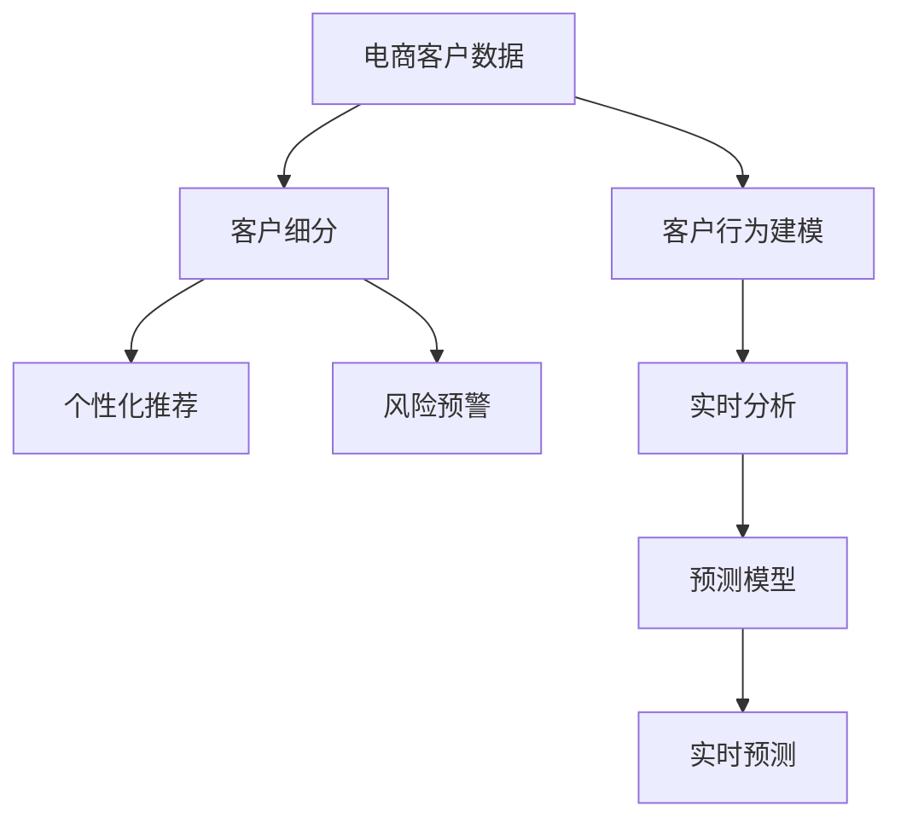

                 

# 电商平台中的智能客户分析技术

## 1. 背景介绍

在现代电商平台上，客户数据的精细化分析和利用，已经成为提升客户满意度、促进销售转化的重要手段。传统的客户分析方法往往依赖于人工干预和规则编写，无法实现自动化和智能化。而利用智能客户分析技术，可以充分利用海量客户数据，通过深度学习和数据挖掘等手段，全面理解客户行为特征和需求趋势，实现更精准的客户细分、个性化推荐和营销策略优化。

### 1.1 问题由来

随着电商行业的发展，用户行为和需求日益多样化，单一的标签和简单的规则已经难以满足业务需求。如何利用数据驱动的方式，深入挖掘客户行为背后的隐含信息，预测其未来需求，是电商企业面临的共同挑战。

### 1.2 问题核心关键点

智能客户分析技术的主要核心在于：

- 数据的自动收集和清洗，确保分析结果的准确性和完整性。
- 客户行为的深度建模，挖掘客户的长期行为模式和短期偏好。
- 智能分群和个性化推荐，针对不同客户群体提供定制化服务。
- 实时分析和预警，及时识别异常行为和潜在风险。

这些核心点共同构成了智能客户分析系统的骨架，使其能够在电商场景中发挥重要作用。

## 2. 核心概念与联系

### 2.1 核心概念概述

为了更好地理解智能客户分析技术，本节将介绍几个密切相关的核心概念：

- 电商客户数据：包括用户的浏览记录、购买历史、评分评价、社交媒体互动等行为数据，以及用户的基本信息、地域、年龄、性别等人口统计信息。
- 客户行为建模：利用机器学习模型对客户行为进行建模，挖掘客户的长期和短期行为模式，预测其未来的购买意愿和行为变化。
- 客户细分：根据客户的特征和行为数据，将客户群体划分为多个细分市场，实现对客户需求的精准把握。
- 个性化推荐：针对不同客户群体，提供个性化的商品推荐和营销活动，提升客户满意度和忠诚度。
- 风险预警：通过监控客户的异常行为，及时发现潜在风险，如欺诈、流失等，防止损失扩大。
- 实时分析：利用流计算和在线分析技术，对客户数据进行实时处理和分析，快速响应业务需求。

这些核心概念之间的逻辑关系可以通过以下Mermaid流程图来展示：



这个流程图展示了一些关键概念的逻辑关系：

1. 电商客户数据是分析和建模的基础。
2. 客户行为建模挖掘客户长期行为模式和短期偏好。
3. 客户细分将客户划分为不同群体，提供精准的个性化服务。
4. 个性化推荐基于细分结果，提升客户满意度和忠诚度。
5. 风险预警及时发现异常行为，防止潜在风险。
6. 实时分析利用流计算和在线分析技术，快速响应业务需求。

这些概念共同构成了智能客户分析系统的核心功能，使其能够全方位地提升电商平台的客户体验和业务效率。

## 3. 核心算法原理 & 具体操作步骤
### 3.1 算法原理概述

智能客户分析技术的核心在于对客户数据的深度建模和分析。其核心算法原理主要包括以下几个方面：

- 深度学习：利用神经网络模型对客户行为数据进行建模，挖掘客户的长期行为模式和短期偏好。
- 关联规则挖掘：从客户历史行为数据中提取关联规则，实现对客户需求的深入理解。
- 协同过滤：利用用户行为数据进行推荐，发现用户间的潜在相似性，进行个性化推荐。
- 集成学习：结合多种模型进行联合预测，提升模型的准确性和鲁棒性。
- 实时分析：利用流计算和在线分析技术，对客户数据进行实时处理和分析，快速响应业务需求。

### 3.2 算法步骤详解

基于智能客户分析技术，电商平台客户分析的一般流程包括以下几个关键步骤：

**Step 1: 数据收集与清洗**
- 从电商平台的前端、后端以及第三方数据源，收集客户的基本信息、行为数据、社交媒体数据等。
- 对数据进行清洗和预处理，去除重复、缺失、异常值等，确保数据的质量和一致性。

**Step 2: 客户行为建模**
- 利用深度学习模型（如循环神经网络、长短期记忆网络）对客户行为数据进行建模，提取客户的长期行为模式和短期偏好。
- 将客户行为数据转化为模型友好的数值特征，包括但不限于浏览时长、购买频率、点击次数等。

**Step 3: 客户细分**
- 利用聚类算法（如K-means、层次聚类）对客户进行分群，根据客户的特征和行为数据，将客户划分为不同的细分市场。
- 根据分群结果，分析每个细分市场的客户需求和行为特征，形成详细的客户画像。

**Step 4: 个性化推荐**
- 基于客户画像和行为数据，利用协同过滤等算法，对每个客户进行个性化推荐。
- 根据推荐结果，调整商品展示和广告投放策略，提升客户转化率和满意度。

**Step 5: 风险预警**
- 利用异常检测算法（如孤立森林、自组织映射）监控客户的异常行为，及时发现潜在风险。
- 根据异常行为，采取相应的措施，如预警、拦截等，防止损失扩大。

**Step 6: 实时分析**
- 利用流计算和在线分析技术，对客户数据进行实时处理和分析，生成实时报告和预警。
- 根据实时分析结果，动态调整推荐策略和营销活动，提升业务效率和客户体验。

### 3.3 算法优缺点

智能客户分析技术具有以下优点：
1. 自动化程度高：利用机器学习模型自动分析客户数据，减少了人工干预和规则编写的工作量。
2. 个性化程度高：能够根据客户画像进行个性化推荐，提升客户满意度和忠诚度。
3. 实时响应能力强：利用流计算和在线分析技术，能够快速响应业务需求，及时调整策略。
4. 精确度高：利用深度学习等高级算法，能够更精准地挖掘客户行为模式和需求。

同时，该方法也存在一定的局限性：
1. 数据质量要求高：客户数据的准确性和完整性直接影响分析结果的准确性。
2. 模型复杂度高：深度学习和复杂算法的训练和维护成本较高。
3. 隐私保护问题：客户数据的敏感性和隐私保护问题需要严格控制和处理。
4. 过度拟合风险：过度依赖数据和模型，可能导致过拟合和泛化能力不足。
5. 算法透明性不足：黑盒模型难以解释其内部决策逻辑，不利于理解和调试。

尽管存在这些局限性，但智能客户分析技术仍是大数据和深度学习在电商场景中的重要应用。未来相关研究的重点在于如何进一步降低数据质量要求，提高模型透明性和可解释性，同时兼顾隐私保护和成本控制等因素。

### 3.4 算法应用领域

智能客户分析技术已经在电商平台的各个环节得到了广泛应用，例如：

- 用户画像构建：利用客户行为数据，构建用户画像，理解客户需求和行为特征。
- 个性化推荐：根据用户画像，提供个性化商品推荐，提升客户转化率和满意度。
- 精准营销：基于客户细分结果，设计精准的营销活动，提升营销效果。
- 流失预警：识别潜在流失客户，及时采取措施，提升客户保留率。
- 广告投放优化：利用用户行为数据，优化广告投放策略，提升广告投放效果。
- 库存管理：基于客户需求预测，优化库存管理和补货策略，提升运营效率。
- 价格优化：根据客户行为数据，动态调整商品价格，提升销售效果。

除了上述这些应用外，智能客户分析技术还被创新性地应用于供应链优化、客户关系管理、品牌建设等电商场景，为电商企业带来了深远的业务变革。

## 4. 数学模型和公式 & 详细讲解 & 举例说明

### 4.1 数学模型构建

在本节中，我们将通过数学语言对智能客户分析技术进行更加严格的刻画。

假设电商平台的客户数据为 $D=\{(x_i, y_i)\}_{i=1}^N$，其中 $x_i$ 为客户的特征向量，$y_i$ 为客户的购买行为。设 $\theta$ 为模型的参数向量，利用深度学习模型 $M_{\theta}$ 对客户行为进行建模，则模型的损失函数为：

$$
\mathcal{L}(\theta) = -\frac{1}{N}\sum_{i=1}^N \log P(y_i|x_i; \theta)
$$

其中 $P(y_i|x_i; \theta)$ 为模型在输入 $x_i$ 下的条件概率分布。

### 4.2 公式推导过程

以下我们以循环神经网络（RNN）为例，推导客户行为建模的数学模型。

假设客户行为数据为时间序列 $X=(x_1, x_2, ..., x_T)$，其中 $x_t$ 为时间 $t$ 的客户行为特征。利用循环神经网络，模型对客户行为序列进行建模，得到模型参数 $\theta$ 和隐藏状态 $h_t$。根据条件概率分布，模型在时间 $t$ 的预测结果为 $P(y_t|x_t, h_t; \theta)$。利用交叉熵损失函数，模型的损失函数为：

$$
\mathcal{L}(\theta) = -\frac{1}{N}\sum_{i=1}^N \sum_{t=1}^T \log P(y_t|x_t, h_t; \theta)
$$

其中 $y_t$ 为时间 $t$ 的客户购买行为。

### 4.3 案例分析与讲解

为了更好地理解智能客户分析技术，下面以电商平台的个性化推荐系统为例，进行详细讲解。

假设电商平台的数据集 $D$ 包含用户的浏览记录和购买历史。利用深度学习模型对用户行为进行建模，得到模型参数 $\theta$。将用户的行为特征 $x$ 输入模型，得到预测结果 $y$。根据用户的购买历史，将用户划分为不同的细分市场，形成客户画像。利用协同过滤算法，对每个用户进行个性化推荐，生成推荐列表 $R$。最终，根据用户的点击行为和反馈数据，调整推荐策略和模型参数，提升推荐效果。

## 5. 项目实践：代码实例和详细解释说明
### 5.1 开发环境搭建

在进行智能客户分析技术开发前，我们需要准备好开发环境。以下是使用Python进行TensorFlow和PyTorch开发的环境配置流程：

1. 安装Anaconda：从官网下载并安装Anaconda，用于创建独立的Python环境。

2. 创建并激活虚拟环境：
```bash
conda create -n customer_analysis_env python=3.8 
conda activate customer_analysis_env
```

3. 安装TensorFlow和PyTorch：根据CUDA版本，从官网获取对应的安装命令。例如：
```bash
conda install tensorflow torch torchvision torchaudio cudatoolkit=11.1 -c pytorch -c conda-forge
```

4. 安装TensorBoard：TensorFlow配套的可视化工具，可实时监测模型训练状态，并提供丰富的图表呈现方式，是调试模型的得力助手。

5. 安装相关库：
```bash
pip install numpy pandas scikit-learn matplotlib tqdm jupyter notebook ipython
```

完成上述步骤后，即可在`customer_analysis_env`环境中开始智能客户分析技术的开发。

### 5.2 源代码详细实现

这里我们以电商平台的个性化推荐系统为例，给出使用TensorFlow和PyTorch进行开发的Python代码实现。

首先，定义推荐系统的输入输出格式：

```python
class InputExample(object):
    def __init__(self, user_id, item_id, time戳):
        self.user_id = user_id
        self.item_id = item_id
        self.time戳 = 时间戳
        self.label = 1

class InputFeatures(object):
    def __init__(self, user_id, item_id, time戳, label):
        self.user_id = user_id
        self.item_id = item_id
        self.time戳 = 时间戳
        self.label = label
```

然后，定义数据处理函数：

```python
def process_data(data, max_len=128):
    examples = []
    for user_id, item_ids, time_stamps in data:
        for item_id, time_stamp in zip(item_ids, time_stamps):
            examples.append(
                InputExample(user_id, item_id, time_stamp))
    features = []
    for example in examples:
        features.append(
            InputFeatures(
                user_id=example.user_id,
                item_id=example.item_id,
                time戳=example.time戳,
                label=1))
    return features

# 将特征转换为TensorFlow的输入格式
def convert_examples_to_features(examples, max_len=128):
    features = []
    for example in examples:
        feature = {
            "user_id": example.user_id,
            "item_id": example.item_id,
            "time戳": example.time戳,
            "label": example.label
        }
        feature["input_ids"] = [0] + example.item_id + [0] * (max_len - len(example.item_id) - 1)
        feature["input_mask"] = [1] * (max_len)
        feature["segment_ids"] = [0] * (max_len)
        features.append(feature)
    return features
```

接着，定义模型和优化器：

```python
from tensorflow.keras.layers import Input, Embedding, LSTM, Dense
from tensorflow.keras.models import Model
from tensorflow.keras.optimizers import Adam

# 定义模型输入
input_user = Input(shape=(max_len,))
input_item = Input(shape=(max_len,))

# 定义嵌入层
user_embed = Embedding(num_users, embed_dim, input_length=max_len)(input_user)
item_embed = Embedding(num_items, embed_dim, input_length=max_len)(input_item)

# 定义LSTM层
lstm = LSTM(hidden_size, return_sequences=True)([item_embed, user_embed])

# 定义输出层
output = Dense(1, activation='sigmoid')(lstm)

# 定义模型
model = Model(inputs=[input_user, input_item], outputs=output)

# 定义优化器
optimizer = Adam(lr=1e-4)
```

最后，定义训练和评估函数：

```python
from tensorflow.keras.callbacks import EarlyStopping
from sklearn.metrics import roc_auc_score

# 定义训练函数
def train(model, features, epochs, batch_size):
    model.compile(optimizer=optimizer, loss='binary_crossentropy', metrics=['auc'])
    model.fit(features, labels, epochs=epochs, batch_size=batch_size)

# 定义评估函数
def evaluate(model, features, batch_size):
    y_pred = model.predict(features, batch_size=batch_size)
    auc = roc_auc_score(labels, y_pred)
    return auc
```

完成上述代码实现后，即可启动模型训练和评估。

### 5.3 代码解读与分析

让我们再详细解读一下关键代码的实现细节：

**InputExample类**：
- 定义了电商用户和商品的特征和标签。

**process_data函数**：
- 将用户行为数据转化为模型友好的输入格式。

**convert_examples_to_features函数**：
- 将特征转化为TensorFlow的输入格式。

**模型定义**：
- 利用嵌入层和LSTM层对用户和商品的行为序列进行建模。
- 最后利用Dense层进行二分类预测。

**训练函数**：
- 使用Adam优化器，二分类交叉熵损失函数，评估指标为auc。
- 设置EarlyStopping回调，防止过拟合。

**评估函数**：
- 利用模型对特征进行预测，计算auc指标。

以上代码实现了使用TensorFlow进行电商用户行为建模和个性化推荐的基本流程。通过合理配置超参数，可以进一步优化模型性能，实现更好的个性化推荐效果。

## 6. 实际应用场景
### 6.1 智能客服系统

智能客服系统是电商平台上客户服务的重要组成部分。通过智能客户分析技术，可以实现以下功能：

- 自动化的客户服务：利用智能客户分析技术，可以自动理解客户的问题和需求，并提供相应的解决方案。
- 实时客户反馈分析：分析客户在聊天中的反馈，及时调整服务策略，提升客户满意度。
- 客户行为预测：通过分析客户的历史行为数据，预测客户可能提出的问题，提前做好准备。

### 6.2 个性化推荐系统

电商平台的核心功能之一是推荐系统。通过智能客户分析技术，可以实现以下功能：

- 个性化商品推荐：根据客户画像和行为数据，提供个性化商品推荐，提升客户转化率和满意度。
- 实时推荐更新：利用流计算技术，实时更新推荐列表，确保推荐结果的及时性和准确性。
- 协同过滤：利用用户行为数据进行推荐，发现用户间的潜在相似性，进行个性化推荐。

### 6.3 智能营销活动

智能营销活动是电商平台提升用户参与度和忠诚度的重要手段。通过智能客户分析技术，可以实现以下功能：

- 客户细分：利用聚类算法对客户进行分群，设计有针对性的营销活动。
- 个性化营销内容：根据客户画像和行为数据，生成个性化营销内容，提升客户参与度。
- 营销效果评估：利用A/B测试等方法，评估营销活动的效果，及时调整策略。

### 6.4 未来应用展望

随着智能客户分析技术的不断发展，其在电商场景中的应用将更加广泛和深入。未来，智能客户分析技术有望在以下领域取得突破：

1. 多模态数据融合：结合用户行为数据、社交媒体数据、购物车数据等多模态信息，提供更加全面的客户画像。
2. 实时可视化：利用可视化技术，对客户行为进行实时展示和分析，辅助业务决策。
3. 联合预测：结合多种预测模型，提升预测准确性和鲁棒性。
4. 强化学习：利用强化学习技术，实现动态调整推荐策略和营销活动。
5. 联邦学习：利用联邦学习技术，保护用户隐私的同时，提升推荐效果和模型泛化能力。
6. 知识图谱：利用知识图谱技术，结合专家知识，提升推荐系统的智能化水平。

这些趋势展示了智能客户分析技术未来发展的广阔前景，将为电商企业带来更多的商业价值和创新应用。

## 7. 工具和资源推荐
### 7.1 学习资源推荐

为了帮助开发者系统掌握智能客户分析技术的理论基础和实践技巧，这里推荐一些优质的学习资源：

1. 《深度学习》课程：斯坦福大学开设的深度学习课程，有Lecture视频和配套作业，带你入门深度学习的基本概念和经典模型。

2. 《TensorFlow实战》书籍：TensorFlow官方发布的实战指南，详细介绍了TensorFlow的核心功能和应用场景，是TensorFlow开发者的必备资料。

3. 《深度学习与推荐系统》书籍：该书详细介绍了深度学习在推荐系统中的应用，是推荐系统开发者的必备参考资料。

4. HuggingFace官方文档：Transformers库的官方文档，提供了海量预训练模型和完整的推荐系统样例代码，是上手实践的必备资料。

5. Kaggle竞赛：参加Kaggle的推荐系统竞赛，可以学习到推荐系统的最新算法和实践经验，提升实战能力。

通过对这些资源的学习实践，相信你一定能够快速掌握智能客户分析技术的精髓，并用于解决实际的电商问题。

### 7.2 开发工具推荐

高效的开发离不开优秀的工具支持。以下是几款用于智能客户分析技术开发的常用工具：

1. TensorFlow：由Google主导开发的开源深度学习框架，生产部署方便，适合大规模工程应用。

2. PyTorch：基于Python的开源深度学习框架，灵活动态的计算图，适合快速迭代研究。

3. Keras：高层次的深度学习API，易于使用，适合快速开发和原型验证。

4. Jupyter Notebook：交互式的开发环境，支持Python、R等多种语言，方便调试和分享代码。

5. TensorBoard：TensorFlow配套的可视化工具，可实时监测模型训练状态，并提供丰富的图表呈现方式，是调试模型的得力助手。

合理利用这些工具，可以显著提升智能客户分析技术开发的效率，加快创新迭代的步伐。

### 7.3 相关论文推荐

智能客户分析技术的发展源于学界的持续研究。以下是几篇奠基性的相关论文，推荐阅读：

1. "Collaborative Filtering for Implicit Feedback Datasets"：该文提出协同过滤算法，利用用户行为数据进行推荐，是推荐系统研究的基础。

2. "A Survey on Multi-Modal Recommendation Systems"：该文综述了多模态推荐系统的研究进展，为多模态数据融合提供了理论基础。

3. "A Deep Learning Approach for Recommender Systems"：该文详细介绍了深度学习在推荐系统中的应用，展示了深度学习模型的强大预测能力。

4. "A Survey on Deep Learning for Recommender Systems"：该文综述了深度学习在推荐系统中的应用，展示了深度学习模型的最新进展。

这些论文代表了大数据和深度学习在电商场景中的研究进展，展示了推荐系统的最新趋势和应用方向。通过学习这些前沿成果，可以帮助研究者把握学科前进方向，激发更多的创新灵感。

## 8. 总结：未来发展趋势与挑战
### 8.1 研究成果总结

本文对智能客户分析技术进行了全面系统的介绍。首先阐述了智能客户分析技术的研究背景和意义，明确了技术在提升客户满意度、促进销售转化方面的独特价值。其次，从原理到实践，详细讲解了智能客户分析技术的数学模型和关键步骤，给出了推荐系统开发的完整代码实例。同时，本文还广泛探讨了智能客户分析技术在智能客服、个性化推荐、智能营销等多个电商场景中的应用前景，展示了技术的应用潜力。此外，本文精选了推荐技术的各类学习资源，力求为读者提供全方位的技术指引。

通过本文的系统梳理，可以看到，智能客户分析技术正在成为电商推荐系统的核心技术，极大地拓展了推荐系统的应用边界，催生了更多的落地场景。受益于大数据和深度学习的不断进步，推荐系统必将在更广阔的应用领域发挥重要作用。

### 8.2 未来发展趋势

展望未来，智能客户分析技术将呈现以下几个发展趋势：

1. 数据规模持续增大。随着数据采集技术的进步和业务场景的丰富，用户行为数据将不断增长，为推荐系统提供更丰富的数据支撑。

2. 深度学习模型不断进步。随着深度学习模型的不断演进，推荐系统的效果将进一步提升，能够更好地捕捉用户行为和需求的变化。

3. 多模态数据融合。结合用户行为数据、社交媒体数据、购物车数据等多模态信息，提供更加全面的客户画像，提升推荐系统的智能化水平。

4. 实时分析与预测。利用流计算和在线分析技术，对客户数据进行实时处理和分析，快速响应业务需求，提升推荐系统的时效性。

5. 协同过滤和集成学习。结合多种推荐算法，提升推荐系统的鲁棒性和泛化能力，提高推荐效果。

6. 用户反馈机制。利用用户反馈机制，不断优化推荐策略，提升推荐系统的个性化水平。

7. 联邦学习和隐私保护。利用联邦学习技术，保护用户隐私的同时，提升推荐系统的模型泛化能力。

以上趋势展示了智能客户分析技术未来发展的广阔前景，将为电商企业带来更多的商业价值和创新应用。

### 8.3 面临的挑战

尽管智能客户分析技术已经取得了显著成果，但在迈向更加智能化、普适化应用的过程中，仍面临诸多挑战：

1. 数据质量和一致性问题。用户行为数据的准确性和一致性直接影响推荐效果，数据清洗和处理工作量较大。

2. 模型复杂度和训练成本。深度学习模型参数量庞大，训练和维护成本较高，需要高效的优化算法和硬件支持。

3. 用户隐私保护。用户行为数据的敏感性和隐私保护问题需要严格控制和处理，需要平衡隐私保护和模型效果。

4. 模型泛化能力不足。推荐系统需要应对复杂多变的业务场景，模型的泛化能力和鲁棒性不足。

5. 推荐结果解释性不足。推荐系统输出结果缺乏可解释性，不利于业务理解和用户信任。

6. 资源消耗问题。推荐系统需要大量计算资源，如何高效利用计算资源，优化推荐策略，是一个重要的研究方向。

7. 跨平台兼容性和可扩展性。推荐系统需要适应多种业务平台和场景，如何实现跨平台兼容性和系统可扩展性，是一个重要的挑战。

正视智能客户分析技术面临的这些挑战，积极应对并寻求突破，将是大数据和深度学习在电商场景中的重要方向。相信随着学界和产业界的共同努力，这些挑战终将一一被克服，智能客户分析技术必将在构建人机协同的智能时代中扮演越来越重要的角色。

### 8.4 研究展望

面向未来，智能客户分析技术需要在以下几个方向寻求新的突破：

1. 探索更高效的推荐算法。结合强化学习、博弈论等方法，提升推荐系统的实时性和优化能力。

2. 引入更多先验知识。结合知识图谱、逻辑规则等专家知识，引导推荐系统学习更准确、合理的用户行为模型。

3. 融合因果分析和强化学习。利用因果推断和强化学习思想，增强推荐系统的因果关系和优化能力，提升推荐效果和鲁棒性。

4. 引入主动学习机制。利用主动学习技术，根据用户反馈，动态调整推荐策略和模型参数，提升推荐系统的个性化水平。

5. 优化推荐结果解释性。利用可解释性技术，增强推荐系统输出结果的解释性，提高用户信任和满意度。

6. 引入跨模态数据融合技术。结合用户行为数据、社交媒体数据、购物车数据等多模态信息，提供更加全面的客户画像，提升推荐系统的智能化水平。

这些研究方向将引领智能客户分析技术迈向更高的台阶，为电商企业带来更多的商业价值和创新应用。

## 9. 附录：常见问题与解答

**Q1：智能客户分析技术是否适用于所有电商业务场景？**

A: 智能客户分析技术在大多数电商业务场景中都能取得不错的效果，特别是在用户行为数据丰富的场景下。但对于一些特殊场景，如C2C交易平台、二手交易平台等，由于用户行为数据稀疏，推荐系统效果可能受到影响。因此，需要根据具体业务场景，选择合适的算法和数据处理策略。

**Q2：如何选择推荐系统的评估指标？**

A: 推荐系统的评估指标包括准确率、召回率、F1分数、NDCG等。选择合适的评估指标需要考虑具体业务需求和场景。对于电商业务，一般关注点击率、转化率等业务指标，选择ROC-AUC、NDCG等综合指标进行评估。

**Q3：如何缓解推荐系统中的冷启动问题？**

A: 冷启动问题是推荐系统面临的常见问题，即新用户或新商品缺乏足够的行为数据，难以进行推荐。常见的缓解方法包括：
1. 利用标签信息：为新用户或新商品添加标签，提高数据稀疏度。
2. 利用内容信息：利用商品描述、图片等内容的相似性，进行推荐。
3. 利用协同过滤：利用用户对相似商品的兴趣，进行推荐。
4. 利用在线学习：利用用户反馈，不断更新模型，提高推荐效果。

这些方法可以结合使用，缓解推荐系统中的冷启动问题。

**Q4：如何提升推荐系统的实时性？**

A: 推荐系统的实时性可以通过以下几个方法进行提升：
1. 利用流计算技术：利用实时数据流，进行实时处理和分析，快速响应业务需求。
2. 利用在线学习技术：利用用户反馈，不断更新模型，提高实时性。
3. 利用近似算法：利用近似算法，减少计算资源消耗，提高实时性。

通过以上方法，可以显著提升推荐系统的实时性，满足电商业务的实时需求。

**Q5：如何保护用户隐私？**

A: 用户隐私保护是推荐系统的重要问题，需要采用多种方法进行保护。常用的隐私保护方法包括：
1. 数据匿名化：对用户数据进行匿名化处理，保护用户隐私。
2. 差分隐私：利用差分隐私技术，对用户数据进行噪声添加，保护用户隐私。
3. 联邦学习：利用联邦学习技术，保护用户隐私的同时，提升推荐系统的效果。

这些方法可以结合使用，保护用户隐私，提升推荐系统的安全性。

---

作者：禅与计算机程序设计艺术 / Zen and the Art of Computer Programming

