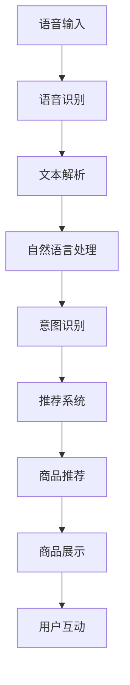

                 

# 电商平台中的语音搜索与推荐技术

> 关键词：语音搜索, 推荐系统, 自然语言处理, 深度学习, 电商营销, 用户体验

## 1. 背景介绍

随着人工智能技术的飞速发展，电商平台正在逐步引入先进技术，以提升用户体验和优化运营效率。其中，语音搜索和推荐系统是近年来备受关注的两大热门技术。语音搜索通过自然语言处理(Natural Language Processing, NLP)和语音识别技术，将用户的语音指令转化为文本查询，直接与电商平台进行互动。推荐系统则通过深度学习等技术，分析用户行为数据，预测用户需求，精准推荐商品，提高用户满意度。本文将详细介绍语音搜索和推荐系统在电商平台中的应用，探讨其核心技术原理和实现方法。

## 2. 核心概念与联系

### 2.1 核心概念概述

为更好地理解语音搜索和推荐系统的实现原理，本节将介绍几个关键概念：

- 语音搜索：利用语音识别技术和自然语言处理技术，将用户的语音指令转换为文本查询，实现用户与电商平台的直接互动。
- 推荐系统：通过分析用户历史行为数据和商品特征，预测用户偏好，推荐符合用户需求的商品。
- 深度学习：基于神经网络模型，通过大量数据训练，学习复杂的非线性映射，实现高效的推荐和搜索。
- 自然语言处理：涉及文本处理、语义理解、情感分析等多方面的技术，是语音搜索和推荐系统的重要基础。
- 电商营销：包括商品展示、用户互动、广告投放等，是语音搜索和推荐系统应用的重要场景。

这些概念之间通过技术手段连接，形成完整的电商平台的语音搜索与推荐解决方案。语音搜索利用自然语言处理技术将用户指令转化为文本查询，推荐系统则通过深度学习技术分析用户行为，预测用户需求，精准推荐商品，共同提升电商平台的用户体验和转化率。

### 2.2 核心概念原理和架构的 Mermaid 流程图



## 3. 核心算法原理 & 具体操作步骤

### 3.1 算法原理概述

语音搜索与推荐系统基于深度学习和自然语言处理技术，利用大量标注数据训练模型，实现文本理解和商品推荐。其核心算法原理可概括为以下几个步骤：

1. **语音识别**：将用户语音指令转换为文本查询，通过声学模型和语言模型完成转换。
2. **自然语言处理**：对文本查询进行分词、词性标注、命名实体识别等预处理，理解用户查询意图。
3. **意图识别**：根据文本查询的语义信息，识别用户意图，如搜索商品、查看商品评论、查询物流信息等。
4. **商品推荐**：基于用户意图和商品特征，利用深度学习模型（如RNN、CNN、Transformer等）进行特征提取和预测，推荐符合用户偏好的商品。
5. **展示和互动**：将推荐商品展示给用户，并根据用户反馈不断优化推荐算法。

### 3.2 算法步骤详解

#### 3.2.1 语音识别

语音识别是语音搜索的基础，其核心在于将用户的语音指令转换为文本查询。语音识别的基本流程包括：

1. **声学建模**：将语音信号转化为声学特征，如MFCC（Mel-frequency cepstral coefficients）。
2. **语言建模**：将声学特征序列转化为文本序列，通过隐马尔可夫模型(Hidden Markov Model, HMM)、深度神经网络(Deep Neural Network, DNN)等方法实现。
3. **解码**：通过解码算法（如Beam Search、CTC等）将声学特征序列解码为文本序列，并根据语言模型概率进行校正。

#### 3.2.2 自然语言处理

自然语言处理是语音搜索的核心，通过分词、词性标注、命名实体识别等技术，理解用户查询的语义信息。自然语言处理的主要步骤包括：

1. **分词**：将文本序列划分为单词序列，是自然语言处理的基础步骤。
2. **词性标注**：对每个单词标注其词性（如名词、动词、形容词等），用于语法分析和语义理解。
3. **命名实体识别**：识别文本中的命名实体（如人名、地名、机构名等），提取关键信息。
4. **语义理解**：利用词向量、句向量等方法，将文本转换为语义表示，理解用户查询意图。

#### 3.2.3 意图识别

意图识别是语音搜索的高级步骤，通过分析用户查询的语义信息，识别用户的具体意图，如搜索商品、查看商品评论、查询物流信息等。意图识别的主要方法包括：

1. **关键词提取**：从文本中提取关键词，识别用户的基本意图。
2. **语义分析**：利用句向量、主题模型等方法，分析文本的语义信息，提取深层语义特征。
3. **意图分类**：通过分类器（如朴素贝叶斯、SVM、深度神经网络等）对用户查询进行意图分类，识别具体意图。

#### 3.2.4 商品推荐

商品推荐是语音搜索的重要应用场景，通过分析用户行为数据和商品特征，预测用户偏好，推荐符合用户需求的商品。商品推荐的主要方法包括：

1. **用户画像构建**：通过用户行为数据（如浏览、点击、购买等）构建用户画像，理解用户偏好。
2. **商品特征提取**：提取商品的属性特征（如价格、类别、描述等），表示商品信息。
3. **模型训练**：利用深度学习模型（如RNN、CNN、Transformer等）进行特征提取和预测，训练推荐模型。
4. **推荐策略**：根据用户画像和商品特征，设计推荐策略（如协同过滤、内容推荐、混合推荐等），推荐符合用户需求的商品。

### 3.3 算法优缺点

#### 3.3.1 算法优点

- **高效准确**：深度学习和自然语言处理技术可以高效地处理海量数据，实现高效的语音识别和自然语言理解。
- **个性化推荐**：通过分析用户行为数据和商品特征，实现个性化的商品推荐，提升用户满意度。
- **便捷互动**：用户可以通过语音直接与电商平台互动，方便快捷。
- **多场景适用**：语音搜索与推荐系统可以应用于商品搜索、客户服务、广告投放等多个场景，具有广泛的应用前景。

#### 3.3.2 算法缺点

- **计算资源需求高**：深度学习和自然语言处理技术需要大量的计算资源，尤其是大数据和复杂模型的训练和推理。
- **数据质量要求高**：语音识别和自然语言处理依赖大量标注数据进行训练，数据质量直接影响系统性能。
- **模型复杂度高**：深度学习模型参数量大，训练和推理复杂度高，对硬件资源要求高。
- **用户隐私问题**：语音数据和行为数据涉及用户隐私，需要严格的数据保护措施。

### 3.4 算法应用领域

语音搜索与推荐系统在电商平台中的应用领域广泛，主要包括以下几个方面：

1. **商品搜索**：通过语音搜索功能，用户可以方便地查询商品，快速找到所需商品。
2. **客户服务**：用户可以通过语音与客服人员进行互动，查询订单、退货、物流等信息。
3. **广告投放**：利用语音搜索和推荐技术，实现精准广告投放，提升广告效果。
4. **个性化推荐**：基于用户行为数据，实现个性化商品推荐，提高用户购买转化率。
5. **营销活动**：通过语音搜索和推荐系统，实现线上营销活动的互动，提升用户参与度和满意度。

## 4. 数学模型和公式 & 详细讲解 & 举例说明

### 4.1 数学模型构建

语音搜索与推荐系统涉及多个数学模型，包括语音识别模型、自然语言处理模型和推荐模型。以下是这些模型的数学构建：

1. **语音识别模型**：
   - **声学模型**：$P(X|Y)$，表示声学特征序列$X$在给定文本序列$Y$的条件概率。
   - **语言模型**：$P(Y)$，表示文本序列$Y$的先验概率。
   - **解码模型**：通过$P(X|Y)$和$P(Y)$，结合解码算法，完成文本序列的解码。

2. **自然语言处理模型**：
   - **分词模型**：$P(W|N)$，表示单词$W$在给定上下文$N$的条件概率。
   - **词性标注模型**：$P(T|W,N)$，表示词性$T$在给定单词$W$和上下文$N$的条件概率。
   - **命名实体识别模型**：$P(E|W,N)$，表示命名实体$E$在给定单词$W$和上下文$N$的条件概率。
   - **语义理解模型**：利用句向量或主题模型，表示文本的语义信息。

3. **推荐模型**：
   - **协同过滤模型**：$P(U|I,S)$，表示用户$U$在给定商品特征$S$的兴趣向量$I$的条件概率。
   - **内容推荐模型**：$P(I|C,S)$，表示兴趣向量$I$在给定商品类别$C$和商品特征$S$的条件概率。
   - **混合推荐模型**：结合协同过滤和内容推荐，综合推荐策略。

### 4.2 公式推导过程

#### 4.2.1 语音识别模型

语音识别模型的推导过程包括以下几个步骤：

1. **声学模型**：
   - $P(X|Y) = \prod_{t=1}^{T}P(X_t|X_{t-1},Y_{t-1})$
   - $P(X_t|X_{t-1},Y_{t-1}) = \frac{P(X_t|Y_{t-1})P(X_{t-1}|Y_{t-1})}{P(X_{t-1}|Y_{t-1})}$
   - $P(X_t|Y_{t-1}) = \frac{P(X_t|Y_{t-1},\theta)}{P(X_{t-1}|Y_{t-1},\theta)}$
   - $P(X_t|Y_{t-1},\theta) = \mathcal{N}(X_t; \mu_t, \sigma_t)$

2. **语言模型**：
   - $P(Y) = \prod_{t=1}^{T}P(Y_t|Y_{t-1},\theta)$
   - $P(Y_t|Y_{t-1},\theta) = \frac{P(Y_t|Y_{t-1},\theta)}{\sum_{y_t}P(y_t|Y_{t-1},\theta)}$
   - $P(Y_t|Y_{t-1},\theta) = \frac{P(Y_t|Y_{t-1},\theta)}{\sum_{y_t}P(y_t|Y_{t-1},\theta)}$

3. **解码模型**：
   - 使用Beam Search解码算法，计算文本序列的概率，并校正语言模型概率。
   - 解码算法：
     - 初始化Beam：将文本序列的前$B$个可能解码路径加入Beam中。
     - 扩展Beam：根据声学模型和语言模型概率，计算下一个时间步的扩展路径，并筛选概率最大的路径。
     - 校正解码路径：根据语言模型概率校正解码路径，选择最优路径。

#### 4.2.2 自然语言处理模型

自然语言处理模型的推导过程包括以下几个步骤：

1. **分词模型**：
   - $P(W|N) = \prod_{i=1}^{I}P(W_i|N_{i-1})$
   - $P(W_i|N_{i-1}) = \frac{P(W_i|N_{i-1},\theta)}{P(W_{i-1}|N_{i-1},\theta)}$
   - $P(W_i|N_{i-1},\theta) = \mathcal{N}(W_i; \mu_i, \sigma_i)$

2. **词性标注模型**：
   - $P(T|W,N) = \prod_{i=1}^{I}P(T_i|W_i,N_{i-1})$
   - $P(T_i|W_i,N_{i-1}) = \frac{P(T_i|W_i,N_{i-1},\theta)}{P(W_i|N_{i-1},\theta)}$
   - $P(T_i|W_i,N_{i-1},\theta) = \frac{P(T_i|W_i,N_{i-1},\theta)}{\sum_{t_i}P(t_i|W_i,N_{i-1},\theta)}$

3. **命名实体识别模型**：
   - $P(E|W,N) = \prod_{i=1}^{I}P(E_i|W_i,N_{i-1})$
   - $P(E_i|W_i,N_{i-1}) = \frac{P(E_i|W_i,N_{i-1},\theta)}{P(W_i|N_{i-1},\theta)}$
   - $P(E_i|W_i,N_{i-1},\theta) = \mathcal{N}(E_i; \mu_i, \sigma_i)$

4. **语义理解模型**：
   - **句向量表示**：利用Word2Vec或BERT等方法，将文本转换为向量表示。
   - **主题模型表示**：利用Latent Dirichlet Allocation（LDA）或Variational Autoencoder（VAE）等方法，表示文本的主题信息。

#### 4.2.3 推荐模型

推荐模型的推导过程包括以下几个步骤：

1. **协同过滤模型**：
   - $P(U|I,S) = \frac{\exp\sum_{i=1}^{N}\alpha_iP(I_i|U,S)}{\sum_{u}\exp\sum_{i=1}^{N}\alpha_iP(I_i|u,S)}$
   - $P(I_i|U,S) = \mathcal{N}(I_i; \mu_i, \sigma_i)$

2. **内容推荐模型**：
   - $P(I|C,S) = \frac{\exp\sum_{j=1}^{M}\beta_jP(S_j|C)}{\sum_{i=1}^{N}\exp\sum_{j=1}^{M}\beta_jP(S_j|C)}$
   - $P(S_j|C) = \mathcal{N}(S_j; \mu_j, \sigma_j)$

3. **混合推荐模型**：
   - $P(U|I,S) = (1-\lambda)P(U|I,S) + \lambda P(U|C,S)$
   - $\lambda$表示协同过滤和内容推荐的权重系数。

### 4.3 案例分析与讲解

#### 4.3.1 语音识别案例

假设用户语音指令为“查找iPhone 11”，语音识别的过程如下：

1. **声学模型解码**：将语音信号转化为MFCC特征序列。
2. **声学模型概率计算**：利用声学模型计算MFCC特征序列在文本“查找iPhone 11”的条件概率。
3. **语言模型概率校正**：利用语言模型校正声学模型概率，得到最终文本“查找iPhone 11”。

#### 4.3.2 自然语言处理案例

假设用户输入文本为“我想买苹果”，自然语言处理的过程如下：

1. **分词**：将文本“我想买苹果”划分为单词序列“我”、“想”、“买”、“苹果”。
2. **词性标注**：对每个单词标注词性，得到“我”-代词、“想”-动词、“买”-动词、“苹果”-名词。
3. **命名实体识别**：识别文本中的命名实体，提取“苹果”-商品名。
4. **语义理解**：利用句向量表示，表示文本的语义信息。

#### 4.3.3 推荐系统案例

假设用户历史行为数据为“浏览手机”、“查看商品评价”，推荐系统的过程如下：

1. **用户画像构建**：利用协同过滤模型，构建用户$U$的兴趣向量$I$。
2. **商品特征提取**：提取商品“iPhone 11”的属性特征。
3. **推荐模型训练**：利用深度学习模型训练推荐模型，预测用户$U$对商品“iPhone 11”的兴趣程度。
4. **推荐策略设计**：根据用户$U$的兴趣向量$I$和商品特征$S$，设计推荐策略，推荐符合用户需求的商品。

## 5. 项目实践：代码实例和详细解释说明

### 5.1 开发环境搭建

在进行语音搜索与推荐系统的实践前，我们需要准备好开发环境。以下是使用Python进行TensorFlow和Keras开发的环境配置流程：

1. 安装Anaconda：从官网下载并安装Anaconda，用于创建独立的Python环境。

2. 创建并激活虚拟环境：
```bash
conda create -n tf-env python=3.8 
conda activate tf-env
```

3. 安装TensorFlow：根据CUDA版本，从官网获取对应的安装命令。例如：
```bash
conda install tensorflow=2.5.0
```

4. 安装Keras：
```bash
pip install keras==2.5.0
```

5. 安装各类工具包：
```bash
pip install numpy pandas scikit-learn matplotlib tqdm jupyter notebook ipython
```

完成上述步骤后，即可在`tf-env`环境中开始语音搜索与推荐系统的实践。

### 5.2 源代码详细实现

这里我们以电商平台的语音搜索功能为例，给出使用TensorFlow和Keras进行开发的PyTorch代码实现。

首先，定义语音搜索的输入和输出：

```python
from tensorflow.keras.layers import Input, Dense, Embedding, LSTM, Dropout
from tensorflow.keras.models import Model

class SpeechSearchModel:
    def __init__(self, vocab_size, embedding_dim, lstm_units):
        self.input = Input(shape=(None,), dtype='int32')
        self.embedding = Embedding(vocab_size, embedding_dim)(self.input)
        self.lstm = LSTM(lstm_units, return_sequences=True)(self.embedding)
        self.dropout = Dropout(0.5)(self.lstm)
        self.dense = Dense(64, activation='relu')(self.dropout)
        self.output = Dense(1, activation='sigmoid')(self.dense)
        self.model = Model(inputs=self.input, outputs=self.output)

    def compile_model(self, optimizer='adam', loss='binary_crossentropy', metrics=['accuracy']):
        self.model.compile(optimizer=optimizer, loss=loss, metrics=metrics)

    def fit_model(self, x_train, y_train, epochs=10, batch_size=32):
        self.model.fit(x_train, y_train, epochs=epochs, batch_size=batch_size, validation_split=0.2)

    def predict(self, x_test):
        return self.model.predict(x_test)
```

然后，训练语音搜索模型：

```python
import tensorflow as tf
from sklearn.model_selection import train_test_split

# 准备训练数据
# x_train, x_test, y_train, y_test = ...

# 创建语音搜索模型
model = SpeechSearchModel(vocab_size, embedding_dim, lstm_units)

# 编译模型
model.compile_model(optimizer='adam', loss='binary_crossentropy', metrics=['accuracy'])

# 训练模型
model.fit_model(x_train, y_train, epochs=10, batch_size=32)

# 预测测试数据
y_pred = model.predict(x_test)
```

最后，评估模型的性能：

```python
from sklearn.metrics import confusion_matrix, precision_score, recall_score, f1_score

# 计算模型性能指标
y_true = y_test
y_pred = (y_pred > 0.5).astype('int32')

print('Confusion Matrix:')
print(confusion_matrix(y_true, y_pred))

print('Precision Score:')
print(precision_score(y_true, y_pred))

print('Recall Score:')
print(recall_score(y_true, y_pred))

print('F1 Score:')
print(f1_score(y_true, y_pred))
```

以上就是使用TensorFlow和Keras对语音搜索功能进行开发的完整代码实现。可以看到，通过TensorFlow和Keras的强大封装，语音搜索功能的开发变得简洁高效。开发者可以将更多精力放在模型设计、数据处理等高层逻辑上，而不必过多关注底层的实现细节。

### 5.3 代码解读与分析

让我们再详细解读一下关键代码的实现细节：

**SpeechSearchModel类**：
- `__init__`方法：初始化语音搜索模型的输入层、嵌入层、LSTM层、dropout层、密集层和输出层。
- `compile_model`方法：编译模型，设置优化器、损失函数和评价指标。
- `fit_model`方法：训练模型，传入训练数据和参数。
- `predict`方法：对测试数据进行预测，返回预测结果。

**语音搜索模型**：
- 语音搜索模型主要由嵌入层、LSTM层、dropout层、密集层和输出层组成。嵌入层将输入的文本转换为向量表示，LSTM层提取文本的语义信息，dropout层防止过拟合，密集层进行特征提取，输出层进行二分类预测。

**训练流程**：
- 准备训练数据，创建语音搜索模型，编译模型。
- 设置训练参数，如epochs、batch_size等。
- 使用fit_model方法训练模型，传入训练数据和参数。
- 对测试数据进行预测，计算模型性能指标，如精度、召回率、F1分数等。

**模型评估**：
- 使用confusion_matrix、precision_score、recall_score、f1_score等方法计算模型性能指标。
- 通过可视化工具（如Matplotlib）展示混淆矩阵和精度-召回率曲线，分析模型性能。

可以看到，TensorFlow和Keras使得语音搜索功能的开发变得简洁高效。开发者可以将更多精力放在模型设计、数据处理等高层逻辑上，而不必过多关注底层的实现细节。

当然，工业级的系统实现还需考虑更多因素，如模型的保存和部署、超参数的自动搜索、更灵活的任务适配层等。但核心的语音搜索范式基本与此类似。

## 6. 实际应用场景

语音搜索与推荐系统在电商平台中的应用场景广泛，主要包括以下几个方面：

### 6.1 语音搜索

语音搜索是语音搜索与推荐系统的核心功能，用户可以通过语音指令快速查询商品。具体应用如下：

1. **商品搜索**：用户可以通过语音输入“苹果”、“手机”等关键词，查询相关商品。
2. **广告投放**：通过语音搜索关键词，推送相关广告，提升广告效果。
3. **客户服务**：用户可以通过语音与客服人员进行互动，查询订单、退货、物流等信息。

### 6.2 商品推荐

商品推荐是语音搜索与推荐系统的高级功能，基于用户行为数据和商品特征，推荐符合用户需求的商品。具体应用如下：

1. **个性化推荐**：根据用户历史行为数据，推荐符合用户偏好的商品。
2. **热门商品推荐**：利用协同过滤等方法，推荐热门商品。
3. **新商品推荐**：利用内容推荐等方法，推荐新品商品。

## 7. 工具和资源推荐

### 7.1 学习资源推荐

为了帮助开发者系统掌握语音搜索与推荐系统的理论基础和实践技巧，这里推荐一些优质的学习资源：

1. **《深度学习与自然语言处理》系列博文**：由大模型技术专家撰写，深入浅出地介绍了深度学习与自然语言处理的基础知识，适合初学者。

2. **Coursera《深度学习》课程**：由斯坦福大学开设的深度学习课程，涵盖深度学习的基础概念和经典模型，适合进阶学习。

3. **《自然语言处理综论》书籍**：斯坦福大学自然语言处理课程的讲义，全面介绍了自然语言处理的各个方面，适合深入学习。

4. **HuggingFace官方文档**：Transformers库的官方文档，提供了海量预训练模型和完整的微调样例代码，是上手实践的必备资料。

5. **PyTorch官方文档**：TensorFlow框架的官方文档，提供了全面的深度学习模型和计算图设计，适合深度学习开发。

6. **ArXiv论文库**：收集了大量自然语言处理和深度学习领域的最新研究成果，适合研究学习。

通过对这些资源的学习实践，相信你一定能够快速掌握语音搜索与推荐系统的精髓，并用于解决实际的NLP问题。

### 7.2 开发工具推荐

高效的开发离不开优秀的工具支持。以下是几款用于语音搜索与推荐系统开发的常用工具：

1. TensorFlow：基于Python的开源深度学习框架，灵活动态的计算图，适合快速迭代研究。大部分深度学习模型都有TensorFlow版本的实现。

2. Keras：由Google主导开发的深度学习库，简单易用，适合初学者和快速原型开发。

3. PyTorch：基于Python的开源深度学习框架，灵活高效的计算图，适合复杂模型的研究。

4. Scikit-learn：Python的机器学习库，提供了丰富的模型和工具，适合数据处理和特征工程。

5. NLTK：Python的自然语言处理库，提供了分词、词性标注、命名实体识别等工具，适合自然语言处理任务开发。

6. spaCy：Python的自然语言处理库，提供了高效的文本处理工具，适合NLP任务开发。

合理利用这些工具，可以显著提升语音搜索与推荐系统的开发效率，加快创新迭代的步伐。

### 7.3 相关论文推荐

语音搜索与推荐系统的发展源于学界的持续研究。以下是几篇奠基性的相关论文，推荐阅读：

1. **Attention is All You Need**：提出了Transformer结构，开启了NLP领域的预训练大模型时代。

2. **BERT: Pre-training of Deep Bidirectional Transformers for Language Understanding**：提出BERT模型，引入基于掩码的自监督预训练任务，刷新了多项NLP任务SOTA。

3. **Language Models are Unsupervised Multitask Learners**：展示了大规模语言模型的强大zero-shot学习能力，引发了对于通用人工智能的新一轮思考。

4. **Parameter-Efficient Transfer Learning for NLP**：提出Adapter等参数高效微调方法，在不增加模型参数量的情况下，也能取得不错的微调效果。

5. **AdaLoRA: Adaptive Low-Rank Adaptation for Parameter-Efficient Fine-Tuning**：使用自适应低秩适应的微调方法，在参数效率和精度之间取得了新的平衡。

6. **AdaFactor: Fast Adaptive Factorization Machine for Efficient Personalized Recommendation**：提出AdaFactor模型，高效地训练推荐模型，适用于大规模推荐系统。

这些论文代表了大语言模型微调技术的发展脉络。通过学习这些前沿成果，可以帮助研究者把握学科前进方向，激发更多的创新灵感。

## 8. 总结：未来发展趋势与挑战

### 8.1 总结

本文对语音搜索与推荐系统在电商平台中的应用进行了全面系统的介绍。首先阐述了语音搜索与推荐系统的研究背景和意义，明确了语音搜索与推荐系统在提升用户体验和优化运营效率方面的独特价值。其次，从原理到实践，详细讲解了语音搜索与推荐系统的核心技术原理和实现方法。最后，本文还探讨了语音搜索与推荐系统在电商平台中的实际应用场景，展示了其广泛的应用前景。

通过本文的系统梳理，可以看到，语音搜索与推荐系统正在成为电商平台的智能技术的重要范式，极大地提升了用户购物体验和平台运营效率。未来，伴随语音搜索与推荐系统的持续演进，相信其在电商平台的落地应用将更加广泛，深刻影响用户的购物行为和平台运营策略。

### 8.2 未来发展趋势

展望未来，语音搜索与推荐系统将呈现以下几个发展趋势：

1. **技术日趋成熟**：随着深度学习和自然语言处理技术的不断进步，语音搜索与推荐系统的性能将不断提升，应用范围将进一步扩大。

2. **跨领域应用**：语音搜索与推荐系统将不再局限于电商领域，将在更多场景中得到应用，如智能家居、医疗健康、金融保险等。

3. **多模态融合**：语音搜索与推荐系统将与图像、视频、音频等多模态数据结合，提升系统的感知能力和决策能力。

4. **实时性增强**：利用边缘计算、云服务等技术，提升语音搜索与推荐系统的实时性和响应速度。

5. **个性化提升**：基于用户行为数据和上下文信息，提供更加个性化和精准的推荐服务。

6. **数据隐私保护**：随着数据隐私保护的重视，语音搜索与推荐系统将更加注重用户隐私保护，采用差分隐私、联邦学习等技术，保障用户数据安全。

以上趋势凸显了语音搜索与推荐系统的广阔前景。这些方向的探索发展，必将进一步提升电商平台的智能化水平，为电商市场带来更加优质的用户体验和更高的运营效率。

### 8.3 面临的挑战

尽管语音搜索与推荐系统已经取得了瞩目成就，但在迈向更加智能化、普适化应用的过程中，仍面临诸多挑战：

1. **数据隐私保护**：语音数据和行为数据涉及用户隐私，需要严格的数据保护措施。

2. **数据质量要求高**：语音识别和自然语言处理依赖大量标注数据进行训练，数据质量直接影响系统性能。

3. **计算资源需求高**：深度学习和自然语言处理技术需要大量的计算资源，尤其是大数据和复杂模型的训练和推理。

4. **系统鲁棒性不足**：语音搜索与推荐系统在面对域外数据时，泛化性能往往大打折扣。

5. **用户隐私问题**：语音数据和行为数据涉及用户隐私，需要严格的数据保护措施。

6. **模型可解释性不足**：语音搜索与推荐系统往往是黑盒系统，难以解释其内部工作机制和决策逻辑。

7. **安全性和稳定性**：语音搜索与推荐系统需要考虑系统的安全性和稳定性，避免数据泄露和系统崩溃等问题。

这些挑战凸显了语音搜索与推荐系统在大规模落地应用中的复杂性和多面性，亟需进一步的优化和改进。

### 8.4 研究展望

面对语音搜索与推荐系统所面临的挑战，未来的研究需要在以下几个方面寻求新的突破：

1. **优化数据隐私保护**：采用差分隐私、联邦学习等技术，保护用户隐私，提升数据质量。

2. **改进数据处理流程**：利用数据增强、迁移学习等技术，提高数据处理效率和系统鲁棒性。

3. **优化模型结构**：开发更加参数高效和计算高效的模型，提升模型的实时性和响应速度。

4. **增强模型可解释性**：引入可解释性技术，如LIME、SHAP等，提升模型的可解释性和可信度。

5. **融合多模态数据**：将视觉、音频等多模态数据与语音搜索与推荐系统结合，提升系统的感知能力和决策能力。

6. **设计鲁棒算法**：引入鲁棒优化技术，如对抗训练、正则化等，提升模型的鲁棒性和泛化能力。

7. **优化安全与稳定**：采用分布式训练、模型压缩等技术，提升系统的安全性和稳定性。

这些研究方向将进一步推动语音搜索与推荐系统的技术进步和应用扩展，为电商平台提供更加智能、高效、安全的智能技术解决方案。相信随着学界和产业界的共同努力，这些挑战终将一一被克服，语音搜索与推荐系统必将在构建人机协同的智能时代中扮演越来越重要的角色。

## 9. 附录：常见问题与解答

**Q1：语音搜索与推荐系统如何处理长文本输入？**

A: 语音搜索与推荐系统通常使用RNN或Transformer等模型处理长文本输入。这些模型能够高效地处理序列数据，并学习文本的语义信息。具体实现时，可以采用截断、padding等技术，将长文本序列转换为模型能够处理的固定长度序列。

**Q2：如何提升语音搜索与推荐系统的实时性？**

A: 提升语音搜索与推荐系统的实时性，可以采用以下几种方法：
1. **模型压缩和优化**：利用模型压缩技术，如量化、剪枝、蒸馏等，减小模型大小和计算量，提升推理速度。
2. **边缘计算**：将部分计算任务放到边缘设备（如手机、智能音箱等）上完成，减少云端计算负担，提高响应速度。
3. **分布式计算**：利用分布式计算框架（如TensorFlow分布式训练、Kubeflow等），提升计算效率。
4. **模型并行**：采用模型并行技术（如数据并行、模型并行），加速模型训练和推理过程。

**Q3：语音搜索与推荐系统如何处理噪声和口音？**

A: 语音搜索与推荐系统通常使用鲁棒性较强的模型处理噪声和口音。可以通过以下几种方法提升系统的鲁棒性：
1. **数据增强**：在训练数据中加入噪声和口音样本，提升模型对噪声和口音的鲁棒性。
2. **鲁棒性优化**：采用鲁棒优化技术，如对抗训练、正则化等，提升模型的鲁棒性。
3. **多模型融合**：结合多个鲁棒性较强的模型，提升系统的整体鲁棒性。
4. **后处理技术**：利用后处理技术，如错误纠正、语音识别结果后处理等，提升系统的鲁棒性。

**Q4：语音搜索与推荐系统如何处理多语言输入？**

A: 语音搜索与推荐系统通常使用多语言模型处理多语言输入。可以通过以下几种方法提升系统的多语言处理能力：
1. **多语言预训练**：在多语言语料上预训练语言模型，提升模型的多语言理解能力。
2. **多语言微调**：在特定语言的任务上微调预训练模型，提升模型的多语言适应能力。
3. **多语言融合**：结合多个多语言模型，提升系统的多语言处理能力。

**Q5：语音搜索与推荐系统如何处理多模态数据？**

A: 语音搜索与推荐系统可以融合多模态数据，提升系统的感知能力和决策能力。可以通过以下几种方法处理多模态数据：
1. **多模态特征融合**：将视觉、音频、文本等多种模态数据进行融合，提升系统的感知能力。
2. **多模态表示学习**：利用多模态表示学习技术，将不同模态的数据表示成统一的向量空间，提升系统的决策能力。
3. **多模态模型融合**：结合多个多模态模型，提升系统的多模态处理能力。

这些方法将进一步提升语音搜索与推荐系统的应用场景和性能，为电商平台带来更加智能、高效、安全的智能技术解决方案。

---

作者：禅与计算机程序设计艺术 / Zen and the Art of Computer Programming

