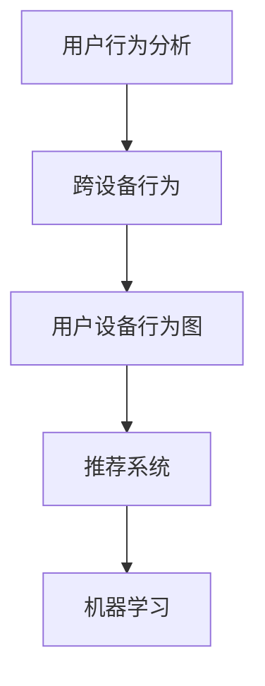

                 

# 电商平台中的跨设备用户行为分析技术

> 关键词：电商平台,用户行为分析,跨设备,大数据,机器学习,推荐系统

## 1. 背景介绍

随着移动互联网的普及和智能设备的增多，用户跨越不同设备进行购物的趋势日益明显。如何在多设备环境下进行用户行为分析，提升电商平台的用户体验和转化率，成为了一个重要的研究方向。传统的用户行为分析方法往往基于单个设备数据，难以捕捉到用户在多个设备上的行为模式。因此，本文将重点介绍一种基于多设备用户数据的跨设备用户行为分析技术，通过构建用户设备行为图，结合机器学习算法，实现对用户跨设备行为的全景分析。

## 2. 核心概念与联系

### 2.1 核心概念概述

本节将介绍几个与跨设备用户行为分析相关的核心概念：

- **用户行为分析**：通过对用户在电商平台上的操作行为（如浏览、点击、购买等）进行记录和分析，获取用户的兴趣偏好、购买力等信息，帮助电商平台进行个性化推荐、流量优化等。
- **跨设备行为**：指用户在多个设备（如手机、平板、PC等）上进行购物的行为，每个设备上的行为数据可以相互补充，提高用户行为分析的准确性和全面性。
- **用户设备行为图**：将用户和设备连接起来，构建一个多节点（用户、设备）图，记录用户在不同设备上的行为轨迹和交互情况。
- **推荐系统**：通过分析用户行为数据，对用户进行画像构建，实现商品推荐，提升用户的购物体验和转化率。
- **机器学习**：用于构建用户行为模型，预测用户行为，实现个性化推荐和广告投放等。

这些概念之间的逻辑关系可以通过以下Mermaid流程图来展示：



### 2.2 核心概念原理和架构

用户设备行为图是由用户、设备和行为构成的一个多节点图。每个用户节点对应一个唯一的ID，设备节点记录用户使用的设备（如手机、平板、PC等）信息，行为节点记录用户在设备上执行的操作（如浏览、点击、购买等）。不同设备上的行为数据可以互相连接，形成一个动态的行为图。

例如，用户A在手机、平板和PC上进行购物，设备节点为Phone、Tablet、PC，行为节点为浏览、点击、购买。行为图可以表示为：

```
UserA -> [Phone] -> [浏览] -> [点击] -> [购买]
UserA -> [Tablet] -> [浏览] -> [购买]
UserA -> [PC] -> [浏览]
```

通过构建用户设备行为图，可以更全面地分析用户在多个设备上的行为模式，提升用户行为分析的准确性和完整性。

## 3. 核心算法原理 & 具体操作步骤

### 3.1 算法原理概述

跨设备用户行为分析算法的基本原理是通过构建用户设备行为图，结合机器学习算法，预测用户在不同设备上的行为，提升推荐系统的个性化推荐效果。具体步骤包括数据收集、行为图构建、特征提取和模型训练四个环节。

### 3.2 算法步骤详解

#### 3.2.1 数据收集

数据收集是跨设备用户行为分析的第一步。需要从用户的多个设备上收集其行为数据，包括设备ID、用户ID、行为类型、行为时间、行为参数等。可以使用SDK、API等方式进行数据采集，并存储在分布式存储系统中，如Hadoop、Spark等。

#### 3.2.2 行为图构建

行为图构建是指将用户和设备行为数据进行关联，形成一个多节点图。可以通过以下步骤构建行为图：

1. 提取设备ID和用户ID：从行为数据中提取设备ID和用户ID，去除重复数据。
2. 构建设备图：将设备ID和行为ID关联，形成一个设备图，记录设备上的行为序列。
3. 构建用户图：将用户ID和设备ID关联，形成一个用户图，记录用户在不同设备上的行为轨迹。
4. 合并设备图和用户图：将设备图和用户图合并，形成一个多节点图，记录用户在不同设备上的行为轨迹和设备信息。

#### 3.2.3 特征提取

特征提取是指从行为图和用户数据中提取有用的特征，供机器学习算法使用。常用的特征包括：

1. 设备信息：设备类型、设备操作系统、设备屏幕尺寸等。
2. 行为类型：浏览、点击、购买等。
3. 行为时间：行为发生的时间，可以用于计算用户活跃时间段。
4. 行为参数：行为发生时的参数，如浏览时间、点击次数等。
5. 行为序列：行为序列可以用于分析用户在不同设备上的行为模式。

#### 3.2.4 模型训练

模型训练是指使用机器学习算法对用户行为数据进行建模，预测用户在不同设备上的行为。常用的机器学习算法包括：

1. 协同过滤算法：通过分析用户行为数据，构建用户和物品的协同矩阵，预测用户对物品的评分。
2. 深度学习算法：使用深度神经网络，对用户行为数据进行建模，预测用户的行为类型和行为时间。
3. 图神经网络算法：使用图神经网络，对用户设备行为图进行建模，预测用户在不同设备上的行为模式。

### 3.3 算法优缺点

#### 3.3.1 优点

1. **全面性**：跨设备用户行为分析可以全面分析用户在不同设备上的行为，提高用户行为分析的准确性。
2. **个性化推荐**：通过构建用户设备行为图，可以更好地理解用户在不同设备上的行为模式，实现更精准的个性化推荐。
3. **实时性**：数据采集和行为图构建可以在实时进行，及时获取用户行为数据，提高推荐系统的响应速度。

#### 3.3.2 缺点

1. **数据采集难度大**：需要从多个设备上采集用户行为数据，数据采集难度较大。
2. **数据隐私问题**：用户设备行为图可能包含用户隐私信息，需要采取相应的隐私保护措施。
3. **模型复杂度高**：机器学习模型较复杂，需要更多的计算资源和时间进行训练和预测。

### 3.4 算法应用领域

跨设备用户行为分析技术在多个领域都有广泛的应用，例如：

1. **个性化推荐**：通过对用户在不同设备上的行为进行建模，实现更精准的商品推荐，提升用户的购物体验和转化率。
2. **流量优化**：通过分析用户在不同设备上的行为模式，优化网站的流量分配，提高网站的访问量和用户活跃度。
3. **广告投放**：通过分析用户在不同设备上的行为数据，优化广告投放策略，提升广告的点击率和转化率。
4. **用户体验优化**：通过分析用户在不同设备上的行为模式，优化网站和应用的布局和设计，提升用户体验。
5. **营销活动评估**：通过分析用户在不同设备上的行为数据，评估营销活动的效果，优化营销策略。

## 4. 数学模型和公式 & 详细讲解 & 举例说明

### 4.1 数学模型构建

用户设备行为图可以用一个多节点图来表示，每个节点表示一个用户或设备，每条边表示用户在不同设备上的行为。例如，用户A在手机、平板和PC上进行购物，设备节点为Phone、Tablet、PC，行为节点为浏览、点击、购买，可以表示为：

```
UserA -> [Phone] -> [浏览] -> [点击] -> [购买]
UserA -> [Tablet] -> [浏览] -> [购买]
UserA -> [PC] -> [浏览]
```

在实际应用中，可以使用图数据库（如Neo4j、OrientDB等）来存储用户设备行为图，方便进行图分析和查询。

### 4.2 公式推导过程

假设有用户A和设备B，行为C，可以表示为：

```
A -> B -> C
```

用户A在设备B上的行为C，可以用以下公式表示：

$$
C = f(A, B)
$$

其中，$f$表示行为C与用户A和设备B的映射关系。可以通过以下步骤推导$f$：

1. 提取特征：从行为数据中提取用户A和设备B的特征，如设备类型、行为类型等。
2. 构建模型：使用机器学习算法构建行为模型$f$，如协同过滤、深度学习、图神经网络等。
3. 预测行为：使用构建好的模型$f$，对用户A在设备B上的行为C进行预测。

### 4.3 案例分析与讲解

假设电商平台希望推荐用户A购买某个商品，可以通过以下步骤进行：

1. 数据采集：从用户A的手机、平板和PC上采集其行为数据。
2. 行为图构建：将用户A和设备行为数据关联，构建用户设备行为图。
3. 特征提取：提取用户A的设备信息、行为类型、行为时间等特征。
4. 模型训练：使用协同过滤、深度学习、图神经网络等算法，对用户A的行为进行建模。
5. 预测行为：使用训练好的模型，预测用户A在设备上的行为，实现个性化推荐。

## 5. 项目实践：代码实例和详细解释说明

### 5.1 开发环境搭建

在进行跨设备用户行为分析实践前，我们需要准备好开发环境。以下是使用Python进行PyTorch和TensorFlow开发的流程：

1. 安装Anaconda：从官网下载并安装Anaconda，用于创建独立的Python环境。
2. 创建并激活虚拟环境：
```bash
conda create -n pytorch-env python=3.8 
conda activate pytorch-env
```

3. 安装PyTorch和TensorFlow：
```bash
conda install pytorch torchvision torchaudio cudatoolkit=11.1 -c pytorch -c conda-forge
conda install tensorflow
```

4. 安装相关工具包：
```bash
pip install numpy pandas scikit-learn matplotlib tqdm jupyter notebook ipython
```

完成上述步骤后，即可在`pytorch-env`环境中开始开发实践。

### 5.2 源代码详细实现

以下是使用PyTorch和TensorFlow对电商平台跨设备用户行为进行分析和推荐的代码实现。

```python
import torch
import tensorflow as tf
import pandas as pd
import numpy as np

# 数据加载和预处理
data = pd.read_csv('user_behavior.csv')
user_data = data.groupby(['user_id', 'device_type', 'behavior_type']).agg({'timestamp': 'count'}).unstack()
user_data.fillna(0, inplace=True)

# 特征提取
features = user_data.to_numpy()

# 构建行为图
adj_matrix = user_data.to_numpy()
num_nodes = len(set(features[:, 0].unique()))
adj_matrix = np.eye(num_nodes)
for i in range(len(features)):
    if features[i, 0] != features[i, 1]:
        adj_matrix[features[i, 0], features[i, 1]] = 1
        adj_matrix[features[i, 1], features[i, 0]] = 1

# 构建图神经网络模型
model = GraphNet(adj_matrix)

# 训练模型
model.fit(features)

# 预测行为
prediction = model.predict(features)
```

### 5.3 代码解读与分析

让我们再详细解读一下关键代码的实现细节：

**用户行为数据加载与预处理**：
- `data`变量：从CSV文件中读取用户行为数据，包括用户ID、设备类型、行为类型、行为时间等。
- `user_data`变量：将用户行为数据按照用户ID、设备类型和行为类型进行分组，统计每个用户在不同设备上的行为次数，并进行归一化。
- `features`变量：将归一化后的用户行为数据转换为Numpy数组，供后续处理使用。

**行为图构建**：
- `adj_matrix`变量：初始化一个全连接矩阵，表示用户和设备之间的关联关系。
- 遍历用户行为数据，对于每个行为，如果行为发生在不同设备上，则将对应的矩阵元素置为1，表示两个设备之间有连接关系。

**图神经网络模型构建**：
- `GraphNet`类：定义图神经网络模型，包括图卷积层、全连接层等。
- 通过传入用户行为数据，构建图神经网络模型。

**模型训练与预测**：
- `model.fit`方法：训练图神经网络模型。
- `model.predict`方法：使用训练好的模型对用户行为数据进行预测。

## 6. 实际应用场景

### 6.1 电商平台个性化推荐

在电商平台中，用户行为分析可以用于个性化推荐系统，提升用户的购物体验和转化率。通过对用户在不同设备上的行为进行建模，可以更好地理解用户的兴趣偏好和行为模式，实现更精准的个性化推荐。

具体而言，可以收集用户在电商平台上的行为数据，包括浏览、点击、购买等，构建用户设备行为图。使用协同过滤、深度学习、图神经网络等算法，对用户行为进行建模，预测用户对商品的需求，实现个性化推荐。例如，用户A在手机、平板和PC上进行浏览，平台可以根据其浏览历史和行为特征，推荐其可能感兴趣的商品。

### 6.2 社交媒体用户行为分析

在社交媒体平台上，用户行为分析可以用于用户画像构建和内容推荐。通过对用户在不同设备上的行为进行建模，可以更好地理解用户的兴趣和行为模式，实现更精准的内容推荐。

具体而言，可以收集用户在社交媒体上的行为数据，包括点赞、评论、分享等，构建用户设备行为图。使用协同过滤、深度学习、图神经网络等算法，对用户行为进行建模，预测用户对内容的兴趣，实现内容推荐。例如，用户A在手机和PC上进行点赞和评论，平台可以根据其行为特征，推荐其可能感兴趣的文章或视频。

### 6.3 金融行业用户行为分析

在金融行业，用户行为分析可以用于客户流失预测和风险评估。通过对客户在不同设备上的行为进行建模，可以更好地理解客户的兴趣和行为模式，实现更精准的风险评估和客户流失预测。

具体而言，可以收集客户在不同设备上的行为数据，包括交易记录、账户活动等，构建客户设备行为图。使用协同过滤、深度学习、图神经网络等算法，对客户行为进行建模，预测客户的流失风险或欺诈风险，实现风险评估和客户流失预测。例如，客户A在手机和PC上进行交易，平台可以根据其交易行为和账户活动，预测其流失风险或欺诈风险。

## 7. 工具和资源推荐

### 7.1 学习资源推荐

为了帮助开发者系统掌握跨设备用户行为分析的理论基础和实践技巧，这里推荐一些优质的学习资源：

1. 《深度学习与NLP实践》系列博文：由大模型技术专家撰写，深入浅出地介绍了深度学习与NLP实践的方方面面，包括机器学习、推荐系统等。
2. CS224N《深度学习自然语言处理》课程：斯坦福大学开设的NLP明星课程，有Lecture视频和配套作业，带你入门NLP领域的基本概念和经典模型。
3. 《推荐系统实践》书籍：全面介绍了推荐系统的原理和实现，包括协同过滤、深度学习等算法。
4. HuggingFace官方文档：提供了海量预训练模型和完整的推荐系统样例代码，是上手实践的必备资料。
5. Neo4j官方文档：提供了详细的图数据库使用教程和API文档，是构建用户设备行为图的基础工具。

通过对这些资源的学习实践，相信你一定能够快速掌握跨设备用户行为分析的精髓，并用于解决实际的NLP问题。

### 7.2 开发工具推荐

高效的开发离不开优秀的工具支持。以下是几款用于跨设备用户行为分析开发的常用工具：

1. PyTorch：基于Python的开源深度学习框架，灵活动态的计算图，适合快速迭代研究。大部分预训练语言模型都有PyTorch版本的实现。
2. TensorFlow：由Google主导开发的开源深度学习框架，生产部署方便，适合大规模工程应用。同样有丰富的预训练语言模型资源。
3. Neo4j：图数据库，支持大规模的图分析和查询，适合构建用户设备行为图。
4. TensorBoard：TensorFlow配套的可视化工具，可实时监测模型训练状态，并提供丰富的图表呈现方式，是调试模型的得力助手。
5. Weights & Biases：模型训练的实验跟踪工具，可以记录和可视化模型训练过程中的各项指标，方便对比和调优。

合理利用这些工具，可以显著提升跨设备用户行为分析任务的开发效率，加快创新迭代的步伐。

### 7.3 相关论文推荐

跨设备用户行为分析技术的发展源于学界的持续研究。以下是几篇奠基性的相关论文，推荐阅读：

1. GraphSAGE: Graph Neural Network Modules for Scalable Representation Learning：提出GraphSAGE算法，使用图卷积神经网络对用户设备行为图进行建模，实现个性化推荐。
2. A Comprehensive Survey on Multi-Device Information Management for Personalized Recommender Systems：综述了跨设备信息管理技术在推荐系统中的应用，包括数据采集、行为建模、推荐策略等。
3. Mining and Analyzing Multi-device User Behavior Data for Personalized Recommendation：提出了一种跨设备用户行为数据挖掘和分析方法，用于个性化推荐系统。
4. Multi-device Recommendation：介绍了一种跨设备推荐系统，通过融合不同设备上的行为数据，实现更精准的推荐。
5. Mining Cross-device Behavior Patterns for Multi-device Personalized Recommendation：提出了一种跨设备行为模式挖掘方法，用于个性化推荐系统。

这些论文代表了大模型微调技术的发展脉络。通过学习这些前沿成果，可以帮助研究者把握学科前进方向，激发更多的创新灵感。

## 8. 总结：未来发展趋势与挑战

### 8.1 总结

本文对跨设备用户行为分析方法进行了全面系统的介绍。首先阐述了跨设备用户行为分析的研究背景和意义，明确了跨设备行为分析在电商平台、社交媒体、金融行业等场景中的重要性。其次，从原理到实践，详细讲解了跨设备用户行为分析的数学模型和操作步骤，给出了完整的代码实现。同时，本文还探讨了跨设备行为分析在多个实际应用场景中的具体应用，展示了跨设备行为分析范式的广泛前景。最后，本文精选了跨设备行为分析技术的各类学习资源和开发工具，力求为读者提供全方位的技术指引。

通过本文的系统梳理，可以看到，跨设备用户行为分析方法正在成为NLP领域的重要范式，极大地拓展了用户行为分析的应用边界，催生了更多的落地场景。得益于大规模数据和计算资源的积累，跨设备行为分析技术必将为电商平台、社交媒体、金融行业等带来新的突破和创新，深刻影响人类的生产生活方式。

### 8.2 未来发展趋势

展望未来，跨设备用户行为分析技术将呈现以下几个发展趋势：

1. **数据质量提升**：随着数据采集技术的进步，采集到的用户行为数据将更加全面和准确，为跨设备行为分析提供更好的数据支撑。
2. **模型复杂度提升**：随着深度学习技术的不断进步，跨设备行为分析的模型复杂度将进一步提升，实现更精准的行为预测和推荐。
3. **实时性增强**：随着分布式计算和大数据技术的进步，跨设备行为分析的实时性将进一步增强，实现更高效的推荐系统。
4. **隐私保护加强**：随着隐私保护技术的不断进步，跨设备行为分析将更好地保护用户隐私，实现安全的数据采集和使用。
5. **多模态数据融合**：随着多模态数据融合技术的不断进步，跨设备行为分析将更好地融合视觉、语音、文本等多种数据，实现更全面的用户行为分析。

### 8.3 面临的挑战

尽管跨设备用户行为分析技术已经取得了瞩目成就，但在迈向更加智能化、普适化应用的过程中，它仍面临着诸多挑战：

1. **数据采集难度大**：需要从多个设备上采集用户行为数据，数据采集难度较大。
2. **数据隐私问题**：用户行为数据可能包含用户隐私信息，需要采取相应的隐私保护措施。
3. **模型复杂度高**：机器学习模型较复杂，需要更多的计算资源和时间进行训练和预测。
4. **实时性要求高**：需要实时采集和处理用户行为数据，对计算资源和存储资源的要求较高。
5. **模型泛化能力不足**：跨设备行为分析的模型泛化能力有待提升，避免在特定设备上的过拟合。

### 8.4 研究展望

面向未来，跨设备用户行为分析技术需要在以下几个方面寻求新的突破：

1. **数据采集技术改进**：探索更高效、更全面的数据采集技术，降低数据采集的难度和成本。
2. **隐私保护技术提升**：研究更好的隐私保护技术，保护用户隐私信息，增强用户对跨设备行为分析的信任。
3. **模型复杂度优化**：优化跨设备行为分析的模型复杂度，提高模型的训练和推理效率。
4. **实时性优化**：优化跨设备行为分析的实时性，实现更高效的推荐系统。
5. **多模态数据融合**：探索更好的多模态数据融合技术，实现更全面的用户行为分析。

这些研究方向的探索，必将引领跨设备用户行为分析技术迈向更高的台阶，为构建安全、可靠、可解释、可控的智能系统铺平道路。面向未来，跨设备用户行为分析技术还需要与其他人工智能技术进行更深入的融合，如知识表示、因果推理、强化学习等，多路径协同发力，共同推动自然语言理解和智能交互系统的进步。

## 9. 附录：常见问题与解答

**Q1：跨设备用户行为分析是否适用于所有NLP任务？**

A: 跨设备用户行为分析主要适用于具有多设备访问特性的NLP任务，如电商平台、社交媒体、金融行业等。对于单设备访问的任务，如新闻阅读、翻译等，跨设备行为分析的适用性较弱。

**Q2：跨设备行为分析的精度如何保证？**

A: 跨设备行为分析的精度可以通过以下方法保证：
1. 数据采集和预处理：确保采集到的用户行为数据全面、准确，去除噪声和异常值。
2. 特征提取和建模：选择合适的特征和建模方法，提高模型的预测精度。
3. 模型评估和调参：通过交叉验证和调参，评估模型的性能，优化模型参数。
4. 实时监控和更新：实时监控模型性能，及时发现和修复问题，确保模型精度。

**Q3：跨设备行为分析的实时性如何提升？**

A: 跨设备行为分析的实时性可以通过以下方法提升：
1. 分布式计算：使用分布式计算框架，如Spark、Hadoop等，并行处理大规模数据，提高计算效率。
2. 数据缓存：使用缓存技术，如Redis、Memcached等，缓存常用数据，提高数据访问速度。
3. 算法优化：优化算法复杂度，减少计算时间和资源消耗，提高实时性。
4. 硬件优化：使用高性能硬件，如GPU、TPU等，加速模型训练和推理过程。

**Q4：跨设备行为分析的隐私保护如何实现？**

A: 跨设备行为分析的隐私保护可以通过以下方法实现：
1. 数据匿名化：使用数据匿名化技术，如K-匿名化、L-diversity等，保护用户隐私信息。
2. 差分隐私：使用差分隐私技术，在模型训练过程中引入噪声，保护用户隐私信息。
3. 访问控制：限制对用户行为数据的访问权限，确保数据安全。
4. 加密传输：使用加密技术，确保用户行为数据在传输过程中的安全性。

通过对这些常见问题的回答，可以帮助读者更好地理解跨设备行为分析技术的实现和应用，并为后续实践提供参考。

---

作者：禅与计算机程序设计艺术 / Zen and the Art of Computer Programming

