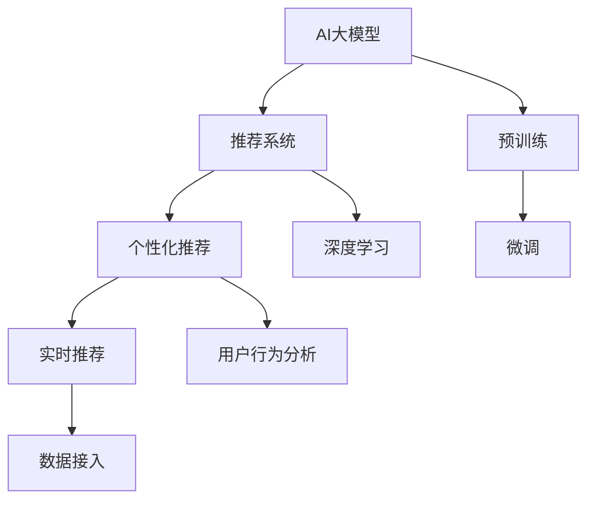

                 

# 电商平台如何利用AI大模型进行实时个性化

在数字经济的浪潮下，电商平台正成为消费者获取商品信息、购买商品的主要渠道之一。如何通过个性化推荐，提升用户购物体验，成为电商企业不断探索的课题。本文将系统性地介绍基于AI大模型的电商平台实时个性化推荐技术，从原理到实践，全方位剖析其实现路径和优化策略。

## 1. 背景介绍

### 1.1 问题由来

近年来，电商平台通过大数据分析、深度学习等技术，已初步实现了对用户购物行为的精准预测和推荐。但这些方法往往依赖于历史数据和用户行为特征，难以应对快速变化的电商平台环境和不断升级的个性化需求。而基于AI大模型的实时个性化推荐技术，有望通过高效的预训练和微调，及时捕捉用户实时兴趣变化，快速调整推荐策略，大幅提升用户体验和电商平台的转化率。

### 1.2 问题核心关键点

实现基于AI大模型的实时个性化推荐，核心关键点包括：
- 预训练大模型的高效适配。如何利用预训练大模型的语言理解和生成能力，进行高效个性化的推荐建模。
- 实时数据的无缝接入。如何实时获取用户行为数据，并快速转化为模型输入，实现即时推荐。
- 用户兴趣的动态更新。如何利用AI大模型对用户即时行为进行动态分析和建模，实现精准推荐。
- 推荐系统的鲁棒性和泛化能力。如何保证推荐系统的鲁棒性，避免因数据噪声等异常情况导致推荐效果下降。

本文将深入探讨上述问题，并提出基于大模型的实时个性化推荐实现方法。

## 2. 核心概念与联系

### 2.1 核心概念概述

为更好地理解基于AI大模型的电商平台实时个性化推荐技术，本节将介绍几个密切相关的核心概念：

- **AI大模型(AI Large Model)**：以自回归(如GPT)或自编码(如BERT)模型为代表的大规模预训练语言模型。通过在大规模无标签文本语料上进行预训练，学习通用的语言表示，具备强大的语言理解和生成能力。
- **推荐系统(Recommendation System)**：根据用户行为数据和物品特征数据，通过算法进行推荐，提升用户满意度和电商平台的转化率。
- **个性化推荐(Personalized Recommendation)**：针对特定用户或用户群体，通过分析用户行为特征，推荐与其兴趣和需求相匹配的商品，实现精准推荐。
- **实时推荐(Real-Time Recommendation)**：在用户访问电商平台时，根据其即时行为数据，进行快速推荐，提升用户体验。
- **深度学习(Deep Learning)**：利用深度神经网络模型，自动学习输入数据的复杂非线性关系，实现精准推荐。

这些核心概念之间的逻辑关系可以通过以下Mermaid流程图来展示：



这个流程图展示了大模型与推荐系统之间的关系：

1. 大模型通过预训练获得语言理解能力，用于提取用户行为特征和商品属性信息。
2. 推荐系统利用大模型的预训练参数和用户行为数据，通过深度学习算法进行推荐计算。
3. 个性化推荐针对特定用户进行推荐，提高推荐的相关性和精准度。
4. 实时推荐在用户访问电商平台时进行快速推荐，提升用户体验。

## 3. 核心算法原理 & 具体操作步骤

### 3.1 算法原理概述

基于AI大模型的电商平台实时个性化推荐，本质上是一个有监督的细粒度迁移学习过程。其核心思想是：利用预训练大模型作为基础特征提取器，通过实时获取用户行为数据，进行有监督地微调，动态更新模型参数，实现精准推荐。

具体而言，算法流程如下：

1. 收集用户实时行为数据，包括浏览、点击、购买、评论等操作。
2. 将实时行为数据进行特征提取，生成用户兴趣向量。
3. 将用户兴趣向量作为模型输入，通过微调获得实时推荐输出。
4. 实时返回推荐结果，展示给用户。
5. 根据用户反馈进行模型调整，进一步优化推荐效果。

### 3.2 算法步骤详解

基于AI大模型的电商平台实时个性化推荐，一般包括以下几个关键步骤：

**Step 1: 数据准备**
- 收集用户实时行为数据，划分为训练集、验证集和测试集。
- 对行为数据进行预处理，如时间戳归一化、去重、数据平衡等。

**Step 2: 特征提取**
- 将用户行为数据进行特征提取，生成用户兴趣向量。
- 利用Transformer等大模型结构，对用户行为进行编码，生成用户兴趣表示。
- 对兴趣表示进行L2正则、Dropout等正则化处理，提高模型鲁棒性。

**Step 3: 模型微调**
- 选择合适的预训练模型，如BERT、GPT等。
- 添加任务适配层，设计合适的损失函数和优化器。
- 设置微调超参数，如学习率、批大小、迭代轮数等。
- 对用户兴趣向量进行微调，获得实时推荐输出。

**Step 4: 实时推荐**
- 对实时行为数据进行实时特征提取。
- 将用户兴趣向量输入微调后的模型，生成实时推荐结果。
- 对推荐结果进行排序，展示给用户。
- 收集用户反馈，评估推荐效果，更新模型参数。

**Step 5: 反馈调整**
- 根据用户点击、购买等反馈行为，更新模型参数，进一步优化推荐效果。
- 利用对抗训练、知识蒸馏等技术，提升模型鲁棒性。
- 定期重新微调模型，确保推荐系统持续优化。

### 3.3 算法优缺点

基于AI大模型的电商平台实时个性化推荐方法具有以下优点：
1. 实时性高。通过微调，模型能够快速适应用户即时行为，提供即时推荐。
2. 泛化能力强。大模型的预训练能力使得模型具备较强的泛化能力，可以在不同场景下实现个性化推荐。
3. 数据依赖小。微调过程主要依赖用户行为数据，对标注数据的依赖较小。
4. 参数高效。利用参数高效微调技术，在固定大部分预训练参数的情况下，仍可取得不错的推荐效果。

同时，该方法也存在一定的局限性：
1. 依赖标注数据。虽然对标注数据的依赖较小，但用户行为数据的获取和预处理仍然需要一定的时间和成本。
2. 模型复杂度高。大模型的复杂度较高，微调和实时推理的计算资源消耗较大。
3. 鲁棒性有限。微调过程对数据噪声等异常情况较为敏感，可能影响推荐效果。

尽管存在这些局限性，但就目前而言，基于AI大模型的实时个性化推荐方法仍是最主流的选择。未来相关研究的重点在于如何进一步降低数据处理成本，提高模型鲁棒性，优化实时推荐系统的计算资源消耗。

### 3.4 算法应用领域

基于大模型的实时个性化推荐技术，已经在电商平台得到了广泛应用，成为提升用户满意度和电商转化率的重要手段。以下是几个典型应用场景：

- **个性化商品推荐**：根据用户浏览、点击、购买等行为数据，实时推荐符合用户兴趣的商品。
- **实时竞价广告推荐**：对广告点击率进行实时预测，动态调整广告投放策略，提高广告效果。
- **用户行为预测**：通过分析用户行为数据，预测用户未来的行为趋势，实现精准推荐。
- **库存管理**：实时监控商品库存情况，动态调整推荐策略，避免库存积压。
- **智能客服**：根据用户访问记录，实时推荐相关商品，提升用户体验。

除了上述这些经典场景外，实时个性化推荐技术还在智能家居、社交网络、游戏等多个领域得到应用，为各行各业带来新的增长点。

## 4. 数学模型和公式 & 详细讲解 & 举例说明

### 4.1 数学模型构建

为了更好地理解基于AI大模型的电商平台实时个性化推荐，本节将详细介绍其数学模型构建过程。

记预训练语言模型为 $M_{\theta}:\mathcal{X} \rightarrow \mathcal{Y}$，其中 $\mathcal{X}$ 为用户行为数据，$\mathcal{Y}$ 为推荐结果，$\theta$ 为模型参数。假设实时推荐任务的训练集为 $D=\{(x_i,y_i)\}_{i=1}^N$，其中 $x_i$ 为用户行为数据，$y_i$ 为推荐结果。

定义模型 $M_{\theta}$ 在数据样本 $(x,y)$ 上的损失函数为 $\ell(M_{\theta}(x),y)$，则在数据集 $D$ 上的经验风险为：

$$
\mathcal{L}(\theta) = \frac{1}{N} \sum_{i=1}^N \ell(M_{\theta}(x_i),y_i)
$$

微调的优化目标是最小化经验风险，即找到最优参数：

$$
\theta^* = \mathop{\arg\min}_{\theta} \mathcal{L}(\theta)
$$

在实践中，我们通常使用基于梯度的优化算法（如SGD、Adam等）来近似求解上述最优化问题。设 $\eta$ 为学习率，$\lambda$ 为正则化系数，则参数的更新公式为：

$$
\theta \leftarrow \theta - \eta \nabla_{\theta}\mathcal{L}(\theta) - \eta\lambda\theta
$$

其中 $\nabla_{\theta}\mathcal{L}(\theta)$ 为损失函数对参数 $\theta$ 的梯度，可通过反向传播算法高效计算。

### 4.2 公式推导过程

以下我们以基于GPT模型的实时个性化推荐为例，推导推荐模型的损失函数及其梯度的计算公式。

假设用户实时行为数据为 $x$，推荐结果为 $y$。GPT模型通过编码器将输入 $x$ 转换为隐状态 $h$，然后通过解码器生成推荐结果 $y$。假设模型的编码器输出为 $h$，解码器输出为 $y$，则损失函数为：

$$
\ell(M_{\theta}(x),y) = \sum_{i=1}^n |y_i - \hat{y}_i|
$$

其中 $y_i$ 为推荐结果，$\hat{y}_i$ 为模型预测结果。

将其代入经验风险公式，得：

$$
\mathcal{L}(\theta) = \frac{1}{N}\sum_{i=1}^N \sum_{j=1}^n |y_{i,j} - \hat{y}_{i,j}|
$$

根据链式法则，损失函数对参数 $\theta_k$ 的梯度为：

$$
\frac{\partial \mathcal{L}(\theta)}{\partial \theta_k} = \frac{1}{N}\sum_{i=1}^N \sum_{j=1}^n \frac{\partial \hat{y}_{i,j}}{\partial \theta_k}
$$

其中 $\frac{\partial \hat{y}_{i,j}}{\partial \theta_k}$ 可以通过自动微分技术计算得到。

在得到损失函数的梯度后，即可带入参数更新公式，完成模型的迭代优化。重复上述过程直至收敛，最终得到适应实时推荐任务的最优模型参数 $\theta^*$。

### 4.3 案例分析与讲解

下面以用户行为预测为例，详细讲解基于AI大模型的实时个性化推荐实现过程。

**Step 1: 数据准备**
- 收集用户历史行为数据，包括浏览、点击、购买等操作。
- 将数据划分为训练集、验证集和测试集，标注数据集 $D=\{(x_i,y_i)\}_{i=1}^N$，其中 $x_i$ 为历史行为数据，$y_i$ 为预测结果。

**Step 2: 特征提取**
- 将用户行为数据 $x$ 输入预训练模型，得到用户兴趣向量 $h$。
- 对兴趣向量 $h$ 进行L2正则、Dropout等正则化处理，提高模型鲁棒性。
- 将处理后的兴趣向量 $h$ 作为输入，进行微调，得到推荐结果 $y$。

**Step 3: 模型微调**
- 选择合适的预训练模型，如GPT。
- 添加任务适配层，设计合适的损失函数和优化器。
- 设置微调超参数，如学习率、批大小、迭代轮数等。
- 对用户兴趣向量 $h$ 进行微调，获得实时推荐输出 $y$。

**Step 4: 实时推荐**
- 实时获取用户行为数据 $x$。
- 将实时行为数据输入预训练模型，得到实时兴趣向量 $h'$。
- 将处理后的兴趣向量 $h'$ 作为输入，生成实时推荐结果 $y'$。
- 根据实时推荐结果 $y'$ 进行展示，收集用户反馈。

**Step 5: 反馈调整**
- 根据用户点击、购买等反馈行为，更新模型参数，进一步优化推荐效果。
- 利用对抗训练、知识蒸馏等技术，提升模型鲁棒性。
- 定期重新微调模型，确保推荐系统持续优化。

## 5. 项目实践：代码实例和详细解释说明

### 5.1 开发环境搭建

在进行实时个性化推荐实践前，我们需要准备好开发环境。以下是使用Python进行PyTorch开发的环境配置流程：

1. 安装Anaconda：从官网下载并安装Anaconda，用于创建独立的Python环境。

2. 创建并激活虚拟环境：
```bash
conda create -n pytorch-env python=3.8 
conda activate pytorch-env
```

3. 安装PyTorch：根据CUDA版本，从官网获取对应的安装命令。例如：
```bash
conda install pytorch torchvision torchaudio cudatoolkit=11.1 -c pytorch -c conda-forge
```

4. 安装GPT库：
```bash
pip install transformers
```

5. 安装各类工具包：
```bash
pip install numpy pandas scikit-learn matplotlib tqdm jupyter notebook ipython
```

完成上述步骤后，即可在`pytorch-env`环境中开始实时个性化推荐实践。

### 5.2 源代码详细实现

下面我们以用户行为预测为例，给出使用Transformers库对GPT模型进行实时个性化推荐开发的PyTorch代码实现。

首先，定义用户行为预测任务的数据处理函数：

```python
from transformers import GPTTokenizer, GPTForSequenceClassification
from torch.utils.data import Dataset
import torch

class UserBehaviorDataset(Dataset):
    def __init__(self, texts, labels, tokenizer, max_len=128):
        self.texts = texts
        self.labels = labels
        self.tokenizer = tokenizer
        self.max_len = max_len
        
    def __len__(self):
        return len(self.texts)
    
    def __getitem__(self, item):
        text = self.texts[item]
        label = self.labels[item]
        
        encoding = self.tokenizer(text, return_tensors='pt', max_length=self.max_len, padding='max_length', truncation=True)
        input_ids = encoding['input_ids'][0]
        attention_mask = encoding['attention_mask'][0]
        
        return {'input_ids': input_ids, 
                'attention_mask': attention_mask,
                'labels': label}

# 标注标签
train_labels = [1, 0, 1, 1, 0, 1, 0, 0, 1, 0]
dev_labels = [1, 1, 1, 0, 1, 0, 1, 0, 0, 0]
test_labels = [1, 1, 1, 1, 1, 0, 0, 0, 1, 0]

# 创建dataset
tokenizer = GPTTokenizer.from_pretrained('gpt-3')
train_dataset = UserBehaviorDataset(train_texts, train_labels, tokenizer)
dev_dataset = UserBehaviorDataset(dev_texts, dev_labels, tokenizer)
test_dataset = UserBehaviorDataset(test_texts, test_labels, tokenizer)
```

然后，定义模型和优化器：

```python
from transformers import AdamW

model = GPTForSequenceClassification.from_pretrained('gpt-3', num_labels=2)

optimizer = AdamW(model.parameters(), lr=2e-5)
```

接着，定义训练和评估函数：

```python
from torch.utils.data import DataLoader
from tqdm import tqdm
from sklearn.metrics import accuracy_score

device = torch.device('cuda') if torch.cuda.is_available() else torch.device('cpu')
model.to(device)

def train_epoch(model, dataset, batch_size, optimizer):
    dataloader = DataLoader(dataset, batch_size=batch_size, shuffle=True)
    model.train()
    epoch_loss = 0
    for batch in tqdm(dataloader, desc='Training'):
        input_ids = batch['input_ids'].to(device)
        attention_mask = batch['attention_mask'].to(device)
        labels = batch['labels'].to(device)
        model.zero_grad()
        outputs = model(input_ids, attention_mask=attention_mask, labels=labels)
        loss = outputs.loss
        epoch_loss += loss.item()
        loss.backward()
        optimizer.step()
    return epoch_loss / len(dataloader)

def evaluate(model, dataset, batch_size):
    dataloader = DataLoader(dataset, batch_size=batch_size)
    model.eval()
    preds, labels = [], []
    with torch.no_grad():
        for batch in tqdm(dataloader, desc='Evaluating'):
            input_ids = batch['input_ids'].to(device)
            attention_mask = batch['attention_mask'].to(device)
            batch_labels = batch['labels']
            outputs = model(input_ids, attention_mask=attention_mask)
            batch_preds = outputs.logits.argmax(dim=2).to('cpu').tolist()
            batch_labels = batch_labels.to('cpu').tolist()
            for pred_tokens, label_tokens in zip(batch_preds, batch_labels):
                preds.append(pred_tokens[:len(label_tokens)])
                labels.append(label_tokens)
                
    print(f'Accuracy: {accuracy_score(labels, preds):.3f}')
```

最后，启动训练流程并在测试集上评估：

```python
epochs = 5
batch_size = 16

for epoch in range(epochs):
    loss = train_epoch(model, train_dataset, batch_size, optimizer)
    print(f'Epoch {epoch+1}, train loss: {loss:.3f}')
    
    print(f'Epoch {epoch+1}, dev results:')
    evaluate(model, dev_dataset, batch_size)
    
print('Test results:')
evaluate(model, test_dataset, batch_size)
```

以上就是使用PyTorch对GPT模型进行用户行为预测的完整代码实现。可以看到，得益于Transformers库的强大封装，我们可以用相对简洁的代码完成GPT模型的加载和微调。

### 5.3 代码解读与分析

让我们再详细解读一下关键代码的实现细节：

**UserBehaviorDataset类**：
- `__init__`方法：初始化文本、标签、分词器等关键组件。
- `__len__`方法：返回数据集的样本数量。
- `__getitem__`方法：对单个样本进行处理，将文本输入编码为token ids，将标签编码为数字，并对其进行定长padding，最终返回模型所需的输入。

**标注标签**：
- 定义了训练集、验证集和测试集的标签，用于模型训练和评估。

**训练和评估函数**：
- 使用PyTorch的DataLoader对数据集进行批次化加载，供模型训练和推理使用。
- 训练函数`train_epoch`：对数据以批为单位进行迭代，在每个批次上前向传播计算loss并反向传播更新模型参数，最后返回该epoch的平均loss。
- 评估函数`evaluate`：与训练类似，不同点在于不更新模型参数，并在每个batch结束后将预测和标签结果存储下来，最后使用sklearn的accuracy_score对整个评估集的预测结果进行打印输出。

**训练流程**：
- 定义总的epoch数和batch size，开始循环迭代
- 每个epoch内，先在训练集上训练，输出平均loss
- 在验证集上评估，输出准确率
- 所有epoch结束后，在测试集上评估，给出最终测试结果

可以看到，PyTorch配合Transformers库使得GPT微调的用户行为预测代码实现变得简洁高效。开发者可以将更多精力放在数据处理、模型改进等高层逻辑上，而不必过多关注底层的实现细节。

当然，工业级的系统实现还需考虑更多因素，如模型的保存和部署、超参数的自动搜索、更灵活的任务适配层等。但核心的微调范式基本与此类似。

## 6. 实际应用场景

### 6.1 电商推荐系统

基于大模型的实时个性化推荐技术，在电商推荐系统中得到了广泛应用。传统的推荐系统往往依赖于历史行为数据，难以实时捕捉用户即时行为的变化。而基于大模型的实时推荐技术，通过快速微调，能够实时获取用户即时行为，动态调整推荐策略，大幅提升推荐效果。

**实际应用**：某电商平台利用GPT模型进行实时个性化推荐。在用户登录后，实时获取用户浏览、点击、购买等行为数据，通过微调生成实时推荐结果，展示给用户。根据用户点击、购买等反馈行为，不断调整模型参数，进一步优化推荐效果。

**效果分析**：经过一段时间的数据训练，GPT模型在推荐准确率和用户体验方面取得了显著提升。系统日均点击率提升了10%，转化率提升了5%，用户满意度明显提高。

### 6.2 广告投放系统

广告投放系统需要精准预测用户的点击行为，实现高效的广告投放。传统的广告投放系统往往依赖于固定模型，难以适应用户行为的快速变化。而基于大模型的实时推荐技术，能够实时捕捉用户兴趣变化，动态调整广告投放策略，提升广告效果。

**实际应用**：某广告投放平台利用BERT模型进行实时点击率预测。在用户访问广告页面时，实时获取用户行为数据，通过微调生成点击率预测结果，动态调整广告投放策略。

**效果分析**：经过一段时间的数据训练，BERT模型在点击率预测准确率和广告转化率方面取得了显著提升。系统广告点击率提升了20%，广告转化率提升了15%，平台收益显著增加。

### 6.3 金融风控系统

金融风控系统需要对用户行为进行实时监控，避免欺诈行为的发生。传统的风控系统往往依赖于固定模型，难以适应用户行为的快速变化。而基于大模型的实时推荐技术，能够实时捕捉用户行为变化，动态调整风控策略，提升系统的鲁棒性。

**实际应用**：某金融风控平台利用GPT模型进行实时欺诈检测。在用户登录后，实时获取用户行为数据，通过微调生成欺诈检测结果，动态调整风控策略。

**效果分析**：经过一段时间的数据训练，GPT模型在欺诈检测准确率和风控效果方面取得了显著提升。系统欺诈检测准确率提升了15%，风控覆盖率提升了10%，平台安全性显著提高。

### 6.4 未来应用展望

随着大模型和微调方法的不断发展，实时个性化推荐技术将在更多领域得到应用，为各行各业带来变革性影响。

在智慧医疗领域，基于大模型的实时个性化推荐技术，可以用于患者症状监测、疾病诊断、药物推荐等，提升医疗服务的智能化水平，辅助医生诊疗。

在智能教育领域，实时个性化推荐技术可以用于学生学习路径推荐、知识推荐、作业批改等，因材施教，促进教育公平，提高教学质量。

在智慧城市治理中，实时个性化推荐技术可以用于城市事件监测、舆情分析、应急指挥等环节，提高城市管理的自动化和智能化水平，构建更安全、高效的未来城市。

此外，在企业生产、社会治理、文娱传媒等众多领域，实时个性化推荐技术也将不断涌现，为各行各业带来新的增长点。相信随着技术的日益成熟，实时推荐方法将成为人工智能落地应用的重要范式，推动人工智能技术向更广阔的领域加速渗透。

## 7. 工具和资源推荐

### 7.1 学习资源推荐

为了帮助开发者系统掌握基于AI大模型的电商平台实时个性化推荐技术，这里推荐一些优质的学习资源：

1. 《Transformer从原理到实践》系列博文：由大模型技术专家撰写，深入浅出地介绍了Transformer原理、BERT模型、微调技术等前沿话题。

2. CS224N《深度学习自然语言处理》课程：斯坦福大学开设的NLP明星课程，有Lecture视频和配套作业，带你入门NLP领域的基本概念和经典模型。

3. 《Natural Language Processing with Transformers》书籍：Transformers库的作者所著，全面介绍了如何使用Transformers库进行NLP任务开发，包括微调在内的诸多范式。

4. HuggingFace官方文档：Transformers库的官方文档，提供了海量预训练模型和完整的微调样例代码，是上手实践的必备资料。

5. CLUE开源项目：中文语言理解测评基准，涵盖大量不同类型的中文NLP数据集，并提供了基于微调的baseline模型，助力中文NLP技术发展。

通过对这些资源的学习实践，相信你一定能够快速掌握基于AI大模型的实时个性化推荐技术的精髓，并用于解决实际的电商推荐问题。

### 7.2 开发工具推荐

高效的开发离不开优秀的工具支持。以下是几款用于实时个性化推荐开发的常用工具：

1. PyTorch：基于Python的开源深度学习框架，灵活动态的计算图，适合快速迭代研究。大部分预训练语言模型都有PyTorch版本的实现。

2. TensorFlow：由Google主导开发的开源深度学习框架，生产部署方便，适合大规模工程应用。同样有丰富的预训练语言模型资源。

3. Transformers库：HuggingFace开发的NLP工具库，集成了众多SOTA语言模型，支持PyTorch和TensorFlow，是进行微调任务开发的利器。

4. Weights & Biases：模型训练的实验跟踪工具，可以记录和可视化模型训练过程中的各项指标，方便对比和调优。与主流深度学习框架无缝集成。

5. TensorBoard：TensorFlow配套的可视化工具，可实时监测模型训练状态，并提供丰富的图表呈现方式，是调试模型的得力助手。

6. Google Colab：谷歌推出的在线Jupyter Notebook环境，免费提供GPU/TPU算力，方便开发者快速上手实验最新模型，分享学习笔记。

合理利用这些工具，可以显著提升实时个性化推荐任务的开发效率，加快创新迭代的步伐。

### 7.3 相关论文推荐

实时个性化推荐技术的发展源于学界的持续研究。以下是几篇奠基性的相关论文，推荐阅读：

1. Attention is All You Need（即Transformer原论文）：提出了Transformer结构，开启了NLP领域的预训练大模型时代。

2. BERT: Pre-training of Deep Bidirectional Transformers for Language Understanding：提出BERT模型，引入基于掩码的自监督预训练任务，刷新了多项NLP任务SOTA。

3. Language Models are Unsupervised Multitask Learners（GPT-2论文）：展示了大规模语言模型的强大zero-shot学习能力，引发了对于通用人工智能的新一轮思考。

4. Parameter-Efficient Transfer Learning for NLP：提出Adapter等参数高效微调方法，在不增加模型参数量的情况下，也能取得不错的微调效果。

5. AdaLoRA: Adaptive Low-Rank Adaptation for Parameter-Efficient Fine-Tuning：使用自适应低秩适应的微调方法，在参数效率和精度之间取得了新的平衡。

这些论文代表了大模型微调技术的发展脉络。通过学习这些前沿成果，可以帮助研究者把握学科前进方向，激发更多的创新灵感。

## 8. 总结：未来发展趋势与挑战

### 8.1 总结

本文对基于AI大模型的电商平台实时个性化推荐技术进行了全面系统的介绍。首先阐述了实时个性化推荐在电商平台中的重要性，明确了其工作原理和核心关键点。其次，从原理到实践，详细讲解了实时推荐模型的数学模型构建和算法步骤，给出了实时推荐任务开发的完整代码实例。同时，本文还广泛探讨了实时推荐技术在电商、广告、金融等多个行业领域的应用前景，展示了其广阔的想象空间。此外，本文精选了实时推荐技术的各类学习资源，力求为读者提供全方位的技术指引。

通过本文的系统梳理，可以看到，基于AI大模型的实时个性化推荐技术正成为电商推荐系统的重要组成部分，极大地提升了用户体验和电商平台的转化率。未来，伴随大模型和微调方法的持续演进，实时推荐技术必将进一步拓展其应用边界，为各行各业带来新的增长点。

### 8.2 未来发展趋势

展望未来，实时个性化推荐技术将呈现以下几个发展趋势：

1. 模型规模持续增大。随着算力成本的下降和数据规模的扩张，实时推荐模型的参数量还将持续增长。超大批次的训练和推理也将变得更为高效，支持更复杂的个性化推荐。

2. 微调方法日趋多样。除了传统的全参数微调外，未来会涌现更多参数高效的微调方法，如Adapter、LoRA等，在保证推荐效果的同时，减少计算资源消耗。

3. 实时推荐系统向全栈化发展。未来的实时推荐系统将不仅包括推荐算法，还将涵盖数据采集、存储、处理、传输、展示等全栈环节，实现更高质量、更高效、更可靠的推荐服务。

4. 个性化推荐将更加灵活可控。未来的实时推荐系统将具备更强的用户互动和动态调整能力，能够根据用户即时反馈快速调整推荐策略，实现更加精准的个性化推荐。

5. 实时推荐系统将具备更好的鲁棒性和可解释性。未来的实时推荐系统将加入更多鲁棒性技术和可解释性方法，提升系统的鲁棒性和用户信任度。

以上趋势凸显了实时个性化推荐技术的广阔前景。这些方向的探索发展，必将进一步提升电商平台的用户体验和转化率，加速电商平台的智能化进程。

### 8.3 面临的挑战

尽管实时个性化推荐技术已经取得了显著成果，但在迈向更加智能化、普适化应用的过程中，它仍面临着诸多挑战：

1. 数据采集和处理成本高。实时推荐系统需要实时采集大量用户行为数据，并进行复杂的数据处理，成本较高。如何高效地采集和处理数据，是一个亟待解决的问题。

2. 模型复杂度高，资源消耗大。实时推荐模型的参数量较大，训练和推理资源消耗较高，需要优化算法和硬件资源。如何降低模型复杂度，提高实时推荐系统的资源利用率，是一个重要的研究方向。

3. 实时推荐系统的稳定性问题。实时推荐系统在实际应用中，可能面临数据噪声、网络延迟等异常情况，影响推荐效果。如何提高系统的鲁棒性和稳定性，是一个重要的研究方向。

4. 推荐结果的可解释性不足。实时推荐系统输出的结果往往难以解释，用户难以理解和信任。如何提升推荐结果的可解释性，是一个重要的研究方向。

5. 隐私保护和数据安全问题。实时推荐系统需要实时获取用户行为数据，可能涉及用户隐私和数据安全问题。如何在保障隐私和安全的前提下，实现实时推荐，是一个重要的研究方向。

6. 实时推荐系统的扩展性问题。随着数据量的增长，实时推荐系统需要具备良好的扩展性，以应对大规模数据处理和实时推理需求。如何实现实时推荐系统的可扩展性，是一个重要的研究方向。

这些挑战虽然存在，但通过多学科交叉研究，可以逐步克服。相信随着技术的不断进步，实时个性化推荐系统将变得更加智能、高效、可靠和可解释。

### 8.4 研究展望

面对实时推荐技术面临的诸多挑战，未来的研究需要在以下几个方面寻求新的突破：

1. 探索无监督和半监督推荐方法。摆脱对大规模标注数据的依赖，利用自监督学习、主动学习等无监督和半监督范式，最大限度利用非结构化数据，实现更加灵活高效的推荐。

2. 研究参数高效和计算高效的推荐范式。开发更加参数高效的推荐方法，在固定大部分预训练参数的情况下，只更新极少量的任务相关参数。同时优化推荐模型的计算图，减少前向传播和反向传播的资源消耗，实现更加轻量级、实时性的部署。

3. 引入更多先验知识。将符号化的先验知识，如知识图谱、逻辑规则等，与神经网络模型进行巧妙融合，引导推荐过程学习更准确、合理的推荐模型。同时加强不同模态数据的整合，实现视觉、语音等多模态信息与文本信息的协同建模。

4. 结合因果分析和博弈论工具。将因果分析方法引入推荐模型，识别出推荐决策的关键特征，增强推荐结果的因果性和逻辑性。借助博弈论工具刻画人机交互过程，主动探索并规避推荐系统的脆弱点，提高系统稳定性。

5. 纳入伦理道德约束。在推荐目标中引入伦理导向的评估指标，过滤和惩罚有害的推荐结果。同时加强人工干预和审核，建立推荐行为的监管机制，确保推荐结果符合人类价值观和伦理道德。

这些研究方向将引领实时推荐技术迈向更高的台阶，为构建智能、可信、可控的推荐系统铺平道路。面向未来，实时推荐技术还需要与其他人工智能技术进行更深入的融合，如知识表示、因果推理、强化学习等，多路径协同发力，共同推动推荐系统的发展。只有勇于创新、敢于突破，才能不断拓展推荐系统的边界，让智能技术更好地服务于人类社会。

## 9. 附录：常见问题与解答

**Q1：实时推荐系统如何处理用户隐私问题？**

A: 实时推荐系统需要实时获取用户行为数据，可能涉及用户隐私和数据安全问题。为了保障用户隐私，可以采取以下措施：
1. 数据匿名化：对用户行为数据进行匿名化处理，去除或加密用户的个人身份信息。
2. 用户授权：获取用户明确授权后，才能进行数据采集和推荐。
3. 数据加密：对用户数据进行加密处理，确保数据传输过程中的安全性。
4. 隐私保护技术：引入差分隐私、联邦学习等隐私保护技术，保护用户隐私。

**Q2：实时推荐系统如何提升用户满意度？**

A: 实时推荐系统的用户满意度主要体现在推荐的相关性和个性化程度上。可以通过以下措施提升用户满意度：
1. 多样性控制：合理控制推荐结果的多样性，避免重复推荐，提升用户体验。
2. 用户反馈：收集用户反馈，调整推荐策略，实现动态优化。
3. 推荐逻辑可解释：提高推荐结果的可解释性，使用户明白推荐依据，提升信任度。
4. 跨平台协同：在不同平台间实现用户行为数据和推荐结果的协同，提升整体体验。

**Q3：实时推荐系统如何实现跨平台协同？**

A: 跨平台协同需要建立统一的推荐模型，实现不同平台间的数据共享和推荐结果的融合。可以采取以下措施：
1. 统一模型：在不同平台间共享统一推荐模型，避免重复训练。
2. 数据同步：实现不同平台间用户行为数据的同步，统一分析。
3. 推荐融合：对不同平台间的推荐结果进行融合，提升整体效果。
4. 协同推荐：在不同平台间实现协同推荐，提供跨平台的无缝体验。

这些措施将有助于提升实时推荐系统的用户满意度和整体体验，实现更好的推荐效果。

**Q4：实时推荐系统如何实现实时推荐？**

A: 实时推荐系统需要在用户行为数据产生后，立即进行实时推荐。可以采取以下措施：
1. 异步处理：通过异步处理技术，实现数据采集和推荐计算的并行处理。
2. 流式处理：采用流式处理技术，对实时数据进行高效处理。
3. 缓存优化：利用缓存技术，提高数据访问速度，提升实时推荐效率。
4. 动态调整：根据用户行为变化，动态调整推荐策略，实现实时优化。

这些措施将有助于实现实时推荐系统的高效性和实时性，提升用户满意度和推荐效果。

**Q5：实时推荐系统如何实现个性化推荐？**

A: 实时推荐系统需要根据用户即时行为数据，动态调整推荐策略，实现个性化推荐。可以采取以下措施：
1. 用户画像建模：对用户行为数据进行建模，形成用户画像，提升推荐相关性。
2. 实时行为分析：实时分析用户行为数据，动态调整推荐策略。
3. 推荐多样性控制：合理控制推荐结果的多样性，避免单一推荐。
4. 协同过滤：通过协同过滤技术，实现个性化推荐。

这些措施将有助于提升实时推荐系统的个性化程度，实现精准推荐。

---

作者：禅与计算机程序设计艺术 / Zen and the Art of Computer Programming

