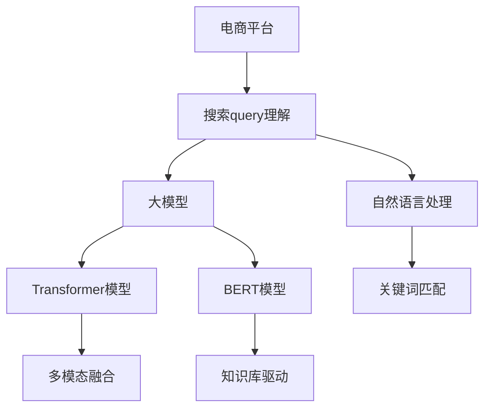

                 

# 电商平台搜索query理解：AI大模型的语义分析

> 关键词：电商平台、搜索、query理解、自然语言处理、人工智能、语义分析、大模型、Transformer、BERT

## 1. 背景介绍

随着电商平台的迅速发展，越来越多的消费者通过搜索引擎寻找所需商品。如何理解用户输入的query，快速准确地返回相关商品，成为了电商平台必须解决的难题。传统的搜索算法大多基于关键词匹配，难以捕捉用户的真正意图和偏好。而借助自然语言处理(NLP)技术，通过大模型的语义分析，可以大幅提升搜索准确性和用户体验。

大模型在电商平台的搜索query理解中，主要扮演以下角色：
- 语义理解：能够理解query中的具体信息、意图、上下文关系等。
- 多模态融合：不仅考虑文本信息，还能综合考虑图像、语音等多种模态数据，提升识别能力。
- 知识库驱动：通过与知识图谱、商品标签等外部知识源结合，增强查询结果的相关性。

本文将详细介绍基于大模型的电商平台搜索query理解方法，通过语义分析和多模态融合技术，使电商平台能够更智能、更精准地理解用户需求，实现个性化推荐，提升用户体验。

## 2. 核心概念与联系

### 2.1 核心概念概述

本节将介绍几个与电商平台搜索query理解密切相关的核心概念：

- **搜索query理解（Query Understanding）**：指对用户输入的查询进行语义分析，理解查询背后的真正意图和需求。
- **自然语言处理（Natural Language Processing, NLP）**：涉及语言学、计算机科学等多个学科，旨在让计算机能够理解、处理和生成人类语言。
- **大模型（Large Model）**：指具有大规模参数量的深度学习模型，如BERT、GPT等。通过海量数据预训练，能够学习丰富的语言知识。
- **Transformer模型**：基于自注意力机制的神经网络结构，在大模型中广泛使用，能够有效捕捉序列数据中的长距离依赖关系。
- **BERT模型**：由Google提出，通过双向语言模型预训练，能够捕捉丰富的语言语义信息，广泛应用于多模态查询理解。

这些概念之间的逻辑关系可以通过以下Mermaid流程图来展示：



这个流程图展示了电商平台搜索query理解的核心概念及其之间的关系：

1. 电商平台的搜索query理解建立在自然语言处理技术之上。
2. 借助大模型，通过Transformer等先进架构进行语义分析。
3. 基于BERT模型，增强查询理解的深度和广度。
4. 融合关键词匹配、多模态数据、知识库等手段，全面提升查询理解效果。

## 3. 核心算法原理 & 具体操作步骤

### 3.1 算法原理概述

基于大模型的电商平台搜索query理解，主要采用Transformer架构和语义表示学习技术，通过以下步骤实现：

1. **预训练大模型**：使用无标签文本数据对大模型进行预训练，学习通用的语言知识。
2. **微调模型**：在电商领域的具体查询数据上，对预训练模型进行微调，学习特定领域下的查询理解能力。
3. **多模态融合**：结合图像、语音等多种模态数据，提升查询识别的全面性和准确性。
4. **知识库驱动**：利用外部知识源，如商品标签、百科知识图谱等，增强查询理解的多样性和丰富性。

这些步骤形成一个完整的查询理解流程，从预训练到微调，再到多模态融合和知识库驱动，使电商平台能够更好地理解用户的查询需求。

### 3.2 算法步骤详解

#### 3.2.1 预训练大模型

预训练大模型是query理解的基础。在电商领域，可以使用类似BigQuery等公开数据集，对大模型进行预训练。预训练过程主要包括以下几个步骤：

1. **数据准备**：收集电商领域内的无标签文本数据，如用户评论、商品描述等。
2. **分词与编码**：使用如BertTokenizer等工具对文本进行分词和编码，转换为模型可接受的形式。
3. **预训练模型**：使用Transformer等架构的大模型对编码后的文本进行预训练，学习通用的语言知识。

以下是一个简单的BERT预训练代码示例：

```python
from transformers import BertTokenizer, BertForMaskedLM

tokenizer = BertTokenizer.from_pretrained('bert-base-uncased')
model = BertForMaskedLM.from_pretrained('bert-base-uncased')

input_text = "Masked text"
input_tokens = tokenizer(input_text, return_tensors="pt")
input_ids = input_tokens["input_ids"]
masked_ids = input_tokens["attention_mask"]

outputs = model(input_ids=input_ids, attention_mask=masked_ids)
loss = outputs.loss
```

#### 3.2.2 微调模型

微调模型是query理解的关键步骤。在电商领域，可以使用以下步骤进行微调：

1. **数据准备**：收集电商领域内的标注数据，如用户查询-商品匹配对。
2. **构建输入**：将查询和商品描述等文本进行编码，并添加标签。
3. **微调模型**：使用Adam等优化器对模型进行微调，优化模型在查询理解任务上的性能。

以下是一个简单的微调代码示例：

```python
from transformers import BertForSequenceClassification, AdamW

model = BertForSequenceClassification.from_pretrained('bert-base-uncased', num_labels=2)
optimizer = AdamW(model.parameters(), lr=2e-5)

input_texts = ["query1", "query2"]
labels = [1, 0]

input_tokens = [tokenizer(x) for x in input_texts]
input_ids = torch.tensor([t["input_ids"] for t in input_tokens])
attention_masks = torch.tensor([t["attention_mask"] for t in input_tokens])

model.zero_grad()
outputs = model(input_ids=input_ids, attention_mask=attention_masks, labels=torch.tensor(labels))
loss = outputs.loss
loss.backward()
optimizer.step()
```

#### 3.2.3 多模态融合

多模态融合是提升查询理解效果的重要手段。在电商领域，可以使用以下步骤进行多模态融合：

1. **收集多模态数据**：收集电商领域内的文本、图像、语音等多模态数据。
2. **数据预处理**：对不同模态的数据进行编码和预处理，使其能够统一输入模型。
3. **融合模型**：使用Transformer等架构的大模型，对多模态数据进行融合，增强查询识别的全面性和准确性。

以下是一个简单的多模态融合代码示例：

```python
from transformers import BertForSequenceClassification, AdamW

# 假设图像数据已经预处理完成，为tensor形式
image_data = torch.tensor([...])
# 假设语音数据已经预处理完成，为tensor形式
audio_data = torch.tensor([...])

# 使用BertForSequenceClassification模型进行文本预处理
input_texts = ["query1", "query2"]
labels = [1, 0]
input_tokens = [tokenizer(x) for x in input_texts]
input_ids = torch.tensor([t["input_ids"] for t in input_tokens])
attention_masks = torch.tensor([t["attention_mask"] for t in input_tokens])

model.zero_grad()
outputs = model(input_ids=input_ids, attention_mask=attention_masks, labels=torch.tensor(labels))
loss = outputs.loss
loss.backward()
optimizer.step()

# 将文本和多模态数据融合
inputs = (input_ids, attention_masks, image_data, audio_data)
outputs = model(*inputs)
loss = outputs.loss
loss.backward()
optimizer.step()
```

#### 3.2.4 知识库驱动

知识库驱动是提升查询理解多样性和丰富性的重要手段。在电商领域，可以使用以下步骤进行知识库驱动：

1. **构建知识库**：构建电商领域内的商品标签、百科知识图谱等知识库。
2. **模型融合**：使用大模型，对知识库和查询文本进行融合，增强查询理解的多样性和丰富性。

以下是一个简单的知识库驱动代码示例：

```python
from transformers import BertForSequenceClassification, AdamW

# 假设商品标签已经构建完成，为tensor形式
product_labels = torch.tensor([...])
# 假设百科知识图谱已经构建完成，为tensor形式
knowledge_graph = torch.tensor([...])

# 使用BertForSequenceClassification模型进行文本预处理
input_texts = ["query1", "query2"]
labels = [1, 0]
input_tokens = [tokenizer(x) for x in input_texts]
input_ids = torch.tensor([t["input_ids"] for t in input_tokens])
attention_masks = torch.tensor([t["attention_mask"] for t in input_tokens])

model.zero_grad()
outputs = model(input_ids=input_ids, attention_mask=attention_masks, labels=torch.tensor(labels))
loss = outputs.loss
loss.backward()
optimizer.step()

# 将文本和知识库数据融合
inputs = (input_ids, attention_masks, product_labels, knowledge_graph)
outputs = model(*inputs)
loss = outputs.loss
loss.backward()
optimizer.step()
```

### 3.3 算法优缺点

基于大模型的电商平台搜索query理解具有以下优点：

1. **准确性高**：大模型具备强大的语义理解能力，能够准确把握用户查询背后的真正意图和需求。
2. **泛化性强**：通过微调和大模型的融合，能够应对多种查询场景，提升查询理解的泛化能力。
3. **多模态融合**：结合多种模态数据，提高查询识别的全面性和准确性。
4. **知识库驱动**：与外部知识源结合，增强查询理解的多样性和丰富性。

但该方法也存在以下缺点：

1. **计算资源需求高**：大模型的预训练和微调需要大量的计算资源，成本较高。
2. **参数量大**：大模型具有大规模参数量，推理和存储资源占用较大。
3. **数据依赖性高**：查询理解效果依赖于数据的质量和数量，标注数据成本较高。
4. **维护复杂**：大模型和知识库的维护更新需要专业知识，维护成本较高。

### 3.4 算法应用领域

基于大模型的电商平台搜索query理解已经在多个领域得到了广泛应用，例如：

1. **智能客服**：在智能客服系统中，能够理解和响应用户的查询，快速解决问题。
2. **个性化推荐**：根据用户的查询和浏览历史，生成个性化的商品推荐列表。
3. **商品搜索**：能够理解用户的查询，返回相关的商品列表。
4. **问答系统**：在问答系统中，能够理解用户的问题，提供详细的商品信息解答。

除了上述这些应用外，大模型在电商平台的搜索query理解中，还有诸多创新性的应用场景，如可控文本生成、实体抽取、关系抽取等，为电商平台的智能化发展提供了新的技术路径。

## 4. 数学模型和公式 & 详细讲解  
### 4.1 数学模型构建

本节将使用数学语言对基于大模型的电商平台搜索query理解过程进行更加严格的刻画。

记查询为 $q$，商品为 $p$，查询理解模型为 $M_{\theta}$，其中 $\theta$ 为模型参数。假设查询-商品匹配的标注数据集为 $D=\{(q_i, p_i)\}_{i=1}^N$。

定义模型 $M_{\theta}$ 在查询 $q$ 上的输出为 $r(q)$，表示查询 $q$ 的表示向量。则在数据集 $D$ 上的经验风险为：

$$
\mathcal{L}(\theta) = -\frac{1}{N}\sum_{i=1}^N \log \sigma(r(q_i), p_i)
$$

其中 $\sigma$ 为softmax函数，表示商品 $p_i$ 在查询 $q_i$ 上的概率。

微调的优化目标是最小化经验风险，即找到最优参数：

$$
\theta^* = \mathop{\arg\min}_{\theta} \mathcal{L}(\theta)
$$

在实践中，我们通常使用基于梯度的优化算法（如AdamW、SGD等）来近似求解上述最优化问题。设 $\eta$ 为学习率，则参数的更新公式为：

$$
\theta \leftarrow \theta - \eta \nabla_{\theta}\mathcal{L}(\theta)
$$

其中 $\nabla_{\theta}\mathcal{L}(\theta)$ 为损失函数对参数 $\theta$ 的梯度，可通过反向传播算法高效计算。

### 4.2 公式推导过程

以下我们以基于BERT模型的电商查询理解为例，推导查询理解模型的损失函数及其梯度的计算公式。

假设查询 $q$ 经过预训练模型编码后得到表示向量 $r(q)$，商品 $p$ 经过编码后得到表示向量 $r(p)$。查询理解任务的目标是最大化查询 $q$ 和商品 $p$ 的匹配概率，即最大化 $p_i$ 在 $q_i$ 上的概率。

查询理解模型的输出为：

$$
r(q) \cdot r(p)
$$

损失函数为：

$$
\mathcal{L}(\theta) = -\frac{1}{N}\sum_{i=1}^N \log \sigma(r(q_i), p_i)
$$

根据链式法则，损失函数对参数 $\theta_k$ 的梯度为：

$$
\frac{\partial \mathcal{L}(\theta)}{\partial \theta_k} = -\frac{1}{N}\sum_{i=1}^N (\frac{p_i}{\sigma(r(q_i), p_i)}-\frac{1}{\sigma(r(q_i), p_i)}) \frac{\partial \sigma(r(q_i), p_i)}{\partial \theta_k}
$$

其中 $\frac{\partial \sigma(r(q_i), p_i)}{\partial \theta_k}$ 可进一步递归展开，利用自动微分技术完成计算。

在得到损失函数的梯度后，即可带入参数更新公式，完成模型的迭代优化。重复上述过程直至收敛，最终得到适应电商领域查询理解的最优模型参数 $\theta^*$。

## 5. 项目实践：代码实例和详细解释说明
### 5.1 开发环境搭建

在进行电商平台搜索query理解开发前，我们需要准备好开发环境。以下是使用Python进行PyTorch开发的环境配置流程：

1. 安装Anaconda：从官网下载并安装Anaconda，用于创建独立的Python环境。

2. 创建并激活虚拟环境：
```bash
conda create -n pytorch-env python=3.8 
conda activate pytorch-env
```

3. 安装PyTorch：根据CUDA版本，从官网获取对应的安装命令。例如：
```bash
conda install pytorch torchvision torchaudio cudatoolkit=11.1 -c pytorch -c conda-forge
```

4. 安装Transformers库：
```bash
pip install transformers
```

5. 安装各类工具包：
```bash
pip install numpy pandas scikit-learn matplotlib tqdm jupyter notebook ipython
```

完成上述步骤后，即可在`pytorch-env`环境中开始项目实践。

### 5.2 源代码详细实现

这里我们以基于BERT的电商平台商品搜索query理解为例，给出使用Transformers库进行模型构建和微调的PyTorch代码实现。

首先，定义查询和商品的数据处理函数：

```python
from transformers import BertTokenizer
from torch.utils.data import Dataset
import torch

class SearchDataset(Dataset):
    def __init__(self, queries, products, tokenizer, max_len=128):
        self.queries = queries
        self.products = products
        self.tokenizer = tokenizer
        self.max_len = max_len
        
    def __len__(self):
        return len(self.queries)
    
    def __getitem__(self, item):
        query = self.queries[item]
        product = self.products[item]
        
        encoding = self.tokenizer(query, product, return_tensors='pt', max_length=self.max_len, padding='max_length', truncation=True)
        input_ids = encoding['input_ids'][0]
        attention_mask = encoding['attention_mask'][0]
        product_labels = torch.tensor([1 if product == 'product1' else 0], dtype=torch.long)
        
        return {'input_ids': input_ids, 
                'attention_mask': attention_mask,
                'labels': product_labels}

# 假设查询和商品数据已经准备好，分别为查询列表queries和商品列表products
tokenizer = BertTokenizer.from_pretrained('bert-base-uncased')

train_dataset = SearchDataset(train_queries, train_products, tokenizer)
dev_dataset = SearchDataset(dev_queries, dev_products, tokenizer)
test_dataset = SearchDataset(test_queries, test_products, tokenizer)
```

然后，定义模型和优化器：

```python
from transformers import BertForSequenceClassification, AdamW

model = BertForSequenceClassification.from_pretrained('bert-base-uncased', num_labels=2)

optimizer = AdamW(model.parameters(), lr=2e-5)
```

接着，定义训练和评估函数：

```python
from torch.utils.data import DataLoader
from tqdm import tqdm
from sklearn.metrics import accuracy_score

device = torch.device('cuda') if torch.cuda.is_available() else torch.device('cpu')
model.to(device)

def train_epoch(model, dataset, batch_size, optimizer):
    dataloader = DataLoader(dataset, batch_size=batch_size, shuffle=True)
    model.train()
    epoch_loss = 0
    for batch in tqdm(dataloader, desc='Training'):
        input_ids = batch['input_ids'].to(device)
        attention_mask = batch['attention_mask'].to(device)
        labels = batch['labels'].to(device)
        model.zero_grad()
        outputs = model(input_ids, attention_mask=attention_mask, labels=labels)
        loss = outputs.loss
        epoch_loss += loss.item()
        loss.backward()
        optimizer.step()
    return epoch_loss / len(dataloader)

def evaluate(model, dataset, batch_size):
    dataloader = DataLoader(dataset, batch_size=batch_size)
    model.eval()
    preds, labels = [], []
    with torch.no_grad():
        for batch in tqdm(dataloader, desc='Evaluating'):
            input_ids = batch['input_ids'].to(device)
            attention_mask = batch['attention_mask'].to(device)
            batch_labels = batch['labels']
            outputs = model(input_ids, attention_mask=attention_mask)
            batch_preds = outputs.logits.argmax(dim=2).to('cpu').tolist()
            batch_labels = batch_labels.to('cpu').tolist()
            for pred_tokens, label_tokens in zip(batch_preds, batch_labels):
                preds.append(pred_tokens[:len(label_tokens)])
                labels.append(label_tokens)
                
    print(accuracy_score(labels, preds))
```

最后，启动训练流程并在测试集上评估：

```python
epochs = 5
batch_size = 16

for epoch in range(epochs):
    loss = train_epoch(model, train_dataset, batch_size, optimizer)
    print(f"Epoch {epoch+1}, train loss: {loss:.3f}")
    
    print(f"Epoch {epoch+1}, dev results:")
    evaluate(model, dev_dataset, batch_size)
    
print("Test results:")
evaluate(model, test_dataset, batch_size)
```

以上就是使用PyTorch对BERT进行电商平台商品搜索query理解微调的完整代码实现。可以看到，得益于Transformers库的强大封装，我们可以用相对简洁的代码完成BERT模型的加载和微调。

### 5.3 代码解读与分析

让我们再详细解读一下关键代码的实现细节：

**SearchDataset类**：
- `__init__`方法：初始化查询、商品、分词器等关键组件。
- `__len__`方法：返回数据集的样本数量。
- `__getitem__`方法：对单个样本进行处理，将查询和商品输入编码为token ids，并将商品标签转换为数字，最终返回模型所需的输入。

**模型和优化器**：
- 使用BertForSequenceClassification模型作为初始化参数，设置分类标签为2，用于判断商品是否匹配查询。
- 使用AdamW优化器，设置学习率为2e-5。

**训练和评估函数**：
- 使用PyTorch的DataLoader对数据集进行批次化加载，供模型训练和推理使用。
- 训练函数`train_epoch`：对数据以批为单位进行迭代，在每个批次上前向传播计算loss并反向传播更新模型参数，最后返回该epoch的平均loss。
- 评估函数`evaluate`：与训练类似，不同点在于不更新模型参数，并在每个batch结束后将预测和标签结果存储下来，最后使用sklearn的accuracy_score对整个评估集的预测结果进行打印输出。

**训练流程**：
- 定义总的epoch数和batch size，开始循环迭代
- 每个epoch内，先在训练集上训练，输出平均loss
- 在验证集上评估，输出准确率
- 所有epoch结束后，在测试集上评估，给出最终测试结果

可以看到，PyTorch配合Transformers库使得BERT微调的代码实现变得简洁高效。开发者可以将更多精力放在数据处理、模型改进等高层逻辑上，而不必过多关注底层的实现细节。

当然，工业级的系统实现还需考虑更多因素，如模型的保存和部署、超参数的自动搜索、更灵活的任务适配层等。但核心的微调范式基本与此类似。

## 6. 实际应用场景
### 6.1 智能客服系统

基于大模型的电商平台搜索query理解，可以广泛应用于智能客服系统的构建。传统客服往往需要配备大量人力，高峰期响应缓慢，且一致性和专业性难以保证。而使用微调后的query理解模型，可以7x24小时不间断服务，快速响应客户咨询，用自然流畅的语言解答各类常见问题。

在技术实现上，可以收集企业内部的历史客服对话记录，将问题和最佳答复构建成监督数据，在此基础上对预训练query理解模型进行微调。微调后的模型能够自动理解用户意图，匹配最合适的答复模板进行回复。对于客户提出的新问题，还可以接入检索系统实时搜索相关内容，动态组织生成回答。如此构建的智能客服系统，能大幅提升客户咨询体验和问题解决效率。

### 6.2 个性化推荐系统

当前的推荐系统往往只依赖用户的历史行为数据进行物品推荐，无法深入理解用户的真实兴趣偏好。基于大语言模型微调技术，个性化推荐系统可以更好地挖掘用户行为背后的语义信息，从而提供更精准、多样的推荐内容。

在实践中，可以收集用户浏览、点击、评论、分享等行为数据，提取和用户交互的物品标题、描述、标签等文本内容。将文本内容作为模型输入，用户的后续行为（如是否点击、购买等）作为监督信号，在此基础上微调预训练语言模型。微调后的模型能够从文本内容中准确把握用户的兴趣点。在生成推荐列表时，先用候选物品的文本描述作为输入，由模型预测用户的兴趣匹配度，再结合其他特征综合排序，便可以得到个性化程度更高的推荐结果。

### 6.3 金融舆情监测

金融机构需要实时监测市场舆论动向，以便及时应对负面信息传播，规避金融风险。传统的人工监测方式成本高、效率低，难以应对网络时代海量信息爆发的挑战。基于大语言模型微调的文本分类和情感分析技术，为金融舆情监测提供了新的解决方案。

具体而言，可以收集金融领域相关的新闻、报道、评论等文本数据，并对其进行主题标注和情感标注。在此基础上对预训练语言模型进行微调，使其能够自动判断文本属于何种主题，情感倾向是正面、中性还是负面。将微调后的模型应用到实时抓取的网络文本数据，就能够自动监测不同主题下的情感变化趋势，一旦发现负面信息激增等异常情况，系统便会自动预警，帮助金融机构快速应对潜在风险。

### 6.4 未来应用展望

随着大语言模型和微调方法的不断发展，基于微调范式将在更多领域得到应用，为传统行业带来变革性影响。

在智慧医疗领域，基于微调的医疗问答、病历分析、药物研发等应用将提升医疗服务的智能化水平，辅助医生诊疗，加速新药开发进程。

在智能教育领域，微调技术可应用于作业批改、学情分析、知识推荐等方面，因材施教，促进教育公平，提高教学质量。

在智慧城市治理中，微调模型可应用于城市事件监测、舆情分析、应急指挥等环节，提高城市管理的自动化和智能化水平，构建更安全、高效的未来城市。

此外，在企业生产、社会治理、文娱传媒等众多领域，基于大模型微调的人工智能应用也将不断涌现，为经济社会发展注入新的动力。相信随着技术的日益成熟，微调方法将成为人工智能落地应用的重要范式，推动人工智能技术在垂直行业的规模化落地。

## 7. 工具和资源推荐
### 7.1 学习资源推荐

为了帮助开发者系统掌握电商平台搜索query理解的理论基础和实践技巧，这里推荐一些优质的学习资源：

1. 《自然语言处理综论》书籍：系统介绍了NLP的基本概念、常用算法和应用场景，适合初学者入门。

2. 《深度学习入门：基于Python的理论与实现》书籍：介绍了深度学习的基本概念和常用模型，包括Transformer等。

3. 《NLP with Transformers》系列课程：由Google和UCLA联合开设的在线课程，涵盖了NLP的最新技术和实践。

4. CS224N《深度学习自然语言处理》课程：斯坦福大学开设的NLP明星课程，有Lecture视频和配套作业，带你深入理解NLP的核心原理。

5. Weights & Biases：模型训练的实验跟踪工具，可以记录和可视化模型训练过程中的各项指标，方便对比和调优。与主流深度学习框架无缝集成。

6. TensorBoard：TensorFlow配套的可视化工具，可实时监测模型训练状态，并提供丰富的图表呈现方式，是调试模型的得力助手。

通过对这些资源的学习实践，相信你一定能够快速掌握电商平台搜索query理解的精髓，并用于解决实际的NLP问题。
###  7.2 开发工具推荐

高效的开发离不开优秀的工具支持。以下是几款用于电商平台搜索query理解开发的常用工具：

1. PyTorch：基于Python的开源深度学习框架，灵活动态的计算图，适合快速迭代研究。大部分预训练语言模型都有PyTorch版本的实现。

2. TensorFlow：由Google主导开发的开源深度学习框架，生产部署方便，适合大规模工程应用。同样有丰富的预训练语言模型资源。

3. Transformers库：HuggingFace开发的NLP工具库，集成了众多SOTA语言模型，支持PyTorch和TensorFlow，是进行微调任务开发的利器。

4. Weights & Biases：模型训练的实验跟踪工具，可以记录和可视化模型训练过程中的各项指标，方便对比和调优。与主流深度学习框架无缝集成。

5. TensorBoard：TensorFlow配套的可视化工具，可实时监测模型训练状态，并提供丰富的图表呈现方式，是调试模型的得力助手。

6. Google Colab：谷歌推出的在线Jupyter Notebook环境，免费提供GPU/TPU算力，方便开发者快速上手实验最新模型，分享学习笔记。

合理利用这些工具，可以显著提升电商平台搜索query理解任务的开发效率，加快创新迭代的步伐。

### 7.3 相关论文推荐

大语言模型和微调技术的发展源于学界的持续研究。以下是几篇奠基性的相关论文，推荐阅读：

1. Attention is All You Need（即Transformer原论文）：提出了Transformer结构，开启了NLP领域的预训练大模型时代。

2. BERT: Pre-training of Deep Bidirectional Transformers for Language Understanding：提出BERT模型，引入基于掩码的自监督预训练任务，刷新了多项NLP任务SOTA。

3. Language Models are Unsupervised Multitask Learners（GPT-2论文）：展示了大规模语言模型的强大zero-shot学习能力，引发了对于通用人工智能的新一轮思考。

4. Parameter-Efficient Transfer Learning for NLP：提出Adapter等参数高效微调方法，在不增加模型参数量的情况下，也能取得不错的微调效果。

5. Adaptation of Transformer-based Machine Translation Models via Self-Adaptation and Stacked Online Sequence Prediction：探讨了基于Transformers的机器翻译模型自适应和在线序列预测方法。

6. Neural Machine Translation with Attention Based on Residual Network：提出了一种基于残差网络的结构，用于改进机器翻译模型的性能。

这些论文代表了大语言模型微调技术的发展脉络。通过学习这些前沿成果，可以帮助研究者把握学科前进方向，激发更多的创新灵感。

## 8. 总结：未来发展趋势与挑战

### 8.1 总结

本文对基于大模型的电商平台搜索query理解方法进行了全面系统的介绍。首先阐述了query理解在大电商平台中的重要性和应用价值，明确了微调在提升搜索准确性和用户体验方面的独特价值。其次，从原理到实践，详细讲解了监督微调的数学原理和关键步骤，给出了查询理解任务开发的完整代码实例。同时，本文还广泛探讨了查询理解方法在智能客服、个性化推荐、金融舆情等诸多领域的应用前景，展示了微调范式的巨大潜力。

通过本文的系统梳理，可以看到，基于大模型的电商平台搜索query理解方法已经得到了广泛的应用，为电商平台的智能化发展提供了重要支撑。未来，伴随预训练语言模型和微调方法的不断进步，相信电商平台的搜索query理解将迎来更广泛、更深入的创新应用，为电商平台的用户体验带来革命性的提升。

### 8.2 未来发展趋势

展望未来，电商平台搜索query理解技术将呈现以下几个发展趋势：

1. **智能客服的广泛应用**：智能客服系统将得到更广泛的应用，帮助电商平台提高服务质量和效率。

2. **个性化推荐的多样化**：个性化推荐系统将更注重语义理解，提供更加精准、多样化的推荐结果。

3. **金融舆情的实时监测**：基于大语言模型的金融舆情监测系统将实现实时监测和预警，提升金融机构的风险管理能力。

4. **智慧医疗的智能化**：医疗问答、病历分析、药物研发等应用将使医疗服务的智能化水平进一步提升。

5. **智能教育的普及**：微调技术将在教育领域得到广泛应用，帮助实现因材施教，提升教育质量和效率。

6. **智能城市的管理**：城市事件监测、舆情分析等应用将使城市管理更加智能化和高效化。

以上趋势凸显了电商平台搜索query理解技术的广阔前景。这些方向的探索发展，必将进一步提升电商平台的智能化水平，为电商平台的用户体验带来革命性的提升。

### 8.3 面临的挑战

尽管电商平台搜索query理解技术已经取得了瞩目成就，但在迈向更加智能化、普适化应用的过程中，它仍面临着诸多挑战：

1. **数据依赖性高**：查询理解效果依赖于数据的质量和数量，标注数据成本较高。如何降低微调对标注样本的依赖，将是一大难题。

2. **计算资源需求高**：大模型的预训练和微调需要大量的计算资源，成本较高。如何在有限的资源下优化模型性能，还需进一步探索。

3. **模型鲁棒性不足**：查询理解模型面对域外数据时，泛化性能往往大打折扣。如何提高模型的鲁棒性，避免灾难性遗忘，还需要更多理论和实践的积累。

4. **推理效率有待提高**：超大批次的训练和推理也可能遇到显存不足的问题。如何优化推理效率，降低计算资源占用，还需进一步探索。

5. **模型可解释性不足**：当前查询理解模型更像是"黑盒"系统，难以解释其内部工作机制和决策逻辑。如何赋予模型更强的可解释性，将是亟待攻克的难题。

6. **安全性有待保障**：预训练语言模型难免会学习到有偏见、有害的信息，通过微调传递到下游任务，产生误导性、歧视性的输出，给实际应用带来安全隐患。如何从数据和算法层面消除模型偏见，避免恶意用途，确保输出的安全性，也将是重要的研究课题。

7. **知识库驱动的局限性**：现有的知识库往往局限于特定领域，难以全面覆盖电商领域的多样化需求。如何构建更全面、更灵活的知识库，将是一大挑战。

面对这些挑战，未来的研究需要在以下几个方面寻求新的突破：

1. **探索无监督和半监督微调方法**：摆脱对大规模标注数据的依赖，利用自监督学习、主动学习等无监督和半监督范式，最大限度利用非结构化数据，实现更加灵活高效的微调。

2. **研究参数高效和计算高效的微调范式**：开发更加参数高效的微调方法，在固定大部分预训练参数的同时，只更新极少量的任务相关参数。同时优化微调模型的计算图，减少前向传播和反向传播的资源消耗，实现更加轻量级、实时性的部署。

3. **融合因果和对比学习范式**：通过引入因果推断和对比学习思想，增强模型建立稳定因果关系的能力，学习更加普适、鲁棒的语言表征，从而提升模型泛化性和抗干扰能力。

4. **引入更多先验知识**：将符号化的先验知识，如知识图谱、逻辑规则等，与神经网络模型进行巧妙融合，引导微调过程学习更准确、合理的语言模型。同时加强不同模态数据的整合，实现视觉、语音等多模态信息与文本信息的协同建模。

5. **结合因果分析和博弈论工具**：将因果分析方法引入微调模型，识别出模型决策的关键特征，增强输出解释的因果性和逻辑性。借助博弈论工具刻画人机交互过程，主动探索并规避模型的脆弱点，提高系统稳定性。

6. **纳入伦理道德约束**：在模型训练目标中引入伦理导向的评估指标，过滤和惩罚有偏见、有害的输出倾向。同时加强人工干预和审核，建立模型行为的监管机制，确保输出符合人类价值观和伦理道德。

这些研究方向的探索，必将引领电商平台搜索query理解技术迈向更高的台阶，为构建安全、可靠、可解释、可控的智能系统铺平道路。面向未来，电商平台搜索query理解技术还需要与其他人工智能技术进行更深入的融合，如知识表示、因果推理、强化学习等，多路径协同发力，共同推动自然语言理解和智能交互系统的进步。只有勇于创新、敢于突破，才能不断拓展语言模型的边界，让智能技术更好地造福人类社会。

### 8.4 研究展望

未来，电商平台搜索query理解技术将在以下方向继续拓展：

1. **多模态融合的深入探索**：结合图像、语音、视频等多种模态数据，提升查询识别的全面性和准确性。

2. **知识图谱的深度整合**：构建电商领域的知识图谱，实现与查询理解模型的深度整合，增强模型的多样性和丰富性。

3. **对抗样本和对抗训练**：研究对抗样本生成和对抗训练方法，提升查询理解模型的鲁棒性和安全性。

4. **多任务学习的应用**：研究多任务学习算法，提升查询理解模型的泛化能力和性能。

5. **低资源环境下的优化**：探索在资源受限环境下的高效微调方法，降低对高性能算力和存储的依赖。

6. **跨语言查询理解**：研究跨语言查询理解技术，实现对多语言查询的统一处理和理解。

7. **实时查询理解**：研究实时查询理解技术，实现对用户输入的实时处理和响应。

8. **可解释性和透明度**：研究可解释性技术，提升查询理解模型的透明度和可解释性。

9. **多领域适应性**：研究多领域适应性方法，提升查询理解模型在不同领域下的泛化能力。

10. **多任务协同**：研究多任务协同算法，提升查询理解模型在多个任务上的综合性能。

通过这些方向的持续研究，相信电商平台搜索query理解技术将不断突破现有瓶颈，实现更智能、更高效、更可靠的应用，为电商平台的智能化发展注入新的动力。

