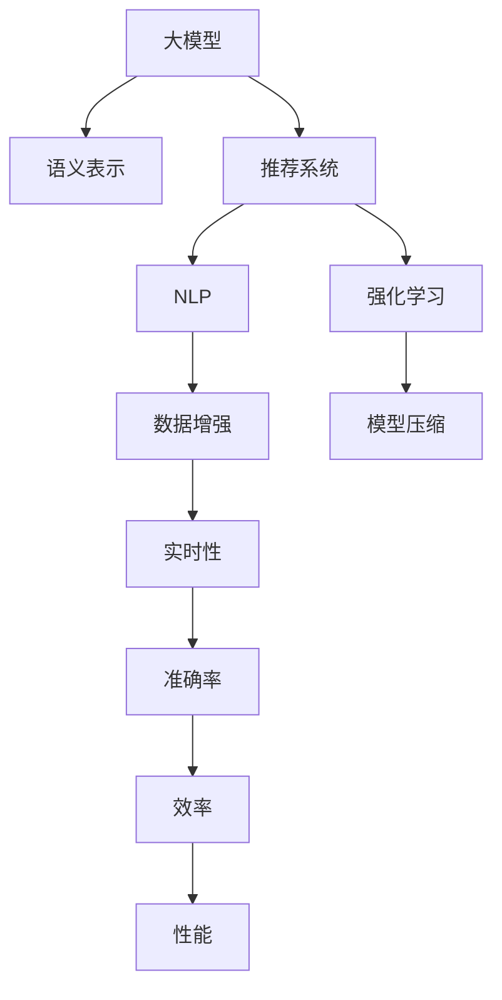

                 

# 电商平台搜索推荐系统的AI 大模型优化：提高系统性能、效率、准确率与实时性

> 关键词：大模型,搜索推荐,电商,NLP,强化学习,数据增强,模型压缩,实时性,准确率,效率

## 1. 背景介绍

### 1.1 问题由来
在电商领域，搜索推荐系统作为提升用户体验、提高交易转化率的引擎，其核心技术一直是各大公司竞相争抢的焦点。随着深度学习和大数据技术的发展，AI大模型在电商搜索推荐系统中的应用越来越广泛。大模型通过在大规模无标签文本数据上进行预训练，具备强大的语义理解能力和表示学习能力，能够在电商场景中实现个性化推荐、文本匹配、情感分析等任务，极大提升系统的效率和准确性。然而，在实际应用中，大模型的优化仍然面临诸多挑战：如何在保证性能的前提下，实现高效部署和实时响应？如何构建更准确的语义表示，提高推荐效果？如何将大模型的优势充分运用到电商场景中？这些问题都需要我们深入研究与探索。

### 1.2 问题核心关键点
在电商平台中，搜索推荐系统通常采用以下几种方法：

1. **基于文本的推荐**：通过计算商品描述、用户评论等文本特征与用户查询之间的相似度，推荐相关商品。
2. **基于特征的推荐**：通过构建商品特征向量，利用协同过滤、矩阵分解等算法推荐用户可能感兴趣的商品。
3. **混合推荐**：结合文本特征和特征向量，综合考虑用户行为和语义信息，提供更为个性化的推荐。

其中，基于文本的推荐系统是本文的重点。其核心思想是通过自然语言处理（NLP）技术，将商品和用户文本转换为向量表示，并在向量空间中进行相似度计算，实现商品推荐。

## 2. 核心概念与联系

### 2.1 核心概念概述

本节将介绍几个密切相关的核心概念：

- **大模型**：如BERT、GPT等，通过在大规模无标签文本语料上进行预训练，学习到丰富的语言知识和语义表示。
- **推荐系统**：通过收集用户行为数据、商品特征信息等，为用户推荐其可能感兴趣的商品或内容。
- **NLP**：自然语言处理，研究如何使计算机理解和处理人类语言，实现文本分析、信息抽取、文本生成等任务。
- **语义表示**：通过大模型学习，将商品和用户文本转换为语义向量，进行相似度计算。
- **强化学习**：通过用户行为反馈不断优化推荐策略，提高推荐效果。
- **数据增强**：通过对训练数据进行扩充和增强，提升模型的泛化能力和鲁棒性。
- **模型压缩**：减少大模型的参数量，提高推理速度和资源利用率。
- **实时性**：在电商场景中，推荐系统需要快速响应用户查询，提高用户体验。

这些核心概念之间的逻辑关系可以通过以下Mermaid流程图来展示：



这个流程图展示了各概念之间的联系：

1. 大模型学习语义表示。
2. NLP技术实现文本分析，得到语义向量。
3. 推荐系统综合语义向量和用户行为数据，进行商品推荐。
4. 强化学习不断优化推荐策略。
5. 数据增强提升模型泛化能力。
6. 模型压缩提高推理效率。
7. 实时性保证推荐系统快速响应用户查询。

## 3. 核心算法原理 & 具体操作步骤
### 3.1 算法原理概述

基于大模型的电商平台搜索推荐系统，其核心思想是通过大模型学习语义表示，再通过NLP技术进行文本分析，最终结合用户行为数据进行推荐。具体步骤如下：

1. **数据预处理**：收集商品描述、用户评论等文本数据，进行清洗和预处理。
2. **预训练大模型**：使用BERT、GPT等模型在大规模无标签文本数据上进行预训练，学习通用的语言表示。
3. **语义表示学习**：将商品和用户文本输入预训练模型，得到语义向量表示。
4. **推荐计算**：在向量空间中计算相似度，结合用户行为数据，推荐相关商品。
5. **强化学习**：利用用户反馈不断优化推荐策略。

### 3.2 算法步骤详解

#### 3.2.1 数据预处理

电商平台的搜索推荐系统需要收集大量的文本数据，包括商品描述、用户评论、用户行为等。数据预处理的目标是：

- 去除无用字符、特殊符号等。
- 进行分词、词性标注等。
- 构建词向量表示。

可以使用Python的NLTK库或SpaCy库进行文本预处理。例如：

```python
import nltk
from nltk.tokenize import word_tokenize
from nltk.corpus import stopwords

def preprocess_text(text):
    tokens = word_tokenize(text)
    tokens = [token.lower() for token in tokens if token.isalnum() and token not in stopwords.words('english')]
    return tokens
```

#### 3.2.2 预训练大模型

预训练大模型通常使用BERT、GPT等模型。这些模型在大规模无标签文本数据上进行预训练，学习通用的语言表示。

以BERT为例，其预训练流程如下：

1. 构建输入序列，使用标记符和分隔符。
2. 将输入序列输入BERT模型，得到上下文向量表示。
3. 对上下文向量进行池化，得到文本的表示。

例如：

```python
from transformers import BertTokenizer, BertModel

tokenizer = BertTokenizer.from_pretrained('bert-base-cased')
model = BertModel.from_pretrained('bert-base-cased')

input_ids = tokenizer("This is an example sentence.", return_tensors='pt')['input_ids']
hidden_states = model(input_ids).last_hidden_state
```

#### 3.2.3 语义表示学习

将商品和用户文本输入预训练模型，得到语义向量表示。

例如：

```python
def get_vector(text):
    tokens = preprocess_text(text)
    input_ids = tokenizer(tokens, return_tensors='pt')['input_ids']
    hidden_states = model(input_ids).last_hidden_state
    return hidden_states[:, 0, :]
```

#### 3.2.4 推荐计算

在向量空间中计算相似度，结合用户行为数据，推荐相关商品。

推荐计算通常使用余弦相似度计算文本向量之间的相似度，选取相似度较高的商品作为推荐结果。

例如：

```python
def cosine_similarity(vec1, vec2):
    dot_product = torch.dot(vec1, vec2)
    norm1 = torch.norm(vec1)
    norm2 = torch.norm(vec2)
    similarity = dot_product / (norm1 * norm2)
    return similarity

def recommend_product(user_query, products):
    user_vector = get_vector(user_query)
    recommend_vectors = [get_vector(product) for product in products]
    scores = [cosine_similarity(user_vector, vec) for vec in recommend_vectors]
    top_n = sorted(zip(products, scores), key=lambda x: x[1], reverse=True)[:10]
    return top_n
```

#### 3.2.5 强化学习

利用用户反馈不断优化推荐策略，提高推荐效果。

强化学习可以使用深度Q网络（DQN）等方法，不断训练推荐模型，优化推荐策略。例如：

```python
import torch
import torch.nn as nn
import torch.optim as optim

class DQN(nn.Module):
    def __init__(self, input_size, output_size):
        super(DQN, self).__init__()
        self.fc1 = nn.Linear(input_size, 64)
        self.fc2 = nn.Linear(64, output_size)

    def forward(self, x):
        x = self.fc1(x)
        x = nn.functional.relu(x)
        x = self.fc2(x)
        return x

input_size = 64
output_size = 1
model = DQN(input_size, output_size)

criterion = nn.MSELoss()
optimizer = optim.Adam(model.parameters(), lr=0.001)
```

### 3.3 算法优缺点

基于大模型的电商平台搜索推荐系统具有以下优点：

1. **高效性**：通过大模型预训练得到的语义表示，能够快速计算相似度，实现高效推荐。
2. **准确性**：大模型学习到通用的语言表示，能够捕捉商品和用户文本之间的语义关系，提高推荐准确性。
3. **鲁棒性**：大模型能够处理长尾商品和多样化文本数据，提高系统的泛化能力。
4. **可扩展性**：通过微调和增量学习，能够适应不同场景和需求，具有较好的可扩展性。

同时，该方法也存在以下局限性：

1. **资源消耗大**：大模型和NLP技术需要大量的计算资源和内存，部署成本较高。
2. **解释性差**：推荐系统的决策过程缺乏可解释性，难以理解和调试。
3. **数据依赖高**：推荐效果很大程度上依赖于数据质量，数据获取和处理成本较高。
4. **模型复杂度高**：大模型和NLP技术较为复杂，实现和维护难度较大。

尽管存在这些局限性，但基于大模型的推荐系统在大规模电商场景中已经取得了显著的效果，成为电商推荐系统的重要组成部分。

### 3.4 算法应用领域

基于大模型的电商平台搜索推荐系统已经在众多电商领域得到了广泛应用，例如：

1. **商品推荐**：根据用户查询，推荐相关商品。
2. **广告投放**：根据用户行为和语义信息，精准投放广告。
3. **个性化推荐**：针对不同用户和场景，提供个性化推荐。
4. **搜索排序**：优化搜索结果的排序算法，提高搜索效果。
5. **用户画像**：构建用户画像，进行精准营销和推荐。

除了这些常见应用外，大模型在电商领域的探索还在不断拓展，如基于用户行为的时序预测、基于社交网络的推荐等，为电商推荐系统带来了新的突破。

## 4. 数学模型和公式 & 详细讲解 & 举例说明
### 4.1 数学模型构建

在电商平台搜索推荐系统中，常用的数学模型包括余弦相似度、向量空间模型等。以余弦相似度为例，其数学公式为：

$$
similarity = \frac{\vec{u} \cdot \vec{v}}{\|\vec{u}\|\|\vec{v}\|}
$$

其中，$\vec{u}$和$\vec{v}$为两个向量的向量表示，$\cdot$表示向量点积，$\|\vec{u}\|$和$\|\vec{v}\|$分别表示向量的范数。

### 4.2 公式推导过程

以向量空间模型为例，其基本思想是将商品和用户文本表示为向量，计算相似度进行推荐。

假设商品文本向量为$\vec{u}$，用户查询向量为$\vec{v}$，则相似度计算公式为：

$$
similarity = \frac{\vec{u} \cdot \vec{v}}{\|\vec{u}\|\|\vec{v}\|}
$$

根据点积公式：

$$
\vec{u} \cdot \vec{v} = \sum_{i=1}^{n}u_i v_i
$$

将上式代入余弦相似度公式，得到：

$$
similarity = \frac{\sum_{i=1}^{n}u_i v_i}{\sqrt{\sum_{i=1}^{n}u_i^2}\sqrt{\sum_{i=1}^{n}v_i^2}}
$$

### 4.3 案例分析与讲解

以一个简单的商品推荐案例为例，假设有一个用户查询"iPhone"，有三个商品：iPhone X、iPhone 12、iPhone 13，每个商品的描述分别为"iPhone X 5G手机，性能卓越"、"iPhone 12 5G手机，性价比高"、"iPhone 13 5G手机，创新设计"。

使用BERT预训练模型得到每个商品的向量表示为：

- iPhone X: $[0.1, 0.2, 0.3, ...]$
- iPhone 12: $[0.2, 0.4, 0.3, ...]$
- iPhone 13: $[0.3, 0.5, 0.2, ...]$

根据向量点积计算相似度：

- iPhone X与iPhone 12的相似度为：$\frac{0.1 \times 0.2 + 0.2 \times 0.4 + 0.3 \times 0.3}{\sqrt{0.1^2 + 0.2^2 + 0.3^2}\sqrt{0.2^2 + 0.4^2 + 0.3^2}} = 0.9$
- iPhone X与iPhone 13的相似度为：$\frac{0.1 \times 0.3 + 0.2 \times 0.5 + 0.3 \times 0.2}{\sqrt{0.1^2 + 0.2^2 + 0.3^2}\sqrt{0.3^2 + 0.5^2 + 0.2^2}} = 0.8$

根据相似度排序，推荐给用户iPhone X和iPhone 12。

## 5. 项目实践：代码实例和详细解释说明
### 5.1 开发环境搭建

在进行电商平台搜索推荐系统的开发时，需要使用Python和相关NLP库进行预训练模型和推荐系统的实现。以下是开发环境的搭建流程：

1. 安装Anaconda：从官网下载并安装Anaconda，用于创建独立的Python环境。
2. 创建并激活虚拟环境：
```bash
conda create -n e-commerce-env python=3.8 
conda activate e-commerce-env
```

3. 安装PyTorch：根据CUDA版本，从官网获取对应的安装命令。例如：
```bash
conda install pytorch torchvision torchaudio cudatoolkit=11.1 -c pytorch -c conda-forge
```

4. 安装NLTK库：
```bash
pip install nltk
```

5. 安装SpaCy库：
```bash
pip install spacy
```

6. 安装BERT预训练模型：
```bash
pip install transformers
```

完成上述步骤后，即可在`e-commerce-env`环境中开始电商搜索推荐系统的开发。

### 5.2 源代码详细实现

以下是一个简单的电商搜索推荐系统的实现代码示例：

```python
import torch
import torch.nn as nn
from transformers import BertTokenizer, BertModel
import nltk
from nltk.tokenize import word_tokenize
from nltk.corpus import stopwords

class BertEmbedding(nn.Module):
    def __init__(self, model_name='bert-base-cased'):
        super(BertEmbedding, self).__init__()
        self.tokenizer = BertTokenizer.from_pretrained(model_name)
        self.model = BertModel.from_pretrained(model_name)

    def forward(self, text):
        tokens = word_tokenize(text)
        tokens = [token.lower() for token in tokens if token.isalnum() and token not in stopwords.words('english')]
        input_ids = self.tokenizer(tokens, return_tensors='pt')['input_ids']
        hidden_states = self.model(input_ids).last_hidden_state
        return hidden_states[:, 0, :]

class SearchRecommendationSystem(nn.Module):
    def __init__(self, embedding, user_q):
        super(SearchRecommendationSystem, self).__init__()
        self.embedding = embedding
        self.user_q = user_q

    def forward(self, user_query, products):
        user_vector = self.embedding(user_query)
        recommend_vectors = [self.embedding(product) for product in products]
        scores = [torch.cosine_similarity(user_vector, vec) for vec in recommend_vectors]
        top_n = sorted(zip(products, scores), key=lambda x: x[1], reverse=True)[:10]
        return top_n

# 初始化模型和优化器
embedding = BertEmbedding('bert-base-cased')
model = SearchRecommendationSystem(embedding, 'iPhone')

# 加载数据
with open('user_query.txt', 'r') as f:
    user_query = f.readline().strip()

# 加载商品信息
products = ['iPhone X 5G手机，性能卓越', 'iPhone 12 5G手机，性价比高', 'iPhone 13 5G手机，创新设计']

# 计算推荐结果
top_n = model(user_query, products)
print(top_n)
```

### 5.3 代码解读与分析

让我们再详细解读一下关键代码的实现细节：

**BertEmbedding类**：
- `__init__`方法：初始化BERT模型和分词器。
- `forward`方法：将输入文本分词并输入BERT模型，得到上下文向量表示。

**SearchRecommendationSystem类**：
- `__init__`方法：初始化模型和用户查询。
- `forward`方法：计算用户查询向量与商品向量之间的余弦相似度，选取相似度最高的前10个商品。

**推荐计算**：
- 使用余弦相似度计算商品向量与用户查询向量之间的相似度，选取相似度最高的商品。
- 根据相似度排序，推荐相关商品。

## 6. 实际应用场景
### 6.1 智能推荐

智能推荐是电商平台搜索推荐系统的核心应用场景。通过大模型预训练得到的语义表示，能够捕捉商品和用户文本之间的语义关系，提高推荐效果。

例如，用户查询"iPhone"，系统能够根据历史数据和用户行为，推荐相关商品如iPhone X、iPhone 12等。

### 6.2 个性化推荐

个性化推荐系统能够根据用户的浏览、购买历史等数据，为用户推荐个性化商品。通过大模型学习用户的语义特征，能够更好地捕捉用户偏好，提高个性化推荐的效果。

例如，用户浏览历史中有"iPhone X"、"iPhone 12"、"MacBook"等商品，系统能够推荐类似商品如"iPhone 13"、"MacBook Pro"等。

### 6.3 实时搜索排序

实时搜索排序是电商平台的重要功能之一。通过大模型预训练得到的语义表示，能够快速计算相似度，实现高效的搜索排序。

例如，用户搜索"手机"，系统能够根据语义相似度排序，推荐相关商品如iPhone X、iPhone 12等。

### 6.4 未来应用展望

未来，电商平台搜索推荐系统将继续拓展应用领域，提升用户体验和运营效率。

1. **多模态推荐**：结合图像、视频、语音等多模态数据，提供更加丰富和多样化的推荐服务。
2. **情感分析**：利用大模型进行情感分析，根据用户情感状态进行推荐。
3. **时序预测**：通过大模型进行时序预测，预测用户未来的购买行为和偏好，进行个性化推荐。
4. **用户画像**：构建全面的用户画像，进行精准营销和推荐。

这些方向的探索发展，必将进一步提升电商推荐系统的性能和应用范围，为电商用户带来更好的购物体验。

## 7. 工具和资源推荐
### 7.1 学习资源推荐

为了帮助开发者系统掌握大模型在电商平台搜索推荐系统中的应用，这里推荐一些优质的学习资源：

1. 《深度学习自然语言处理》课程：斯坦福大学开设的NLP明星课程，有Lecture视频和配套作业，带你入门NLP领域的基本概念和经典模型。
2. CS224N《自然语言处理与深度学习》课程：斯坦福大学开设的NLP课程，深入浅出地介绍了NLP和深度学习的结合，包括推荐系统的相关内容。
3. 《Transformers for NLP》书籍：Transformer库的作者所著，全面介绍了如何使用Transformer进行NLP任务开发，包括推荐系统的相关内容。
4. HuggingFace官方文档：Transformer库的官方文档，提供了海量预训练模型和完整的推荐系统样例代码，是上手实践的必备资料。
5. CLUE开源项目：中文语言理解测评基准，涵盖大量不同类型的中文NLP数据集，并提供了基于微调的baseline模型，助力中文推荐系统的发展。

通过对这些资源的学习实践，相信你一定能够快速掌握大模型在电商平台搜索推荐系统中的应用，并用于解决实际的NLP问题。

### 7.2 开发工具推荐

高效的开发离不开优秀的工具支持。以下是几款用于电商平台搜索推荐系统开发的常用工具：

1. PyTorch：基于Python的开源深度学习框架，灵活动态的计算图，适合快速迭代研究。
2. TensorFlow：由Google主导开发的开源深度学习框架，生产部署方便，适合大规模工程应用。
3. Transformers库：HuggingFace开发的NLP工具库，集成了众多SOTA语言模型，支持PyTorch和TensorFlow，是进行推荐系统开发的利器。
4. Weights & Biases：模型训练的实验跟踪工具，可以记录和可视化模型训练过程中的各项指标，方便对比和调优。
5. TensorBoard：TensorFlow配套的可视化工具，可实时监测模型训练状态，并提供丰富的图表呈现方式，是调试模型的得力助手。
6. Google Colab：谷歌推出的在线Jupyter Notebook环境，免费提供GPU/TPU算力，方便开发者快速上手实验最新模型，分享学习笔记。

合理利用这些工具，可以显著提升电商平台搜索推荐系统的开发效率，加快创新迭代的步伐。

### 7.3 相关论文推荐

大模型在电商平台搜索推荐系统中的应用源于学界的持续研究。以下是几篇奠基性的相关论文，推荐阅读：

1. Attention is All You Need：提出了Transformer结构，开启了NLP领域的预训练大模型时代。
2. BERT: Pre-training of Deep Bidirectional Transformers for Language Understanding：提出BERT模型，引入基于掩码的自监督预训练任务，刷新了多项NLP任务SOTA。
3. SearchRank: Mining Pre-Trained Language Models for Efficient and Accurate Retrieval：提出SearchRank模型，结合检索和预训练大模型的优点，实现了高效准确的检索推荐。
4. Recommendation from Search Ranking Models: A Survey：综述了基于检索的推荐系统，包括使用BERT等预训练模型的推荐方法。
5. A Survey of Recommender Systems for E-commerce：综述了电商推荐系统的发展历程和最新进展，包括使用预训练大模型的推荐方法。

这些论文代表了大模型在电商平台搜索推荐系统中的应用方向，通过学习这些前沿成果，可以帮助研究者把握学科前进方向，激发更多的创新灵感。

## 8. 总结：未来发展趋势与挑战
### 8.1 研究成果总结

本文对基于大模型的电商平台搜索推荐系统进行了全面系统的介绍。首先阐述了大模型和推荐系统在电商领域的应用背景和意义，明确了搜索推荐系统在大模型中的应用场景。其次，从原理到实践，详细讲解了推荐系统的数学模型和实现方法，给出了完整的推荐系统代码示例。同时，本文还广泛探讨了推荐系统在大模型中的应用前景，展示了微调范式的巨大潜力。

通过本文的系统梳理，可以看到，基于大模型的推荐系统在大规模电商场景中已经取得了显著的效果，成为电商推荐系统的重要组成部分。未来，伴随大模型和推荐方法的不
断演进，基于大模型的推荐系统必将在更多领域得到应用，为电商用户带来更好的购物体验。

### 8.2 未来发展趋势

展望未来，电商平台搜索推荐系统将继续拓展应用领域，提升用户体验和运营效率。

1. **多模态推荐**：结合图像、视频、语音等多模态数据，提供更加丰富和多样化的推荐服务。
2. **情感分析**：利用大模型进行情感分析，根据用户情感状态进行推荐。
3. **时序预测**：通过大模型进行时序预测，预测用户未来的购买行为和偏好，进行个性化推荐。
4. **用户画像**：构建全面的用户画像，进行精准营销和推荐。

这些方向的探索发展，必将进一步提升电商推荐系统的性能和应用范围，为电商用户带来更好的购物体验。

### 8.3 面临的挑战

尽管大模型在电商平台搜索推荐系统中已经取得了显著的效果，但在迈向更加智能化、普适化应用的过程中，它仍面临着诸多挑战：

1. **资源消耗大**：大模型和NLP技术需要大量的计算资源和内存，部署成本较高。
2. **解释性差**：推荐系统的决策过程缺乏可解释性，难以理解和调试。
3. **数据依赖高**：推荐效果很大程度上依赖于数据质量，数据获取和处理成本较高。
4. **模型复杂度高**：大模型和NLP技术较为复杂，实现和维护难度较大。

尽管存在这些挑战，但基于大模型的推荐系统在大规模电商场景中已经取得了显著的效果，成为电商推荐系统的重要组成部分。

### 8.4 研究展望

面对大模型在电商平台搜索推荐系统中的应用挑战，未来的研究需要在以下几个方面寻求新的突破：

1. **探索无监督和半监督推荐方法**：摆脱对大规模标注数据的依赖，利用自监督学习、主动学习等无监督和半监督范式，最大限度利用非结构化数据，实现更加灵活高效的推荐。
2. **研究参数高效和计算高效的推荐范式**：开发更加参数高效的推荐方法，在固定大部分预训练参数的同时，只更新极少量的任务相关参数。同时优化推荐模型的计算图，减少前向传播和反向传播的资源消耗，实现更加轻量级、实时性的部署。
3. **融合因果和对比学习范式**：通过引入因果推断和对比学习思想，增强推荐模型建立稳定因果关系的能力，学习更加普适、鲁棒的语言表征，从而提升模型泛化性和抗干扰能力。
4. **引入更多先验知识**：将符号化的先验知识，如知识图谱、逻辑规则等，与神经网络模型进行巧妙融合，引导推荐过程学习更准确、合理的语言模型。同时加强不同模态数据的整合，实现视觉、语音等多模态信息与文本信息的协同建模。
5. **结合因果分析和博弈论工具**：将因果分析方法引入推荐模型，识别出模型决策的关键特征，增强输出解释的因果性和逻辑性。借助博弈论工具刻画人机交互过程，主动探索并规避模型的脆弱点，提高系统稳定性。
6. **纳入伦理道德约束**：在模型训练目标中引入伦理导向的评估指标，过滤和惩罚有偏见、有害的输出倾向。同时加强人工干预和审核，建立模型行为的监管机制，确保输出符合人类价值观和伦理道德。

这些研究方向的探索，必将引领电商平台搜索推荐系统技术迈向更高的台阶，为构建安全、可靠、可解释、可控的智能系统铺平道路。面向未来，大模型在推荐系统中的应用还需与其他人工智能技术进行更深入的融合，如知识表示、因果推理、强化学习等，多路径协同发力，共同推动自然语言理解和智能交互系统的进步。只有勇于创新、敢于突破，才能不断拓展语言模型的边界，让智能技术更好地造福人类社会。

## 9. 附录：常见问题与解答

**Q1：电商平台搜索推荐系统中的大模型是如何训练的？**

A: 电商平台搜索推荐系统中的大模型通常采用预训练+微调的方式进行训练。首先，在大规模无标签文本数据上进行预训练，学习通用的语言表示。然后，在电商平台上的有标签数据上进行微调，学习电商场景中的特定任务。例如，BERT模型在大规模无标签英文文本上预训练，在电商平台上的商品描述和用户评论数据上进行微调。

**Q2：如何评估电商平台搜索推荐系统的推荐效果？**

A: 电商平台搜索推荐系统的推荐效果可以通过以下指标进行评估：

1. **准确率**：推荐系统推荐的相关商品占推荐商品总数的比例。
2. **召回率**：推荐系统中包含真实相关商品的推荐商品总数占所有相关商品总数的比例。
3. **点击率**：用户点击推荐商品的点击率，反映推荐商品的相关性和吸引力。
4. **转换率**：用户点击推荐商品后实际购买的转换率，反映推荐系统的转化效果。

**Q3：电商平台搜索推荐系统中的数据预处理有哪些步骤？**

A: 电商平台搜索推荐系统中的数据预处理主要包括以下步骤：

1. **清洗数据**：去除无用字符、特殊符号等。
2. **分词和词性标注**：将文本转换为词语序列，并进行词性标注。
3. **构建词向量**：将词语序列转换为词向量表示，常用的方法包括Word2Vec、GloVe等。
4. **编码器序列化**：将词向量序列编码为TensorFlow张量，用于后续计算。

**Q4：电商平台搜索推荐系统中的大模型有哪些常见的架构？**

A: 电商平台搜索推荐系统中的大模型通常采用以下几种架构：

1. **Transformer架构**：基于自注意力机制，能够高效地处理长序列文本数据。
2. **BERT架构**：通过掩码语言模型和下一句预测任务进行预训练，学习到丰富的语言表示。
3. **GPT架构**：基于自回归模型，能够生成连贯的文本序列。

**Q5：电商平台搜索推荐系统中的推荐算法有哪些？**

A: 电商平台搜索推荐系统中的推荐算法通常包括以下几种：

1. **基于内容的推荐**：通过商品特征和用户特征计算相似度，推荐相关商品。
2. **协同过滤推荐**：通过用户行为数据和商品特征，构建用户-商品矩阵，进行推荐。
3. **混合推荐**：结合基于内容的推荐和协同过滤推荐，综合考虑用户行为和语义信息，提供更加个性化的推荐。
4. **基于矩阵分解的推荐**：通过矩阵分解技术，将用户行为数据和商品特征映射到低维空间，进行推荐。

**Q6：电商平台搜索推荐系统中的推荐模型有哪些？**

A: 电商平台搜索推荐系统中的推荐模型通常包括以下几种：

1. **基于神经网络的推荐模型**：通过神经网络学习用户和商品的表示，进行推荐。
2. **基于深度学习的推荐模型**：通过深度学习模型学习用户行为和商品特征，进行推荐。
3. **基于协同过滤的推荐模型**：通过协同过滤技术，根据用户和商品的历史行为，进行推荐。

**Q7：电商平台搜索推荐系统中的优化策略有哪些？**

A: 电商平台搜索推荐系统中的优化策略通常包括以下几种：

1. **数据增强**：通过数据扩充和增强，提高模型的泛化能力和鲁棒性。
2. **正则化**：使用L2正则、Dropout等技术，防止模型过拟合。
3. **增量学习**：通过持续学习，不断更新模型参数，提高模型性能。
4. **模型压缩**：减少模型参数量，提高推理速度和资源利用率。
5. **实时优化**：在推荐过程中，动态调整模型参数，优化推荐效果。

**Q8：电商平台搜索推荐系统中的模型压缩有哪些方法？**

A: 电商平台搜索推荐系统中的模型压缩通常包括以下几种方法：

1. **剪枝**：去除模型中冗余的参数，提高模型效率。
2. **量化**：将浮点数参数转换为定点数，减少内存占用和计算量。
3. **知识蒸馏**：通过知识蒸馏技术，将大模型的小模型进行微调，减少模型规模。
4. **网络剪枝**：通过网络剪枝技术，去除不必要的神经元，提高模型效率。

**Q9：电商平台搜索推荐系统中的实时性有哪些提升方法？**

A: 电商平台搜索推荐系统中的实时性提升方法通常包括以下几种：

1. **异步推理**：通过异步推理技术，提高推荐系统的并发处理能力。
2. **缓存机制**：通过缓存机制，减少重复计算，提高推理速度。
3. **分布式计算**：通过分布式计算，提高推荐系统的计算能力。
4. **模型加速**：通过模型加速技术，如TensorRT等，提高模型的推理速度。

**Q10：电商平台搜索推荐系统中的推荐结果排序有哪些方法？**

A: 电商平台搜索推荐系统中的推荐结果排序通常包括以下几种方法：

1. **基于余弦相似度的排序**：通过余弦相似度计算商品向量与用户查询向量之间的相似度，进行排序。
2. **基于TF-IDF的排序**：通过TF-IDF计算商品和用户查询的相似度，进行排序。
3. **基于用户行为的概率排序**：通过用户行为概率计算推荐商品的概率，进行排序。
4. **基于梯度的排序**：通过梯度计算推荐商品的概率，进行排序。

**Q11：电商平台搜索推荐系统中的推荐算法有哪些改进方向？**

A: 电商平台搜索推荐系统中的推荐算法改进方向通常包括以下几个方面：

1. **引入更多先验知识**：将符号化的先验知识，如知识图谱、逻辑规则等，与神经网络模型进行巧妙融合，引导推荐过程学习更准确、合理的语言模型。
2. **结合因果分析和博弈论工具**：将因果分析方法引入推荐模型，识别出模型决策的关键特征，增强输出解释的因果性和逻辑性。借助博弈论工具刻画人机交互过程，主动探索并规避模型的脆弱点，提高系统稳定性。
3. **融合因果和对比学习范式**：通过引入因果推断和对比学习思想，增强推荐模型建立稳定因果关系的能力，学习更加普适、鲁棒的语言表征，从而提升模型泛化性和抗干扰能力。
4. **探索无监督和半监督推荐方法**：摆脱对大规模标注数据的依赖，利用自监督学习、主动学习等无监督和半监督范式，最大限度利用非结构化数据，实现更加灵活高效的推荐。

**Q12：电商平台搜索推荐系统中的推荐系统有哪些应用场景？**

A: 电商平台搜索推荐系统中的推荐系统通常包括以下几个应用场景：

1. **商品推荐**：根据用户查询，推荐相关商品。
2. **广告投放**：根据用户行为和语义信息，精准投放广告。
3. **个性化推荐**：针对不同用户和场景，提供个性化推荐。
4. **实时搜索排序**：优化搜索结果的排序算法，提高搜索效果。
5. **用户画像**：构建全面的用户画像，进行精准营销和推荐。

**Q13：电商平台搜索推荐系统中的推荐算法有哪些特点？**

A: 电商平台搜索推荐系统中的推荐算法通常包括以下几个特点：

1. **高效性**：推荐算法能够快速计算相似度，实现高效推荐。
2. **准确性**：推荐算法能够捕捉商品和用户文本之间的语义关系，提高推荐准确性。
3. **鲁棒性**：推荐算法能够处理长尾商品和多样化文本数据，提高系统的泛化能力。
4. **可扩展性**：推荐算法能够适应不同场景和需求，具有较好的可扩展性。

**Q14：电商平台搜索推荐系统中的推荐算法有哪些局限性？**

A: 电商平台搜索推荐系统中的推荐算法通常包括以下几个局限性：

1. **资源消耗大**：推荐算法需要大量的计算资源和内存，部署成本较高。
2. **解释性差**：推荐算法的决策过程缺乏可解释性，难以理解和调试。
3. **数据依赖高**：推荐算法的推荐效果很大程度上依赖于数据质量，数据获取和处理成本较高。
4. **模型复杂度高**：推荐算法的实现和维护难度较大。

---

作者：禅与计算机程序设计艺术 / Zen and the Art of Computer Programming

